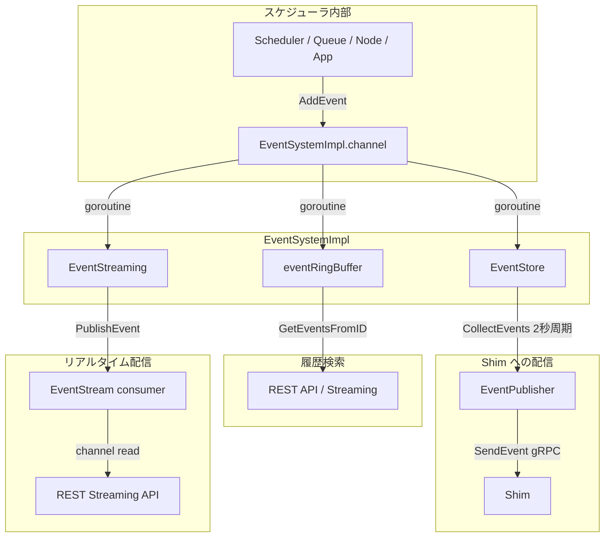

# 第12章 イベントハンドリングと設定管理

> 本章で読むソース:
>
> - [pkg/handler/event_handlers.go L19-L28](https://github.com/apache/yunikorn-core/blob/v1.8.0/pkg/handler/event_handlers.go#L19-L28)
> - [pkg/common/configs/config.go L19-L221](https://github.com/apache/yunikorn-core/blob/v1.8.0/pkg/common/configs/config.go#L19-L221)
> - [pkg/common/configs/configs.go L19-L140](https://github.com/apache/yunikorn-core/blob/v1.8.0/pkg/common/configs/configs.go#L19-L140)
> - [pkg/common/configs/configvalidator.go L19-L893](https://github.com/apache/yunikorn-core/blob/v1.8.0/pkg/common/configs/configvalidator.go#L19-L893)
> - [pkg/events/event_system.go L19-L313](https://github.com/apache/yunikorn-core/blob/v1.8.0/pkg/events/event_system.go#L19-L313)
> - [pkg/events/event_store.go L19-L95](https://github.com/apache/yunikorn-core/blob/v1.8.0/pkg/events/event_store.go#L19-L95)
> - [pkg/events/event_streaming.go L19-L199](https://github.com/apache/yunikorn-core/blob/v1.8.0/pkg/events/event_streaming.go#L19-L199)
> - [pkg/events/event_publisher.go L19-L75](https://github.com/apache/yunikorn-core/blob/v1.8.0/pkg/events/event_publisher.go#L19-L75)
> - [pkg/events/event_ringbuffer.go L19-L265](https://github.com/apache/yunikorn-core/blob/v1.8.0/pkg/events/event_ringbuffer.go#L19-L265)

## この章の狙い

YuniKorn core は内部で2種類のイベントを扱う。
ひとつはスケジューラの動作を駆動する制御イベント（第11章で見た RM イベント）、もうひとつはスケジューラの状態変化を外部に通知する観測イベントである。
本章では `EventHandler` インターフェースによる制御イベントの配線と、`EventSystem` による観測イベントの格納・配信の仕組みを読み解く。
あわせて設定のロードとバリデーション、実行時の設定リロードも扱う。

## 前提

- 第11章で `RMProxy` と `scheduler-interface` のイベント種別を読んでいる。
- 第10章で `ClusterContext` がイベントを処理する流れを知っている。

## EventHandler と EventHandlers

`EventHandler` インターフェースは `HandleEvent(ev interface{})` ひとつだけのシンプルな契約である。

[pkg/handler/event_handlers.go L21-L28](https://github.com/apache/yunikorn-core/blob/v1.8.0/pkg/handler/event_handlers.go#L21-L28)

```go
type EventHandler interface {
    HandleEvent(ev interface{})
}

type EventHandlers struct {
    RMProxyEventHandler   EventHandler
    SchedulerEventHandler EventHandler
}
```

`EventHandlers` 構造体は2つのハンドラを束ねる。
起動時に `RMProxyEventHandler` には `RMProxy` が、`SchedulerEventHandler` には `Scheduler` が設定される。
`RMProxy` は `Scheduler` の `HandleEvent` にイベントを送る。
両者は互いの参照を持ち、イベントを双方向に送れる。
`interface{}` を使うことで、イベントの型を増やしてもインターフェースの変更が不要になっている。

## イベントキューの構造

`RMProxy` と `EventSystemImpl` はどちらもチャネルをイベントキューとして使う。

[pkg/rmproxy/rmproxy.go L77](https://github.com/apache/yunikorn-core/blob/v1.8.0/pkg/rmproxy/rmproxy.go#L77)

```go
	pendingRMEvents:       make(chan interface{}, 1024*1024),
```

[pkg/events/event_system.go L150](https://github.com/apache/yunikorn-core/blob/v1.8.0/pkg/events/event_system.go#L150)

```go
		channel:       make(chan *si.EventRecord, configs.DefaultEventChannelSize),
```

`DefaultEventChannelSize` は100,000である。

[pkg/common/configs/configs.go L48](https://github.com/apache/yunikorn-core/blob/v1.8.0/pkg/common/configs/configs.go#L48)

```go
	DefaultEventChannelSize        = 100000
```

両者のチャネルは役割が異なる。
`RMProxy` のチャネルは制御イベント（アロケーション、アプリケーション、ノードの更新）を運ぶ。
`EventSystemImpl` のチャネルは観測イベント（`si.EventRecord`）を運ぶ。
制御イベントはスケジューラの動作に直結するため取りこぼしに `DPanic` で警告し、観測イベントはチャネル満杯時にドロップしてもスケジューリング自体は止まらない。

## 設定のデータ構造

YuniKorn のスケジューラ設定は YAML で記述され、`SchedulerConfig` 構造体にデコードされる。

[pkg/common/configs/config.go L37-L40](https://github.com/apache/yunikorn-core/blob/v1.8.0/pkg/common/configs/config.go#L37-L40)

```go
type SchedulerConfig struct {
    Partitions []PartitionConfig
    Checksum   string `yaml:",omitempty" json:",omitempty"`
}
```

`PartitionConfig` はパーティションごとの設定を保持する。

[pkg/common/configs/config.go L49-L57](https://github.com/apache/yunikorn-core/blob/v1.8.0/pkg/common/configs/config.go#L49-L57)

```go
type PartitionConfig struct {
    Name              string
    Queues            []QueueConfig
    PlacementRules    []PlacementRule           `yaml:",omitempty" json:",omitempty"`
    Limits            []Limit                   `yaml:",omitempty" json:",omitempty"`
    Preemption        PartitionPreemptionConfig `yaml:",omitempty" json:",omitempty"`
    NodeSortPolicy    NodeSortingPolicy         `yaml:",omitempty" json:",omitempty"`
    UserGroupResolver UserGroupResolver         `yaml:",omitempty" json:",omitempty"`
}
```

各パーティションはキュー階層、配置ルール、リミット、プリエンプション設定、ノードソートポリシーを持つ。
`QueueConfig` は再帰的に子キューを持ち、ツリー構造を形成する。

[pkg/common/configs/config.go L77-L88](https://github.com/apache/yunikorn-core/blob/v1.8.0/pkg/common/configs/config.go#L77-L88)

```go
type QueueConfig struct {
    Name            string
    Parent          bool              `yaml:",omitempty" json:",omitempty"`
    Resources       Resources         `yaml:",omitempty" json:",omitempty"`
    MaxApplications uint64            `yaml:",omitempty" json:",omitempty"`
    Properties      map[string]string `yaml:",omitempty" json:",omitempty"`
    AdminACL        string            `yaml:",omitempty" json:",omitempty"`
    SubmitACL       string            `yaml:",omitempty" json:",omitempty"`
    ChildTemplate   ChildTemplate     `yaml:",omitempty" json:",omitempty"`
    Queues          []QueueConfig     `yaml:",omitempty" json:",omitempty"`
    Limits          []Limit           `yaml:",omitempty" json:",omitempty"`
}
```

## 設定のロードとバリデーション

設定 YAML の読み込みは `LoadSchedulerConfigFromByteArray` が入口である。

[pkg/common/configs/config.go L161-L169](https://github.com/apache/yunikorn-core/blob/v1.8.0/pkg/common/configs/config.go#L161-L169)

```go
func LoadSchedulerConfigFromByteArray(content []byte) (*SchedulerConfig, error) {
    conf, err := ParseAndValidateConfig(content)
    if err != nil {
        return nil, err
    }
    SetChecksum(content, conf)
    return conf, err
}
```

処理は3段階で進む。

1. **パース**: YAML デコーダで `SchedulerConfig` にデコードする。`KnownFields(true)` で未知のフィールドを検出する。
2. **バリデーション**: `Validate` 関数で構造の正当性を検査する。
3. **チェックサム**: SHA-256 で設定の内容ハッシュを計算し、リロード時の差分検出に使う。

`Validate` 関数は多段階の検査を実行する。

[pkg/common/configs/configvalidator.go L757-L815](https://github.com/apache/yunikorn-core/blob/v1.8.0/pkg/common/configs/configvalidator.go#L757-L815)

```go
func Validate(newConfig *SchedulerConfig) error {
    // ... パーティションの重複チェック
    for i := range newConfig.Partitions {
        partition := newConfig.Partitions[i]
        // ...
        err := checkQueuesStructure(&partition)
        err = checkLimitsStructure(&partition)
        err = checkQueues(&partition.Queues[0], 1)
        _, err = checkQueueResource(partition.Queues[0], nil)
        err = checkPlacementRules(&partition)
        err = checkNodeSortingPolicy(&partition)
        err = checkQueueMaxApplications(partition.Queues[0])
        err = checkLimitResource(...)
        err = checkLimitMaxApplications(...)
    }
    return nil
}
```

バリデーションは次の項目を検査する。

- パーティション名の一意性
- キュー構造（root キューの存在、名前の正規表現適合、重複チェック）
- リソースの整合性（guaranteed ≤ max、親と子のリソース関係）
- 配置ルールの構文とキュー階層との整合性
- ノードソートポリシーの有効性
- `maxApplications` の親子関係
- ユーザー・グループリミットの整合性

バリデーションに失敗した設定は拒否され、既存の設定が維持される。
これは実行中のスケジューラに不正な設定が適用されることを防ぐ。

## 設定の差分検出とリロード

設定のリロード時に、`ClusterContext` はチェックサムで差分を検出し、変更がなければ更新をスキップする。

[pkg/scheduler/context.go L232-L239](https://github.com/apache/yunikorn-core/blob/v1.8.0/pkg/scheduler/context.go#L232-L239)

```go
// skip update if config has not changed
oldConf := configs.ConfigContext.Get(cc.policyGroup)
if conf.Checksum == oldConf.Checksum {
    event.Channel <- &rmevent.Result{
        Succeeded: true,
    }
    return
}
```

チェックサムは YAML の内容から計算される。
`GetConfigurationString` 関数は既存のチェックサム行を除去してからハッシュを計算するため、設定内容が変わらなければ同じハッシュになる。

[pkg/common/configs/config.go L196-L208](https://github.com/apache/yunikorn-core/blob/v1.8.0/pkg/common/configs/config.go#L196-L208)

```go
func GetConfigurationString(requestBytes []byte) string {
    conf := string(requestBytes)
    checksum := "checksum: "
    checksumLength := 64 + len(checksum)
    if strings.Contains(conf, checksum) {
        checksum += strings.Split(conf, checksum)[1]
        checksum = strings.TrimRight(checksum, "\n")
        if len(checksum) > checksumLength {
            checksum = checksum[:checksumLength]
        }
    }
    return strings.ReplaceAll(conf, checksum, "")
}
```

## ConfigMap とコールバック機構

`configs` パッケージはグローバルな `configMap` を保持し、実行時の設定変更に反応するコールバック機構を提供する。

[pkg/common/configs/configs.go L56-L72](https://github.com/apache/yunikorn-core/blob/v1.8.0/pkg/common/configs/configs.go#L56-L72)

```go
var configMap map[string]string
var configMapCallbacks map[string]func()
var configMapLock locking.RWMutex

func init() {
    configMap = make(map[string]string)
    configMapCallbacks = make(map[string]func())
    ConfigContext = &SchedulerConfigContext{
        configs: make(map[string]*SchedulerConfig),
        lock:    &locking.RWMutex{},
    }
    AddConfigMapCallback("logging", func() {
        log.UpdateLoggingConfig(GetConfigMap())
    })
}
```

`SetConfigMap` が呼ばれると、登録されたコールバックが全て実行される。
デフォルトではロギング設定の更新コールバックが登録されている。
`EventSystemImpl` や `HealthChecker` も自身のコールバックを登録し、キャパシティやチェック間隔の変更に対応する。

[pkg/common/configs/configs.go L114-L130](https://github.com/apache/yunikorn-core/blob/v1.8.0/pkg/common/configs/configs.go#L114-L130)

```go
func SetConfigMap(newConfigMap map[string]string) {
    defer processConfigMapCallbacks()
    configMapLock.Lock()
    defer configMapLock.Unlock()
    if newConfigMap == nil {
        newConfigMap = make(map[string]string)
    }
    configMap = newConfigMap
}

func processConfigMapCallbacks() {
    for _, callback := range getConfigMapCallbacks() {
        callback()
    }
}
```

コールバックは `SetConfigMap` の `defer` で実行されるため、ロック解放後に走る。
これによりコールバック内で再度ロックを取得してもデッドロックにならない。

## EventSystem: 観測イベントの基盤

`EventSystem` はスケジューラの内部状態変化を記録する観測イベントの基盤である。

[pkg/events/event_system.go L39-L78](https://github.com/apache/yunikorn-core/blob/v1.8.0/pkg/events/event_system.go#L39-L78)

```go
type EventSystem interface {
    AddEvent(event *si.EventRecord)
    StartService()
    Stop()
    IsEventTrackingEnabled() bool
    GetEventsFromID(id, count uint64) ([]*si.EventRecord, uint64, uint64)
    CreateEventStream(name string, count uint64) *EventStream
    RemoveStream(*EventStream)
    GetEventStreams() []EventStreamData
}
```

`EventSystemImpl` は4つのサブコンポーネントで構成される。

[pkg/events/event_system.go L81-L97](https://github.com/apache/yunikorn-core/blob/v1.8.0/pkg/events/event_system.go#L81-L97)

```go
type EventSystemImpl struct {
    eventSystemId string
    Store         *EventStore
    publisher     *EventPublisher
    eventBuffer   *eventRingBuffer
    streaming     *EventStreaming

    channel chan *si.EventRecord
    stop    chan bool
    stopped bool

    trackingEnabled    bool
    requestCapacity    uint64
    ringBufferCapacity uint64

    locking.RWMutex
}
```

- **`EventStore`**: shim への公開用。一定期間のイベントを蓄積し、`EventPublisher` が定期的に収集して shim に送る。
- **`eventRingBuffer`**: 履歴検索用。リングバッファで直近のイベントを保持し、ID 指定での取得を可能にする。
- **`EventStreaming`**: リアルタイム配信用。イベントが発生するたびに全ストリーミングクライアントに即座に配信する。
- **`EventPublisher`**: `EventStore` からイベントを収集し、shim のプラグイン経由で送信する。

## イベントの生成と記録

スケジューラの各コンポーネントは、状態変化が起きたときに `AddEvent` を呼ぶ。

[pkg/events/event_system.go L224-L237](https://github.com/apache/yunikorn-core/blob/v1.8.0/pkg/events/event_system.go#L224-L237)

```go
func (ec *EventSystemImpl) AddEvent(event *si.EventRecord) {
    if event != nil {
        event.Message = truncateEventMessage(event.Message)
    }
    metrics.GetEventMetrics().IncEventsCreated()
    select {
    case ec.channel <- event:
        metrics.GetEventMetrics().IncEventsChanneled()
    default:
        log.Log(log.Events).Debug("could not add Event to channel")
        metrics.GetEventMetrics().IncEventsNotChanneled()
    }
}
```

`truncateEventMessage` はメッセージを1024文字に切り詰める。
これは Kubernetes のイベントメッセージ上限に合わせるためである。

[pkg/events/event_system.go L240-L246](https://github.com/apache/yunikorn-core/blob/v1.8.0/pkg/events/event_system.go#L240-L246)

```go
func truncateEventMessage(message string) string {
    const k8sEventMessageLimit = 1024
    if len(message) <= k8sEventMessageLimit {
        return message
    }
    return message[:k8sEventMessageLimit-3] + "..."
}
```

チャネルに送られたイベントはバックグラウンド goroutine で3つの保存先に配分される。

[pkg/events/event_system.go L179-L197](https://github.com/apache/yunikorn-core/blob/v1.8.0/pkg/events/event_system.go#L179-L197)

```go
go func() {
    log.Log(log.Events).Info("Starting event system handler")
    for {
        select {
        case <-ec.stop:
            return
        case event, ok := <-ec.channel:
            if !ok {
                return
            }
            if event != nil {
                ec.Store.Store(event)
                ec.eventBuffer.Add(event)
                ec.streaming.PublishEvent(event)
                metrics.GetEventMetrics().IncEventsProcessed()
            }
        }
    }
}()
```

単一の goroutine で3つの保存先に順番に書き込むことで、イベントの順序が保存先間で一致する。

## EventStore と EventPublisher

`EventStore` は shim に公開するイベントを一時的に蓄える。

[pkg/events/event_store.go L36-L64](https://github.com/apache/yunikorn-core/blob/v1.8.0/pkg/events/event_store.go#L36-L64)

```go
type EventStore struct {
    events   []*si.EventRecord
    idx      uint64
    size     uint64
    lastSize uint64
    locking.RWMutex
}

func (es *EventStore) Store(event *si.EventRecord) {
    es.Lock()
    defer es.Unlock()
    if es.idx == uint64(len(es.events)) {
        metrics.GetEventMetrics().IncEventsNotStored()
        return
    }
    es.events[es.idx] = event
    es.idx++
    metrics.GetEventMetrics().IncEventsStored()
}
```

`EventStore` は固定長のスライスで、`idx` が `size` に達するとそれ以降のイベントは捨てる。
`CollectEvents` で全イベントを一括取得し、`idx` を0にリセットする。

[pkg/events/event_store.go L66-L82](https://github.com/apache/yunikorn-core/blob/v1.8.0/pkg/events/event_store.go#L66-L82)

```go
func (es *EventStore) CollectEvents() []*si.EventRecord {
    es.Lock()
    defer es.Unlock()
    messages := make([]*si.EventRecord, len(es.events[:es.idx]))
    copy(messages, es.events[:es.idx])
    if es.size != es.lastSize {
        log.Log(log.Events).Info("Resizing event store",
            zap.Uint64("last", es.lastSize), zap.Uint64("new", es.size))
        es.events = make([]*si.EventRecord, es.size)
    }
    es.idx = 0
    es.lastSize = es.size
    metrics.GetEventMetrics().AddEventsCollected(len(messages))
    return messages
}
```

`EventPublisher` は2秒ごとに `CollectEvents` を呼び、shim のプラグイン経由でイベントを送信する。

[pkg/events/event_publisher.go L48-L66](https://github.com/apache/yunikorn-core/blob/v1.8.0/pkg/events/event_publisher.go#L48-L66)

```go
func (sp *EventPublisher) StartService() {
    log.Log(log.Events).Info("Starting shim event publisher")
    go func() {
        for {
            select {
            case <-sp.stop:
                return
            case <-time.After(sp.pushEventInterval):
                messages := sp.store.CollectEvents()
                if len(messages) > 0 {
                    if eventPlugin := plugins.GetResourceManagerCallbackPlugin(); eventPlugin != nil {
                        log.Log(log.Events).Debug("Sending eventChannel",
                            zap.Int("number of messages", len(messages)))
                        eventPlugin.SendEvent(messages)
                    }
                }
            }
        }
    }()
}
```

`defaultPushEventInterval` は2秒である。

[pkg/events/event_publisher.go L31](https://github.com/apache/yunikorn-core/blob/v1.8.0/pkg/events/event_publisher.go#L31)

```go
var defaultPushEventInterval = 2 * time.Second
```

## eventRingBuffer: 履歴検索用のリングバッファ

`eventRingBuffer` は観測イベントの履歴を保持する特殊なリングバッファである。

[pkg/events/event_ringbuffer.go L45-L55](https://github.com/apache/yunikorn-core/blob/v1.8.0/pkg/events/event_ringbuffer.go#L45-L55)

```go
type eventRingBuffer struct {
	events       []*si.EventRecord
	capacity     uint64 // capacity of the buffer
	head         uint64 // position of the next element (no tail since we don't remove elements)
	full         bool   // indicates whether the buffer if full - once it is, it stays full unless the buffer is resized
	id           uint64 // unique id of an event record
	lowestId     uint64 // lowest id of an event record available in the buffer at any given time
	resizeOffset uint64 // used to aid the calculation of id->pos after resize (see id2pos)

	locking.RWMutex
}
```

各イベントには連番の ID が振られる。
バッファが一杯になると最古のイベントを上書きし、`lowestId` を進める。
`GetEventsFromID` は ID 指定でイベントを取得でき、クライアントは前回取得した最後の ID を指定して差分を取得できる。

## EventStreaming: リアルタイム配信

`EventStreaming` はイベントをリアルタイムでストリーミングクライアントに配信する。

[pkg/events/event_streaming.go L68-L81](https://github.com/apache/yunikorn-core/blob/v1.8.0/pkg/events/event_streaming.go#L68-L81)

```go
func (e *EventStreaming) PublishEvent(event *si.EventRecord) {
    e.Lock()
    defer e.Unlock()
    for consumer, details := range e.eventStreams {
        if len(details.local) == defaultChannelBufSize {
            log.Log(log.Events).Warn("Listener buffer full due to potentially slow consumer, removing it")
            e.removeEventStream(consumer)
            continue
        }
        details.local <- event
    }
}
```

各コンシューマは `local` チャネル（バッファ1000）と `consumer` チャネルの2段階のチャネルを持つ。
`local` が満杯のコンシューマは遅延消费者とみなされ、自動的に削除される。
これは1つの遅いコンシューマが全ストリーミングを停止させるのを防ぐ。

## イベントフローの全体像



観測イベントは3つの経路で外部に届く。

1. **EventPublisher 経由**: 2秒ごとのバッチで shim に送信。Kubernetes のイベントオブジェクトに変換される。
2. **eventRingBuffer 経由**: REST API から ID 指定で履歴を取得。
3. **EventStreaming 経由**: REST ストリーミング API でリアルタイムにイベントを受信。

## 最適化: 3経路の分離によるバックプレッシャの隔離

イベントシステムは3つの保存先（`EventStore`、`eventRingBuffer`、`EventStreaming`）に同じイベントを配信するが、それぞれの失敗が他に伝わらない設計になっている。

`EventStore` が一杯になれば `IncEventsNotStored` メトリクスを増やすだけで、リングバッファへの書き込みは続く。
`EventStreaming` のコンシューマが遅ければそのコンシューマだけを削除し、他のコンシューマや `EventStore` には影響しない。

この分離により、shim の応答遅延や REST API クライアントの切断がスケジューラのコア機能（スケジューリングループ）に影響を与えない。
観測イベントの配信経路はスケジューラの動作から完全に切り離されている。

## まとめ

本章で読んだイベントハンドリングと設定管理の仕組みをまとめる。

- **`EventHandler` インターフェース**: `HandleEvent` ひとつだけのシンプルな契約で、`RMProxy` と `ClusterContext` の双方向通信を可能にする。
- **設定のバリデーション**: YAML のパース後にキュー構造、リソース整合性、配置ルール、リミットを多段階で検査する。不正な設定は拒否され既存設定が維持される。
- **チェックサムによる差分検出**: SHA-256 ハッシュで設定内容の変化を検出し、変更がなければリロードをスキップする。
- **`EventSystemImpl`**: 観測イベントを3つの保存先（`EventStore`、`eventRingBuffer`、`EventStreaming`）に配信する。それぞれの失敗が他に波及しない。
- **`EventPublisher`**: 2秒周期で `EventStore` からイベントを収集し、shim の `SendEvent` コールバックで送信する。

## 関連する章

- 第11章: RMProxy と scheduler-interface
- 第13章: パーティション管理
