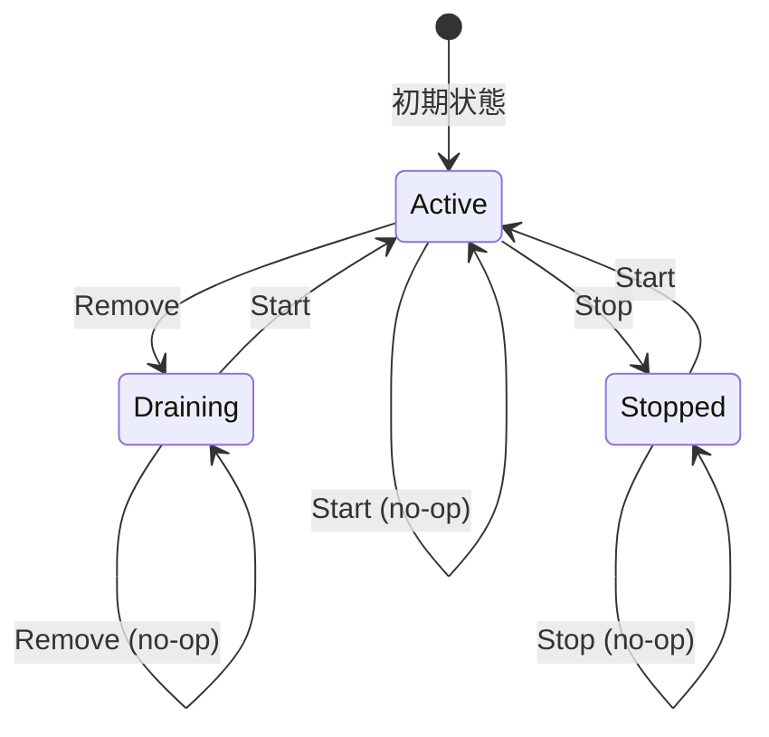
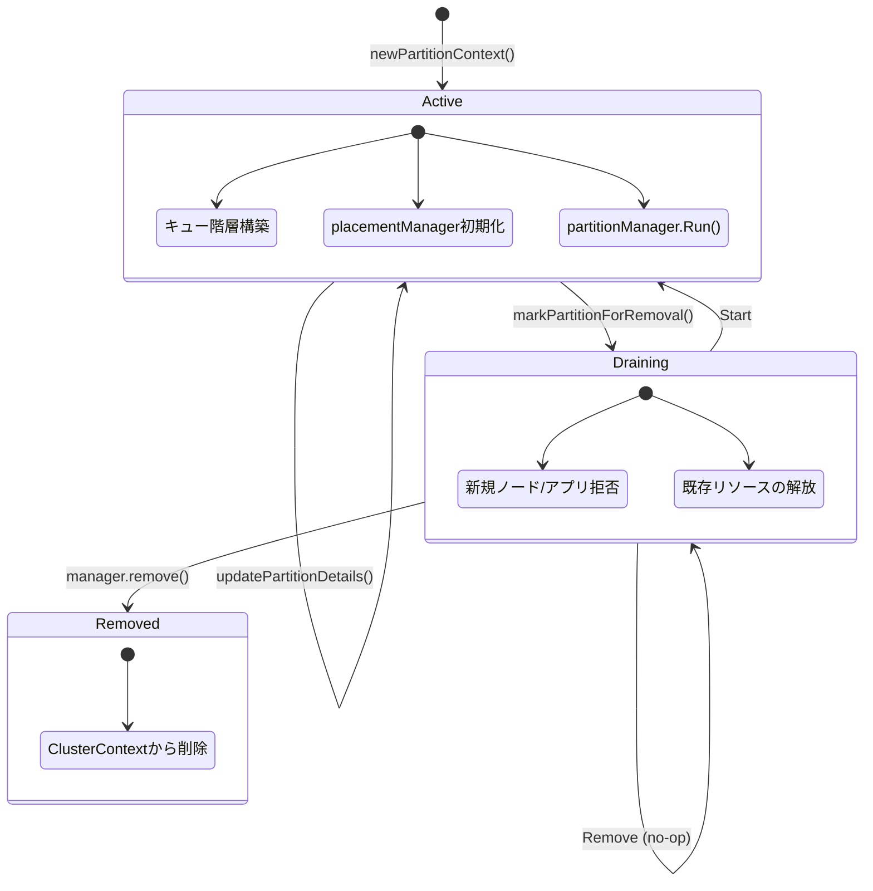

# 第13章 パーティション管理

> 本章で読むソース:
>
> - [pkg/scheduler/partition.go L19-L1275](https://github.com/apache/yunikorn-core/blob/v1.8.0/pkg/scheduler/partition.go#L19-L1275)
> - [pkg/scheduler/partition_manager.go L19-L185](https://github.com/apache/yunikorn-core/blob/v1.8.0/pkg/scheduler/partition_manager.go#L19-L185)
> - [pkg/scheduler/health_checker.go L19-L343](https://github.com/apache/yunikorn-core/blob/v1.8.0/pkg/scheduler/health_checker.go#L19-L343)
> - [pkg/scheduler/context.go L19-L894](https://github.com/apache/yunikorn-core/blob/v1.8.0/pkg/scheduler/context.go#L19-L894)
> - [pkg/scheduler/objects/object_state.go L19-L89](https://github.com/apache/yunikorn-core/blob/v1.8.0/pkg/scheduler/objects/object_state.go#L19-L89)

## この章の狙い

YuniKorn のスケジューラはパーティション単位でリソースを管理する。
`PartitionContext` はキュー階層、ノード、アプリケーションを束ね、スケジューリングの単位となる。
本章では `PartitionContext` の状態機械、`partitionManager` によるライフサイクル管理、`HealthChecker` による健全性監視、そして `ClusterContext` との関係を理解する。

## 前提

- 第10章で `ClusterContext` のスケジューリングループを読んでいる。
- 第11章で `RMProxy` からスケジューラへのイベントフローを理解している。
- 第12章で設定のロードとバリデーションの仕組みを知っている。

## PartitionContext の構造

`PartitionContext` は1つのパーティションに属するすべてのスケジューリング状態を保持する。

[pkg/scheduler/partition.go L48-L82](https://github.com/apache/yunikorn-core/blob/v1.8.0/pkg/scheduler/partition.go#L48-L82)

```go
type PartitionContext struct {
	RmID string // the RM the partition belongs to
	Name string // name of the partition

	// Private fields need protection
	root                   *objects.Queue                  // start of the queue hierarchy
	applications           map[string]*objects.Application // applications assigned to this partition
	completedApplications  map[string]*objects.Application // completed applications from this partition
	rejectedApplications   map[string]*objects.Application // rejected applications from this partition
	nodes                  objects.NodeCollection          // nodes assigned to this partition
	placementManager       *placement.AppPlacementManager  // placement manager for this partition
	partitionManager       *partitionManager               // manager for this partition
	stateMachine           *fsm.FSM                        // the state of the partition for scheduling
	stateTime              time.Time                       // last time the state was updated (needed for cleanup)
	userGroupCache         *security.UserGroupCache        // user cache per partition
	totalPartitionResource *resources.Resource             // Total node resources
	allocations            int                             // Number of allocations on the partition
	reservations           int                             // number of reservations
	placeholderAllocations int                             // number of placeholder allocations
	preemptionEnabled      bool                            // whether preemption is enabled or not
	quotaPreemptionEnabled bool                            // whether quota preemption is enabled or not
	foreignAllocs          map[string]*objects.Allocation  // foreign (non-Yunikorn) allocations
	appQueueMapping        *objects.AppQueueMapping        // appID mapping to queues

	// The partition write lock must not be held while manipulating an application.
	// Scheduling is running continuously as a lock free background task. Scheduling an application
	// acquires a write lock of the application object. While holding the write lock a list of nodes is
	// requested from the partition. This requires a read lock on the partition.
	// If the partition write lock is held while manipulating an application a dead lock could occur.
	// Since application objects handle their own locks there is no requirement to hold the partition lock
	// while manipulating the application.
	// Similarly adding, updating or removing a node or a queue should only hold the partition write lock
	// while manipulating the partition information not while manipulating the underlying objects.
	locking.RWMutex
}
```

主要なフィールドを整理する。

- **`root`**: キュー階層のルート。以下に子キューがツリー状に広がる。
- **`applications`**: 現在アクティブなアプリケーションのマップ。
- **`completedApplications`** / **`rejectedApplications`**: 完了・拒否されたアプリケーションの追跡用。
- **`nodes`**: このパーティションに属するノードのコレクション。
- **`placementManager`**: アプリケーションをキューに配置するルールエンジン。
- **`stateMachine`**: パーティションの状態（Active / Draining / Stopped）を管理する有限状態機械。
- **`totalPartitionResource`**: パーティション全体の総リソース量。全ノードのリソース合計。
- **`partitionManager`**: キューのクリーンアップや期限切れアプリの削除を担うバックグラウンドマネージャ。

## 状態機械

パーティションの状態遷移は `looplab/fsm` ライブラリで実装された有限状態機械で管理される。

[pkg/scheduler/objects/object_state.go L34-L89](https://github.com/apache/yunikorn-core/blob/v1.8.0/pkg/scheduler/objects/object_state.go#L34-L89)

```go
type ObjectEvent int

const (
    Remove ObjectEvent = iota
    Start
    Stop
)

type ObjectState int

const (
    Active ObjectState = iota
    Draining
    Stopped
)

func NewObjectState() *fsm.FSM {
    return fsm.NewFSM(
        Active.String(), fsm.Events{
            {
                Name: Remove.String(),
                Src:  []string{Active.String(), Draining.String()},
                Dst:  Draining.String(),
            }, {
                Name: Start.String(),
                Src:  []string{Active.String(), Stopped.String(), Draining.String()},
                Dst:  Active.String(),
            }, {
                Name: Stop.String(),
                Src:  []string{Active.String(), Stopped.String()},
                Dst:  Stopped.String(),
            },
        },
        fsm.Callbacks{
            "enter_state": func(_ context.Context, event *fsm.Event) {
                log.Log(log.SchedFSM).Info("object transition",
                    zap.Any("object", event.Args[0]),
                    zap.String("source", event.Src),
                    zap.String("destination", event.Dst),
                    zap.String("event", event.Event))
            },
        },
    )
}
```

状態は3つ、イベントは3種類である。



- **Active**: 通常状態。ノードとアプリケーションの追加・スケジューリングが可能。
- **Draining**: 削除準備状態。新しいノード・アプリケーションの追加を拒否する。既存のアプリケーションとノードの解放を進める。
- **Stopped**: 停止状態。スケジューリングループがこのパーティションをスキップする。

`Remove` イベントは `Active` と `Draining` の両方から `Draining` に遷移する。
つまり `Remove` を複数回呼んでも状態は変わらない。
これは `markPartitionForRemoval` が複数回呼ばれても安全であることを意味する。

[pkg/scheduler/partition.go L267-L273](https://github.com/apache/yunikorn-core/blob/v1.8.0/pkg/scheduler/partition.go#L267-L273)

```go
func (pc *PartitionContext) markPartitionForRemoval() {
    if err := pc.handlePartitionEvent(objects.Remove); err != nil {
        log.Log(log.SchedPartition).Error("failed to mark partition for deletion",
            zap.String("partitionName", pc.Name),
            zap.Error(err))
    }
}
```

## パーティションの初期化

`newPartitionContext` は設定からパーティションを構築する。

[pkg/scheduler/partition.go L84-L109](https://github.com/apache/yunikorn-core/blob/v1.8.0/pkg/scheduler/partition.go#L84-L109)

```go
func newPartitionContext(conf configs.PartitionConfig, rmID string, cc *ClusterContext,
    silence bool) (*PartitionContext, error) {
    if conf.Name == "" || rmID == "" {
        return nil, fmt.Errorf("partition cannot be created without name or RM, one is not set")
    }
    pc := &PartitionContext{
        Name:                  conf.Name,
        RmID:                  rmID,
        stateMachine:          objects.NewObjectState(),
        stateTime:             time.Now(),
        applications:          make(map[string]*objects.Application),
        completedApplications: make(map[string]*objects.Application),
        nodes:                 objects.NewNodeCollection(conf.Name),
        foreignAllocs:         make(map[string]*objects.Allocation),
        appQueueMapping:       objects.NewAppQueueMapping(),
    }
    pc.partitionManager = newPartitionManager(pc, cc)
    if err := pc.initialPartitionFromConfig(conf, silence); err != nil {
        return nil, err
    }
    return pc, nil
}
```

`initialPartitionFromConfig` でキュー階層を構築し、配置ルールマネージャ、ユーザーグループキャッシュ、ノードソートポリシー、プリエンプション設定を初期化する。

[pkg/scheduler/partition.go L113-L149](https://github.com/apache/yunikorn-core/blob/v1.8.0/pkg/scheduler/partition.go#L113-L149)

```go
func (pc *PartitionContext) initialPartitionFromConfig(conf configs.PartitionConfig,
    silence bool) error {
    if len(conf.Queues) == 0 || conf.Queues[0].Name != configs.RootQueue {
        return fmt.Errorf("partition cannot be created without root queue")
    }
    queueConf := conf.Queues[0]
    var err error
    if pc.root, err = objects.NewConfiguredQueue(queueConf, nil, silence, pc.appQueueMapping); err != nil {
        return err
    }
    if err = pc.addQueue(queueConf.Queues, pc.root, silence); err != nil {
        return err
    }
    pc.placementManager = placement.NewPlacementManager(conf.PlacementRules, pc.GetQueue, silence)
    pc.userGroupCache = security.GetUserGroupCache(conf.UserGroupResolver, security.GetConfigReader(), security.GetLdapAccess())
    pc.updateNodeSortingPolicy(conf, silence)
    pc.updatePreemption(conf)
    if !silence {
        return ugm.GetUserManager().UpdateConfig(queueConf, conf.Queues[0].Name)
    }
    return nil
}
```

## partitionManager: ライフサイクル管理

`partitionManager` はパーティションのバックグラウンドメンテナンスを担う。

[pkg/scheduler/partition_manager.go L35-L53](https://github.com/apache/yunikorn-core/blob/v1.8.0/pkg/scheduler/partition_manager.go#L35-L53)

```go
type partitionManager struct {
    pc                       *PartitionContext
    cc                       *ClusterContext
    stopCleanRoot            chan struct{}
    stopCleanExpiredApps     chan struct{}
    cleanRootInterval        time.Duration
    cleanExpiredAppsInterval time.Duration
}
```

`Run` メソッドで2つのバックグラウンド goroutine を起動する。

[pkg/scheduler/partition_manager.go L62-L68](https://github.com/apache/yunikorn-core/blob/v1.8.0/pkg/scheduler/partition_manager.go#L62-L68)

```go
func (manager *partitionManager) Run() {
    log.Log(log.SchedPartition).Info("starting partition manager",
        zap.String("partition", manager.pc.Name),
        zap.Stringer("cleanRootInterval", manager.cleanRootInterval))
    go manager.cleanExpiredApps()
    go manager.cleanRoot()
}
```

- **`cleanRoot`**: 10秒ごとにキュー階層を走査し、空になった削除対象キューを再帰的に削除する。
- **`cleanExpiredApps`**: 24時間ごとに完了・拒否されたアプリケーションのうち `Expired` 状態のものを削除する。

`cleanQueues` は子から親に向かって再帰的に処理する。

[pkg/scheduler/partition_manager.go L102-L132](https://github.com/apache/yunikorn-core/blob/v1.8.0/pkg/scheduler/partition_manager.go#L102-L132)

```go
func (manager *partitionManager) cleanQueues(queue *objects.Queue) {
    if queue == nil {
        return
    }
    if children := queue.GetCopyOfChildren(); len(children) != 0 {
        for _, child := range children {
            manager.cleanQueues(child)
        }
    }
    if queue.IsDraining() || !queue.IsManaged() {
        if queue.IsEmpty() {
            if !queue.RemoveQueue() {
                log.Log(log.SchedPartition).Debug("unexpected failure removing the queue",
                    zap.String("partitionName", manager.pc.Name),
                    zap.String("queue", queue.QueuePath))
            }
        }
    }
}
```

子キューを先に処理してから親キューを削除することで、葉から順に空のキューを取り除く。
`IsDraining()`（設定から削除された）または `!IsManaged()`（動的に作成された）キューが対象で、かつ `IsEmpty()`（割り当てがない）の場合에만削除される。

## パーティションの削除処理

`partitionManager.Stop` はパーティションの完全なクリーンアップを実行する。

[pkg/scheduler/partition_manager.go L92-L98](https://github.com/apache/yunikorn-core/blob/v1.8.0/pkg/scheduler/partition_manager.go#L92-L98)

```go
func (manager *partitionManager) Stop() {
    log.Log(log.SchedPartition).Info("Stopping partition manager",
        zap.String("partition", manager.pc.Name))
    close(manager.stopCleanExpiredApps)
    close(manager.stopCleanRoot)
    manager.remove()
}
```

`remove` メソッドは次の順でクリーンアップを行う。

[pkg/scheduler/partition_manager.go L142-L169](https://github.com/apache/yunikorn-core/blob/v1.8.0/pkg/scheduler/partition_manager.go#L142-L169)

```go
func (manager *partitionManager) remove() {
    // mark all queues for removal
    manager.pc.root.MarkQueueForRemoval()
    // remove applications
    apps := manager.pc.GetApplications()
    for i := range apps {
        _ = apps[i].FailApplication("PartitionRemoved")
        appID := apps[i].ApplicationID
        _ = manager.pc.removeApplication(appID)
    }
    // remove the nodes
    nodes := manager.pc.GetNodes()
    for i := range nodes {
        _, _ = manager.pc.removeNode(nodes[i].NodeID)
    }
    // remove the scheduler object
    manager.cc.removePartition(manager.pc.Name)
}
```

1. 全キューを削除対象としてマークする。
2. 全アプリケーションを失敗状態にして削除する。
3. 全ノードを削除する。
4. `ClusterContext` からパーティションへの参照を外す。

## ClusterContext との連携

`ClusterContext` はパーティションのマップを保持し、スケジューリングループで各パーティションを順に処理する。

[pkg/scheduler/context.go L45-L61](https://github.com/apache/yunikorn-core/blob/v1.8.0/pkg/scheduler/context.go#L45-L61)

```go
type ClusterContext struct {
    partitions     map[string]*PartitionContext
    policyGroup    string
    rmEventHandler handler.EventHandler
    uuid           string

    needPreemption      bool
    reservationDisabled bool

    rmInfo    map[string]*RMInformation
    startTime time.Time

    locking.RWMutex

    lastHealthCheckResult *dao.SchedulerHealthDAOInfo
}
```

`schedule` メソッドは各パーティションに対して予約→プレースホルダ→通常の順でスケジューリングを試みる。

[pkg/scheduler/context.go L120-L157](https://github.com/apache/yunikorn-core/blob/v1.8.0/pkg/scheduler/context.go#L120-L157)

```go
func (cc *ClusterContext) schedule() bool {
    activity := false
    scheduleCycleStart := time.Now()
    for _, psc := range cc.GetPartitionMapClone() {
        if psc.root.GetMaxResource() == nil {
            continue
        }
        if psc.isStopped() {
            continue
        }
        schedulingStart := time.Now()
        result := psc.tryReservedAllocate()
        if result == nil {
            result = psc.tryPlaceholderAllocate()
            if result == nil {
                result = psc.tryAllocate()
            }
        }
        metrics.GetSchedulerMetrics().ObserveSchedulingLatency(schedulingStart)
        if result != nil {
            if result.ResultType == objects.Replaced {
                cc.notifyRMAllocationReleased(psc.RmID, psc.Name,
                    []*objects.Allocation{result.Request.GetRelease()},
                    si.TerminationType_PLACEHOLDER_REPLACED,
                    "replacing allocationKey: "+result.Request.GetAllocationKey())
            } else {
                cc.notifyRMNewAllocation(psc.RmID, result.Request)
            }
            activity = true
        }
    }
    metrics.GetSchedulerMetrics().ObserveSchedulingCycle(scheduleCycleStart)
    return activity
}
```

 stopped パーティションはスキップされる。
リソースがないパーティションもスキップされる。
これにより停止済みや未初期化のパーティションがスケジューリングループの時間を消費しない。

## 設定の更新とパーティション

`updateSchedulerConfig` は設定変更に応じてパーティションの追加・更新・削除を行う。

[pkg/scheduler/context.go L360-L405](https://github.com/apache/yunikorn-core/blob/v1.8.0/pkg/scheduler/context.go#L360-L405)

```go
func (cc *ClusterContext) updateSchedulerConfig(conf *configs.SchedulerConfig, rmID string) error {
    visited := map[string]bool{}
    for _, p := range conf.Partitions {
        partitionName := common.GetNormalizedPartitionName(p.Name, rmID)
        p.Name = partitionName
        part, ok := cc.partitions[p.Name]
        if ok {
            _, err = newPartitionContext(p, rmID, nil, true)
            if err != nil {
                return err
            }
            err = part.updatePartitionDetails(p)
            if err != nil {
                return err
            }
        } else {
            part, err = newPartitionContext(p, rmID, cc, false)
            if err != nil {
                return err
            }
            go part.partitionManager.Run()
            cc.partitions[partitionName] = part
        }
        visited[p.Name] = true
    }
    for _, part := range cc.partitions {
        if !visited[part.Name] {
            part.partitionManager.Stop()
        }
    }
    return nil
}
```

既存パーティションは `updatePartitionDetails` で設定を更新する。
新規パーティションは `newPartitionContext` で生成し、`partitionManager.Run` を起動する。
設定からなくなったパーティションは `partitionManager.Stop` で停止する。

更新前に `newPartitionContext` を `silence=true` で呼び出し、設定の正当性を事前検証している。
検証に失敗すれば既存の設定は一切変更されない。

## HealthChecker: 健全性監視

`HealthChecker` はスケジューラの健全性を定期的に検査する。

[pkg/scheduler/health_checker.go L36-L46](https://github.com/apache/yunikorn-core/blob/v1.8.0/pkg/scheduler/health_checker.go#L36-L46)

```go
type HealthChecker struct {
    context       *ClusterContext
    confWatcherId string

    stopChan *chan struct{}
    period   time.Duration
    enabled  bool

    locking.RWMutex
}
```

`runOnce` は1回の健全性検査を実行する。

[pkg/scheduler/health_checker.go L169-L186](https://github.com/apache/yunikorn-core/blob/v1.8.0/pkg/scheduler/health_checker.go#L169-L186)

```go
func (c *HealthChecker) runOnce() {
    schedulerMetrics := metrics.GetSchedulerMetrics()
    result := GetSchedulerHealthStatus(schedulerMetrics, c.context)
    updateSchedulerLastHealthStatus(&result, c.context)
    if !result.Healthy {
        for _, v := range result.HealthChecks {
            if v.Succeeded {
                continue
            }
            log.Log(log.SchedHealth).Warn("Scheduler is not healthy",
                zap.String("name", v.Name),
                zap.String("description", v.Description),
                zap.String("message", v.DiagnosisMessage))
        }
    } else {
        log.Log(log.SchedHealth).Debug("Scheduler is healthy")
    }
}
```

`GetSchedulerHealthStatus` は複数の検査項目を評価する。

[pkg/scheduler/health_checker.go L192-L208](https://github.com/apache/yunikorn-core/blob/v1.8.0/pkg/scheduler/health_checker.go#L192-L208)

```go
func GetSchedulerHealthStatus(metrics *metrics.SchedulerMetrics,
    schedulerContext *ClusterContext) dao.SchedulerHealthDAOInfo {
    var healthInfo []dao.HealthCheckInfo
    healthInfo = append(healthInfo, checkSchedulingErrors(metrics))
    healthInfo = append(healthInfo, checkFailedNodes(metrics))
    healthInfo = append(healthInfo, checkSchedulingContext(schedulerContext)...)
    healthy := true
    for _, h := range healthInfo {
        if !h.Succeeded {
            healthy = false
            break
        }
    }
    return dao.SchedulerHealthDAOInfo{
        Healthy:      healthy,
        HealthChecks: healthInfo,
    }
}
```

検査項目は次の通りである。

- **スケジューリングエラー**: メトリクスにエラーが記録されていないか。
- **失敗ノード**: 失敗したノードが記録されていないか。
- **負のリソース**: パーティションやノードに負のリソースがないか。
- **リソースの整合性**: パーティションの総リソースがノードのリソース合計と一致するか。
- **ノードのリソース整合性**: `allocated + occupied + available == capacity` が成り立つか。
- **オーファンアロケーション**: ノードやアプリケーションに孤立したアロケーションがないか。

`checkSchedulingContext` は全パーティションの全ノードを走査し、リソースの整合性を詳細に検査する。

[pkg/scheduler/health_checker.go L235-L290](https://github.com/apache/yunikorn-core/blob/v1.8.0/pkg/scheduler/health_checker.go#L235-L290)

```go
func checkSchedulingContext(schedulerContext *ClusterContext) []dao.HealthCheckInfo {
    // ... 変数初期化
    for _, part := range schedulerContext.GetPartitionMapClone() {
        // ... パーティションレベルのチェック
        for _, node := range part.GetNodes() {
            // ... ノードレベルのチェック
            calculatedTotalNodeRes := resources.Add(node.GetAllocatedResource(), node.GetOccupiedResource())
            calculatedTotalNodeRes.AddTo(node.GetAvailableResource())
            if !resources.Equals(node.GetCapacity(), calculatedTotalNodeRes) {
                nodeTotalMismatch = append(nodeTotalMismatch, node.NodeID)
            }
            // ... 負のリソースチェック、オーファンチェック
        }
        // ... アプリケーションのオーファンチェック
    }
    // ... 結果の構築
}
```

ヘルスチェックの周期は `health.checkInterval` 設定で制御される。
デフォルトは30秒である。

[pkg/common/configs/configs.go L44](https://github.com/apache/yunikorn-core/blob/v1.8.0/pkg/common/configs/configs.go#L44)

```go
	DefaultHealthCheckInterval     = 30 * time.Second
```

周期を0にするとヘルスチェッカーは無効化される。

[pkg/scheduler/health_checker.go L127-L133](https://github.com/apache/yunikorn-core/blob/v1.8.0/pkg/scheduler/health_checker.go#L127-L133)

```go
	} else {
		// disabled
		c.stopChan = nil
		c.period = 0
		c.enabled = false
		log.Log(log.SchedHealth).Info("Periodic health checker disabled")
	}
```

## パーティション状態遷移の全体像



パーティションのライフサイクルは次の段階で進む。

1. **生成**: `newPartitionContext` でキュー階層を構築し、`partitionManager.Run` でバックグラウンドタスクを起動。
2. **稼働**: `Active` 状態でスケジューリングループが各サイクルでアロケーションを処理。
3. **削除準備**: 設定から外れると `markPartitionForRemoval` で `Draining` に遷移。新規リクエストを拒否。
4. **停止**: `partitionManager.Stop` で全リソースを解放し、`ClusterContext` から参照を削除。

## 最適化: ロック分割によるデッドロックの回避

`PartitionContext` のロック設計には意図的な工夫がある。
コメントに明示されているように、パーティションの書き込みロックを保持したままアプリケーションを操作するとデッドロックが起きる。

[pkg/scheduler/partition.go L72-L81](https://github.com/apache/yunikorn-core/blob/v1.8.0/pkg/scheduler/partition.go#L72-L81)

```go
// The partition write lock must not be held while manipulating an application.
// Scheduling is running continuously as a lock free background task. Scheduling an application
// acquires a write lock of the application object. While holding the write lock a list of nodes is
// requested from the partition. This requires a read lock on the partition.
// If the partition write lock is held while manipulating the application a dead lock could occur.
```

スケジューリングはロックフリーのバックグラウンドタスクとして動き、アプリケーションの操作時にアプリケーションの書き込みロックを取得する。
アプリケーションはパーティションのノードリストを取得するためにパーティションの読み込みロックを必要とする。
ここでパーティションの書き込みロックを保持していれば、相互待りでデッドロックになる。

このため `AddApplication`、`AddNode`、`removeNode` などのメソッドは `NOTE: this is a lock free call` と注釈され、パーティションロックを保持せずに呼ばれる。
パーティションロックはパーティション自身のメタデータ（`applications` マップ、`totalPartitionResource` 等）を更新するときだけ、短い区間で取得される。

このロック分割により、スケジューリングループがアプリケーションを処理している間にパーティションの更新が並行して進み、デッドロックなしに同時実行性が確保される。

## まとめ

本章で読んだパーティション管理の仕組みをまとめる。

- **`PartitionContext`**: キュー階層、ノード、アプリケーションを束ねるスケジューリングの単位。状態機械（Active / Draining / Stopped）でライフサイクルを管理する。
- **`partitionManager`**: 空キューの定期クリーンアップ（10秒周期）と期限切れアプリケーションの削除（24時間周期）をバックグラウンドで実行。パーティション削除時には全リソースを解放する。
- **`HealthChecker`**: スケジューリングエラー、失敗ノード、リソースの整合性、オーファンアロケーションを30秒周期で検査。設定で周期変更や無効化が可能。
- **ロック分割**: パーティションロックとアプリケーションロックを分離し、デッドロックを回避。`lock free call` の注釈が設計意図を明示する。

## 関連する章

- 第10章: ClusterContext とスケジューリングループ
- 第11章: RMProxy と scheduler-interface
- 第12章: イベントハンドリングと設定管理
