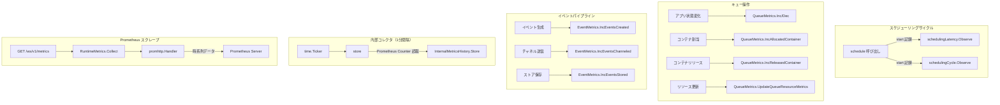

# 第14章 メトリクス

> 本章で読むソース:
>
> - [pkg/metrics/init.go L19-L124](https://github.com/apache/yunikorn-core/blob/v1.8.0/pkg/metrics/init.go#L19-L124)
> - [pkg/metrics/scheduler.go L19-L450](https://github.com/apache/yunikorn-core/blob/v1.8.0/pkg/metrics/scheduler.go#L19-L450)
> - [pkg/metrics/queue.go L19-L332](https://github.com/apache/yunikorn-core/blob/v1.8.0/pkg/metrics/queue.go#L19-L332)
> - [pkg/metrics/runtime.go L19-L249](https://github.com/apache/yunikorn-core/blob/v1.8.0/pkg/metrics/runtime.go#L19-L249)
> - [pkg/metrics/event.go L19-L127](https://github.com/apache/yunikorn-core/blob/v1.8.0/pkg/metrics/event.go#L19-L127)
> - [pkg/metrics/metrics_collector.go L19-L100](https://github.com/apache/yunikorn-core/blob/v1.8.0/pkg/metrics/metrics_collector.go#L19-L100)
> - [pkg/metrics/history/internal_metrics.go L19-L84](https://github.com/apache/yunikorn-core/blob/v1.8.0/pkg/metrics/history/internal_metrics.go#L19-L84)

## この章の狙い

YuniKorn core が公開する Prometheus メトリクスの全体像を把握する。
スケジューラ内部のレイテンシ、キューごとのリソース使用量、Go ランタイムのメモリ統計、イベントパイプラインのThroughput が、どの構造体で宣言され、どのように収集されるかを追う。
結果として、Prometheus の scrape エンドポイントにどのような時系列データが並ぶかを機構レベルで理解できる。

## 前提

- 第3章「スケジューリングサイクル」で、メインルーチンの流れを読んでいる。
- 第4章「キュー階層と共有ポリシー」で、キューごとのリソース管理を読んでいる。
- Prometheus の Counter、Gauge、Histogram の意味を知っている。

## メトリクス初期化の構造

YuniKorn core のメトリクスは、パッケージレベルの `init` 関数で一度だけ初期化される。
`Metrics` 構造体がスケジューラ、キュー、イベント、ランタイムの4つのサブシステムを束ねる。

[pkg/metrics/init.go L41-L59](https://github.com/apache/yunikorn-core/blob/v1.8.0/pkg/metrics/init.go#L41-L59)

```go
type Metrics struct {
	scheduler *SchedulerMetrics
	queues    map[string]*QueueMetrics
	event     *EventMetrics
	runtime   *RuntimeMetrics
	lock      locking.RWMutex
}

func init() {
	once.Do(func() {
		m = &Metrics{
			scheduler: InitSchedulerMetrics(),
			queues:    make(map[string]*QueueMetrics),
			event:     initEventMetrics(),
			lock:      locking.RWMutex{},
			runtime:   initRuntimeMetrics(),
		}
	})
}
```

`sync.Once` で初期化を1回に限定している。
Go のパッケージ `init` は複数回呼ばれる可能性があるため、`once.Do` で二重初期化を防ぐ。
`queues` はマップで保持され、キューの生成・削除に応じて動的にメトリクスが追加・削除される。

すべてのメトリクスは `yunikorn` という名前空間で統一される。

[pkg/metrics/init.go L27-L36](https://github.com/apache/yunikorn-core/blob/v1.8.0/pkg/metrics/init.go#L27-L36)

```go
const (
	Namespace = "yunikorn"
	SchedulerSubsystem = "scheduler"
	EventSubsystem = "event"
	MetricNameInvalidByteReplacement = '_'
)
```

Prometheus のメトリクス名は `[a-zA-Z_:][a-zA-Z0-9_:]*` に正規化される。
`formatMetricName` 関数は、キュー名などに含まれる不正なバイトを `_` に置換する。

[pkg/metrics/init.go L106-L124](https://github.com/apache/yunikorn-core/blob/v1.8.0/pkg/metrics/init.go#L106-L124)

```go
func formatMetricName(metricName string) string {
	if len(metricName) == 0 {
		return metricName
	}
	newBytes := make([]byte, len(metricName))
	for i := 0; i < len(metricName); i++ {
		b := metricName[i]
		if !((b >= 'a' && b <= 'z') || (b >= 'A' && b <= 'Z') || b == '_' || b == ':' || (b >= '0' && b <= '9')) {
			newBytes[i] = MetricNameInvalidByteReplacement
		} else {
			newBytes[i] = b
		}
	}
	if '0' <= metricName[0] && metricName[0] <= '9' {
		return string(MetricNameInvalidByteReplacement) + string(newBytes)
	}
	return string(newBytes)
}
```

先頭が数字の場合は `_` を前置する。
この正規化により、任意のキュー名を Prometheus のラベル値やサブシステム名に安全に埋め込める。

## スケジューラメトリクス

`SchedulerMetrics` はスケジューリングサイクルの性能を計測する。

[pkg/metrics/scheduler.go L58-L71](https://github.com/apache/yunikorn-core/blob/v1.8.0/pkg/metrics/scheduler.go#L58-L71)

```go
type SchedulerMetrics struct {
	containerAllocation   *prometheus.CounterVec
	applicationSubmission *prometheus.CounterVec
	application           *prometheus.GaugeVec
	node                  *prometheus.GaugeVec
	nodeResourceUsage     map[string]*prometheus.GaugeVec
	schedulingLatency     prometheus.Histogram
	schedulingCycle       prometheus.Histogram
	sortingLatency        *prometheus.HistogramVec
	tryNodeLatency        prometheus.Histogram
	tryPreemptionLatency  prometheus.Histogram
	tryNodeEvaluation     prometheus.Histogram
	lock                  locking.RWMutex
}
```

宣言されるメトリクスは3種類に分かれる。

- **Counter**: `container_allocation_attempt_total`（コンテナ割当の試行回数）、`application_submission_total`（アプリケーション提出回数）。
- **Gauge**: `application_total`（アプリケーション状態別数）、`node`（ノード状態別数）、`nodeResourceUsage`（リソース名別のノード使用率）。
- **Histogram**: `scheduling_latency_milliseconds`、`scheduling_cycle_milliseconds`、`node_sorting_latency_milliseconds`、`trynode_latency_milliseconds`、`trynode_evaluation_milliseconds`、`trypreemption_latency_milliseconds`。

Histogram のバケットはすべて `prometheus.ExponentialBuckets(0.0001, 10, 8)` で生成される。
0.1ミリ秒から始まり、10倍ずつ8段階（0.1ms、1ms、10ms、100ms、1s、10s、100s、1000s）である。

[pkg/metrics/scheduler.go L113-L121](https://github.com/apache/yunikorn-core/blob/v1.8.0/pkg/metrics/scheduler.go#L113-L121)

```go
s.schedulingLatency = prometheus.NewHistogram(
	prometheus.HistogramOpts{
		Namespace: Namespace,
		Subsystem: SchedulerSubsystem,
		Name:      "scheduling_latency_milliseconds",
		Help:      "Latency of the main scheduling routine, in seconds.",
		Buckets:   prometheus.ExponentialBuckets(0.0001, 10, 8),
	},
)
```

スケジューリングレイテンシの計測は、開始時刻を記録して `Observe` で差分を取る。

[pkg/metrics/scheduler.go L202-L212](https://github.com/apache/yunikorn-core/blob/v1.8.0/pkg/metrics/scheduler.go#L202-L212)

```go
func SinceInSeconds(start time.Time) float64 {
	return time.Since(start).Seconds()
}

func (m *SchedulerMetrics) ObserveSchedulingLatency(start time.Time) {
	m.schedulingLatency.Observe(SinceInSeconds(start))
}

func (m *SchedulerMetrics) ObserveSchedulingCycle(start time.Time) {
	m.schedulingCycle.Observe(SinceInSeconds(start))
}
```

`schedulingLatency` はメインのスケジューリングルーチン自体の時間を測る。
`schedulingCycle` はキューのソート、ノードの評価、プリエンプション判定を含むサイクル全体の時間を測る。
この2つを分けることで、スケジューリング本体のオーバーヘッドと、周辺処理のオーバーヘッドを切り分けられる。

ノードのリソース使用率は、リソース名ごとに動的に Gauge を生成する。

[pkg/metrics/scheduler.go L408-L429](https://github.com/apache/yunikorn-core/blob/v1.8.0/pkg/metrics/scheduler.go#L408-L429)

```go
func (m *SchedulerMetrics) SetNodeResourceUsage(resourceName string, rangeIdx int, value float64) {
	m.lock.Lock()
	defer m.lock.Unlock()
	var resourceMetrics *prometheus.GaugeVec
	resourceMetrics, ok := m.nodeResourceUsage[resourceName]
	if !ok {
		metricsName := fmt.Sprintf("%s_node_usage_total", formatMetricName(resourceName))
		resourceMetrics = prometheus.NewGaugeVec(
			prometheus.GaugeOpts{
				Namespace: Namespace,
				Subsystem: SchedulerSubsystem,
				Name:      metricsName,
				Help:      "Total resource usage of node, by resource name.",
			}, []string{"range"})
		if err := prometheus.Register(resourceMetrics); err != nil {
			log.Log(log.Metrics).Warn("failed to register metrics collector", zap.Error(err))
			return
		}
		m.nodeResourceUsage[resourceName] = resourceMetrics
	}
	resourceMetrics.WithLabelValues(resourceUsageRangeBuckets[rangeIdx]).Set(value)
}
```

リソース名はクラスタ構成によって異なる（`cpu`、`memory`、`nvidia.com/gpu` など）。
初出のリソース名が来たときだけ新しい `GaugeVec` を生成して Prometheus に登録する。
使用率は10段階のバケット（`[0,10%]` から `(90%,100%]` まで）で表現される。

[pkg/metrics/scheduler.go L44-L55](https://github.com/apache/yunikorn-core/blob/v1.8.0/pkg/metrics/scheduler.go#L44-L55)

```go
var resourceUsageRangeBuckets = []string{
	"[0,10%]",
	"(10%,20%]",
	"(20%,30%]",
	"(30%,40%]",
	"(40%,50%]",
	"(50%,60%]",
	"(60%,70%]",
	"(70%,80%]",
	"(80%,90%]",
	"(90%,100%]",
}
```

## キューメトリクス

`QueueMetrics` はキューごとに生成され、アプリケーション数、コンテナ数、リソース量を追跡する。

[pkg/metrics/queue.go L55-L62](https://github.com/apache/yunikorn-core/blob/v1.8.0/pkg/metrics/queue.go#L55-L62)

```go
type QueueMetrics struct {
	appMetrics           *prometheus.GaugeVec
	containerMetrics     *prometheus.CounterVec
	resourceMetricsLabel *prometheus.GaugeVec
	knownResourceTypes map[string]struct{}
	lock               locking.Mutex
}
```

3つの Prometheus コレクタを持つ。

- `appMetrics`: `yunikorn_queue_app`（Gauge）。キューごとのアプリケーション状態別数。
- `containerMetrics`: `yunikorn_<queue>_queue_container`（Counter）。キューごとのコンテナ割当・リリース数。
- `resourceMetricsLabel`: `yunikorn_queue_resource`（Gauge）。キューごとのリソース状態別量（`guaranteed`、`max`、`allocated`、`pending`、`preempting`）。

キューメトリクスの特徴は、リソース名をラベルとして動的に扱う点である。

[pkg/metrics/queue.go L300-L316](https://github.com/apache/yunikorn-core/blob/v1.8.0/pkg/metrics/queue.go#L300-L316)

```go
func (m *QueueMetrics) UpdateQueueResourceMetrics(state string, newResources map[string]resources.Quantity) {
	m.lock.Lock()
	defer m.lock.Unlock()
	for resourceName, value := range newResources {
		m.setQueueResource(state, resourceName, float64(value))
		m.knownResourceTypes[resourceName] = struct{}{}
	}
	for resourceName := range m.knownResourceTypes {
		if _, exists := newResources[resourceName]; !exists {
			m.setQueueResource(state, resourceName, float64(0))
		}
	}
}
```

`knownResourceTypes` は過去に観測されたリソース名を記録する。
新しいリソースマップに存在しない旧リソース名は 0 で上書きされる。
これにより、リソース種別が一時的に消えても Prometheus の時系列に穴が開かず、グラフが途切れない。

キューメトリクスはキューの削除時に `UnregisterMetrics` で Prometheus から完全に除去される。

[pkg/metrics/queue.go L114-L125](https://github.com/apache/yunikorn-core/blob/v1.8.0/pkg/metrics/queue.go#L114-L125)

```go
func (m *QueueMetrics) UnregisterMetrics() {
	var queueMetricsList = []prometheus.Collector{
		m.appMetrics,
		m.containerMetrics,
		m.resourceMetricsLabel,
	}
	for _, metric := range queueMetricsList {
		prometheus.Unregister(metric)
	}
}
```

存在しないキューのメトリクスが残り続けることを防ぎ、Prometheus のメモリ使用量を抑える。

## イベントメトリクス

`EventMetrics` はイベントパイプラインの各段階でのThroughputを追跡する。

[pkg/metrics/event.go L23-L31](https://github.com/apache/yunikorn-core/blob/v1.8.0/pkg/metrics/event.go#L23-L31)

```go
type EventMetrics struct {
	totalEventsCreated      prometheus.Gauge
	totalEventsChanneled    prometheus.Gauge
	totalEventsNotChanneled prometheus.Gauge
	totalEventsProcessed    prometheus.Gauge
	totalEventsStored       prometheus.Gauge
	totalEventsNotStored    prometheus.Gauge
	totalEventsCollected    prometheus.Gauge
}
```

7つの Gauge で、イベントの生成から収集までの各段階を数える。

- `yunikorn_event_total_created`: イベント生成数。
- `yunikorn_event_total_channeled`: チャネルに送られた数。
- `yunikorn_event_total_not_channeled`: チャネルに送れなかった数。
- `yunikorn_event_total_processed`: 処理された数。
- `yunikorn_event_total_stored`: ストアに保存された数。
- `yunikorn_event_total_not_stored`: ストアに保存できなかった数。
- `yunikorn_event_total_collected`: 収集された数。

`channeled` と `not_channeled` の差はイベントチャネルのバックプレッシャを示す。
`stored` と `not_stored` の差はイベントストアの容量上限による丢弃を示す。
これらの差を監視することで、イベントパイプラインのボトルネックを特定できる。

## ランタイムメトリクス

`RuntimeMetrics` は Go ランタイムのメモリ統計を Prometheus に公開する。

[pkg/metrics/runtime.go L45-L48](https://github.com/apache/yunikorn-core/blob/v1.8.0/pkg/metrics/runtime.go#L45-L48)

```go
type RuntimeMetrics struct {
	*MStatsMetrics
	*GenericMetrics
}
```

2つのサブ構造体で構成される。

`MStatsMetrics` は `runtime.ReadMemStats` から取得する伝統的なメモリ統計を公開する。

[pkg/metrics/runtime.go L62-L69](https://github.com/apache/yunikorn-core/blob/v1.8.0/pkg/metrics/runtime.go#L62-L69)

```go
type MStatsMetrics struct {
	mstats        *prometheus.GaugeVec
	pauseNsTimes  *prometheus.GaugeVec
	pauseEndTimes *prometheus.GaugeVec
	bySizeSize    prometheus.Histogram
	bySizeFree    prometheus.Histogram
	bySizeMalloc  prometheus.Histogram
}
```

`mstats` は `yunikorn_runtime_go_mem_stats` という Gauge で、`Alloc`、`HeapAlloc`、`Sys`、`NumGC` などのラベルで25種類以上のメモリ統計を公開する。

[pkg/metrics/runtime.go L71-L98](https://github.com/apache/yunikorn-core/blob/v1.8.0/pkg/metrics/runtime.go#L71-L98)

```go
func (ms *MStatsMetrics) Collect() {
	memStats := runtime.MemStats{}
	runtime.ReadMemStats(&memStats)

	ms.gauge("Alloc").Set(float64(memStats.Alloc))
	ms.gauge("TotalAlloc").Set(float64(memStats.TotalAlloc))
	ms.gauge("Sys").Set(float64(memStats.Sys))
	// ... (中略) ...
	ms.gauge("NextGC").Set(float64(memStats.NextGC))
	ms.gauge("LastGC").Set(float64(memStats.LastGC))
	ms.gauge("PauseTotalNs").Set(float64(memStats.PauseTotalNs))
	ms.gauge("NumGC").Set(float64(memStats.NumGC))
	ms.gauge("NumForcedGC").Set(float64(memStats.NumForcedGC))
	ms.gauge("GCCPUFraction").Set(memStats.GCCPUFraction)
	// ... (中略) ...
}
```

`GenericMetrics` は Go 1.17 で導入された `runtime/metrics` パッケージを使い、より詳細なランタイム統計を取得する。

[pkg/metrics/runtime.go L131-L157](https://github.com/apache/yunikorn-core/blob/v1.8.0/pkg/metrics/runtime.go#L131-L157)

```go
func (gm *GenericMetrics) Collect() {
	descs := metrics.All()

	samples := make([]metrics.Sample, len(descs))
	for i := range samples {
		samples[i].Name = descs[i].Name
	}

	metrics.Read(samples)

	for _, sample := range samples {
		name, value := sample.Name, sample.Value

		switch value.Kind() {
		case metrics.KindUint64:
			gm.gauge(name).Set(float64(value.Uint64()))
		case metrics.KindFloat64:
			gm.gauge(name).Set(value.Float64())
		case metrics.KindFloat64Histogram:
			// ignore
		case metrics.KindBad:
			// ignore
		default:
			// ignore
		}
	}
}
```

`metrics.All()` で利用可能なすべての記述を取得し、一括で `metrics.Read` する。
`KindFloat64Histogram` と `KindBad` は無視し、`KindUint64` と `KindFloat64` だけを Gauge に変換する。
この API は `runtime.ReadMemStats` よりも低オーバーヘッドで、Stop-The-World を伴わない。

## 内部メトリクスコレクタ

Prometheus へのエクスポートとは別に、YuniKorn core は Web UI 向けの簡易履歴データを収集する。
`internalMetricsCollector` がその役割を果たす。

[pkg/metrics/metrics_collector.go L32-L56](https://github.com/apache/yunikorn-core/blob/v1.8.0/pkg/metrics/metrics_collector.go#L32-L56)

```go
type internalMetricsCollector struct {
	ticker         *time.Ticker
	stopped        chan struct{}
	metricsHistory *history.InternalMetricsHistory
}

func NewInternalMetricsCollector(hcInfo *history.InternalMetricsHistory) *internalMetricsCollector {
	return newInternalMetricsCollector(hcInfo, 1*time.Minute)
}

func newInternalMetricsCollector(hcInfo *history.InternalMetricsHistory, tickerDefault time.Duration) *internalMetricsCollector {
	finished := make(chan struct{})
	ticker := time.NewTicker(tickerDefault)

	return &internalMetricsCollector{
		ticker,
		finished,
		hcInfo,
	}
}
```

1分間隔の `time.Ticker` で定期的に `store` メソッドを呼び出す。

[pkg/metrics/metrics_collector.go L58-L95](https://github.com/apache/yunikorn-core/blob/v1.8.0/pkg/metrics/metrics_collector.go#L58-L95)

```go
func (u *internalMetricsCollector) StartService() {
	go func() {
		log.Log(log.Metrics).Info("Starting internal metrics collector")
		for {
			select {
			case <-u.stopped:
				return
			case <-u.ticker.C:
				u.store()
			}
		}
	}()
}

func (u *internalMetricsCollector) store() {
	log.Log(log.Metrics).Debug("Adding current status to historical partition data")

	totalAppsRunning, err := m.scheduler.GetTotalApplicationsRunning()
	if err != nil {
		log.Log(log.Metrics).Warn("Could not encode totalApplications metric.", zap.Error(err))
		totalAppsRunning = -1
	}
	allocatedContainers, err := m.scheduler.getAllocatedContainers()
	if err != nil {
		log.Log(log.Metrics).Warn("Could not encode allocatedContainers metric.", zap.Error(err))
	}
	releasedContainers, err := m.scheduler.getReleasedContainers()
	if err != nil {
		log.Log(log.Metrics).Warn("Could not encode releasedContainers metric.", zap.Error(err))
	}
	totalContainersRunning := allocatedContainers - releasedContainers
	if totalContainersRunning < 0 {
		log.Log(log.Metrics).Warn("Could not calculate the totalContainersRunning.",
			zap.Int("allocatedContainers", allocatedContainers),
			zap.Int("releasedContainers", releasedContainers))
	}
	u.metricsHistory.Store(totalAppsRunning, totalContainersRunning)
}
```

Prometheus の Counter から `dto.Metric` 経由で現在値を読み出し、`InternalMetricsHistory` に保存する。
失敗した場合は `-1` を格納し、Web UI 側で欠損として扱えるようにする。

## 履歴データのリングバッファ

`InternalMetricsHistory` は固定長のリングバッファで履歴を保持する。

[pkg/metrics/history/internal_metrics.go L30-L66](https://github.com/apache/yunikorn-core/blob/v1.8.0/pkg/metrics/history/internal_metrics.go#L30-L66)

```go
type InternalMetricsHistory struct {
	records []*MetricsRecord
	limit   int
	pointer int
	locking.RWMutex
}

type MetricsRecord struct {
	Timestamp         time.Time
	TotalApplications int
	TotalContainers   int
}

func NewInternalMetricsHistory(limit int) *InternalMetricsHistory {
	return &InternalMetricsHistory{
		records: make([]*MetricsRecord, limit),
		limit:   limit,
	}
}

func (h *InternalMetricsHistory) Store(totalApplications, totalContainers int) {
	h.Lock()
	defer h.Unlock()

	h.records[h.pointer] = &MetricsRecord{
		time.Now(),
		totalApplications,
		totalContainers,
	}
	h.pointer++
	if h.pointer == h.limit {
		h.pointer = 0
	}
}
```

`pointer` が `limit` に達すると 0 に戻る。
古いレコードは上書きされ、メモリ使用量は一定に保たれる。

`GetRecords` は `pointer` を基準に時系列順でコピーを返す。

[pkg/metrics/history/internal_metrics.go L70-L78](https://github.com/apache/yunikorn-core/blob/v1.8.0/pkg/metrics/history/internal_metrics.go#L70-L78)

```go
func (h *InternalMetricsHistory) GetRecords() []*MetricsRecord {
	h.RLock()
	defer h.RUnlock()

	returnRecords := make([]*MetricsRecord, h.limit-h.pointer)
	copy(returnRecords, h.records[h.pointer:])
	returnRecords = append(returnRecords, h.records[:h.pointer]...)
	return returnRecords
}
```

`pointer` から末尾までを先にコピーし、先頭から `pointer` までを後ろに続ける。
これにより、リングバッファの内部構造を隠蔽しつつ、呼び出し元に時系列順の配列を返す。

## メトリクス収集の全体像



## 最適化の工夫

`GenericMetrics` が `runtime/metrics` パッケージを使う理由は、`runtime.ReadMemStats` と比べて Stop-The-World を発生させない点にある。
`ReadMemStats` は全 goroutine を停止してメモリ統計を集計するため、スケジューラのようなレイテンシ過敏なプロセスでは GC 以外の理由でレイテンシスパイクを引き起こす。
`runtime/metrics` の `metrics.Read` は内部的にアトミックな読み取りパスを使い、STW を回避する。
この選択により、メトリクス収集がスケジューリングのレイテンシに影響を与えない。

## まとめ

YuniKorn core のメトリクスは4層で構成される。

- **スケジューラメトリクス**: スケジューリングレイテンシ、コンテナ割当、アプリケーション状態、ノードリソース使用率。
- **キューメトリクス**: キューごとのアプリケーション数、コンテナ数、リソース量。動的なリソース名に対応。
- **イベントメトリクス**: イベントパイプラインの各段階のThroughput。
- **ランタイムメトリクス**: Go メモリ統計（`MemStats` と `runtime/metrics` の2経路）。

これらに加えて、`internalMetricsCollector` が1分間隔でリングバッファに履歴を蓄積し、Web UI のグラフ描画に使う。
Prometheus への公開は `getMetrics` ハンドラを経由し、ランタイムメトリクスの収集後に `promhttp.Handler` に委譲する。

## 関連する章

- [第3章 スケジューリングサイクル](../part01-scheduler-core/03-scheduling-cycle.md): `schedulingLatency` と `schedulingCycle` が計測する対象。
- [第4章 キュー階層と共有ポリシー](../part01-scheduler-core/04-queue-hierarchy.md): `QueueMetrics` が追跡するキューごとのリソース。
- [第15章 WebService REST API](15-webservice.md): `/ws/v1/metrics` で Prometheus メトリクスを公開する仕組み。
