# 第15章 WebService REST API

> 本章で読むソース:
>
> - [pkg/webservice/webservice.go L19-L100](https://github.com/apache/yunikorn-core/blob/v1.8.0/pkg/webservice/webservice.go#L19-L100)
> - [pkg/webservice/handlers.go L19-L1414](https://github.com/apache/yunikorn-core/blob/v1.8.0/pkg/webservice/handlers.go#L19-L1414)
> - [pkg/webservice/routes.go L19-L301](https://github.com/apache/yunikorn-core/blob/v1.8.0/pkg/webservice/routes.go#L19-L301)
> - [pkg/webservice/state_dump.go L19-L100](https://github.com/apache/yunikorn-core/blob/v1.8.0/pkg/webservice/state_dump.go#L19-L100)
> - [pkg/webservice/streaming_limit.go L19-L137](https://github.com/apache/yunikorn-core/blob/v1.8.0/pkg/webservice/streaming_limit.go#L19-L137)
> - [pkg/webservice/dao/](https://github.com/apache/yunikorn-core/tree/v1.8.0/pkg/webservice/dao)

## この章の狙い

YuniKorn core が外部に公開する HTTP API の全体像を把握する。
ルーティング定義からハンドラの実装、DAO 層のデータ構造、ストリーミング API の接続制限までを追う。
結果として、Web UI や CLI がスケジューラの内部状態をどのように取得するかを機構レベルで理解できる。

## 前提

- 第2章「起動とサービス結合」で、WebService の起動フローを読んでいる。
- 第13章「パーティション管理」で、パーティションの概念を理解している。
- 第14章「メトリクス」で、Prometheus メトリクスの構造を理解している。

## WebService の起動とルーティング

`WebService` 構造体は HTTP サーバを保持する。

[pkg/webservice/webservice.go L40-L42](https://github.com/apache/yunikorn-core/blob/v1.8.0/pkg/webservice/webservice.go#L40-L42)

```go
type WebService struct {
	httpServer *http.Server
}
```

`NewWebApp` で `ClusterContext` と `InternalMetricsHistory` を受け取り、パッケージ変数に保存する。

[pkg/webservice/webservice.go L84-L89](https://github.com/apache/yunikorn-core/blob/v1.8.0/pkg/webservice/webservice.go#L84-L89)

```go
func NewWebApp(context *scheduler.ClusterContext, internalMetrics *history.InternalMetricsHistory) *WebService {
	m := &WebService{}
	schedulerContext.Store(context)
	imHistory = internalMetrics
	return m
}
```

`schedulerContext` は `atomic.Pointer` で保持される。
ロック不要でスケジューラコンテキストへの参照を更新できる。

`StartWebApp` はポート9080で HTTP サーバを起動する。

[pkg/webservice/webservice.go L66-L82](https://github.com/apache/yunikorn-core/blob/v1.8.0/pkg/webservice/webservice.go#L66-L82)

```go
func (m *WebService) StartWebApp() {
	router := newRouter()
	m.httpServer = &http.Server{
		Addr:              ":9080",
		Handler:           router,
		ReadHeaderTimeout: 10 * time.Second,
	}

	log.Log(log.REST).Info("web-app started", zap.Int("port", 9080))
	go func() {
		httpError := m.httpServer.ListenAndServe()
		if httpError != nil && !errors.Is(httpError, http.ErrServerClosed) {
			log.Log(log.REST).Error("HTTP serving error",
				zap.Error(httpError))
		}
	}()
}
```

`ReadHeaderTimeout` に10秒を指定し、Slowloris 攻撃への耐性を持たせる。
`ListenAndServe` は別 goroutine で実行され、呼び出し元をブロックしない。

`StopWebApp` は5秒のタイムアウトでグレースフルシャットダウンを行う。

[pkg/webservice/webservice.go L91-L100](https://github.com/apache/yunikorn-core/blob/v1.8.0/pkg/webservice/webservice.go#L91-L100)

```go
func (m *WebService) StopWebApp() error {
	if m.httpServer != nil {
		ctx, cancel := context.WithTimeout(context.Background(), 5*time.Second)
		defer cancel()
		return m.httpServer.Shutdown(ctx)
	}

	return nil
}
```

## ルーティング定義

ルーティングは `httprouter` で定義される。
`route` 構造体のスライス `webRoutes` に全エンドポイントを列挙する。

[pkg/webservice/routes.go L26-L31](https://github.com/apache/yunikorn-core/blob/v1.8.0/pkg/webservice/routes.go#L26-L31)

```go
type route struct {
	Name        string
	Method      string
	Pattern     string
	HandlerFunc http.HandlerFunc
}
```

`newRouter` は `webRoutes` を走査し、各ルートに `loggingHandler` を挟んで登録する。

[pkg/webservice/webservice.go L44-L63](https://github.com/apache/yunikorn-core/blob/v1.8.0/pkg/webservice/webservice.go#L44-L63)

```go
func newRouter() *httprouter.Router {
	router := httprouter.New()
	for _, webRoute := range webRoutes {
		handler := loggingHandler(webRoute.HandlerFunc, webRoute.Name)
		router.Handler(webRoute.Method, webRoute.Pattern, handler)
	}
	return router
}

func loggingHandler(inner http.Handler, name string) http.HandlerFunc {
	return func(w http.ResponseWriter, r *http.Request) {
		start := time.Now()
		inner.ServeHTTP(w, r)
		log.Log(log.REST).Debug("Web router call details",
			zap.String("name", name),
			zap.String("method", r.Method),
			zap.String("uri", r.RequestURI),
			zap.Duration("duration", time.Since(start)))
	}
}
```

`loggingHandler` は各リクエストの処理時間を計測し、DEBUG レベルでログに出力する。
すべてのエンドポイントに透過的に適用される。

## 主要エンドポイント

`webRoutes` に定義されるエンドポイントは以下の通りである。

### クラスタ情報

| パターン | ハンドラ | 概要 |
|---|---|---|
| `GET /ws/v1/clusters` | `getClusterInfo` | クラスタ情報の取得 |
| `GET /ws/v1/metrics` | `getMetrics` | Prometheus メトリクス |
| `GET /ws/v1/config` | `getClusterConfig` | スケジューラ設定 |
| `POST /ws/v1/validate-conf` | `validateConf` | 設定の検証 |

`getClusterInfo` は各パーティションのクラスタ情報を DAO オブジェクトに変換して返す。

[pkg/webservice/handlers.go L147-L155](https://github.com/apache/yunikorn-core/blob/v1.8.0/pkg/webservice/handlers.go#L147-L155)

```go
func getClusterInfo(w http.ResponseWriter, r *http.Request) {
	writeHeaders(w, r.Method)

	lists := schedulerContext.Load().GetPartitionMapClone()
	clustersInfo := getClusterDAO(lists)
	if err := json.NewEncoder(w).Encode(clustersInfo); err != nil {
		buildJSONErrorResponse(w, err.Error(), http.StatusInternalServerError)
	}
}
```

返される `ClusterDAOInfo` の構造は以下の通り。

[pkg/webservice/dao/cluster_info.go L21-L26](https://github.com/apache/yunikorn-core/blob/v1.8.0/pkg/webservice/dao/cluster_info.go#L21-L26)

```go
type ClusterDAOInfo struct {
	StartTime          int64               `json:"startTime,omitempty"`
	RMBuildInformation []map[string]string `json:"rmBuildInformation,omitempty"`
	PartitionName      string              `json:"partition"`   // no omitempty, partition name should not be empty
	ClusterName        string              `json:"clusterName"` // no omitempty, cluster name should not be empty
}
```

### パーティション情報

| パターン | ハンドラ | 概要 |
|---|---|---|
| `GET /ws/v1/partitions` | `getPartitions` | 全パーティション情報 |
| `GET /ws/v1/partition/:partition/queues` | `getPartitionQueues` | キュー階層 |
| `GET /ws/v1/partition/:partition/queue/:queue` | `getPartitionQueue` | 単一キュー情報 |
| `GET /ws/v1/partition/:partition/nodes` | `getPartitionNodes` | ノード一覧 |
| `GET /ws/v1/partition/:partition/node/:node` | `getPartitionNode` | 単一ノード情報 |
| `GET /ws/v1/partition/:partition/placementrules` | `getPartitionRules` | プレイスメントルール |

`PartitionInfo` はパーティションの状態、容量、ノード数、アプリケーション数を含む。

[pkg/webservice/dao/partition_info.go L21-L33](https://github.com/apache/yunikorn-core/blob/v1.8.0/pkg/webservice/dao/partition_info.go#L21-L33)

```go
type PartitionInfo struct {
	ClusterID               string            `json:"clusterId"`              // no omitempty, cluster id should not be empty
	Name                    string            `json:"name"`                   // no omitempty, name should not be empty
	Capacity                PartitionCapacity `json:"capacity"`               // no omitempty, omitempty doesn't work on a structure value
	NodeSortingPolicy       NodeSortingPolicy `json:"nodeSortingPolicy"`      // no omitempty, omitempty doesn't work on a structure value
	PreemptionEnabled       bool              `json:"preemptionEnabled"`      // no omitempty, false shows preemption status better
	QuotaPreemptionEnabled  bool              `json:"quotaPreemptionEnabled"` // no omitempty, false shows quota preemption status better
	TotalNodes              int               `json:"totalNodes,omitempty"`
	Applications            map[string]int    `json:"applications,omitempty"`
	TotalContainers         int               `json:"totalContainers,omitempty"`
	State                   string            `json:"state,omitempty"`
	LastStateTransitionTime int64             `json:"lastStateTransitionTime,omitempty"`
}
```

### アプリケーション情報

| パターン | ハンドラ | 概要 |
|---|---|---|
| `GET /ws/v1/partition/:partition/applications/:state` | `getPartitionApplicationsByState` | 状態別アプリ一覧 |
| `GET /ws/v1/partition/:partition/queue/:queue/applications` | `getQueueApplications` | キュー内のアプリ一覧 |
| `GET /ws/v1/partition/:partition/queue/:queue/application/:application` | `getApplication` | 単一アプリ情報 |
| `GET /ws/v1/partition/:partition/application/:application` | `getApplication` | キュー省略形の単一アプリ |

`ApplicationDAOInfo` はアプリケーションの全状態を含む最も大きな DAO 構造体である。

[pkg/webservice/dao/application_info.go L27-L50](https://github.com/apache/yunikorn-core/blob/v1.8.0/pkg/webservice/dao/application_info.go#L27-L50)

```go
type ApplicationDAOInfo struct {
	ApplicationID      string                  `json:"applicationID"`
	UsedResource       map[string]int64        `json:"usedResource,omitempty"`
	MaxUsedResource    map[string]int64        `json:"maxUsedResource,omitempty"`
	PendingResource    map[string]int64        `json:"pendingResource,omitempty"`
	Partition          string                  `json:"partition"`
	QueueName          string                  `json:"queueName"`
	SubmissionTime     int64                   `json:"submissionTime,omitempty"`
	FinishedTime       *int64                  `json:"finishedTime,omitempty"`
	Requests           []*AllocationAskDAOInfo `json:"requests,omitempty"`
	Allocations        []*AllocationDAOInfo    `json:"allocations,omitempty"`
	State              string                  `json:"applicationState,omitempty"`
	User               string                  `json:"user,omitempty"`
	Groups             []string                `json:"groups,omitempty"`
	RejectedMessage    string                  `json:"rejectedMessage,omitempty"`
	StateLog           []*StateDAOInfo         `json:"stateLog,omitempty"`
	PlaceholderData    []*PlaceholderDAOInfo   `json:"placeholderData,omitempty"`
	HasReserved        bool                    `json:"hasReserved,omitempty"`
	Reservations       []string                `json:"reservations,omitempty"`
	MaxRequestPriority int32                   `json:"maxRequestPriority,omitempty"`
	StartTime          int64                   `json:"startTime,omitempty"`
	ResourceHistory    ResourceHistory         `json:"resourceHistory,omitempty"`
	BackoffDeadline    *time.Time              `json:"backoffDeadline,omitempty"`
}
```

### ノード情報

`NodeDAOInfo` はノードのリソース状態と割当一覧を含む。

[pkg/webservice/dao/node_info.go L26-L41](https://github.com/apache/yunikorn-core/blob/v1.8.0/pkg/webservice/dao/node_info.go#L26-L41)

```go
type NodeDAOInfo struct {
	NodeID             string                      `json:"nodeID"`
	HostName           string                      `json:"hostName,omitempty"`
	RackName           string                      `json:"rackName,omitempty"`
	Attributes         map[string]string           `json:"attributes,omitempty"`
	Capacity           map[string]int64            `json:"capacity,omitempty"`
	Allocated          map[string]int64            `json:"allocated,omitempty"`
	Occupied           map[string]int64            `json:"occupied,omitempty"`
	Available          map[string]int64            `json:"available,omitempty"`
	Utilized           map[string]int64            `json:"utilized,omitempty"`
	Allocations        []*AllocationDAOInfo        `json:"allocations,omitempty"`
	ForeignAllocations []*ForeignAllocationDAOInfo `json:"foreignAllocations,omitempty"`
	Schedulable        bool                        `json:"schedulable"`
	IsReserved         bool                        `json:"isReserved"`
	Reservations       []string                    `json:"reservations,omitempty"`
}
```

### アロケーション情報

`AllocationDAOInfo` は個々のコンテナ割当の詳細を表す。

[pkg/webservice/dao/allocation_info.go L21-L36](https://github.com/apache/yunikorn-core/blob/v1.8.0/pkg/webservice/dao/allocation_info.go#L21-L36)

```go
type AllocationDAOInfo struct {
	AllocationKey    string            `json:"allocationKey"`
	AllocationTags   map[string]string `json:"allocationTags,omitempty"`
	RequestTime      int64             `json:"requestTime,omitempty"`
	AllocationTime   int64             `json:"allocationTime,omitempty"`
	AllocationDelay  int64             `json:"allocationDelay,omitempty"`
	ResourcePerAlloc map[string]int64  `json:"resource,omitempty"`
	Priority         string            `json:"priority,omitempty"`
	NodeID           string            `json:"nodeId,omitempty"`
	ApplicationID    string            `json:"applicationId,omitempty"`
	Placeholder      bool              `json:"placeholder,omitempty"`
	PlaceholderUsed  bool              `json:"placeholderUsed,omitempty"`
	TaskGroupName    string            `json:"taskGroupName,omitempty"`
	Preempted        bool              `json:"preempted,omitempty"`
	Originator       bool              `json:"originator,omitempty"`
}
```

`AllocationDelay` は `AllocationTime` と `RequestTime` の差分であり、スケジューラの応答性能を示す。

### イベントとヘルスチェック

| パターン | ハンドラ | 概要 |
|---|---|---|
| `GET /ws/v1/events/batch` | `getEvents` | イベントの一括取得 |
| `GET /ws/v1/events/stream` | `getStream` | イベントのストリーミング |
| `GET /ws/v1/scheduler/healthcheck` | `checkHealthStatus` | ヘルスチェック |
| `GET /ws/v1/history/apps` | `getApplicationHistory` | アプリケーション履歴 |
| `GET /ws/v1/history/containers` | `getContainerHistory` | コンテナ履歴 |

### デバッグエンドポイント

| パターン | ハンドラ | 概要 |
|---|---|---|
| `GET /debug/stack` | `getStackInfo` | Goroutine スタック |
| `GET /debug/fullstatedump` | `getFullStateDump` | 完全状態ダンプ |
| `GET /debug/pprof/*` | `pprof.*` | Go プロファイリング |

## イベント API

`getEvents` はイベントの一括取得を行う。

[pkg/webservice/handlers.go L1277-L1323](https://github.com/apache/yunikorn-core/blob/v1.8.0/pkg/webservice/handlers.go#L1277-L1323)

```go
func getEvents(w http.ResponseWriter, r *http.Request) {
	writeHeaders(w, r.Method)
	eventSystem := events.GetEventSystem()
	if !eventSystem.IsEventTrackingEnabled() {
		buildJSONErrorResponse(w, "Event tracking is disabled", http.StatusInternalServerError)
		return
	}

	maxCount := maxRESTResponseSize.Load()
	count := maxCount
	if countStr := r.URL.Query().Get("count"); countStr != "" {
		var err error
		count, err = strconv.ParseUint(countStr, 10, 64)
		if err != nil {
			buildJSONErrorResponse(w, err.Error(), http.StatusBadRequest)
			return
		}
		if count > maxCount {
			count = maxCount
		}
		if count == 0 {
			buildJSONErrorResponse(w, `0 is not a valid value for "count"`, http.StatusBadRequest)
			return
		}
	}

	var start uint64
	if startStr := r.URL.Query().Get("start"); startStr != "" {
		var err error
		start, err = strconv.ParseUint(startStr, 10, 64)
		if err != nil {
			buildJSONErrorResponse(w, err.Error(), http.StatusBadRequest)
			return
		}
	}

	records, lowestID, highestID := eventSystem.GetEventsFromID(start, count)
	eventDao := dao.EventRecordDAO{
		InstanceUUID: schedulerContext.Load().GetUUID(),
		LowestID:     lowestID,
		HighestID:    highestID,
		EventRecords: records,
	}
	if err := json.NewEncoder(w).Encode(eventDao); err != nil {
		buildJSONErrorResponse(w, err.Error(), http.StatusInternalServerError)
	}
}
```

レスポンスサイズは `maxRESTResponseSize` で制限される。
デフォルト値は `configs.DefaultRESTResponseSize` で、ConfigMap の変更で動的に更新される。

[pkg/webservice/handlers.go L97-L111](https://github.com/apache/yunikorn-core/blob/v1.8.0/pkg/webservice/handlers.go#L97-L111)

```go
	configs.AddConfigMapCallback("rest-response-size", func() {
		newSize := common.GetConfigurationUint(configs.GetConfigMap(), configs.CMRESTResponseSize, configs.DefaultRESTResponseSize)
		if newSize == 0 {
			log.Log(log.REST).Warn("Illegal value `0` for config key, using default",
				zap.String("key", configs.CMRESTResponseSize),
				zap.Uint64("default", configs.DefaultRESTResponseSize))
			newSize = configs.DefaultRESTResponseSize
		}

		log.Log(log.REST).Info("Reloading max REST event response size setting",
			zap.Uint64("current", maxRESTResponseSize.Load()),
			zap.Uint64("new", newSize))
		maxRESTResponseSize.Store(newSize)
	})
```

`atomic.Uint64` で保持されるため、ロック不要で値を更新・参照できる。

## ストリーミング API

`getStream` は `application/json` で JSON を逐次エンコードして flush し、イベントをリアルタイム配信する。

[pkg/webservice/handlers.go L1325-L1414](https://github.com/apache/yunikorn-core/blob/v1.8.0/pkg/webservice/handlers.go#L1325-L1414)

```go
func getStream(w http.ResponseWriter, r *http.Request) {
	writeHeaders(w, r.Method)
	eventSystem := events.GetEventSystem()
	if !eventSystem.IsEventTrackingEnabled() {
		buildJSONErrorResponse(w, "Event tracking is disabled", http.StatusInternalServerError)
		return
	}

	f, ok := w.(http.Flusher)
	if !ok {
		buildJSONErrorResponse(w, "Writer does not implement http.Flusher", http.StatusInternalServerError)
		return
	}

	if !streamingLimiter.AddHost(r.Host) {
		buildJSONErrorResponse(w, "Too many streaming connections", http.StatusServiceUnavailable)
		return
	}
	defer streamingLimiter.RemoveHost(r.Host)

	// ... (中略) ...

	enc := json.NewEncoder(w)
	stream := eventSystem.CreateEventStream(r.Host, count)
	defer eventSystem.RemoveStream(stream)

	if err := enc.Encode(dao.YunikornID{
		InstanceUUID: schedulerContext.Load().GetUUID(),
	}); err != nil {
		buildJSONErrorResponse(w, err.Error(), http.StatusInternalServerError)
		return
	}
	f.Flush()

	for {
		select {
		case <-r.Context().Done():
			return
		case e, ok := <-stream.Events:
			// ... (中略) ...
			if err := enc.Encode(e); err != nil {
				return
			}
			f.Flush()
		}
	}
}
```

ストリーミングは `http.Flusher` インターフェースを使い、イベントごとに即座にクライアントへ送信する。
接続はクライアントが切断するか、YuniKorn がチャネルを閉じるまで維持される。

## ストリーミング接続の制限

`StreamingLimiter` はストリーミング接続数をホストごとに制限する。

[pkg/webservice/streaming_limit.go L36-L45](https://github.com/apache/yunikorn-core/blob/v1.8.0/pkg/webservice/streaming_limit.go#L36-L45)

```go
type StreamingLimiter struct {
	perHostStreams map[string]uint64 // number of connections per host
	streams        uint64            // number of connections (total)
	id             string            // unique name for configmap callback

	maxStreams        uint64 // maximum number of event streams
	maxPerHostStreams uint64 // maximum number of event streams per host

	locking.Mutex
}
```

2段階の制限を持つ。

- **全体制限**: `maxStreams`（デフォルト `configs.DefaultMaxStreams`）。全ホスト合計の接続数上限。
- **ホスト別制限**: `maxPerHostStreams`（デフォルト `configs.DefaultMaxStreamsPerHost`）。同一ホストあたりの接続数上限。

`AddHost` は接続を受け入れる前に両方の制限をチェックする。

[pkg/webservice/streaming_limit.go L62-L82](https://github.com/apache/yunikorn-core/blob/v1.8.0/pkg/webservice/streaming_limit.go#L62-L82)

```go
func (sl *StreamingLimiter) AddHost(host string) bool {
	sl.Lock()
	defer sl.Unlock()

	if sl.streams >= sl.maxStreams {
		log.Log(log.SchedHealth).Info("Number of maximum stream connections reached",
			zap.Uint64("limit", sl.maxStreams),
			zap.String("host", host))
		return false
	}
	if sl.perHostStreams[host] >= sl.maxPerHostStreams {
		log.Log(log.SchedHealth).Info("Per host connection limit reached",
			zap.Uint64("limit", sl.maxPerHostStreams),
			zap.String("host", host))
		return false
	}

	sl.streams++
	sl.perHostStreams[host]++
	return true
}
```

制限値は ConfigMap のコールバックで動的に更新される。

[pkg/webservice/streaming_limit.go L103-L137](https://github.com/apache/yunikorn-core/blob/v1.8.0/pkg/webservice/streaming_limit.go#L103-L137)

```go
func (sl *StreamingLimiter) setLimits() {
	sl.Lock()
	defer sl.Unlock()

	maxStreams := configs.DefaultMaxStreams
	configMap := configs.GetConfigMap()

	if value, ok := configMap[configs.CMMaxEventStreams]; ok {
		parsed, err := strconv.ParseUint(value, 10, 64)
		if err != nil {
			log.Log(log.REST).Warn("Failed to parse configuration value",
				zap.String("key", configs.CMMaxEventStreams),
				zap.String("value", value),
				zap.Error(err))
		} else {
			maxStreams = parsed
		}
	}

	maxStreamsPerHost := configs.DefaultMaxStreamsPerHost
	if value, ok := configMap[configs.CMMaxEventStreamsPerHost]; ok {
		parsed, err := strconv.ParseUint(value, 10, 64)
		if err != nil {
			log.Log(log.REST).Warn("Failed to parse configuration value",
				zap.String("key", configs.CMMaxEventStreamsPerHost),
				zap.String("value", value),
				zap.Error(err))
		} else {
			maxStreamsPerHost = parsed
		}
	}

	sl.maxStreams = maxStreams
	sl.maxPerHostStreams = maxStreamsPerHost
}
```

## 完全状態ダンプ

`getFullStateDump` はスケジューラの全状態を JSON で出力する。

[pkg/webservice/state_dump.go L40-L100](https://github.com/apache/yunikorn-core/blob/v1.8.0/pkg/webservice/state_dump.go#L40-L100)

```go
type AggregatedStateInfo struct {
	Timestamp        int64                            `json:"timestamp,omitempty"`
	Partitions       []*dao.PartitionInfo             `json:"partitions,omitempty"`
	Applications     []*dao.ApplicationDAOInfo        `json:"applications,omitempty"`
	AppHistory       []*dao.ApplicationHistoryDAOInfo `json:"appHistory,omitempty"`
	Nodes            []*dao.NodesDAOInfo              `json:"nodes,omitempty"`
	ClusterInfo      []*dao.ClusterDAOInfo            `json:"clusterInfo,omitempty"`
	ContainerHistory []*dao.ContainerHistoryDAOInfo   `json:"containerHistory,omitempty"`
	Queues           []dao.PartitionQueueDAOInfo      `json:"queues,omitempty"`
	RMDiagnostics    map[string]interface{}           `json:"rmDiagnostics,omitempty"`
	LogLevel         string                           `json:"logLevel,omitempty"`
	Config           *dao.ConfigDAOInfo               `json:"config,omitempty"`
	PlacementRules   []*dao.RuleDAOInfo               `json:"placementRules,omitempty"`
	EventStreams     []events.EventStreamData         `json:"eventStreams,omitempty"`
}

func doStateDump(w io.Writer) error {
	stateDump.Lock()
	defer stateDump.Unlock()

	partitionContext := schedulerContext.Load().GetPartitionMapClone()
	records := imHistory.GetRecords()
	zapConfig := yunikornLog.GetZapConfigs()

	var aggregated = AggregatedStateInfo{
		Timestamp:        time.Now().UnixNano(),
		Partitions:       getPartitionInfoDAO(partitionContext),
		Applications:     getApplicationsDAO(partitionContext),
		AppHistory:       getAppHistoryDAO(records),
		Nodes:            getPartitionNodesDAO(partitionContext),
		ClusterInfo:      getClusterDAO(partitionContext),
		ContainerHistory: getContainerHistoryDAO(records),
		Queues:           getPartitionQueuesDAO(partitionContext),
		RMDiagnostics:    getResourceManagerDiagnostics(),
		LogLevel:         zapConfig.Level.Level().String(),
		Config:           getClusterConfigDAO(),
		PlacementRules:   getPlacementRulesDAO(partitionContext),
		EventStreams:     events.GetEventSystem().GetEventStreams(),
	}

	var prettyJSON []byte
	var err error
	prettyJSON, err = json.MarshalIndent(aggregated, "", "  ")
	if err != nil {
		return err
	}

	stateLog := log.New(w, "", 0)
	if err = stateLog.Output(stateLogCallDepth, string(prettyJSON)); err != nil {
		return err
	}

	return nil
}
```

`stateDump` ミューテックスで同時に1つのダンプしか実行できない。
大量のデータを収集するため、並列実行でメモリが逼迫するのを防ぐ。

## REST API のエンドポイント全体像

```mermaid
graph TB
    Client[Web UI / CLI] --> WS[WebService :9080]

    WS --> Router[httprouter]

    subgraph "クラスタ情報"
        Router --> Clusters["GET /ws/v1/clusters"]
        Router --> Metrics["GET /ws/v1/metrics"]
        Router --> Config["GET /ws/v1/config"]
        Router --> Validate["POST /ws/v1/validate-conf"]
    end

    subgraph "パーティション情報"
        Router --> Partitions["GET /ws/v1/partitions"]
        Router --> PQueues["GET /ws/v1/partition/:p/queues"]
        Router --> PQueue["GET /ws/v1/partition/:p/queue/:q"]
        Router --> PNodes["GET /ws/v1/partition/:p/nodes"]
        Router --> PNode["GET /ws/v1/partition/:p/node/:n"]
        Router --> PRules["GET /ws/v1/partition/:p/placementrules"]
    end

    subgraph "アプリケーション"
        Router --> Apps["GET /ws/v1/partition/:p/applications/:state"]
        Router --> QApps["GET /ws/v1/partition/:p/queue/:q/applications"]
        Router --> App["GET /ws/v1/partition/:p/application/:app"]
    end

    subgraph "イベント"
        Router --> Events["GET /ws/v1/events/batch"]
        Router --> Stream["GET /ws/v1/events/stream"]
        Stream --> SL[StreamingLimiter]
    end

    subgraph "デバッグ"
        Router --> Stack["GET /debug/stack"]
        Router --> Dump["GET /debug/fullstatedump"]
        Router --> Pprof["GET /debug/pprof/*"]
    end

    subgraph "ユーザリソース"
        Router --> Users["GET /ws/v1/partition/:p/usage/users"]
        Router --> Groups["GET /ws/v1/partition/:p/usage/groups"]
    end
```



## 最適化の工夫

`loggingHandler` は各リクエストの処理時間を計測するミドルウェアである。
この計測自体は `time.Now()` の呼び出し2回と `time.Since` の差分計算だけなので、ナノ秒レベルのオーバーヘッドである。
しかし、このミドルウェアを全エンドポイントに透過的に適用することで、個々のハンドラに計測コードを書かなくて済む。
ハンドラの実装者はビジネスロジックだけに集中でき、可観測性の concern はミドルウェア層に分離される。

もう一つの工夫は `schedulerContext` を `atomic.Pointer` で保持する点である。
`ClusterContext` への参照はリクエストごとに読み取られるが、`atomic.Pointer` を使うことでロック不要で参照を取得できる。
HTTP ハンドラは高頻度で呼び出されるため、ロックの競合を避けることはレイテンシの安定性に直結する。

## まとめ

YuniKorn core の WebService は、`httprouter` を使った REST API をポート9080で公開する。
エンドポイントはクラスタ情報、パーティション情報、アプリケーション情報、ノード情報、イベント、デバッグの6カテゴリに分類される。
DAO 層の構造体は内部オブジェクトから JSON への変換を担当し、`omitempty` タグで不要なフィールドを省略する。
ストリーミング API は `http.Flusher` でリアルタイム配信を行い、`StreamingLimiter` で接続数を制限する。
完全状態ダンプはミューテックスで直列化され、大量のデータ収集によるメモリ逼迫を防ぐ。

## 関連する章

- [第2章 起動とサービス結合](../part00-intro/02-startup.md): `NewWebApp` と `StartWebApp` の呼び出し元。
- [第13章 パーティション管理](../part03-integration/13-partition-management.md): `PartitionInfo` が返すパーティション状態の管理。
- [第14章 メトリクス](14-metrics.md): `/ws/v1/metrics` で公開される Prometheus メトリクス。
