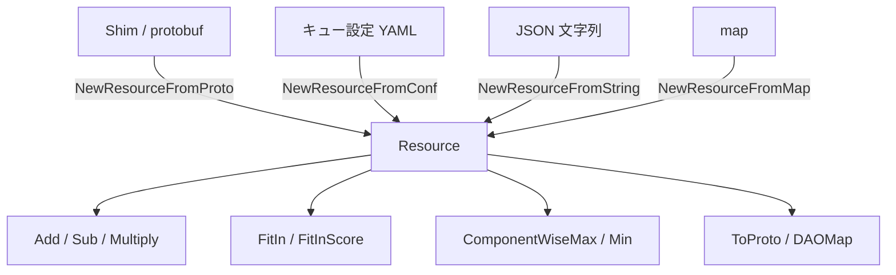

# 第16章 リソースモデル

> 本章で読むソース:
>
> - [pkg/common/resources/resources.go L37-L53](https://github.com/apache/yunikorn-core/blob/v1.8.0/pkg/common/resources/resources.go#L37-L53)
> - [pkg/common/resources/resources.go L245-L319](https://github.com/apache/yunikorn-core/blob/v1.8.0/pkg/common/resources/resources.go#L245-L319)
> - [pkg/common/resources/resources.go L330-L443](https://github.com/apache/yunikorn-core/blob/v1.8.0/pkg/common/resources/resources.go#L330-L443)
> - [pkg/common/resources/resources.go L980-L1103](https://github.com/apache/yunikorn-core/blob/v1.8.0/pkg/common/resources/resources.go#L980-L1103)
> - [pkg/common/resources/tracked_resources.go L32-L106](https://github.com/apache/yunikorn-core/blob/v1.8.0/pkg/common/resources/tracked_resources.go#L32-L106)
> - [pkg/common/resources/quantity.go L38-L101](https://github.com/apache/yunikorn-core/blob/v1.8.0/pkg/common/resources/quantity.go#L38-L101)

## この章の狙い

YuniKorn core がスケジューリングの判断に使うリソース表現の構造を理解する。
`Resource` は CPU やメモリなどをキーに持つ疎なマップであり、すべての演算は nil 安全に設計されている。
本章では `Resource` のデータ構造、算術演算、オーバーフロー防御、`TrackedResource` による使用量追跡、Kubernetes 互換の `Quantity` パースを扱う。

## 前提

第3章でスケジューリングサイクルがノードとキューのリソース量を比較しながら割り当てを決定することを述べた。
本章では、その比較に使う値の表現と演算の仕組みを下支えする共通基盤を読み解く。

## Resource 構造体

`Resource` はリソースの種類をキー、その量を値とするマップを持つ。

[pkg/common/resources/resources.go L37-L42](https://github.com/apache/yunikorn-core/blob/v1.8.0/pkg/common/resources/resources.go#L37-L42)

```go
type Resource struct {
	Resources map[string]Quantity
}

// No unit defined here for better performance
type Quantity int64
```

キーは `"cpu"` や `"memory"` といったリソース名であり、値は `int64` のエイリアスである `Quantity` 型である。
単位を持たない生整数である理由は、コメントにある通り、演算時の性能を優先した設計による。
Kubernetes の `resource.Quantity` は内部で `inf.Dec` を使っており、スケジューリングの比較演算には過剰な精度となる。
YuniKorn core は CPU をミリコア単位の整数、メモリをバイト単位の整数に正規化してから保持する。

## 疎な表現と nil 安全

`Resource` は必要なリソース種類だけを保持する疎なオブジェクトである。
CPU しか持たない `Resource` とメモリしか持たない `Resource` を加算すると、両方の種類を持つ `Resource` が得られる。
存在しないキーは 0 として扱われる。

[pkg/common/resources/resources.go L49-L53](https://github.com/apache/yunikorn-core/blob/v1.8.0/pkg/common/resources/resources.go#L49-L53)

```go
// Never update value of Zero
var Zero = NewResource()

func NewResource() *Resource {
	return &Resource{Resources: make(map[string]Quantity)}
}
```

`Zero` は更新しない不変の空リソースである。
nil の `Resource` を受け取った演算は `Zero` に置き換えて処理を続行する。
この設計により、呼び出し元は nil チェックを省略できる。

## リソースの生成経路

`Resource` は複数の経路から生成される。

[pkg/common/resources/resources.go L55-L102](https://github.com/apache/yunikorn-core/blob/v1.8.0/pkg/common/resources/resources.go#L55-L102)

```go
func NewResourceFromProto(proto *si.Resource) *Resource {
	out := NewResource()
	if proto == nil {
		return out
	}
	for k, v := range proto.Resources {
		out.Resources[k] = Quantity(v.Value)
	}
	return out
}

// ... (中略) ...

func NewResourceFromConf(configMap map[string]string) (*Resource, error) {
	res := NewResource()
	for key, strVal := range configMap {
		var intValue Quantity
		var err error
		switch key {
		case common.CPU:
			intValue, err = ParseVCore(strVal)
		default:
			intValue, err = ParseQuantity(strVal)
		}
		if err != nil {
			return nil, err
		}
		res.Resources[key] = intValue
	}
	return res, nil
}
```

`NewResourceFromProto` は Shim から届く protobuf を内部表現に変換する。
`NewResourceFromConf` はキュー設定からリソース量を読み込む。
CPU だけは `ParseVCore` を使い、ミリコアへの変換を行う。
それ以外のリソースは `ParseQuantity` で SI サフィックスを解釈する。



## 算術演算

`Resource` に対する算術演算は、元のオブジェクトを変更しない関数型と、変更する破壊型の2種類がある。

### 破壊的な演算

`AddTo`、`SubFrom`、`MultiplyTo` はレシーバの `Resource` を直接書き換える。
一時的な計算で使い回す場合に割り当てを減らす目的で用意されている。

[pkg/common/resources/resources.go L165-L199](https://github.com/apache/yunikorn-core/blob/v1.8.0/pkg/common/resources/resources.go#L165-L199)

```go
func (r *Resource) AddTo(add *Resource) {
	if r != nil {
		if add == nil {
			return
		}
		for k, v := range add.Resources {
			r.Resources[k] = addVal(r.Resources[k], v)
		}
	}
}

// ... (中略) ...

func (r *Resource) MultiplyTo(ratio float64) {
	if r != nil {
		for k, v := range r.Resources {
			r.Resources[k] = mulValRatio(v, ratio)
		}
	}
}
```

### 非破壊的な演算

`Add`、`Sub`、`Multiply` は新しい `Resource` を返す。

[pkg/common/resources/resources.go L330-L365](https://github.com/apache/yunikorn-core/blob/v1.8.0/pkg/common/resources/resources.go#L330-L365)

```go
func Add(left, right *Resource) *Resource {
	// check nil inputs and shortcut
	if left == nil {
		left = Zero
	}
	if right == nil {
		return left.Clone()
	}

	// neither are nil, clone one and add the other
	out := left.Clone()
	for k, v := range right.Resources {
		out.Resources[k] = addVal(out.Resources[k], v)
	}
	return out
}

// ... (中略) ...

func Sub(left, right *Resource) *Resource {
	// check nil inputs and shortcut
	if left == nil {
		left = Zero
	}
	if right == nil {
		return left.Clone()
	}

	// neither are nil, clone one and sub the other
	out := left.Clone()
	for k, v := range right.Resources {
		out.Resources[k] = subVal(out.Resources[k], v)
	}
	return out
}
```

nil の `right` が渡された場合は `left` のクローンを返すだけであり、不要なマップ走査を回避する。

## オーバーフロー防御

`Quantity` は `int64` であるため、加算や乗算でオーバーフローが発生しうる。
YuniKorn core はオーバーフローを検出し、`math.MaxInt64` または `math.MinInt64` にクランプする。

[pkg/common/resources/resources.go L245-L264](https://github.com/apache/yunikorn-core/blob/v1.8.0/pkg/common/resources/resources.go#L245-L264)

```go
func addVal(valA, valB Quantity) Quantity {
	result := valA + valB
	// check if the sign wrapped
	if (result < valA) != (valB < 0) {
		if valA < 0 {
			// return the minimum possible
			log.Log(log.Resources).Warn("Resource calculation wrapped: returned minimum value possible",
				zap.Int64("valueA", int64(valA)),
				zap.Int64("valueB", int64(valB)))
			return math.MinInt64
		}
		// return the maximum possible
		log.Log(log.Resources).Warn("Resource calculation wrapped: returned maximum value possible",
			zap.Int64("valueA", int64(valA)),
			zap.Int64("valueB", int64(valB)))
		return math.MaxInt64
	}
	// not wrapped normal case
	return result
}
```

符号の反転を検出する `(result < valA) != (valB < 0)` という判定は、分岐を1回で済ませる工夫である。
正のオーバーフローでは `result < valA` が真になり `valB < 0` は偽になるため、条件は真となる。
負のオーバーフローではその逆が成立する。

乗算ではゼロの場合を早期リターンで処理する。

[pkg/common/resources/resources.go L270-L295](https://github.com/apache/yunikorn-core/blob/v1.8.0/pkg/common/resources/resources.go#L270-L295)

```go
func mulVal(valA, valB Quantity) Quantity {
	// optimise the zero cases (often hit with zero resource)
	if valA == 0 || valB == 0 {
		return 0
	}
	result := valA * valB
	// check the wrapping
	// MinInt64 * -1 is special: it returns MinInt64, it should return MaxInt64 but does not trigger
	// wrapping if not specially checked
	if (result/valB != valA) || (valA == math.MinInt64 && valB == -1) {
		// ... (中略) ...
	}
	// not wrapped normal case
	return result
}
```

ゼロの早期リターンはコメントに「often hit with zero resource」とある通り、実際のスケジューリングで頻繁に命中する最適化である。
`MinInt64 * -1` の特別扱いは、この乗算が `MinInt64` を返す（本来は `MaxInt64` べき）にもかかわらずオーバーフロー検出をすり抜ける問題を回避するためである。

## 適合判定とスコアリング

あるリソースが別のリソースに収まるかを判定するのが `FitIn` である。

[pkg/common/resources/resources.go L448-L493](https://github.com/apache/yunikorn-core/blob/v1.8.0/pkg/common/resources/resources.go#L448-L493)

```go
func (r *Resource) FitIn(smaller *Resource) bool {
	return r.fitIn(smaller, false, false)
}

// ... (中略) ...

func (r *Resource) fitIn(smaller *Resource, skipUndef bool, actual bool) bool {
	if r == nil {
		r = Zero
	}
	if smaller == nil {
		return true
	}

	for k, v := range smaller.Resources {
		largerValue, ok := r.Resources[k]
		if skipUndef && !ok {
			continue
		}
		if !actual {
			largerValue = max(0, largerValue)
		}
		if v > largerValue {
			return false
		}
	}
	return true
}
```

`skipUndef` が真の場合、レシーバ側に存在しないリソース種類は無限大として扱う。
これはキューのクォータ判定で、未定義のリソース種類を制限なしとみなす用途に使われる。

`FitInScore` は適合の度合いを数値化する。

[pkg/common/resources/resources.go L213-L240](https://github.com/apache/yunikorn-core/blob/v1.8.0/pkg/common/resources/resources.go#L213-L240)

```go
func (r *Resource) FitInScore(fit *Resource) float64 {
	var score float64
	if r == nil || fit == nil {
		if fit != nil {
			return float64(len(fit.Resources))
		}
		return score
	}
	for key, fitVal := range fit.Resources {
		if fitVal <= 0 {
			continue
		}
		resVal := r.Resources[key]
		if resVal <= 0 {
			score++
			continue
		}
		if fitVal > resVal {
			score += float64(fitVal-resVal) / float64(fitVal)
		}
	}
	return score
}
```

スコアは 0 が完全な適合であり、値が大きいほど適合から遠い。
各リソース種類について `(fitVal - resVal) / fitVal` を計算し合計する。
このスコアリングは、複数の候補の中から最も適合度の高いノードを選ぶ比較処理で使われる。

## 比較演算

`StrictlyGreaterThanZero` は、リソースが正の値を少なくとも1つ持ち、かつ負の値を含まないかを判定する。

[pkg/common/resources/resources.go L980-L994](https://github.com/apache/yunikorn-core/blob/v1.8.0/pkg/common/resources/resources.go#L980-L994)

```go
func StrictlyGreaterThanZero(larger *Resource) bool {
	if larger == nil {
		return false
	}
	greater := false
	for _, v := range larger.Resources {
		if v < 0 {
			return false
		}
		if v > 0 {
			greater = true
		}
	}
	return greater
}
```

nil の `Resource` は false を返す。
負の値が1つでもあれば即座に false を返し、正の値を見つけたら `greater` フラグを立てる。
すべての値を走査するのは、負の値が含まれていないことを確認する必要があるためである。

`ComponentWiseMax` と `ComponentWiseMin` は、リソース種類ごとに最大値または最小値を取る。

[pkg/common/resources/resources.go L1092-L1103](https://github.com/apache/yunikorn-core/blob/v1.8.0/pkg/common/resources/resources.go#L1092-L1103)

```go
func ComponentWiseMax(left, right *Resource) *Resource {
	out := NewResource()
	if left != nil && right != nil {
		for k, v := range left.Resources {
			out.Resources[k] = max(v, right.Resources[k])
		}
		for k, v := range right.Resources {
			out.Resources[k] = max(v, left.Resources[k])
		}
	}
	return out
}
```

両方の `Resource` に存在するキーは `max` で比較し、片方にしかないキーはそのまま採用する。
2回のループで左右のキーを網羅的に処理している。

## Quantity の解釈

`Quantity` は SI サフィックス付きの文字列からパースされる。

[pkg/common/resources/quantity.go L38-L55](https://github.com/apache/yunikorn-core/blob/v1.8.0/pkg/common/resources/quantity.go#L38-L55)

```go
var legal = regexp.MustCompile(`^(?P<Number>[0-9]+)\s*(?P<Suffix>([mkKMGTPE]i?)?)$`)

var multipliers = map[string]int64{
	"":   1,
	"m":  1, // special handling if milli is in use
	"k":  1e3,
	"M":  1e6,
	"G":  1e9,
	"T":  1e12,
	"P":  1e15,
	"E":  1e18,
	"Ki": 1 << 10,
	"Mi": 1 << 20,
	"Gi": 1 << 30,
	"Ti": 1 << 40,
	"Pi": 1 << 50,
	"Ei": 1 << 60,
}
```

10進サフィックス（`k`、`M`、`G` など）は1000の累乗、2進サフィックス（`Ki`、`Mi`、`Gi` など）は1024の累乗である。
`m` はミリコア専用であり、`ParseQuantity` では拒否され `ParseVCore` でのみ許可される。

[pkg/common/resources/quantity.go L69-L101](https://github.com/apache/yunikorn-core/blob/v1.8.0/pkg/common/resources/quantity.go#L69-L101)

```go
func parse(value string, milli bool) (Quantity, error) {
	value = strings.TrimSpace(value)

	parts := legal.FindStringSubmatch(value)
	if len(parts) == 0 {
		return 0, errors.New("invalid quantity")
	}
	number := parts[1]
	suffix := parts[2]

	result, err := strconv.ParseInt(number, 10, 64)
	if err != nil {
		return 0, errors.New("invalid quantity: overflow")
	}

	scale, ok := multipliers[suffix]
	if !ok || (suffix == "m" && !milli) {
		return 0, errors.New("invalid suffix")
	}

	bigResult := big.NewInt(result)
	bigScale := big.NewInt(scale)
	bigResult = bigResult.Mul(bigResult, bigScale)
	if milli && suffix != "m" {
		bigResult.Mul(bigResult, big.NewInt(1000))
	}
	if !bigResult.IsInt64() {
		return 0, errors.New("invalid quantity: overflow")
	}
	result = bigResult.Int64()

	return Quantity(result), nil
}
```

オーバーフローの可能性がある乗算は `math/big` で安全に実行し、最終的に `int64` に収まることを確認してから格納する。
`milli` が真でサフィックスが `m` でない場合、値を1000倍してミリコアに正規化する。
たとえば `"1"` は `1000`（ミリコア）になり、`"500m"` は `500` のままになる。

## TrackedResource による使用量追跡

`TrackedResource` はアプリケーションのリソース使用量をインスタンス種類ごとに集計する。

[pkg/common/resources/tracked_resources.go L32-L44](https://github.com/apache/yunikorn-core/blob/v1.8.0/pkg/common/resources/tracked_resources.go#L32-L44)

```go
type TrackedResource struct {
	TrackedResourceMap map[string]*Resource

	locking.RWMutex
}

func NewTrackedResource() *TrackedResource {
	return &TrackedResource{TrackedResourceMap: make(map[string]*Resource)}
}
```

トップレベルのキーはインスタンスタイプ（`"m5.large"` など）であり、値はリソース種類ごとの累積使用時間（秒）である。
`RWMutex` を埋め込むことで、読み取りは並行、書き込みは排他でアクセスできる。

`AggregateTrackedResource` は、リソースが確保されてから解放されるまでの時間を計算して累積する。

[pkg/common/resources/tracked_resources.go L89-L106](https://github.com/apache/yunikorn-core/blob/v1.8.0/pkg/common/resources/tracked_resources.go#L89-L106)

```go
func (tr *TrackedResource) AggregateTrackedResource(instType string, resource *Resource, bindTime time.Time) {
	if resource == nil {
		return
	}
	tr.Lock()
	defer tr.Unlock()

	releaseTime := time.Now()
	timeDiff := int64(releaseTime.Sub(bindTime).Seconds())
	aggregatedResourceTime, ok := tr.TrackedResourceMap[instType]
	if !ok {
		aggregatedResourceTime = NewResource()
	}
	for key, element := range resource.Resources {
		aggregatedResourceTime.Resources[key] += element * Quantity(timeDiff)
	}
	tr.TrackedResourceMap[instType] = aggregatedResourceTime
}
```

`bindTime` から現在時刻までの秒数を求め、各リソース量に乗算して加算する。
この集計値は、インスタンスタイプごとのコスト分析や使用傾向の把握に使われる。

## まとめ

`Resource` は `map[string]Quantity` を中核とする疎なリソース表現であり、すべての演算が nil 安全に設計されている。
オーバーフロー防御は `addVal`、`mulVal` で符号反転と除算再検算により実装され、`math/big` を使った `Quantity` パースでも同じ安全志向が見られる。
`TrackedResource` は `RWMutex` で並行性を確保しつつ、インスタンス種類ごとの累積使用時間を追跡する。
リソースモデルはスケジューリングの根幹であり、その性能と正確性はキューの公平性とノードの適合判定に直結する。

## 関連する章

- [第3章 スケジューリングサイクル](../part01-scheduler-core/03-scheduling-cycle.md)
- [第4章 キュー階層と共有ポリシー](../part01-scheduler-core/04-queue-hierarchy.md)
- [第6章 ノード管理](../part01-scheduler-core/06-node-management.md)
