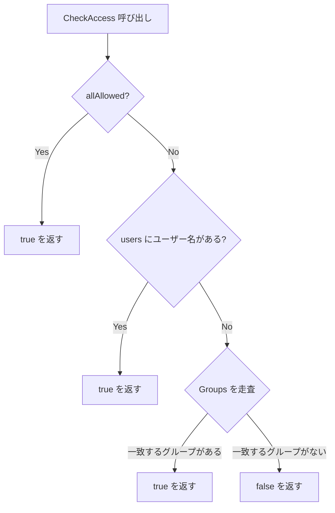

# 第17章 セキュリティと ACL

> 本章で読むソース:
>
> - [pkg/common/security/acl.go L37-L152](https://github.com/apache/yunikorn-core/blob/v1.8.0/pkg/common/security/acl.go#L37-L152)
> - [pkg/common/security/usergroup.go L37-L287](https://github.com/apache/yunikorn-core/blob/v1.8.0/pkg/common/security/usergroup.go#L37-L287)
> - [pkg/common/security/usergroup_os_resolver.go L27-L41](https://github.com/apache/yunikorn-core/blob/v1.8.0/pkg/common/security/usergroup_os_resolver.go#L27-L41)
> - [pkg/common/security/usergroup_no_resolver.go L29-L59](https://github.com/apache/yunikorn-core/blob/v1.8.0/pkg/common/security/usergroup_no_resolver.go#L29-L59)
> - [pkg/common/security/usergroup_ldap_resolver.go L39-L383](https://github.com/apache/yunikorn-core/blob/v1.8.0/pkg/common/security/usergroup_ldap_resolver.go#L39-L383)
> - [pkg/common/security/ldap_validator.go L52-L381](https://github.com/apache/yunikorn-core/blob/v1.8.0/pkg/common/security/ldap_validator.go#L52-L381)
> - [pkg/common/constants.go L21-L60](https://github.com/apache/yunikorn-core/blob/v1.8.0/pkg/common/constants.go#L21-L60)

## この章の狙い

YuniKorn core がキューへのアクセスを制御する ACL の仕組みと、ユーザー情報を解決するリゾルバの構造を理解する。
`ACL` はユーザー名とグループ名のマップでアクセスを判定し、`UserGroupCache` はリゾルバの解決結果をキャッシュする。
本章では ACL の構築とチェック、4種類のリゾルバ、キャッシュの寿命管理、LDAP 設定の検証を読む。

## 前提

第7章でプレイスメントルールがアプリケーションをキューに配置することを述べた。
第10章でユーザーリソース制限がユーザーごとに割り当て量を抑える。
本章は、それらの機能が大前提とする「ユーザーとグループの識別」と「キューへのアクセス許可」の仕組みを読み解く。

## ACL 構造体

`ACL` はキューへのアクセス権限を保持する。

[pkg/common/security/acl.go L37-L41](https://github.com/apache/yunikorn-core/blob/v1.8.0/pkg/common/security/acl.go#L37-L41)

```go
type ACL struct {
	users      map[string]bool
	groups     map[string]bool
	allAllowed bool
}
```

`users` は許可されたユーザー名の集合、`groups` は許可されたグループ名の集合である。
`allAllowed` はワイルドカード（`*`）による全許可フラグである。
マップの値は `bool` であり、存在チェックだけでアクセス判定が完了する。

## ACL の構築

`NewACL` は設定文字列から `ACL` を構築する。

[pkg/common/security/acl.go L113-L132](https://github.com/apache/yunikorn-core/blob/v1.8.0/pkg/common/security/acl.go#L113-L132)

```go
func NewACL(aclStr string, silence bool) (ACL, error) {
	acl := ACL{}
	if aclStr == "" {
		return acl, nil
	}
	// before trimming check
	// should have no more than two groups defined
	fields := strings.Split(aclStr, common.Space)
	if len(fields) > 2 {
		return acl, fmt.Errorf("multiple spaces found in ACL: '%s'", aclStr)
	}
	// trim and check for wildcard
	acl.setAllAllowed(aclStr)
	// parse users and groups
	acl.setUsers(strings.Split(fields[0], common.Separator), silence)
	if len(fields) == 2 {
		acl.setGroups(strings.Split(fields[1], common.Separator), silence)
	}
	return acl, nil
}
```

設定文字列の書式は `"user1,user2 group1,group2"` である。
スペースでユーザーリストとグループリストを区切り、カンマで各要素を列挙する。
空文字列を渡すとすべてのフィールドが空の `ACL` が返り、結果として誰もアクセスできない。

`setUsers` は正規表現でユーザー名の妥当性を検証する。

[pkg/common/security/acl.go L34-L75](https://github.com/apache/yunikorn-core/blob/v1.8.0/pkg/common/security/acl.go#L34-L75)

```go
var userNameRegExp = regexp.MustCompile("^[_a-zA-Z][a-zA-Z0-9_.@-]*[$]?$")

// ... (中略) ...

func (a *ACL) setUsers(userList []string, silence bool) {
	a.users = make(map[string]bool)
	// special case if the user list is just the wildcard
	if len(userList) == 1 && userList[0] == common.Wildcard {
		if !silence {
			log.Log(log.Security).Info("user list is wildcard, allowing all access")
		}
		a.allAllowed = true
		return
	}
	// add all users to the map
	for _, user := range userList {
		if user == "" {
			continue
		}
		if userNameRegExp.MatchString(user) {
			a.users[user] = true
		} else if !silence {
			log.Log(log.Security).Info("ignoring user in ACL definition",
				zap.String("user", user))
		}
	}
}
```

ユーザーリストがワイルドカード1つだけの場合、`allAllowed` を立てて全アクセスを許可する。
それ以外の場合は各ユーザー名を正規表現で照合し、不正な名前は黙って無視する。
`silence` フラグが真の場合、無視したことをログに出さない。

`setGroups` も同様にグループ名の妥当性を検証する。

[pkg/common/security/acl.go L79-L110](https://github.com/apache/yunikorn-core/blob/v1.8.0/pkg/common/security/acl.go#L79-L110)

```go
func (a *ACL) setGroups(groupList []string, silence bool) {
	a.groups = make(map[string]bool)
	// special case if the wildcard was already set
	if a.allAllowed {
		if !silence {
			log.Log(log.Security).Info("ignoring group list in ACL: wildcard set")
		}
		return
	}
	if len(groupList) == 1 && groupList[0] == common.Wildcard {
		if !silence {
			log.Log(log.Security).Info("group list is wildcard, allowing all access")
		}
		a.users = make(map[string]bool)
		a.allAllowed = true
		return
	}
	// add all groups to the map
	for _, group := range groupList {
		if group == "" {
			continue
		}
		if groupRegExp.MatchString(group) {
			a.groups[group] = true
		} else if !silence {
			log.Log(log.Security).Info("ignoring group in ACL",
				zap.String("group", group))
		}
	}
}
```

すでに `allAllowed` が立っている場合、グループリストの解析をスキップする。
グループ側のワイルドカードも `allAllowed` を立て、ユーザーマップを空にリセットする。

## アクセスチェック

`CheckAccess` は `UserGroup` を受け取り、アクセスの可否を返す。

[pkg/common/security/acl.go L135-L152](https://github.com/apache/yunikorn-core/blob/v1.8.0/pkg/common/security/acl.go#L135-L152)

```go
func (a ACL) CheckAccess(userObj UserGroup) bool {
	// shortcut allow all
	if a.allAllowed {
		return true
	}
	// if the ACL is not the wildcard we have non nil lists
	// check user access
	if a.users[userObj.User] {
		return true
	}
	// get groups for the user and check them
	for _, group := range userObj.Groups {
		if a.groups[group] {
			return true
		}
	}
	return false
}
```

判定の順序は `allAllowed`、ユーザー直接一致、グループ一致の3段階である。
`allAllowed` のショートカットが最初に来ることで、ワイルドカード設定時の判定は1回の分岐で完了する。
ユーザー名がマップに存在すれば即座に true を返し、なければ所属グループを1つずつ照合する。
グループの照合も、1つでも一致すれば即座に true を返す早期終了である。



## UserGroup 構造体

`UserGroup` は解決済みのユーザー情報を保持する。

[pkg/common/security/usergroup.go L62-L67](https://github.com/apache/yunikorn-core/blob/v1.8.0/pkg/common/security/usergroup.go#L62-L67)

```go
type UserGroup struct {
	User     string
	Groups   []string
	failed   bool
	resolved int64
}
```

`User` はユーザー名、`Groups` は所属グループ名のリストである。
`failed` は解決に失敗したかどうかを示すフラグであり、`resolved` は最後に解決を試みた時刻（Unix タイムスタンプ）である。
`failed` と `resolved` はキャッシュの寿命管理に使われる。

## UserGroupCache

`UserGroupCache` はユーザー情報の解決結果をキャッシュするシングルトンである。

[pkg/common/security/usergroup.go L44-L59](https://github.com/apache/yunikorn-core/blob/v1.8.0/pkg/common/security/usergroup.go#L44-L59)

```go
var instance *UserGroupCache
var once = &sync.Once{}
var stopped atomic.Bool

// ... (中略) ...

type UserGroupCache struct {
	lock     locking.RWMutex
	interval time.Duration
	ugs      map[string]*UserGroup
	lookup        func(userName string) (*user.User, error)
	lookupGroupID func(gid string) (*user.Group, error)
	groupIds      func(osUser *user.User) ([]string, error)
	stop          chan struct{}
}
```

`instance` は `sync.Once` で1度だけ初期化される。
`lookup`、`lookupGroupID`、`groupIds` は関数フィールドであり、リゾルバの種類に応じて差し替えられる。
この設計により、テストではモックを、本番では OS や LDAP の実装を注入できる。

`GetUserGroupCache` はリゾルバの種類に応じてキャッシュを初期化する。

[pkg/common/security/usergroup.go L82-L106](https://github.com/apache/yunikorn-core/blob/v1.8.0/pkg/common/security/usergroup.go#L82-L106)

```go
func GetUserGroupCache(ugr configs.UserGroupResolver, ldapConfigReader ConfigReader, ldapAccess LdapAccess) *UserGroupCache {
	resolver := ugr.Type
	once.Do(func() {
		switch resolver {
		case Test:
			log.Log(log.Security).Info("creating test user group resolver")
			instance = GetUserGroupCacheTest()
		case Os:
			log.Log(log.Security).Info("creating OS user group resolver")
			instance = GetUserGroupCacheOS()
		case Ldap:
			log.Log(log.Security).Info("creating LDAP user group resolver")
			instance = GetUserGroupCacheLdap(ldapConfigReader, ldapAccess)
		default:
			log.Log(log.Security).Info("creating UserGroupCache without resolver")
			instance = GetUserGroupNoResolve()
		}
		instance.ugs = make(map[string]*UserGroup)
		log.Log(log.Security).Info("starting UserGroupCache cleaner",
			zap.Stringer("cleanerInterval", instance.interval))
		go instance.run()
		stopped.Store(false)
	})
	return instance
}
```

4種類のリゾルバが選択可能である。

- **No resolver**: 解決を行わず、受け取ったユーザー名をそのまま返す。Kubernetes のデフォルト。
- **OS resolver**: OS の `user.Lookup` を使ってユーザーとグループを解決する。
- **LDAP resolver**: LDAP プロトコルでリモートのディレクトリサービスに問い合わせる。
- **Test resolver**: テスト用のフェイク解決。

## キャッシュの寿命管理

`UserGroupCache` はバックグラウンドのゴルーチンで定期的に期限切れのエントリを削除する。

[pkg/common/security/usergroup.go L38-L41](https://github.com/apache/yunikorn-core/blob/v1.8.0/pkg/common/security/usergroup.go#L38-L41)

```go
const (
	negcache        = 30  // time to cache failures for lookups in seconds
	poscache        = 300 // time to cache a positive lookup in seconds
	cleanerInterval = 60  // default cleaner interval
)
```

正の解決結果は300秒（5分）、負の解決結果は30秒で期限切れとなる。
クリーナーは60秒間隔で起動する。

[pkg/common/security/usergroup.go L109-L138](https://github.com/apache/yunikorn-core/blob/v1.8.0/pkg/common/security/usergroup.go#L109-L138)

```go
func (c *UserGroupCache) run() {
	log.Log(log.Security).Info("Starting user/group cache cleaner")
	for {
		select {
		case <-c.stop:
			return
		case <-time.After(c.interval):
			runStart := time.Now()
			c.cleanUpCache()
			log.Log(log.Security).Debug("time consumed cleaning the UserGroupCache",
				zap.Stringer("duration", time.Since(runStart)))
		}
	}
}

// ... (中略) ...

func (c *UserGroupCache) cleanUpCache() {
	oldest := now.Unix() - poscache
	oldestFailed := now.Unix() - negcache
	instance.lock.Lock()
	defer instance.lock.Unlock()
	for key, val := range c.ugs {
		if val.resolved < oldest || (val.failed && val.resolved < oldestFailed) {
			delete(c.ugs, key)
		}
	}
}
```

`run` は `stop` チャネルが閉じられるまで `interval` ごとに `cleanUpCache` を呼ぶ。
`cleanUpCache` は全エントリを走査し、正のエントリは `poscache` 秒、負のエントリは `negcache` 秒で削除する。
負のキャッシュを短く保つ理由は、一時的な解決失敗が長く残ることを防ぐためである。

## ユーザー解決の流れ

`GetUserGroup` はキャッシュを引いて、なければリゾルバで解決する。

[pkg/common/security/usergroup.go L186-L238](https://github.com/apache/yunikorn-core/blob/v1.8.0/pkg/common/security/usergroup.go#L186-L238)

```go
func (c *UserGroupCache) GetUserGroup(userName string) (UserGroup, error) {
	if userName == "" {
		return UserGroup{}, fmt.Errorf("empty user cannot resolve")
	}
	// look in the cache before resolving
	c.lock.RLock()
	ug, ok := c.ugs[userName]
	c.lock.RUnlock()
	// return if this was not a negative cache that has not timed out
	if ok && !ug.failed {
		return *ug, nil
	}
	// nothing in cache so create a new one
	if ug == nil {
		ug = &UserGroup{
			User: userName,
		}
	}
	if ug.failed {
		return *ug, fmt.Errorf("user resolution failed, cached data returned: %v", time.Unix(ug.resolved, 0))
	}
	// resolve if we do not have it in the cache
	osUser, err := c.lookup(userName)
	if err != nil {
		log.Log(log.Security).Error("Error resolving user: does not exist",
			zap.String("userName", userName),
			zap.Error(err))
		ug.failed = true
	}
	if osUser != nil {
		err = ug.resolveGroups(osUser, c)
		if err != nil {
			log.Log(log.Security).Error("Error resolving groups for user",
				zap.String("userName", userName),
				zap.Error(err))
			ug.failed = true
		}
	}
	ug.resolved = now.Unix()
	c.lock.Lock()
	defer c.lock.Unlock()
	c.ugs[userName] = ug
	return *ug, err
}
```

まずリードロックでキャッシュを参照し、正のエントリ（`ok && !ug.failed`）があれば即座に返す。
負のキャッシュ（`ug.failed`）の場合もキャッシュ済み結果を返して終了する。
キャッシュミス（`ug == nil`）の場合のみ、`lookup` でユーザーを検索し、`resolveGroups` でグループを解決する。
解決の成否にかかわらず結果をキャッシュし、リードロックを解除してから書き込みロックを取得して保存する。

## No リゾルバ

Kubernetes 環境ではユーザー情報を外部に問い合わせない。

[pkg/common/security/usergroup_no_resolver.go L29-L59](https://github.com/apache/yunikorn-core/blob/v1.8.0/pkg/common/security/usergroup_no_resolver.go#L29-L59)

```go
func GetUserGroupNoResolve() *UserGroupCache {
	return &UserGroupCache{
		ugs:           map[string]*UserGroup{},
		interval:      cleanerInterval * time.Second,
		lookup:        noLookupUser,
		lookupGroupID: noLookupGroupID,
		groupIds:      noLookupGroupIds,
		stop:          make(chan struct{}),
	}
}

func noLookupUser(userName string) (*user.User, error) {
	return &user.User{
		Uid:      "-1",
		Gid:      userName,
		Username: userName,
	}, nil
}

func noLookupGroupID(gid string) (*user.Group, error) {
	group := user.Group{Gid: gid}
	group.Name = gid
	return &group, nil
}

func noLookupGroupIds(osUser *user.User) ([]string, error) {
	return []string{}, nil
}
```

`noLookupUser` はユーザー名をそのまま `Username` に設定し、`Uid` は `"-1"` を返す。
`noLookupGroupIds` は空のリストを返すため、追加のグループ解決は行われない。
これは Kubernetes のサービスアカウントのように、OS に存在しないユーザーを扱うための設計である。

## OS リゾルバ

OS リゾルバは Go 標準ライブラリの `os/user` を使う。

[pkg/common/security/usergroup_os_resolver.go L27-L41](https://github.com/apache/yunikorn-core/blob/v1.8.0/pkg/common/security/usergroup_os_resolver.go#L27-L41)

```go
func GetUserGroupCacheOS() *UserGroupCache {
	return &UserGroupCache{
		ugs:           map[string]*UserGroup{},
		interval:      cleanerInterval * time.Second,
		lookup:        user.Lookup,
		lookupGroupID: user.LookupGroupId,
		groupIds:      wrappedGroupIds,
		stop:          make(chan struct{}),
	}
}

func wrappedGroupIds(osUser *user.User) ([]string, error) {
	return osUser.GroupIds()
}
```

`user.Lookup` は `/etc/passwd` や NSS を通じてユーザーを検索する。
`user.LookupGroupId` は GID からグループ名を引く。
`wrappedGroupIds` は `osUser.GroupIds()` を呼ぶだけのラッパーであり、テストでモックに差し替えるために用意されている。

## LDAP リゾルバ

LDAP リゾルバはリモートのディレクトリサービスに問い合わせる。

[pkg/common/security/usergroup_ldap_resolver.go L39-L57](https://github.com/apache/yunikorn-core/blob/v1.8.0/pkg/common/security/usergroup_ldap_resolver.go#L39-L57)

```go
type LdapLookup struct {
	config LdapConfig
	access LdapAccess
}

type LdapAccess interface {
	DialURL(url string, options ...ldap.DialOpt) (*ldap.Conn, error)
	Bind(conn *ldap.Conn, username, password string) error
	Search(conn *ldap.Conn, searchRequest *ldap.SearchRequest) (*ldap.SearchResult, error)
	Close(conn *ldap.Conn)
}
```

`LdapAccess` インターフェースは LDAP 接続の操作を抽象化する。
このインターフェースにより、テストではモック実装を、本番では `ldapAccessImpl` を注入できる。

`LdapConfig` は接続先と検索条件を保持する。

[pkg/common/security/usergroup_ldap_resolver.go L236-L247](https://github.com/apache/yunikorn-core/blob/v1.8.0/pkg/common/security/usergroup_ldap_resolver.go#L236-L247)

```go
type LdapConfig struct {
	Host         string
	Port         int
	BaseDN       string
	Filter       string
	GroupAttr    string
	ReturnAttr   []string
	BindUser     string
	BindPassword string
	Insecure     bool
	useSsl       bool
}
```

LDAP 設定は Kubernetes Secret として `/run/secrets/ldap` にマウントされる。

[pkg/common/security/usergroup_ldap_resolver.go L323-L383](https://github.com/apache/yunikorn-core/blob/v1.8.0/pkg/common/security/usergroup_ldap_resolver.go#L323-L383)

```go
func ldapSearch(ldapAccess LdapAccess, ldapConf LdapConfig, userName string) (*ldap.SearchResult, error) {
	var ldapUri string
	if ldapConf.useSsl {
		ldapUri = "ldaps"
	} else {
		ldapUri = "ldap"
	}

	ldapaddr := fmt.Sprintf("%s://%s:%d", ldapUri, ldapConf.Host, ldapConf.Port)

	l, err := ldapAccess.DialURL(ldapaddr,
		ldap.DialWithTLSConfig(&tls.Config{InsecureSkipVerify: ldapConf.Insecure}))
	if err != nil {
		return nil, err
	}
	defer ldapAccess.Close(l)

	err = ldapAccess.Bind(l, ldapConf.BindUser, ldapConf.BindPassword)
	if err != nil {
		return nil, err
	}

	filter := fmt.Sprintf(ldapConf.Filter, userName)

	searchRequest := ldap.NewSearchRequest(
		ldapConf.BaseDN,
		ldap.ScopeWholeSubtree, ldap.NeverDerefAliases, 0, 0, false,
		filter,
		ldapConf.ReturnAttr,
		nil,
	)
	sr, err := ldapAccess.Search(l, searchRequest)
	if err != nil {
		return nil, err
	}

	return sr, nil
}
```

`ldapSearch` は接続、バインド、検索の3段階で LDAP クエリを実行する。
`Filter` に含まれる `%s` をユーザー名で置換し、`BaseDN` 配下を部分木検索する。
`InsecureSkipVerify` は TLS 証明書の検証をスキップするフラグであり、自己署名証明書を使う環境向けである。

## LDAP 設定の検証

`LdapValidator` は LDAP 設定の整合性を検査する。

[pkg/common/security/ldap_validator.go L52-L82](https://github.com/apache/yunikorn-core/blob/v1.8.0/pkg/common/security/ldap_validator.go#L52-L82)

```go
type LdapValidator struct {
	issues []ValidationIssue
}

// ... (中略) ...

func (v *LdapValidator) ValidateConfig(config *LdapConfig) bool {
	v.validateHost(config.Host)
	v.validatePort(config.Port)
	v.validateBaseDN(config.BaseDN)
	v.validateFilter(config.Filter)
	v.validateGroupAttr(config.GroupAttr)
	v.validateReturnAttr(config.ReturnAttr)
	v.validateBindUser(config.BindUser)
	v.validateBindPassword(config.BindPassword)

	// Consistency checks
	v.validateConsistency(config)

	// Log all issues
	v.logIssues()

	// Return true if no errors (warnings are acceptable)
	return !v.hasErrors()
}
```

検証項目はホスト名、ポート番号、BaseDN の書式、フィルターに `%s` プレースホルダーがあるか、括弧の対応、SSL と Insecure の矛盾など多岐にわたる。
問題は `ValidationError`（致命的）と `ValidationWarning`（許容）に分類され、エラーが1つでもあれば `false` を返す。
警告のみであれば設定は有効とみなされる。

## ConvertUGI による変換

`ConvertUGI` は Shim から届く `si.UserGroupInformation` を内部の `UserGroup` に変換する。

[pkg/common/security/usergroup.go L148-L181](https://github.com/apache/yunikorn-core/blob/v1.8.0/pkg/common/security/usergroup.go#L148-L181)

```go
func (c *UserGroupCache) ConvertUGI(ugi *si.UserGroupInformation, force bool) (UserGroup, error) {
	if ugi == nil || ugi.User == "" {
		if force {
			ugi.User = common.AnonymousUser
			ugi.Groups = []string{common.AnonymousGroup}
		} else {
			return UserGroup{}, fmt.Errorf("empty user cannot resolve")
		}
	}
	if len(ugi.Groups) == 0 {
		ug, err := c.GetUserGroup(ugi.User)
		if force && (err != nil || ug.failed) {
			ugi.Groups = []string{common.AnonymousGroup}
		} else {
			return ug, err
		}
	}

	if !configs.UserRegExp.MatchString(ugi.User) {
		return UserGroup{}, fmt.Errorf("invalid username, it contains invalid characters")
	}

	newUG := UserGroup{User: ugi.User}
	newUG.Groups = append(newUG.Groups, ugi.Groups...)
	newUG.resolved = now.Unix()
	c.lock.Lock()
	defer c.lock.Unlock()
	c.ugs[ugi.User] = &newUG
	return newUG, nil
}
```

`force` が真の場合、ユーザー名が空でも匿名ユーザー（`"nobody"`）を合成して処理を続行する。
グループ情報が空の場合は `GetUserGroup` で解決を試みる。
解決に失敗しても `force` が真なら匿名グループ（`"nogroup"`）を割り当てる。
ユーザー名の正規表現検証は `configs.UserRegExp` で行い、不正な文字を含む場合はエラーを返す。

## 定数と匿名ユーザー

セキュリティに関連する定数は `constants.go` で定義される。

[pkg/common/constants.go L21-L42](https://github.com/apache/yunikorn-core/blob/v1.8.0/pkg/common/constants.go#L21-L42)

```go
const (
	Empty = ""

	Wildcard              = "*"
	Separator             = ","
	Space                 = " "
	AnonymousUser         = "nobody"
	AnonymousGroup        = "nogroup"
	RecoveryQueue         = "@recovery@"
	RecoveryQueueFull     = "root." + RecoveryQueue
	DefaultPlacementQueue = "root.default"
	LdapHost              = "Host"
	LdapPort              = "Port"
	LdapBaseDN            = "BaseDN"
	LdapFilter            = "Filter"
	LdapGroupAttr         = "GroupAttr"
	LdapReturnAttr        = "ReturnAttr"
	LdapBindUser          = "BindUser"
	LdapBindPassword      = "BindPassword"
	LdapInsecure          = "Insecure"
	LdapSSL               = "SSL"
)
```

`AnonymousUser` と `AnonymousGroup` はユーザー情報を解決できない場合のフォールバックである。
LDAP 関連の定数は Secret のキー名として使われる。

## まとめ

`ACL` は `allAllowed`、ユーザーマップ、グループマップの3層でアクセスを判定する。
`allAllowed` のショートカットとマップの存在チェックによる早期終了が、判定の性能を支える。
`UserGroupCache` はシングルトンで管理され、正300秒、負30秒の TTL で解決結果をキャッシュする。
4種類のリゾルバ（No/OS/LDAP/Test）は関数フィールドの注入で切り替えられ、テスト容易性と環境適応性を両立する。
LDAP 設定は起動時に `LdapValidator` で検証され、書式エラーや整合性の問題が早期に検出される。

## 関連する章

- [第7章 プレイスメントルール](../part01-scheduler-core/07-placement-rules.md)
- [第10章 ユーザー・グループリソース制限](../part02-advanced-scheduling/10-user-group-limits.md)
- [第13章 パーティション管理](../part03-integration/13-partition-management.md)
