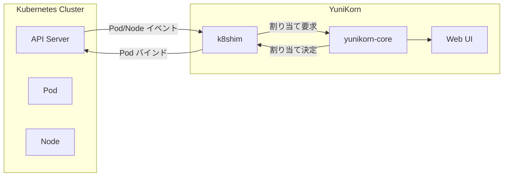
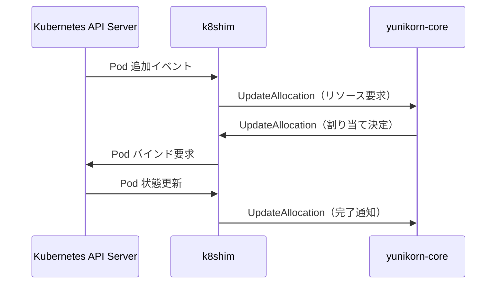
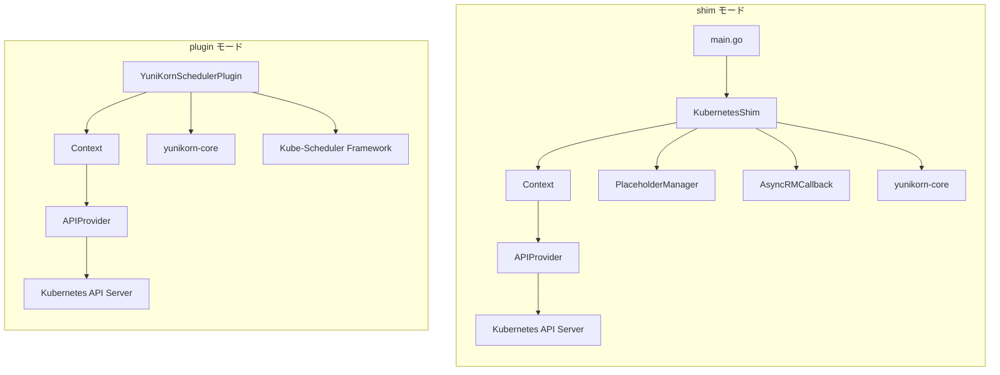

# 第1章 yunikorn-k8shim の全体像

> 本章で読むソース:
>
> - [pkg/shim/scheduler.go L45-L54](https://github.com/apache/yunikorn-k8shim/blob/v1.8.0/pkg/shim/scheduler.go#L45-L54)
> - [pkg/cache/context.go L67-L79](https://github.com/apache/yunikorn-k8shim/blob/v1.8.0/pkg/cache/context.go#L67-L79)
> - [pkg/client/interfaces.go L65-L72](https://github.com/apache/yunikorn-k8shim/blob/v1.8.0/pkg/client/interfaces.go#L65-L72)
> - [pkg/plugin/scheduler_plugin.go L73-L83](https://github.com/apache/yunikorn-k8shim/blob/v1.8.0/pkg/plugin/scheduler_plugin.go#L73-L83)
> - [pkg/admission/admission_controller.go L65-L71](https://github.com/apache/yunikorn-k8shim/blob/v1.8.0/pkg/admission/admission_controller.go#L65-L71)

## この章の狙い

本章では、YuniKorn k8shim が YuniKorn エコシステムの中で果たす役割を整理し、主要コンポーネントの配置と責務を把握する。
k8shim は Kubernetes と YuniKorn core のあいだに位置し、Pod の監視、メタデータ注入、スケジューリング指示の伝達を担う。
2つの動作モード（shim モードと scheduler plugin モード）の違いを理解することで、以降の章で読む各コンポーネントの配置先が見えてくる。

## 前提

- Kubernetes の Pod、Node、Informer の概念に馴染みがある。
- YuniKorn core（スケジューリングエンジン本体）の存在を知っている。
- Go のインターフェースと構造体の読み方がわかる。

## YuniKorn エコシステムにおける k8shim の位置

YuniKorn は3つの主要コンポーネントで構成される。

- **yunikorn-core**: スケジューリングエンジン本体。キュー階層の管理、リソース割り当ての決定、プリエンプションの計算を行う。
- **yunikorn-k8shim**: Kubernetes 連携レイヤー。Kubernetes API Server と通信し、Pod や Node の状態を core に伝え、core の決定を Kubernetes に反映する。
- **yunikorn-web**: Web UI。キューの状態や割り当て結果を可視化する。

k8shim は core と Kubernetes のあいだに位置する。
Kubernetes 側のイベント（Pod の追加、Node の追加など）を受け取り、core に伝える。
core からの割り当て決定を受け取り、Kubernetes に Pod のバインドを指示する。



## 2つの動作モード

k8shim には2つの動作モードがある。

### shim モード（独立プロセス）

k8shim を独立したプロセスとして起動するモード。
Kubernetes クラスタ内で Deployment として動作し、API Server と直接通信する。
Pod の監視、Admission Controller によるメタデータ注入、core との通信をすべて自身で行う。

`main.go` がエントリーポイントとなり、`KubernetesShim` 構造体を生成して起動する。

### scheduler plugin モード（Kubernetes Scheduling Framework 内蔵）

k8shim を Kubernetes の Scheduling Framework 向けプラグインとして動作させるモード。
kube-scheduler のプロセス内で動作し、`PreFilter`、`Filter`、`PostBind` などの拡張ポイントを通じてスケジューリングに介入する。

`YuniKornSchedulerPlugin` 構造体が `framework.PreFilterPlugin`、`framework.FilterPlugin`、`framework.PostBindPlugin` などのインターフェースを実装する。

```go
// pkg/plugin/scheduler_plugin.go L73-L83
type YuniKornSchedulerPlugin struct {
	locking.RWMutex
	context *cache.Context
}

// ensure all required interfaces are implemented
var _ framework.PreEnqueuePlugin = &YuniKornSchedulerPlugin{}
var _ framework.PreFilterPlugin = &YuniKornSchedulerPlugin{}
var _ framework.FilterPlugin = &YuniKornSchedulerPlugin{}
var _ framework.PostBindPlugin = &YuniKornSchedulerPlugin{}
var _ framework.EnqueueExtensions = &YuniKornSchedulerPlugin{}
```

plugin モードでは、kube-scheduler が Pod をスケジューリングする際に `PreFilter` や `Filter` が呼び出される。
k8shim はこれらのフックで、core が決定した割り当て結果に基づいて「どの Node にバインドすべきか」を kube-scheduler に伝える。

plugin モードは v1.8.0 時点では非推奨（deprecated）であり、standalone モードへの移行が推奨されている。

```go
// pkg/plugin/scheduler_plugin.go L272-L273
log.Log(log.ShimSchedulerPlugin).Warn("The plugin mode has been deprecated and will be removed in a future release. Consider migrating to YuniKorn standalone mode.")
```

## 主要コンポーネント

k8shim の内部構造を構成する主要コンポーネントを以下に示す。

### KubernetesShim

`KubernetesShim` は shim モードのエントリーポイントとなる構造体である。
`pkg/shim/scheduler.go` に定義され、スケジューラの全体を統括する。

```go
// pkg/shim/scheduler.go L46-L54
type KubernetesShim struct {
	apiFactory           client.APIProvider
	context              *cache.Context
	phManager            *cache.PlaceholderManager
	callback             api.ResourceManagerCallback
	stopChan             chan struct{}
	lock                 *locking.RWMutex
	outstandingAppsFound bool
}
```

- `apiFactory`: Kubernetes API Server と core との通信を仲介する。
- `context`: アプリケーション、タスク、ノードの状態を管理するキャッシュ。
- `phManager`: Gang スケジューリングで使う Placeholder Pod を管理する。
- `callback`: core からのコールバックを受け取る。

### Context

`Context` はスケジューリング状態を管理する構造体である。
`pkg/cache/context.go` に定義され、アプリケーション、タスク、ノード、Pod の状態を保持する。

```go
// pkg/cache/context.go L67-L79
type Context struct {
	applications   map[string]*Application        // apps
	schedulerCache *schedulercache.SchedulerCache // external cache
	apiProvider    client.APIProvider             // apis to interact with api-server, scheduler-core, etc
	predManager    predicates.PredicateManager    // K8s predicates
	pluginMode     bool                           // true if we are configured as a scheduler plugin
	namespace      string                         // yunikorn namespace
	configMaps     []*v1.ConfigMap                // cached yunikorn configmaps
	lock           *locking.RWMutex               // lock - used not only for context data but also to ensure that multiple event types are not executed concurrently
	txnID          atomic.Uint64                  // transaction ID counter
	klogger        klog.Logger
	podActivator   atomic.Value
}
```

`Context` は Kubernetes Informer からのイベント（Pod の追加、Node の追加など）を受け取り、アプリケーションやタスクの状態を更新する。
また、core からの割り当て決定を受け取り、Pod のバインドを指示する。

### Application と Task

`Application` は YuniKorn が管理するアプリケーション（ジョブやワークロード）を表す。
`Task` はアプリケーションに属する個々の Pod に対応する。

1つの `Application` は複数の `Task` を持つ。
各 `Task` は状態機械（state machine）を持ち、`New` → `Scheduling` → `Allocated` → `Bound` → `Completed` のように状態が遷移する。

### APIProvider

`APIProvider` は Kubernetes API Server と core との通信を仲介するインターフェースである。

```go
// pkg/client/interfaces.go L65-L72
type APIProvider interface {
	GetAPIs() *Clients
	AddEventHandler(handlers *ResourceEventHandlers) error
	Start()
	Stop()
	WaitForSync()
	IsTestingMode() bool
}
```

`APIFactory` がこのインターフェースの実装であり、各種 Informer を初期化し、イベントハンドラを登録する。

### AdmissionController

`AdmissionController` は Kubernetes の Admission Webhook として動作し、Pod 作成時に YuniKorn 用のメタデータ（アプリケーションID、キュー名、ユーザー情報など）を注入する。

```go
// pkg/admission/admission_controller.go L65-L71
type AdmissionController struct {
	conf              *conf.AdmissionControllerConf
	pcCache           *PriorityClassCache
	nsCache           *NamespaceCache
	annotationHandler *metadata.UserGroupAnnotationHandler
	labelExtractor    metadata.LabelExtractor
}
```

Admission Controller は独立したプロセスとして動作し、Pod 作成リクエストをフックしてラベルやアノテーションを追加する。
これにより、ユーザーは YuniKorn 固有のメタデータを明示的に指定しなくても、スケジューリングの対象になれる。

## scheduler-interface を介した core との連携

k8shim と core は `yunikorn-scheduler-interface` を介して通信する。
このインターフェースは gRPC または直接関数呼び出しで実装され、以下のメッセージをやり取りする。

- **RegisterResourceManager**: shim が core に自身を登録する。
- **UpdateAllocation**: core が shim に割り当て決定を通知する。
- **UpdateApplication**: core が shim にアプリケーション状態の変化を通知する。
- **UpdateNode**: core が shim にノード状態の変化を通知する。

`AsyncRMCallback` は core からのコールバックを受け取り、`Dispatcher` を通じてアプリケーションやタスクの状態を更新する。



## コンポーネント配置図

shim モードと plugin モードでのコンポーネント配置を以下に示す。



shim モードでは `KubernetesShim` が全体を統括し、`APIProvider` を通じて Kubernetes API Server と通信する。
plugin モードでは `YuniKornSchedulerPlugin` が Kube-Scheduler Framework の拡張ポイントを通じて呼び出され、`Context` を介してスケジューリング状態を管理する。

## PlaceholderManager

`PlaceholderManager` は Gang スケジューリングで使う Placeholder Pod を管理する。

Gang スケジューリングでは、複数のタスクを同時にスケジューリングする必要がある。
すべてのタスクにリソースを確保できるまで、Placeholder Pod を作成してリソースを確保しておく。
すべての Placeholder Pod に割り当てが成功したら、実際の Pod と置き換える。

`PlaceholderManager` は Placeholder Pod の作成、監視、削除を担当する。
`KubernetesShim` の `phManager` フィールドとして保持され、`Run` で起動される。

## Pod スケジューリングのデータフロー

k8shim における Pod スケジューリングのデータフローを以下に整理する。

1. **Pod 作成**: ユーザーが Pod を作成すると、Admission Controller が YuniKorn 用のメタデータ（アプリケーションID、キュー名など）を注入する。
2. **Informer 経由で検知**: `PodInformer` が Pod 作成イベントを検知し、`Context.AddPod` が呼ばれる。
3. **アプリケーションとタスクの作成**: `Context` は Pod からアプリケーションIDとタスクIDを抽出し、`Application` と `Task` を作成する。
4. **core にリソース要求**: `Task` が `New` 状態から `Scheduling` 状態に遷移し、core にリソース要求を送る。
5. **core が割り当て決定**: core はキューのポリシーに基づいてリソースを割り当て、`UpdateAllocation` コールバックで shim に通知する。
6. **Pod バインド**: `AsyncRMCallback` が割り当て決定を受け取り、`Dispatcher` を通じて `Task` を `Scheduling` から `Allocated` 状態に遷移させる。Pod のバインドが完了すると `Bound` 状態に遷移する。`Context` は Kubernetes API Server に Pod のバインドを指示する。
7. **完了通知**: Pod が終了または削除されると、`Task` は `Completed` 状態に遷移し、core に完了を通知する。

このフローの中で、`Dispatcher` はすべてのイベントを直列に処理し、状態の一貫性を保つ。

## scheduler-interface の詳細

`yunikorn-scheduler-interface` は shim と core の通信を定義するインターフェースである。
gRPC または直接関数呼び出しで実装される。

### shim から core へのメッセージ

- **RegisterResourceManager**: shim が core に自身を登録する。クラスタID、ポリシーグループ、設定情報を含む。
- **UpdateAllocation**: リソースの割り当て要求、リリース要求を送る。
- **UpdateApplication**: アプリケーションの追加、削除を通知する。
- **UpdateConfiguration**: 設定のホットリロードを要求する。

### core から shim へのコールバック

`ResourceManagerCallback` インターフェースで定義される。

- **UpdateAllocation**: 割り当て決定、リジェクト、リリースを通知する。
- **UpdateApplication**: アプリケーションの受理、リジェクト、状態変化を通知する。
- **UpdateNode**: ノードの受理、リジェクトを通知する。
- **Predicates**: Pod が Node にフィットするか判定するよう要求する。
- **PreemptionPredicates**: プリエンプション後の Pod フィット性を判定するよう要求する。
- **SendEvent**: イベントレコードを shim に送り、Kubernetes イベントとして公開させる。
- **UpdateContainerSchedulingState**: コンテナのスケジューリング状態変化を通知する。

`AsyncRMCallback` はこれらのコールバックを受け取り、`Dispatcher` を通じて状態を更新する。

## 高速化・最適化の工夫

k8shim はイベント処理を非同期化することで、Kubernetes API Server との通信をボトルネックにしない工夫をしている。

`AsyncRMCallback` は core からのコールバックを即座に処理せず、`Dispatcher` のイベントキューに投入する。
これにより、core のスケジューリングループがブロックされず、継続的に割り当て決定を行える。

また、`Context` は `schedulerCache` という外部キャッシュを持ち、Kubernetes API Server に毎回問い合わせなくても Pod や Node の状態をローカルで参照できる。
このキャッシュにより、predicate 評価（Pod が Node にフィットするか判定する処理）を高速に行える。

## まとめ

本章では、YuniKorn k8shim の全体像を整理した。
k8shim は Kubernetes と YuniKorn core のあいだに位置し、2つの動作モード（shim モード、plugin モード）を持つ。
主要コンポーネント（`KubernetesShim`、`Context`、`Application`、`Task`、`APIProvider`、`AdmissionController`、`YuniKornSchedulerPlugin`）の責務と配置を理解した。

以降の章では、各コンポーネントの実装詳細に入る。
第2章では、起動フローとイベントディスパッチの仕組みを詳しく見る。

## 関連する章

- [第2章 起動とイベントディスパッチ](02-startup-and-dispatcher.md): エントリーポイントからイベントループまでの起動フロー
- [第3章 Context とキャッシュレイヤー](../part01-cache/03-context-and-cache.md): `Context` と `schedulerCache` の詳細
- [第8章 Scheduler Plugin モード](../part02-k8s/08-scheduler-plugin.md): plugin モードの実装詳細
