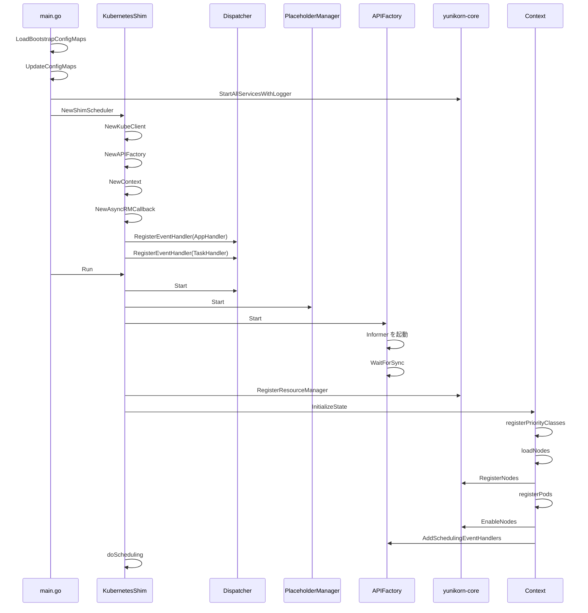

# 第2章 起動とイベントディスパッチ

> 本章で読むソース:
>
> - [pkg/cmd/shim/main.go L38-L70](https://github.com/apache/yunikorn-k8shim/blob/v1.8.0/pkg/cmd/shim/main.go#L38-L70)
> - [pkg/shim/scheduler.go L66-L88](https://github.com/apache/yunikorn-k8shim/blob/v1.8.0/pkg/shim/scheduler.go#L66-L88)
> - [pkg/shim/scheduler.go L191-L224](https://github.com/apache/yunikorn-k8shim/blob/v1.8.0/pkg/shim/scheduler.go#L191-L224)
> - [pkg/dispatcher/dispatcher.go L54-L61](https://github.com/apache/yunikorn-k8shim/blob/v1.8.0/pkg/dispatcher/dispatcher.go#L54-L61)
> - [pkg/dispatcher/dispatcher.go L208-L240](https://github.com/apache/yunikorn-k8shim/blob/v1.8.0/pkg/dispatcher/dispatcher.go#L208-L240)

## この章の狙い

本章では、k8shim の起動フローとイベントディスパッチの仕組みを追う。
`main.go` から始まり、`KubernetesShim` の初期化、`Dispatcher` の起動、イベントハンドラの登録までを順番に確認する。
起動順序には依存関係があり、コメントでも「the order of starting these services matter」と明記されている。
この順序を理解することで、各コンポーネントがなぜそのタイミングで起動されるかがわかる。

## 前提

- 第1章を読み、k8shim の主要コンポーネントの配置を理解している。
- Go の goroutine と channel の基本的な使い方がわかる。
- Kubernetes の Informer の仕組みを知っている。

## エントリーポイント

`pkg/cmd/shim/main.go` が shim モードのエントリーポイントである。

```go
// pkg/cmd/shim/main.go L38-L70
func main() {
	log.Log(log.Shim).Info(conf.GetBuildInfoString())

	predicates.EnableOptionalKubernetesFeatureGates()

	configMaps, err := client.LoadBootstrapConfigMaps()
	if err != nil {
		log.Log(log.Shim).Fatal("Unable to bootstrap configuration", zap.Error(err))
	}

	err = conf.UpdateConfigMaps(configMaps, true)
	if err != nil {
		log.Log(log.Shim).Fatal("Unable to load initial configmaps", zap.Error(err))
	}

	log.Log(log.Shim).Info("Starting scheduler", zap.String("name", constants.SchedulerName))
	serviceContext := entrypoint.StartAllServicesWithLogger(log.RootLogger(), log.GetZapConfigs())

	if serviceContext.RMProxy != nil {
		ss := shim.NewShimScheduler(serviceContext.RMProxy, conf.GetSchedulerConf(), configMaps)
		if err := ss.Run(); err != nil {
			log.Log(log.Shim).Fatal("Unable to start scheduler", zap.Error(err))
		}

		signalChan := make(chan os.Signal, 1)
		signal.Notify(signalChan, syscall.SIGINT, syscall.SIGTERM)
		for range signalChan {
			log.Log(log.Shim).Info("Shutdown signal received, exiting...")
			ss.Stop()
			os.Exit(0)
		}
	}
}
```

起動フローは以下の順で進む。

1. ビルド情報のログ出力。
2. Kubernetes のオプション機能ゲートを有効化。
3. ConfigMap からブートストラップ設定を読み込み、`SchedulerConf` を初期化。
4. `entrypoint.StartAllServicesWithLogger` で YuniKorn core のサービスを起動。
5. `NewShimScheduler` で `KubernetesShim` を生成。
6. `Run` でスケジューラを起動。
7. シグナル（SIGINT、SIGTERM）を受信するまで待機。受信したら `Stop` で停止。

`serviceContext.RMProxy` は core の `SchedulerAPI` インターフェースを実装する。
shim はこれを通じて core と通信する。

## KubernetesShim の初期化

`NewShimScheduler` は `KubernetesShim` を初期化する。

```go
// pkg/shim/scheduler.go L66-L88
func NewShimScheduler(scheduler api.SchedulerAPI, configs *conf.SchedulerConf, bootstrapConfigMaps []*v1.ConfigMap) *KubernetesShim {
	kubeClient := client.NewKubeClient(configs.KubeConfig)

	// we have disabled re-sync to keep ourselves up-to-date
	informerFactory := informers.NewSharedInformerFactory(kubeClient.GetClientSet(), 0)

	apiFactory := client.NewAPIFactory(scheduler, informerFactory, configs, false)
	context := cache.NewContextWithBootstrapConfigMaps(apiFactory, bootstrapConfigMaps)
	rmCallback := cache.NewAsyncRMCallback(context)

	eventBroadcaster := k8events.NewBroadcaster(&k8events.EventSinkImpl{
		Interface: kubeClient.GetClientSet().EventsV1()})
	err := eventBroadcaster.StartRecordingToSinkWithContext(ctx.Background())
	if err != nil {
		log.Log(log.Shim).Error("Could not create event broadcaster",
			zap.Error(err))
	} else {
		eventRecorder := eventBroadcaster.NewRecorder(scheme.Scheme, constants.SchedulerName)
		events.SetRecorder(eventRecorder)
	}

	return newShimSchedulerInternal(context, apiFactory, rmCallback)
}
```

初期化の順序は以下の通り。

1. `KubeClient` を生成。Kubernetes API Server との通信用クライアント。
2. `SharedInformerFactory` を生成。リソース再同期（re-sync）は0に設定し、初期ロード後の変更のみ追跡する。
3. `APIFactory` を生成。Informer と core との通信を仲介する。
4. `Context` を生成。スケジューリング状態を管理するキャッシュ。
5. `AsyncRMCallback` を生成。core からのコールバックを処理する。
6. `EventBroadcaster` を生成。Kubernetes イベントを記録するための仕組み。
7. `newShimSchedulerInternal` で `KubernetesShim` を組み立てる。

`newShimSchedulerInternal` では `Dispatcher` にイベントハンドラを登録する。

```go
// pkg/shim/scheduler.go L99-L114
func newShimSchedulerInternal(ctx *cache.Context, apiFactory client.APIProvider, cb api.ResourceManagerCallback) *KubernetesShim {
	ss := &KubernetesShim{
		apiFactory:           apiFactory,
		context:              ctx,
		phManager:            cache.NewPlaceholderManager(apiFactory.GetAPIs()),
		callback:             cb,
		stopChan:             make(chan struct{}),
		lock:                 &locking.RWMutex{},
		outstandingAppsFound: false,
	}
	// init dispatcher
	dispatcher.RegisterEventHandler(AppHandler, dispatcher.EventTypeApp, ctx.ApplicationEventHandler())
	dispatcher.RegisterEventHandler(TaskHandler, dispatcher.EventTypeTask, ctx.TaskEventHandler())

	return ss
}
```

`AppHandler`（`"ShimAppHandler"`）と `TaskHandler`（`"ShimTaskHandler"`）という2つのハンドラが登録される。
これらは `Context` の `ApplicationEventHandler` と `TaskEventHandler` を返す。

## Run での起動順序

`KubernetesShim.Run` は以下の順序でサービスを起動する。

```go
// pkg/shim/scheduler.go L191-L224
func (ss *KubernetesShim) Run() error {
	// NOTE: the order of starting these services matter,
	// please look at the comments before modifying the orders

	// run dispatcher
	// the dispatcher handles the basic event dispatching,
	// it needs to be started at first
	dispatcher.Start()

	// run the placeholder manager
	ss.phManager.Start()

	// run the client library code that communicates with Kubernetes
	ss.apiFactory.Start()

	// register shim with core
	if err := ss.registerShimLayer(); err != nil {
		log.Log(log.ShimScheduler).Error("failed to register shim with core", zap.Error(err))
		ss.Stop()
		return err
	}

	// initialize scheduler state
	if err := ss.initSchedulerState(); err != nil {
		log.Log(log.ShimScheduler).Error("failed to initialize scheduler state", zap.Error(err))
		ss.Stop()
		return err
	}

	// start scheduling loop
	ss.doScheduling()

	return nil
}
```

起動順序は以下の通り。コメントにも「the order of starting these services matter」と明記されている。

1. **Dispatcher を起動**: イベントキューの処理を開始。これがないとイベントが処理されない。
2. **PlaceholderManager を起動**: Gang スケジューリング用の Placeholder Pod を管理。
3. **APIFactory を起動**: Informer を開始し、Kubernetes API Server との通信を開始。
4. **core に shim を登録**: `RegisterResourceManager` で core に自身を登録。
5. **スケジューラ状態を初期化**: 既存の Node、Pod を読み込み、core と同期。
6. **スケジューリングループを開始**: 定期的にアプリケーションをスキャンし、状態遷移を促す。

この順序が重要な理由は以下の通り。

- Dispatcher が先に起動していないと、Informer がイベントを受信しても処理できない。
- APIFactory が起動していないと、Informer が Kubernetes からリソースを取得できない。
- core に登録する前に状態を初期化すると、core が shim を知らない状態でイベントが飛ぶ。
- 状態を初期化する前にスケジューリングループを開始すると、未初期化のアプリケーションを処理してしまう。

## Dispatcher のイベントキュー

`Dispatcher` は k8shim のイベント処理の中心である。
すべてのスケジューリングイベント（アプリケーションイベント、タスクイベント、ノードイベント）は `Dispatcher` を通じて処理される。

```go
// pkg/dispatcher/dispatcher.go L54-L61
type Dispatcher struct {
	eventChan chan events.SchedulingEvent
	stopChan  chan struct{}
	handlers  map[EventType]map[string]func(interface{})
	running   atomic.Bool
	lock      locking.RWMutex
	stopped   sync.WaitGroup
}
```

`eventChan` はイベントキューである。
デフォルトの容量は `EventChannelCapacity`（デフォルト値は 1024 * 1024 = 1,048,576）で、`SchedulerConf` から読み込まれる。

`handlers` はイベントタイプごとのハンドラマップである。
キーは `EventType`（`EventTypeApp`、`EventTypeTask`、`EventTypeNode`）で、値はハンドラIDからハンドラ関数へのマップ。

### イベントのディスパッチ

`Dispatch` 関数はイベントをキューに投入する。

```go
// pkg/dispatcher/dispatcher.go L138-L145
func Dispatch(event events.SchedulingEvent) {
	// currently if dispatch fails, we simply log the error
	// we may revisit this later, e.g add retry here
	if err := getDispatcher().dispatch(event); err != nil {
		log.Log(log.ShimDispatcher).Warn("failed to dispatch SchedulingEvent",
			zap.Error(err))
	}
}
```

`dispatch` メソッドはまずキューへの投入を試みる。
キューが満杯の場合は `asyncDispatch` にフォールバックする。

```go
// pkg/dispatcher/dispatcher.go L155-L166
func (p *Dispatcher) dispatch(event events.SchedulingEvent) error {
	if !p.isRunning() {
		return fmt.Errorf("dispatcher is not running")
	}
	select {
	case p.eventChan <- event:
		return nil
	default:
		p.asyncDispatch(event)
		return nil
	}
}
```

`asyncDispatch` はキューが満杯のときに個別の goroutine を起動し、3秒ごとにキューへの投入を試みる。
タイムアウト（デフォルト300秒）に達するか、`AsyncDispatchLimit`（デフォルト10,000）を超えるとパニックで停止する。

```go
// pkg/dispatcher/dispatcher.go L170-L197
func (p *Dispatcher) asyncDispatch(event events.SchedulingEvent) {
	count := asyncDispatchCount.Add(1)
	log.Log(log.ShimDispatcher).Warn("event channel is full, transition to async-dispatch mode",
		zap.Int32("asyncDispatchCount", count))
	if count > AsyncDispatchLimit {
		panic(fmt.Errorf("dispatcher exceeds async-dispatch limit"))
	}
	go func(beginTime time.Time, stop chan struct{}) {
		defer asyncDispatchCount.Add(-1)
		for p.isRunning() {
			select {
			case <-stop:
				return
			case p.eventChan <- event:
				return
			case <-time.After(AsyncDispatchCheckInterval):
				elapseTime := time.Since(beginTime)
				if elapseTime >= DispatchTimeout {
					log.Log(log.ShimDispatcher).Error("dispatch timeout",
						zap.Float64("elapseSeconds", elapseTime.Seconds()))
					return
				}
				log.Log(log.ShimDispatcher).Warn("event channel is full, keep waiting...",
					zap.Float64("elapseSeconds", elapseTime.Seconds()))
			}
		}
	}(time.Now(), p.stopChan)
}
```

### イベントの処理

`Start` 関数はイベントループを開始する。

```go
// pkg/dispatcher/dispatcher.go L208-L240
func Start() {
	log.Log(log.ShimDispatcher).Info("starting the dispatcher")
	if getDispatcher().isRunning() {
		log.Log(log.ShimDispatcher).Info("dispatcher is already running")
		return
	}
	getDispatcher().stopChan = make(chan struct{})
	getDispatcher().stopped.Add(1)
	go func() {
		for {
			select {
			case event := <-getDispatcher().eventChan:
				switch v := event.(type) {
				case events.TaskEvent:
					getEventHandler(EventTypeTask)(v)
				case events.ApplicationEvent:
					getEventHandler(EventTypeApp)(v)
				case events.SchedulerNodeEvent:
					getEventHandler(EventTypeNode)(v)
				default:
					log.Log(log.ShimDispatcher).Fatal("unsupported event",
						zap.Any("event", v))
				}
			case <-getDispatcher().stopChan:
				log.Log(log.ShimDispatcher).Info("shutting down event channel")
				getDispatcher().setRunning(false)
				getDispatcher().stopped.Done()
				return
			}
		}
	}()
	getDispatcher().setRunning(true)
}
```

イベントループは単一の goroutine で動き、`eventChan` からイベントを1つずつ取り出して処理する。
イベントのタイプ（`TaskEvent`、`ApplicationEvent`、`SchedulerNodeEvent`）に応じて、登録されたハンドラを呼び出す。

単一の goroutine で処理する理由は、イベントの順序性を保証するためである。
複数の goroutine で並列処理すると、アプリケーションの状態遷移が競合する可能性がある。
すべてのイベントを直列に処理することで、状態の一貫性を保っている。

## イベントハンドラの登録

`RegisterEventHandler` でハンドラを登録する。

```go
// pkg/dispatcher/dispatcher.go L81-L89
func RegisterEventHandler(handlerID string, eventType EventType, handlerFn func(interface{})) {
	eventDispatcher := getDispatcher()
	eventDispatcher.lock.Lock()
	defer eventDispatcher.lock.Unlock()
	if _, ok := eventDispatcher.handlers[eventType]; !ok {
		eventDispatcher.handlers[eventType] = make(map[string]func(interface{}))
	}
	eventDispatcher.handlers[eventType][handlerID] = handlerFn
}
```

`newShimSchedulerInternal` で登録される2つのハンドラは以下の通り。

- `AppHandler`（`"ShimAppHandler"`）: `Context.ApplicationEventHandler` が返す関数。アプリケーションイベントを処理し、アプリケーションの状態機械を遷移させる。
- `TaskHandler`（`"ShimTaskHandler"`）: `Context.TaskEventHandler` が返す関数。タスクイベントを処理し、タスクの状態機械を遷移させる。

`ApplicationEventHandler` の実装は以下の通り。

```go
// pkg/cache/context.go L1257-L1288
func (ctx *Context) ApplicationEventHandler() func(obj interface{}) {
	return func(obj interface{}) {
		if event, ok := obj.(events.ApplicationEvent); ok {
			appID := event.GetApplicationID()
			app := ctx.GetApplication(appID)
			if app == nil {
				log.Log(log.ShimContext).Error("failed to handle application event, application does not exist",
					zap.String("applicationID", appID))
				return
			}

			if app.canHandle(event) {
				if err := app.handle(event); err != nil {
					log.Log(log.ShimContext).Error("failed to handle application event",
						zap.String("event", event.GetEvent()),
						zap.String("applicationID", appID),
						zap.Error(err))
				}
				return
			}

			log.Log(log.ShimContext).Error("application event cannot be handled in the current state",
				zap.String("applicationID", appID),
				zap.String("event", event.GetEvent()),
				zap.String("state", app.sm.Current()))
			return
		}

		log.Log(log.ShimContext).Error("could not handle application event",
			zap.String("type", reflect.TypeOf(obj).Name()))
	}
}
```

イベントを受け取ると、アプリケーションIDでアプリケーションを検索し、`canHandle` で現在の状態でそのイベントを処理できるか確認し、`handle` で状態遷移を実行する。

## 起動シーケンス図

全体の起動シーケンスを以下に示す。



## 高速化・最適化の工夫

`Dispatcher` のイベントキューは、バックプレッシャーを扱う仕組みを持っている。

キューが満杯の場合、`asyncDispatch` は個別の goroutine を起動してリトライする。
このとき、`AsyncDispatchLimit`（デフォルト10,000）を超えるとパニックで停止する。
これは、イベントの処理が追いつかない状態でイベントが無限に蓄積するのを防ぐためである。

もしキューが満杯なのに同期的に待ち続けると、呼び出し元の goroutine（Informer のイベントハンドラなど）がブロックされ、Kubernetes API Server との通信全体が停滞する。
`asyncDispatch` は呼び出し元をブロックせず、個別の goroutine でリトライすることで、Informer の処理を継続させる。

また、`eventChan` の容量を大きく取る（デフォルト100万）ことで、通常の運用ではキュー満杯になりにくくしている。
これにより、バースト的なイベント発生時にも、イベントロスを防ぎながら処理を継続できる。

## まとめ

本章では、k8shim の起動フローとイベントディスパッチの仕組みを追った。

`main.go` から始まり、`KubernetesShim` の初期化、`Dispatcher` の起動、イベントハンドラの登録、そしてスケジューリングループの開始までを確認した。

起動順序は重要であり、Dispatcher → PlaceholderManager → APIFactory → core 登録 → 状態初期化 → スケジューリングループの順で進む。

`Dispatcher` は単一のイベントキューですべてのスケジューリングイベントを処理し、イベントの順序性を保証する。
キューが満杯の場合は `asyncDispatch` で非同期にリトライし、バックプレッシャーを扱う。

以降の章では、`Context` のキャッシュレイヤー、アプリケーションとタスクの状態機械、Kubernetes API との連携詳細に入っていく。

## 関連する章

- [第1章 yunikorn-k8shim の全体像](01-overview.md): コンポーネントの配置と責務
- [第3章 Context とキャッシュレイヤー](../part01-cache/03-context-and-cache.md): `Context` の詳細
- [第4章 アプリケーション状態機械](../part01-cache/04-application-state-machine.md): `ApplicationEventHandler` が処理するアプリケーションの状態遷移
- [第5章 タスク状態管理とプレースホルダー](../part01-cache/05-task-and-placeholder.md): `TaskEventHandler` が処理するタスクの状態遷移
