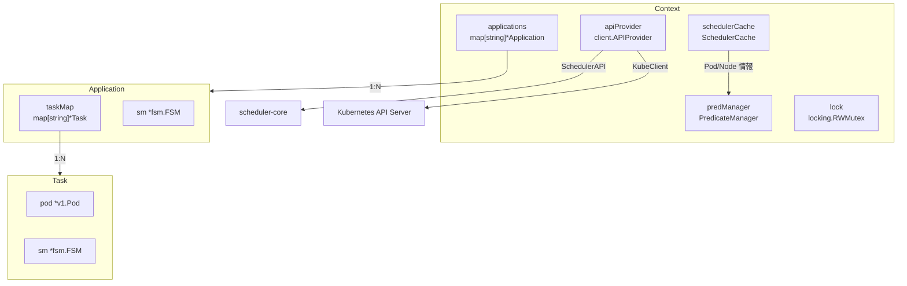

# 第3章 Context とキャッシュレイヤー

> 本章で読むソース:
>
> - [pkg/cache/context.go L67-L79](https://github.com/apache/yunikorn-k8shim/blob/v1.8.0/pkg/cache/context.go#L67-L79)
> - [pkg/cache/context.go L88-L113](https://github.com/apache/yunikorn-k8shim/blob/v1.8.0/pkg/cache/context.go#L88-L113)
> - [pkg/cache/context.go L127-L171](https://github.com/apache/yunikorn-k8shim/blob/v1.8.0/pkg/cache/context.go#L127-L171)
> - [pkg/cache/context.go L296-L322](https://github.com/apache/yunikorn-k8shim/blob/v1.8.0/pkg/cache/context.go#L296-L322)
> - [pkg/cache/context.go L974-L1019](https://github.com/apache/yunikorn-k8shim/blob/v1.8.0/pkg/cache/context.go#L974-L1019)
> - [pkg/cache/context.go L1058-L1106](https://github.com/apache/yunikorn-k8shim/blob/v1.8.0/pkg/cache/context.go#L1058-L1106)
> - [pkg/cache/context.go L1257-L1325](https://github.com/apache/yunikorn-k8shim/blob/v1.8.0/pkg/cache/context.go#L1257-L1325)
> - [pkg/cache/amprotocol.go L27-L83](https://github.com/apache/yunikorn-k8shim/blob/v1.8.0/pkg/cache/amprotocol.go#L27-L83)

## この章の狙い

`Context` 構造体は k8shim のキャッシュ層の中心であり、アプリケーションとタスクの状態を一元的に保持する。
本章では `Context` のデータ構造、Informer イベントの受け方、アプリケーションとタスクの追加および削除 API を読み、キャッシュ層がどのようにスケジューラ全体の状態を管理しているかを把握する。

## 前提

第2章でイベントディスパッチ機構を確認した。
本章ではディスパッチャから渡されたイベントが `Context` のメソッドに届き、アプリケーションとタスクのオブジェクトを操作する流れを追う。

## Context 構造体の全体像

`Context` 構造体は k8shim におけるスケジューリング状態のすべてを保持する。

[pkg/cache/context.go L67-L79](https://github.com/apache/yunikorn-k8shim/blob/v1.8.0/pkg/cache/context.go#L67-L79)

```go
// context maintain scheduling state, like apps and apps' tasks.
type Context struct {
    applications   map[string]*Application        // apps
    schedulerCache *schedulercache.SchedulerCache // external cache
    apiProvider    client.APIProvider             // apis to interact with api-server, scheduler-core, etc
    predManager    predicates.PredicateManager    // K8s predicates
    pluginMode     bool                           // true if we are configured as a scheduler plugin
    namespace      string                         // yunikorn namespace
    configMaps     []*v1.ConfigMap                // cached yunikorn configmaps
    lock           *locking.RWMutex               // lock - used not only for context data but also to ensure that multiple event types are not executed concurrently
    txnID          atomic.Uint64                  // transaction ID counter
    klogger        klog.Logger
    podActivator   atomic.Value
}
```

`applications` はアプリケーション ID をキーとしたマップである。
`schedulerCache` は Kubernetes のノードと Pod の状態を二次的に保持するキャッシュであり、述語（predicates）の評価に使う。
`apiProvider` は API Server とスケジューラコアの両方と通信するための接口である。
`lock` は `locking.RWMutex` 型であり、コンテキスト全体のデータだけでなく、複数のイベント種別が並行に実行されないことを保証する役割も担う。

コメントにある「used not only for context data but also to ensure that multiple event types are not executed concurrently」が示すとおり、このロックはイベントハンドラの直列化にも使われる。



## Context の初期化

`NewContextWithBootstrapConfigMaps` は `Context` を生成する。

[pkg/cache/context.go L88-L113](https://github.com/apache/yunikorn-k8shim/blob/v1.8.0/pkg/cache/context.go#L88-L113)

```go
func NewContextWithBootstrapConfigMaps(apis client.APIProvider, bootstrapConfigMaps []*v1.ConfigMap) *Context {
    // create the context note that order is important:
    // volumebinder needs the informers
    // the cache needs informers and volumebinder
    // nodecontroller needs the cache
    // predictor need the cache, volumebinder and informers
    ctx := &Context{
        applications: make(map[string]*Application),
        apiProvider:  apis,
        namespace:    schedulerconf.GetSchedulerConf().Namespace,
        configMaps:   bootstrapConfigMaps,
        lock:         &locking.RWMutex{},
        klogger:      klog.NewKlogr(),
    }

    // create the cache
    ctx.schedulerCache = schedulercache.NewSchedulerCache(apis.GetAPIs())

    // create the predicate manager
    sharedLister := support.NewSharedLister(ctx.schedulerCache)
    clientSet := apis.GetAPIs().KubeClient.GetClientSet()
    informerFactory := apis.GetAPIs().InformerFactory
    ctx.predManager = predicates.NewPredicateManager(support.NewFrameworkHandle(sharedLister, informerFactory, clientSet))

    return ctx
}
```

コメントが示すとおり、初期化の順序に依存関係がある。
VolumeBinder が Informer を必要とし、キャッシュが Informer と VolumeBinder を必要とし、PredicateManager がキャッシュと VolumeBinder と Informer を必要とする。
この順序でコンポーネントを構築することで、各要素が参照先を利用可能な状態で組み上がる。

## Informer イベントハンドラの登録

`AddSchedulingEventHandlers` は Kubernetes Informer のイベントハンドラを登録する。

[pkg/cache/context.go L127-L171](https://github.com/apache/yunikorn-k8shim/blob/v1.8.0/pkg/cache/context.go#L127-L171)

```go
func (ctx *Context) AddSchedulingEventHandlers() error {
    err := ctx.apiProvider.AddEventHandler(&client.ResourceEventHandlers{
        Type:     client.ConfigMapInformerHandlers,
        FilterFn: ctx.filterConfigMaps,
        AddFn:    ctx.addConfigMaps,
        UpdateFn: ctx.updateConfigMaps,
        DeleteFn: ctx.deleteConfigMaps,
    })
    // ... (中略) ...

    err = ctx.apiProvider.AddEventHandler(&client.ResourceEventHandlers{
        Type:     client.NodeInformerHandlers,
        AddFn:    ctx.addNode,
        UpdateFn: ctx.updateNode,
        DeleteFn: ctx.deleteNode,
    })
    // ... (中略) ...

    err = ctx.apiProvider.AddEventHandler(&client.ResourceEventHandlers{
        Type:     client.PodInformerHandlers,
        AddFn:    ctx.AddPod,
        UpdateFn: ctx.UpdatePod,
        DeleteFn: ctx.DeletePod,
    })
    // ... (中略) ...

    return nil
}
```

ConfigMap、PriorityClass、Node、Pod の4種について、追加、更新、削除のハンドラを登録する。
Pod のハンドラは `AddPod`、`UpdatePod`、`DeletePod` という名前で、これらが Informer から直接呼び出される入口になる。

## Pod イベントの処理

`UpdatePod` は Pod の追加と更新を統一的に処理する。

[pkg/cache/context.go L300-L322](https://github.com/apache/yunikorn-k8shim/blob/v1.8.0/pkg/cache/context.go#L300-L322)

```go
func (ctx *Context) UpdatePod(oldObj, newObj interface{}) {
    ctx.lock.Lock()
    defer ctx.lock.Unlock()
    pod, err := utils.Convert2Pod(newObj)
    if err != nil {
        log.Log(log.ShimContext).Error("failed to update pod", zap.Error(err))
        return
    }
    var oldPod *v1.Pod
    if oldObj != nil {
        oldPod, err = utils.Convert2Pod(oldObj)
        if err != nil {
            log.Log(log.ShimContext).Error("failed to update pod", zap.Error(err))
            return
        }
    }
    applicationID := utils.GetApplicationIDFromPod(pod)
    if applicationID == "" {
        ctx.updateForeignPod(oldPod, pod)
    } else {
        ctx.updateYuniKornPod(applicationID, oldPod, pod)
    }
}
```

Pod イベントの処理は2つの経路に分岐する。
Pod にアプリケーション ID ラベルがあれば `updateYuniKornPod` を呼び、YuniKorn が管理する Pod として処理する。
アプリケーション ID がなければ `updateForeignPod` を呼び、外部スケジューラが配置した Pod としてリソースを把握するだけにする。
この分岐により、YuniKorn 管理下の Pod とそれ以外の Pod を同一の Informer で扱いながら、処理を分けられる。

## アプリケーションの追加

`AddApplication` はアプリケーションをキャッシュに追加する。

[pkg/cache/context.go L974-L1019](https://github.com/apache/yunikorn-k8shim/blob/v1.8.0/pkg/cache/context.go#L974-L1019)

```go
func (ctx *Context) AddApplication(request *AddApplicationRequest) *Application {
    ctx.lock.Lock()
    defer ctx.lock.Unlock()

    return ctx.addApplication(request)
}

func (ctx *Context) addApplication(request *AddApplicationRequest) *Application {
    log.Log(log.ShimContext).Debug("AddApplication", zap.Any("Request", request))
    if app := ctx.getApplication(request.Metadata.ApplicationID); app != nil {
        return app
    }

    if ns, ok := request.Metadata.Tags[constants.AppTagNamespace]; ok {
        log.Log(log.ShimContext).Debug("app namespace info",
            zap.String("appID", request.Metadata.ApplicationID),
            zap.String("namespace", ns))
        ctx.updateApplicationTags(request, ns)
    }

    app := NewApplication(
        request.Metadata.ApplicationID,
        request.Metadata.QueueName,
        request.Metadata.User,
        request.Metadata.Groups,
        request.Metadata.Tags,
        ctx.apiProvider.GetAPIs().SchedulerAPI)
    app.setTaskGroups(request.Metadata.TaskGroups)
    app.setTaskGroupsDefinition(request.Metadata.Tags[constants.AnnotationTaskGroups])
    app.setSchedulingParamsDefinition(request.Metadata.Tags[constants.AnnotationSchedulingPolicyParam])
    // ... (中略) ...
    app.setPlaceholderOwnerReferences(request.Metadata.OwnerReferences)

    // add into cache
    ctx.applications[app.applicationID] = app
    log.Log(log.ShimContext).Info("app added",
        zap.String("appID", app.applicationID))

    return app
}
```

すでに同一 ID のアプリケーションが存在すれば既存のものを返す。
存在しなければ `NewApplication` で生成し、タスクグループやスケジューリングパラメータを設定してからマップに登録する。
`updateApplicationTags` は名前空間のアノテーションからリソースクォータや親キューの情報を取得し、アプリケーションのタグに埋め込む。

## タスクの追加

`addTask` はアプリケーションにタスクを追加する。

[pkg/cache/context.go L1064-L1106](https://github.com/apache/yunikorn-k8shim/blob/v1.8.0/pkg/cache/context.go#L1064-L1106)

```go
func (ctx *Context) addTask(request *AddTaskRequest) *Task {
    log.Log(log.ShimContext).Debug("AddTask",
        zap.String("appID", request.Metadata.ApplicationID),
        zap.String("taskID", request.Metadata.TaskID))
    if app := ctx.getApplication(request.Metadata.ApplicationID); app != nil {
        existingTask := app.GetTask(request.Metadata.TaskID)
        if existingTask == nil {
            var originator bool

            // Is this task the originator of the application?
            // If yes, then make it as "first pod/owner/driver" of the application and set the task as originator
            // At any cost, placeholder cannot become originator
            if !request.Metadata.Placeholder && app.GetOriginatingTask() == nil {
                for _, ownerReference := range app.getPlaceholderOwnerReferences() {
                    referenceID := string(ownerReference.UID)
                    if request.Metadata.TaskID == referenceID {
                        originator = true
                        break
                    }
                }
            }
            task := NewFromTaskMeta(request.Metadata.TaskID, app, ctx, request.Metadata, originator)
            app.addTask(task)
            // ... (中略) ...
            if originator {
                // ... (中略) ...
                app.setOriginatingTask(task)
                // ... (中略) ...
            }
            return task
        }
        return existingTask
    }
    return nil
}
```

タスクの追加では originator（起源 Pod）の判定が行われる。
コメントが説明するとおり、originator はアプリケーションのリクエストを開始した「最初の Pod」であり、プレースホルダーは originator にならない。
OwnerReference の UID とタスク ID を照合し、一致すれば originator として設定する。
originator の概念は第5章のギャングスケジューリングで Pod レベルのイベントを発行するために使われる。

## リクエストのデータ構造

`amprotocol.go` はアプリケーション管理プロトコルのデータ型を定義する。

[pkg/cache/amprotocol.go L27-L65](https://github.com/apache/yunikorn-k8shim/blob/v1.8.0/pkg/cache/amprotocol.go#L27-L65)

```go
type AddApplicationRequest struct {
    Metadata ApplicationMetadata
}

type AddTaskRequest struct {
    Metadata TaskMetadata
}

type ApplicationMetadata struct {
    ApplicationID              string
    QueueName                  string
    User                       string
    Tags                       map[string]string
    Groups                     []string
    TaskGroups                 []TaskGroup
    OwnerReferences            []metav1.OwnerReference
    SchedulingPolicyParameters *SchedulingPolicyParameters
    CreationTime               int64
}

type TaskGroup struct {
    Name                      string
    MinMember                 int32
    Labels                    map[string]string
    Annotations               map[string]string
    MinResource               map[string]resource.Quantity
    NodeSelector              map[string]string
    Tolerations               []v1.Toleration
    Affinity                  *v1.Affinity
    TopologySpreadConstraints []v1.TopologySpreadConstraint
}

type TaskMetadata struct {
    ApplicationID string
    TaskID        string
    Pod           *v1.Pod
    Placeholder   bool
    TaskGroupName string
}
```

`TaskGroup` はギャングスケジューリングの単位を定義する。
`MinMember` は最低限同時にスケジュールすべき Pod 数、`MinResource` は各 Pod の要求リソースを表す。
`SchedulingPolicyParameters` はプレースホルダーのタイムアウトとギャングスケジューリングのスタイルを保持する。

## イベントハンドラのdispatch

`Context` はアプリケーションイベントとタスクイベントのハンドラも提供する。

[pkg/cache/context.go L1257-L1288](https://github.com/apache/yunikorn-k8shim/blob/v1.8.0/pkg/cache/context.go#L1257-L1288)

```go
func (ctx *Context) ApplicationEventHandler() func(obj interface{}) {
    return func(obj interface{}) {
        if event, ok := obj.(events.ApplicationEvent); ok {
            appID := event.GetApplicationID()
            app := ctx.GetApplication(appID)
            if app == nil {
                log.Log(log.ShimContext).Error("failed to handle application event, application does not exist",
                    zap.String("applicationID", appID))
                return
            }

            if app.canHandle(event) {
                if err := app.handle(event); err != nil {
                    log.Log(log.ShimContext).Error("failed to handle application event",
                        zap.String("event", event.GetEvent()),
                        zap.String("applicationID", appID),
                        zap.Error(err))
                }
                return
            }

            log.Log(log.ShimContext).Error("application event cannot be handled in the current state",
                zap.String("applicationID", appID),
                zap.String("event", event.GetEvent()),
                zap.String("state", app.sm.Current()))
            return
        }

        log.Log(log.ShimContext).Error("could not handle application event",
            zap.String("type", reflect.TypeOf(obj).Name()))
    }
}
```

ディスパッチャから届いたイベントを型アサーションで `events.ApplicationEvent` として取り出し、`app.canHandle` で状態機械がそのイベントを処理可能かを確認してから `app.handle` に渡す。
処理不可能なイベントはログに記録して捨てる。
タスクイベントのハンドラも同一のパターンで実装される。

[pkg/cache/context.go L1290-L1325](https://github.com/apache/yunikorn-k8shim/blob/v1.8.0/pkg/cache/context.go#L1290-L1325)

```go
func (ctx *Context) TaskEventHandler() func(obj interface{}) {
    return func(obj interface{}) {
        if event, ok := obj.(events.TaskEvent); ok {
            appID := event.GetApplicationID()
            taskID := event.GetTaskID()
            task := ctx.getTask(appID, taskID)
            if task == nil {
                log.Log(log.ShimContext).Debug("failed to handle task event, task does not exist",
                    zap.String("applicationID", appID),
                    zap.String("taskID", taskID))
                return
            }

            if task.canHandle(event) {
                if err := task.handle(event); err != nil {
                    log.Log(log.ShimContext).Error("failed to handle task event",
                        zap.String("applicationID", appID),
                        zap.String("taskID", taskID),
                        zap.String("event", event.GetEvent()),
                        zap.Error(err))
                }
                return
            }
            // ... (中略) ...
        }
        // ... (中略) ...
    }
}
```

## Foreign Pod の扱い

YuniKorn が管理しない Pod（Foreign Pod）も `Context` は把握する。
`updateForeignPod` はノードに割り当て済みの Pod を検出すると、スケジューラコアにアロケーション情報を送信してリソース利用を認識させる。

[pkg/cache/context.go L392-L455](https://github.com/apache/yunikorn-k8shim/blob/v1.8.0/pkg/cache/context.go#L392-L455)

```go
func (ctx *Context) updateForeignPod(oldPod, pod *v1.Pod) {
    // ... (中略) ...

    // conditions for allocate/update:
    //   1. pod is now assigned
    //   2. pod is not in terminated state
    //   3. pod references a known node
    if utils.IsAssignedPod(pod) && !utils.IsPodTerminated(pod) {
        if ctx.schedulerCache.UpdatePod(pod) {
            // pod was accepted by a real node
            // ... (中略) ...
            if oldPod == nil || !common.Equals(common.GetPodResource(oldPod), common.GetPodResource(pod)) {
                allocReq := common.CreateAllocationForForeignPod(pod)
                if err := ctx.apiProvider.GetAPIs().SchedulerAPI.UpdateAllocation(allocReq); err != nil {
                    log.Log(log.ShimContext).Error("failed to add foreign allocation to the core",
                        zap.Error(err))
                }
            }
        }
        // ... (中略) ...
    }

    // conditions for release:
    //   1. pod was previously assigned
    //   2. pod is now in a terminated state
    //   3. pod references a known node
    if oldPod != nil && utils.IsPodTerminated(pod) {
        if !ctx.schedulerCache.IsPodOrphaned(string(pod.UID)) {
            // ... (中略) ...
            ctx.schedulerCache.RemovePod(pod)
            releaseReq := common.CreateReleaseRequestForForeignPod(string(pod.UID), constants.DefaultPartition)
            if err := ctx.apiProvider.GetAPIs().SchedulerAPI.UpdateAllocation(releaseReq); err != nil {
                log.Log(log.ShimContext).Error("failed to remove foreign allocation from the core",
                    zap.Error(err))
            }
        }
        // ... (中略) ...
    }
}
```

Foreign Pod のリソース変更があったときだけ `UpdateAllocation` を呼ぶ。
`common.Equals` で旧リソースと新リソースを比較し、差分がなければ API 呼び出しを省略する。
この差分チェックは API Server とスケジューラコア間の通信量を減らす最適化になっている。

## アプリケーションの削除とタスクの削除

`RemoveApplication` と `RemoveTask` はマップからエントリを削除する。

[pkg/cache/context.go L1047-L1055](https://github.com/apache/yunikorn-k8shim/blob/v1.8.0/pkg/cache/context.go#L1047-L1055)

```go
func (ctx *Context) RemoveApplication(appID string) {
    ctx.lock.Lock()
    defer ctx.lock.Unlock()
    if _, exist := ctx.applications[appID]; !exist {
        log.Log(log.ShimContext).Debug("Attempted to remove non-existent application", zap.String("appID", appID))
        return
    }
    delete(ctx.applications, appID)
}
```

[pkg/cache/context.go L1108-L1117](https://github.com/apache/yunikorn-k8shim/blob/v1.8.0/pkg/cache/context.go#L1108-L1117)

```go
func (ctx *Context) RemoveTask(appID, taskID string) {
    ctx.lock.Lock()
    defer ctx.lock.Unlock()
    app, ok := ctx.applications[appID]
    if !ok {
        log.Log(log.ShimContext).Debug("Attempted to remove task from non-existent application", zap.String("appID", appID))
        return
    }
    app.RemoveTask(taskID)
}
```

どちらも存在しない ID の削除はログに出すだけで無視する。
これは Informer のイベントが重複して届く場合や、すでに削除済みのオブジェクトに対するイベントを安全に無視するための設計である。

## ロック戦略と直列化

`Context` のロックは `locking.RWMutex` 型で、読み取りに `RLock`、書き込みに `Lock` を使う。
`AddSchedulingEventHandlers`、`IsPluginMode`、`EventsToRegister` を除く公開メソッドはロックを取得してから内部処理を行う。
`Context` のロックはアプリケーションやタスクの追加と削除だけでなく、イベントハンドラ全体の直列化にも使われる。
コメントの「used not only for context data but also to ensure that multiple event types are not executed concurrently」という記述がこれを示している。

この設計により、Pod の追加イベントとノードの削除イベントが同時に処理されて不整合が生まれることを防いでいる。
代償として排他制御の粒度は粗く、大規模クラスタではロックの待ち時間がボトルネックになる可能性がある。
ただし k8shim のイベント処理は軽量な状態遷移が中心であり、実際のバインドやボリューム処理は非ゴルーチンに逃がしているため、実用上の問題は起きにくい。

## まとめ

`Context` は k8shim のキャッシュ層の中核であり、アプリケーションとタスクのマップを保持し、Informer イベントを受けて状態を更新する。
Pod イベントはアプリケーション ID の有無で YuniKorn 管理下と Foreign に分岐する。
アプリケーションとタスクの追加と削除 API は冪等性を保ち、重複イベントを安全に無視する。
イベントハンドラはディスパッチャから受け取ったイベントを状態機械に委譲し、`canHandle` で処理可能性を確認してから実行する。

## 関連する章

- [第2章 起動とイベントディスパッチ](../part00-intro/02-startup-and-dispatcher.md): ディスパッチャの仕組み
- [第4章 アプリケーション状態機械](04-application-state-machine.md): `Application` の状態遷移
- [第5章 タスク状態管理とプレースホルダー](05-task-and-placeholder.md): `Task` の状態遷移とギャングスケジューリング
