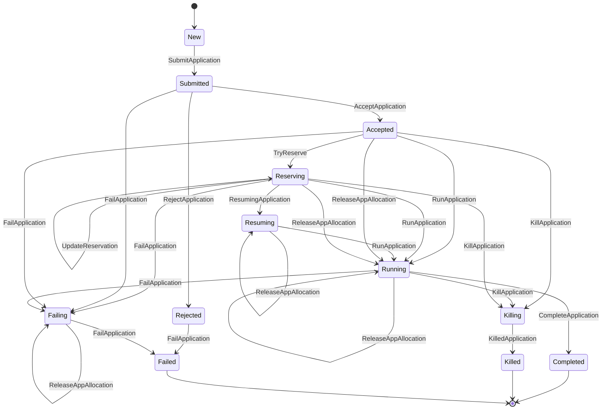

# 第4章 アプリケーション状態機械

> 本章で読むソース:
>
> - [pkg/cache/application.go L43-L62](https://github.com/apache/yunikorn-k8shim/blob/v1.8.0/pkg/cache/application.go#L43-L62)
> - [pkg/cache/application.go L72-L90](https://github.com/apache/yunikorn-k8shim/blob/v1.8.0/pkg/cache/application.go#L72-L90)
> - [pkg/cache/application.go L92-L110](https://github.com/apache/yunikorn-k8shim/blob/v1.8.0/pkg/cache/application.go#L92-L110)
> - [pkg/cache/application.go L346-L416](https://github.com/apache/yunikorn-k8shim/blob/v1.8.0/pkg/cache/application.go#L346-L416)
> - [pkg/cache/application.go L475-L536](https://github.com/apache/yunikorn-k8shim/blob/v1.8.0/pkg/cache/application.go#L475-L536)
> - [pkg/cache/application_state.go L40-L58](https://github.com/apache/yunikorn-k8shim/blob/v1.8.0/pkg/cache/application_state.go#L40-L58)
> - [pkg/cache/application_state.go L329-L362](https://github.com/apache/yunikorn-k8shim/blob/v1.8.0/pkg/cache/application_state.go#L329-L362)
> - [pkg/cache/application_state.go L364-L518](https://github.com/apache/yunikorn-k8shim/blob/v1.8.0/pkg/cache/application_state.go#L364-L518)

## この章の狙い

`Application` 構造体はスケジューラの管理対象となるアプリケーションを表し、状態機械によってライフサイクルを制御する。
本章では `Application` のデータ構造、状態遷移の定義、各状態での処理を読み、アプリケーションがどのようにスケジューリングの各段階を進むかを理解する。

## 前提

第3章で `Context` がアプリケーションをマップで管理することを確認した。
本章ではそのマップに登録された `Application` オブジェクト自体の内部構造と、状態機械の振る舞いを追う。

## Application 構造体

`Application` 構造体はアプリケーション ID、キュー、タスクの集合、状態機械を保持する。

[pkg/cache/application.go L43-L62](https://github.com/apache/yunikorn-k8shim/blob/v1.8.0/pkg/cache/application.go#L43-L62)

```go
type Application struct {
    applicationID              string
    queue                      string
    partition                  string
    user                       string
    groups                     []string
    taskMap                    map[string]*Task
    tags                       map[string]string
    taskGroups                 []TaskGroup
    taskGroupsDefinition       string
    schedulingParamsDefinition string
    placeholderOwnerReferences []metav1.OwnerReference
    sm                         *fsm.FSM
    lock                       *locking.RWMutex
    schedulerAPI               api.SchedulerAPI
    placeholderAsk             *si.Resource // total placeholder request for the app (all task groups)
    placeholderTimeoutInSec    int64
    schedulingStyle            string
    originatingTask            *Task // Original Pod which creates the requests
}
```

`taskMap` はタスク ID をキーとしたマップである。
`sm` は `fsm.FSM` 型の状態機械で、`looplab/fsm` ライブラリで実装される。
`taskGroups` はギャングスケジューリングのタスクグループ定義を保持する。
`placeholderAsk` は全タスクグループの合計リソース要求量であり、スケジューラコアへのアプリケーション登録時に使う。
`originatingTask` はアプリケーションのリクエストを開始した Pod への参照であり、ギャングスケジューリングのイベント発行に使う。

## Application の生成

`NewApplication` は `Application` を初期化する。

[pkg/cache/application.go L72-L90](https://github.com/apache/yunikorn-k8shim/blob/v1.8.0/pkg/cache/application.go#L72-L90)

```go
func NewApplication(appID, queueName, user string, groups []string, tags map[string]string, scheduler api.SchedulerAPI) *Application {
    taskMap := make(map[string]*Task)
    app := &Application{
        applicationID:           appID,
        queue:                   queueName,
        partition:               constants.DefaultPartition,
        user:                    user,
        groups:                  groups,
        taskMap:                 taskMap,
        tags:                    tags,
        sm:                      newAppState(),
        taskGroups:              make([]TaskGroup, 0),
        lock:                    &locking.RWMutex{},
        schedulerAPI:            scheduler,
        placeholderTimeoutInSec: 0,
        schedulingStyle:         constants.SchedulingPolicyStyleParamDefault,
    }
    return app
}
```

初期状態は `newAppState()` が返す FSM の初期状態、すなわち `New` になる。
`partition` はデフォルトパーティションに設定される。

## handle 関数による状態遷移

`handle` はイベントを受けて状態機械を遷移させる。

[pkg/cache/application.go L92-L110](https://github.com/apache/yunikorn-k8shim/blob/v1.8.0/pkg/cache/application.go#L92-L110)

```go
func (app *Application) handle(ev events.ApplicationEvent) error {
    // Locking mechanism:
    // 1) when handle event transitions, we first obtain the object's lock,
    //    this helps us to place a pre-check before entering here, in case
    //    we receive some invalidate events. If this introduces performance
    //    regression, a possible way to optimize is to use a separate lock
    //    to protect the transition phase.
    // 2) Note, state machine calls those callbacks here, we must ensure
    //    they are lock-free calls. Otherwise the callback will be blocked
    //    because the lock is already held here.
    app.lock.Lock()
    defer app.lock.Unlock()
    err := app.sm.Event(context.Background(), ev.GetEvent(), app, ev.GetArgs())
    // handle the same state transition not nil error (limit of fsm).
    if err != nil && err.Error() != transitionErr {
        return err
    }
    return nil
}
```

コメントが説明するとおり、`handle` はオブジェクトのロックを取得してから状態機械を呼び出す。
これにより、無効なイベントが入る前に事前チェックできる。
状態機械のコールバックはロックフリーでなければならない。
ロックを持ったままコールバックを呼ぶため、コールバック内でさらにロックを取ろうとするとデッドロックになる。
`transitionErr`（`"no transition"`）は同じ状態への遷移を示すエラーで、`looplab/fsm` の制限として無視する。

## アプリケーションの状態定義

`AStates` 構造体はアプリケーションのすべての状態名を保持する。

[pkg/cache/application_state.go L329-L362](https://github.com/apache/yunikorn-k8shim/blob/v1.8.0/pkg/cache/application_state.go#L329-L362)

```go
type AStates struct {
    New       string
    Submitted string
    Accepted  string
    Reserving string
    Running   string
    Rejected  string
    Completed string
    Killing   string
    Killed    string
    Failing   string
    Failed    string
    Resuming  string
}

func ApplicationStates() *AStates {
    applicationStatesOnce.Do(func() {
        storeApplicationStates = &AStates{
            New:       "New",
            Submitted: "Submitted",
            Accepted:  "Accepted",
            Reserving: "Reserving",
            Running:   "Running",
            Rejected:  "Rejected",
            Completed: "Completed",
            Killing:   "Killing",
            Killed:    "Killed",
            Failed:    "Failed",
            Failing:   "Failing",
            Resuming:  "Resuming",
        }
    })
    return storeApplicationStates
}
```

`sync.Once` で初期化を1回だけに制限し、状態名をグローバルに共有する。
`Failing` と `Killing` は遷移中の中間状態であり、最終状態は `Failed` と `Killed` である。
`Resuming` は SOFT ギャングスケジューリングでタイムアウト後にプレースホルダーを片付けている状態である。

## イベント定義

アプリケーションイベントの一覧は次のとおりである。

[pkg/cache/application_state.go L40-L58](https://github.com/apache/yunikorn-k8shim/blob/v1.8.0/pkg/cache/application_state.go#L40-L58)

```go
const (
    SubmitApplication ApplicationEventType = iota
    AcceptApplication
    TryReserve
    UpdateReservation
    RunApplication
    RejectApplication
    CompleteApplication
    FailApplication
    KillApplication
    KilledApplication
    ReleaseAppAllocation
    ResumingApplication
    AppTaskCompleted
)

func (ae ApplicationEventType) String() string {
    return [...]string{"SubmitApplication", "AcceptApplication", "TryReserve", "UpdateReservation", "RunApplication", "RejectApplication", "CompleteApplication", "FailApplication", "KillApplication", "KilledApplication", "ReleaseAppAllocation", "ResumingApplication", "AppTaskCompleted"}[ae]
}
```

## 状態遷移表

`newAppState` は `fsm.FSM` を構築し、遷移ルールとコールバックを定義する。

[pkg/cache/application_state.go L364-L518](https://github.com/apache/yunikorn-k8shim/blob/v1.8.0/pkg/cache/application_state.go#L364-L518)

```go
func newAppState() *fsm.FSM { //nolint:funlen
    states := ApplicationStates()
    return fsm.NewFSM(
        states.New, fsm.Events{
            {
                Name: SubmitApplication.String(),
                Src:  []string{states.New},
                Dst:  states.Submitted,
            },
            {
                Name: AcceptApplication.String(),
                Src:  []string{states.Submitted},
                Dst:  states.Accepted,
            },
            {
                Name: TryReserve.String(),
                Src:  []string{states.Accepted},
                Dst:  states.Reserving,
            },
            {
                Name: UpdateReservation.String(),
                Src:  []string{states.Reserving},
                Dst:  states.Reserving,
            },
            {
                Name: ResumingApplication.String(),
                Src:  []string{states.Reserving},
                Dst:  states.Resuming,
            },
            {
                Name: AppTaskCompleted.String(),
                Src:  []string{states.Resuming},
                Dst:  states.Resuming,
            },
            {
                Name: RunApplication.String(),
                Src:  []string{states.Accepted, states.Reserving, states.Resuming, states.Running},
                Dst:  states.Running,
            },
            // ... (中略) ...
            {
                Name: CompleteApplication.String(),
                Src:  []string{states.Running},
                Dst:  states.Completed,
            },
            {
                Name: RejectApplication.String(),
                Src:  []string{states.Submitted},
                Dst:  states.Rejected,
            },
            {
                Name: FailApplication.String(),
                Src:  []string{states.Submitted, states.Accepted, states.Running, states.Reserving},
                Dst:  states.Failing,
            },
            {
                Name: FailApplication.String(),
                Src:  []string{states.Failing, states.Rejected},
                Dst:  states.Failed,
            },
            {
                Name: KillApplication.String(),
                Src:  []string{states.Accepted, states.Running, states.Reserving},
                Dst:  states.Killing,
            },
            {
                Name: KilledApplication.String(),
                Src:  []string{states.Killing},
                Dst:  states.Killed,
            },
        },
        fsm.Callbacks{
            events.EnterState: func(_ context.Context, event *fsm.Event) {
                // ... (中略) ...
            },
            states.Reserving: func(_ context.Context, event *fsm.Event) {
                app := event.Args[0].(*Application) //nolint:errcheck
                app.onReserving()
            },
            states.Resuming: func(_ context.Context, event *fsm.Event) {
                app := event.Args[0].(*Application) //nolint:errcheck
                app.onResuming()
            },
            SubmitApplication.String(): func(_ context.Context, event *fsm.Event) {
                app := event.Args[0].(*Application) //nolint:errcheck
                event.Err = app.handleSubmitApplicationEvent()
            },
            // ... (中略) ...
        },
    )
}
```



通常のハッピーパスは `New` → `Submitted` → `Accepted` → `Running` である。
ギャングスケジューリングが有効な場合は `Accepted` → `Reserving` → `Running` を経る。
`Reserving` はプレースホルダーを確保している段階であり、すべてのプレースホルダーがバインドされると `Running` に遷移する。

## スケジュールループ

`Schedule` メソッドはスケジューリングの各インターバルで呼ばれ、状態に応じて処理を分岐する。

[pkg/cache/application.go L346-L388](https://github.com/apache/yunikorn-k8shim/blob/v1.8.0/pkg/cache/application.go#L346-L388)

```go
func (app *Application) Schedule() bool {
    switch app.GetApplicationState() {
    case ApplicationStates().New:
        ev := NewSubmitApplicationEvent(app.GetApplicationID())
        if err := app.handle(ev); err != nil {
            log.Log(log.ShimCacheApplication).Warn("failed to handle SUBMIT app event",
                zap.Error(err))
        }
    case ApplicationStates().Accepted:
        // once the app is accepted by the scheduler core,
        // the next step is to send requests for scheduling
        // the app state could be transited to Reserving or Running
        // depends on if the app has gang members
        app.postAppAccepted()
    case ApplicationStates().Reserving:
        // during the Reserving state, only the placeholders
        // can be scheduled
        app.scheduleTasks(func(t *Task) bool {
            return t.placeholder
        })
        app.removeCompletedTasks()
        if len(app.GetNewTasks()) == 0 {
            return false
        }
    case ApplicationStates().Running:
        // during the Running state, only the regular pods
        // can be scheduled
        app.scheduleTasks(func(t *Task) bool {
            return !t.placeholder
        })
        app.removeCompletedTasks()
        if len(app.GetNewTasks()) == 0 {
            return false
        }
    default:
        // ... (中略) ...
        return false
    }
    return true
}
```

状態ごとにスケジュール対象を切り替える点が設計上重要である。
`New` ではサブミットイベントを発行するだけである。
`Accepted` では `postAppAccepted` を呼び、ギャングスケジューリングの有無で `Reserving` か `Running` かを決定する。
`Reserving` ではプレースホルダーだけを対象にスケジュールし、`Running` では通常の Pod だけを対象にする。
このようにフィルタ関数 `func(t *Task) bool` でスケジュール対象を切り替えることで、状態ごとに異なる種類のタスクを処理できる。

## postAppAccepted: 予約段階の判定

`postAppAccepted` は `Accepted` 状態の次に進むべき方向を決定する。

[pkg/cache/application.go L475-L495](https://github.com/apache/yunikorn-k8shim/blob/v1.8.0/pkg/cache/application.go#L475-L495)

```go
func (app *Application) postAppAccepted() {
    // if app has taskGroups defined, and it has no allocated tasks,
    // it goes to the Reserving state before getting to Running.
    // app could have allocated tasks upon a recovery, and in that case,
    // the reserving phase has already passed, no need to trigger that again.
    var ev events.SchedulingEvent
    // ... (中略) ...
    if app.skipReservationStage() {
        ev = NewRunApplicationEvent(app.applicationID)
        log.Log(log.ShimCacheApplication).Info("Skip the reservation stage",
            zap.String("appID", app.applicationID))
    } else {
        ev = NewSimpleApplicationEvent(app.applicationID, TryReserve)
        log.Log(log.ShimCacheApplication).Info("app has taskGroups defined, trying to reserve resources for gang members",
            zap.String("appID", app.applicationID))
    }
    dispatcher.Dispatch(ev)
}
```

`skipReservationStage` はタスクグループが未定義の場合、またはすでにスケジュール済みのタスクが存在する場合に true を返す。
リカバリ時にはすでに割り当て済みのタスクがあるため、予約段階をスキップして直接 `Running` に進む。

## onReserving: プレースホルダーの生成

`onReserving` は `Reserving` 状態に入ったときのコールバックであり、プレースホルダー Pod を生成する。

[pkg/cache/application.go L509-L536](https://github.com/apache/yunikorn-k8shim/blob/v1.8.0/pkg/cache/application.go#L509-L536)

```go
func (app *Application) onReserving() {
    // if any placeholder already exist during recovery we might need to send
    // an event to trigger Application state change in the core
    if len(app.getPlaceHolderTasks()) > 0 {
        ev := NewUpdateApplicationReservationEvent(app.applicationID)
        dispatcher.Dispatch(ev)
    } else if app.originatingTask != nil {
        // not recovery or no placeholders created yet add an event to the pod
        events.GetRecorder().Eventf(app.originatingTask.GetTaskPod().DeepCopy(), nil, v1.EventTypeNormal, "GangScheduling",
            "CreatingPlaceholders", "Application %s creating placeholders", app.applicationID)
    }

    go func() {
        // while doing reserving
        if err := getPlaceholderManager().createAppPlaceholders(app); err != nil {
            // creating placeholder failed
            // put the app into recycling queue and turn the app to running state
            getPlaceholderManager().cleanUp(app)
            ev := NewRunApplicationEvent(app.applicationID)
            dispatcher.Dispatch(ev)
            // failed at least one placeholder creation progress as a normal application
            if app.originatingTask != nil {
                events.GetRecorder().Eventf(app.originatingTask.GetTaskPod().DeepCopy(), nil, v1.EventTypeWarning, "GangScheduling",
                    "PlaceholderCreateFailed", "Application %s fall back to normal scheduling", app.applicationID)
            }
        }
    }()
}
```

リカバリ時にすでにプレースホルダーが存在すれば、`UpdateReservation` イベントを送ってコアの状態を更新する。
それ以外の場合は `go func()` 内で非同期に `createAppPlaceholders` を呼び、プレースホルダー Pod を Kubernetes に作成する。
作成に失敗すればプレースホルダーを片付けて `Running` に遷移し、通常のスケジューリングにフォールバックする。

## onReservationStateChange: 予約完了の判定

`onReservationStateChange` はプレースホルダーのバインドが進んだときに呼ばれ、すべての必須プレースホルダーが揃ったかを判定する。

[pkg/cache/application.go L540-L577](https://github.com/apache/yunikorn-k8shim/blob/v1.8.0/pkg/cache/application.go#L540-L577)

```go
func (app *Application) onReservationStateChange() {
    // ... (中略) ...
    desireCounts := make(map[string]int32, len(app.taskGroups))
    for _, tg := range app.taskGroups {
        desireCounts[tg.Name] = tg.MinMember
    }

    for _, t := range app.getTasks(TaskStates().Bound) {
        if t.placeholder {
            taskGroupName := t.GetTaskGroupName()
            if _, ok := desireCounts[taskGroupName]; ok {
                desireCounts[taskGroupName]--
            } else {
                // ... (中略) ...
            }
        }
    }

    // if any count is larger than 0 we need to wait for more placeholders
    for _, needed := range desireCounts {
        if needed > 0 {
            return
        }
    }

    // ... (中略) ...
    dispatcher.Dispatch(NewRunApplicationEvent(app.applicationID))
}
```

タスクグループごとに必要な数（`MinMember`）からバインド済みのプレースホルダー数を引いていく。
すべてのグループでカウントが 0 以下になれば、すべてのプレースホルダーが揃ったと判断して `RunApplication` イベントを発行する。
1つでもカウントが残っていれば、まだ待機が必要なので何もせずに戻る。

## scheduleTasks: タスクの初期化

`scheduleTasks` は新しいタスクをスケジュール対象に移行する。

[pkg/cache/application.go L390-L416](https://github.com/apache/yunikorn-k8shim/blob/v1.8.0/pkg/cache/application.go#L390-L416)

```go
func (app *Application) scheduleTasks(taskScheduleCondition func(t *Task) bool) {
    for _, task := range app.GetNewTasks() {
        if taskScheduleCondition(task) {
            // for each new task, we do a sanity check before moving the state to Pending_Schedule
            if err := task.sanityCheckBeforeScheduling(); err == nil {
                // check inconsistent pod metadata before submitting the task
                task.checkPodMetadataBeforeScheduling()

                // note, if we directly trigger submit task event, it may spawn too many duplicate
                // events, because a task might be submitted multiple times before its state transits to PENDING.
                if handleErr := task.handle(
                    NewSimpleTaskEvent(task.applicationID, task.taskID, InitTask)); handleErr != nil {
                    // something goes wrong when transit task to PENDING state,
                    // this should not happen because we already checked the state
                    // before calling the transition. Nowhere to go, just log the error.
                    log.Log(log.ShimCacheApplication).Warn("init task failed", zap.Error(err))
                }
            } else {
                events.GetRecorder().Eventf(task.GetTaskPod().DeepCopy(), nil, v1.EventTypeWarning, "FailedScheduling", "FailedScheduling", err.Error())
                log.Log(log.ShimCacheApplication).Debug("task is not ready for scheduling",
                    zap.String("appID", task.applicationID),
                    zap.String("taskID", task.taskID),
                    zap.Error(err))
            }
        }
    }
}
```

コメントが指摘するとおり、直接 `SubmitTask` イベントを発行すると重複イベントが大量に生まれる可能性がある。
代わりに `InitTask` イベントでタスクを `New` から `Pending` に遷移させ、`Pending` への遷移コールバック内で `SubmitTask` を発行する。
これにより、タスクが `Pending` に遷移するまでの間に重複してスケジュールが走っても、実際にサブミットされるのは1回だけになる。

## handleSubmitApplicationEvent: コアへの登録

`handleSubmitApplicationEvent` はスケジューラコアにアプリケーションを登録する。

[pkg/cache/application.go L418-L448](https://github.com/apache/yunikorn-k8shim/blob/v1.8.0/pkg/cache/application.go#L418-L448)

```go
func (app *Application) handleSubmitApplicationEvent() error {
    log.Log(log.ShimCacheApplication).Info("handle app submission",
        zap.Stringer("app", app),
        zap.String("clusterID", conf.GetSchedulerConf().ClusterID))

    if err := app.schedulerAPI.UpdateApplication(
        &si.ApplicationRequest{
            New: []*si.AddApplicationRequest{
                {
                    ApplicationID: app.applicationID,
                    QueueName:     app.queue,
                    PartitionName: app.partition,
                    Ugi: &si.UserGroupInformation{
                        User:   app.user,
                        Groups: app.groups,
                    },
                    Tags:                         app.tags,
                    PlaceholderAsk:               app.placeholderAsk,
                    ExecutionTimeoutMilliSeconds: app.placeholderTimeoutInSec * 1000,
                    GangSchedulingStyle:          app.schedulingStyle,
                },
            },
            RmID: conf.GetSchedulerConf().ClusterID,
        }); err != nil {
        // submission failed
        log.Log(log.ShimCacheApplication).Warn("failed to submit new app request to core", zap.Error(err))
        dispatcher.Dispatch(NewFailApplicationEvent(app.applicationID, err.Error()))
        return err
    }
    return nil
}
```

`placeholderAsk` は `setTaskGroups` の段階で計算済みの合計リソース要求量である。
`ExecutionTimeoutMilliSeconds` はプレースホルダーのタイムアウトをミリ秒単位でコアに伝える。
`GangSchedulingStyle` は HARD または SOFT のギャングスケジューリングスタイルを指定する。
送信に失敗すれば `FailApplication` イベントを発行してアプリケーションを失敗状態に遷移させる。

## handleFailApplicationEvent: 失敗時の処理

`handleFailApplicationEvent` はアプリケーションが失敗したときに未割り当てのタスクの Pod を失敗状態にする。

[pkg/cache/application.go L608-L632](https://github.com/apache/yunikorn-k8shim/blob/v1.8.0/pkg/cache/application.go#L608-L632)

```go
func (app *Application) handleFailApplicationEvent(errMsg string) {
    go func() {
        getPlaceholderManager().cleanUp(app)
    }()
    // ... (中略) ...
    // unallocated task states include New, Pending and Scheduling
    unalloc := app.getTasks(TaskStates().New)
    unalloc = append(unalloc, app.getTasks(TaskStates().Pending)...)
    unalloc = append(unalloc, app.getTasks(TaskStates().Scheduling)...)

    timeout := strings.Contains(errMsg, constants.ApplicationInsufficientResourcesFailure)
    rejected := strings.Contains(errMsg, constants.ApplicationRejectedFailure)
    // publish pod level event to unallocated pods
    for _, task := range unalloc {
        // Only need to fail the non-placeholder pod(s)
        if timeout {
            failTaskPodWithReasonAndMsg(task, constants.ApplicationInsufficientResourcesFailure, "Scheduling has timed out due to insufficient resources")
        } else if rejected {
            errMsgArr := strings.Split(errMsg, ":")
            failTaskPodWithReasonAndMsg(task, constants.ApplicationRejectedFailure, errMsgArr[1])
        }
        events.GetRecorder().Eventf(task.GetTaskPod().DeepCopy(), nil, v1.EventTypeWarning, "ApplicationFailed", "ApplicationFailed",
            "Application %s scheduling failed, reason: %s", app.applicationID, errMsg)
    }
}
```

プレースホルダーのクリーンアップは `handleFailApplicationEvent` で goroutine を起動して実行する。
未割り当てのタスク（`New`、`Pending`、`Scheduling` 状態）について、タイムアウトか拒否かに応じて Pod を失敗状態にする。
プレースホルダー Pod も `getTasks` で除外されず、`failTaskPodWithReasonAndMsg` で状態を `Failed` に更新する。

## 状態遷移の最適化: スケジュール対象のフィルタリング

`Schedule` メソッドの最適化は、状態ごとにスケジュール対象をフィルタリングする点にある。
`Reserving` 状態ではプレースホルダーだけを、`Running` 状態では通常の Pod だけを対象にする。
これにより、不要なタスクの状態遷移チェックを省略できる。

さらに `removeCompletedTasks` は各スケジュールサイクルの最後に終了したタスクをマップから削除する。

[pkg/cache/application.go L684-L692](https://github.com/apache/yunikorn-k8shim/blob/v1.8.0/pkg/cache/application.go#L684-L692)

```go
func (app *Application) removeCompletedTasks() {
    app.lock.Lock()
    defer app.lock.Unlock()
    for _, task := range app.taskMap {
        if task.isTerminated() {
            app.removeTask(task.taskID)
        }
    }
}
```

終了したタスクを積極的に削除することで、`taskMap` のサイズを抑制し、後続のスケジュールサイクルでの走査コストを削減する。
`GetNewTasks` などのメソッドは `taskMap` を走査して状態フィルタを適用するため、マップが小さいほど高速になる。

## まとめ

`Application` は状態機械によってライフサイクルを管理する。
`New` → `Submitted` → `Accepted` → `Running` が基本パスであり、ギャングスケジューリングが有効な場合は `Reserving` を経由する。
`Schedule` メソッドは状態ごとにスケジュール対象をフィルタリングし、`Reserving` ではプレースホルダーを、`Running` では通常の Pod を処理する。
`postAppAccepted` はタスクグループの有無で予約段階をスキップするかを判定する。
`onReservationStateChange` はすべてのプレースホルダーがバインドされたかを集計で判定し、揃えば `Running` に遷移する。

## 関連する章

- [第3章 Context とキャッシュレイヤー](03-context-and-cache.md): `Context` がアプリケーションを管理する仕組み
- [第5章 タスク状態管理とプレースホルダー](05-task-and-placeholder.md): タスクの状態遷移とプレースホルダーの詳細
- [第2章 起動とイベントディスパッチ](../part00-intro/02-startup-and-dispatcher.md): イベントディスパッチの仕組み
