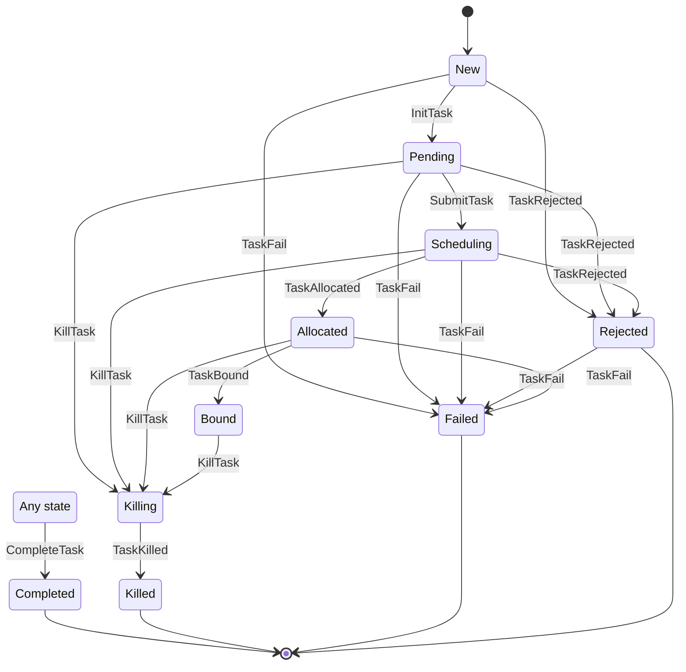
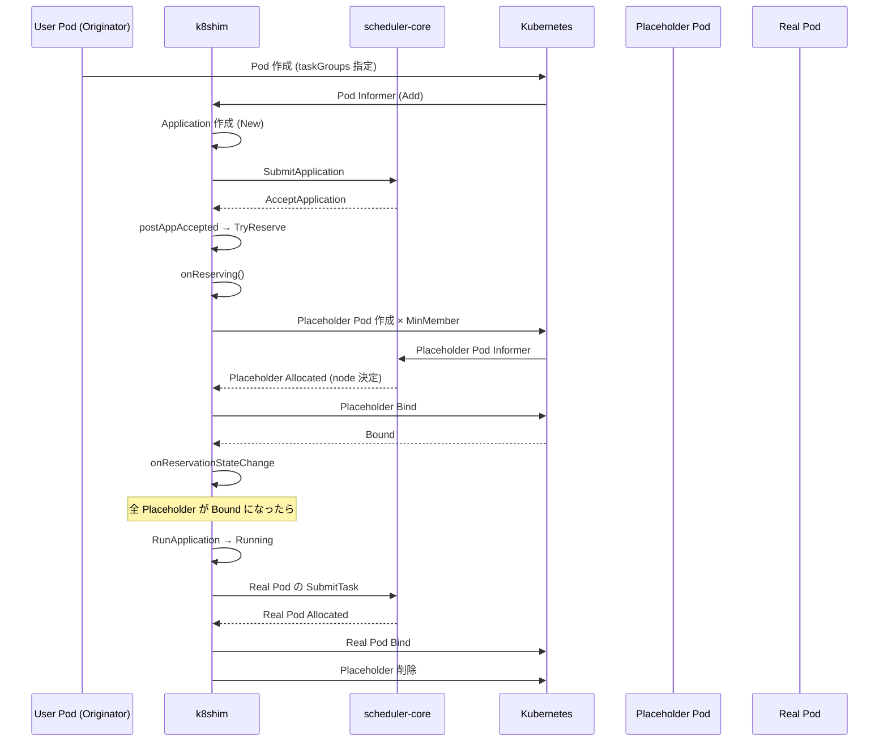

# 第5章 タスク状態管理とプレースホルダー

> 本章で読むソース:
>
> - [pkg/cache/task.go L42-L64](https://github.com/apache/yunikorn-k8shim/blob/v1.8.0/pkg/cache/task.go#L42-L64)
> - [pkg/cache/task.go L90-L114](https://github.com/apache/yunikorn-k8shim/blob/v1.8.0/pkg/cache/task.go#L90-L114)
> - [pkg/cache/task.go L209-L227](https://github.com/apache/yunikorn-k8shim/blob/v1.8.0/pkg/cache/task.go#L209-L227)
> - [pkg/cache/task.go L288-L340](https://github.com/apache/yunikorn-k8shim/blob/v1.8.0/pkg/cache/task.go#L288-L340)
> - [pkg/cache/task.go L348-L402](https://github.com/apache/yunikorn-k8shim/blob/v1.8.0/pkg/cache/task.go#L348-L402)
> - [pkg/cache/task_state.go L40-L54](https://github.com/apache/yunikorn-k8shim/blob/v1.8.0/pkg/cache/task_state.go#L40-L54)
> - [pkg/cache/task_state.go L274-L375](https://github.com/apache/yunikorn-k8shim/blob/v1.8.0/pkg/cache/task_state.go#L274-L375)
> - [pkg/cache/task_state.go L377-L447](https://github.com/apache/yunikorn-k8shim/blob/v1.8.0/pkg/cache/task_state.go#L377-L447)
> - [pkg/cache/placeholder.go L43-L133](https://github.com/apache/yunikorn-k8shim/blob/v1.8.0/pkg/cache/placeholder.go#L43-L133)
> - [pkg/cache/placeholder_manager.go L35-L102](https://github.com/apache/yunikorn-k8shim/blob/v1.8.0/pkg/cache/placeholder_manager.go#L35-L102)
> - [pkg/cache/placeholder_manager.go L105-L139](https://github.com/apache/yunikorn-k8shim/blob/v1.8.0/pkg/cache/placeholder_manager.go#L105-L139)
> - [pkg/cache/gang_utils.go L36-L67](https://github.com/apache/yunikorn-k8shim/blob/v1.8.0/pkg/cache/gang_utils.go#L36-L67)

## この章の狙い

`Task` は Pod に対応するスケジューリングの最小単位である。
本章では `Task` の状態遷移を確認したあと、プレースホルダーとギャングスケジューリングの仕組みを詳しく読む。
プレースホルダーは Kubernetes 上にダミーの Pod を作成してリソースを確保し、本 Pod への置換によって一貫したスケジュールを実現する。

## 前提

第3章で `Context` がタスクを管理すること、第4章で `Application` が `Reserving` 状態からプレースホルダーを生成することを確認した。
本章ではそのプレースホルダーの実体と、ギャングスケジューリングの全体像を明らかにする。

## Task 構造体

`Task` 構造体は Pod 1つに対応する。

[pkg/cache/task.go L42-L64](https://github.com/apache/yunikorn-k8shim/blob/v1.8.0/pkg/cache/task.go#L42-L64)

```go
type Task struct {
    taskID        string
    alias         string
    applicationID string
    application   *Application
    podStatus     v1.PodStatus // pod status, maintained separately for efficiency reasons
    context       *Context
    createTime    time.Time
    placeholder   bool
    originator    bool
    sm            *fsm.FSM

    // mutable resources, require locking
    allocationKey   string
    nodeName        string
    taskGroupName   string
    terminationType string
    schedulingState TaskSchedulingState
    resource        *si.Resource
    pod             *v1.Pod

    lock *locking.RWMutex
}
```

`placeholder` はこのタスクがプレースホルダー Pod に対応するかを示す。
`originator` はアプリケーションのリクエストを開始した Pod かどうかを示す。
`schedulingState` はスケジューリングの進行状況を表す別の状態であり、タスクの FSM とは独立に管理される。
`podStatus` を別途保持しているのは、コメントにあるとおり効率上の理由である。

## Task の生成と初期化

`createTaskInternal` は `Task` の共通初期化処理である。

[pkg/cache/task.go L90-L114](https://github.com/apache/yunikorn-k8shim/blob/v1.8.0/pkg/cache/task.go#L90-L114)

```go
func createTaskInternal(tid string, app *Application, resource *si.Resource,
    pod *v1.Pod, placeholder bool, taskGroupName string, ctx *Context, originator bool) *Task {
    task := &Task{
        taskID:          tid,
        alias:           fmt.Sprintf("%s/%s", pod.Namespace, pod.Name),
        applicationID:   app.GetApplicationID(),
        application:     app,
        pod:             pod,
        podStatus:       *pod.Status.DeepCopy(),
        resource:        resource,
        createTime:      pod.GetCreationTimestamp().Time,
        placeholder:     placeholder,
        taskGroupName:   taskGroupName,
        originator:      originator,
        context:         ctx,
        sm:              newTaskState(),
        schedulingState: TaskSchedPending,
        lock:            &locking.RWMutex{},
    }
    if tgName := utils.GetTaskGroupFromPodSpec(pod); tgName != "" {
        task.taskGroupName = tgName
    }
    task.initialize()
    return task
}
```

`NewTask` は通常の Pod から、`NewTaskPlaceholder` はプレースホルダー Pod からタスクを生成する。

`initialize` は再起動時の状態復元を行う。

[pkg/cache/task.go L209-L227](https://github.com/apache/yunikorn-k8shim/blob/v1.8.0/pkg/cache/task.go#L209-L227)

```go
// task object initialization
// normally when task is added, the task state is New
// but during scheduler init after restart, we need to init the task state according to
// the task pod status. if the pod is already terminated,
// we should mark the task as completed according.
func (task *Task) initialize() {
    task.lock.Lock()
    defer task.lock.Unlock()

    if utils.IsPodTerminated(task.pod) {
        task.allocationKey = string(task.pod.UID)
        task.nodeName = task.pod.Spec.NodeName
        task.sm.SetState(TaskStates().Completed)
        log.Log(log.ShimCacheTask).Info("set task as Completed",
            zap.String("appID", task.applicationID),
            zap.String("taskID", task.taskID),
            zap.String("allocationKey", task.allocationKey),
            zap.String("nodeName", task.nodeName))
    }
}
```

スケジューラの再起動時、Pod がすでに終了済みであれば `Completed` に直接設定する。
これにより、完了したタスクをスケジューリング対象に含める無駄を避ける。

## タスクの状態遷移

`TStates` はタスクのすべての状態名を保持する。

[pkg/cache/task_state.go L274-L315](https://github.com/apache/yunikorn-k8shim/blob/v1.8.0/pkg/cache/task_state.go#L274-L315)

```go
type TStates struct {
    New        string
    Pending    string
    Scheduling string
    Allocated  string
    Rejected   string
    Bound      string
    Killing    string
    Killed     string
    Failed     string
    Completed  string
    Any        []string
    Terminated []string
}
```

`eventDesc` は状態遷移ルールを定義する。

[pkg/cache/task_state.go L322-L375](https://github.com/apache/yunikorn-k8shim/blob/v1.8.0/pkg/cache/task_state.go#L322-L375)

```go
func eventDesc(states *TStates) fsm.Events {
	return fsm.Events{
		{
			Name: InitTask.String(),
			Src:  []string{states.New},
			Dst:  states.Pending,
		},
		{
			Name: SubmitTask.String(),
			Src:  []string{states.Pending},
			Dst:  states.Scheduling,
		},
		{
			Name: TaskAllocated.String(),
			Src:  []string{states.Scheduling},
			Dst:  states.Allocated,
		},
		{
			Name: TaskAllocated.String(),
			Src:  []string{states.Completed},
			Dst:  states.Completed,
		},
		{
			Name: TaskBound.String(),
			Src:  []string{states.Allocated},
			Dst:  states.Bound,
		},
		{
			Name: CompleteTask.String(),
			Src:  states.Any,
			Dst:  states.Completed,
		},
		{
			Name: KillTask.String(),
			Src:  []string{states.Pending, states.Scheduling, states.Allocated, states.Bound},
			Dst:  states.Killing,
		},
		{
			Name: TaskKilled.String(),
			Src:  []string{states.Killing},
			Dst:  states.Killed,
		},
		{
			Name: TaskRejected.String(),
			Src:  []string{states.New, states.Pending, states.Scheduling},
			Dst:  states.Rejected,
		},
		{
			Name: TaskFail.String(),
			Src:  []string{states.New, states.Pending, states.Scheduling, states.Rejected, states.Allocated},
			Dst:  states.Failed,
		},
	}
}
```



ハッピーパスは `New` → `Pending` → `Scheduling` → `Allocated` → `Bound` → `Completed` である。
`InitTask` で `Pending` に遷移すると、コールバックで `SubmitTask` が発行されて `Scheduling` に進む。
`CompleteTask` はどの状態からでも `Completed` に遷移できる。

## コールバックとフック

`callbacks` は状態遷移の前後で実行される処理を定義する。

[pkg/cache/task_state.go L377-L443](https://github.com/apache/yunikorn-k8shim/blob/v1.8.0/pkg/cache/task_state.go#L377-L443)

```go
func callbacks(states *TStates) fsm.Callbacks {
    return fsm.Callbacks{
        events.EnterState: func(_ context.Context, event *fsm.Event) { /* ログ出力 */ },
        states.Pending: func(_ context.Context, event *fsm.Event) {
            task := event.Args[0].(*Task)
            task.postTaskPending()
        },
        states.Allocated: func(_ context.Context, event *fsm.Event) {
            task := event.Args[0].(*Task)
            task.postTaskAllocated()
        },
        states.Bound: func(_ context.Context, event *fsm.Event) {
            task := event.Args[0].(*Task)
            task.postTaskBound()
        },
        beforeHook(TaskAllocated): func(_ context.Context, event *fsm.Event) {
            task := event.Args[0].(*Task)
            task.beforeTaskAllocated(event.Src, allocationKey, nodeID)
        },
        beforeHook(TaskFail): func(_ context.Context, event *fsm.Event) {
            task := event.Args[0].(*Task)
            task.beforeTaskFail()
        },
        beforeHook(CompleteTask): func(_ context.Context, event *fsm.Event) {
            task := event.Args[0].(*Task)
            task.beforeTaskCompleted()
        },
        SubmitTask.String(): func(_ context.Context, event *fsm.Event) {
            task := event.Args[0].(*Task)
            task.handleSubmitTaskEvent()
        },
    }
}
```

`beforeHook` は `before_<EventName>` という名前のコールバックであり、状態遷移の前に実行される。
`beforeTaskAllocated` はタスクがすでに `Completed` なら即座にアロケーションをリリースする。
`beforeTaskFail` と `beforeTaskCompleted` はアロケーションのリリースを行う。

## タスクのスケジュール処理

`postTaskPending` は `SubmitTask` イベントをディスパッチする。

[pkg/cache/task.go L338-L340](https://github.com/apache/yunikorn-k8shim/blob/v1.8.0/pkg/cache/task.go#L338-L340)

```go
func (task *Task) postTaskPending() {
    dispatcher.Dispatch(NewSubmitTaskEvent(task.applicationID, task.taskID))
}
```

この2段階構成（`InitTask` → `Pending` → `SubmitTask` → `Scheduling`）により、重複スケジュールを防ぐ。

`handleSubmitTaskEvent` はスケジューラコアにアロケーション要求を送信する。

[pkg/cache/task.go L288-L307](https://github.com/apache/yunikorn-k8shim/blob/v1.8.0/pkg/cache/task.go#L288-L307)

```go
func (task *Task) handleSubmitTaskEvent() {
    log.Log(log.ShimCacheTask).Debug("scheduling pod",
        zap.String("podName", task.pod.Name))

    task.updateAllocation()

    if !utils.PodAlreadyBound(task.pod) {
        events.GetRecorder().Eventf(task.pod.DeepCopy(), nil, v1.EventTypeNormal, "Scheduling", "Scheduling",
            "%s is queued and waiting for allocation", task.alias)
        if !task.placeholder && task.taskGroupName != "" {
            events.GetRecorder().Eventf(task.pod.DeepCopy(), nil,
                v1.EventTypeNormal, "GangScheduling", "TaskGroupMatch",
                "Pod belongs to the taskGroup %s, it will be scheduled as a gang member", task.taskGroupName)
        }
    }
}
```

タスクがタスクグループに属していれば、ギャングスケジューリングのイベントを Pod に発行する。

`postTaskAllocated` は非ゴルーチンで Pod のバインドを行う。

[pkg/cache/task.go L348-L402](https://github.com/apache/yunikorn-k8shim/blob/v1.8.0/pkg/cache/task.go#L348-L402)

```go
func (task *Task) postTaskAllocated() {
    go func() {
        task.lock.Lock()
        defer task.lock.Unlock()

        if utils.IsPluginMode() {
            task.context.AddPendingPodAllocation(string(task.pod.UID), task.nodeName)
            dispatcher.Dispatch(NewBindTaskEvent(task.applicationID, task.taskID))
        } else {
            events.GetRecorder().Eventf(task.pod.DeepCopy(),
                nil, v1.EventTypeNormal, "Scheduled", "Scheduled",
                "Successfully assigned %s to node %s", task.alias, task.nodeName)

            if err := task.context.bindPodVolumes(task.pod); err != nil {
                task.failWithEvent(fmt.Sprintf("bind volumes to pod failed, name: %s, %s", task.alias, err.Error()), "PodVolumesBindFailure")
                return
            }

            if err := task.context.apiProvider.GetAPIs().KubeClient.Bind(task.pod, task.nodeName); err != nil {
                task.failWithEvent(fmt.Sprintf("bind pod to node failed, name: %s, %s", task.alias, err.Error()), "PodBindFailure")
                return
            }

            dispatcher.Dispatch(NewBindTaskEvent(task.applicationID, task.taskID))
        }

        task.schedulingState = TaskSchedAllocated
    }()
}
```

コメントにあるとおり、バインド処理は非ゴルーチンで実行される。
K8s API の呼び出しは遅いため、メインの処理をブロックしない。

`postTaskBound` はプレースホルダーがバインドされたときに予約状態の変更を通知する。

[pkg/cache/task.go L427-L442](https://github.com/apache/yunikorn-k8shim/blob/v1.8.0/pkg/cache/task.go#L427-L442)

```go
func (task *Task) postTaskBound() {
    if utils.IsPluginMode() {
        task.context.ActivatePod(task.pod)
    }

    if task.placeholder {
        log.Log(log.ShimCacheTask).Info("placeholder is bound",
            zap.String("appID", task.applicationID),
            zap.String("taskName", task.alias),
            zap.String("taskGroupName", task.taskGroupName))
        dispatcher.Dispatch(NewUpdateApplicationReservationEvent(task.applicationID))
    }
}
```

プレースホルダーがバインドされると、`UpdateApplicationReservationEvent` を発行する。
このイベントは `Application.onReservationStateChange` を呼び、すべてのプレースホルダーが揃ったかを判定する。

---

## プレースホルダーの仕組み

### TaskGroup の概念

`TaskGroup` はギャングスケジューリングの単位を定義する。

[pkg/cache/amprotocol.go L47-L57](https://github.com/apache/yunikorn-k8shim/blob/v1.8.0/pkg/cache/amprotocol.go#L47-L57)

```go
type TaskGroup struct {
    Name                      string
    MinMember                 int32
    Labels                    map[string]string
    Annotations               map[string]string
    MinResource               map[string]resource.Quantity
    NodeSelector              map[string]string
    Tolerations               []v1.Toleration
    Affinity                  *v1.Affinity
    TopologySpreadConstraints []v1.TopologySpreadConstraint
}
```

`MinMember` は同時にスケジュールされるべき最小 Pod 数である。
`NodeSelector`、`Tolerations`、`Affinity` はプレースホルダー Pod のスケジューリング制約を定義する。

### Placeholder Pod の生成

`newPlaceholder` はプレースホルダー Pod の仕様を構築する。

[pkg/cache/placeholder.go L49-L133](https://github.com/apache/yunikorn-k8shim/blob/v1.8.0/pkg/cache/placeholder.go#L49-L133)

```go
func newPlaceholder(placeholderName string, app *Application, taskGroup TaskGroup) *Placeholder {
    ownerRefs := app.getPlaceholderOwnerReferences()
    annotations := utils.MergeMaps(taskGroup.Annotations, map[string]string{
        constants.AnnotationPlaceholderFlag: constants.True,
        constants.AnnotationTaskGroupName:   taskGroup.Name,
    })

    // Add "yunikorn.apache.org/task-groups" annotation to the placeholder to aid recovery
    tgDef := app.GetTaskGroupsDefinition()
    if tgDef != "" {
        annotations = utils.MergeMaps(annotations, map[string]string{
            constants.AnnotationTaskGroups: tgDef,
        })
    }

    // ... (中略) ...

    var priorityClassName string
    if task := app.GetOriginatingTask(); task != nil {
        priorityClassName = task.GetTaskPod().Spec.PriorityClassName
    }

    requests := GetPlaceholderResourceRequests(taskGroup.MinResource)
    var zeroSeconds int64 = 0
    placeholderPod := &v1.Pod{
        ObjectMeta: metav1.ObjectMeta{
            Name:      placeholderName,
            Namespace: app.tags[constants.AppTagNamespace],
            Labels: utils.MergeMaps(taskGroup.Labels, map[string]string{
                constants.CanonicalLabelApplicationID: app.GetApplicationID(),
                constants.CanonicalLabelQueueName:     app.GetQueue(),
            }),
            Annotations:     annotations,
            OwnerReferences: ownerRefs,
        },
        Spec: v1.PodSpec{
            SecurityContext: &v1.PodSecurityContext{
                RunAsUser:  &runAsUser,
                RunAsGroup: &runAsGroup,
            },
            Containers: []v1.Container{
                {
                    Name:            constants.PlaceholderContainerName,
                    Image:           conf.GetSchedulerConf().PlaceHolderImage,
                    ImagePullPolicy: v1.PullIfNotPresent,
                    Resources: v1.ResourceRequirements{
                        Requests: requests,
                        Limits:   requests,
                    },
                },
            },
            RestartPolicy:                 constants.PlaceholderPodRestartPolicy,
            SchedulerName:                 constants.SchedulerName,
            NodeSelector:                  taskGroup.NodeSelector,
            Tolerations:                   taskGroup.Tolerations,
            Affinity:                      taskGroup.Affinity,
            TopologySpreadConstraints:     taskGroup.TopologySpreadConstraints,
            PriorityClassName:             priorityClassName,
            TerminationGracePeriodSeconds: &zeroSeconds,
        },
    }

    return &Placeholder{appID: app.GetApplicationID(), taskGroupName: taskGroup.Name, pod: placeholderPod}
}
```

プレースホルダー Pod の設計上の特徴を整理する。

- **アノテーション**: `yunikorn.apache.org/placeholder=true` と `yunikorn.apache.org/task-group-name` を付与する。リカバリ用にタスクグループ定義も埋め込む。
- **OwnerReference**: オリジネーター Pod を所有者として設定する。オリジネーター Pod が削除されればプレースホルダーも連鎖的に削除される。
- **セキュリティ**: `RunAsUser=1000`、`RunAsGroup=3000` で非 root ユーザーとして実行する。プレースホルダーは何も実行しないダミーコンテナなので、どのユーザーでもよい。
- **TerminationGracePeriodSeconds**: 0 に設定し、即時終了できるようにする。
- **スケジューリング制約**: タスクグループの `NodeSelector`、`Tolerations`、`Affinity` をそのまま受け継ぐ。これによりプレースホルダーは本 Pod がスケジュール可能な場所と同じ場所に確保される。

### PlaceholderManager

`PlaceholderManager` はプレースホルダーのライフサイクルを管理する。

[pkg/cache/placeholder_manager.go L35-L47](https://github.com/apache/yunikorn-k8shim/blob/v1.8.0/pkg/cache/placeholder_manager.go#L35-L47)

```go
type PlaceholderManager struct {
    clients *client.Clients
    // when the placeholder manager is unable to delete a pod,
    // this pod becomes to be an "orphan" pod. We add them to a map
    // and keep retrying deleting them in order to avoid wasting resources.
    orphanPods  map[string]*v1.Pod
    stopChan    chan struct{}
    running     atomic.Bool
    cleanupTime time.Duration
    locking.RWMutex
}
```

`orphanPods` は削除に失敗したプレースホルダー Pod を保持するマップである。
コメントが説明するとおり、削除に失敗した Pod は「孤児」として保持され、定期的に再試行される。

### createAppPlaceholders: プレースホルダーの一括作成

`createAppPlaceholders` はアプリケーションの全タスクグループについてプレースホルダーを作成する。

[pkg/cache/placeholder_manager.go L72-L102](https://github.com/apache/yunikorn-k8shim/blob/v1.8.0/pkg/cache/placeholder_manager.go#L72-L102)

```go
func (mgr *PlaceholderManager) createAppPlaceholders(app *Application) error {
    mgr.Lock()
    defer mgr.Unlock()

    // map task group to count of already created placeholders
    tgCounts := make(map[string]int32)
    for _, ph := range app.getPlaceHolderTasks() {
        tgCounts[ph.GetTaskGroupName()]++
    }

    // iterate all task groups, create placeholders for all the min members
    for _, tg := range app.getTaskGroups() {
        count := tgCounts[tg.Name]
        // only create missing pods for each task group
        for i := count; i < tg.MinMember; i++ {
            placeholderName := GeneratePlaceholderName(tg.Name, app.GetApplicationID())
            placeholder := newPlaceholder(placeholderName, app, tg)
            _, err := mgr.clients.KubeClient.Create(placeholder.pod)
            if err != nil {
                log.Log(log.ShimCachePlaceholder).Error("failed to create placeholder pod", zap.Error(err))
                return err
            }
            log.Log(log.ShimCachePlaceholder).Info("placeholder created", zap.Stringer("placeholder", placeholder))
        }
    }

    return nil
}
```

すでに作成済みのプレースホルダー数をカウントし、不足分だけを作成する。
この差分作成により、リカバリ時にも二重にプレースホルダーを作らない。
`GeneratePlaceholderName` は `tg-<appID>-<taskGroup>-<nonce>` 形式の名前を生成する（K8s の63文字制限に収めるため、appID を28文字、タスクグループ名を20文字に切り詰める）。

### cleanUp と孤児の再試行

`cleanUp` はアプリケーションの全プレースホルダーを削除する。

[pkg/cache/placeholder_manager.go L105-L123](https://github.com/apache/yunikorn-k8shim/blob/v1.8.0/pkg/cache/placeholder_manager.go#L105-L123)

```go
func (mgr *PlaceholderManager) cleanUp(app *Application) {
    mgr.Lock()
    defer mgr.Unlock()
    for _, task := range app.GetPlaceHolderTasks() {
        err := mgr.clients.KubeClient.Delete(task.GetTaskPod())
        if err != nil {
            if !strings.Contains(err.Error(), "not found") {
                mgr.orphanPods[task.GetTaskID()] = task.GetTaskPod()
            }
        }
    }
}
```

削除に失敗し、かつ「not found」エラーでない場合、その Pod を `orphanPods` に追加する。
`PlaceholderManager.Start` により約5秒間隔で `cleanOrphanPlaceholders` が呼ばれ、孤児の削除を再試行する。

## ギャングスケジューリングの全体フロー

ギャングスケジューリングは、複数の Pod を同時にスケジュールすることを保証する仕組みである。



フローを段階的に説明する。

1. **アプリケーションの登録**: ユーザーがタスクグループ付きの Pod を作成すると、k8shim がアプリケーションを登録し、コアが受理する。
2. **予約段階**: `postAppAccepted` でタスクグループの有無を確認し、あれば `TryReserve` で `Reserving` 状態に遷移する。
3. **プレースホルダーの作成**: `onReserving` が `createAppPlaceholders` を呼び、タスクグループの `MinMember` 数だけプレースホルダー Pod を作成する。
4. **プレースホルダーのスケジュール**: プレースホルダー Pod は Informer 経由で k8shim に認識され、コアによってノードに割り当てられる。
5. **予約完了の判定**: プレースホルダーがバインドされるたびに `onReservationStateChange` が呼ばれる。すべてのタスクグループで `MinMember` 数のプレースホルダーがバインドされると、`RunApplication` イベントが発行される。
6. **本 Pod のスケジュール**: `Running` 状態に遷移すると、通常の Pod がスケジュール対象になる。
7. **プレースホルダーの置換**: 本 Pod がバインドされると、対応するプレースホルダーが削除される。

## HARD と SOFT の違い

HARD スタイルでは、すべてのプレースホルダーが確保されるまで本 Pod はスケジュールされない。
リソースが不足していればタイムアウトまで待機し、タイムアウトすればアプリケーションは失敗する。

SOFT スタイルでは、プレースホルダーがタイムアウトすると `Resuming` 状態に遷移する。
`onResuming` はオリジネーター Pod にイベントを発行し、プレースホルダーのクリーンアップを開始する。
すべてのプレースホルダーが `Completed` になれば `RunApplication` を発行して通常のスケジューリングに移行する。

## 最適化: 差分によるプレースホルダー作成

`createAppPlaceholders` の最適化は、すでに作成済みのプレースホルダーを数えて不足分だけを作成する点にある。

[pkg/cache/placeholder_manager.go L77-L86](https://github.com/apache/yunikorn-k8shim/blob/v1.8.0/pkg/cache/placeholder_manager.go#L77-L86)

```go
    // map task group to count of already created placeholders
    tgCounts := make(map[string]int32)
    for _, ph := range app.getPlaceHolderTasks() {
        tgCounts[ph.GetTaskGroupName()]++
    }

    // iterate all task groups, create placeholders for all the min members
    for _, tg := range app.getTaskGroups() {
        count := tgCounts[tg.Name]
        // only create missing pods for each task group
        for i := count; i < tg.MinMember; i++ {
```

リカバリ時にすでに一部のプレースホルダーが Kubernetes 上に存在する場合、その数を引いた分だけを作成する。
これにより、K8s API に不要な Pod 作成要求を送らず、既存のプレースホルダーを再利用できる。

## まとめ

`Task` は Pod に対応するスケジューリングの最小単位であり、`New` → `Pending` → `Scheduling` → `Allocated` → `Bound` → `Completed` の状態遷移を経る。
プレースホルダーはタスクグループの `MinMember` 数だけ作成されるダミーの Pod であり、本 Pod と同じスケジューリング制約を持つ。
`PlaceholderManager` はプレースホルダーの作成と削除を一括で管理し、削除に失敗した孤児 Pod は定期的に再試行される。
ギャングスケジューリングは HARD と SOFT の2つのスタイルをサポートし、HARD は全プレースホルダーの確保を保証し、SOFT はタイムアウト後に部分的なスケジュールを許可する。
`onReservationStateChange` はバインド済みのプレースホルダー数を集計し、すべて揃ったときだけ `Running` に遷移する。

## 関連する章

- [第3章 Context とキャッシュレイヤー](03-context-and-cache.md): `Context` がタスクを管理する仕組み
- [第4章 アプリケーション状態機械](04-application-state-machine.md): `Application` の状態遷移、特に `Reserving` と `Running`
- [第6章 K8s API クライアントと Informer](../part02-k8s/06-k8s-client-and-informer.md): Pod の Informer がプレースホルダーをどう検知するか
