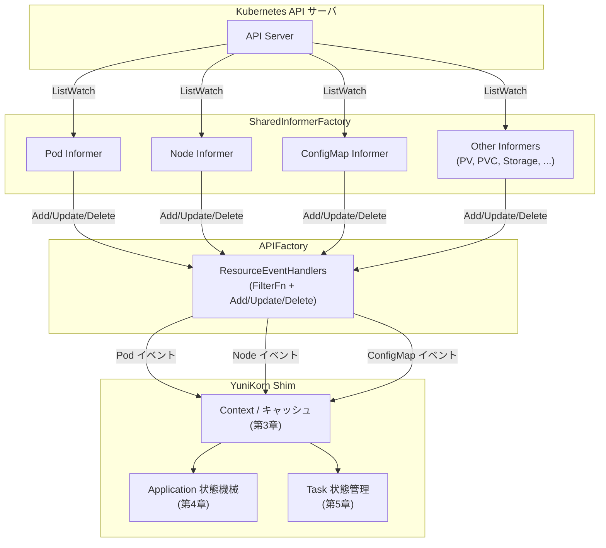

# 第6章 K8s API クライアントと Informer

> 本章で読むソース
>
> - [pkg/client/interfaces.go L27-60](https://github.com/apache/yunikorn-k8shim/blob/v1.8.0/pkg/client/interfaces.go#L27-L60)
> - [pkg/client/kubeclient.go L38-69](https://github.com/apache/yunikorn-k8shim/blob/v1.8.0/pkg/client/kubeclient.go#L38-L69)
> - [pkg/client/clients.go L40-118](https://github.com/apache/yunikorn-k8shim/blob/v1.8.0/pkg/client/clients.go#L40-L118)
> - [pkg/client/apifactory.go L65-253](https://github.com/apache/yunikorn-k8shim/blob/v1.8.0/pkg/client/apifactory.go#L65-L253)
> - [pkg/client/bootstrap.go L28-44](https://github.com/apache/yunikorn-k8shim/blob/v1.8.0/pkg/client/bootstrap.go#L28-L44)

## この章の狙い

本章では YuniKorn k8shim が Kubernetes API サーバと通信するためのクライアント層と、クラスタの状態を監視する Informer の仕組みを整理する。
`KubeClient` インターフェースが提供する操作、`Clients` 構造体が保持する Informer の一覧、`APIFactory` によるイベントハンドラの登録手順を順に読む。
最後に、起動直前に ConfigMap を読み込むブートストラップの役割を確認する。

## 前提

読者は Kubernetes の client-go ライブラリにある `SharedInformerFactory` の概念を知っていることを想定する。
Informer が API サーバからのイベントをローカルキャッシュに反映し、登録されたハンドラへ通知する仕組みは、本章の理解に不可欠である。
第4章で読んだアプリケーション状態機械、第5章で読んだタスク状態管理は、本章の Informer が取得する Pod イベントを消費する側である。

## KubeClient インターフェース

`KubeClient` は Kubernetes API サーバに対する操作を抽象化するインターフェースである。

[pkg/client/interfaces.go L27-52](https://github.com/apache/yunikorn-k8shim/blob/v1.8.0/pkg/client/interfaces.go#L27-L52)

```go
type KubeClient interface {
    // bind a pod to a specific host
    Bind(pod *v1.Pod, hostID string) error

    // Create a pod
    Create(pod *v1.Pod) (*v1.Pod, error)

    // Delete a pod from a host
    Delete(pod *v1.Pod) error

    // Update a pod
    UpdatePod(pod *v1.Pod, podMutator func(pod *v1.Pod)) (*v1.Pod, error)

    // Update the status of a pod
    UpdateStatus(pod *v1.Pod) (*v1.Pod, error)

    // Get a pod
    Get(podNamespace string, podName string) (*v1.Pod, error)

    // minimal expose this, only informers factory needs it
    GetClientSet() kubernetes.Interface

    GetConfigs() *rest.Config

    GetConfigMap(namespace string, name string) (*v1.ConfigMap, error)
}
```

`Bind` はスケジューラが決定した Node に Pod を割り当てる操作である。
`Create`、`Delete`、`Get` は Pod のライフサイクル操作である。
`UpdatePod` と `UpdateStatus` は Pod のメタデータとステータスをそれぞれ更新する。
`GetClientSet` は Informer Factory が内部で client-go の `kubernetes.Interface` を取得するために公開している。
`GetConfigMap` は YuniKorn 固有の ConfigMap を読み込むために使う。

インターフェースを切ることで、テスト時にはモック実装に差し替えられる。

## SchedulerKubeClient の実装

`SchedulerKubeClient` は `KubeClient` の実装構造体である。

[pkg/client/kubeclient.go L38-41](https://github.com/apache/yunikorn-k8shim/blob/v1.8.0/pkg/client/kubeclient.go#L38-L41)

```go
type SchedulerKubeClient struct {
    clientSet *kubernetes.Clientset
    configs   *rest.Config
}
```

内部に client-go の `kubernetes.Clientset` と `rest.Config` を保持する。
生成関数は2種類ある。

[pkg/client/kubeclient.go L43-69](https://github.com/apache/yunikorn-k8shim/blob/v1.8.0/pkg/client/kubeclient.go#L43-L69)

```go
func newBootstrapSchedulerKubeClient(kc string) SchedulerKubeClient {
    config := CreateRestConfigOrDie(kc)
    configuredClient, err := kubernetes.NewForConfig(config)
    if err != nil {
        log.Log(log.ShimClient).Fatal("failed to get Clientset", zap.Error(err))
    }
    return SchedulerKubeClient{
        clientSet: configuredClient,
        configs:   config,
    }
}

func newSchedulerKubeClient(kc string) SchedulerKubeClient {
    schedulerConf := conf.GetSchedulerConf()

    config := CreateRestConfigOrDie(kc)
    config.QPS = float32(schedulerConf.KubeQPS)
    config.Burst = schedulerConf.KubeBurst
    configuredClient, err := kubernetes.NewForConfig(config)
    if err != nil {
        log.Log(log.ShimClient).Fatal("failed to get Clientset", zap.Error(err))
    }
    return SchedulerKubeClient{
        clientSet: configuredClient,
        configs:   config,
    }
}
```

`newBootstrapSchedulerKubeClient` は起動直前の ConfigMap 読み込み専用であり、QPS や Burst の制限を設定しない。
`newSchedulerKubeClient` は本番運用のクライアントであり、`rest.Config` に `QPS` と `Burst` を設定する。
これにより API サーバへのリクエスト頻度を制御し、過負荷を防ぐ。

### REST Config の解決

`CreateRestConfig` はクラスタ内設定と kubeconfig の2段階で接続先を解決する。

[pkg/client/kubeclient.go L79-101](https://github.com/apache/yunikorn-k8shim/blob/v1.8.0/pkg/client/kubeclient.go#L79-L101)

```go
func CreateRestConfig(kc string) (*rest.Config, error) {
    // attempt to use in-cluster config
    config, err := rest.InClusterConfig()
    if err != nil && err != rest.ErrNotInCluster {
        log.Log(log.ShimClient).Error("failed to create REST config", zap.Error(err))
        return nil, err
    }
    if config != nil {
        return config, nil
    }

    // fall back to kubeconfig if present
    if kc == "" {
        kc = conf.GetDefaultKubeConfigPath()
    }
    log.Log(log.ShimClient).Info(fmt.Sprintf("Not running inside Kubernetes; using KUBECONFIG at %s", kc))
    config, err = clientcmd.BuildConfigFromFlags("", kc)
    if err != nil {
        log.Log(log.ShimClient).Error("failed to create kubeClient configs", zap.Error(err))
        return config, err
    }
    return config, nil
}
```

まず `rest.InClusterConfig()` で Pod 内のサービスアカウントトークンから接続を試みる。
これが失敗してかつ `ErrNotInCluster` の場合、kubeconfig ファイルにフォールバックする。
この2段階の解決により、クラスタ内デプロイでもローカル開発でも同じコードパスで接続できる。

### 競合リトライ付きの Pod 更新

`UpdatePod` と `UpdateStatus` は `retry.RetryOnConflict` を使った指数バックオフのリトライを実装している。

[pkg/client/kubeclient.go L175-208](https://github.com/apache/yunikorn-k8shim/blob/v1.8.0/pkg/client/kubeclient.go#L175-L208)

```go
func (nc SchedulerKubeClient) UpdatePod(pod *v1.Pod, podMutator func(pod *v1.Pod)) (*v1.Pod, error) {
    var updatedPod *v1.Pod
    var updateErr error
    // Retrieve the latest version of Pod before attempting update
    // RetryOnConflict uses exponential backoff to avoid exhausting the API server
    retryErr := retry.RetryOnConflict(retry.DefaultRetry, func() error {
        latestPod, getErr := nc.clientSet.CoreV1().Pods(pod.Namespace).Get(context.Background(), pod.Name, apis.GetOptions{})
        if getErr != nil {
            log.Log(log.ShimClient).Warn("failed to get latest version of Pod",
                zap.Error(getErr))
        }
        // allow mutator to update pod
        podMutator(latestPod)
        if updatedPod, updateErr = nc.clientSet.CoreV1().Pods(pod.Namespace).Update(context.Background(), latestPod, apis.UpdateOptions{}); updateErr != nil {
            log.Log(log.ShimClient).Warn("failed to update pod",
                zap.String("namespace", pod.Namespace),
                zap.String("podName", pod.Name),
                zap.Error(updateErr))
            return updateErr
        }
        return nil
    })
    // ... (後略)
```

リトライのたびに最新バージョンを `Get` で取得し、`podMutator` 関数を適用してから `Update` を送る。
`RetryOnConflict` の指数バックオフにより、API サーバを枯渇させることなく競合を回避できる。
これは Optimistic Concurrency Control のパターンであり、Kubernetes の API サーバが返す `resourceVersion` の不一致を自動で再試行する。

## Clients 構造体

`Clients` は Informer の集合体を保持する構造体である。

[pkg/client/clients.go L40-68](https://github.com/apache/yunikorn-k8shim/blob/v1.8.0/pkg/client/clients.go#L40-L68)

```go
// clients encapsulates a set of useful client APIs
// that can be shared by callers when talking to K8s api-server,
// or the scheduler core.
type Clients struct {
    // client apis
    KubeClient   KubeClient
    SchedulerAPI api.SchedulerAPI

    // informer factory
    InformerFactory informers.SharedInformerFactory

    // resource informers
    ConfigMapInformer             coreInformerV1.ConfigMapInformer
    CSIDriverInformer             storageInformerV1.CSIDriverInformer
    CSINodeInformer               storageInformerV1.CSINodeInformer
    CSIStorageCapacityInformer    storageInformerV1.CSIStorageCapacityInformer
    NamespaceInformer             coreInformerV1.NamespaceInformer
    NodeInformer                  coreInformerV1.NodeInformer
    PodInformer                   coreInformerV1.PodInformer
    StorageClassInformer          storageInformerV1.StorageClassInformer
    PVCInformer                   coreInformerV1.PersistentVolumeClaimInformer
    PVInformer                    coreInformerV1.PersistentVolumeInformer
    ReplicaSetInformer            appsInformerV1.ReplicaSetInformer
    PriorityClassInformer         schedulingInformerV1.PriorityClassInformer
    ServiceInformer               coreInformerV1.ServiceInformer
    StatefulSetInformer           appsInformerV1.StatefulSetInformer
    ReplicationControllerInformer coreInformerV1.ReplicationControllerInformer
    VolumeAttachmentInformer      storageInformerV1.VolumeAttachmentInformer

    // volume binder handles PV/PVC related operations
    VolumeBinder volumebinding.SchedulerVolumeBinder
}
```

`KubeClient` と `SchedulerAPI` は API 操作の入口である。
`InformerFactory` は client-go の `SharedInformerFactory` であり、すべての Informer はこのファクトリから生成される。
16種類の Informer がフィールドとして並んでいる。
Pod、Node、ConfigMap といった基本リソースに加え、PV、PVC、StorageClass、CSI 関連、ReplicaSet、StatefulSet、PriorityClass まで含む。
これらはスケジューリングの判断材料としてクラスタの状態を監視する。

`VolumeBinder` は PV と PVC のバインド処理を担うコンポーネントである。
Informer から取得したストレージ関連の情報を元に、ボリュームのバインド可否を判定する。

### Informer の起動と同期

`Run` はすべての Informer をゴルーチンで起動する。

[pkg/client/clients.go L101-118](https://github.com/apache/yunikorn-k8shim/blob/v1.8.0/pkg/client/clients.go#L101-L118)

```go
func (c *Clients) Run(stopCh <-chan struct{}) {
    go c.ConfigMapInformer.Informer().Run(stopCh)
    go c.CSIDriverInformer.Informer().Run(stopCh)
    go c.CSINodeInformer.Informer().Run(stopCh)
    go c.CSIStorageCapacityInformer.Informer().Run(stopCh)
    go c.NamespaceInformer.Informer().Run(stopCh)
    go c.NodeInformer.Informer().Run(stopCh)
    go c.PodInformer.Informer().Run(stopCh)
    go c.PriorityClassInformer.Informer().Run(stopCh)
    go c.PVCInformer.Informer().Run(stopCh)
    go c.PVInformer.Informer().Run(stopCh)
    go c.ReplicaSetInformer.Informer().Run(stopCh)
    go c.ReplicationControllerInformer.Informer().Run(stopCh)
    go c.ServiceInformer.Informer().Run(stopCh)
    go c.StatefulSetInformer.Informer().Run(stopCh)
    go c.StorageClassInformer.Informer().Run(stopCh)
    go c.VolumeAttachmentInformer.Informer().Run(stopCh)
}
```

各 Informer は独立したゴルーチンで API サーバを監視し、リストウォッチの結果をローカルキャッシュに反映する。

`WaitForSync` は全 Informer のキャッシュが初期同期を完了するまでポーリングで待機する。

[pkg/client/clients.go L70-99](https://github.com/apache/yunikorn-k8shim/blob/v1.8.0/pkg/client/clients.go#L70-L99)

```go
func (c *Clients) WaitForSync() {
    syncStartTime := time.Now()
    counter := 0
    for {
        if c.ConfigMapInformer.Informer().HasSynced() &&
            c.CSIDriverInformer.Informer().HasSynced() &&
            // ... (中略) ...
            c.VolumeAttachmentInformer.Informer().HasSynced() {
            return
        }
        time.Sleep(time.Second)
        counter++
        if counter%10 == 0 {
            log.Log(log.ShimClient).Info("Waiting for informers to sync",
                zap.Duration("timeElapsed", time.Since(syncStartTime).Round(time.Second)))
        }
    }
}
```

16個すべての `HasSynced()` が `true` を返すまで1秒ごとにチェックを繰り返す。
10回ごとに経過時間をログに出力し、進捗を観測できるようにする。
初期同期が完了する前にスケジューリングを開始すると、キャッシュが不完全で誤った判断を下す可能性がある。
この待機処理によって、スケジューラが完全なクラスタ状態を把握してから動作することを保証する。

## APIFactory

`APIFactory` は Informer の生成とイベントハンドラの登録を統括する。

[pkg/client/apifactory.go L86-91](https://github.com/apache/yunikorn-k8shim/blob/v1.8.0/pkg/client/apifactory.go#L86-L91)

```go
type APIFactory struct {
    clients  *Clients
    testMode bool
    stopChan chan struct{}
    lock     *locking.RWMutex
}
```

`APIProvider` インターフェースを実装する。

[pkg/client/apifactory.go L65-72](https://github.com/apache/yunikorn-k8shim/blob/v1.8.0/pkg/client/apifactory.go#L65-L72)

```go
type APIProvider interface {
    GetAPIs() *Clients
    AddEventHandler(handlers *ResourceEventHandlers) error
    Start()
    Stop()
    WaitForSync()
    IsTestingMode() bool
}
```

### NewAPIFactory による Informer の初期化

`NewAPIFactory` は `SharedInformerFactory` から各種 Informer を取得し、`Clients` にまとめて格納する。

[pkg/client/apifactory.go L93-161](https://github.com/apache/yunikorn-k8shim/blob/v1.8.0/pkg/client/apifactory.go#L93-L161)

```go
func NewAPIFactory(scheduler api.SchedulerAPI, informerFactory informers.SharedInformerFactory, configs *conf.SchedulerConf, testMode bool) *APIFactory {
    kubeClient := NewKubeClient(configs.KubeConfig)
    namespaceInformerFactory := informers.NewSharedInformerFactoryWithOptions(kubeClient.GetClientSet(), 0, informers.WithNamespace(configs.Namespace))
    // init informers
    // volume informers are also used to get the Listers for the predicates
    podInformer := informerFactory.Core().V1().Pods()
    nodeInformer := informerFactory.Core().V1().Nodes()
    configMapInformer := namespaceInformerFactory.Core().V1().ConfigMaps()
    // ... (中略) ...
    volumeAttachmentInformer := informerFactory.Storage().V1().VolumeAttachments()

    var capacityCheck = volumebinding.CapacityCheck{
        CSIDriverInformer:          informerFactory.Storage().V1().CSIDrivers(),
        CSIStorageCapacityInformer: informerFactory.Storage().V1().CSIStorageCapacities(),
    }

    // create a volume binder (needs the informers)
    volumeBinder := volumebinding.NewVolumeBinder(
        klog.NewKlogr(),
        kubeClient.GetClientSet(),
        feature.Features{},
        podInformer,
        nodeInformer,
        csiNodeInformer,
        pvcInformer,
        pvInformer,
        storageInformer,
        capacityCheck,
        configs.VolumeBindTimeout)
    // ... (後略)
```

注目すべき点が2つある。

1つ目は `ConfigMapInformer` だけ `namespaceInformerFactory` から生成していることである。
これは YuniKorn 自身の名前空間に限定して ConfigMap を監視するためである。
他の Informer はクラスタ全体を監視する。

2つ目は `VolumeBinder` の生成に複数の Informer を渡していることである。
PV、PVC、StorageClass、CSINode、CSIStorageCapacity の情報を統合して、ボリュームのバインド可否を判断する。

### ResourceEventHandlers によるイベント登録

`ResourceEventHandlers` は Informer のイベントハンドラを型付きで表現する。

[pkg/client/apifactory.go L76-82](https://github.com/apache/yunikorn-k8shim/blob/v1.8.0/pkg/client/apifactory.go#L76-L82)

```go
type ResourceEventHandlers struct {
    Type
    FilterFn func(obj interface{}) bool
    AddFn    func(obj interface{})
    UpdateFn func(old, new interface{})
    DeleteFn func(obj interface{})
}
```

`Type` はどのリソース種別に対するハンドラかを識別する列挙値である。

[pkg/client/apifactory.go L38-59](https://github.com/apache/yunikorn-k8shim/blob/v1.8.0/pkg/client/apifactory.go#L38-L59)

```go
const (
    PodInformerHandlers Type = iota
    NodeInformerHandlers
    ConfigMapInformerHandlers
    PVInformerHandlers
    PVCInformerHandlers
    StorageInformerHandlers
    CSINodeInformerHandlers
    CSIDriverInformerHandlers
    CSIStorageCapacityInformerHandlers
    NamespaceInformerHandlers
    PriorityClassInformerHandlers
    ServiceInformerHandlers
    ReplicationControllerInformerHandlers
    ReplicaSetInformerHandlers
    StatefulSetInformerHandlers
    VolumeAttachmentInformerHandlers
)
```

`AddEventHandler` は `FilterFn` の有無に応じてハンドラを切り替える。

[pkg/client/apifactory.go L171-198](https://github.com/apache/yunikorn-k8shim/blob/v1.8.0/pkg/client/apifactory.go#L171-L198)

```go
func (s *APIFactory) AddEventHandler(handlers *ResourceEventHandlers) error {
    s.lock.Lock()
    defer s.lock.Unlock()
    // register all handlers
    var h cache.ResourceEventHandler
    fns := cache.ResourceEventHandlerFuncs{
        AddFunc:    handlers.AddFn,
        UpdateFunc: handlers.UpdateFn,
        DeleteFunc: handlers.DeleteFn,
    }

    // if filter function exists
    // add a wrapper
    if handlers.FilterFn != nil {
        h = cache.FilteringResourceEventHandler{
            FilterFunc: handlers.FilterFn,
            Handler:    fns,
        }
    } else {
        h = fns
    }

    log.Log(log.ShimClient).Info("registering event handler", zap.Stringer("type", handlers.Type))
    if err := s.addEventHandlers(handlers.Type, h, 0); err != nil {
        return errors.Join(errors.New("failed to initialize event handlers: "), err)
    }
    return nil
}
```

`FilterFn` が nil でない場合は `cache.FilteringResourceEventHandler` でラップし、条件に合致するオブジェクトだけを `AddFn`、`UpdateFn`、`DeleteFn` に渡す。
このフィルタリングにより、不要なイベントを上位のハンドラに伝播させない。

`addEventHandlers` は `Type` に応じて適切な Informer にハンドラを登録する。

[pkg/client/apifactory.go L200-231](https://github.com/apache/yunikorn-k8shim/blob/v1.8.0/pkg/client/apifactory.go#L200-L231)

```go
func (s *APIFactory) addEventHandlers(
    handlerType Type, handler cache.ResourceEventHandler, resyncPeriod time.Duration) error {
    var err error
    switch handlerType {
    case PodInformerHandlers:
        _, err = s.GetAPIs().PodInformer.Informer().
            AddEventHandlerWithResyncPeriod(handler, resyncPeriod)
    case NodeInformerHandlers:
        _, err = s.GetAPIs().NodeInformer.Informer().
            AddEventHandlerWithResyncPeriod(handler, resyncPeriod)
    case ConfigMapInformerHandlers:
        _, err = s.GetAPIs().ConfigMapInformer.Informer().
            AddEventHandlerWithResyncPeriod(handler, resyncPeriod)
    // ... (中略) ...
    }
    // ... (後略)
```

## SharedInformerFactory による効率化

`SharedInformerFactory` は client-go が提供する仕組みであり、同じリソース種別に対する複数のリスナーを1つの Informer で共有する。
YuniKorn が16種類の Informer を個別に生成した場合、それぞれが API サーバに対して独立したリストウォッチの接続を張る。
`SharedInformerFactory` を使うと、同じリソース種別は1つのリストウォッチ接続で監視し、登録された複数のイベントハンドラに配信する。
これにより API サーバへの接続数と負荷を大幅に削減できる。

Informer はリストウォッチで取得したオブジェクトをローカルの ThreadSafeStore にキャッシュする。
イベントハンドラはこのキャッシュに対して登録されるため、API サーバへの直接参照なしにクラスタの状態を参照できる。
スケジューリングの判断ごとに API サーバに問い合わせるのではなく、ローカルキャッシュを参照することで、レイテンシと負荷の両方を抑えている。

## ブートストラップ ConfigMap

`LoadBootstrapConfigMaps` はスケジューラ起動前に設定を読み込む。

[pkg/client/bootstrap.go L28-44](https://github.com/apache/yunikorn-k8shim/blob/v1.8.0/pkg/client/bootstrap.go#L28-L44)

```go
func LoadBootstrapConfigMaps() ([]*v1.ConfigMap, error) {
    // we need a bootstrap client so that we can read the initial version of the configmap
    kubeClient := NewBootstrapKubeClient(conf.GetDefaultKubeConfigPath())
    namespace := conf.GetSchedulerNamespace()

    defaults, err := kubeClient.GetConfigMap(namespace, constants.DefaultConfigMapName)
    if err != nil {
        return nil, err
    }

    config, err := kubeClient.GetConfigMap(namespace, constants.ConfigMapName)
    if err != nil {
        return nil, err
    }

    return []*v1.ConfigMap{defaults, config}, nil
}
```

`yunikorn-defaults` と `yunikorn-configs` の2つの ConfigMap を読み込む。
`yunikorn-defaults` はデフォルト値を提供し、`yunikorn-configs` がオーバーライドする。
この2段構成により、管理者は上書きしたい設定だけを `yunikorn-configs` に記述すればよい。

ブートストラップ専用のクライアントを使う理由は、Informer が起動する前に設定が必要だからである。
`newBootstrapSchedulerKubeClient` は QPS や Burst の制限を適用しない。
起動前の短い期間に数回の API 呼び出ししか発生しないため、レート制限は不要である。

## Informer のイベントフロー

本章で読んだコンポーネント間のデータフローをまとめる。



API サーバで発生したリソースの変更は ListWatch 経由で Informer に届き、ローカルキャッシュを更新すると同時に `ResourceEventHandlers` のコールバックを呼び出す。
コールバックは `Context` のキャッシュを更新し、アプリケーション状態機械やタスク状態管理にイベントを伝播させる。

## まとめ

本章では YuniKorn k8shim の Kubernetes API クライアント層と Informer の仕組みを読んだ。
`KubeClient` インターフェースは Pod のバインド、作成、削除、更新を抽象化する。
`SchedulerKubeClient` は QPS と Burst のレート制限を適用し、指数バックオフのリトライで競合を処理する。
`Clients` は16種類の Informer を保持し、`APIFactory` がイベントハンドラの登録とライフサイクル管理を統括する。
`SharedInformerFactory` は同じリソース種別の監視を1つの ListWatch 接続に集約し、API サーバの負荷を抑える。
`LoadBootstrapConfigMaps` は Informer 起動前に設定を読み込み、スケジューラの初期化を可能にする。

## 関連する章

- [第3章 Context とキャッシュレイヤー](../part01-cache/03-context-and-cache.md): Informer のイベントハンドラが更新するキャッシュ層
- [第4章 アプリケーション状態機械](../part01-cache/04-application-state-machine.md): Pod イベントを消費するアプリケーションの状態管理
- [第7章 Admission Controller](07-admission-controller.md): Pod がスケジューラに届く前にメタデータを注入する仕組み
- [第10章 設定管理](../part03-integration/10-configuration.md): ConfigMap による設定のホットリロード
