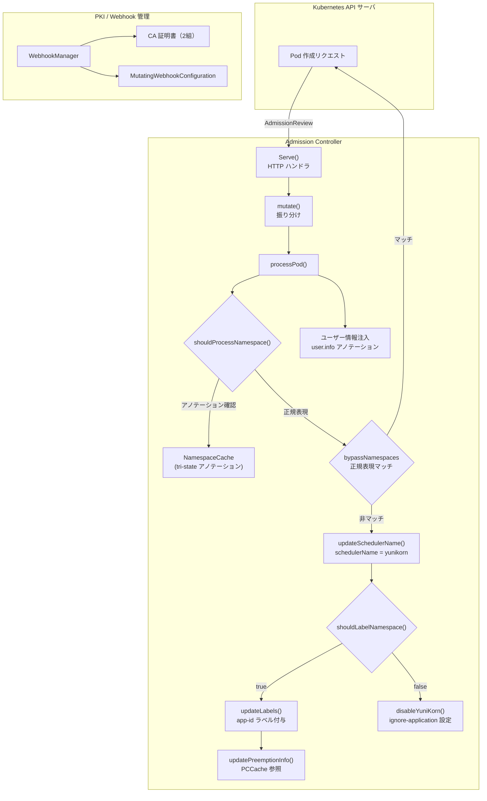

# 第7章 Admission Controller

> 本章で読むソース
>
> - [pkg/admission/admission_controller.go L65-698](https://github.com/apache/yunikorn-k8shim/blob/v1.8.0/pkg/admission/admission_controller.go#L65-L698)
> - [pkg/admission/webhook_manager.go L57-69](https://github.com/apache/yunikorn-k8shim/blob/v1.8.0/pkg/admission/webhook_manager.go#L57-L69)
> - [pkg/admission/conf/am_conf.go L85-107](https://github.com/apache/yunikorn-k8shim/blob/v1.8.0/pkg/admission/conf/am_conf.go#L85-L107)
> - [pkg/admission/conf/am_conf.go L65-83](https://github.com/apache/yunikorn-k8shim/blob/v1.8.0/pkg/admission/conf/am_conf.go#L65-L83)
> - [pkg/admission/metadata/extract.go L40-57](https://github.com/apache/yunikorn-k8shim/blob/v1.8.0/pkg/admission/metadata/extract.go#L40-L57)
> - [pkg/admission/metadata/usergroup.go L35-159](https://github.com/apache/yunikorn-k8shim/blob/v1.8.0/pkg/admission/metadata/usergroup.go#L35-L159)
> - [pkg/admission/namespace_cache.go L33-176](https://github.com/apache/yunikorn-k8shim/blob/v1.8.0/pkg/admission/namespace_cache.go#L33-L176)
> - [pkg/admission/priority_class_cache.go L34-134](https://github.com/apache/yunikorn-k8shim/blob/v1.8.0/pkg/admission/priority_class_cache.go#L34-L134)
> - [pkg/admission/pki/certs.go L39-206](https://github.com/apache/yunikorn-k8shim/blob/v1.8.0/pkg/admission/pki/certs.go#L39-L206)

## この章の狙い

本章では YuniKorn の Admission Controller が Kubernetes の MutatingWebhookConfiguration としてどのように動作するかを整理する。
とくに `schedulerName` の書き換えが Pod のスケジューリング先を YuniKorn に切り替える仕組みの中心である。
`bypassNamespaces` による名前空間の除外、メタデータ抽出、Namespace キャッシュ、PriorityClass キャッシュ、PKI 管理を順に読む。

## 前提

読者は Kubernetes の Admission Webhook（Mutating と Validating）の仕組みを理解していることを想定する。
API サーバがリソースの作成や更新を受け付けたときに Webhook を呼び出し、レスポンスの JSON Patch でオブジェクトを変更できる仕組みである。
第6章で読んだ `KubeClient` と Informer は、Admission Controller が処理した結果の Pod を受け取る側になる。

## AdmissionController の構造

`AdmissionController` は HTTP サーバとして動作し、Kubernetes API サーバからの `AdmissionReview` リクエストを受け付ける。

[pkg/admission/admission_controller.go L65-71](https://github.com/apache/yunikorn-k8shim/blob/v1.8.0/pkg/admission/admission_controller.go#L65-L71)

```go
type AdmissionController struct {
    conf              *conf.AdmissionControllerConf
    pcCache           *PriorityClassCache
    nsCache           *NamespaceCache
    annotationHandler *metadata.UserGroupAnnotationHandler
    labelExtractor    metadata.LabelExtractor
}
```

`conf` は Admission Controller 固有の設定を保持する。
`pcCache` は PriorityClass のプリエンプション設定をキャッシュする。
`nsCache` は名前空間に設定されたアノテーションをキャッシュする。
`annotationHandler` はユーザー情報のアノテーションを処理する。
`labelExtractor` はワークロードからラベルを抽出する。

### HTTP ハンドラ

`Serve` メソッドは HTTP リクエストをさばき、URL パスに応じて mutation と validation を振り分ける。

[pkg/admission/admission_controller.go L631-698](https://github.com/apache/yunikorn-k8shim/blob/v1.8.0/pkg/admission/admission_controller.go#L631-L698)

```go
func (c *AdmissionController) Serve(w http.ResponseWriter, r *http.Request) {
    // ... (前処理) ...
    urlPath := r.URL.Path
    if urlPath != mutateURL && urlPath != validateConfURL {
        log.Log(log.Admission).Debug("unsupported request received", zap.String("urlPath", urlPath))
        http.Error(w, "request is neither mutation nor validation", http.StatusNotFound)
        return
    }
    // ... (中略) ...
    switch urlPath {
    case mutateURL:
        admissionResponse = c.mutate(req)
    case validateConfURL:
        admissionResponse = c.validateConf(req)
    }
    // ... (後略)
```

`/mutate` は Pod やワークロードのミューテーションを処理する。
`/validate-conf` は ConfigMap のバリデーションを処理する。

## schedulerName の書き換え

Admission Controller の最も重要な役割は、Pod の `spec.schedulerName` を YuniKorn に書き換えることである。
Kubernetes のデフォルトのスケジューラ名は `default-scheduler` である。
Pod の `schedulerName` が `yunikorn` に設定されると、Kubernetes のデフォルトスケジューラはこの Pod をスキップし、YuniKorn がスケジューリングを担当する。

`updateSchedulerName` 関数は JSON Patch を生成して `schedulerName` を書き換える。

[pkg/admission/admission_controller.go L370-377](https://github.com/apache/yunikorn-k8shim/blob/v1.8.0/pkg/admission/admission_controller.go#L370-L377)

```go
func updateSchedulerName(patch []common.PatchOperation) []common.PatchOperation {
    log.Log(log.Admission).Info("updating scheduler name")
    return append(patch, common.PatchOperation{
        Op:    "add",
        Path:  "/spec/schedulerName",
        Value: constants.SchedulerName,
    })
}
```

`constants.SchedulerName` は `"yunikorn"` である。

[pkg/common/constants/constants.go L69](https://github.com/apache/yunikorn-k8shim/blob/v1.8.0/pkg/common/constants/constants.go#L69)

```go
const SchedulerName = "yunikorn"
```

この JSON Patch が API サーバに適用されると、Pod の `spec.schedulerName` が `"yunikorn"` に変更される。
結果として、この Pod は YuniKorn のスケジューリング対象になる。

### Spark ユーザー視点での重要性

Spark on K8s で `spark.kubernetes.scheduler.name` を `yunikorn` に設定した場合、Spark が作成する Pod は最初から `schedulerName` が `yunikorn` になっている。
Admission Controller は `schedulerName` を上書きするため、設定が重複しても問題ない。
一方、`schedulerName` を設定しない場合、Admission Controller が自動的に `yunikorn` に書き換える。
Spark ユーザーは Admission Controller の設定だけで YuniKorn を使える。

## bypassNamespaces と名前空間のフィルタリング

すべての名前空間の Pod が YuniKorn でスケジューリングされるわけではない。
`bypassNamespaces` は正規表現のリストで、マッチする名前空間の Pod をスキップする。

### デフォルト値

[pkg/admission/conf/am_conf.go L72](https://github.com/apache/yunikorn-k8shim/blob/v1.8.0/pkg/admission/conf/am_conf.go#L72)

```go
    DefaultFilteringBypassNamespaces     = "^kube-system$"
```

デフォルトでは `kube-system` 名前空間だけが bypass される。
`kube-system` には Kubernetes のシステムコンポーネント（kube-apiserver、kube-controller-manager など）が動作している。
これらを YuniKorn でスケジューリングすると、クラスタのブートストラップに支障が出る可能性がある。

### 判定ロジック

`shouldProcessNamespace` は名前空間を処理すべきかを判定する。

[pkg/admission/admission_controller.go L539-545](https://github.com/apache/yunikorn-k8shim/blob/v1.8.0/pkg/admission/admission_controller.go#L539-L545)

```go
func (c *AdmissionController) shouldProcessNamespace(namespace string) bool {
    process := c.nsCache.enableYuniKorn(namespace)
    if process != UNSET {
        return process == TRUE
    }
    return c.namespaceMatchesProcessList(namespace) && !c.namespaceMatchesBypassList(namespace)
}
```

判定は2段階で行われる。

1. Namespace キャッシュにアノテーション `yunikorn.apache.org/namespace.enableYuniKorn` が設定されていれば、その値を優先する。
2. アノテーションが未設定（`UNSET`）の場合は、`processNamespaces` と `bypassNamespaces` の正規表現で判定する。

`namespaceMatchesBypassList` は bypass 正規表現のリストにマッチするかを確認する。

[pkg/admission/admission_controller.go L501-509](https://github.com/apache/yunikorn-k8shim/blob/v1.8.0/pkg/admission/admission_controller.go#L501-L509)

```go
func (c *AdmissionController) namespaceMatchesBypassList(namespace string) bool {
    bypassNamespaces := c.conf.GetBypassNamespaces()
    for _, re := range bypassNamespaces {
        if re.MatchString(namespace) {
            return true
        }
    }
    return false
}
```

`processNamespaces` は空の場合「すべて許可」として扱われる。
`bypassNamespaces` にマッチすれば、`processNamespaces` にマッチしていてもスキップされる。

### processPod での処理順序

`processPod` は Pod の mutation 処理全体を制御する。

[pkg/admission/admission_controller.go L157-218](https://github.com/apache/yunikorn-k8shim/blob/v1.8.0/pkg/admission/admission_controller.go#L157-L218)

```go
func (c *AdmissionController) processPod(req *admissionv1.AdmissionRequest, namespace string) *admissionv1.AdmissionResponse {
    var patch []common.PatchOperation
    var uid = string(req.UID)

    var pod v1.Pod
    if err := json.Unmarshal(req.Object.Raw, &pod); err != nil {
        log.Log(log.Admission).Error("unmarshal failed", zap.Error(err))
        return admissionResponseBuilder(uid, false, err.Error(), nil)
    }

    // ... (ユーザー情報の処理) ...

    if labelAppValue := utils.GetPodLabelValue(&pod, constants.LabelApp); labelAppValue != "" {
        if labelAppValue == yunikornPod {
            log.Log(log.Admission).Info("ignore yunikorn pod")
            return admissionResponseBuilder(uid, true, "", nil)
        }
    }

    if !c.shouldProcessNamespace(namespace) {
        log.Log(log.Admission).Info("bypassing namespace", zap.String("namespace", namespace))
        return admissionResponseBuilder(uid, true, "", nil)
    }
    patch = updateSchedulerName(patch)

    if c.shouldLabelNamespace(namespace) {
        patch = c.updateLabels(namespace, &pod, patch)
        patch = c.updatePreemptionInfo(&pod, patch)
    } else {
        patch = disableYuniKorn(namespace, &pod, patch)
    }
    // ... (後略)
```

処理順序は次のとおりである。

1. Pod をデシリアライズする。
2. ユーザー情報のアノテーションを検証する。
3. `app: yunikorn` ラベルの Pod（YuniKorn 自身の Pod）はスキップする。
4. `shouldProcessNamespace` で bypass 判定を行う。マッチしなければパッチなしで許可する。
5. `updateSchedulerName` で `schedulerName` を `yunikorn` に書き換える。
6. `shouldLabelNamespace` の結果に応じて、ラベルの付与または YuniKorn の無効化を行う。

`shouldLabelNamespace` が `false` を返す場合、`disableYuniKorn` が `yunikorn.apache.org/ignore-application: "true"` アノテーションを付与する。
このアノテーションがあると、YuniKorn は Pod を自前のアプリケーションとして管理しない。

## Namespace キャッシュ

`NamespaceCache` は名前空間のアノテーションをメモリにキャッシュする。

[pkg/admission/namespace_cache.go L33-55](https://github.com/apache/yunikorn-k8shim/blob/v1.8.0/pkg/admission/namespace_cache.go#L33-L55)

```go
type NamespaceCache struct {
    nameSpaces map[string]nsFlags

    locking.RWMutex
}

type triState int

const (
    UNSET triState = iota - 1
    FALSE
    TRUE
)

// nsFlags defines the two flags that can be set on the namespace.
// It needs to support a tri-state value showing presence besides true/false.
// UNSET: not present
// FALSE: false
// TRUE: true
type nsFlags struct {
    enableYuniKorn triState
    generateAppID  triState
}
```

`nsFlags` は2つの `triState` を保持する。
`enableYuniKorn` は名前空間で YuniKorn を有効にするかを示す。
`generateAppID` はアプリケーション ID を自動生成するかを示す。
`triState` は3値（`UNSET`、`FALSE`、`TRUE`）をとり、アノテーションが存在しない状態と明示的に `false` を設定した状態を区別する。

`enableYuniKorn` メソッドはキャッシュから値を取得する。

[pkg/admission/namespace_cache.go L72-81](https://github.com/apache/yunikorn-k8shim/blob/v1.8.0/pkg/admission/namespace_cache.go#L72-L81)

```go
func (nsc *NamespaceCache) enableYuniKorn(name string) triState {
    nsc.RLock()
    defer nsc.RUnlock()

    flag, ok := nsc.nameSpaces[name]
    if !ok {
        return UNSET
    }
    return flag.enableYuniKorn
}
```

キャッシュは Namespace Informer のイベントハンドラで更新される。

[pkg/admission/namespace_cache.go L112-148](https://github.com/apache/yunikorn-k8shim/blob/v1.8.0/pkg/admission/namespace_cache.go#L112-L148)

```go
func (h *namespaceUpdateHandler) OnAdd(obj interface{}, _ bool) {
    ns := convert2Namespace(obj)
    if ns == nil {
        return
    }

    newFlags := getAnnotationValues(ns)
    h.cache.Lock()
    defer h.cache.Unlock()
    h.cache.nameSpaces[ns.Name] = newFlags
}

func (h *namespaceUpdateHandler) OnUpdate(_, newObj interface{}) {
    h.OnAdd(newObj, false)
}

func (h *namespaceUpdateHandler) OnDelete(obj interface{}) {
    var ns *v1.Namespace
    switch t := obj.(type) {
    case *v1.Namespace:
        ns = t
    case cache.DeletedFinalStateUnknown:
        ns = convert2Namespace(obj)
    default:
        log.Log(log.Admission).Warn("unable to convert to Namespace")
        return
    }
    if ns == nil {
        return
    }

    h.cache.Lock()
    defer h.cache.Unlock()
    delete(h.cache.nameSpaces, ns.Name)
}
```

Namespace の作成、更新、削除に追従してキャッシュを同期する。
アノテーションの値だけを抽出して保持するため、メモリ使用量は最小限である。

## PriorityClass キャッシュ

`PriorityClassCache` は PriorityClass のプリエンプション設定をキャッシュする。

[pkg/admission/priority_class_cache.go L34-64](https://github.com/apache/yunikorn-k8shim/blob/v1.8.0/pkg/admission/priority_class_cache.go#L34-L64)

```go
type PriorityClassCache struct {
    priorityClasses map[string]bool

    locking.RWMutex
}

// ... (中略) ...

func (pcc *PriorityClassCache) isPreemptSelfAllowed(priorityClassName string) bool {
    pcc.RLock()
    defer pcc.RUnlock()

    value, ok := pcc.priorityClasses[priorityClassName]
    if !ok {
        return true
    }
    return value
}
```

PriorityClass にアノテーション `yunikorn.apache.org/allow-preemption` が `false` で設定されている場合、その PriorityClass を持つ Pod は自己プリエンプションを許可しない。
キャッシュにエントリがない場合はデフォルトで `true`（プリエンプション許可）を返す。

`updatePreemptionInfo` は Pod のプリエンプションアノテーションを設定する。

[pkg/admission/admission_controller.go L379-417](https://github.com/apache/yunikorn-k8shim/blob/v1.8.0/pkg/admission/admission_controller.go#L379-L417)

```go
func (c *AdmissionController) updatePreemptionInfo(pod *v1.Pod, patch []common.PatchOperation) []common.PatchOperation {
    value := utils.GetPodAnnotationValue(pod, constants.AnnotationAllowPreemption)

    // return if already set to a valid value
    switch value {
    case constants.True:
        return patch
    case constants.False:
        return patch
    }

    value = constants.False
    if c.pcCache.isPreemptSelfAllowed(pod.Spec.PriorityClassName) {
        value = constants.True
    }
    // ... (後略)
```

Pod にすでに有効な値が設定されていればそのままにする。
未設定の場合、PriorityClass キャッシュを参照してデフォルト値を決定する。

## メタデータ抽出

Admission Controller は Pod だけでなく、Deployment、StatefulSet、ReplicaSet、DaemonSet、Job、CronJob にも対応する。
`extractors` マップはリソース種別ごとにアノテーションとラベルの抽出関数を登録する。

[pkg/admission/metadata/extract.go L40-57](https://github.com/apache/yunikorn-k8shim/blob/v1.8.0/pkg/admission/metadata/extract.go#L40-L57)

```go
var (
    Deployment  = reflect.TypeOf(appsv1.Deployment{}).Name()
    DaemonSet   = reflect.TypeOf(appsv1.DaemonSet{}).Name()
    StatefulSet = reflect.TypeOf(appsv1.StatefulSet{}).Name()
    ReplicaSet  = reflect.TypeOf(appsv1.ReplicaSet{}).Name()
    Job         = reflect.TypeOf(batchv1.Job{}).Name()
    CronJob     = reflect.TypeOf(batchv1Beta.CronJob{}).Name()
    Pod         = reflect.TypeOf(corev1.Pod{}).Name()

    extractors = map[string]extractor{
        Deployment:  fromDeployment,
        DaemonSet:   fromDaemonSet,
        StatefulSet: fromStatefulSet,
        ReplicaSet:  fromReplicaSet,
        Job:         fromJob,
        CronJob:     fromCronJob,
    }
)
```

各抽出関数はワークロードの `Spec.Template` からアノテーションとラベルを取り出す。
CronJob だけは `Spec.JobTemplate.Spec.Template` を参照するため、パスが異なる。

[pkg/admission/metadata/extract.go L129-141](https://github.com/apache/yunikorn-k8shim/blob/v1.8.0/pkg/admission/metadata/extract.go#L129-L141)

```go
func fromCronJob(req *admissionv1.AdmissionRequest) (*extractResult, error) {
    var cronJob batchv1Beta.CronJob
    err := json.Unmarshal(req.Object.Raw, &cronJob)
    if err != nil {
        return nil, err
    }

    return &extractResult{
        annotations: cronJob.Spec.JobTemplate.Spec.Template.Annotations,
        labels:      cronJob.Spec.JobTemplate.Spec.Template.Labels,
        path:        cronJobPodAnnotationsPath,
    }, nil
}
```

この抽出結果は JSON Patch のパスとして使われる。
Pod の場合は `/metadata/annotations`、ワークロードの場合は `/spec/template/metadata/annotations` になる。

## ユーザー情報の注入

`UserGroupAnnotationHandler` は Kubernetes API サーバから受け取ったユーザー情報を Pod のアノテーションに注入する。

[pkg/admission/metadata/usergroup.go L137-159](https://github.com/apache/yunikorn-k8shim/blob/v1.8.0/pkg/admission/metadata/usergroup.go#L137-L159)

```go
func (u *UserGroupAnnotationHandler) getPatchOperation(annotations map[string]string, path, user string, groups []string) (*common.PatchOperation, error) {
    newAnnotations := make(map[string]string)
    for k, v := range annotations {
        newAnnotations[k] = v
    }

    userGroups := &si.UserGroupInformation{
        User:   user,
        Groups: groups,
    }
    jsonBytes, err := json.Marshal(userGroups)
    if err != nil {
        return nil, err
    }

    newAnnotations[common.UserInfoAnnotation] = string(jsonBytes)

    return &common.PatchOperation{
        Op:    "add",
        Path:  path,
        Value: newAnnotations,
    }, nil
}
```

`AdmissionRequest` の `UserInfo` からユーザー名とグループを取得し、JSON にシリアライズして `yunikorn.apache.org/user.info` アノテーションに設定する。
この情報をもとに、YuniKorn core はキューのユーザーグループ制限（第10章で扱う）を適用する。

`IsAnnotationAllowed` は、既存のアノテーションを上書きできる権限があるかを判定する。

[pkg/admission/metadata/usergroup.go L50-81](https://github.com/apache/yunikorn-k8shim/blob/v1.8.0/pkg/admission/metadata/usergroup.go#L50-L81)

```go
func (u *UserGroupAnnotationHandler) IsAnnotationAllowed(userName string, groups []string) bool {
    if u.conf.GetTrustControllers() {
        for _, sysUser := range u.conf.GetSystemUsers() {
            if sysUser.MatchString(userName) {
                log.Log(log.Admission).Debug("Request submitted from a system user, bypassing",
                    zap.String("userName", userName))
                return true
            }
        }
    }

    for _, allowedUser := range u.conf.GetExternalUsers() {
        if allowedUser.MatchString(userName) {
            log.Log(log.Admission).Debug("Request submitted from an allowed external user",
                zap.String("userName", userName))
            return true
        }
    }

    for _, allowedGroup := range u.conf.GetExternalGroups() {
        for _, group := range groups {
            if allowedGroup.MatchString(group) {
                log.Log(log.Admission).Debug("Request submitted from an allowed external group",
                    zap.String("userName", userName),
                    zap.String("group", group))
                return true
            }
        }
    }

    return false
}
```

`trustControllers` が有効な場合、`systemUsers` の正規表現にマッチするユーザー（デフォルトでは `^system:serviceaccount:kube-system:`）はアノテーションの上書きを許可される。
これにより、Kubernetes のコントローラマネージャが作成する ReplicaSet などのユーザー情報を正しく設定できる。

## Webhook 登録と PKI 管理

`WebhookManager` は MutatingWebhookConfiguration と ValidatingWebhookConfiguration の登録、TLS 証明書の管理を担う。

[pkg/admission/webhook_manager.go L57-69](https://github.com/apache/yunikorn-k8shim/blob/v1.8.0/pkg/admission/webhook_manager.go#L57-L69)

```go
type WebhookManager interface {
    // LoadCACertificates is used to load CA certs from K8s secrets and update if needed
    LoadCACertificates() error

    // InstallWebhooks is used to install or update webhooks
    InstallWebhooks() error

    // GenerateServerCertificate is used to generate a server certificate chain
    GenerateServerCertificate() (*tls.Certificate, error)

    // WaitForCertificateExpiration blocks until certificates need to be renewed
    WaitForCertificateExpiration() error
}
```

### 二重 CA 証明書によるローテーション

`webhookManagerImpl` は2組の CA 証明書（`caCert1` と `caCert2`）を保持する。

[pkg/admission/webhook_manager.go L71-85](https://github.com/apache/yunikorn-k8shim/blob/v1.8.0/pkg/admission/webhook_manager.go#L71-L85)

```go
type webhookManagerImpl struct {
    conf             *conf.AdmissionControllerConf
    serviceName      string
    clientset        kubernetes.Interface
    conflictAttempts int

    // mutable values (require locking)
    caCert1    *x509.Certificate
    caKey1     *rsa.PrivateKey
    caCert2    *x509.Certificate
    caKey2     *rsa.PrivateKey
    expiration time.Time

    locking.RWMutex
}
```

2組の CA 証明書は有効期限を6ヶ月ずけて生成される。

[pkg/admission/webhook_manager.go L686-709](https://github.com/apache/yunikorn-k8shim/blob/v1.8.0/pkg/admission/webhook_manager.go#L686-L709)

```go
    if cert1 == nil {
        log.Log(log.AdmissionWebhook).Info("Generating CA Certificate #1...")
        notAfter := time.Now().AddDate(1, 0, 0)
        if cert2 == nil {
            // stagger expiration dates so that there is ~ 6 months between them
            notAfter = notAfter.AddDate(0, -6, 0)
        }
        cert1, key1, err = pki.GenerateCACertificate(notAfter)
        // ... (後略) ...
    }

    if cert2 == nil {
        log.Log(log.AdmissionWebhook).Info("Generating CA Certificate #2...")
        cert2, key2, err = pki.GenerateCACertificate(time.Now().AddDate(1, 0, 0))
        // ... (後略) ...
    }
```

`getBestCACertificate` は有効期限がより遠い CA を選んでサーバー証明書を署名する。

[pkg/admission/webhook_manager.go L644-656](https://github.com/apache/yunikorn-k8shim/blob/v1.8.0/pkg/admission/webhook_manager.go#L644-L656)

```go
func (wm *webhookManagerImpl) getBestCACertificate() (*x509.Certificate, *rsa.PrivateKey, error) {
    wm.RLock()
    defer wm.RUnlock()

    if wm.caCert1 == nil || wm.caCert2 == nil {
        return nil, nil, errors.New("webhook: CA certificates are not yet initialized")
    }

    if wm.caCert2.NotAfter.After(wm.caCert1.NotAfter) {
        return wm.caCert2, wm.caKey2, nil
    }
    return wm.caCert1, wm.caKey1, nil
}
```

90日以内に期限が切れる証明書は再生成される。

[pkg/admission/webhook_manager.go L793-798](https://github.com/apache/yunikorn-k8shim/blob/v1.8.0/pkg/admission/webhook_manager.go#L793-L798)

```go
    cutoff := time.Now().AddDate(0, 0, 90)

    if cert.NotAfter.Before(cutoff) {
        return nil, nil, fmt.Errorf("webhook: ca certificate %s will expire within 90 days", certName)
    }
```

このローテーション機構により、証明書の期限切れによる Webhook の停止を防ぐ。

### MutatingWebhookConfiguration の登録

`populateMutatingWebhook` は MutatingWebhookConfiguration の内容を設定する。

[pkg/admission/webhook_manager.go L614-641](https://github.com/apache/yunikorn-k8shim/blob/v1.8.0/pkg/admission/webhook_manager.go#L614-L641)

```go
func (wm *webhookManagerImpl) populateMutatingWebhook(webhook *v1.MutatingWebhookConfiguration, caBundle []byte) {
    ignore := v1.Ignore
    none := v1.SideEffectClassNone
    path := "/mutate"

    namespace := wm.conf.GetNamespace()
    serviceName := wm.conf.GetAmServiceName()

    webhook.Name = mutatingWebhook
    webhook.Labels = map[string]string{"app": "yunikorn"}
    webhook.Webhooks = []v1.MutatingWebhook{
        {
            Name: mutatePodsWebhook,
            ClientConfig: v1.WebhookClientConfig{
                Service:  &v1.ServiceReference{Name: serviceName, Namespace: namespace, Path: &path},
                CABundle: caBundle,
            },
            Rules: []v1.RuleWithOperations{{
                Operations: []v1.OperationType{v1.Create, v1.Update},
                Rule: v1.Rule{APIGroups: []string{"", "apps", "batch"}, APIVersions: []string{"v1"}, Resources: []string{
                    "pods", "deployments", "replicasets", "statefulsets", "daemonsets", "jobs", "cronjobs"}},
            }},
            FailurePolicy:           &ignore,
            AdmissionReviewVersions: []string{"v1"},
            SideEffects:             &none,
        },
    }
}
```

`FailurePolicy` は `Ignore` に設定されている。
Admission Controller が応答できない場合でも、Pod の作成は拒否されない。
これは安全性のための設計判断である。
監視対象リソースは Pod、Deployment、ReplicaSet、StatefulSet、DaemonSet、Job、CronJob の7種類である。

## Admission Controller の処理フロー

本章で読んだ処理全体をまとめる。



## 設定のホットリロード

`AdmissionControllerConf` は ConfigMap Informer のイベントハンドラを登録し、設定変更をリアルタイムに反映する。

[pkg/admission/conf/am_conf.go L289-330](https://github.com/apache/yunikorn-k8shim/blob/v1.8.0/pkg/admission/conf/am_conf.go#L289-L330)

```go
func (acc *AdmissionControllerConf) updateConfigMaps(configMaps []*v1.ConfigMap, initial bool) {
    acc.lock.Lock()
    defer acc.lock.Unlock()

    // check for enable config hot refresh
    if !initial && !acc.enableConfigHotRefresh {
        log.Log(log.AdmissionConf).Warn("Config hot-refresh is disabled, ignoring configuration update")
        return
    }

    acc.configMaps = configMaps
    configs := schedulerconf.FlattenConfigMaps(configMaps)

    // ... (中略) ...

    // filtering
    acc.processNamespaces = parseConfigRegexps(configs, AMFilteringProcessNamespaces, DefaultFilteringProcessNamespaces)
    acc.bypassNamespaces = parseConfigRegexps(configs, AMFilteringBypassNamespaces, DefaultFilteringBypassNamespaces)
    acc.labelNamespaces = parseConfigRegexps(configs, AMFilteringLabelNamespaces, DefaultFilteringLabelNamespaces)
    acc.noLabelNamespaces = parseConfigRegexps(configs, AMFilteringNoLabelNamespaces, DefaultFilteringNoLabelNamespaces)
    // ... (後略)
```

`enableConfigHotRefresh` が有効な場合、ConfigMap の変更は即座に `bypassNamespaces` や `processNamespaces` の正規表現リストに反映される。
正規表現のコンパイルは設定変更時だけ発生し、リクエストごとのマッチングはコンパイル済みの `regexp.Regexp` を使う。
この遅延コンパイルにより、Admission Controller のリクエスト処理パスで正規表現のコンパイルコストが発生しない。

## まとめ

本章では YuniKorn の Admission Controller の仕組みを読んだ。
`AdmissionController` は MutatingWebhookConfiguration として動作し、Pod の `schedulerName` を `yunikorn` に書き換えることでスケジューリング先を切り替える。
`bypassNamespaces` は正規表現で名前空間を除外し、デフォルトでは `kube-system` をスキップする。
Namespace キャッシュは tri-state でアノテーションを管理し、正規表現マッチングより高速な判定パスを提供する。
PriorityClass キャッシュはプリエンプションの可否を保持する。
`WebhookManager` は2組の CA 証明書でローテーションを実現し、証明書の期限切れによる停止を防ぐ。
設定のホットリロードにより、正規表現リストの変更を再起動なしに反映できる。

## 関連する章

- [第6章 K8s API クライアントと Informer](06-k8s-client-and-informer.md): Admission Controller が処理した Pod を受け取る Informer 層
- [第8章 Scheduler Plugin モード](08-scheduler-plugin.md): schedulerName を使わない代替の連携モード
- [第10章 設定管理](../part03-integration/10-configuration.md): ConfigMap の構造とホットリロードの詳細
