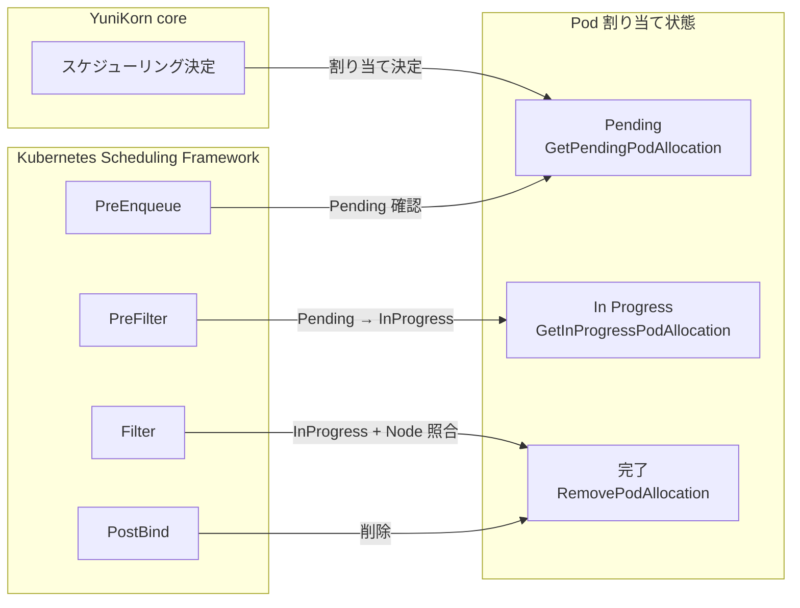

# 第8章 Scheduler Plugin モード

> 本章で読むソース
>
> - [pkg/plugin/scheduler_plugin.go L50-327](https://github.com/apache/yunikorn-k8shim/blob/v1.8.0/pkg/plugin/scheduler_plugin.go#L50-L327)
> - [pkg/plugin/predicates/predicate_manager.go L47-546](https://github.com/apache/yunikorn-k8shim/blob/v1.8.0/pkg/plugin/predicates/predicate_manager.go#L47-L546)
> - [pkg/plugin/support/framework_handle.go L39-179](https://github.com/apache/yunikorn-k8shim/blob/v1.8.0/pkg/plugin/support/framework_handle.go#L39-L179)
> - [pkg/plugin/support/shared_lister.go L27-47](https://github.com/apache/yunikorn-k8shim/blob/v1.8.0/pkg/plugin/support/shared_lister.go#L27-L47)

## この章の狙い

本章では YuniKorn が Kubernetes Scheduling Framework のプラグインとして動作するモードを整理する。
`YuniKornSchedulerPlugin` が実装する拡張ポイント（`PreEnqueue`、`PreFilter`、`Filter`、`PostBind`）と、`PredicateManager` が Kubernetes 組み込みのフィルタプラグインを再利用する仕組みを読む。
第7章で読んだ Admission Controller モードとの違いを明確にする。

## 前提

読者は Kubernetes の Scheduling Framework の拡張ポイントを理解していることを想定する。
`PreEnqueue`、`PreFilter`、`Filter`、`Reserve`、`PostBind` といったフックが、スケジューリングサイクルのどのタイミングで呼ばれるかを知っている必要がある。
また第3章から第5章で読んだ `Context`、アプリケーション状態機械、タスク状態管理が、Pod の割り当て状態を管理する基盤である。

## Scheduler Plugin モードの位置づけ

YuniKorn k8shim には2つの動作モードがある。

1. **shim モード**（デフォルト）: `schedulerName` を `yunikorn` に設定し、Kubernetes のデフォルトスケジューラを完全にバイパスして YuniKorn 自身が Pod をバインドする。第7章の Admission Controller がこのモードを有効にする。
2. **plugin モード**: Kubernetes Scheduling Framework のプラグインとして組み込まれ、デフォルトスケジューラのスケジューリングサイクルにフックを挿入する。

plugin モードでは YuniKorn core がバックグラウンドで常にスケジューリング判断を行い、デフォルトスケジューラに対して「この Pod はこの Node に割り当て可能」という合図を送る。
デフォルトスケジューラは通常のスケジューリングサイクルを回しながら、YuniKorn プラグインの指示に従って Pod をバインドする。

## YuniKornSchedulerPlugin の構造

`YuniKornSchedulerPlugin` は Kubernetes Scheduling Framework の複数のインターフェースを実装する。

[pkg/plugin/scheduler_plugin.go L73-83](https://github.com/apache/yunikorn-k8shim/blob/v1.8.0/pkg/plugin/scheduler_plugin.go#L73-L83)

```go
type YuniKornSchedulerPlugin struct {
    locking.RWMutex
    context *cache.Context
}

// ensure all required interfaces are implemented
var _ framework.PreEnqueuePlugin = &YuniKornSchedulerPlugin{}
var _ framework.PreFilterPlugin = &YuniKornSchedulerPlugin{}
var _ framework.FilterPlugin = &YuniKornSchedulerPlugin{}
var _ framework.PostBindPlugin = &YuniKornSchedulerPlugin{}
var _ framework.EnqueueExtensions = &YuniKornSchedulerPlugin{}
```

`PreEnqueuePlugin`、`PreFilterPlugin`、`FilterPlugin`、`PostBindPlugin`、`EnqueueExtensions` の5つを実装する。
`context` は第3章で読んだ `cache.Context` であり、アプリケーションとタスクの状態を管理する。

## 割り当て状態のライフサイクル

plugin モードの核心は、YuniKorn core の割り当て決定とデフォルトスケジューラのスケジューリングサイクルを同期する仕組みにある。
Pod の割り当ては3つの状態を遷移する。

1. **Pending**: YuniKorn core が Pod を Node に割り当てたが、デフォルトスケジューラにはまだ通知していない。
2. **In Progress**: `PreFilter` でデフォルトスケジューラに通知したが、まだバインドが完了していない。
3. **完了**: `PostBind` でバインドが完了し、割り当て情報が削除される。



## PreEnqueue

`PreEnqueue` は Pod が `activeQ` に追加される前に呼ばれる。

[pkg/plugin/scheduler_plugin.go L91-139](https://github.com/apache/yunikorn-k8shim/blob/v1.8.0/pkg/plugin/scheduler_plugin.go#L91-L139)

```go
func (sp *YuniKornSchedulerPlugin) PreEnqueue(_ context.Context, pod *v1.Pod) *fwk.Status {
    log.Log(log.ShimSchedulerPlugin).Debug("PreEnqueue check",
        zap.String("namespace", pod.Namespace),
        zap.String("pod", pod.Name))

    // we don't process pods without appID defined
    appID := utils.GetApplicationIDFromPod(pod)
    if appID == "" {
        log.Log(log.ShimSchedulerPlugin).Debug("Releasing non-managed Pod for scheduling (PreEnqueue phase)",
            zap.String("namespace", pod.Namespace),
            zap.String("pod", pod.Name))
        return nil
    }

    taskID := string(pod.UID)
    if app, task, ok := sp.getTask(appID, taskID); ok {
        if _, ok := sp.context.GetInProgressPodAllocation(taskID); ok {
            // pod must have failed scheduling in a prior run, reject it and return unschedulable
            sp.failTask(pod, app, task)
            return fwk.NewStatus(fwk.UnschedulableAndUnresolvable, "Pod is not ready for scheduling")
        }

        nodeID, ok := sp.context.GetPendingPodAllocation(taskID)
        if task.GetTaskState() == cache.TaskStates().Bound && ok {
            log.Log(log.ShimSchedulerPlugin).Info("Releasing pod for scheduling (PreEnqueue phase)",
                zap.String("namespace", pod.Namespace),
                zap.String("pod", pod.Name),
                zap.String("taskID", taskID),
                zap.String("assignedNode", nodeID))
            return nil
        }

        schedState := task.GetTaskSchedulingState()
        switch schedState {
        case cache.TaskSchedPending:
            return fwk.NewStatus(fwk.UnschedulableAndUnresolvable, "Pod is pending scheduling")
        case cache.TaskSchedFailed:
            // allow the pod to proceed so that it will be marked unschedulable by PreFilter
            return nil
        case cache.TaskSchedSkipped:
            return fwk.NewStatus(fwk.UnschedulableAndUnresolvable, "Pod doesn't fit within queue")
        default:
            return fwk.NewStatus(fwk.UnschedulableAndUnresolvable, fmt.Sprintf("Pod unschedulable: %s", schedState.String()))
        }
    }

    // task not found (yet?) -- probably means cache update hasn't come through yet
    return fwk.NewStatus(fwk.UnschedulableAndUnresolvable, "Pod not ready for scheduling")
}
```

`appID` が空の Pod（YuniKorn の管理外）はそのまま通過させる。
YuniKorn 管理の Pod は、タスクの状態に応じて `activeQ` への追加を制御する。
`InProgress` の割り当てが存在する場合、以前のスケジューリングが失敗したことを意味するため、タスクを reject して `UnschedulableAndUnresolvable` を返す。
`Pending` の割り当てがあり、かつタスクが `Bound` 状態であれば、`activeQ` への追加を許可する。

## PreFilter

`PreFilter` はスケジューリングサイクルの開始時に呼ばれる。

[pkg/plugin/scheduler_plugin.go L142-177](https://github.com/apache/yunikorn-k8shim/blob/v1.8.0/pkg/plugin/scheduler_plugin.go#L142-L177)

```go
func (sp *YuniKornSchedulerPlugin) PreFilter(_ context.Context, _ fwk.CycleState, pod *v1.Pod, _ []fwk.NodeInfo) (*framework.PreFilterResult, *fwk.Status) {
    // ... (前処理) ...

    taskID := string(pod.UID)
    if app, task, ok := sp.getTask(appID, taskID); ok {
        if _, ok := sp.context.GetInProgressPodAllocation(taskID); ok {
            // pod must have failed scheduling, reject it and return unschedulable
            sp.failTask(pod, app, task)
            return nil, fwk.NewStatus(fwk.UnschedulableAndUnresolvable, "Pod is not ready for scheduling")
        }

        nodeID, ok := sp.context.GetPendingPodAllocation(taskID)
        if task.GetTaskState() == cache.TaskStates().Bound && ok {
            log.Log(log.ShimSchedulerPlugin).Info("Releasing pod for scheduling (PreFilter phase)",
                zap.String("namespace", pod.Namespace),
                zap.String("pod", pod.Name),
                zap.String("taskID", taskID),
                zap.String("assignedNode", nodeID))
            return &framework.PreFilterResult{NodeNames: sets.New[string](nodeID)}, nil
        }
    }

    return nil, fwk.NewStatus(fwk.UnschedulableAndUnresolvable, "Pod is not ready for scheduling")
}
```

`PreFilter` の重要な点は `PreFilterResult` で候補 Node を `nodeID` に限定することである。
`sets.New[string](nodeID)` を返すことで、デフォルトスケジューラはこの Node だけを `Filter` に渡す。
これにより、YuniKorn core が決定した Node 以外へのバインドを防ぐ。

## Filter

`Filter` は Pod と Node の組み合わせごとに呼ばれる。

[pkg/plugin/scheduler_plugin.go L185-219](https://github.com/apache/yunikorn-k8shim/blob/v1.8.0/pkg/plugin/scheduler_plugin.go#L185-L219)

```go
func (sp *YuniKornSchedulerPlugin) Filter(_ context.Context, _ fwk.CycleState, pod *v1.Pod, nodeInfo fwk.NodeInfo) *fwk.Status {
    log.Log(log.ShimSchedulerPlugin).Debug("Filter check",
        zap.String("namespace", pod.Namespace),
        zap.String("pod", pod.Name),
        zap.String("node", nodeInfo.Node().Name))

    // we don't process pods without appID defined
    appID := utils.GetApplicationIDFromPod(pod)
    if appID == "" {
        log.Log(log.ShimSchedulerPlugin).Debug("Releasing non-managed Pod fo scheduling (Filter phase)",
            zap.String("namespace", pod.Namespace),
            zap.String("pod", pod.Name))
        return nil
    }

    taskID := string(pod.UID)
    if _, task, ok := sp.getTask(appID, taskID); ok {
        if task.GetTaskState() == cache.TaskStates().Bound {
            // attempt to start a pod allocation. Filter() gets called once per {Pod,Node} candidate; we only want
            // to proceed in the case where the Node we are asked about matches the one YuniKorn has selected.
            // this check is fairly cheap (one map lookup); if we fail the check here the scheduling framework will
            // immediately call Filter() again with a different candidate Node.
            if sp.context.StartPodAllocation(taskID, nodeInfo.Node().Name) {
                log.Log(log.ShimSchedulerPlugin).Info("Releasing pod for scheduling (Filter phase)",
                    zap.String("namespace", pod.Namespace),
                    zap.String("pod", pod.Name),
                    zap.String("taskID", taskID),
                    zap.String("assignedNode", nodeInfo.Node().Name))
                return nil
            }
        }
    }

    return fwk.NewStatus(fwk.UnschedulableAndUnresolvable, "Pod is not fit for node")
}
```

`Filter` は `{Pod, Node}` の候補ごとに呼ばれる。
`StartPodAllocation` は Pending 状態の割り当てを In Progress に遷移させる。
この呼び出しはタスク ID と Node 名が YuniKorn core の決定と一致するときだけ成功する。
コメントにあるとおり、このチェックは1回のマップ参照で済むため高速である。
一致しない場合は `UnschedulableAndUnresolvable` を返し、スケジューリングフレームワークは別の Node で再試行する。

## PostBind

`PostBind` は Pod が Node にバインドされた後に呼ばれる。

[pkg/plugin/scheduler_plugin.go L244-268](https://github.com/apache/yunikorn-k8shim/blob/v1.8.0/pkg/plugin/scheduler_plugin.go#L244-L268)

```go
func (sp *YuniKornSchedulerPlugin) PostBind(_ context.Context, _ fwk.CycleState, pod *v1.Pod, nodeName string) {
    log.Log(log.ShimSchedulerPlugin).Debug("PostBind handler",
        zap.String("namespace", pod.Namespace),
        zap.String("pod", pod.Name),
        zap.String("assignedNode", nodeName))

    // we don't process pods without appID defined
    appID := utils.GetApplicationIDFromPod(pod)
    if appID == "" {
        log.Log(log.ShimSchedulerPlugin).Debug("Non-managed Pod bound successfully",
            zap.String("namespace", pod.Namespace),
            zap.String("pod", pod.Name))
        return
    }

    taskID := string(pod.UID)
    if _, _, ok := sp.getTask(appID, taskID); ok {
        log.Log(log.ShimSchedulerPlugin).Info("Managed Pod bound successfully",
            zap.String("namespace", pod.Namespace),
            zap.String("pod", pod.Name),
            zap.String("taskID", taskID),
            zap.String("assignedNode", nodeName))
        sp.context.RemovePodAllocation(taskID)
    }
}
```

`RemovePodAllocation` で割り当て情報を削除する。
これで Pending、In Progress の状態遷移が完了する。

## プラグインの初期化

`NewSchedulerPlugin` はプラグインの初期化を行う。

[pkg/plugin/scheduler_plugin.go L271-307](https://github.com/apache/yunikorn-k8shim/blob/v1.8.0/pkg/plugin/scheduler_plugin.go#L271-L307)

```go
func NewSchedulerPlugin(_ context.Context, _ runtime.Object, handle framework.Handle) (framework.Plugin, error) {
    log.Log(log.ShimSchedulerPlugin).Info(conf.GetBuildInfoString())
    log.Log(log.ShimSchedulerPlugin).Warn("The plugin mode has been deprecated and will be removed in a future release. Consider migrating to YuniKorn standalone mode.")

    configMaps, err := client.LoadBootstrapConfigMaps()
    if err != nil {
        log.Log(log.ShimSchedulerPlugin).Fatal("Unable to bootstrap configuration", zap.Error(err))
    }

    err = conf.UpdateConfigMaps(configMaps, true)
    if err != nil {
        log.Log(log.ShimSchedulerPlugin).Fatal("Unable to load initial configmaps", zap.Error(err))
    }

    // start the YK core scheduler
    serviceContext := entrypoint.StartAllServicesWithLogger(log.RootLogger(), log.GetZapConfigs())
    if serviceContext.RMProxy == nil {
        return nil, fmt.Errorf("internal error: serviceContext should implement interface api.SchedulerAPI")
    }

    // we need our own informer factory here because the informers we get from the framework handle aren't yet initialized
    informerFactory := informers.NewSharedInformerFactory(handle.ClientSet(), 0)
    ss := shim.NewShimSchedulerForPlugin(serviceContext.RMProxy, informerFactory, conf.GetSchedulerConf(), configMaps)
    if err := ss.Run(); err != nil {
        log.Log(log.ShimSchedulerPlugin).Fatal("Unable to start scheduler", zap.Error(err))
    }

    context := ss.GetContext()
    context.SetPodActivator(func(logger klog.Logger, pod *v1.Pod) {
        handle.Activate(logger, map[string]*v1.Pod{pod.Name: pod})
    })
    p := &YuniKornSchedulerPlugin{
        context: context,
    }
    events.SetRecorder(handle.EventRecorder())
    return p, nil
}
```

初期化の流れは次のとおりである。

1. ブートストラップ ConfigMap を読み込む（第6章参照）。
2. YuniKorn core のサービスを起動する。
3. 独自の `SharedInformerFactory` を作成する（フレームワークハンドルの Informer はまだ初期化されていないため）。
4. `ShimScheduler` を起動し、`Context` を取得する。
5. `PodActivator` を設定する。YuniKorn core が Pod のスケジューリングを決定したとき、デフォルトスケジューラの `activeQ` に追加するために使う。

注意すべき点として、plugin モードは非推奨（deprecated）と明記されている。
将来的に YuniKorn standalone モードへの移行が推奨されている。

## PredicateManager

`PredicateManager` は Kubernetes 組み込みのスケジューリングプラグインを再利用して、Pod が Node にフィットするかを判定する。

[pkg/plugin/predicates/predicate_manager.go L47-51](https://github.com/apache/yunikorn-k8shim/blob/v1.8.0/pkg/plugin/predicates/predicate_manager.go#L47-L51)

```go
type PredicateManager interface {
    EventsToRegister(queueingHintFn fwk.QueueingHintFn) []fwk.ClusterEventWithHint
    Predicates(pod *v1.Pod, node *framework.NodeInfo, allocate bool) (plugin string, error error)
    PreemptionPredicates(pod *v1.Pod, node *framework.NodeInfo, victims []*v1.Pod, startIndex int) (index int)
}
```

`Predicates` は Pod と Node のペアに対してフィルタリングを実行する。
`allocate` パラメータで reservation 用と allocation 用のフィルタセットを切り替える。

### 2段階のフィルタリング

`PredicateManager` は reservation（予約）フェーズと allocation（割り当て）フェーズで異なるフィルタセットを使う。

[pkg/plugin/predicates/predicate_manager.go L320-376](https://github.com/apache/yunikorn-k8shim/blob/v1.8.0/pkg/plugin/predicates/predicate_manager.go#L320-L376)

```go
    // run only the simpler PreFilter plugins during reservation phase
    reservationPreFilters := map[string]bool{
        names.NodeAffinity:      true,
        names.NodePorts:         true,
        names.PodTopologySpread: true,
        names.InterPodAffinity:  true,
        // NodeResourcesFit : skip because during reservation, node resources are not enough
        // NodeVolumeLimits
        // VolumeRestrictions
        // VolumeBinding
        // VolumeZone
    }

    // run all PreFilter plugins during allocation phase
    allocationPreFilters := map[string]bool{
        "*": true,
    }

    // ... (中略) ...

    // run only the simpler Filter plugins during reservation phase
    reservationFilters := map[string]bool{
        names.NodeUnschedulable: true,
        names.NodeName:          true,
        names.TaintToleration:   true,
        names.NodeAffinity:      true,
        names.NodePorts:         true,
        names.PodTopologySpread: true,
        names.InterPodAffinity:  true,
        // NodeResourcesFit : skip because during reservation, node resources are not enough
        // VolumeRestrictions
        // NodeVolumeLimits
        // VolumeBinding
        // VolumeZone
    }

    // run all Filter plugins during allocation phase
    allocationFilters := map[string]bool{
        "*": true,
    }
```

reservation フェーズでは軽量なプラグインだけを実行する。
`NodeResourcesFit`、`VolumeRestrictions`、`NodeVolumeLimits`、`VolumeBinding`、`VolumeZone` はスキップする。
コメントにあるとおり、reservation の時点ではノードリソースが十分でない場合があるためである。

allocation フェーズではワイルドカード `*` ですべてのプラグインを実行する。
これにより、リソース量、ボリューム制約、トポロジ制約を含む完全なチェックが行われる。

この2段階の設計は、早期の reservation 段階では高速に候補を絞り込み、最終的な allocation 段階で厳密に検証するという最適化である。
すべてのフィルタを毎回実行すると、リソース不足で確実に失敗する reservation に対しても高コストなボリューム制約のチェックが走ってしまう。

### プラグインの生成

`newPredicateManagerInternal` は Kubernetes のスケジューラ設定からプラグインを生成する。

[pkg/plugin/predicates/predicate_manager.go L378-424](https://github.com/apache/yunikorn-k8shim/blob/v1.8.0/pkg/plugin/predicates/predicate_manager.go#L378-L424)

```go
func newPredicateManagerInternal(
    handle framework.Handle,
    reservationPreFilters map[string]bool,
    allocationPreFilters map[string]bool,
    reservationFilters map[string]bool,
    allocationFilters map[string]bool) *predicateManagerImpl {
    // ensure K8s scheduler metrics have been initialized in YK standalone mode to avoid SIGSEGV
    if metrics.Goroutines == nil {
        metrics.InitMetrics()
    }

    pluginRegistry := plugins.NewInTreeRegistry()

    cfg, err := defaultConfig()
    if err != nil {
        log.Log(log.ShimPredicates).Fatal("Unable to get default predicate config", zap.Error(err))
    }

    profile := cfg.Profiles[0]
    registeredPlugins := profile.Plugins
    createdPlugins := make([]framework.Plugin, 0)

    // As of SchedulerConfiguration v1, all plugins implement MultiPoint, therefore we need to instantiate each one and
    // check to see what interfaces it implements dynamically
    createPlugins(handle, pluginRegistry, &registeredPlugins.MultiPoint, &createdPlugins)

    // ... (中略) ...

    pm := &predicateManagerImpl{
        reservationPreFilters: preFilterPlugins(resPre),
        allocationPreFilters:  preFilterPlugins(allocPre),
        reservationFilters:    filterPlugins(resFilt),
        allocationFilters:     filterPlugins(allocFilt),
        klogger:               klog.NewKlogr(),
        sharedLister:          handle.SnapshotSharedLister(),
    }

    return pm
}
```

`defaultConfig` でデフォルトのスケジューラ設定を取得し、`DefaultPreemption` と `SchedulingGates` を除外する。

[pkg/plugin/predicates/predicate_manager.go L448-469](https://github.com/apache/yunikorn-k8shim/blob/v1.8.0/pkg/plugin/predicates/predicate_manager.go#L448-L469)

```go
func defaultConfig() (*apiConfig.KubeSchedulerConfiguration, error) {
    // ... (前処理) ...

    // Disable some plugins we don't want for YuniKorn
    removePlugin(&cfg, names.DefaultPreemption) // we do our own preemption algorithm
    removePlugin(&cfg, names.SchedulingGates)   // we want PreEnqueue, but not the default SchedulingGates behavior

    return &cfg, nil
}
```

`DefaultPreemption` は YuniKorn 独自のプリエンプションアルゴリズムと競合するため除外する。
`SchedulingGates` は `PreEnqueue` の動作と干渉するため除外する。

## FrameworkHandle

`frameworkHandle` は Kubernetes Scheduling Framework の `Handle` インターフェースを実装する。

[pkg/plugin/support/framework_handle.go L39-44](https://github.com/apache/yunikorn-k8shim/blob/v1.8.0/pkg/plugin/support/framework_handle.go#L39-L44)

```go
type frameworkHandle struct {
    sharedLister          framework.SharedLister
    sharedInformerFactory informers.SharedInformerFactory
    clientSet             kubernetes.Interface
    parallelizer          parallelize.Parallelizer
}
```

`PredicateManager` が Kubernetes 組み込みのフィルタプラグインを初期化する際に `Handle` を必要とする。
`frameworkHandle` は必要な機能（`SharedLister`、`SharedInformerFactory`、`ClientSet`、`Parallelizer`）だけを提供し、それ以外はスタブとして `Fatal` を出力する。

[pkg/plugin/support/framework_handle.go L172-179](https://github.com/apache/yunikorn-k8shim/blob/v1.8.0/pkg/plugin/support/framework_handle.go#L172-L179)

```go
func NewFrameworkHandle(sharedLister framework.SharedLister, informerFactory informers.SharedInformerFactory, clientSet kubernetes.Interface) framework.Handle {
    return &frameworkHandle{
        sharedLister:          sharedLister,
        sharedInformerFactory: informerFactory,
        clientSet:             clientSet,
        parallelizer:          parallelize.NewParallelizer(parallelize.DefaultParallelism),
    }
}
```

この最小限の実装により、YuniKorn は Kubernetes のスケジューラフレームワークのプラグインをそのまま再利用できる。

## SharedLister

`sharedListerImpl` は `framework.SharedLister` を実装し、ノードとストレージのスナップショットを提供する。

[pkg/plugin/support/shared_lister.go L27-47](https://github.com/apache/yunikorn-k8shim/blob/v1.8.0/pkg/plugin/support/shared_lister.go#L27-L47)

```go
type sharedListerImpl struct {
    nodeInfos    framework.NodeInfoLister
    storageInfos framework.StorageInfoLister
}

func (s sharedListerImpl) NodeInfos() framework.NodeInfoLister {
    return s.nodeInfos
}

func (s sharedListerImpl) StorageInfos() framework.StorageInfoLister {
    return s.storageInfos
}

var _ framework.SharedLister = &sharedListerImpl{}

func NewSharedLister(cache *external.SchedulerCache) framework.SharedLister {
    return &sharedListerImpl{
        nodeInfos:    NewNodeInfoLister(cache),
        storageInfos: NewStorageInfoLister(cache),
    }
}
```

`external.SchedulerCache` は YuniKorn が管理するノードとストレージのスナップショットを保持する。
`SharedLister` を通じて Kubernetes 組み込みのフィルタプラグインにクラスタの状態を公開する。
これにより、フィルタプラグインは API サーバに直接問い合わせることなく、ローカルのスナップショットで判定を行える。

## QueueingHint と Bloom フィルタ

`EventsToRegister` と `queueingHint` は、スケジューリングキューの効率化に使われる。

[pkg/plugin/scheduler_plugin.go L221-241](https://github.com/apache/yunikorn-k8shim/blob/v1.8.0/pkg/plugin/scheduler_plugin.go#L221-L241)

```go
func (sp *YuniKornSchedulerPlugin) EventsToRegister(_ context.Context) ([]fwk.ClusterEventWithHint, error) {
    return sp.context.EventsToRegister(func(_ klog.Logger, pod *v1.Pod, _, _ interface{}) (fwk.QueueingHint, error) {
        // adapt our simpler function to the QueueingHintFn contract
        return sp.queueingHint(pod)
    }), nil
}

func (sp *YuniKornSchedulerPlugin) queueingHint(pod *v1.Pod) (fwk.QueueingHint, error) {
    // Use the context's bloom filter to rule out this task if it is not present. Given a large backlog,
    // this will almost always return false and we can skip re-enqueue.
    taskID := string(pod.UID)
    if !sp.context.IsTaskMaybeSchedulable(taskID) {
        return fwk.QueueSkip, nil
    }

    return fwk.Queue, nil
}
```

`queueingHint` は Bloom フィルタを使ってタスクがスケジューリング可能かどうかを軽量に判定する。
コメントにあるとおり、大きなバックログがある場合、ほとんどのタスクは Bloom フィルタで除外される。
これにより、不要な再エンキューを回避し、スケジューリングキューの処理コストを抑える。

Bloom フィルタは偽陽性（実際はスケジューリング不可能なのに可能性があると判定する）は許容するが、偽陰性（スケジューリング可能なのに除外する）は発生しない。
安全側に倒した設計である。

## shim モードとの違い

| 項目 | shim モード | plugin モード |
|------|------------|--------------|
| Pod のバインド | YuniKorn が直接 `Bind` API を呼ぶ | デフォルトスケジューラがバインドする |
| `schedulerName` | `yunikorn` に設定（第7章） | 変更しない |
| スケジューリングサイクル | YuniKorn が完全に制御 | デフォルトスケジューラのサイクルにフック |
| 拡張ポイント | なし（独自実装） | `PreEnqueue`、`PreFilter`、`Filter`、`PostBind` |
| フィルタリング | `PredicateManager` を独自に呼び出す | Kubernetes 組み込みのフィルタを再利用 |
| 推奨 | 本番推奨 | 非推奨（standalone へ移行） |

shim モードでは YuniKorn がスケジューリングの全サイクルを制御する。
plugin モードではデフォルトスケジューラの制御下にあり、YuniKorn は特定の拡張ポイントで合図を出すだけである。

## まとめ

本章では YuniKorn の Scheduler Plugin モードを読んだ。
`YuniKornSchedulerPlugin` は `PreEnqueue`、`PreFilter`、`Filter`、`PostBind` を実装し、YuniKorn core の割り当て決定とデフォルトスケジューラのスケジューリングサイクルを同期する。
`PredicateManager` は Kubernetes 組み込みのフィルタプラグインを再利用し、reservation フェーズでは軽量なチェック、allocation フェーズでは完全なチェックを実行する。
`frameworkHandle` は最小限の `Handle` 実装を提供し、`SharedLister` はローカルのスナップショットを公開する。
`queueingHint` の Bloom フィルタは大きなバックログでの再エンキューコストを抑える。
plugin モードは非推奨であり、YuniKorn standalone モードへの移行が推奨されている。

## 関連する章

- [第5章 タスク状態管理とプレースホルダー](../part01-cache/05-task-and-placeholder.md): Pod 割り当て状態の管理基盤
- [第7章 Admission Controller](07-admission-controller.md): shim モードを有効にする `schedulerName` の書き換え
- [第9章 scheduler-interface と core 連携](../part03-integration/09-scheduler-interface.md): YuniKorn core との通信プロトコル
