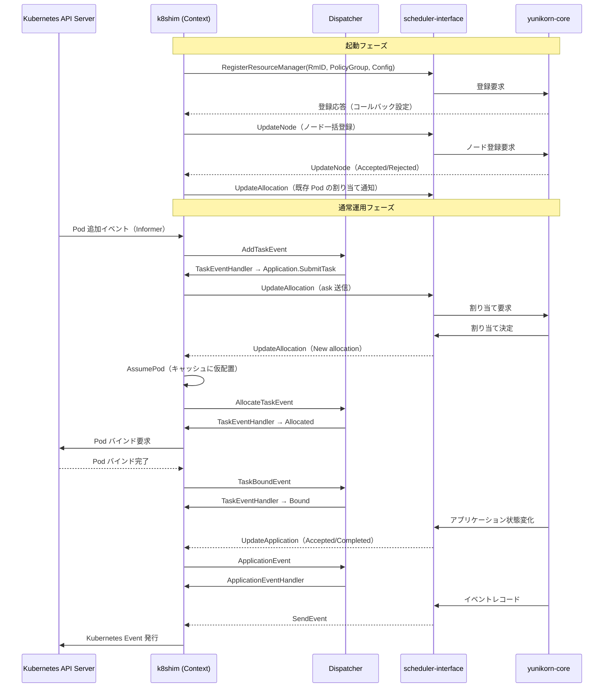

# 第9章 scheduler-interface と core 連携

> 本章で読むソース:
>
> - [pkg/cache/scheduler_callback.go L36-L47](https://github.com/apache/yunikorn-k8shim/blob/v1.8.0/pkg/cache/scheduler_callback.go#L36-L47)
> - [pkg/cache/scheduler_callback.go L49-L118](https://github.com/apache/yunikorn-k8shim/blob/v1.8.0/pkg/cache/scheduler_callback.go#L49-L118)
> - [pkg/cache/scheduler_callback.go L120-L227](https://github.com/apache/yunikorn-k8shim/blob/v1.8.0/pkg/cache/scheduler_callback.go#L120-L227)
> - [pkg/shim/scheduler.go L137-L172](https://github.com/apache/yunikorn-k8shim/blob/v1.8.0/pkg/shim/scheduler.go#L137-L172)
> - [pkg/client/apifactory.go L65-L72](https://github.com/apache/yunikorn-k8shim/blob/v1.8.0/pkg/client/apifactory.go#L65-L72)
> - [pkg/client/clients.go L40-L68](https://github.com/apache/yunikorn-k8shim/blob/v1.8.0/pkg/client/clients.go#L40-L68)
> - [pkg/cache/amprotocol.go L27-L83](https://github.com/apache/yunikorn-k8shim/blob/v1.8.0/pkg/cache/amprotocol.go#L27-L83)
> - [pkg/dispatcher/dispatcher.go L54-L61](https://github.com/apache/yunikorn-k8shim/blob/v1.8.0/pkg/dispatcher/dispatcher.go#L54-L61)

## この章の狙い

本章では、k8shim が `scheduler-interface`（SI）を介して yunikorn-core とどのように連携するかを理解する。
SI は k8shim と core のあいだに位置する通信規約であり、リソース割り当ての要求と応答、アプリケーション状態の通知、ノード登録のやり取りを定義する。
`AsyncRMCallback` が core からのコールバックをどのように受け取り、`Dispatcher` を通じて内部状態に反映するかを追う。
また、shim 起動時の `RegisterResourceManager` から、日常的な `UpdateAllocation`、`UpdateApplication`、`UpdateNode` の各 API 呼び出しまで、双方向のイベントフローを整理する。

## 前提

- 第1章で `KubernetesShim`、`Context`、`APIProvider` の全体像を把握している。
- 第2章で `Dispatcher` のイベントループと起動順序を理解している。
- 第3章で `Context` がアプリケーションとタスクの状態を管理することを理解している。
- Go のインターフェースとコールバックパターンの読み方がわかる。

## scheduler-interface の役割

`scheduler-interface`（SI）は、YuniKorn の Resource Manager（RM）とスケジューリングコアのあいだでやり取りされるメッセージとインターフェースを定義するライブラリである。
Go モジュールとしては `github.com/apache/yunikorn-scheduler-interface` に配置され、k8shim と core の両方がこのモジュールに依存する。

SI が提供するインターフェースは大きく2つある。

- **`api.SchedulerAPI`**: shim から core へ要求を送るためのインターフェース。`RegisterResourceManager`、`UpdateAllocation`、`UpdateApplication`、`UpdateNode`、`UpdateConfiguration` の各メソッドを持つ。
- **`api.ResourceManagerCallback`**: core から shim へ応答を返すためのインターフェース。`UpdateAllocation`、`UpdateApplication`、`UpdateNode`、`Predicates`、`PreemptionPredicates`、`SendEvent`、`UpdateContainerSchedulingState` の各メソッドを持つ。

この2つのインターフェースにより、shim と core は双方向に通信する。
shim は `SchedulerAPI` を通じて要求を送り、core は `ResourceManagerCallback` を通じて応答を返す。

```go
// pkg/client/clients.go L40-L68
type Clients struct {
	// client apis
	KubeClient   KubeClient
	SchedulerAPI api.SchedulerAPI

	// informer factory
	InformerFactory informers.SharedInformerFactory

	// resource informers
	ConfigMapInformer             coreInformerV1.ConfigMapInformer
	// ... (中略) ...
	VolumeAttachmentInformer      storageInformerV1.VolumeAttachmentInformer

	// volume binder handles PV/PVC related operations
	VolumeBinder volumebinding.SchedulerVolumeBinder
}
```

`Clients` 構造体の `SchedulerAPI` フィールドが core との通信窓口である。
`APIFactory` はこの `Clients` を生成し、`SchedulerAPI` の実装を外部から注入される。
standalone shim は core を同一プロセスで起動し、`RMProxy` を `SchedulerAPI` として直接渡している。
plugin モードでは in-process の直接呼び出し実装が使われる。

## RM の登録

shim が起動すると、まず自身を core に登録する。
`KubernetesShim.registerShimLayer` がその処理を行う。

[pkg/shim/scheduler.go L137-L172](https://github.com/apache/yunikorn-k8shim/blob/v1.8.0/pkg/shim/scheduler.go#L137-L172)

```go
func (ss *KubernetesShim) registerShimLayer() error {
	configuration := conf.GetSchedulerConf()

	buildInfoMap := conf.GetBuildInfoMap()

	configMaps, err := ss.context.LoadConfigMaps()
	if err != nil {
		log.Log(log.ShimScheduler).Error("failed to load yunikorn configmaps", zap.Error(err))
		return err
	}

	confMap := conf.FlattenConfigMaps(configMaps)
	config := utils.GetCoreSchedulerConfigFromConfigMap(confMap)
	extraConfig := utils.GetExtraConfigFromConfigMap(confMap)

	registerMessage := si.RegisterResourceManagerRequest{
		RmID:        configuration.ClusterID,
		Version:     configuration.ClusterVersion,
		PolicyGroup: configuration.PolicyGroup,
		BuildInfo:   buildInfoMap,
		Config:      config,
		ExtraConfig: extraConfig,
	}

	log.Log(log.ShimScheduler).Info("register RM to the scheduler",
		zap.String("clusterID", configuration.ClusterID),
		zap.String("clusterVersion", configuration.ClusterVersion),
		zap.String("policyGroup", configuration.PolicyGroup),
		zap.Any("buildInfo", buildInfoMap))
	if _, err := ss.apiFactory.GetAPIs().SchedulerAPI.
		RegisterResourceManager(&registerMessage, ss.callback); err != nil {
		return err
	}

	return nil
}
```

`RegisterResourceManagerRequest` には以下の情報が含まれる。

- `RmID`: クラスタの識別子（`SchedulerConf.ClusterID`）。
- `Version`: ビルドバージョン。
- `PolicyGroup`: キュー設定のポリシーグループ名（デフォルトは `"queues"`）。
- `BuildInfo`: ビルド情報のマップ（バージョン、日付、Go バージョン、各コンポーネントの SHA）。
- `Config`: ConfigMap から抽出した core 用のスケジューラ設定。
- `ExtraConfig`: ConfigMap から抽出した追加設定。

`RegisterResourceManager` の第2引数には `ss.callback`（`AsyncRMCallback`）が渡される。
これにより、core は以降の通信でこのコールバックを通じて shim に応答を返す。

登録が成功すると、core は shim の存在を認識し、キュー設定の初期化とノード登録の準備が完了する。
以降、`KubernetesShim.Run` の流れに従って、`InitializeState` による状態初期化、`doScheduling` によるスケジューリングループの開始が続く。

## AsyncRMCallback の構造

`AsyncRMCallback` は `api.ResourceManagerCallback` と `api.StateDumpPlugin` の両方を実装する構造体である。

[pkg/cache/scheduler_callback.go L36-L47](https://github.com/apache/yunikorn-k8shim/blob/v1.8.0/pkg/cache/scheduler_callback.go#L36-L47)

```go
// RM callback is called from the scheduler core, we need to ensure the response is handled
// asynchronously to avoid blocking the scheduler.
type AsyncRMCallback struct {
	context *Context
}

var _ api.ResourceManagerCallback = &AsyncRMCallback{}
var _ api.StateDumpPlugin = &AsyncRMCallback{}

func NewAsyncRMCallback(ctx *Context) *AsyncRMCallback {
	return &AsyncRMCallback{context: ctx}
}
```

コメントが示すように、このコールバックは core 側から呼び出される。
core のスケジューリングループをブロックしないよう、応答の処理は非同期に行う必要がある。
`AsyncRMCallback` 自体は `Context` への参照を保持し、各コールバックメソッド内で `Context` のメソッドを呼び出して状態を更新するか、`Dispatcher` にイベントを投入する。

`var _ api.ResourceManagerCallback = &AsyncRMCallback{}` は、`AsyncRMCallback` が `ResourceManagerCallback` インターフェースを満たしていることをコンパイル時に保証するイディオムである。

## UpdateAllocation コールバック

`UpdateAllocation` は core からの割り当て決定を受け取るメソッドである。
新しい割り当て、拒否された割り当て、解放された割り当ての3種類を処理する。

[pkg/cache/scheduler_callback.go L49-L118](https://github.com/apache/yunikorn-k8shim/blob/v1.8.0/pkg/cache/scheduler_callback.go#L49-L118)

```go
func (callback *AsyncRMCallback) UpdateAllocation(response *si.AllocationResponse) error {
	log.Log(log.ShimRMCallback).Debug("UpdateAllocation callback received",
		zap.Stringer("UpdateAllocationResponse", response))
	// handle new allocations
	for _, alloc := range response.New {
		// got allocation for pod, bind pod to the scheduled node
		log.Log(log.ShimRMCallback).Debug("callback: response to new allocation",
			zap.String("allocationKey", alloc.AllocationKey),
			zap.String("applicationID", alloc.ApplicationID),
			zap.String("nodeID", alloc.NodeID))

		// update cache
		task := callback.context.getTask(alloc.ApplicationID, alloc.AllocationKey)
		if task == nil {
			log.Log(log.ShimRMCallback).Warn("Unable to get task", zap.String("taskID", alloc.AllocationKey))
			continue
		}

		task.setAllocationKey(alloc.AllocationKey)
		backOff := wait.Backoff{
			Steps:    30,
			Duration: time.Second,
			Cap:      30 * time.Second,
		}
		err := retry.OnError(backOff, func(err error) bool {
			log.Log(log.ShimRMCallback).Error("AssumePod failed, retrying", zap.Error(err))
			return true
		}, func() error {
			return callback.context.AssumePod(alloc.AllocationKey, alloc.NodeID)
		})
		if err != nil {
			task.FailWithEvent(err.Error(), "AssumePodError")
			return err
		}

		if utils.IsAssignedPod(task.GetTaskPod()) {
			// task is already bound, fixup state and continue
			task.MarkPreviouslyAllocated(alloc.AllocationKey, alloc.NodeID)
		} else {
			ev := NewAllocateTaskEvent(alloc.ApplicationID, task.taskID, alloc.AllocationKey, alloc.NodeID)
			dispatcher.Dispatch(ev)
		}
	}

	for _, reject := range response.RejectedAllocations {
		// request rejected by the scheduler, reject it
		log.Log(log.ShimRMCallback).Debug("callback: response to rejected allocation",
			zap.String("allocationKey", reject.AllocationKey))
		dispatcher.Dispatch(NewRejectTaskEvent(reject.ApplicationID, reject.AllocationKey,
			fmt.Sprintf("task %s allocation from application %s is rejected by scheduler",
				reject.AllocationKey, reject.ApplicationID)))
	}

	for _, release := range response.Released {
		log.Log(log.ShimRMCallback).Debug("callback: response to released allocations",
			zap.String("AllocationKey", release.AllocationKey))

		// update cache
		callback.context.ForgetPod(release.GetAllocationKey())

		// TerminationType 0 mean STOPPED_BY_RM
		if release.TerminationType != si.TerminationType_STOPPED_BY_RM {
			// send release app allocation to application states machine
			ev := NewReleaseAppAllocationEvent(release.ApplicationID, release.TerminationType, release.AllocationKey)
			dispatcher.Dispatch(ev)
		}
	}

	return nil
}
```

処理は3つのフェーズに分かれる。

### 新しい割り当ての処理

`response.New` の各エントリについて、`Context.getTask` で対応するタスクを検索する。
タスクが見つかれば、`AssumePod` を呼び出してスケジューラキャッシュに Pod を仮配置する。
`AssumePod` は最大30回、指数バックオフでリトライされる（初期1秒、上限30秒）。
これは、ボリュームバインディングの一時的な失敗に対して耐性を持つためである。

`AssumePod` が成功した後、Pod がすでに Node にバインド済みかどうかで分岐する。
すでにバインド済みの場合は `MarkPreviouslyAllocated` で状態を整合させる。
未バインドの場合は `AllocateTaskEvent` を `Dispatcher` に投入し、タスクの状態機械を `Scheduling` から `Allocated` へ遷移させる。Pod バインド後の `TaskBound` で `Bound` になる。

### 拒否された割り当ての処理

`response.RejectedAllocations` の各エントリについて、`RejectTaskEvent` を `Dispatcher` に投入する。
これにより、タスクは拒否状態に遷移し、アプリケーションの状態機械にも影響が伝播する。

### 解放された割り当ての処理

`response.Released` の各エントリについて、`Context.ForgetPod` でキャッシュから Pod を削除する。
`TerminationType` が `STOPPED_BY_RM` でない場合は、`ReleaseAppAllocationEvent` を `Dispatcher` に投入してアプリケーションの状態機械に通知する。
`STOPPED_BY_RM` は core 側から能動的に停止されたケースであり、追加のイベント dispatch は不要である。

## UpdateApplication コールバック

`UpdateApplication` は core からのアプリケーション状態変化を受け取るメソッドである。

[pkg/cache/scheduler_callback.go L120-L168](https://github.com/apache/yunikorn-k8shim/blob/v1.8.0/pkg/cache/scheduler_callback.go#L120-L168)

```go
func (callback *AsyncRMCallback) UpdateApplication(response *si.ApplicationResponse) error {
	log.Log(log.ShimRMCallback).Debug("UpdateApplication callback received",
		zap.Stringer("UpdateApplicationResponse", response))

	// handle new accepted apps
	for _, app := range response.Accepted {
		// update context
		log.Log(log.ShimRMCallback).Debug("callback: response to accepted application",
			zap.String("appID", app.ApplicationID))

		if app := callback.context.GetApplication(app.ApplicationID); app != nil {
			log.Log(log.ShimRMCallback).Info("Accepting app", zap.String("appID", app.GetApplicationID()))
			ev := NewSimpleApplicationEvent(app.GetApplicationID(), AcceptApplication)
			dispatcher.Dispatch(ev)
		}
	}

	for _, rejectedApp := range response.Rejected {
		// update context
		log.Log(log.ShimRMCallback).Debug("callback: response to rejected application",
			zap.String("appID", rejectedApp.ApplicationID))

		if app := callback.context.GetApplication(rejectedApp.ApplicationID); app != nil {
			ev := NewApplicationEvent(app.GetApplicationID(), RejectApplication, rejectedApp.Reason)
			dispatcher.Dispatch(ev)
		}
	}

	// handle status changes
	for _, updated := range response.Updated {
		log.Log(log.ShimRMCallback).Debug("status update callback received",
			zap.String("appId", updated.ApplicationID),
			zap.String("new status", updated.State))
		switch updated.State {
		case ApplicationStates().Completed:
			callback.context.RemoveApplication(updated.ApplicationID)
		case ApplicationStates().Resuming:
			app := callback.context.GetApplication(updated.ApplicationID)
			if app != nil && app.GetApplicationState() == ApplicationStates().Reserving {
				ev := NewResumingApplicationEvent(updated.ApplicationID)
				dispatcher.Dispatch(ev)
			}
		case ApplicationStates().Failing, ApplicationStates().Failed:
			ev := NewFailApplicationEvent(updated.ApplicationID, updated.Message)
			dispatcher.Dispatch(ev)
		}
	}
	return nil
}
```

処理は3種類に分かれる。

- **Accepted**: core がアプリケーションを受け入れた。`AcceptApplication` イベントを `Dispatcher` に投入し、アプリケーションの状態機械を `Accepted` へ遷移させる。
- **Rejected**: core がアプリケーションを拒否した。`RejectApplication` イベントを投入し、拒否理由とともに状態機械に伝える。
- **Updated**: core がアプリケーションの状態変化を通知する。`Completed`（完了）の場合は `Context` からアプリケーションを削除する。`Resuming`（再開）の場合は、アプリケーションが `Reserving` 状態にあることを確認してから `ResumingApplicationEvent` を投入する。`Failing`/`Failed`（失敗）の場合は `FailApplicationEvent` を投入する。

## UpdateNode コールバック

`UpdateNode` は core からのノード登録結果を受け取るメソッドである。

[pkg/cache/scheduler_callback.go L170-L194](https://github.com/apache/yunikorn-k8shim/blob/v1.8.0/pkg/cache/scheduler_callback.go#L170-L194)

```go
func (callback *AsyncRMCallback) UpdateNode(response *si.NodeResponse) error {
	log.Log(log.ShimRMCallback).Debug("UpdateNode callback received",
		zap.Stringer("UpdateNodeResponse", response))
	// handle new accepted nodes
	for _, node := range response.Accepted {
		log.Log(log.ShimRMCallback).Debug("callback: response to accepted node",
			zap.String("nodeID", node.NodeID))

		dispatcher.Dispatch(CachedSchedulerNodeEvent{
			NodeID: node.NodeID,
			Event:  NodeAccepted,
		})
	}

	for _, node := range response.Rejected {
		log.Log(log.ShimRMCallback).Debug("callback: response to rejected node",
			zap.String("nodeID", node.NodeID))

		dispatcher.Dispatch(CachedSchedulerNodeEvent{
			NodeID: node.NodeID,
			Event:  NodeRejected,
		})
	}
	return nil
}
```

ノードの登録結果は `Accepted` か `Rejected` のいずれかである。
いずれの場合も `CachedSchedulerNodeEvent` を `Dispatcher` に投入する。
このイベントは `Context` のノード状態管理に利用され、登録が完了したノードに対してスケジューリングを有効化するなどの後続処理が行われる。

## Predicates と PreemptionPredicates

`Predicates` と `PreemptionPredicates` は core がスケジューリング判断を行う際に、k8shim 側に predicate 評価を依頼するコールバックである。

[pkg/cache/scheduler_callback.go L196-L209](https://github.com/apache/yunikorn-k8shim/blob/v1.8.0/pkg/cache/scheduler_callback.go#L196-L209)

```go
func (callback *AsyncRMCallback) Predicates(args *si.PredicatesArgs) error {
	return callback.context.IsPodFitNode(args.AllocationKey, args.NodeID, args.Allocate)
}

func (callback *AsyncRMCallback) PreemptionPredicates(args *si.PreemptionPredicatesArgs) *si.PreemptionPredicatesResponse {
	index, ok := callback.context.IsPodFitNodeViaPreemption(args.AllocationKey, args.NodeID, args.PreemptAllocationKeys, int(args.StartIndex))
	if !ok {
		index = -1
	}
	return &si.PreemptionPredicatesResponse{
		Success: ok,
		Index:   int32(index), //nolint:gosec
	}
}
```

`Predicates` は「指定された Pod が指定された Node にフィットするか」を評価する。
`Context.IsPodFitNode` はスケジューラキャッシュ上の Pod と Node の情報を参照し、`PredicateManager` を通じて Kubernetes 互換の predicate チェック（ボリューム制約、ノードセレクタ、_affinity_ など）を実行する。

`PreemptionPredicates` はプリエンプション（既存 Pod の退避）を伴う割り当てが可能かを評価する。
`args.PreemptAllocationKeys` で指定された既存の割り当てを退避させた上で、対象 Pod が Node にフィットするかを確認する。
戻り値の `Index` は、退避対象の配列のうちどこまでを退避させれば割り当てが成功するかを示す。

これらの predicate 評価は同期呼び出しである。
core は k8shim からの応答を待つため、k8shim 側での処理が遅延すると core のスケジューリングループ全体が遅くなる。
このため、`Context.IsPodFitNode` はキャッシュをロックして高速に評価を行う。

## SendEvent と UpdateContainerSchedulingState

`SendEvent` は core が生成したイベントレコードを Kubernetes の Event リソースとして発行する。

[pkg/cache/scheduler_callback.go L211-L216](https://github.com/apache/yunikorn-k8shim/blob/v1.8.0/pkg/cache/scheduler_callback.go#L211-L216)

```go
func (callback *AsyncRMCallback) SendEvent(eventRecords []*si.EventRecord) {
	if len(eventRecords) > 0 {
		log.Log(log.ShimRMCallback).Debug(fmt.Sprintf("prepare to publish %d events", len(eventRecords)))
		callback.context.PublishEvents(eventRecords)
	}
}
```

`Context.PublishEvents` はイベントの種類（`REQUEST` または `NODE`）に応じて、対応する Pod または Node に対して Kubernetes Event を発行する。

[pkg/cache/context.go L1150-L1190](https://github.com/apache/yunikorn-k8shim/blob/v1.8.0/pkg/cache/context.go#L1150-L1190)

```go
func (ctx *Context) PublishEvents(eventRecords []*si.EventRecord) {
	if len(eventRecords) > 0 {
		for _, record := range eventRecords {
			switch record.Type {
			case si.EventRecord_REQUEST:
				appID := record.ReferenceID
				taskID := record.ObjectID
				if task := ctx.getTask(appID, taskID); task != nil {
					events.GetRecorder().Eventf(task.GetTaskPod().DeepCopy(), nil,
						v1.EventTypeNormal, "Informational", "Informational", record.Message)
				} else {
					log.Log(log.ShimContext).Warn("task event is not published because task is not found",
						zap.String("appID", appID),
						zap.String("taskID", taskID),
						zap.Stringer("event", record))
				}
			case si.EventRecord_NODE:
				// ... (中略) ...
			}
		}
	}
}
```

`UpdateContainerSchedulingState` は Pod のスケジューリング状態の変化を処理する。

[pkg/cache/scheduler_callback.go L218-L220](https://github.com/apache/yunikorn-k8shim/blob/v1.8.0/pkg/cache/scheduler_callback.go#L218-L220)

```go
func (callback *AsyncRMCallback) UpdateContainerSchedulingState(request *si.UpdateContainerSchedulingStateRequest) {
	callback.context.HandleContainerStateUpdate(request)
}
```

`Context.HandleContainerStateUpdate` は Pod のスケジューリング失敗理由に応じて Pod Condition を更新する。
クラスタオートスケーラーは特定の Pod Condition を参照してスケーリング判断を行うため、この通知は自動スケーリングの精度に直結する。

## StateDumpPlugin

`AsyncRMCallback` は `api.StateDumpPlugin` も実装しており、`GetStateDump` メソッドを通じて shim 側の状態ダンプを提供する。

[pkg/cache/scheduler_callback.go L222-L227](https://github.com/apache/yunikorn-k8shim/blob/v1.8.0/pkg/cache/scheduler_callback.go#L222-L227)

```go
// StateDumpPlugin implementation

func (callback *AsyncRMCallback) GetStateDump() (string, error) {
	log.Log(log.ShimRMCallback).Debug("Retrieving shim state dump")
	return callback.context.GetStateDump()
}
```

`Context.GetStateDump` はスケジューラキャッシュの状態を JSON にシリアライズして返す。
このダンプは Web UI や REST API から参照され、デバッグや運用時の状態確認に利用される。

## shim から core への要求

shim は `api.SchedulerAPI` を通じて core に要求を送る。
主要な呼び出し箇所を以下に整理する。

### UpdateAllocation（割り当て要求）

`Context` は Pod の追加、削除、外部 Pod の検出時に `UpdateAllocation` を呼び出す。

[pkg/cache/context.go L410-L415](https://github.com/apache/yunikorn-k8shim/blob/v1.8.0/pkg/cache/context.go#L410-L415)

```go
			if oldPod == nil || !common.Equals(common.GetPodResource(oldPod), common.GetPodResource(pod)) {
				allocReq := common.CreateAllocationForForeignPod(pod)
				if err := ctx.apiProvider.GetAPIs().SchedulerAPI.UpdateAllocation(allocReq); err != nil {
					log.Log(log.ShimContext).Error("failed to add foreign allocation to the core",
						zap.Error(err))
				}
			}
```

このコードは「外部 Pod」（YuniKorn 管理外の Pod）が Node に割り当てられたことを core に通知する。
core はこの情報をリソース計算に反映し、他のアプリケーションへの割り当て判断に使用する。

### UpdateNode（ノード登録）

`Context.RegisterNodes` はノード情報を core に送信する。

[pkg/cache/context.go L1593-L1599](https://github.com/apache/yunikorn-k8shim/blob/v1.8.0/pkg/cache/context.go#L1593-L1599)

```go
	if err := ctx.apiProvider.GetAPIs().SchedulerAPI.UpdateNode(&si.NodeRequest{
		Nodes: nodesToRegister,
		RmID:  schedulerconf.GetSchedulerConf().ClusterID,
	}); err != nil {
		log.Log(log.ShimContext).Error("Failed to register nodes", zap.Error(err))
		return nil, nil, err
	}
```

ノード登録は `InitializeState` の中で一括して行われる。
すべてのノードを一度に送り、`WaitGroup` で全レスポンスを待つ。

### UpdateConfiguration（設定のホットリロード）

ConfigMap の変更を検出すると、`Context.triggerReloadConfig` が `UpdateConfiguration` を呼び出す。

[pkg/cache/context.go L634-L643](https://github.com/apache/yunikorn-k8shim/blob/v1.8.0/pkg/cache/context.go#L634-L643)

```go
	request := &si.UpdateConfigurationRequest{
		RmID:        schedulerconf.GetSchedulerConf().ClusterID,
		PolicyGroup: schedulerconf.GetSchedulerConf().PolicyGroup,
		Config:      config,
		ExtraConfig: extraConfig,
	}
	// tell the core to update: sync call that is serialised on the core side
	if err := ctx.apiProvider.GetAPIs().SchedulerAPI.UpdateConfiguration(request); err != nil {
		log.Log(log.ShimContext).Error("reload configuration failed", zap.Error(err))
	}
```

コメントの「sync call that is serialised on the core side」が示すように、この呼び出しは同期であり、core 側で直列化される。

## AMProtocol: アプリケーションとタスクのメタデータ

`amprotocol.go` は shim 内部でアプリケーションとタスクを追加する際の要求構造体を定義する。

[pkg/cache/amprotocol.go L27-L65](https://github.com/apache/yunikorn-k8shim/blob/v1.8.0/pkg/cache/amprotocol.go#L27-L65)

```go
type AddApplicationRequest struct {
	Metadata ApplicationMetadata
}

type AddTaskRequest struct {
	Metadata TaskMetadata
}

type ApplicationMetadata struct {
	ApplicationID              string
	QueueName                  string
	User                       string
	Tags                       map[string]string
	Groups                     []string
	TaskGroups                 []TaskGroup
	OwnerReferences            []metav1.OwnerReference
	SchedulingPolicyParameters *SchedulingPolicyParameters
	CreationTime               int64
}

type TaskGroup struct {
	Name                      string
	MinMember                 int32
	Labels                    map[string]string
	Annotations               map[string]string
	MinResource               map[string]resource.Quantity
	NodeSelector              map[string]string
	Tolerations               []v1.Toleration
	Affinity                  *v1.Affinity
	TopologySpreadConstraints []v1.TopologySpreadConstraint
}

type TaskMetadata struct {
	ApplicationID string
	TaskID        string
	Pod           *v1.Pod
	Placeholder   bool
	TaskGroupName string
}
```

`ApplicationMetadata` はアプリケーションの識別子、キュー名、ユーザー、タグ、グループ、タスクグループ、スケジューリングポリシーパラメータなどを保持する。
`TaskGroup` はギャングスケジューリングの単位を定義し、最小メンバー数、ラベル、アノテーション、最小リソース、ノードセレクタ、トレレーション、アフィニティ、トポロジースプレッド制約を持つ。
`TaskMetadata` はタスクの識別子、対応する Pod、プレースホルダーかどうか、所属するタスクグループ名を保持する。

これらの構造体は SI のメッセージではない。
shim 内部の `Context.addApplication`、`Context.AddTask` で使用され、SI への変換は `Application` や `Task` の状態機械内で行われる。

## Dispatcher を介した非同期処理

`AsyncRMCallback` の各メソッドは、状態の更新を直接行うのではなく `Dispatcher` にイベントを投入する。

[pkg/dispatcher/dispatcher.go L54-L61](https://github.com/apache/yunikorn-k8shim/blob/v1.8.0/pkg/dispatcher/dispatcher.go#L54-L61)

```go
// central dispatcher that dispatches scheduling events.
type Dispatcher struct {
	eventChan chan events.SchedulingEvent
	stopChan  chan struct{}
	handlers  map[EventType]map[string]func(interface{})
	running   atomic.Bool
	lock      locking.RWMutex
	stopped   sync.WaitGroup
}
```

`Dispatcher` は単一のイベントチャネルを持ち、すべてのアプリケーションイベント、タスクイベント、ノードイベントを順次処理する。
これにより、複数のイベントが同時に状態を変更することを防ぎ、状態の一貫性が保たれる。

イベントチャネルが一杯の場合は `asyncDispatch` にフォールバックし、3秒ごとにリトライしながら `DispatchTimeout`（デフォルト300秒）まで待機する。
`AsyncDispatchLimit` を超えるとパニックが発生し、プロセスを異常終了させる。
これはイベント処理が完全に停滞している状態を検出するための安全装置である。

## イベントフローの全体像

k8shim と core のあいだのイベントフローを以下に示す。



起動フェーズでは、shim は `RegisterResourceManager` で自身を登録し、ノードを一括登録し、既存の Pod の割り当てを core に通知する。
通常運用フェーズでは、Kubernetes Informer からのイベントを契機として、`Dispatcher` を介して状態が更新され、SI 経由で core とやり取りが行われる。

## 高速化・最適化の工夫

`AsyncRMCallback` の設計は、core のスケジューリングループをブロックしないことを目的としている。
core は `ResourceManagerCallback` のメソッドを呼び出す際、その戻り値を待つ。
`UpdateAllocation` は同期的に `setAllocationKey` と `AssumePod` のリトライを実行し、失敗時はその場で `FailWithEvent` する。
その後、`Dispatcher` のイベントチャネルに状態遷移イベントを投入する。
イベントの実際の処理は `Dispatcher` の専用ゴルーチンが行うため、core は次のスケジューリング判断に進める。

もう一つの最適化は `AssumePod` のリトライ機構である。
ボリュームバインディングは一時的に失敗することがある。
`retry.OnError` による指数バックオフ（最大30回、上限30秒）により、一時的な失敗をリトライして回復する。
これにより、バインドの失敗による不要なスケジューリングのやり直しを防ぐ。

## まとめ

本章では、k8shim が `scheduler-interface` を介して yunikorn-core と連携する仕組みを整理した。
`AsyncRMCallback` は core からのコールバック（`UpdateAllocation`、`UpdateApplication`、`UpdateNode`、`Predicates`、`SendEvent`）を受け取り、`Dispatcher` を通じて内部状態に反映する。
shim は `SchedulerAPI` を通じて core に要求（`RegisterResourceManager`、`UpdateAllocation`、`UpdateNode`、`UpdateConfiguration`）を送る。
この双方向通信により、Kubernetes のリソース状態と core のスケジューリング判断が同期される。

## 関連する章

- [第1章 yunikorn-k8shim の全体像](../part00-intro/01-overview.md): `KubernetesShim` と `AsyncRMCallback` の配置
- [第2章 起動とイベントディスパッチ](../part00-intro/02-startup-and-dispatcher.md): `Dispatcher` の起動とイベントループ
- [第3章 Context とキャッシュレイヤー](../part01-cache/03-context-and-cache.md): `Context` の状態管理と `AssumePod`
- [第4章 アプリケーション状態機械](../part01-cache/04-application-state-machine.md): `AcceptApplication`、`RejectApplication` などのイベント処理先
- [第5章 タスク状態管理とプレースホルダー](../part01-cache/05-task-and-placeholder.md): `AllocateTaskEvent`、`RejectTaskEvent` の処理先
- [yunikorn-core 第11章 RMProxy と scheduler-interface](../../yunikorn-core/part03-integration/11-rmproxy-and-scheduler-interface.md): core 側の SI 通信実装
- [Spark 第27章 Kubernetes 上の Spark と YuniKorn 連携](../../../spark/part09-kubernetes/27-k8s-yunikorn-integration.md): Spark ドライバが YuniKorn と連携してリソースを要求する流れ
