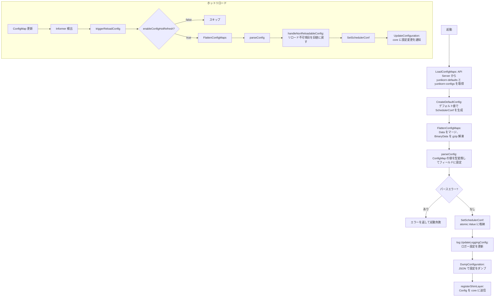

# 第10章 設定管理

> 本章で読むソース:
>
> - [pkg/conf/schedulerconf.go L112-L133](https://github.com/apache/yunikorn-k8shim/blob/v1.8.0/pkg/conf/schedulerconf.go#L112-L133)
> - [pkg/conf/schedulerconf.go L161-L199](https://github.com/apache/yunikorn-k8shim/blob/v1.8.0/pkg/conf/schedulerconf.go#L161-L199)
> - [pkg/conf/schedulerconf.go L201-L245](https://github.com/apache/yunikorn-k8shim/blob/v1.8.0/pkg/conf/schedulerconf.go#L201-L245)
> - [pkg/conf/schedulerconf.go L300-L356](https://github.com/apache/yunikorn-k8shim/blob/v1.8.0/pkg/conf/schedulerconf.go#L300-L356)
> - [pkg/conf/schedulerconf.go L471-L485](https://github.com/apache/yunikorn-k8shim/blob/v1.8.0/pkg/conf/schedulerconf.go#L471-L485)
> - [conf/scheduler-config.yaml L18-L30](https://github.com/apache/yunikorn-k8shim/blob/v1.8.0/conf/scheduler-config.yaml#L18-L30)

## この章の狙い

本章では、k8shim の設定管理機構を理解する。
`SchedulerConf` 構造体、Kubernetes ConfigMap による設定のロード、ホットリロードの仕組み、リロード不可能な設定項目の扱いを整理する。
設定がどのようにパースされ、バリデーションされ、実行時に反映されるかを追うことで、運用時の設定変更の影響範囲を把握する。

## 前提

- 第2章で k8shim の起動フローを理解している。
- 第9章で `RegisterResourceManager` の際に ConfigMap が core に渡されることを理解している。
- Kubernetes の ConfigMap リソースと Informer の仕組みを知っている。

## SchedulerConf 構造体

`SchedulerConf` は k8shim の全設定を保持する構造体である。

[pkg/conf/schedulerconf.go L112-L133](https://github.com/apache/yunikorn-k8shim/blob/v1.8.0/pkg/conf/schedulerconf.go#L112-L133)

```go
type SchedulerConf struct {
	SchedulerName            string        `json:"schedulerName"`
	ClusterID                string        `json:"clusterId"`
	ClusterVersion           string        `json:"clusterVersion"`
	PolicyGroup              string        `json:"policyGroup"`
	Interval                 time.Duration `json:"schedulingIntervalSecond"`
	KubeConfig               string        `json:"absoluteKubeConfigFilePath"`
	VolumeBindTimeout        time.Duration `json:"volumeBindTimeout"`
	EventChannelCapacity     int           `json:"eventChannelCapacity"`
	DispatchTimeout          time.Duration `json:"dispatchTimeout"`
	KubeQPS                  int           `json:"kubeQPS"`
	KubeBurst                int           `json:"kubeBurst"`
	EnableConfigHotRefresh   bool          `json:"enableConfigHotRefresh"`
	DisableGangScheduling    bool          `json:"disableGangScheduling"`
	UserLabelKey             string        `json:"userLabelKey"`
	PlaceHolderImage         string        `json:"placeHolderImage"`
	InstanceTypeNodeLabelKey string        `json:"instanceTypeNodeLabelKey"`
	Namespace                string        `json:"namespace"`
	GenerateUniqueAppIds     bool          `json:"generateUniqueAppIds"`

	locking.RWMutex
}
```

`SchedulerConf` 自体が `locking.RWMutex` を埋め込み、フィールドへの安全なアクセスを提供する。
各フィールドの getter メソッド（`GetSchedulingInterval`、`GetKubeConfigPath` など）は `RLock` を取得してから値を返す。

主要な設定項目を以下に整理する。

- **`SchedulerName`**: Kubernetes スケジューラ名。デフォルトは `"yunikorn"`。
- **`ClusterID`**: クラスタの識別子。core に RM として登録する際の ID。デフォルトは `"mycluster"`。
- **`PolicyGroup`**: キュー設定のポリシーグループ名。デフォルトは `"queues"`。
- **`Interval`**: スケジューリングループの実行間隔。デフォルトは1秒。
- **`VolumeBindTimeout`**: ボリュームバインディングのタイムアウト。デフォルトは10分。
- **`EventChannelCapacity`**: `Dispatcher` のイベントチャネルの容量。デフォルトは `1024 * 1024`（約100万）。
- **`DispatchTimeout`**: イベント dispatch のタイムアウト。デフォルトは300秒。
- **`KubeQPS`**: Kubernetes API Server へのリクエストレート制限（QPS）。デフォルトは1000。
- **`KubeBurst`**: Kubernetes API Server へのバースト許容量。デフォルトは1000。
- **`EnableConfigHotRefresh`**: ConfigMap のホットリロードを有効にするか。デフォルトは `true`。
- **`DisableGangScheduling`**: ギャングスケジューリングを無効にするか。デフォルトは `false`。
- **`PlaceHolderImage`**: プレースホルダー Pod のコンテナイメージ。デフォルトは `"registry.k8s.io/pause:3.7"`。
- **`Namespace`**: YuniKorn が動作する Kubernetes 名前空間。環境変数 `NAMESPACE` から取得し、デフォルトは `"default"`。

## デフォルト設定の生成

`CreateDefaultConfig` はすべての設定項目にデフォルト値を設定した `SchedulerConf` を生成する。

[pkg/conf/schedulerconf.go L300-L321](https://github.com/apache/yunikorn-k8shim/blob/v1.8.0/pkg/conf/schedulerconf.go#L300-L321)

```go
// CreateDefaultConfig creates and returns a configuration representing all default values
func CreateDefaultConfig() *SchedulerConf {
	return &SchedulerConf{
		SchedulerName:            constants.SchedulerName,
		Namespace:                GetSchedulerNamespace(),
		ClusterID:                DefaultClusterID,
		ClusterVersion:           buildVersion,
		PolicyGroup:              DefaultPolicyGroup,
		Interval:                 DefaultSchedulingInterval,
		KubeConfig:               GetDefaultKubeConfigPath(),
		VolumeBindTimeout:        DefaultVolumeBindTimeout,
		EventChannelCapacity:     DefaultEventChannelCapacity,
		DispatchTimeout:          DefaultDispatchTimeout,
		KubeQPS:                  DefaultKubeQPS,
		KubeBurst:                DefaultKubeBurst,
		EnableConfigHotRefresh:   DefaultEnableConfigHotRefresh,
		DisableGangScheduling:    DefaultDisableGangScheduling,
		UserLabelKey:             constants.DefaultUserLabel,
		PlaceHolderImage:         constants.PlaceholderContainerImage,
		InstanceTypeNodeLabelKey: constants.DefaultNodeInstanceTypeNodeLabelKey,
		GenerateUniqueAppIds:     DefaultAMFilteringGenerateUniqueAppIds,
	}
}
```

デフォルト値は定数として `schedulerconf.go` の先頭で定義されている。

[pkg/conf/schedulerconf.go L48-L94](https://github.com/apache/yunikorn-k8shim/blob/v1.8.0/pkg/conf/schedulerconf.go#L48-L94)

```go
const (
	// env vars
	EnvHome       = "HOME"
	EnvKubeConfig = "KUBECONFIG"
	EnvNamespace  = "NAMESPACE"

	// prefixes
	PrefixService             = "service."
	PrefixLog                 = "log."
	PrefixKubernetes          = "kubernetes."
	PrefixAdmissionController = "admissionController."

	// service
	CMSvcClusterID                    = PrefixService + "clusterId"
	CMSvcPolicyGroup                  = PrefixService + "policyGroup"
	// ... (中略) ...

	// defaults
	DefaultNamespace                       = "default"
	DefaultClusterID                       = "mycluster"
	DefaultPolicyGroup                     = "queues"
	DefaultSchedulingInterval              = time.Second
	DefaultVolumeBindTimeout               = 10 * time.Minute
	DefaultEventChannelCapacity            = 1024 * 1024
	DefaultDispatchTimeout                 = 300 * time.Second
	DefaultOperatorPlugins                 = "general"
	DefaultDisableGangScheduling           = false
	DefaultEnableConfigHotRefresh          = true
	DefaultKubeQPS                         = 1000
	DefaultKubeBurst                       = 1000
	DefaultAMFilteringGenerateUniqueAppIds = false
)
```

設定キーは `service.`、`kubernetes.`、`admissionController.` のプレフィックスで分類される。
ConfigMap にはこれらのキーで値が格納される。

## ConfigMap からの設定ロード

k8shim の設定は Kubernetes ConfigMap で管理される。
2つの ConfigMap が使用される。

- **`yunikorn-defaults`**: デフォルト値を提供する ConfigMap。
- **`yunikorn-configs`**: デフォルト値を上書きする ConfigMap。

`Context.LoadConfigMaps` は Kubernetes API Server から両方の ConfigMap を取得する。

[pkg/cache/context.go L1327-L1341](https://github.com/apache/yunikorn-k8shim/blob/v1.8.0/pkg/cache/context.go#L1327-L1341)

```go
func (ctx *Context) LoadConfigMaps() ([]*v1.ConfigMap, error) {
	kubeClient := ctx.apiProvider.GetAPIs().KubeClient

	defaults, err := kubeClient.GetConfigMap(ctx.namespace, constants.DefaultConfigMapName)
	if err != nil {
		return nil, err
	}

	config, err := kubeClient.GetConfigMap(ctx.namespace, constants.ConfigMapName)
	if err != nil {
		return nil, err
	}

	return []*v1.ConfigMap{defaults, config}, nil
}
```

`constants.DefaultConfigMapName` は `"yunikorn-defaults"`、`constants.ConfigMapName` は `"yunikorn-configs"` である。

取得した ConfigMap は `FlattenConfigMaps` で1つの `map[string]string` に統合される。

[pkg/conf/schedulerconf.go L471-L485](https://github.com/apache/yunikorn-k8shim/blob/v1.8.0/pkg/conf/schedulerconf.go#L471-L485)

```go
func FlattenConfigMaps(configMaps []*v1.ConfigMap) map[string]string {
	result := make(map[string]string)
	for _, configMap := range configMaps {
		if configMap != nil {
			for k, v := range configMap.Data {
				result[k] = v
			}
			for k, v := range configMap.BinaryData {
				strippedKey, uncompressedData := Decompress(k, v)
				result[strippedKey] = uncompressedData
			}
		}
	}
	return result
}
```

`Data` のエントリはそのままマージされる。
`BinaryData` のエントリは `Decompress` で解凍される。
キーの末尾が `.gz` の場合、gzip 圧縮されたデータとして解凍し、キーから `.gz` サフィックスを除去する。
後から処理される ConfigMap（`yunikorn-configs`）の値が、先に処理された ConfigMap（`yunikorn-defaults`）の値を上書きする。

## UpdateConfigMaps と設定のパース

`UpdateConfigMaps` は ConfigMap の内容をパースして `SchedulerConf` を更新する。

[pkg/conf/schedulerconf.go L161-L199](https://github.com/apache/yunikorn-k8shim/blob/v1.8.0/pkg/conf/schedulerconf.go#L161-L199)

```go
func UpdateConfigMaps(configMaps []*v1.ConfigMap, initial bool) error {
	log.Log(log.ShimConfig).Info("reloading configuration")

	// start with defaults
	prev := CreateDefaultConfig()

	// flatten configmap entries to single map
	config := FlattenConfigMaps(configMaps)

	// parse values from configmaps
	newConf, cmErrors := parseConfig(config, prev)
	if cmErrors != nil {
		for _, err := range cmErrors {
			log.Log(log.ShimConfig).Error("failed to parse configmap entry", zap.Error(err))
		}
		return errors.New("failed to load configmap")
	}

	// check for settings which cannot be hot-reloaded
	if !initial {
		oldConf := GetSchedulerConf()
		handleNonReloadableConfig(oldConf, newConf)
	}

	// update scheduler config with merged version
	SetSchedulerConf(newConf)
	_ = GetSchedulerConf()

	// update logger configuration
	log.UpdateLoggingConfig(config)

	// update Kubernetes logger configuration
	updateKubeLogger()

	// dump new scheduler configuration
	DumpConfiguration()

	return nil
}
```

処理の流れは以下の通りである。

1. デフォルト値で `SchedulerConf` を生成する。
2. ConfigMap をフラットなマップに統合する。
3. `parseConfig` でマップの値を `SchedulerConf` の各フィールドにパースする。
4. 初回ロードでない場合は、ホットリロード不可能な設定項目をチェックする。
5. 新しい `SchedulerConf` をグローバルに設定する。
6. ロガーの設定を更新する。
7. 設定内容を JSON でダンプする。

`parseConfig` は `configParser` を使用して、各設定キーに対応する値をマップから取得し、適切な型に変換する。

[pkg/conf/schedulerconf.go L323-L356](https://github.com/apache/yunikorn-k8shim/blob/v1.8.0/pkg/conf/schedulerconf.go#L323-L356)

```go
func parseConfig(config map[string]string, prev *SchedulerConf) (*SchedulerConf, []error) {
	conf := prev.Clone()

	if len(config) == 0 {
		// no changes
		return conf, nil
	}

	parser := newConfigParser(config)

	// service
	parser.stringVar(&conf.ClusterID, CMSvcClusterID)
	parser.stringVar(&conf.PolicyGroup, CMSvcPolicyGroup)
	parser.durationVar(&conf.Interval, CMSvcSchedulingInterval)
	parser.durationVar(&conf.VolumeBindTimeout, CMSvcVolumeBindTimeout)
	parser.intVar(&conf.EventChannelCapacity, CMSvcEventChannelCapacity)
	parser.durationVar(&conf.DispatchTimeout, CMSvcDispatchTimeout)
	parser.boolVar(&conf.DisableGangScheduling, CMSvcDisableGangScheduling)
	parser.boolVar(&conf.EnableConfigHotRefresh, CMSvcEnableConfigHotRefresh)
	parser.stringVar(&conf.PlaceHolderImage, CMSvcPlaceholderImage)
	parser.stringVar(&conf.InstanceTypeNodeLabelKey, CMSvcNodeInstanceTypeNodeLabelKey)

	// kubernetes
	parser.intVar(&conf.KubeQPS, CMKubeQPS)
	parser.intVar(&conf.KubeBurst, CMKubeBurst)

	// admission controller
	parser.boolVar(&conf.GenerateUniqueAppIds, AMFilteringGenerateUniqueAppIds)

	if len(parser.errors) > 0 {
		return nil, parser.errors
	}
	return conf, nil
}
```

`configParser` の各メソッド（`stringVar`、`intVar`、`boolVar`、`durationVar`）は、マップにキーが存在する場合のみ値をパースしてフィールドに設定する。
キーが存在しない場合はデフォルト値がそのまま残る。
パースに失敗した場合はエラーを蓄積し、すべてのパースを試みた後にエラーを返す。

## ホットリロードの制限

ConfigMap の変更は Informer 経由で検出され、`Context.triggerReloadConfig` が呼び出される。
ただし、すべての設定項目がホットリロード（再起動なしでの反映）に対応しているわけではない。

`handleNonReloadableConfig` は、ホットリロード不可能な設定項目が変更されていた場合、警告ログを出力して旧値に戻す。

[pkg/conf/schedulerconf.go L201-L215](https://github.com/apache/yunikorn-k8shim/blob/v1.8.0/pkg/conf/schedulerconf.go#L201-L215)

```go
func handleNonReloadableConfig(old *SchedulerConf, new *SchedulerConf) {
	// warn about and revert any settings which cannot be hot-reloaded
	checkNonReloadableString(CMSvcClusterID, &old.ClusterID, &new.ClusterID)
	checkNonReloadableString(CMSvcPolicyGroup, &old.PolicyGroup, &new.PolicyGroup)
	checkNonReloadableDuration(CMSvcSchedulingInterval, &old.Interval, &new.Interval)
	checkNonReloadableDuration(CMSvcVolumeBindTimeout, &old.VolumeBindTimeout, &new.VolumeBindTimeout)
	checkNonReloadableInt(CMSvcEventChannelCapacity, &old.EventChannelCapacity, &new.EventChannelCapacity)
	checkNonReloadableDuration(CMSvcDispatchTimeout, &old.DispatchTimeout, &new.DispatchTimeout)
	checkNonReloadableInt(CMKubeQPS, &old.KubeQPS, &new.KubeQPS)
	checkNonReloadableInt(CMKubeBurst, &old.KubeBurst, &new.KubeBurst)
	checkNonReloadableBool(CMSvcDisableGangScheduling, &old.DisableGangScheduling, &new.DisableGangScheduling)
	checkNonReloadableString(CMSvcPlaceholderImage, &old.PlaceHolderImage, &new.PlaceHolderImage)
	checkNonReloadableString(CMSvcNodeInstanceTypeNodeLabelKey, &old.InstanceTypeNodeLabelKey, &new.InstanceTypeNodeLabelKey)
	checkNonReloadableBool(AMFilteringGenerateUniqueAppIds, &old.GenerateUniqueAppIds, &new.GenerateUniqueAppIds)
}
```

各 `checkNonReloadable*` 関数は、旧値と新値を比較し、異なっている場合は警告ログを出力して新値を旧値で上書きする。

[pkg/conf/schedulerconf.go L217-L245](https://github.com/apache/yunikorn-k8shim/blob/v1.8.0/pkg/conf/schedulerconf.go#L217-L245)

```go
const warningNonReloadable = "ignoring non-reloadable configuration change (restart required to update)"

func checkNonReloadableString(name string, old *string, new *string) {
	if *old != *new {
		log.Log(log.ShimConfig).Warn(warningNonReloadable, zap.String("config", name), zap.String("existing", *old), zap.String("new", *new))
		*new = *old
	}
}

func checkNonReloadableDuration(name string, old *time.Duration, new *time.Duration) {
	if *old != *new {
		log.Log(log.ShimConfig).Warn(warningNonReloadable, zap.String("config", name), zap.Duration("existing", *old), zap.Duration("new", *new))
		*new = *old
	}
}

func checkNonReloadableInt(name string, old *int, new *int) {
	if *old != *new {
		log.Log(log.ShimConfig).Warn(warningNonReloadable, zap.String("config", name), zap.Int("existing", *old), zap.Int("new", *new))
		*new = *old
	}
}

func checkNonReloadableBool(name string, old *bool, new *bool) {
	if *old != *new {
		log.Log(log.ShimConfig).Warn(warningNonReloadable, zap.String("config", name), zap.Bool("existing", *old), zap.Bool("new", *new))
		*new = *old
	}
}
```

ホットリロード不可能な設定項目は以下の通りである。

- `service.clusterId`
- `service.policyGroup`
- `service.schedulingInterval`
- `service.volumeBindTimeout`
- `service.eventChannelCapacity`
- `service.dispatchTimeout`
- `kubernetes.qps`
- `kubernetes.burst`
- `service.disableGangScheduling`
- `service.placeholderImage`
- `service.nodeInstanceTypeNodeLabelKey`
- `admissionController.filtering.generateUniqueAppId`

これらの設定を変更した場合は、k8shim の再起動が必要である。

ホットリロード可能な設定項目は `service.enableConfigHotRefresh` とロガー関連の設定である。
`enableConfigHotRefresh` を `false` に設定すると、以降の ConfigMap 変更は無視される。

## グローバルな設定アクセス

`SchedulerConf` は `atomic.Value` を使用してグローバルに保持される。

[pkg/conf/schedulerconf.go L107-L108](https://github.com/apache/yunikorn-k8shim/blob/v1.8.0/pkg/conf/schedulerconf.go#L107-L108)

```go
var once sync.Once
var confHolder atomic.Value
```

`GetSchedulerConf` は `sync.Once` で初期化を保証し、`atomic.Value` から `SchedulerConf` を読み込む。

[pkg/conf/schedulerconf.go L247-L256](https://github.com/apache/yunikorn-k8shim/blob/v1.8.0/pkg/conf/schedulerconf.go#L247-L256)

```go
func GetSchedulerConf() *SchedulerConf {
	once.Do(createConfigs)
	return confHolder.Load().(*SchedulerConf) //nolint:errcheck
}

func SetSchedulerConf(conf *SchedulerConf) {
	// this is just to ensure that the original is in place first
	once.Do(createConfigs)
	confHolder.Store(conf)
}
```

`atomic.Value` への読み書きはアトミックである。
ただし、`Store` 前に `Load` した goroutine や既に取得済みのポインタは旧設定を参照し得る。
`SchedulerConf` の個々のフィールドへのアクセスは、構造体に埋め込まれた `RWMutex` で保護される。

## Clone による安全な更新

`parseConfig` は既存の設定を `Clone` してから変更を加える。

[pkg/conf/schedulerconf.go L135-L159](https://github.com/apache/yunikorn-k8shim/blob/v1.8.0/pkg/conf/schedulerconf.go#L135-L159)

```go
func (conf *SchedulerConf) Clone() *SchedulerConf {
	conf.RLock()
	defer conf.RUnlock()

	return &SchedulerConf{
		SchedulerName:            conf.SchedulerName,
		ClusterID:                conf.ClusterID,
		ClusterVersion:           conf.ClusterVersion,
		PolicyGroup:              conf.PolicyGroup,
		Interval:                 conf.Interval,
		KubeConfig:               conf.KubeConfig,
		VolumeBindTimeout:        conf.VolumeBindTimeout,
		EventChannelCapacity:     conf.EventChannelCapacity,
		DispatchTimeout:          conf.DispatchTimeout,
		KubeQPS:                  conf.KubeQPS,
		KubeBurst:                conf.KubeBurst,
		EnableConfigHotRefresh:   conf.EnableConfigHotRefresh,
		DisableGangScheduling:    conf.DisableGangScheduling,
		UserLabelKey:             conf.UserLabelKey,
		PlaceHolderImage:         conf.PlaceHolderImage,
		InstanceTypeNodeLabelKey: conf.InstanceTypeNodeLabelKey,
		Namespace:                conf.Namespace,
		GenerateUniqueAppIds:     conf.GenerateUniqueAppIds,
	}
}
```

`Clone` は `RLock` を取得してすべてのフィールドをコピーした新しい `SchedulerConf` を返す。
これにより、パース中の設定変更が現在使用中の設定に影響を与えることがない。
パースが完了してバリデーションを終えた後で、`SetSchedulerConf` によってアトミックに差し替えられる。

## scheduler-config.yaml

`conf/scheduler-config.yaml` は Kubernetes Scheduling Framework 向けの設定ファイルである。

[conf/scheduler-config.yaml L18-L30](https://github.com/apache/yunikorn-k8shim/blob/v1.8.0/conf/scheduler-config.yaml#L18-L30)

```yaml
apiVersion: kubescheduler.config.k8s.io/v1
kind: KubeSchedulerConfiguration
leaderElection:
  leaderElect: false
profiles:
  - schedulerName: yunikorn
    plugins:
      multiPoint:
        enabled:
        - name: YuniKornPlugin
        disabled:
        - name: DefaultPreemption
        - name: SchedulingGates
```

このファイルは kube-scheduler の設定であり、k8shim 自身の設定ではない。
plugin モードで kube-scheduler を起動する際に使用され、`YuniKornPlugin` を有効化し、`DefaultPreemption` と `SchedulingGates` を無効化する。
`leaderElect: false` は、YuniKorn 自身がリーダー選出を管理するため、kube-scheduler 側のリーダー選出を無効にすることを示す。

## 設定ロードのフロー

設定がロードされる全体のフローを以下に示す。



起動時は ConfigMap を取得してパースし、デフォルト値とマージして `SchedulerConf` を生成する。
ホットリロード時は Informer が ConfigMap の変更を検出し、`triggerReloadConfig` が同じフローをたどる。
リロード不可能な設定項目は旧値に戻され、警告ログが出力される。

## 高速化・最適化の工夫

設定アクセスの高速化のために、`SchedulerConf` は `atomic.Value` で保持される。
`GetSchedulerConf` の呼び出しは `atomic.Value.Load` であり、ロック不要で O(1) の読み込みができる。
設定の更新は `atomic.Value.Store` でアトミックに差し替えられるため、読み込み側はブロックされない。

`atomic.Value` の参照はポインタであり、`SchedulerConf` の個々のフィールドへのアクセスは `RWMutex` で保護される。
これにより、設定の更新中も読み込み側は最新の安定した設定を参照できる。
`Clone` でコピーを取ってからパースするため、更新処理が既存の設定に干渉することはない。

## まとめ

本章では、k8shim の設定管理機構を整理した。
`SchedulerConf` は ConfigMap からロードされ、デフォルト値とマージされて `atomic.Value` に保持される。
ホットリロードは `enableConfigHotRefresh` が `true` の場合に限り有効であり、リロード不可能な設定項目は旧値に戻される。
`Clone` と `RWMutex` により、設定の更新と参照が安全に並行実行される。

## 関連する章

- [第2章 起動とイベントディスパッチ](../part00-intro/02-startup-and-dispatcher.md): 起動時の設定ロードと `Dispatcher` の `EventChannelCapacity`
- [第9章 scheduler-interface と core 連携](09-scheduler-interface.md): `RegisterResourceManager` で ConfigMap の設定が core に渡される流れ
- [第5章 タスク状態管理とプレースホルダー](../part01-cache/05-task-and-placeholder.md): `PlaceHolderImage` の使用箇所
