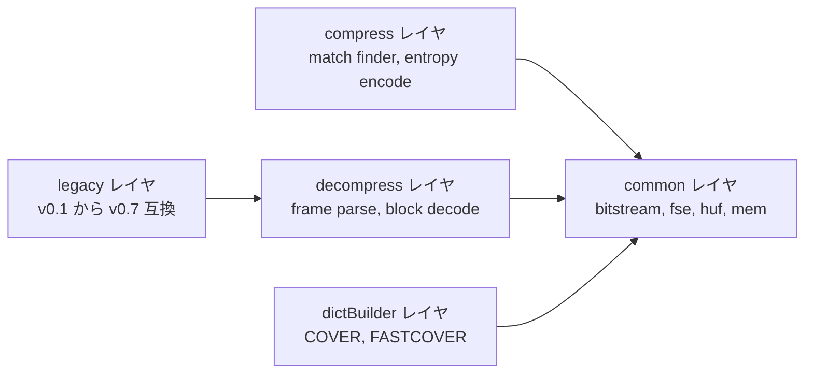
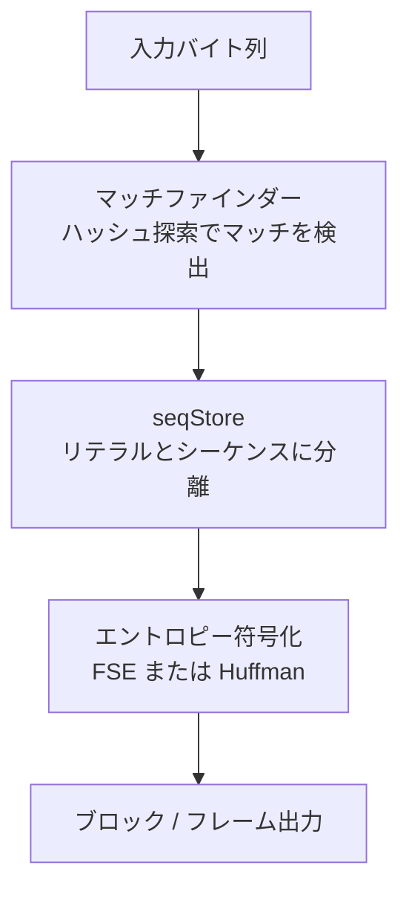

# 第1章 zstdとは何か：ライブラリ構成と圧縮の全体像

> **本章で読むソース**
>
> - [`lib/zstd.h`](https://github.com/facebook/zstd/blob/v1.5.7/lib/zstd.h)
> - [`lib/compress/clevels.h`](https://github.com/facebook/zstd/blob/v1.5.7/lib/compress/clevels.h)
> - [`lib/compress/zstd_compress_internal.h`](https://github.com/facebook/zstd/blob/v1.5.7/lib/compress/zstd_compress_internal.h)
> - [`lib/compress/zstd_compress.c`](https://github.com/facebook/zstd/blob/v1.5.7/lib/compress/zstd_compress.c)

## この章の狙い

zstdは、`ZSTD_compress`という1関数を呼ぶだけで使える圧縮ライブラリである。
その手軽さの裏側では、マッチファインダーとエントロピー符号化という性質の異なる2つの処理段が連携している。

本章では、まず簡易APIの3関数と圧縮レベルの扱いを`lib/zstd.h`から確認する。
続いて`lib/`配下のディレクトリ構成を通じて、ライブラリがどの層に分割されているかを把握する。
最後に、圧縮処理全体を2段構成として俯瞰し、以降の章で個別に読み進めるための地図を作る。

## 前提

読者は圧縮アルゴリズムの一般的な分類（LZ系、エントロピー符号化）について基礎知識があるものとする。
zstd固有の用語（**FSE**、**seqStore**、**CCtx**など）は本章で初出のたびに定義する。

## 簡易API：3関数と1マクロ

zstdの利用者が最初に触れるのは、`lib/zstd.h`が公開する単純なAPIである。
圧縮は`ZSTD_compress`、復号は`ZSTD_decompress`という1回の呼び出しで完結する。

[`lib/zstd.h` L160-L162](https://github.com/facebook/zstd/blob/v1.5.7/lib/zstd.h#L160-L162)

```c
ZSTDLIB_API size_t ZSTD_compress( void* dst, size_t dstCapacity,
                            const void* src, size_t srcSize,
                                  int compressionLevel);
```

`dst`と`dstCapacity`が出力先バッファ、`src`と`srcSize`が入力データ、`compressionLevel`が圧縮レベルである。
戻り値は書き込んだ圧縮後サイズか、失敗時のエラーコードのいずれかになる。

[`lib/zstd.h` L173-L174](https://github.com/facebook/zstd/blob/v1.5.7/lib/zstd.h#L173-L174)

```c
ZSTDLIB_API size_t ZSTD_decompress( void* dst, size_t dstCapacity,
                              const void* src, size_t compressedSize);
```

`ZSTD_decompress`は逆方向の変換であり、`compressedSize`には圧縮データの正確なサイズを渡す。
出力側の`dstCapacity`は復号後サイズの上限でよく、正確な値である必要はない。

呼び出し前に出力バッファを確保するとき、必要な最大サイズは`ZSTD_compressBound`で見積もる。

[`lib/zstd.h` L250](https://github.com/facebook/zstd/blob/v1.5.7/lib/zstd.h#L250)

```c
ZSTDLIB_API size_t ZSTD_compressBound(size_t srcSize); /*!< maximum compressed size in worst case single-pass scenario */
```

このバウンドは、ランダムなデータのように圧縮が効かず、むしろサイズが膨らむ最悪ケースを見込んだ値である。
`ZSTD_compressBound`が返す値以上のバッファを`ZSTD_compress`に渡しておけば、出力先不足による失敗を心配せずに済む。

復号側で出力バッファを確保するときは、フレームに埋め込まれた原本サイズを`ZSTD_getFrameContentSize`で取得できる。

[`lib/zstd.h` L205](https://github.com/facebook/zstd/blob/v1.5.7/lib/zstd.h#L205)

```c
ZSTDLIB_API unsigned long long ZSTD_getFrameContentSize(const void *src, size_t srcSize);
```

この関数はフレームヘッダーだけを読んで原本サイズを取り出す。
サイズがフレームに記録されていない場合（ストリーミング圧縮では省略されることがある）は`ZSTD_CONTENTSIZE_UNKNOWN`を返す。

zstdの関数は、成功時の値とエラーコードを同じ`size_t`の戻り値で表現する。
両者を区別するために`ZSTD_isError`を使う。

[`lib/zstd.h` L259](https://github.com/facebook/zstd/blob/v1.5.7/lib/zstd.h#L259)

```c
ZSTDLIB_API unsigned     ZSTD_isError(size_t result);      /*!< tells if a `size_t` function result is an error code */
```

エラーコードは、`size_t`が符号なし整数であることを利用して、正常な戻り値ではまず現れない巨大な値の範囲に押し込めてある。
`ZSTD_isError`はその範囲に入っているかを判定するだけなので、呼び出しごとの追加コストはほぼない。

最後に、ライブラリのバージョンは3つのマクロで表現される。

[`lib/zstd.h` L112-L114](https://github.com/facebook/zstd/blob/v1.5.7/lib/zstd.h#L112-L114)

```c
#define ZSTD_VERSION_MAJOR    1
#define ZSTD_VERSION_MINOR    5
#define ZSTD_VERSION_RELEASE  7
```

`ZSTD_VERSION_NUMBER`はこの3つを`MAJOR*100*100 + MINOR*100 + RELEASE`の形に合成した数値であり、コンパイル時にバージョンを比較したいアプリケーションが利用する。
実行時のバージョンは`ZSTD_versionNumber`と`ZSTD_versionString`で取得できる。
静的リンク時のヘッダーバージョンと動的リンク時の実行バイナリのバージョンがずれる可能性があるため、両者を区別できるようにしてある。

## lib配下のディレクトリ構成

`lib/`は機能ごとに次のディレクトリへ分割されている。

- **`common/`**：圧縮と復号の両方から使う共通部品（ビットストリーム操作の`bitstream.h`、FSEとHuffmanの共通定義である`fse.h`と`huf.h`、メモリアクセスの抽象化`mem.h`、CPU特性検出`cpu.h`）を置く。
- **`compress/`**：圧縮側の実装（マッチファインダーの`zstd_fast.c`と`zstd_lazy.c`と`zstd_opt.c`、シーケンスとリテラルのエントロピー符号化を担う`zstd_compress_sequences.c`と`zstd_compress_literals.c`、圧縮コンテキストを管理する`zstd_compress.c`、マルチスレッド圧縮の`zstdmt_compress.c`）を置く。
- **`decompress/`**：復号側の実装（フレーム全体を解析する`zstd_decompress.c`、ブロック単位で復号する`zstd_decompress_block.c`、辞書を保持する`ZSTD_DDict`を扱う`zstd_ddict.c`）を置く。
- **`dictBuilder/`**：サンプル集合から圧縮辞書を学習する`COVER`法（`cover.c`）と`FASTCOVER`法（`fastcover.c`）を実装する。
- **`legacy/`**：v0.1からv0.7までの過去フォーマットを復号するための互換コードを収め、新しいデータの圧縮には使わない。

この分割の要点は、**圧縮側と復号側が独立したディレクトリに分かれ、両者が`common/`だけを介してつながっている**ことである。
圧縮アルゴリズムを変更しても復号側のコードには触れずに済み、逆に復号側だけを対象にした最適化も圧縮側に影響しない。



## 圧縮パイプラインの全体像：2段構成

zstdの圧縮処理は、大きく分けて2つの段からなる。

1段目は**マッチファインダー**である。
入力データをハッシュテーブルやハッシュチェーンで走査し、過去に出現した同一のバイト列（マッチ）を探す。
マッチが見つからない区間は**リテラル**としてそのまま蓄積し、マッチが見つかった区間は「リテラル長」「オフセット」「マッチ長」の3つ組からなる**シーケンス**に変換する。
この結果は**seqStore**と呼ばれるバッファに蓄積される。

[`lib/compress/zstd_compress_internal.h` L98-L114](https://github.com/facebook/zstd/blob/v1.5.7/lib/compress/zstd_compress_internal.h#L98-L114)

```c
typedef struct {
    SeqDef* sequencesStart;
    SeqDef* sequences;      /* ptr to end of sequences */
    BYTE*  litStart;
    BYTE*  lit;             /* ptr to end of literals */
    BYTE*  llCode;
    BYTE*  mlCode;
    BYTE*  ofCode;
    size_t maxNbSeq;
    size_t maxNbLit;

    /* longLengthPos and longLengthType to allow us to represent either a single litLength or matchLength
     * in the seqStore that has a value larger than U16 (if it exists). To do so, we increment
     * the existing value of the litLength or matchLength by 0x10000.
     */
    ZSTD_longLengthType_e longLengthType;
    U32                   longLengthPos;  /* Index of the sequence to apply long length modification to */
} SeqStore_t;
```

`SeqStore_t`は、リテラルを積む`litStart`から`lit`までの領域と、シーケンスを積む`sequencesStart`から`sequences`までの領域を別々に持つ。
つまりマッチファインダーの出力は「生のバイト列」と「マッチの位置情報」という2種類のデータに分離された状態で保持される。

2段目は**エントロピー符号化**である。
seqStoreに積まれたリテラルとシーケンスの各要素（リテラル長、マッチ長、オフセットのコード）は、それぞれの出現頻度に応じて**FSE**（tANSベースのエントロピー符号化）または**Huffman**で符号化され、ビットストリームへ書き出される。

[`lib/compress/zstd_compress.c` L4415-L4419](https://github.com/facebook/zstd/blob/v1.5.7/lib/compress/zstd_compress.c#L4415-L4419)

```c
    cSize = ZSTD_entropyCompressSeqStore(&zc->seqStore,
            &zc->blockState.prevCBlock->entropy, &zc->blockState.nextCBlock->entropy,
            &zc->appliedParams,
            dst, dstCapacity,
            srcSize,
```

`ZSTD_compressBlock_internal`は、まずマッチファインダーを呼んでseqStoreを構築し（`ZSTD_buildSeqStore`）、その結果を`ZSTD_entropyCompressSeqStore`に渡してエントロピー符号化を行うという2段の呼び出しになっている。
符号化された出力はブロックヘッダーを付けて`dst`へ書き込まれ、フレーム全体が複数のブロックの連なりとして構成される。



この2段構成が速度と圧縮率のトレードオフに効くのは、**マッチ探索の労力とビット割り当ての最適化を独立に調整できる**ためである。
マッチファインダーは「どこまで探索を粘るか」だけを決め、リテラルやマッチ長の統計的な偏りをどう符号に落とし込むかはエントロピー符号化の段が独立に決める。
仮にこの2段を1つの処理に混ぜてしまうと、マッチ探索の途中経過ごとに符号長を計算し直す必要が生じ、探索を高速に打ち切ることが難しくなる。
段を分離しているからこそ、マッチファインダー側だけを軽量なものに差し替えても、エントロピー符号化側の実装を変えずに済む。

## 圧縮レベルとstrategy

マッチファインダーの探索方法は`ZSTD_strategy`という列挙型で選択する。

[`lib/zstd.h` L335-L347](https://github.com/facebook/zstd/blob/v1.5.7/lib/zstd.h#L335-L347)

```c
/* Compression strategies, listed from fastest to strongest */
typedef enum { ZSTD_fast=1,
               ZSTD_dfast=2,
               ZSTD_greedy=3,
               ZSTD_lazy=4,
               ZSTD_lazy2=5,
               ZSTD_btlazy2=6,
               ZSTD_btopt=7,
               ZSTD_btultra=8,
               ZSTD_btultra2=9
               /* note : new strategies _might_ be added in the future.
                         Only the order (from fast to strong) is guaranteed */
} ZSTD_strategy;
```

コメントにある通り、この列挙は「速い方から強い方へ」という順序だけが保証されている。
`fast`と`dfast`はハッシュテーブル1段の単純な探索、`greedy`と`lazy`系はハッシュチェーンをたどる探索、`btlazy2`以降は二分木を使う探索というように、後ろに行くほど1バイトあたりの探索コストが増える代わりに、より良いマッチを見つけやすくなる。

圧縮レベル1から22までのデフォルトパラメータは`ZSTD_defaultCParameters`というテーブルにまとめられている。

[`lib/compress/clevels.h` L25-L38](https://github.com/facebook/zstd/blob/v1.5.7/lib/compress/clevels.h#L25-L38)

```c
static const ZSTD_compressionParameters ZSTD_defaultCParameters[4][ZSTD_MAX_CLEVEL+1] = {
{   /* "default" - for any srcSize > 256 KB */
    /* W,  C,  H,  S,  L, TL, strat */
    { 19, 12, 13,  1,  6,  1, ZSTD_fast    },  /* base for negative levels */
    { 19, 13, 14,  1,  7,  0, ZSTD_fast    },  /* level  1 */
    { 20, 15, 16,  1,  6,  0, ZSTD_fast    },  /* level  2 */
    { 21, 16, 17,  1,  5,  0, ZSTD_dfast   },  /* level  3 */
    { 21, 18, 18,  1,  5,  0, ZSTD_dfast   },  /* level  4 */
    { 21, 18, 19,  3,  5,  2, ZSTD_greedy  },  /* level  5 */
    { 21, 18, 19,  3,  5,  4, ZSTD_lazy    },  /* level  6 */
    { 21, 19, 20,  4,  5,  8, ZSTD_lazy    },  /* level  7 */
    { 21, 19, 20,  4,  5, 16, ZSTD_lazy2   },  /* level  8 */
    { 22, 20, 21,  4,  5, 16, ZSTD_lazy2   },  /* level  9 */
```

レベルが上がるにつれてstrategyが`fast`から`lazy2`、`btopt`、`btultra2`へと切り替わっていくことが読み取れる。
ウィンドウサイズ（W）やハッシュテーブルのビット数（C、H）も同時に大きくなり、探索範囲そのものが広がる。
このテーブルとstrategyごとの探索アルゴリズムの詳細は、第4部（マッチファインダー）で個別に扱う。

## まとめ

zstdの外側から見える顔は、`ZSTD_compress`と`ZSTD_decompress`という2つの単純な関数である。
その内部は`common`、`compress`、`decompress`、`dictBuilder`、`legacy`という役割ごとのディレクトリに分割され、圧縮側と復号側が独立に進化できる構造になっている。

圧縮処理そのものは、マッチファインダーがseqStoreへリテラルとシーケンスを分離して蓄積する段と、その内容をFSEやHuffmanで符号化する段という2段構成を取る。
この分離によって、探索の強さ（strategy）と符号化の効率を別々のパラメータとして調整できる。
圧縮レベル1から22は、この2つの段のパラメータをまとめて切り替えるプリセットである。

## 関連する章

- 第2章 [フレームフォーマット](../part00-overview/02-frame-format.md)
- 第11章 [CCtxとパラメータ管理](../part03-compress-core/11-cctx-params.md)
