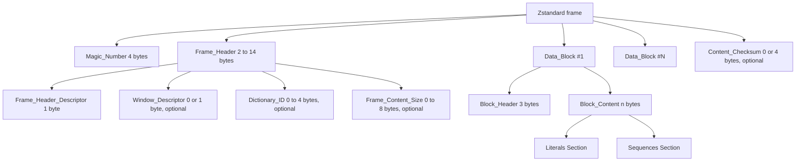

# 第2章 フレームフォーマット：frame、block、エントロピーテーブルの配置

> **本章で読むソース**
>
> - [`doc/zstd_compression_format.md`](https://github.com/facebook/zstd/blob/v1.5.7/doc/zstd_compression_format.md)
> - [`lib/zstd.h`](https://github.com/facebook/zstd/blob/v1.5.7/lib/zstd.h)
> - [`lib/common/zstd_internal.h`](https://github.com/facebook/zstd/blob/v1.5.7/lib/common/zstd_internal.h)
> - [`lib/decompress/zstd_decompress.c`](https://github.com/facebook/zstd/blob/v1.5.7/lib/decompress/zstd_decompress.c)

## この章の狙い

zstd が出力するバイト列は、magic number から始まり、frame、block、セクションという入れ子構造を持つ。
本章では、この入れ子構造を仕様書とデコーダのコードの両面から確認する。
frame header の可変長フィールドがどのビットで切り替わるか、block header の3バイトが何を運ぶか、圧縮 block の中身がどう分かれているかを、実装のパース処理に沿って追う。
リテラルとシーケンスそれぞれの符号化の詳細は第13章、第14章に譲り、本章では両者を格納する外側の器の形に絞る。

## 前提

**frame** は、zstd が一つの独立した圧縮単位に与える名前である。
1個以上の frame を連結すれば、それがそのまま zstd の圧縮ファイルになる。
frame の内部はさらに1個以上の **block** に分割される。
block は frame 内で前の block に依存してよいが、frame をまたいだ依存は持たない。

## Magic Number と frame の全体構造

frame は `Magic_Number` に始まり、`Frame_Header`、1個以上の `Data_Block`、そして任意の `Content_Checksum` で終わる。
仕様書は全体の並びを次の表で示す。

[`doc/zstd_compression_format.md` L107-L112](https://github.com/facebook/zstd/blob/v1.5.7/doc/zstd_compression_format.md#L107-L112)

```text
## Zstandard frames
The structure of a single Zstandard frame is following:

| `Magic_Number` | `Frame_Header` |`Data_Block`| [More data blocks] | [`Content_Checksum`] |
|:--------------:|:--------------:|:----------:| ------------------ |:--------------------:|
|  4 bytes       |  2-14 bytes    |  n bytes   |                    |     0-4 bytes        |
```

`Magic_Number` は4バイトのリトルエンディアン値で、通常の frame は `0xFD2FB528` を持つ。
この定数は `lib/zstd.h` にマクロとして定義されている。

[`lib/zstd.h` L142-L145](https://github.com/facebook/zstd/blob/v1.5.7/lib/zstd.h#L142-L145)

```c
#define ZSTD_MAGICNUMBER            0xFD2FB528    /* valid since v0.8.0 */
#define ZSTD_MAGIC_DICTIONARY       0xEC30A437    /* valid since v0.7.0 */
#define ZSTD_MAGIC_SKIPPABLE_START  0x184D2A50    /* all 16 values, from 0x184D2A50 to 0x184D2A5F, signal the beginning of a skippable frame */
#define ZSTD_MAGIC_SKIPPABLE_MASK   0xFFFFFFF0
```

`ZSTD_MAGIC_SKIPPABLE_START` は16通りの値（`0x184D2A50` から `0x184D2A5F`）のいずれもが **skippable frame** の開始を示すことをコメントで説明している。
skippable frame は圧縮データではなく、ユーザー定義のメタデータを運ぶための frame である。
デコーダは `magic & ZSTD_MAGIC_SKIPPABLE_MASK` の結果をこの定数と比較し、下位4ビットを frame の種別を問わないマジックの一部として無視する。
`ZSTD_MAGIC_DICTIONARY` は圧縮データの frame ではなく、辞書ファイルの先頭を識別するための別の magic number であり、通常の圧縮 frame とは独立に定義されている。

frame 全体を Mermaid で図示すると次のようになる。



## Frame_Header：可変長ヘッダのビット割り当て

`Frame_Header` は2バイトから14バイトまで伸縮する。
最初の1バイトが `Frame_Header_Descriptor` であり、これを読めば残りのフィールドの有無と長さが確定する。

[`doc/zstd_compression_format.md` L146-L162](https://github.com/facebook/zstd/blob/v1.5.7/doc/zstd_compression_format.md#L146-L162)

```text
#### `Frame_Header_Descriptor`

The first header's byte is called the `Frame_Header_Descriptor`.
It describes which other fields are present.
Decoding this byte is enough to tell the size of `Frame_Header`.

| Bit number | Field name                |
| ---------- | ----------                |
| 7-6        | `Frame_Content_Size_flag` |
| 5          | `Single_Segment_flag`     |
| 4          | `Unused_bit`              |
| 3          | `Reserved_bit`            |
| 2          | `Content_Checksum_flag`   |
| 1-0        | `Dictionary_ID_flag`      |

In this table, bit 7 is the highest bit, while bit 0 is the lowest one.
```

ビットフィールドを表にまとめると次のとおりである。

| ビット | フィールド名 | 意味 |
| --- | --- | --- |
| 7-6 | `Frame_Content_Size_flag` | `Frame_Content_Size` のバイト数を選ぶ2ビット |
| 5 | `Single_Segment_flag` | 立っていれば `Window_Descriptor` を省略し、単一メモリ領域での展開を要求する |
| 4 | `Unused_bit` | 将来のために予約。デコーダは解釈してはならない |
| 3 | `Reserved_bit` | 将来のために予約。現バージョンでは0でなければならない |
| 2 | `Content_Checksum_flag` | frame 末尾の xxHash-64 チェックサムの有無 |
| 1-0 | `Dictionary_ID_flag` | `Dictionary_ID` のバイト数を選ぶ2ビット |

`Frame_Content_Size_flag` の2ビットは、直接バイト数を表さない点に注意がいる。
値0のときは `Single_Segment_flag` の状態に応じて0バイトか1バイトに分岐し、値1から3はそれぞれ2、4、8バイトに対応する。

デコーダ側の実装は、この分岐をそのままコードに落とし込んでいる。
`ZSTD_frameHeaderSize_internal` は `Frame_Header_Descriptor` の1バイトだけを読み、そこから frame header 全体の長さを計算する。

[`lib/decompress/zstd_decompress.c` L416-L429](https://github.com/facebook/zstd/blob/v1.5.7/lib/decompress/zstd_decompress.c#L416-L429)

```c
static size_t ZSTD_frameHeaderSize_internal(const void* src, size_t srcSize, ZSTD_format_e format)
{
    size_t const minInputSize = ZSTD_startingInputLength(format);
    RETURN_ERROR_IF(srcSize < minInputSize, srcSize_wrong, "");

    {   BYTE const fhd = ((const BYTE*)src)[minInputSize-1];
        U32 const dictID= fhd & 3;
        U32 const singleSegment = (fhd >> 5) & 1;
        U32 const fcsId = fhd >> 6;
        return minInputSize + !singleSegment
             + ZSTD_did_fieldSize[dictID] + ZSTD_fcs_fieldSize[fcsId]
             + (singleSegment && !fcsId);
    }
}
```

`ZSTD_did_fieldSize` と `ZSTD_fcs_fieldSize` は、`Dictionary_ID_flag` と `Frame_Content_Size_flag` の2ビット値をそのままインデックスにして対応バイト数を引く配列である。

[`lib/common/zstd_internal.h` L79-L80](https://github.com/facebook/zstd/blob/v1.5.7/lib/common/zstd_internal.h#L79-L80)

```c
static UNUSED_ATTR const size_t ZSTD_fcs_fieldSize[4] = { 0, 2, 4, 8 };
static UNUSED_ATTR const size_t ZSTD_did_fieldSize[4] = { 0, 1, 2, 4 };
```

`+ !singleSegment` は `Window_Descriptor` の1バイトを、`singleSegment` でないときだけ加える。
`+ (singleSegment && !fcsId)` は、`Single_Segment_flag` が立っているのに `Frame_Content_Size_flag` が0のとき、`Frame_Content_Size` を1バイトだけ確保する分岐を表す。
これは仕様書の「`Single_Segment_flag` が立っているとき `Frame_Content_Size` は必ず存在する」という規定に対応する。
1行の式の中に、仕様書の複数の条件分岐が畳み込まれている。

続く `ZSTD_getFrameHeader_advanced` が、この長さ計算をもとに実際にフィールドを取り出す。

[`lib/decompress/zstd_decompress.c` L497-L536](https://github.com/facebook/zstd/blob/v1.5.7/lib/decompress/zstd_decompress.c#L497-L536)

```c
    {   BYTE const fhdByte = ip[minInputSize-1];
        size_t pos = minInputSize;
        U32 const dictIDSizeCode = fhdByte&3;
        U32 const checksumFlag = (fhdByte>>2)&1;
        U32 const singleSegment = (fhdByte>>5)&1;
        U32 const fcsID = fhdByte>>6;
        U64 windowSize = 0;
        U32 dictID = 0;
        U64 frameContentSize = ZSTD_CONTENTSIZE_UNKNOWN;
        RETURN_ERROR_IF((fhdByte & 0x08) != 0, frameParameter_unsupported,
                        "reserved bits, must be zero");

        if (!singleSegment) {
            BYTE const wlByte = ip[pos++];
            U32 const windowLog = (wlByte >> 3) + ZSTD_WINDOWLOG_ABSOLUTEMIN;
            RETURN_ERROR_IF(windowLog > ZSTD_WINDOWLOG_MAX, frameParameter_windowTooLarge, "");
            windowSize = (1ULL << windowLog);
            windowSize += (windowSize >> 3) * (wlByte&7);
        }
        switch(dictIDSizeCode)
        {
            default:
                assert(0);  /* impossible */
                ZSTD_FALLTHROUGH;
            case 0 : break;
            case 1 : dictID = ip[pos]; pos++; break;
            case 2 : dictID = MEM_readLE16(ip+pos); pos+=2; break;
            case 3 : dictID = MEM_readLE32(ip+pos); pos+=4; break;
        }
        switch(fcsID)
        {
            default:
                assert(0);  /* impossible */
                ZSTD_FALLTHROUGH;
            case 0 : if (singleSegment) frameContentSize = ip[pos]; break;
            case 1 : frameContentSize = MEM_readLE16(ip+pos)+256; break;
            case 2 : frameContentSize = MEM_readLE32(ip+pos); break;
            case 3 : frameContentSize = MEM_readLE64(ip+pos); break;
        }
        if (singleSegment) windowSize = frameContentSize;
```

`(fhdByte & 0x08) != 0` の判定が `Reserved_bit`（ビット3）に対応し、これが立っていればエラーとして扱う。
`fcsID` が1のとき `MEM_readLE16(ip+pos)+256` としてオフセット256を加算する処理は、仕様書の「`FCS_Field_Size` が2バイトのとき、256のオフセットを加える」という規定をそのまま実装したものである。
2バイトの値域を0-255の1バイト表現と重複させず、256-65791の範囲に押し出すための工夫であり、こうすることで1バイト表現と2バイト表現のどちらでも小さい値を表せるようにしつつ値域を無駄にしない。

## Window_Descriptor：メモリ上限の宣言

`Single_Segment_flag` が立っていない場合、`Frame_Header_Descriptor` の直後に `Window_Descriptor` が1バイト続く。
仕様書はこのバイトを `Exponent` と `Mantissa` に分け、次の式で `Window_Size` を導出すると定めている。

[`doc/zstd_compression_format.md` L245-L258](https://github.com/facebook/zstd/blob/v1.5.7/doc/zstd_compression_format.md#L245-L258)

````text
| Bit numbers |     7-3    |     2-0    |
| ----------- | ---------- | ---------- |
| Field name  | `Exponent` | `Mantissa` |

The minimum memory buffer size is called `Window_Size`.
It is described by the following formulas :
```
windowLog = 10 + Exponent;
windowBase = 1 << windowLog;
windowAdd = (windowBase / 8) * Mantissa;
Window_Size = windowBase + windowAdd;
```
The minimum `Window_Size` is 1 KB.
The maximum `Window_Size` is `(1<<41) + 7*(1<<38)` bytes, which is 3.75 TB.
````

デコーダはこの式を上記コードの `if (!singleSegment)` の枝でそのまま計算している。
`windowLog` は指数部から2の冪の桁を決め、`wlByte&7` で取り出した仮数部（0-7）が、その桁の8分の1刻みで上乗せする量を決める。
1バイトという小さな固定幅で、1 KBから3.75 TBまでの範囲を、指数と仮数の組み合わせで粗く連続的に表現している。

`Window_Descriptor` が担っているのは、単なる情報提供ではない。
デコーダは `Window_Size` だけの連続領域を確保すれば、その frame をどこまで展開しても previous data への参照が範囲外に出ないと保証される。
逆に言えば、デコーダは frame の中身を一切読まずに、この1バイトだけで必要なメモリ量の上限を知り、確保するかどうかを frame 全体を処理する前に決められる。
これにより、圧縮時にどれだけ大きなウィンドウで探索したかに関わらず、展開側は最初の数バイトを見るだけで「このメモリ量を超えるなら拒否する」という判断を下せる。
巨大な `Window_Size` を要求する frame を無条件に展開してメモリを枯渇させられる、という攻撃面を狭める効果もここから生まれる。

## Block_Header：3バイトに畳み込まれた3つの情報

`Magic_Number` と `Frame_Header` の後には、1個以上の block が続く。
block は3バイトの `Block_Header` と、それに続く `Block_Content` からなる。

[`doc/zstd_compression_format.md` L327-L340](https://github.com/facebook/zstd/blob/v1.5.7/doc/zstd_compression_format.md#L327-L340)

```text
The structure of a block is as follows:

| `Block_Header` | `Block_Content` |
|:--------------:|:---------------:|
|    3 bytes     |     n bytes     |

__`Block_Header`__

`Block_Header` uses 3 bytes, written using __little-endian__ convention.
It contains 3 fields :

| `Last_Block` | `Block_Type` | `Block_Size` |
|:------------:|:------------:|:------------:|
|    bit 0     |  bits 1-2    |  bits 3-23   |
```

`Last_Block` は frame の最後の block であるかを示す1ビット、`Block_Type` は続く2ビット、`Block_Size` は残り21ビットである。
この3バイト24ビットに、block の終端判定、種別、サイズという3種類の情報が詰め込まれている。

`Block_Header` のサイズはコード側でもマクロとして固定されている。

[`lib/common/zstd_internal.h` L84-L86](https://github.com/facebook/zstd/blob/v1.5.7/lib/common/zstd_internal.h#L84-L86)

```c
#define ZSTD_BLOCKHEADERSIZE 3   /* C standard doesn't allow `static const` variable to be init using another `static const` variable */
static UNUSED_ATTR const size_t ZSTD_blockHeaderSize = ZSTD_BLOCKHEADERSIZE;
typedef enum { bt_raw, bt_rle, bt_compressed, bt_reserved } blockType_e;
```

`blockType_e` の4値は、仕様書が定める `Block_Type` の4パターンにそのまま対応する。

[`doc/zstd_compression_format.md` L355-L372](https://github.com/facebook/zstd/blob/v1.5.7/doc/zstd_compression_format.md#L355-L372)

```text
|    Value     |      0      |      1      |         2          |     3     |
| ------------ | ----------- | ----------- | ------------------ | --------- |
| `Block_Type` | `Raw_Block` | `RLE_Block` | `Compressed_Block` | `Reserved`|

- `Raw_Block` - this is an uncompressed block.
  `Block_Content` contains `Block_Size` bytes.

- `RLE_Block` - this is a single byte, repeated `Block_Size` times.
  `Block_Content` consists of a single byte.
  On the decompression side, this byte must be repeated `Block_Size` times.

- `Compressed_Block` - this is a [Zstandard compressed block](#compressed-blocks),
  explained later on.
  `Block_Size` is the length of `Block_Content`, the compressed data.
  The decompressed size is not known,
  but its maximum possible value is guaranteed (see below)

- `Reserved` - this is not a block.
  This value cannot be used with current version of this specification.
  If such a value is present, it is considered corrupted data.
```

`bt_raw`（`Raw_Block`）と `bt_rle`（`RLE_Block`）は、圧縮アルゴリズムを一切通さない block 種別である。
これが効くのは、既に圧縮された画像やランダムに近いデータのように、それ以上圧縮しても縮まらない、あるいは同じバイトが延々と続く区間を扱うときである。
そのような区間ではエントロピー符号化やマッチ探索を試みるだけ無駄であり、`Raw_Block` ならもとのバイト列をそのまま3バイトのヘッダとともに置くだけで済み、`RLE_Block` なら1バイトと繰り返し回数だけで任意長の同一バイト列を表せる。
block ごとに種別を切り替えられる設計により、圧縮器は block 単位で「圧縮を試みた結果が入力より縮まらないなら、その block だけ `Raw_Block` に落とす」という判断を下せる。
frame 全体を1つの符号化方式に固定する設計であれば、こうした部分的な悪条件のたびに frame 全体の圧縮率が引きずられてしまうところを、block 単位の切り替えが局所化している。

`Block_Size` の意味も `Block_Type` によって変わる。
`Raw_Block` と `Compressed_Block` では `Block_Content` のバイト数そのものだが、`RLE_Block` では「繰り返し回数」に読み替えられる。
同じビット位置が指す量の単位を、隣接するビットフィールドの値によって切り替える設計であり、これによって `RLE_Block` は本来21ビットで表現できるバイト数の上限をはるかに超える繰り返し長を、3バイトのヘッダだけで表現できる。

`Block_Content` の最大長は `Block_Maximum_Size` として仕様に定められ、`Window_Size` と128 KBの小さいほうで決まる。

[`doc/zstd_compression_format.md` L387-L399](https://github.com/facebook/zstd/blob/v1.5.7/doc/zstd_compression_format.md#L387-L399)

```text
__`Block_Content`__ and __`Block_Maximum_Size`__

The size of `Block_Content` is limited by `Block_Maximum_Size`,
which is the smallest of:
-  `Window_Size`
-  128 KB

`Block_Maximum_Size` is constant for a given frame.
This maximum is applicable to both the decompressed size
and the compressed size of any block in the frame.
```

デコーダはこの上限を frame header の解析時点で計算し、`ZSTD_FrameHeader` 構造体の `blockSizeMax` に格納する。

[`lib/decompress/zstd_decompress.c` L543-L547](https://github.com/facebook/zstd/blob/v1.5.7/lib/decompress/zstd_decompress.c#L543-L547)

```c
        zfhPtr->frameType = ZSTD_frame;
        zfhPtr->frameContentSize = frameContentSize;
        zfhPtr->windowSize = windowSize;
        zfhPtr->blockSizeMax = (unsigned) MIN(windowSize, ZSTD_BLOCKSIZE_MAX);
        zfhPtr->dictID = dictID;
```

frame の先頭で block の最大長が確定するからこそ、デコーダは以降どの block が来ても使い回せる固定長バッファを一度だけ確保できる。
block ごとにバッファを再確保したり伸長したりする必要がない、という点も、frame header に情報を前置きする設計の利点である。

## Compressed_Block の内部：Literals Section と Sequences Section

`Block_Type` が `Compressed_Block` のとき、`Block_Content` はさらに2つのセクションに分かれる。

[`doc/zstd_compression_format.md` L403-L412](https://github.com/facebook/zstd/blob/v1.5.7/doc/zstd_compression_format.md#L403-L412)

```text
Compressed Blocks
-----------------
To decompress a compressed block, the compressed size must be provided
from `Block_Size` field within `Block_Header`.

A compressed block consists of 2 sections :
- [Literals Section](#literals-section)
- [Sequences Section](#sequences-section)

The results of the two sections are then combined to produce the decompressed
data in [Sequence Execution](#sequence-execution)
```

**Literals Section** は、マッチとして参照されなかった生のバイト列（リテラル）を格納する区画である。
**Sequences Section** は、リテラル長、マッチ長、オフセットの3つ組（シーケンス）を並べた区画である。
展開器はこの2つを合成し、リテラルをそのまま出力しながら、シーケンスが指す過去の位置からマッチ長ぶんをコピーすることで元データを再構成する。
両セクションの内部フォーマットと、エントロピー符号化テーブルの詳細な配置は第13章で扱う。

Literals Section の先頭では、後続のリテラル列がどう符号化されているかを `SymbolEncodingType_e` に対応する2ビットで示す。

[`lib/common/zstd_internal.h` L94](https://github.com/facebook/zstd/blob/v1.5.7/lib/common/zstd_internal.h#L94)

```c
typedef enum { set_basic, set_rle, set_compressed, set_repeat } SymbolEncodingType_e;
```

`set_basic` は無圧縮、`set_rle` は単一バイトの繰り返し、`set_compressed` は Huffman テーブルを新規に構築して符号化したことを示す。
`set_repeat` は、直前の block で使った Huffman テーブルをそのまま再利用することを示す。
block をまたいでテーブルを使い回せるこの仕組みにより、似た内容が続く block では、テーブルそのものを毎回書き出すコストを避けられる。
テーブルの再構築や再送出には決して小さくないバイト数がかかるため、`set_repeat` は小さい block が連続する場面で圧縮率に効いてくる。

## まとめ

zstd の圧縮データは、magic number を先頭に持つ frame として始まり、frame header の1バイト目（`Frame_Header_Descriptor`）がその後に続くフィールドの有無とバイト数をすべて決定する。
`Window_Descriptor` は指数と仮数の組で `Window_Size` を表現し、デコーダが frame の中身を読む前にメモリ上限を知ることを可能にする。
frame の中身は3バイトの `Block_Header` で区切られた block の並びであり、`Block_Type` によって無圧縮、RLE、圧縮という3種類の扱いを block ごとに切り替えられる。
圧縮 block はさらに Literals Section と Sequences Section に分かれ、リテラルの符号化方式は `set_basic` から `set_repeat` までの4種類で、block をまたいだテーブル再利用を可能にしている。

## 関連する章

- [第1章 zstd とは何か](01-what-is-zstd.md)
- [第13章 リテラルの符号化](../part03-compress-core/13-literals-encoding.md)
- [第22章 frame の展開](../part06-decompress/22-decompress-frame.md)
