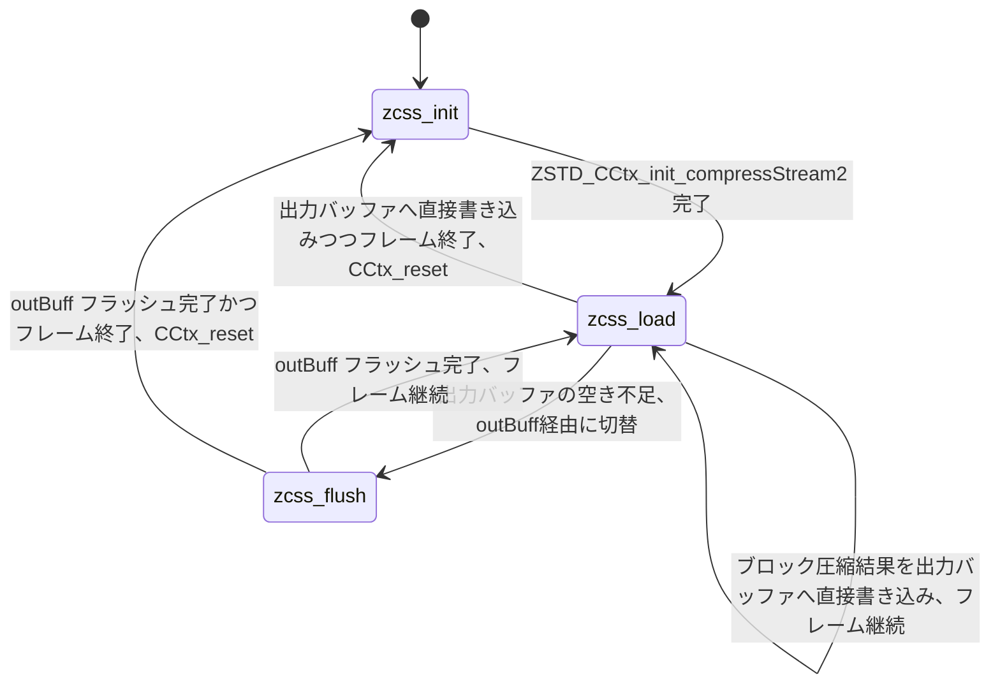

# 第3章 公開 API とストリーミングの流れ

> **本章で読むソース**
>
> - [`lib/zstd.h`](https://github.com/facebook/zstd/blob/v1.5.7/lib/zstd.h)
> - [`lib/compress/zstd_compress.c`](https://github.com/facebook/zstd/blob/v1.5.7/lib/compress/zstd_compress.c)
> - [`lib/compress/zstd_compress_internal.h`](https://github.com/facebook/zstd/blob/v1.5.7/lib/compress/zstd_compress_internal.h)

## この章の狙い

第1章と第2章では、zstd が生成するフレームとブロックの静的な構造を見た。
本章では視点を変え、アプリケーションが `ZSTD_CCtx`（圧縮コンテキスト）を介して、そのフレームをどう組み立てていくかを追う。

zstd の圧縮 API には、一括圧縮とストリーミング圧縮の二系統がある。
本章はストリーミング側、すなわち `ZSTD_CCtx_setParameter` でパラメータを積み上げ、`ZSTD_compressStream2` を繰り返し呼んで入力を消費していく経路を扱う。
入出力バッファの境界管理と、`ZSTD_CCtx` 内部の状態遷移が主題である。

## 前提

`ZSTD_CCtx` は不透明型として公開されている。

[`lib/zstd.h` L280-L281](https://github.com/facebook/zstd/blob/v1.5.7/lib/zstd.h#L280-L281)

```c
typedef struct ZSTD_CCtx_s ZSTD_CCtx;
ZSTDLIB_API ZSTD_CCtx* ZSTD_createCCtx(void);
```

`ZSTD_createCCtx()` で確保したコンテキストは1回の圧縮だけでなく、複数フレームにわたって使い回せる。
コメントにある通り、`ZSTD_CStream` は `ZSTD_CCtx` と同一の型であり、ストリーミング用と一括圧縮用でコンテキストを分ける必要はない。

[`lib/zstd.h` L776-L777](https://github.com/facebook/zstd/blob/v1.5.7/lib/zstd.h#L776-L777)

```c
typedef ZSTD_CCtx ZSTD_CStream;  /**< CCtx and CStream are now effectively same object (>= v1.3.0) */
                                 /* Continue to distinguish them for compatibility with older versions <= v1.2.0 */
```

## パラメータの設定：ZSTD_CCtx_setParameter

圧縮レベルやウィンドウサイズといった設定は、個別の関数引数ではなく `ZSTD_cParameter` という列挙体と `ZSTD_CCtx_setParameter` によって行う。

[`lib/zstd.h` L355-L363](https://github.com/facebook/zstd/blob/v1.5.7/lib/zstd.h#L355-L363)

```c
    ZSTD_c_compressionLevel=100, /* Set compression parameters according to pre-defined cLevel table.
                              * Note that exact compression parameters are dynamically determined,
                              * depending on both compression level and srcSize (when known).
                              * Default level is ZSTD_CLEVEL_DEFAULT==3.
                              * Special: value 0 means default, which is controlled by ZSTD_CLEVEL_DEFAULT.
                              * Note 1 : it's possible to pass a negative compression level.
                              * Note 2 : setting a level does not automatically set all other compression parameters
                              *   to default. Setting this will however eventually dynamically impact the compression
                              *   parameters which have not been manually set. The manually set
```

`ZSTD_c_compressionLevel` のほかにも、`ZSTD_c_windowLog`（ウィンドウサイズ）、`ZSTD_c_hashLog` / `ZSTD_c_chainLog`（ハッシュテーブルと探索テーブルのサイズ）、`ZSTD_c_strategy`（マッチファインダーの種別）、`ZSTD_c_enableLongDistanceMatching`（LDM の有効化）、`ZSTD_c_nbWorkers`（マルチスレッド圧縮のワーカー数）など、約20種類のパラメータが同じ enum に並ぶ。
ヘッダのコメントが明言する通り、これらのパラメータは一度設定すると次に `ZSTD_CCtx_reset()` するまで有効な、いわば「積み立て式」の設定である。

[`lib/zstd.h` L320-L326](https://github.com/facebook/zstd/blob/v1.5.7/lib/zstd.h#L320-L326)

```c
/* API design :
 *   Parameters are pushed one by one into an existing context,
 *   using ZSTD_CCtx_set*() functions.
 *   Pushed parameters are sticky : they are valid for next compressed frame, and any subsequent frame.
 *   "sticky" parameters are applicable to `ZSTD_compress2()` and `ZSTD_compressStream*()` !
 *   __They do not apply to one-shot variants such as ZSTD_compressCCtx()__ .
 *
```

`ZSTD_CCtx_setParameter` の実装を見ると、値は圧縮パラメータの構造体へ即座に反映されるわけではない。

[`lib/compress/zstd_compress.c` L708-L719](https://github.com/facebook/zstd/blob/v1.5.7/lib/compress/zstd_compress.c#L708-L719)

```c
size_t ZSTD_CCtx_setParameter(ZSTD_CCtx* cctx, ZSTD_cParameter param, int value)
{
    DEBUGLOG(4, "ZSTD_CCtx_setParameter (%i, %i)", (int)param, value);
    if (cctx->streamStage != zcss_init) {
        if (ZSTD_isUpdateAuthorized(param)) {
            cctx->cParamsChanged = 1;
        } else {
            RETURN_ERROR(stage_wrong, "can only set params in cctx init stage");
    }   }

    switch(param)
    {
```

すでに圧縮を開始したコンテキスト（`streamStage` が `zcss_init` 以外）でパラメータを変更しようとすると、原則としてエラーになる。
例外は `ZSTD_isUpdateAuthorized` が許可する一部のパラメータで、マルチスレッド圧縮中に次のジョブから反映させる用途に使われる。
関数の末尾は次のように、値をそのまま `cctx->requestedParams` へ書き込むだけで終わる。

[`lib/compress/zstd_compress.c` L765-L767](https://github.com/facebook/zstd/blob/v1.5.7/lib/compress/zstd_compress.c#L765-L767)

```c
    default: RETURN_ERROR(parameter_unsupported, "unknown parameter");
    }
    return ZSTD_CCtxParams_setParameter(&cctx->requestedParams, param, value);
```

`requestedParams` は「ユーザーが要求した設定」を保持するだけの構造体であり、探索テーブルのサイズや実際のマッチファインダーの選択にまでは踏み込まない。
この設計を第11章で `ZSTD_CCtx_params` として詳しく扱う。

## パラメータ適用の遅延という最適化

`requestedParams` に積んだ値が、探索テーブルのサイズや実メモリ確保を伴う `appliedParams` へ変換されるのは、圧縮が実際に始まる瞬間である。
ストリーミング圧縮の初期化関数 `ZSTD_CCtx_init_compressStream2` は、その変換を次のように行う。

[`lib/compress/zstd_compress.c` L6349-L6372](https://github.com/facebook/zstd/blob/v1.5.7/lib/compress/zstd_compress.c#L6349-L6372)

```c
static size_t ZSTD_CCtx_init_compressStream2(ZSTD_CCtx* cctx,
                                             ZSTD_EndDirective endOp,
                                             size_t inSize)
{
    ZSTD_CCtx_params params = cctx->requestedParams;
    ZSTD_prefixDict const prefixDict = cctx->prefixDict;
    FORWARD_IF_ERROR( ZSTD_initLocalDict(cctx) , ""); /* Init the local dict if present. */
    ZSTD_memset(&cctx->prefixDict, 0, sizeof(cctx->prefixDict));   /* single usage */
    assert(prefixDict.dict==NULL || cctx->cdict==NULL);    /* only one can be set */
    if (cctx->cdict && !cctx->localDict.cdict) {
        /* Let the cdict's compression level take priority over the requested params.
         * But do not take the cdict's compression level if the "cdict" is actually a localDict
         * generated from ZSTD_initLocalDict().
         */
        params.compressionLevel = cctx->cdict->compressionLevel;
    }
    DEBUGLOG(4, "ZSTD_CCtx_init_compressStream2 : transparent init stage");
    if (endOp == ZSTD_e_end) cctx->pledgedSrcSizePlusOne = inSize + 1;  /* auto-determine pledgedSrcSize */

    {   size_t const dictSize = prefixDict.dict
                ? prefixDict.dictSize
                : (cctx->cdict ? cctx->cdict->dictContentSize : 0);
        ZSTD_CParamMode_e const mode = ZSTD_getCParamMode(cctx->cdict, &params, cctx->pledgedSrcSizePlusOne - 1);
        params.cParams = ZSTD_getCParamsFromCCtxParams(
                &params, cctx->pledgedSrcSizePlusOne-1,
                dictSize, mode);
    }
```

`ZSTD_getCParamsFromCCtxParams` は圧縮レベルと入力サイズの両方から、ハッシュテーブルサイズやマッチファインダーの戦略を決定するテーブル引きを行う。
これは `ZSTD_c_compressionLevel` のコメントが「exact compression parameters are dynamically determined, depending on both compression level and srcSize」と述べていた挙動そのものである。

つまり `ZSTD_CCtx_setParameter(cctx, ZSTD_c_compressionLevel, 9)` を呼んだ時点では、まだハッシュテーブルは1バイトも確保されない。
入力サイズが確定してから最終的な `cParams` を決めることで、小さな入力に大きなウィンドウ用のテーブルを確保してしまう無駄を避けている。
これが本章で扱う最適化の要点である。
パラメータ設定と実メモリ確保を分離し、確保のタイミングを入力サイズが判明する直前まで遅らせることで、テーブルサイズの決定に入力サイズの情報を使えるようにしつつ、無駄な再確保も避けている。

なお `endOp == ZSTD_e_end` の場合、`inSize` がそのまま `pledgedSrcSizePlusOne`（入力サイズの申告値）に採用される。
一括で全データを渡す呼び出しでは、ユーザーが明示的に `ZSTD_CCtx_setPledgedSrcSize()` を呼ばなくても、入力サイズがそのままフレームヘッダに書き込まれる仕組みである。

## 入出力バッファ：ZSTD_inBuffer と ZSTD_outBuffer

ストリーミング API は入出力を次の2つの構造体で表現する。

[`lib/zstd.h` L701-L711](https://github.com/facebook/zstd/blob/v1.5.7/lib/zstd.h#L701-L711)

```c
typedef struct ZSTD_inBuffer_s {
  const void* src;    /**< start of input buffer */
  size_t size;        /**< size of input buffer */
  size_t pos;         /**< position where reading stopped. Will be updated. Necessarily 0 <= pos <= size */
} ZSTD_inBuffer;

typedef struct ZSTD_outBuffer_s {
  void*  dst;         /**< start of output buffer */
  size_t size;        /**< size of output buffer */
  size_t pos;         /**< position where writing stopped. Will be updated. Necessarily 0 <= pos <= size */
} ZSTD_outBuffer;
```

どちらも「バッファ全体」と「そこまで処理が進んだ位置」を `pos` で表す。
呼び出し側はバッファそのものの所有権を渡すのではなく、`src` / `dst` が指す既存のメモリ領域を渡すだけでよい。
zstd 側は `pos` を更新して返すだけなので、呼び出し側と zstd の間でデータのコピーや所有権の移動を伴わずに、同じメモリ領域を指すポインタと位置だけをやり取りできる。
1回の呼び出しで入力を使い切れなかった場合は `input->pos < input->size` のまま関数が返ることがあり、呼び出し側はその差分を見て「まだ消費されていない入力が残っている」と判断し、出力バッファに空きを作ってから再度呼び出す。

## ZSTD_compressStream2 と EndDirective

ストリーミング圧縮の中心となる呼び出しが `ZSTD_compressStream2` である。
入出力バッファに加えて、`ZSTD_EndDirective` で「今回の呼び出しの意図」を伝える。

[`lib/zstd.h` L783-L792](https://github.com/facebook/zstd/blob/v1.5.7/lib/zstd.h#L783-L792)

```c
typedef enum {
    ZSTD_e_continue=0, /* collect more data, encoder decides when to output compressed result, for optimal compression ratio */
    ZSTD_e_flush=1,    /* flush any data provided so far,
                        * it creates (at least) one new block, that can be decoded immediately on reception;
                        * frame will continue: any future data can still reference previously compressed data, improving compression.
                        * note : multithreaded compression will block to flush as much output as possible. */
    ZSTD_e_end=2       /* flush any remaining data _and_ close current frame.
                        * note that frame is only closed after compressed data is fully flushed (return value == 0).
                        * After that point, any additional data starts a new frame.
```

`ZSTD_e_continue` は「入力をため込めるだけため込み、圧縮率を優先して zstd 自身がブロック区切りを決める」モードである。
`ZSTD_e_flush` は現在ためている内容を即座にブロック化して出力するが、フレームはまだ閉じない。
以後のデータは以前の内容を参照でき、圧縮率を保ったまま途中経過を相手に届けたいときに使う。
`ZSTD_e_end` はフレームを閉じるためのディレクティブであり、エピローグ（チェックサム等）を書いて frame を完結させる。

`ZSTD_compressStream2` はこの3つのモードに対して同じ関数を返り値まで含めて共通化しており、戻り値は「内部バッファにまだ残っているデータの最小推定サイズ」を表す。
`ZSTD_e_flush` と `ZSTD_e_end` は、戻り値が0になるまで同じディレクティブで呼び出しを継続する必要がある。

なお、最初の呼び出しで `ZSTD_e_end` を指定し、かつ出力バッファに十分な空きがある場合には、`ZSTD_compressStream2` は内部で一括圧縮の `ZSTD_compress2` へ委譲する。

[`lib/zstd.h` L807-L808](https://github.com/facebook/zstd/blob/v1.5.7/lib/zstd.h#L807-L808)

```c
 *  - Exception : if the first call requests a ZSTD_e_end directive and provides enough dstCapacity, the function delegates to ZSTD_compress2() which is always blocking.
 *  - @return provides a minimum amount of data remaining to be flushed from internal buffers
```

ストリーミング API と一括 API は表面上は別の入口に見えるが、内部では一括圧縮がストリーミング圧縮の特殊ケース（1回で全入力を渡し `ZSTD_e_end` で終える呼び出し）として実装されている。
実際に `ZSTD_compress2` の実装は `ZSTD_compressStream2_simpleArgs` 経由で `ZSTD_compressStream2` を呼ぶだけである。

[`lib/compress/zstd_compress.c` L6568-L6595](https://github.com/facebook/zstd/blob/v1.5.7/lib/compress/zstd_compress.c#L6568-L6595)

```c
size_t ZSTD_compress2(ZSTD_CCtx* cctx,
                      void* dst, size_t dstCapacity,
                      const void* src, size_t srcSize)
{
    ZSTD_bufferMode_e const originalInBufferMode = cctx->requestedParams.inBufferMode;
    ZSTD_bufferMode_e const originalOutBufferMode = cctx->requestedParams.outBufferMode;
    DEBUGLOG(4, "ZSTD_compress2 (srcSize=%u)", (unsigned)srcSize);
    ZSTD_CCtx_reset(cctx, ZSTD_reset_session_only);
    /* Enable stable input/output buffers. */
    cctx->requestedParams.inBufferMode = ZSTD_bm_stable;
    cctx->requestedParams.outBufferMode = ZSTD_bm_stable;
    {   size_t oPos = 0;
        size_t iPos = 0;
        size_t const result = ZSTD_compressStream2_simpleArgs(cctx,
                                        dst, dstCapacity, &oPos,
                                        src, srcSize, &iPos,
                                        ZSTD_e_end);
        /* Reset to the original values. */
        cctx->requestedParams.inBufferMode = originalInBufferMode;
        cctx->requestedParams.outBufferMode = originalOutBufferMode;

        FORWARD_IF_ERROR(result, "ZSTD_compressStream2_simpleArgs failed");
        if (result != 0) {  /* compression not completed, due to lack of output space */
            assert(oPos == dstCapacity);
            RETURN_ERROR(dstSize_tooSmall, "");
        }
        assert(iPos == srcSize);   /* all input is expected consumed */
        return oPos;
    }
}
```

`ZSTD_compress2` は呼び出しの前後で `inBufferMode` / `outBufferMode` を一時的に `ZSTD_bm_stable`（呼び出し元のバッファがそのまま保持され続けることを前提にできるモード）へ切り替える。
一括圧縮では入出力バッファが呼び出し中ずっと同じ実体であることが保証されているため、ストリーミング用の内部バッファへ経由させず、呼び出し元のバッファへ直接読み書きできる。

## ストリーミング圧縮の状態遷移

`ZSTD_CCtx` はストリーミング圧縮の進行度を `streamStage` という1つのフィールドで管理する。
取りうる値は3つである。

[`lib/compress/zstd_compress_internal.h` L47](https://github.com/facebook/zstd/blob/v1.5.7/lib/compress/zstd_compress_internal.h#L47)

```c
typedef enum { zcss_init=0, zcss_load, zcss_flush } ZSTD_cStreamStage;
```

`zcss_init` は圧縮開始前、`zcss_load` は入力を受け取ってブロックを組み立てている段階、`zcss_flush` は組み立てたブロックの圧縮結果を内部バッファから呼び出し元の出力バッファへ書き出している段階である。
実際の遷移は `ZSTD_compressStream_generic` の中の状態機械が担う。

[`lib/compress/zstd_compress.c` L6139-L6146](https://github.com/facebook/zstd/blob/v1.5.7/lib/compress/zstd_compress.c#L6139-L6146)

```c
    while (someMoreWork) {
        switch(zcs->streamStage)
        {
        case zcss_init:
            RETURN_ERROR(init_missing, "call ZSTD_initCStream() first!");

        case zcss_load:
            if ( (flushMode == ZSTD_e_end)
```

`zcss_init` のまま `ZSTD_compressStream_generic` に到達することはない。
`ZSTD_compressStream2` はこの手前で `streamStage == zcss_init` を検出すると `ZSTD_CCtx_init_compressStream2` を呼び、初期化が終わった時点で `zcss_load` へ遷移させてから状態機械へ入る。

[`lib/compress/zstd_compress.c` L6427-L6436](https://github.com/facebook/zstd/blob/v1.5.7/lib/compress/zstd_compress.c#L6427-L6436)

```c
        assert(cctx->appliedParams.nbWorkers == 0);
        cctx->inToCompress = 0;
        cctx->inBuffPos = 0;
        if (cctx->appliedParams.inBufferMode == ZSTD_bm_buffered) {
            /* for small input: avoid automatic flush on reaching end of block, since
            * it would require to add a 3-bytes null block to end frame
            */
            cctx->inBuffTarget = cctx->blockSizeMax + (cctx->blockSizeMax == pledgedSrcSize);
        } else {
            cctx->inBuffTarget = 0;
        }
        cctx->outBuffContentSize = cctx->outBuffFlushedSize = 0;
        cctx->streamStage = zcss_load;
```

`zcss_load` にいる間、入力は内部の `inBuff`（バッファードモードの場合）へコピーされ、1ブロック分たまるか `flushMode` が `ZSTD_e_flush` / `ZSTD_e_end` になるまでロードを続ける。
ブロック分の入力がそろうと `ZSTD_compressContinue_public`（または最終ブロックなら `ZSTD_compressEnd_public`）で圧縮し、その結果を出力バッファへ直接書けるだけの空きがあれば `zcss_load` に留まったまま次のブロックのロードに戻る。
空きが足りない場合だけ、圧縮結果を一旦 `outBuff` に置き `zcss_flush` へ遷移する。

[`lib/compress/zstd_compress.c` L6246-L6250](https://github.com/facebook/zstd/blob/v1.5.7/lib/compress/zstd_compress.c#L6246-L6250)

```c
                zcs->outBuffContentSize = cSize;
                zcs->outBuffFlushedSize = 0;
                zcs->streamStage = zcss_flush; /* pass-through to flush stage */
            }
	    ZSTD_FALLTHROUGH;
```

`zcss_flush` は `outBuff` に残っている圧縮済みデータを出力バッファへコピーし切るまで留まる状態である。
コピーし切れたら、フレームが終わっていれば `zcss_init` へ戻ってコンテキストを次のフレームのために解放し、終わっていなければ `zcss_load` へ戻って次のブロックのロードを再開する。

[`lib/compress/zstd_compress.c` L6250-L6278](https://github.com/facebook/zstd/blob/v1.5.7/lib/compress/zstd_compress.c#L6250-L6278)

```c
        case zcss_flush:
            DEBUGLOG(5, "flush stage");
            assert(zcs->appliedParams.outBufferMode == ZSTD_bm_buffered);
            {   size_t const toFlush = zcs->outBuffContentSize - zcs->outBuffFlushedSize;
                size_t const flushed = ZSTD_limitCopy(op, (size_t)(oend-op),
                            zcs->outBuff + zcs->outBuffFlushedSize, toFlush);
                DEBUGLOG(5, "toFlush: %u into %u ==> flushed: %u",
                            (unsigned)toFlush, (unsigned)(oend-op), (unsigned)flushed);
                if (flushed)
                    op += flushed;
                zcs->outBuffFlushedSize += flushed;
                if (toFlush!=flushed) {
                    /* flush not fully completed, presumably because dst is too small */
                    assert(op==oend);
                    someMoreWork = 0;
                    break;
                }
                zcs->outBuffContentSize = zcs->outBuffFlushedSize = 0;
                if (zcs->frameEnded) {
                    DEBUGLOG(5, "Frame completed on flush");
                    someMoreWork = 0;
                    ZSTD_CCtx_reset(zcs, ZSTD_reset_session_only);
                    break;
                }
                zcs->streamStage = zcss_load;
                break;
            }
```

`zcss_load` の中にも、出力バッファへ直接圧縮結果を書き切ってフレームが終わった場合は `ZSTD_CCtx_reset` を呼んで `zcss_init` に戻す経路がある。
つまり `zcss_flush` を経由するのは、出力バッファの空きが圧縮結果より小さく、一旦 `outBuff` を介さざるをえない場合に限られる。

以上の経路を整理すると、次の状態遷移になる。



## まとめ

`ZSTD_CCtx` は `ZSTD_CCtx_setParameter` によるパラメータの積み立てと、`ZSTD_compressStream2` による実際の圧縮という2段階に分かれた API になっている。
パラメータはひとまず `requestedParams` に貯めるだけで、ハッシュテーブルサイズや戦略の決定を含む本当の適用は圧縮開始の直前まで遅延される。
これにより、入力サイズが確定してからテーブルサイズを決められる。

ストリーミング圧縮そのものは `streamStage`（`zcss_init` / `zcss_load` / `zcss_flush`）という3値の状態機械で管理されており、`ZSTD_EndDirective`（`continue` / `flush` / `end`）の組み合わせによって、入力のロードと出力バッファへのフラッシュを行き来する。
一括圧縮の `ZSTD_compress2` も、この状態機械を1回のフレームぶんだけ回す特殊ケースとして実装されている。

## 関連する章

- 第1章 [zstd とは何か：ライブラリ構成と圧縮の全体像](01-what-is-zstd.md)
- 第11章 [圧縮コンテキストとパラメータ：CCtx と cparams](../part03-compress-core/11-cctx-params.md)
- 第12章 [seqStore とブロック圧縮の流れ](../part03-compress-core/12-seqstore-blockflow.md)
- 第21章 [ZSTDMT：ジョブ分割・スレッドプール・LDM 連携](../part05-mt/21-zstdmt.md)
