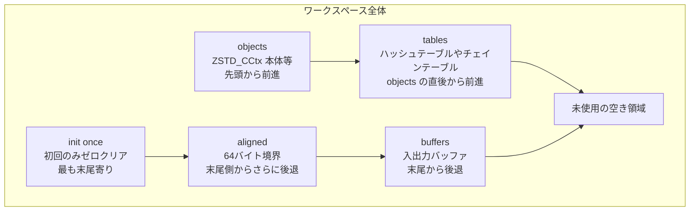

# 第4章 ワークスペース管理：ZSTD_cwksp による単一アロケーション

> **本章で読むソース**
>
> - [`lib/compress/zstd_cwksp.h`](https://github.com/facebook/zstd/blob/v1.5.7/lib/compress/zstd_cwksp.h)
> - [`lib/compress/zstd_compress.c`](https://github.com/facebook/zstd/blob/v1.5.7/lib/compress/zstd_compress.c)

## この章の狙い

第3章では `ZSTD_CCtx` がパラメータを積み立て、圧縮開始の直前にテーブルサイズを決定する流れを見た。
本章はその一歩手前、決定されたテーブルサイズに対して実メモリをどう確保するかを扱う。

`ZSTD_CCtx` は圧縮の実行に、ハッシュテーブル、チェインテーブル、入出力バッファ、エントロピー用の作業領域など、性質の異なる複数のメモリ領域を必要とする。
zstd はこれらを個別に `malloc` するのではなく、1回のシステムコールで確保した1枚の連続領域（**ワークスペース**）から切り出す。
この章では、その切り出しを担う `ZSTD_cwksp` の構造と、確保フェーズごとの制約を追う。

## 前提：なぜ単一アロケーションにするのか

`ZSTD_cwksp` は `zstd_cwksp.h` の冒頭コメントで、自らを「小さな `malloc` 実装、あるいはアリーナ」と呼んでいる。

[`lib/compress/zstd_cwksp.h` L61-L65](https://github.com/facebook/zstd/blob/v1.5.7/lib/compress/zstd_cwksp.h#L61-L65)

```c
/**
 * Zstd fits all its internal datastructures into a single continuous buffer,
 * so that it only needs to perform a single OS allocation (or so that a buffer
 * can be provided to it and it can perform no allocations at all). This buffer
 * is called the workspace.
```

圧縮1回につき必要な領域は、ハッシュテーブルのサイズひとつを取っても圧縮レベルとウィンドウサイズで大きく変わる。
これらを個別に `malloc` すると、圧縮のたびに数個から十数個の呼び出しが発生し、確保失敗時の解放処理も個々のポインタを追う必要が出てくる。
`ZSTD_cwksp` はこの問題を、必要な総量を先に見積もってから1回だけ確保し、以後はポインタ演算だけで領域を切り出す方式で解決する。
呼び出し元が確保済みのバッファをそのまま渡す静的確保（`ZSTD_initStaticCCtx` 等）にも対応でき、その場合 zstd 側は一切 `malloc` を行わない。

## ワークスペースの4領域とレイアウト

ワークスペースの内部は、確保のされ方が異なる4種類の領域に分かれる。

[`lib/compress/zstd_cwksp.h` L99-L102](https://github.com/facebook/zstd/blob/v1.5.7/lib/compress/zstd_cwksp.h#L99-L102)

```c
 * [                        ... workspace ...                           ]
 * [objects][tables ->] free space [<- buffers][<- aligned][<- init once]
```

先頭側から積み上がる領域と、末尾側から積み下がる領域が向かい合い、中央の未使用領域が両者の余白になる。

- **objects**：`ZSTD_CCtx` 本体や `ZSTD_compressedBlockState_t` など、固定サイズかつ固定個数の構造体である。
  ワークスペース先頭から順に確保する。
- **tables**：ハッシュテーブルやチェインテーブルなど、値の範囲だけが保証されればよい `uint32_t` 配列である。
  objects の直後から積み上がる。
- **buffers**：入出力バッファなど、初期化もアラインメントも不要な領域である。
  ワークスペース末尾から積み下がる。
- **aligned / init once**：64バイト境界に揃える必要がある領域である。
  前者は使用前に書き込みが必須、後者は「一度だけゼロクリアすれば以後は使い回せる」領域で、末尾側から buffers よりさらに手前に積み下がる。

この4領域は `ZSTD_cwksp_alloc_phase_e` という列挙体でフェーズとして区別される。

[`lib/compress/zstd_cwksp.h` L44-L49](https://github.com/facebook/zstd/blob/v1.5.7/lib/compress/zstd_cwksp.h#L44-L49)

```c
typedef enum {
    ZSTD_cwksp_alloc_objects,
    ZSTD_cwksp_alloc_aligned_init_once,
    ZSTD_cwksp_alloc_aligned,
    ZSTD_cwksp_alloc_buffers
} ZSTD_cwksp_alloc_phase_e;
```

フェーズは `objects` から `buffers` まで一方向にしか進まない。
`ZSTD_cwksp_internal_advance_phase` はこのフェーズを巻き戻す呼び出しを許さず、一度 `aligned` フェーズへ進んだワークスペースに後から object を確保しようとすると失敗する。
確保順序を固定することで、各領域の境界を指す複数のポインタだけで全体のレイアウトを追跡でき、領域ごとに個別の管理構造体を持たずに済む。



これら境界は `ZSTD_cwksp` 構造体のポインタとして保持される。

[`lib/compress/zstd_cwksp.h` L155-L169](https://github.com/facebook/zstd/blob/v1.5.7/lib/compress/zstd_cwksp.h#L155-L169)

```c
typedef struct {
    void* workspace;
    void* workspaceEnd;

    void* objectEnd;
    void* tableEnd;
    void* tableValidEnd;
    void* allocStart;
    void* initOnceStart;

    BYTE allocFailed;
    int workspaceOversizedDuration;
    ZSTD_cwksp_alloc_phase_e phase;
    ZSTD_cwksp_static_alloc_e isStatic;
} ZSTD_cwksp;
```

`objectEnd` が objects と tables の境界、`tableEnd` が tables 領域の現在の末尾、`allocStart` が buffers/aligned/init once 側の現在の先端を指す。
`tableValidEnd` は次節で述べる「テーブルの値が有効に保たれている範囲」を別途追跡するためのポインタであり、`tableEnd` とは意味が異なる。

## 確保関数：object、table、aligned、buffer

各領域への確保は、対応する `ZSTD_cwksp_reserve_*` 関数を通して行う。
`ZSTD_cwksp_reserve_object` は先頭側（objects 領域）を前進させる。

[`lib/compress/zstd_cwksp.h` L491-L516](https://github.com/facebook/zstd/blob/v1.5.7/lib/compress/zstd_cwksp.h#L491-L516)

```c
MEM_STATIC void* ZSTD_cwksp_reserve_object(ZSTD_cwksp* ws, size_t bytes)
{
    size_t const roundedBytes = ZSTD_cwksp_align(bytes, sizeof(void*));
    void* alloc = ws->objectEnd;
    void* end = (BYTE*)alloc + roundedBytes;

#if ZSTD_ADDRESS_SANITIZER && !defined (ZSTD_ASAN_DONT_POISON_WORKSPACE)
    /* over-reserve space */
    end = (BYTE *)end + 2 * ZSTD_CWKSP_ASAN_REDZONE_SIZE;
#endif

    DEBUGLOG(4,
        "cwksp: reserving %p object %zd bytes (rounded to %zd), %zd bytes remaining",
        alloc, bytes, roundedBytes, ZSTD_cwksp_available_space(ws) - roundedBytes);
    assert((size_t)alloc % ZSTD_ALIGNOF(void*) == 0);
    assert(bytes % ZSTD_ALIGNOF(void*) == 0);
    ZSTD_cwksp_assert_internal_consistency(ws);
    /* we must be in the first phase, no advance is possible */
    if (ws->phase != ZSTD_cwksp_alloc_objects || end > ws->workspaceEnd) {
        DEBUGLOG(3, "cwksp: object alloc failed!");
        ws->allocFailed = 1;
        return NULL;
    }
    ws->objectEnd = end;
    ws->tableEnd = end;
    ws->tableValidEnd = end;
```

要求サイズをポインタ幅に切り上げ、`objectEnd` を前進させるだけの単純な処理である。
末尾のASANビルド向け分岐を除けば、実質的にやっているのはポインタの加算とオーバーフロー判定であり、これが `malloc` を避けることの直接の効果である。

`ZSTD_cwksp_reserve_table` はハッシュテーブル用で、objects の直後（tables 領域）を前進させる。

[`lib/compress/zstd_cwksp.h` L446-L474](https://github.com/facebook/zstd/blob/v1.5.7/lib/compress/zstd_cwksp.h#L446-L474)

```c
MEM_STATIC void* ZSTD_cwksp_reserve_table(ZSTD_cwksp* ws, size_t bytes)
{
    const ZSTD_cwksp_alloc_phase_e phase = ZSTD_cwksp_alloc_aligned_init_once;
    void* alloc;
    void* end;
    void* top;

    /* We can only start allocating tables after we are done reserving space for objects at the
     * start of the workspace */
    if(ws->phase < phase) {
        if (ZSTD_isError(ZSTD_cwksp_internal_advance_phase(ws, phase))) {
            return NULL;
        }
    }
    alloc = ws->tableEnd;
    end = (BYTE *)alloc + bytes;
    top = ws->allocStart;

    DEBUGLOG(5, "cwksp: reserving %p table %zd bytes, %zd bytes remaining",
        alloc, bytes, ZSTD_cwksp_available_space(ws) - bytes);
    assert((bytes & (sizeof(U32)-1)) == 0);
    ZSTD_cwksp_assert_internal_consistency(ws);
    assert(end <= top);
    if (end > top) {
        DEBUGLOG(4, "cwksp: table alloc failed!");
        ws->allocFailed = 1;
        return NULL;
    }
    ws->tableEnd = end;
```

`tableEnd` を末尾側の `allocStart` に突き当たるまで前進させる点が `reserve_object` と異なる。
`allocStart` を追い越そうとした場合は `allocFailed` を立てて `NULL` を返すだけで、この時点では `malloc` の呼び直しは行わない。
ワークスペース全体のサイズは、確保を始める前に見積もり関数（`ZSTD_estimateCCtxSize_usingCCtxParams` 系）で計算済みであるため、想定内の使い方であればここで衝突することはない。

一方 `ZSTD_cwksp_reserve_buffer` と `ZSTD_cwksp_reserve_aligned64` は、末尾側（buffers / aligned 領域）から手前へ向かって切り出す。

[`lib/compress/zstd_cwksp.h` L290-L311](https://github.com/facebook/zstd/blob/v1.5.7/lib/compress/zstd_cwksp.h#L290-L311)

```c
MEM_STATIC void*
ZSTD_cwksp_reserve_internal_buffer_space(ZSTD_cwksp* ws, size_t const bytes)
{
    void* const alloc = (BYTE*)ws->allocStart - bytes;
    void* const bottom = ws->tableEnd;
    DEBUGLOG(5, "cwksp: reserving [0x%p]:%zd bytes; %zd bytes remaining",
        alloc, bytes, ZSTD_cwksp_available_space(ws) - bytes);
    ZSTD_cwksp_assert_internal_consistency(ws);
    assert(alloc >= bottom);
    if (alloc < bottom) {
        DEBUGLOG(4, "cwksp: alloc failed!");
        ws->allocFailed = 1;
        return NULL;
    }
    /* the area is reserved from the end of wksp.
     * If it overlaps with tableValidEnd, it voids guarantees on values' range */
    if (alloc < ws->tableValidEnd) {
        ws->tableValidEnd = alloc;
    }
    ws->allocStart = alloc;
    return alloc;
}
```

`allocStart` からサイズ分を引いた位置を新しい確保先とし、それが `tableEnd`（tables 領域の先端）を下回れば失敗にする。
`ZSTD_cwksp_reserve_buffer` はこの内部関数をアラインメントなしで呼ぶだけの薄いラッパーである。

[`lib/compress/zstd_cwksp.h` L394-L397](https://github.com/facebook/zstd/blob/v1.5.7/lib/compress/zstd_cwksp.h#L394-L397)

```c
MEM_STATIC BYTE* ZSTD_cwksp_reserve_buffer(ZSTD_cwksp* ws, size_t bytes)
{
    return (BYTE*)ZSTD_cwksp_reserve_internal(ws, bytes, ZSTD_cwksp_alloc_buffers);
}
```

`ZSTD_cwksp_reserve_aligned64` はこれに64バイトへの切り上げを加えたものである。

[`lib/compress/zstd_cwksp.h` L432-L439](https://github.com/facebook/zstd/blob/v1.5.7/lib/compress/zstd_cwksp.h#L432-L439)

```c
MEM_STATIC void* ZSTD_cwksp_reserve_aligned64(ZSTD_cwksp* ws, size_t bytes)
{
    void* const ptr = ZSTD_cwksp_reserve_internal(ws,
                        ZSTD_cwksp_align(bytes, ZSTD_CWKSP_ALIGNMENT_BYTES),
                        ZSTD_cwksp_alloc_aligned);
    assert(((size_t)ptr & (ZSTD_CWKSP_ALIGNMENT_BYTES-1)) == 0);
    return ptr;
}
```

ハッシュテーブルやシーケンス配列を64バイト境界に揃えるのは、キャッシュラインの単位が一般に64バイトであるためである。
テーブルの1エントリを読み書きするたびにキャッシュラインをまたぐと、そのアクセスだけで余分なキャッシュミスが発生しうる。
確保開始位置をあらかじめキャッシュライン境界に合わせておけば、テーブル内の連続アクセスがキャッシュラインの区切りと噛み合いやすくなり、境界をまたぐアクセスの回数を減らせる。

## 実際の使われ方：ZSTD_CCtx の確保からテーブル確保まで

`ZSTD_initStaticCCtx` は、呼び出し元が用意した領域を丸ごと `ZSTD_cwksp` として初期化し、そこから `ZSTD_CCtx` 本体を objects として切り出す。

[`lib/compress/zstd_compress.c` L126-L147](https://github.com/facebook/zstd/blob/v1.5.7/lib/compress/zstd_compress.c#L126-L147)

```c
ZSTD_CCtx* ZSTD_initStaticCCtx(void* workspace, size_t workspaceSize)
{
    ZSTD_cwksp ws;
    ZSTD_CCtx* cctx;
    if (workspaceSize <= sizeof(ZSTD_CCtx)) return NULL;  /* minimum size */
    if ((size_t)workspace & 7) return NULL;  /* must be 8-aligned */
    ZSTD_cwksp_init(&ws, workspace, workspaceSize, ZSTD_cwksp_static_alloc);

    cctx = (ZSTD_CCtx*)ZSTD_cwksp_reserve_object(&ws, sizeof(ZSTD_CCtx));
    if (cctx == NULL) return NULL;

    ZSTD_memset(cctx, 0, sizeof(ZSTD_CCtx));
    ZSTD_cwksp_move(&cctx->workspace, &ws);
    cctx->staticSize = workspaceSize;

    /* statically sized space. tmpWorkspace never moves (but prev/next block swap places) */
    if (!ZSTD_cwksp_check_available(&cctx->workspace, TMP_WORKSPACE_SIZE + 2 * sizeof(ZSTD_compressedBlockState_t))) return NULL;
    cctx->blockState.prevCBlock = (ZSTD_compressedBlockState_t*)ZSTD_cwksp_reserve_object(&cctx->workspace, sizeof(ZSTD_compressedBlockState_t));
    cctx->blockState.nextCBlock = (ZSTD_compressedBlockState_t*)ZSTD_cwksp_reserve_object(&cctx->workspace, sizeof(ZSTD_compressedBlockState_t));
    cctx->tmpWorkspace = ZSTD_cwksp_reserve_object(&cctx->workspace, TMP_WORKSPACE_SIZE);
```

`ZSTD_CCtx` 構造体そのものが、この構造体を管理するはずのワークスペースの中に置かれている点が特徴である。
`ZSTD_cwksp_move` で局所変数 `ws` の内容を `cctx->workspace` へ移した後は、`ZSTD_CCtx` 自身がワークスペースを保持する。
続けて `blockState.prevCBlock` / `nextCBlock`（2ブロック分の圧縮状態、後続の章で扱う）と `tmpWorkspace`（エントロピー符号化の一時領域）を、同じワークスペースから objects として切り出す。

動的確保（`ZSTD_initCCtx` から `ZSTD_resetCCtx_internal` に至る経路）でも、必要サイズを見積もった上で同様の順序を踏む。

[`lib/compress/zstd_compress.c` L2173-L2185](https://github.com/facebook/zstd/blob/v1.5.7/lib/compress/zstd_compress.c#L2173-L2185)

```c
                ZSTD_cwksp_free(ws, zc->customMem);
                FORWARD_IF_ERROR(ZSTD_cwksp_create(ws, neededSpace, zc->customMem), "");

                DEBUGLOG(5, "reserving object space");
                /* Statically sized space.
                 * tmpWorkspace never moves,
                 * though prev/next block swap places */
                assert(ZSTD_cwksp_check_available(ws, 2 * sizeof(ZSTD_compressedBlockState_t)));
                zc->blockState.prevCBlock = (ZSTD_compressedBlockState_t*) ZSTD_cwksp_reserve_object(ws, sizeof(ZSTD_compressedBlockState_t));
                RETURN_ERROR_IF(zc->blockState.prevCBlock == NULL, memory_allocation, "couldn't allocate prevCBlock");
                zc->blockState.nextCBlock = (ZSTD_compressedBlockState_t*) ZSTD_cwksp_reserve_object(ws, sizeof(ZSTD_compressedBlockState_t));
                RETURN_ERROR_IF(zc->blockState.nextCBlock == NULL, memory_allocation, "couldn't allocate nextCBlock");
                zc->tmpWorkspace = ZSTD_cwksp_reserve_object(ws, TMP_WORKSPACE_SIZE);
```

続いてマッチファインダーのテーブルが `ZSTD_reset_matchState` の中で確保される。

[`lib/compress/zstd_compress.c` L2016-L2022](https://github.com/facebook/zstd/blob/v1.5.7/lib/compress/zstd_compress.c#L2016-L2022)

```c
    ZSTD_cwksp_clear_tables(ws);

    DEBUGLOG(5, "reserving table space");
    /* table Space */
    ms->hashTable = (U32*)ZSTD_cwksp_reserve_table(ws, hSize * sizeof(U32));
    ms->chainTable = (U32*)ZSTD_cwksp_reserve_table(ws, chainSize * sizeof(U32));
    ms->hashTable3 = (U32*)ZSTD_cwksp_reserve_table(ws, h3Size * sizeof(U32));
```

最後に入出力バッファやシーケンス格納用の配列を buffers 領域から確保する。

[`lib/compress/zstd_compress.c` L2247-L2254](https://github.com/facebook/zstd/blob/v1.5.7/lib/compress/zstd_compress.c#L2247-L2254)

```c
        zc->seqStore.litStart = ZSTD_cwksp_reserve_buffer(ws, blockSize + WILDCOPY_OVERLENGTH);
        zc->seqStore.maxNbLit = blockSize;

        zc->bufferedPolicy = zbuff;
        zc->inBuffSize = buffInSize;
        zc->inBuff = (char*)ZSTD_cwksp_reserve_buffer(ws, buffInSize);
        zc->outBuffSize = buffOutSize;
        zc->outBuff = (char*)ZSTD_cwksp_reserve_buffer(ws, buffOutSize);
```

`objects → tables → aligned/init once → buffers` の順で切り出しが進み、ワークスペース全体がこの1回の確保シーケンスで使い切られる。
圧縮パラメータが変わってもワークスペースの再確保が不要な範囲では（後述する `ZSTD_cwksp_clear` と組み合わせて）、2回目以降の圧縮ではこの `malloc`/`free` すら発生しない。

## テーブルの再利用：clear と mark_dirty / mark_clean

`ZSTD_cwksp` がもっとも工夫を凝らしているのは、tables 領域の扱いである。
ハッシュテーブルやチェインテーブルは中身をゼロクリアしなくても、値がある上限（現在のウィンドウの先頭インデックス）未満に収まっている限り安全に読める。
このため `ZSTD_cwksp` は「テーブルの値が保証範囲に収まっている区間」を `tableValidEnd` という別のポインタで管理し、`tableEnd`（確保済みの区間）と区別する。

前回の圧縮で使ったテーブルの値をそのままにできなくなった場合、`ZSTD_cwksp_mark_tables_dirty` で保証範囲を無効化する。

[`lib/compress/zstd_cwksp.h` L544-L571](https://github.com/facebook/zstd/blob/v1.5.7/lib/compress/zstd_cwksp.h#L544-L571)

```c
MEM_STATIC void ZSTD_cwksp_mark_tables_dirty(ZSTD_cwksp* ws)
{
    DEBUGLOG(4, "cwksp: ZSTD_cwksp_mark_tables_dirty");
#if ZSTD_MEMORY_SANITIZER && !defined (ZSTD_MSAN_DONT_POISON_WORKSPACE)
    /* (中略、MSAN 向けの再ポイズン処理) */
#endif

    assert(ws->tableValidEnd >= ws->objectEnd);
    assert(ws->tableValidEnd <= ws->allocStart);
    ws->tableValidEnd = ws->objectEnd;
    ZSTD_cwksp_assert_internal_consistency(ws);
}
```

`tableValidEnd` を `objectEnd` まで巻き戻すだけで、テーブル全体を「値の保証がない状態」にできる。
これは実メモリを書き換えない操作であり、実際のゼロクリアが必要になるのは `ZSTD_cwksp_clean_tables`（保証範囲外だけを `memset` する）が呼ばれたときに限られる。

[`lib/compress/zstd_cwksp.h` L573-L594](https://github.com/facebook/zstd/blob/v1.5.7/lib/compress/zstd_cwksp.h#L573-L594)

```c
MEM_STATIC void ZSTD_cwksp_mark_tables_clean(ZSTD_cwksp* ws) {
    DEBUGLOG(4, "cwksp: ZSTD_cwksp_mark_tables_clean");
    assert(ws->tableValidEnd >= ws->objectEnd);
    assert(ws->tableValidEnd <= ws->allocStart);
    if (ws->tableValidEnd < ws->tableEnd) {
        ws->tableValidEnd = ws->tableEnd;
    }
    ZSTD_cwksp_assert_internal_consistency(ws);
}

/**
 * Zero the part of the allocated tables not already marked clean.
 */
MEM_STATIC void ZSTD_cwksp_clean_tables(ZSTD_cwksp* ws) {
    DEBUGLOG(4, "cwksp: ZSTD_cwksp_clean_tables");
    assert(ws->tableValidEnd >= ws->objectEnd);
    assert(ws->tableValidEnd <= ws->allocStart);
    if (ws->tableValidEnd < ws->tableEnd) {
        ZSTD_memset(ws->tableValidEnd, 0, (size_t)((BYTE*)ws->tableEnd - (BYTE*)ws->tableValidEnd));
    }
    ZSTD_cwksp_mark_tables_clean(ws);
}
```

`ZSTD_cwksp_clear_tables` は tables 領域の確保自体を巻き戻し、`ZSTD_cwksp_clear` はさらに buffers/aligned 領域まで含めて巻き戻す。

[`lib/compress/zstd_cwksp.h` L600-L617](https://github.com/facebook/zstd/blob/v1.5.7/lib/compress/zstd_cwksp.h#L600-L617)

```c
MEM_STATIC void ZSTD_cwksp_clear_tables(ZSTD_cwksp* ws)
{
    DEBUGLOG(4, "cwksp: clearing tables!");

#if ZSTD_ADDRESS_SANITIZER && !defined (ZSTD_ASAN_DONT_POISON_WORKSPACE)
    /* (中略、ASAN 向けの再ポイズン処理) */
#endif

    ws->tableEnd = ws->objectEnd;
    ZSTD_cwksp_assert_internal_consistency(ws);
}
```

[`lib/compress/zstd_cwksp.h` L623-L658](https://github.com/facebook/zstd/blob/v1.5.7/lib/compress/zstd_cwksp.h#L623-L658)

```c
MEM_STATIC void ZSTD_cwksp_clear(ZSTD_cwksp* ws) {
    DEBUGLOG(4, "cwksp: clearing!");
    /* (中略、MSAN/ASAN 向けの再ポイズン処理) */

    ws->tableEnd = ws->objectEnd;
    ws->allocStart = ZSTD_cwksp_initialAllocStart(ws);
    ws->allocFailed = 0;
    if (ws->phase > ZSTD_cwksp_alloc_aligned_init_once) {
        ws->phase = ZSTD_cwksp_alloc_aligned_init_once;
    }
    ZSTD_cwksp_assert_internal_consistency(ws);
}
```

`clear` は `objectEnd` より手前（objects 領域）を保ったまま、`tableEnd` と `allocStart` を初期位置へ戻す。
objects として確保した `ZSTD_CCtx` 本体や `blockState` は再利用しつつ、tables 以降の領域だけを次の圧縮のために解放し直す操作である。
これにより、2回目以降の圧縮では新規 `malloc` を行わず、同じワークスペースの中でポインタを巻き戻すだけでテーブルと入出力バッファを再構成できる。

## まとめ

`ZSTD_cwksp` は、圧縮に必要な複数種類のメモリ領域を1回のシステムコールで確保した連続バッファへ押し込め、以後の確保をポインタ演算だけで済ませる仕組みである。
objects、tables、aligned/init once、buffers という4フェーズを一方向にしか進めない制約を課すことで、複雑な管理構造を持たずに境界ポインタだけでレイアウトを追跡できる。
テーブル領域については `tableValidEnd` によって「値の保証範囲」を実データと切り離して管理し、`mark_tables_dirty` / `mark_tables_clean` / `clear` を使い分けることで、圧縮のたびに発生しがちな `malloc` とゼロクリアの双方を避けている。

## 関連する章

- 第3章 [公開 API とストリーミングの流れ](../part00-overview/03-public-api-flow.md)
- 第5章 [ビットストリームの構築と読み出し](05-bitstream.md)
- 第11章 [圧縮コンテキストとパラメータ：CCtx と cparams](../part03-compress-core/11-cctx-params.md)
