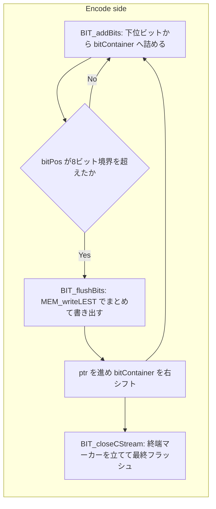
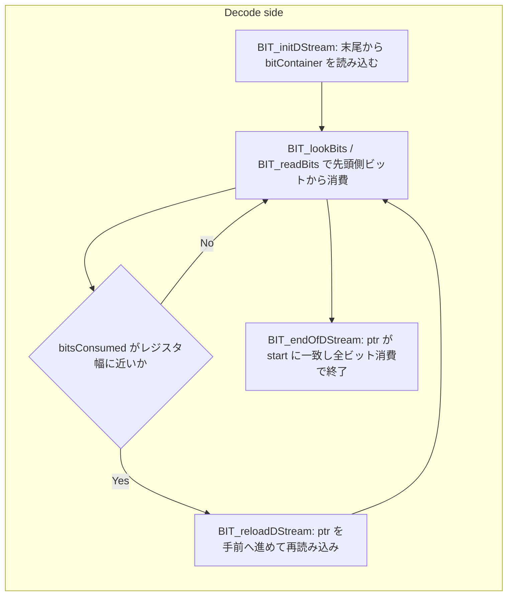

# 第5章 ビットストリーム：BIT_ 読み書きとビットコンテナ

> **本章で読むソース**
>
> - [`lib/common/bitstream.h`](https://github.com/facebook/zstd/blob/v1.5.7/lib/common/bitstream.h)
> - [`lib/common/mem.h`](https://github.com/facebook/zstd/blob/v1.5.7/lib/common/mem.h)

## この章の狙い

FSE と Huffman は、シンボルを固定長のバイトではなく、可変長のビット列として詰め込む。
この可変長ビット列を実際にメモリへ書き込み、読み出す層が `lib/common/bitstream.h` である。
本章では、この1ファイルに閉じた `BIT_` 系関数を読み、ビットをレジスタに溜めてからまとめてメモリへ書く仕組みと、逆方向に読む理由を追う。

## 前提

`bitstream.h` はヘッダファイルでありながら、実装まで含めて `.h` の中に置かれている。
ファイル冒頭のコメントが、その理由を明かす。

[`lib/common/bitstream.h` L17-L21](https://github.com/facebook/zstd/blob/v1.5.7/lib/common/bitstream.h#L17-L21)

```c
/*
*  This API consists of small unitary functions, which must be inlined for best performance.
*  Since link-time-optimization is not available for all compilers,
*  these functions are defined into a .h to be included.
*/
```

`BIT_addBits` や `BIT_readBits` は数命令程度の小さな関数である。
呼び出しのたびに関数呼び出しのオーバーヘッドが乗ると、命令数に対してコストが割に合わない。
リンク時最適化（LTO）が使えないビルド環境でもインライン化を保証するため、実装ごと `.h` に置いて `#include` させている。

## ビットコンテナという単位

書き込み側と読み込み側のどちらも、ビットを溜める場所は `BitContainerType` という単一の変数である。

[`lib/common/bitstream.h` L51-L62](https://github.com/facebook/zstd/blob/v1.5.7/lib/common/bitstream.h#L51-L62)

```c
typedef size_t BitContainerType;
/* bitStream can mix input from multiple sources.
 * A critical property of these streams is that they encode and decode in **reverse** direction.
 * So the first bit sequence you add will be the last to be read, like a LIFO stack.
 */
typedef struct {
    BitContainerType bitContainer;
    unsigned bitPos;
    char*  startPtr;
    char*  ptr;
    char*  endPtr;
} BIT_CStream_t;
```

`BitContainerType` の実体は `size_t` であり、64ビット環境では64ビット、32ビット環境では32ビットになる。
コメントが明記する通り、この構造体は**LIFO**（後入れ先出し）として働く。
先に `BIT_addBits` で追加したビット列ほど、あとで読み出すときには最後に取り出される。

この「逆順」の性質は、FSE や Huffman の符号化順序と結びついている。
両者とも、末尾のシンボルから先に符号化しレジスタへ積んでいく。
そうすると、復号側は先頭から順にビットストリームを読み進めるだけで、シンボル順序を復元できる。
書き込みと読み込みの向きを逆にすることで、符号化側と復号側のどちらにも「ビット列を逆順に並べ替える」という余計な処理を持たせずに済む。

## 書き込み側：レジスタに溜めてから1回で書く

`BIT_addBits` は、値の下位 `nbBits` ビットを取り出し、現在の `bitPos` だけシフトしてコンテナに重ね書きする。

[`lib/common/bitstream.h` L177-L188](https://github.com/facebook/zstd/blob/v1.5.7/lib/common/bitstream.h#L177-L188)

```c
/*! BIT_addBits() :
 *  can add up to 31 bits into `bitC`.
 *  Note : does not check for register overflow ! */
MEM_STATIC void BIT_addBits(BIT_CStream_t* bitC,
                            BitContainerType value, unsigned nbBits)
{
    DEBUG_STATIC_ASSERT(BIT_MASK_SIZE == 32);
    assert(nbBits < BIT_MASK_SIZE);
    assert(nbBits + bitC->bitPos < sizeof(bitC->bitContainer) * 8);
    bitC->bitContainer |= BIT_getLowerBits(value, nbBits) << bitC->bitPos;
    bitC->bitPos += nbBits;
}
```

この時点ではメモリへの書き込みは一切発生しない。
更新されるのは `bitContainer`（レジスタ相当の変数）と、詰めたビット数を数える `bitPos` だけである。
値をメモリへ実際に反映するのは、別に用意された `BIT_flushBits` の役目になる。

[`lib/common/bitstream.h` L216-L231](https://github.com/facebook/zstd/blob/v1.5.7/lib/common/bitstream.h#L216-L231)

```c
/*! BIT_flushBits() :
 *  assumption : bitContainer has not overflowed
 *  safe version; check for buffer overflow, and prevents it.
 *  note : does not signal buffer overflow.
 *  overflow will be revealed later on using BIT_closeCStream() */
MEM_STATIC void BIT_flushBits(BIT_CStream_t* bitC)
{
    size_t const nbBytes = bitC->bitPos >> 3;
    assert(bitC->bitPos < sizeof(bitC->bitContainer) * 8);
    assert(bitC->ptr <= bitC->endPtr);
    MEM_writeLEST(bitC->ptr, bitC->bitContainer);
    bitC->ptr += nbBytes;
    if (bitC->ptr > bitC->endPtr) bitC->ptr = bitC->endPtr;
    bitC->bitPos &= 7;
    bitC->bitContainer >>= nbBytes*8;
}
```

`bitPos >> 3` は「たまったビット数のうち、バイト境界に達した分」を切り出す。
`MEM_writeLEST` は `sizeof(BitContainerType)` バイト分（64ビット環境なら8バイト）を一度にメモリへ書き込む。
その後 `ptr` を書き込んだバイト数だけ進め、`bitPos` を8で割った余り（下位3ビットのマスク）に戻し、`bitContainer` を書き込み済みバイト数だけ右シフトして、次の `BIT_addBits` に備える。

この設計が最適化として効いている点は、**メモリへの書き込み回数を実際に詰めたバイト数の単位までまとめて減らせる**ことである。
`BIT_addBits` を何度呼んでも、その都度メモリへアクセスするわけではない。
ビットはレジスタの中で積み上がり続け、8バイト境界を跨ぐタイミングでまとめて1回のストア命令に変換される。
FSE や Huffman の符号化は1シンボルあたり数ビット程度の追加を大量に繰り返すため、この「レジスタで溜めてからバーストで書く」方式がなければメモリアクセスの回数がシンボル数に比例して膨れ上がる。

`BIT_addBitsFast` と `BIT_flushBitsFast` は、この安全版から境界チェックを外した高速版である。

[`lib/common/bitstream.h` L190-L214](https://github.com/facebook/zstd/blob/v1.5.7/lib/common/bitstream.h#L190-L214)

```c
/*! BIT_addBitsFast() :
 *  works only if `value` is _clean_,
 *  meaning all high bits above nbBits are 0 */
MEM_STATIC void BIT_addBitsFast(BIT_CStream_t* bitC,
                                BitContainerType value, unsigned nbBits)
{
    assert((value>>nbBits) == 0);
    assert(nbBits + bitC->bitPos < sizeof(bitC->bitContainer) * 8);
    bitC->bitContainer |= value << bitC->bitPos;
    bitC->bitPos += nbBits;
}

/*! BIT_flushBitsFast() :
 *  assumption : bitContainer has not overflowed
 *  unsafe version; does not check buffer overflow */
MEM_STATIC void BIT_flushBitsFast(BIT_CStream_t* bitC)
{
    size_t const nbBytes = bitC->bitPos >> 3;
    assert(bitC->bitPos < sizeof(bitC->bitContainer) * 8);
    assert(bitC->ptr <= bitC->endPtr);
    MEM_writeLEST(bitC->ptr, bitC->bitContainer);
    bitC->ptr += nbBytes;
    bitC->bitPos &= 7;
    bitC->bitContainer >>= nbBytes*8;
}
```

`BIT_addBitsFast` は `value` の上位ビットがすでに0であることを呼び出し側が保証する前提で、`BIT_getLowerBits` によるマスク処理を省く。
`BIT_flushBitsFast` は `ptr` が `endPtr` を超えていないかのチェックを省く。
どちらも呼び出し側が事前条件を満たしていることを引き換えに、分岐と演算を1つ減らしている。
FSE のエンコードループのように、1シンボルあたりの処理を数億回繰り返す箇所では、この数命令の差が積み重なって無視できない差になる。

締めくくりの `BIT_closeCStream` は、末尾に終端マーカーを1ビット立ててから `BIT_flushBits` を呼び、書き込んだ総バイト数を返す。

[`lib/common/bitstream.h` L233-L242](https://github.com/facebook/zstd/blob/v1.5.7/lib/common/bitstream.h#L233-L242)

```c
/*! BIT_closeCStream() :
 *  @return : size of CStream, in bytes,
 *            or 0 if it could not fit into dstBuffer */
MEM_STATIC size_t BIT_closeCStream(BIT_CStream_t* bitC)
{
    BIT_addBitsFast(bitC, 1, 1);   /* endMark */
    BIT_flushBits(bitC);
    if (bitC->ptr >= bitC->endPtr) return 0; /* overflow detected */
    return (size_t)(bitC->ptr - bitC->startPtr) + (bitC->bitPos > 0);
}
```

この終端マーカーは、読み込み側が末尾から最初の1ビットを見つけて「実際に有効なビット数」を逆算するための目印になる。

## 読み込み側：末尾から逆方向に読む

復号側の状態は `BIT_DStream_t` で表される。

[`lib/common/bitstream.h` L88-L96](https://github.com/facebook/zstd/blob/v1.5.7/lib/common/bitstream.h#L88-L96)

```c
typedef struct {
    BitContainerType bitContainer;
    unsigned bitsConsumed;
    const char* ptr;
    const char* start;
    const char* limitPtr;
} BIT_DStream_t;
```

書き込み側が `startPtr` から前へ進むのに対し、読み込み側は `BIT_initDStream` の時点でバッファの末尾に飛び、そこから手前へ向かって読む。

[`lib/common/bitstream.h` L254-L271](https://github.com/facebook/zstd/blob/v1.5.7/lib/common/bitstream.h#L254-L271)

```c
MEM_STATIC size_t BIT_initDStream(BIT_DStream_t* bitD, const void* srcBuffer, size_t srcSize)
{
    if (srcSize < 1) { ZSTD_memset(bitD, 0, sizeof(*bitD)); return ERROR(srcSize_wrong); }

    bitD->start = (const char*)srcBuffer;
    bitD->limitPtr = bitD->start + sizeof(bitD->bitContainer);

    if (srcSize >=  sizeof(bitD->bitContainer)) {  /* normal case */
        bitD->ptr   = (const char*)srcBuffer + srcSize - sizeof(bitD->bitContainer);
        bitD->bitContainer = MEM_readLEST(bitD->ptr);
        { BYTE const lastByte = ((const BYTE*)srcBuffer)[srcSize-1];
          bitD->bitsConsumed = lastByte ? 8 - ZSTD_highbit32(lastByte) : 0;  /* ensures bitsConsumed is always set */
          if (lastByte == 0) return ERROR(GENERIC); /* endMark not present */ }
    } else {
```

`ptr` はバッファの先頭ではなく `srcBuffer + srcSize - sizeof(bitContainer)`、つまり末尾から `BitContainerType` 1個分だけ手前の位置に置かれる。
末尾バイト（`lastByte`）の最上位に立っているビットが `BIT_closeCStream` が書いた終端マーカーであり、`ZSTD_highbit32` でその位置を求めることで、末尾に付随する無効なパディングビット数（`bitsConsumed` の初期値）を算出する。

書き込みが「先頭から末尾へ、下位ビットから積む」順序だったのに対し、読み込みは「末尾から先頭へ」向かう。
この向きの一致が、LIFO の対応関係を成立させている。
最後に `BIT_addBits` されたビット列は、バッファの末尾付近に積まれているため、末尾から読み始めれば最初に取り出せる。

読み出し自体は `BIT_lookBits`（レジスタを変更せず覗き見る）と、それに `bitsConsumed` の更新を加えた `BIT_readBits` に分かれる。

[`lib/common/bitstream.h` L324-L338](https://github.com/facebook/zstd/blob/v1.5.7/lib/common/bitstream.h#L324-L338)

```c
/*! BIT_lookBits() :
 *  Provides next n bits from local register.
 *  local register is not modified.
 *  On 32-bits, maxNbBits==24.
 *  On 64-bits, maxNbBits==56.
 * @return : value extracted */
FORCE_INLINE_TEMPLATE BitContainerType BIT_lookBits(const BIT_DStream_t*  bitD, U32 nbBits)
{
    /* arbitrate between double-shift and shift+mask */
#if 1
    /* if bitD->bitsConsumed + nbBits > sizeof(bitD->bitContainer)*8,
     * bitstream is likely corrupted, and result is undefined */
    return BIT_getMiddleBits(bitD->bitContainer, (sizeof(bitD->bitContainer)*8) - bitD->bitsConsumed - nbBits, nbBits);
#else
```

[`lib/common/bitstream.h` L358-L367](https://github.com/facebook/zstd/blob/v1.5.7/lib/common/bitstream.h#L358-L367)

```c
/*! BIT_readBits() :
 *  Read (consume) next n bits from local register and update.
 *  Pay attention to not read more than nbBits contained into local register.
 * @return : extracted value. */
FORCE_INLINE_TEMPLATE BitContainerType BIT_readBits(BIT_DStream_t* bitD, unsigned nbBits)
{
    BitContainerType const value = BIT_lookBits(bitD, nbBits);
    BIT_skipBits(bitD, nbBits);
    return value;
}
```

`lookBits` と `readBits` を分けているのは、FSE の状態遷移のように「次に読むビット数が、いま読んだばかりの値に依存する」場面で、先に値を覗いてから消費幅を決める必要があるためである。

## レジスタの再読み込みと分岐の少なさ

書き込み側が `bitPos` の上限に達する前に `flushBits` を挟むのと対称に、読み込み側は `bitsConsumed` がレジスタの幅に近づくたびに `BIT_reloadDStream` でレジスタを再読み込みする。

[`lib/common/bitstream.h` L419-L442](https://github.com/facebook/zstd/blob/v1.5.7/lib/common/bitstream.h#L419-L442)

```c
FORCE_INLINE_TEMPLATE BIT_DStream_status BIT_reloadDStream(BIT_DStream_t* bitD)
{
    /* note : once in overflow mode, a bitstream remains in this mode until it's reset */
    if (UNLIKELY(bitD->bitsConsumed > (sizeof(bitD->bitContainer)*8))) {
        static const BitContainerType zeroFilled = 0;
        bitD->ptr = (const char*)&zeroFilled; /* aliasing is allowed for char */
        /* overflow detected, erroneous scenario or end of stream: no update */
        return BIT_DStream_overflow;
    }

    assert(bitD->ptr >= bitD->start);

    if (bitD->ptr >= bitD->limitPtr) {
        return BIT_reloadDStream_internal(bitD);
    }
    if (bitD->ptr == bitD->start) {
        /* reached end of bitStream => no update */
        if (bitD->bitsConsumed < sizeof(bitD->bitContainer)*8) return BIT_DStream_endOfBuffer;
        return BIT_DStream_completed;
    }
    /* start < ptr < limitPtr => cautious update */
    {   U32 nbBytes = bitD->bitsConsumed >> 3;
        BIT_DStream_status result = BIT_DStream_unfinished;
        if (bitD->ptr - nbBytes < bitD->start) {
            nbBytes = (U32)(bitD->ptr - bitD->start);  /* ptr > start */
            result = BIT_DStream_endOfBuffer;
        }
        bitD->ptr -= nbBytes;
        bitD->bitsConsumed -= nbBytes*8;
        bitD->bitContainer = MEM_readLEST(bitD->ptr);   /* reminder : srcSize > sizeof(bitD->bitContainer), otherwise bitD->ptr == bitD->start */
        return result;
    }
}
```

戻り値の `BIT_DStream_status` は4値の enum として定義されている。

[`lib/common/bitstream.h` L99-L102](https://github.com/facebook/zstd/blob/v1.5.7/lib/common/bitstream.h#L99-L102)

```c
typedef enum { BIT_DStream_unfinished = 0,  /* fully refilled */
               BIT_DStream_endOfBuffer = 1, /* still some bits left in bitstream */
               BIT_DStream_completed = 2,   /* bitstream entirely consumed, bit-exact */
               BIT_DStream_overflow = 3     /* user requested more bits than present in bitstream */
    } BIT_DStream_status;  /* result of BIT_reloadDStream() */
```

呼び出し側（FSE と Huffman の復号ループ）は、`ptr` がバッファ先頭に達するまでは `BIT_DStream_unfinished` を受け取り続け、無条件にループを回せる。
`ptr` が先頭に達した後だけ `endOfBuffer` や `completed` を見て終了判定を行う。
つまり大半の反復では **「バッファの終端に近いかどうか」を毎回チェックする必要がなく、レジスタを詰め直して即座に次のシンボルへ進める**。
`bitD->ptr >= bitD->limitPtr` という1回の比較だけで「まだ十分な余白がある」経路を分岐なく通せる設計になっており、これがループ内での条件分岐を減らす最適化として働いている。
この高速経路だけを取り出したのが `BIT_reloadDStreamFast` であり、`limitPtr` を割った場合は `BIT_DStream_overflow` を返して呼び出し側に安全版への切り替えを促す。

[`lib/common/bitstream.h` L400-L405](https://github.com/facebook/zstd/blob/v1.5.7/lib/common/bitstream.h#L400-L405)

```c
MEM_STATIC BIT_DStream_status BIT_reloadDStreamFast(BIT_DStream_t* bitD)
{
    if (UNLIKELY(bitD->ptr < bitD->limitPtr))
        return BIT_DStream_overflow;
    return BIT_reloadDStream_internal(bitD);
}
```

ストリームを最後まで読み切ったかどうかは `BIT_endOfDStream` で判定する。

[`lib/common/bitstream.h` L449-L452](https://github.com/facebook/zstd/blob/v1.5.7/lib/common/bitstream.h#L449-L452)

```c
MEM_STATIC unsigned BIT_endOfDStream(const BIT_DStream_t* DStream)
{
    return ((DStream->ptr == DStream->start) && (DStream->bitsConsumed == sizeof(DStream->bitContainer)*8));
}
```

`ptr` が先頭に一致し、かつ `bitsConsumed` がレジスタの全ビット幅に達していることの両方を確認する。
どちらか一方だけでは、レジスタ内にまだ未読のビットが残っている可能性を排除できない。

## リトルエンディアン前提と MEM_ 層への委譲

`BIT_flushBits` や `BIT_reloadDStream_internal` が使う `MEM_writeLEST` / `MEM_readLEST` は、`lib/common/mem.h` に定義されるヘルパーである。

[`lib/common/mem.h` L353-L367](https://github.com/facebook/zstd/blob/v1.5.7/lib/common/mem.h#L353-L367)

```c
MEM_STATIC size_t MEM_readLEST(const void* memPtr)
{
    if (MEM_32bits())
        return (size_t)MEM_readLE32(memPtr);
    else
        return (size_t)MEM_readLE64(memPtr);
}

MEM_STATIC void MEM_writeLEST(void* memPtr, size_t val)
{
    if (MEM_32bits())
        MEM_write32(memPtr, (U32)val);
    else
        MEM_writeLE64(memPtr, (U64)val);
}
```

名前の `LE` はリトルエンディアン（little endian）を指す。
`bitstream.h` の側はエンディアンを一切気にしておらず、`BitContainerType` へビット列を積む処理と、それをメモリへ出し入れする処理を完全に分離している。
実行環境がビッグエンディアンであっても、`MEM_readLE64` / `MEM_writeLE64` の内部でバイトの入れ替えを行い、見かけ上は常にリトルエンディアンとして読み書きされる形に揃える。
`bitstream.h` はこのエンディアン差の吸収を `mem.h` に委譲することで、ビットの詰め方（下位ビットから積み LIFO で読む）というアルゴリズムの本体をハードウェア差から切り離している。

## FSE と Huffman からの利用

第7章で読む FSE エンコーダは、`BIT_CStream_t` を1つ持ち、シンボルごとに状態遷移で決まったビット数を `BIT_addBits` で追加し、まとまったところで `BIT_flushBits` を呼ぶという形で本章の API を使う。
第9章で読む Huffman エンコーダも同様に、各シンボルの符号語（コードとビット長のペア）を `BIT_addBits` へ渡すだけで、ビットの詰め方そのものは意識しない。
復号側（第8章と第10章）も同じ構図で、`BIT_DStream_t` を初期化し、`BIT_lookBits` でテーブルの参照に使う値を覗き、`BIT_reloadDStream` で定期的にレジスタを補充する。
どちらのアルゴリズムも「何ビットの符号語をどう並べるか」という設計に集中でき、レジスタとメモリの往復管理そのものは `bitstream.h` に任せている。

## 全体の流れ





書き込み側は左から右へ、バッファの先頭方向へ進みながらビットを積む。
読み込み側は右から左へ、バッファの末尾から先頭方向へ進みながらビットを取り出す。
両者の向きが逆であることが、LIFO の対応を成立させている。

## まとめ

`bitstream.h` は、FSE と Huffman が共有する最下層のビット入出力を担う。
書き込みは `BitContainerType` 1個へビットを積み、8バイト境界に達したところでまとめて1回のストアに変換する。
読み込みはバッファの末尾から始まり、末尾側から先頭側へ向かって逆順に読むことで、書き込み時の LIFO 順序を復元する。
レジスタの再読み込みは `limitPtr` との1回の比較だけで大半の反復を分岐なく通すよう設計されており、エンディアン差の吸収は `mem.h` の `MEM_readLEST` / `MEM_writeLEST` に委譲されている。
この層があるおかげで、上位のエントロピー符号化はビット単位の詰め方を意識せずに符号語を出し入れできる。

## 関連する章

- [第4章 ワークスペース管理：ZSTD_cwksp による単一アロケーション](04-cwksp-memory.md)
- [第7章 FSE 符号化：正規化カウントと状態遷移テーブル](../part02-entropy/07-fse-compress.md)
- [第9章 Huffman 符号化：木の構築とビット詰め](../part02-entropy/09-huffman-compress.md)
