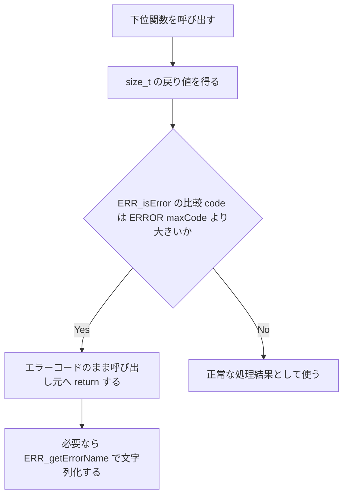
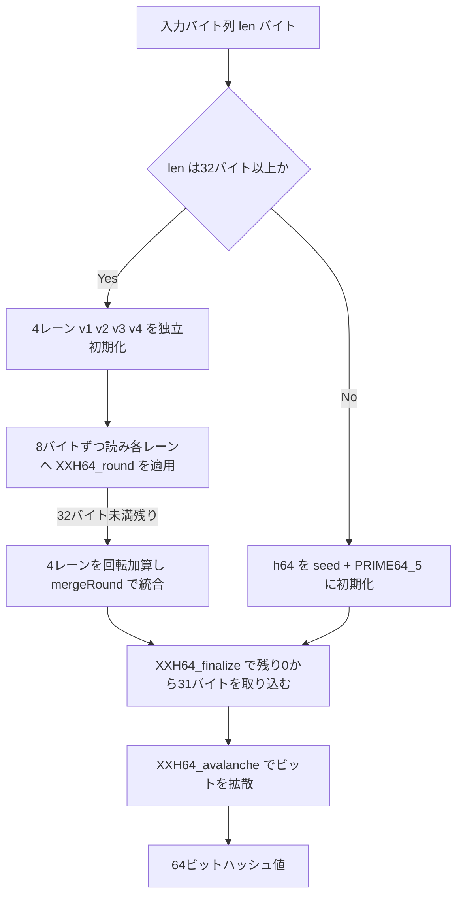

# 第6章 メモリアクセス・エラー表現・XXH64チェックサム

> **本章で読むソース**
>
> - [`lib/common/mem.h`](https://github.com/facebook/zstd/blob/v1.5.7/lib/common/mem.h)
> - [`lib/zstd_errors.h`](https://github.com/facebook/zstd/blob/v1.5.7/lib/zstd_errors.h)
> - [`lib/common/error_private.h`](https://github.com/facebook/zstd/blob/v1.5.7/lib/common/error_private.h)
> - [`lib/common/error_private.c`](https://github.com/facebook/zstd/blob/v1.5.7/lib/common/error_private.c)
> - [`lib/common/zstd_common.c`](https://github.com/facebook/zstd/blob/v1.5.7/lib/common/zstd_common.c)
> - [`lib/common/xxhash.h`](https://github.com/facebook/zstd/blob/v1.5.7/lib/common/xxhash.h)
> - [`lib/common/xxhash.c`](https://github.com/facebook/zstd/blob/v1.5.7/lib/common/xxhash.c)

## この章の狙い

zstd の圧縮・復号処理は、フレーム内の各フィールドをバイト列から直接読み書きし、失敗を戻り値に埋め込み、末尾のチェックサムで壊れを検出するという3つの下回りの上に成り立つ。
本章は、この3つを担う `lib/common/mem.h`、`error_private.h` / `zstd_errors.h`、`xxhash.c` / `xxhash.h` を読む。
`MEM_read*` 系がエンディアンとアラインメントの違いをどう吸収するか、`size_t` の戻り値が成功と失敗のどちらも表現できる理由、そして `Content_Checksum` を計算する **XXH64** の内部処理を、実装に沿って確認する。

## 前提

第2章で見た通り、frame の各フィールドは固定バイト数の整数として並んでいる。
これらのフィールドを読み書きするコードは、CPU アーキテクチャのエンディアンやアラインメント要求に関わらず同じ結果を返さなければならない。
また、圧縮・復号 API の多くは戻り値の型に `size_t` を使う。
`size_t` は本来サイズや長さを表す符号なし整数だが、zstd はこの型のまま、成功時の値域を超えた領域にエラーコードを埋め込む。
このエラー表現を読み解く鍵が `ZSTD_isError` と `ERR_isError` である。

## MEM_read/write：アラインメントとエンディアンの分離

`lib/common/mem.h` は、任意のアドレスから2バイト・4バイト・8バイトの整数を読み書きする関数群を提供する。

[`lib/common/mem.h` L75-L88](https://github.com/facebook/zstd/blob/v1.5.7/lib/common/mem.h#L75-L88)

```c
/*=== Static platform detection ===*/
MEM_STATIC unsigned MEM_32bits(void);
MEM_STATIC unsigned MEM_64bits(void);
MEM_STATIC unsigned MEM_isLittleEndian(void);

/*=== Native unaligned read/write ===*/
MEM_STATIC U16 MEM_read16(const void* memPtr);
MEM_STATIC U32 MEM_read32(const void* memPtr);
MEM_STATIC U64 MEM_read64(const void* memPtr);
MEM_STATIC size_t MEM_readST(const void* memPtr);

MEM_STATIC void MEM_write16(void* memPtr, U16 value);
MEM_STATIC void MEM_write32(void* memPtr, U32 value);
MEM_STATIC void MEM_write64(void* memPtr, U64 value);
```

`MEM_read16` から `MEM_write64` までは、値をネイティブのバイト順のまま読み書きする「アンアラインドアクセス」の層である。
frame のフィールドはワード境界に揃っているとは限らないため、ポインタを整数型へキャストしてそのまま参照すると、多くのアーキテクチャで未定義動作になる。
`MEM_FORCE_MEMORY_ACCESS` マクロは、この問題への対処方法を3通り切り替える。

[`lib/common/mem.h` L124-L135](https://github.com/facebook/zstd/blob/v1.5.7/lib/common/mem.h#L124-L135)

```c
/* MEM_FORCE_MEMORY_ACCESS : For accessing unaligned memory:
 * Method 0 : always use `memcpy()`. Safe and portable.
 * Method 1 : Use compiler extension to set unaligned access.
 * Method 2 : direct access. This method is portable but violate C standard.
 *            It can generate buggy code on targets depending on alignment.
 * Default  : method 1 if supported, else method 0
 */
#ifndef MEM_FORCE_MEMORY_ACCESS   /* can be defined externally, on command line for example */
#  ifdef __GNUC__
#    define MEM_FORCE_MEMORY_ACCESS 1
#  endif
#endif
```

デフォルトの GCC 系ビルドでは方式1が選ばれる。
`aligned(1)` 属性を付けた型を経由してポインタをキャストし、コンパイラにアラインメント制約を無視させる。

[`lib/common/mem.h` L177-L185](https://github.com/facebook/zstd/blob/v1.5.7/lib/common/mem.h#L177-L185)

```c
typedef __attribute__((aligned(1))) U16 unalign16;
typedef __attribute__((aligned(1))) U32 unalign32;
typedef __attribute__((aligned(1))) U64 unalign64;
typedef __attribute__((aligned(1))) size_t unalignArch;

MEM_STATIC U16 MEM_read16(const void* ptr) { return *(const unalign16*)ptr; }
MEM_STATIC U32 MEM_read32(const void* ptr) { return *(const unalign32*)ptr; }
MEM_STATIC U64 MEM_read64(const void* ptr) { return *(const unalign64*)ptr; }
MEM_STATIC size_t MEM_readST(const void* ptr) { return *(const unalignArch*)ptr; }
```

`aligned(1)` はコンパイラに対して「この型はどんなアドレスでも読み書きしてよい」と伝える指示であり、生成される機械語自体は通常のロード命令のままである。
これにより、余分な関数呼び出しや1バイトずつの合成を挟まずに、任意アドレスからの読み書きをコンパイラの最適化に任せられる。
それ以外のコンパイラでは、`ZSTD_memcpy` を介した方式0にフォールバックする。

[`lib/common/mem.h` L196-L204](https://github.com/facebook/zstd/blob/v1.5.7/lib/common/mem.h#L196-L204)

```c
MEM_STATIC U16 MEM_read16(const void* memPtr)
{
    U16 val; ZSTD_memcpy(&val, memPtr, sizeof(val)); return val;
}

MEM_STATIC U32 MEM_read32(const void* memPtr)
{
    U32 val; ZSTD_memcpy(&val, memPtr, sizeof(val)); return val;
}
```

`memcpy` はコンパイラが呼び出し先の意味を理解しているため、多くの環境で数命令のロードに最適化される。
この方式0が最も安全かつ移植性が高く、方式1・2はそれより速い場合があるという最適化トレードオフの選択肢として提供されている。

## MEM_isLittleEndian と MEM_readLE：エンディアン非依存化

frame の各フィールドは仕様上リトルエンディアンで格納される。
実行環境がビッグエンディアンであっても同じ結果を返すよう、`mem.h` は実行時にエンディアンを判定する。

[`lib/common/mem.h` L147-L164](https://github.com/facebook/zstd/blob/v1.5.7/lib/common/mem.h#L147-L164)

```c
MEM_STATIC unsigned MEM_isLittleEndian(void)
{
#if defined(__BYTE_ORDER__) && defined(__ORDER_LITTLE_ENDIAN__) && (__BYTE_ORDER__ == __ORDER_LITTLE_ENDIAN__)
    return 1;
#elif defined(__BYTE_ORDER__) && defined(__ORDER_BIG_ENDIAN__) && (__BYTE_ORDER__ == __ORDER_BIG_ENDIAN__)
    return 0;
#elif defined(__clang__) && __LITTLE_ENDIAN__
    return 1;
#elif defined(__clang__) && __BIG_ENDIAN__
    return 0;
#elif defined(_MSC_VER) && (_M_X64 || _M_IX86)
    return 1;
#elif defined(__DMC__) && defined(_M_IX86)
    return 1;
#elif defined(__IAR_SYSTEMS_ICC__) && __LITTLE_ENDIAN__
    return 1;
#else
    const union { U32 u; BYTE c[4]; } one = { 1 };   /* don't use static : performance detrimental  */
    return one.c[0];
#endif
}
```

前半のプリプロセッサ分岐は、コンパイラが提供するマクロからエンディアンをコンパイル時に確定させる経路である。
どのマクロにも該当しない環境向けの最終手段として、`union` を介して整数1をバイト列として観察する実行時判定を残している。
コメントの「don't use static」は、この `one` を `static` にするとコンパイラが値をキャッシュせず毎回メモリアクセスを発生させ、かえって遅くなることを示す注意書きである。

`MEM_readLE32` は、この判定結果に応じて処理を分岐する。

[`lib/common/mem.h` L321-L327](https://github.com/facebook/zstd/blob/v1.5.7/lib/common/mem.h#L321-L327)

```c
MEM_STATIC U32 MEM_readLE32(const void* memPtr)
{
    if (MEM_isLittleEndian())
        return MEM_read32(memPtr);
    else
        return MEM_swap32(MEM_read32(memPtr));
}
```

リトルエンディアン環境ではネイティブ読み込みをそのまま返し、ビッグエンディアン環境では `MEM_swap32` でバイト順を反転する。
`MEM_isLittleEndian` は関数の中身が定数式に還元できるため、コンパイラはこの分岐をビルド時に解決し、実行時の条件分岐を残さない。
`MEM_STATIC` は多くの環境で `static inline` に展開されるマクロであり、この定数畳み込みを後押しする。
`MEM_swap32` はプラットフォームごとの組み込み関数を優先して使う。

[`lib/common/mem.h` L241-L253](https://github.com/facebook/zstd/blob/v1.5.7/lib/common/mem.h#L241-L253)

```c
MEM_STATIC U32 MEM_swap32(U32 in)
{
#if defined(_MSC_VER)     /* Visual Studio */
    return _byteswap_ulong(in);
#elif (defined (__GNUC__) && (__GNUC__ * 100 + __GNUC_MINOR__ >= 403)) \
  || (defined(__clang__) && __has_builtin(__builtin_bswap32))
    return __builtin_bswap32(in);
#elif defined(__ICCARM__)
    return __REV(in);
#else
    return MEM_swap32_fallback(in);
#endif
}
```

`__builtin_bswap32` は多くの CPU でバイト反転専用の1命令に対応するため、シフトとマスクを組み合わせた `MEM_swap32_fallback` より速い。
このように `mem.h` は、コンパイル時のエンディアン判定・組み込み命令の利用・`memcpy` へのフォールバックという3層で、移植性と実行速度の両立を図っている。

## size_t に埋め込まれたエラー：ZSTD_isError の仕組み

zstd の圧縮・復号関数の多くは、成功時にはバイト数を、失敗時にはエラーコードを、同じ `size_t` の戻り値で返す。
この二重の意味を成立させる仕掛けは `error_private.h` にある。

[`lib/common/error_private.h` L45-L52](https://github.com/facebook/zstd/blob/v1.5.7/lib/common/error_private.h#L45-L52)

```c
#undef ERROR   /* already defined on Visual Studio */
#define ERROR(name) ZSTD_ERROR(name)
#define ZSTD_ERROR(name) ((size_t)-PREFIX(name))

ERR_STATIC unsigned ERR_isError(size_t code) { return (code > ERROR(maxCode)); }

ERR_STATIC ERR_enum ERR_getErrorCode(size_t code) { if (!ERR_isError(code)) return (ERR_enum)0; return (ERR_enum) (0-code); }
```

`ERROR(name)` は、`ZSTD_ErrorCode` の列挙値を符号反転し `size_t` にキャストする。
`size_t` は符号なし整数なので、小さな正の列挙値を負にキャストした結果は、`size_t` の最大値付近の非常に大きな値になる。
`zstd_errors.h` の列挙は次の通り、最大でも `ZSTD_error_maxCode = 120` に収まる。

[`lib/zstd_errors.h` L60-L92](https://github.com/facebook/zstd/blob/v1.5.7/lib/zstd_errors.h#L60-L92)

```c
typedef enum {
  ZSTD_error_no_error = 0,
  ZSTD_error_GENERIC  = 1,
  ZSTD_error_prefix_unknown                = 10,
  ZSTD_error_version_unsupported           = 12,
  ZSTD_error_frameParameter_unsupported    = 14,
  ZSTD_error_frameParameter_windowTooLarge = 16,
  ZSTD_error_corruption_detected = 20,
  ZSTD_error_checksum_wrong      = 22,
  ZSTD_error_literals_headerWrong = 24,
  ZSTD_error_dictionary_corrupted      = 30,
  ZSTD_error_dictionary_wrong          = 32,
  ZSTD_error_dictionaryCreation_failed = 34,
  ZSTD_error_parameter_unsupported   = 40,
  ZSTD_error_parameter_combination_unsupported = 41,
  ZSTD_error_parameter_outOfBound    = 42,
  ZSTD_error_tableLog_tooLarge       = 44,
  ZSTD_error_maxSymbolValue_tooLarge = 46,
  ZSTD_error_maxSymbolValue_tooSmall = 48,
  ZSTD_error_cannotProduce_uncompressedBlock = 49,
  ZSTD_error_stabilityCondition_notRespected = 50,
  ZSTD_error_stage_wrong       = 60,
  ZSTD_error_init_missing      = 62,
  ZSTD_error_memory_allocation = 64,
  ZSTD_error_workSpace_tooSmall= 66,
  ZSTD_error_dstSize_tooSmall = 70,
  ZSTD_error_srcSize_wrong    = 72,
  ZSTD_error_dstBuffer_null   = 74,
  ZSTD_error_noForwardProgress_destFull = 80,
  ZSTD_error_noForwardProgress_inputEmpty = 82,
  /* following error codes are __NOT STABLE__, they can be removed or changed in future versions */
  ZSTD_error_frameIndex_tooLarge = 100,
  ZSTD_error_seekableIO          = 102,
  ZSTD_error_dstBuffer_wrong     = 104,
  ZSTD_error_srcBuffer_wrong     = 105,
  ZSTD_error_sequenceProducer_failed = 106,
  ZSTD_error_externalSequences_invalid = 107,
  ZSTD_error_maxCode = 120  /* never EVER use this value directly, it can change in future versions! Use ZSTD_isError() instead */
} ZSTD_ErrorCode;
```

`ERROR(maxCode)` は `(size_t)-120` であり、これは `SIZE_MAX - 119` に等しい巨大な値になる。
現実の圧縮・復号処理が実際に扱うバッファサイズがこの値を超えることはまずないため、`ERR_isError` は「戻り値がこの巨大な値より大きいか」だけを見て、エラーかどうかを一つの比較で判定できる。
`ZSTD_isError` は、この `ERR_isError` を公開 API 向けにラップしたものである。

[`lib/common/zstd_common.c` L30-L36](https://github.com/facebook/zstd/blob/v1.5.7/lib/common/zstd_common.c#L30-L36)

```c
#undef ZSTD_isError   /* defined within zstd_internal.h */
/*! ZSTD_isError() :
 *  tells if a return value is an error code
 *  symbol is required for external callers */
unsigned ZSTD_isError(size_t code) { return ERR_isError(code); }
```

内部コードは `zstd_internal.h` の `#define ZSTD_isError ERR_isError` によって、この呼び出しをマクロ展開だけで済ませ、関数呼び出しのオーバーヘッドを避けている。
`ERR_getErrorName` は、この戻り値をそのまま人間可読な文字列へ変換する。

[`lib/common/error_private.h` L72-L75](https://github.com/facebook/zstd/blob/v1.5.7/lib/common/error_private.h#L72-L75)

```c
ERR_STATIC const char* ERR_getErrorName(size_t code)
{
    return ERR_getErrorString(ERR_getErrorCode(code));
}
```

`ERR_getErrorString` は `error_private.c` の巨大な `switch` 文で、列挙値ごとに固定文字列を返す。

[`lib/common/error_private.c` L24-L28](https://github.com/facebook/zstd/blob/v1.5.7/lib/common/error_private.c#L24-L28)

```c
    case PREFIX(no_error): return "No error detected";
    case PREFIX(GENERIC):  return "Error (generic)";
    case PREFIX(prefix_unknown): return "Unknown frame descriptor";
    case PREFIX(version_unsupported): return "Version not supported";
    case PREFIX(frameParameter_unsupported): return "Unsupported frame parameter";
```

## RETURN_ERROR と FORWARD_IF_ERROR：エラー伝播のマクロ

内部関数は、この size_t エラー表現を手作業のチェックなしに伝播させるため、`RETURN_ERROR` と `FORWARD_IF_ERROR` というマクロを使う。

[`lib/common/error_private.h` L130-L156](https://github.com/facebook/zstd/blob/v1.5.7/lib/common/error_private.h#L130-L156)

```c
#define RETURN_ERROR(err, ...)                                               \
    do {                                                                     \
        RAWLOG(3, "%s:%d: ERROR!: unconditional check failed, returning %s", \
              __FILE__, __LINE__, ERR_QUOTE(ERROR(err)));                    \
        _FORCE_HAS_FORMAT_STRING(__VA_ARGS__);                               \
        RAWLOG(3, ": " __VA_ARGS__);                                         \
        RAWLOG(3, "\n");                                                     \
        return ERROR(err);                                                   \
    } while(0)

/**
 * If the provided expression evaluates to an error code, returns that error code.
 *
 * In debug modes, prints additional information.
 */
#define FORWARD_IF_ERROR(err, ...)                                                 \
    do {                                                                           \
        size_t const err_code = (err);                                             \
        if (ERR_isError(err_code)) {                                               \
            RAWLOG(3, "%s:%d: ERROR!: forwarding error in %s: %s",                 \
                  __FILE__, __LINE__, ERR_QUOTE(err), ERR_getErrorName(err_code)); \
            _FORCE_HAS_FORMAT_STRING(__VA_ARGS__);                                 \
            RAWLOG(3, ": " __VA_ARGS__);                                           \
            RAWLOG(3, "\n");                                                       \
            return err_code;                                                       \
        }                                                                          \
    } while(0)
```

`FORWARD_IF_ERROR` は、下位関数の呼び出し結果が `ERR_isError` を満たすときだけ、その値をそのまま呼び出し元へ `return` する。
`RAWLOG` によるログ出力はデバッグビルドでのみ有効になり、リリースビルドでは消える。
`RETURN_ERROR` は条件を問わず特定のエラーで即座に抜けるための版であり、`RETURN_ERROR_IF` はその条件付き版である。
復号処理では、これらのマクロが随所で使われている。

[`lib/decompress/zstd_decompress.c` L1049-L1055](https://github.com/facebook/zstd/blob/v1.5.7/lib/decompress/zstd_decompress.c#L1049-L1055)

```c
    if (dctx->fParams.checksumFlag) { /* Frame content checksum verification */
        RETURN_ERROR_IF(remainingSrcSize<4, checksum_wrong, "");
        if (!dctx->forceIgnoreChecksum) {
            U32 const checkCalc = (U32)XXH64_digest(&dctx->xxhState);
            U32 checkRead;
            checkRead = MEM_readLE32(ip);
            RETURN_ERROR_IF(checkRead != checkCalc, checksum_wrong, "");
        }
```

以下は、`size_t` 戻り値を使ったエラー判定の流れを示す。



## XXH64：Content_Checksum を支えるハッシュ関数

第2章で見た通り、frame の末尾には任意で4バイトの `Content_Checksum` が付く。
これは伸長後のコンテンツ全体に対する **XXH64** の下位32ビットである。
`lib/common/xxhash.c` はヘッダオンリーライブラリである `xxhash.h` の実体を1箇所に定義するための翻訳単位にすぎない。

[`lib/common/xxhash.c` L11-L18](https://github.com/facebook/zstd/blob/v1.5.7/lib/common/xxhash.c#L11-L18)

```c
/*
 * xxhash.c instantiates functions defined in xxhash.h
 */

#define XXH_STATIC_LINKING_ONLY /* access advanced declarations */
#define XXH_IMPLEMENTATION      /* access definitions */

#include "xxhash.h"
```

XXH64 は5つの64ビット素数定数を使う。

[`lib/common/xxhash.h` L3361-L3365](https://github.com/facebook/zstd/blob/v1.5.7/lib/common/xxhash.h#L3361-L3365)

```c
#define XXH_PRIME64_1  0x9E3779B185EBCA87ULL  /*!< 0b1001111000110111011110011011000110000101111010111100101010000111 */
#define XXH_PRIME64_2  0xC2B2AE3D27D4EB4FULL  /*!< 0b1100001010110010101011100011110100100111110101001110101101001111 */
#define XXH_PRIME64_3  0x165667B19E3779F9ULL  /*!< 0b0001011001010110011001111011000110011110001101110111100111111001 */
#define XXH_PRIME64_4  0x85EBCA77C2B2AE63ULL  /*!< 0b1000010111101011110010100111011111000010101100101010111001100011 */
#define XXH_PRIME64_5  0x27D4EB2F165667C5ULL  /*!< 0b0010011111010100111010110010111100010110010101100110011111000101 */
```

これらの定数は、ビット列に0と1が偏りなく現れるよう選ばれた奇数の素数であり、乗算・回転と組み合わせることで入力のわずかな変化を出力全体へ拡散させる[^avalanche]。

[^avalanche]: この拡散性は「アバランチ効果」と呼ばれ、xxHash の作者による設計解説で詳しく説明されている。

主処理を担う `XXH64_endian_align` は、入力が32バイト以上あるとき、4本の累積変数（アキュムレータ）を独立に更新するループへ入る。

[`lib/common/xxhash.h` L3483-L3506](https://github.com/facebook/zstd/blob/v1.5.7/lib/common/xxhash.h#L3483-L3506)

```c
XXH_FORCE_INLINE XXH_PUREF xxh_u64
XXH64_endian_align(const xxh_u8* input, size_t len, xxh_u64 seed, XXH_alignment align)
{
    xxh_u64 h64;
    if (input==NULL) XXH_ASSERT(len == 0);

    if (len>=32) {
        const xxh_u8* const bEnd = input + len;
        const xxh_u8* const limit = bEnd - 31;
        xxh_u64 v1 = seed + XXH_PRIME64_1 + XXH_PRIME64_2;
        xxh_u64 v2 = seed + XXH_PRIME64_2;
        xxh_u64 v3 = seed + 0;
        xxh_u64 v4 = seed - XXH_PRIME64_1;

        do {
            v1 = XXH64_round(v1, XXH_get64bits(input)); input+=8;
            v2 = XXH64_round(v2, XXH_get64bits(input)); input+=8;
            v3 = XXH64_round(v3, XXH_get64bits(input)); input+=8;
            v4 = XXH64_round(v4, XXH_get64bits(input)); input+=8;
        } while (input<limit);

        h64 = XXH_rotl64(v1, 1) + XXH_rotl64(v2, 7) + XXH_rotl64(v3, 12) + XXH_rotl64(v4, 18);
        h64 = XXH64_mergeRound(h64, v1);
        h64 = XXH64_mergeRound(h64, v2);
        h64 = XXH64_mergeRound(h64, v3);
        h64 = XXH64_mergeRound(h64, v4);

    } else {
        h64  = seed + XXH_PRIME64_5;
    }
```

`v1` から `v4` はそれぞれ異なる初期値からスタートし、8バイトずつ読み進めながら1レーンあたり1回の `XXH64_round` を適用する。

[`lib/common/xxhash.h` L3376-L3399](https://github.com/facebook/zstd/blob/v1.5.7/lib/common/xxhash.h#L3376-L3399)

```c
static xxh_u64 XXH64_round(xxh_u64 acc, xxh_u64 input)
{
    acc += input * XXH_PRIME64_2;
    acc  = XXH_rotl64(acc, 31);
    acc *= XXH_PRIME64_1;
#if (defined(__AVX512F__)) && !defined(XXH_ENABLE_AUTOVECTORIZE)
    // ... (中略) ...
    XXH_COMPILER_GUARD(acc);
#endif
    return acc;
}
```

`v1` の更新は `v2`・`v3`・`v4` の値に依存せず、逆も同様である。
このデータ依存の不在により、CPU は4本のレーンを並行してパイプラインに流し込める。
乗算・回転・乗算という各レーンの処理には、それぞれ数サイクルのレイテンシがあるが、4レーンが独立しているため、1レーンの結果を待たずに次のレーンの計算を進められる。
これは、1本の累積変数に対して8バイトずつ逐次的に演算する単純な実装に比べ、命令レベル並列性（ILP）を引き出してスループットを高める工夫である。
`__AVX512F__` 環境でのみ挿入される `XXH_COMPILER_GUARD` は、コンパイラの自動ベクトル化がこのループにかえって悪影響を与える場合があるための抑制策であり、コメントはその判断がCPU世代によって変わりうることを断っている。

ループを終えた4本のレーンは、回転・加算・`XXH64_mergeRound` によって1本のハッシュへ統合される。

[`lib/common/xxhash.h` L3401-L3407](https://github.com/facebook/zstd/blob/v1.5.7/lib/common/xxhash.h#L3401-L3407)

```c
static xxh_u64 XXH64_mergeRound(xxh_u64 acc, xxh_u64 val)
{
    val  = XXH64_round(0, val);
    acc ^= val;
    acc  = acc * XXH_PRIME64_1 + XXH_PRIME64_4;
    return acc;
}
```

32バイト未満の端数、および32バイト単位のループを抜けた後に残る0から31バイトは、`XXH64_finalize` が8バイト・4バイト・1バイトの各粒度で順に取り込む。

[`lib/common/xxhash.h` L3437-L3460](https://github.com/facebook/zstd/blob/v1.5.7/lib/common/xxhash.h#L3437-L3460)

```c
static XXH_PUREF xxh_u64
XXH64_finalize(xxh_u64 hash, const xxh_u8* ptr, size_t len, XXH_alignment align)
{
    if (ptr==NULL) XXH_ASSERT(len == 0);
    len &= 31;
    while (len >= 8) {
        xxh_u64 const k1 = XXH64_round(0, XXH_get64bits(ptr));
        ptr += 8;
        hash ^= k1;
        hash  = XXH_rotl64(hash,27) * XXH_PRIME64_1 + XXH_PRIME64_4;
        len -= 8;
    }
    if (len >= 4) {
        hash ^= (xxh_u64)(XXH_get32bits(ptr)) * XXH_PRIME64_1;
        ptr += 4;
        hash = XXH_rotl64(hash, 23) * XXH_PRIME64_2 + XXH_PRIME64_3;
        len -= 4;
    }
    while (len > 0) {
        hash ^= (*ptr++) * XXH_PRIME64_5;
        hash = XXH_rotl64(hash, 11) * XXH_PRIME64_1;
        --len;
    }
    return  XXH64_avalanche(hash);
}
```

最後に呼ばれる `XXH64_avalanche` は、シフトと乗算を3回繰り返し、ここまでの累積値に残っている偏りを消して、出力ビット全体へ均等に拡散させる。

[`lib/common/xxhash.h` L3410-L3417](https://github.com/facebook/zstd/blob/v1.5.7/lib/common/xxhash.h#L3410-L3417)

```c
static xxh_u64 XXH64_avalanche(xxh_u64 hash)
{
    hash ^= hash >> 33;
    hash *= XXH_PRIME64_2;
    hash ^= hash >> 29;
    hash *= XXH_PRIME64_3;
    hash ^= hash >> 32;
    return hash;
}
```

処理全体の流れは次のようになる。



## 圧縮・復号でのXXH64の使い方

圧縮側は、`ZSTD_c_checksumFlag` が有効なとき、ブロックへ書き出す元データを都度 `XXH64_update` へ流し込み、フレーム末尾で `XXH64_digest` により最終値を取り出す。

[`lib/compress/zstd_compress.c` L4607-L4608](https://github.com/facebook/zstd/blob/v1.5.7/lib/compress/zstd_compress.c#L4607-L4608)

```c
    if (cctx->appliedParams.fParams.checksumFlag && srcSize)
        XXH64_update(&cctx->xxhState, src, srcSize);
```

[`lib/compress/zstd_compress.c` L5371-L5375](https://github.com/facebook/zstd/blob/v1.5.7/lib/compress/zstd_compress.c#L5371-L5375)

```c
    if (cctx->appliedParams.fParams.checksumFlag) {
        U32 const checksum = (U32) XXH64_digest(&cctx->xxhState);
        RETURN_ERROR_IF(dstCapacity<4, dstSize_tooSmall, "no room for checksum");
        DEBUGLOG(4, "ZSTD_writeEpilogue: write checksum : %08X", (unsigned)checksum);
        MEM_writeLE32(op, checksum);
```

復号側は、伸長した各ブロックを同じ `XXH64_state_t` へ累積し、フレーム末尾の4バイトを `MEM_readLE32` で読み出して比較する。

[`lib/decompress/zstd_decompress.c` L1049-L1055](https://github.com/facebook/zstd/blob/v1.5.7/lib/decompress/zstd_decompress.c#L1049-L1055)

```c
    if (dctx->fParams.checksumFlag) { /* Frame content checksum verification */
        RETURN_ERROR_IF(remainingSrcSize<4, checksum_wrong, "");
        if (!dctx->forceIgnoreChecksum) {
            U32 const checkCalc = (U32)XXH64_digest(&dctx->xxhState);
            U32 checkRead;
            checkRead = MEM_readLE32(ip);
            RETURN_ERROR_IF(checkRead != checkCalc, checksum_wrong, "");
        }
```

計算値と読み取り値が食い違えば `ZSTD_error_checksum_wrong` が `RETURN_ERROR_IF` によって即座に返され、ここまで見てきた `size_t` エラー表現の経路に乗って呼び出し元へ伝わる。
`MEM_writeLE32` と `MEM_readLE32` が担うエンディアン変換、XXH64 が担うハッシュ計算、そして `RETURN_ERROR_IF` が担うエラー伝播は、この4バイトを書いて読み戻すだけの処理の中で連携している。

## まとめ

`mem.h` はコンパイル時のエンディアン判定と組み込みバイトスワップ命令を組み合わせ、アンアラインドかつリトルエンディアン固定のフィールドアクセスを実行時分岐なしに実現している。
`error_private.h` は列挙値を符号反転した `size_t` にエラーを埋め込み、`ERR_isError` の一回の比較で成功・失敗を判定できるようにしている。
XXH64 は4レーンの独立したアキュムレータで命令レベル並列性を稼ぎ、`avalanche` によって出力を拡散させることで、frame の `Content_Checksum` に必要な衝突耐性を得ている。

## 関連する章

- [第2章 フレームフォーマット](../part00-overview/02-frame-format.md)
- [第22章 decompress frame](../part06-decompress/22-decompress-frame.md)
