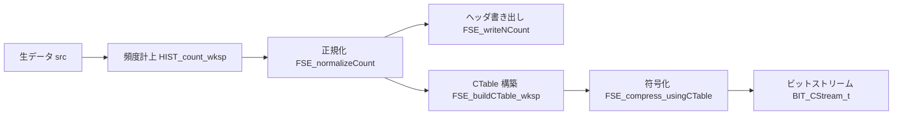
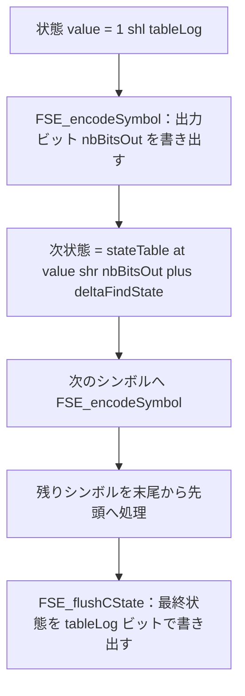

# 第7章 FSE 符号化：正規化カウントと状態遷移テーブル

> **本章で読むソース**
>
> - [`lib/common/fse.h`](https://github.com/facebook/zstd/blob/v1.5.7/lib/common/fse.h)
> - [`lib/compress/fse_compress.c`](https://github.com/facebook/zstd/blob/v1.5.7/lib/compress/fse_compress.c)
> - [`lib/compress/hist.h`](https://github.com/facebook/zstd/blob/v1.5.7/lib/compress/hist.h)

## この章の狙い

zstd はリテラルとシーケンスの両方を、Huffman ではなく **FSE**（Finite State Entropy）で符号化する場面を持つ。
FSE はシンボルの出現頻度から**正規化カウント**という整数の分布を作り、それをもとに**状態遷移テーブル**を構築して、1シンボルあたり数ビット単位の分数ビット長でデータを圧縮する。
本章では、頻度計上から正規化、テーブル構築、実際の符号化までの一連のパイプラインを、`lib/compress/fse_compress.c` の実装に沿って追う。
復号側のテーブル構築と状態遷移は第8章で扱い、本章は符号化側に絞る。

## 前提

FSE は **tANS**（table-based Asymmetric Numeral System）と呼ばれる符号化方式の一実装である。
tANS は、算術符号と同じく分数ビット長でシンボルを表現できる方式でありながら、符号化と復号の両方をテーブル参照とビット演算だけで行える。
乗算や除算を伴う算術符号の状態更新を、事前に計算済みのテーブル引きに置き換えている点が tANS の特徴であり、この置き換えが本章で説明する最適化の核になる。

FSE の符号化は、`lib/common/fse.h` の冒頭コメントが手順として要約している。

[`lib/common/fse.h` L63-75](https://github.com/facebook/zstd/blob/v1.5.7/lib/common/fse.h#L63-L75)

```c
/*!
FSE_compress() does the following:
1. count symbol occurrence from source[] into table count[] (see hist.h)
2. normalize counters so that sum(count[]) == Power_of_2 (2^tableLog)
3. save normalized counters to memory buffer using writeNCount()
4. build encoding table 'CTable' from normalized counters
5. encode the data stream using encoding table 'CTable'

FSE_decompress() does the following:
1. read normalized counters with readNCount()
2. build decoding table 'DTable' from normalized counters
3. decode the data stream using decoding table 'DTable'
```

この5段階が、そのまま本章の節構成に対応する。
パイプライン全体を図示すると次のようになる。



## 頻度計上：HIST_count_wksp

最初の段階は、シンボルごとの出現回数を数えることである。
zstd はこの処理を `lib/compress/hist.c` の `HIST_count_wksp` に任せており、`fse_compress.c` はその結果を受け取る側にあたる。

[`lib/compress/hist.h` L40-48](https://github.com/facebook/zstd/blob/v1.5.7/lib/compress/hist.h#L40-L48)

```c
/** HIST_count_wksp() :
 *  Same as HIST_count(), but using an externally provided scratch buffer.
 *  Benefit is this function will use very little stack space.
 * `workSpace` is a writable buffer which must be 4-bytes aligned,
 * `workSpaceSize` must be >= HIST_WKSP_SIZE
 */
size_t HIST_count_wksp(unsigned* count, unsigned* maxSymbolValuePtr,
                       const void* src, size_t srcSize,
                       void* workSpace, size_t workSpaceSize);
```

出力される `count[]` は、シンボル値ごとの生の出現回数の配列である。
この段階ではまだ2の冪に正規化されておらず、次段の `FSE_normalizeCount` が受け取る入力になる。

## 正規化：FSE_normalizeCount

FSE のテーブルは `2^tableLog` 個の状態を持つ。
生の頻度分布はどんな合計値になるかわからないため、`FSE_normalizeCount` は各シンボルの頻度を、合計がちょうど `2^tableLog` になるように再配分する。

[`lib/compress/fse_compress.c` L465-508](https://github.com/facebook/zstd/blob/v1.5.7/lib/compress/fse_compress.c#L465-L508)

```c
size_t FSE_normalizeCount (short* normalizedCounter, unsigned tableLog,
                           const unsigned* count, size_t total,
                           unsigned maxSymbolValue, unsigned useLowProbCount)
{
    /* Sanity checks */
    if (tableLog==0) tableLog = FSE_DEFAULT_TABLELOG;
    if (tableLog < FSE_MIN_TABLELOG) return ERROR(GENERIC);   /* Unsupported size */
    if (tableLog > FSE_MAX_TABLELOG) return ERROR(tableLog_tooLarge);   /* Unsupported size */
    if (tableLog < FSE_minTableLog(total, maxSymbolValue)) return ERROR(GENERIC);   /* Too small tableLog, compression potentially impossible */

    {   static U32 const rtbTable[] = {     0, 473195, 504333, 520860, 550000, 700000, 750000, 830000 };
        short const lowProbCount = useLowProbCount ? -1 : 1;
        U64 const scale = 62 - tableLog;
        U64 const step = ZSTD_div64((U64)1<<62, (U32)total);   /* <== here, one division ! */
        U64 const vStep = 1ULL<<(scale-20);
        int stillToDistribute = 1<<tableLog;
        unsigned s;
        unsigned largest=0;
        short largestP=0;
        U32 lowThreshold = (U32)(total >> tableLog);

        for (s=0; s<=maxSymbolValue; s++) {
            if (count[s] == total) return 0;   /* rle special case */
            if (count[s] == 0) { normalizedCounter[s]=0; continue; }
            if (count[s] <= lowThreshold) {
                normalizedCounter[s] = lowProbCount;
                stillToDistribute--;
            } else {
                short proba = (short)((count[s]*step) >> scale);
                if (proba<8) {
                    U64 restToBeat = vStep * rtbTable[proba];
                    proba += (count[s]*step) - ((U64)proba<<scale) > restToBeat;
                }
                if (proba > largestP) { largestP=proba; largest=s; }
                normalizedCounter[s] = proba;
                stillToDistribute -= proba;
        }   }
        if (-stillToDistribute >= (normalizedCounter[largest] >> 1)) {
            /* corner case, need another normalization method */
            size_t const errorCode = FSE_normalizeM2(normalizedCounter, tableLog, count, total, maxSymbolValue, lowProbCount);
            if (FSE_isError(errorCode)) return errorCode;
        }
        else normalizedCounter[largest] += (short)stillToDistribute;
    }

    return tableLog;
}
```

除算を1回だけ行い（`step = 2^62 / total`）、以降の各シンボルは乗算とシフトだけで比例配分の近似値 `proba` を得る。
`total` での除算をシンボル数ぶん繰り返さずに済むよう、あらかじめ求めた `step` を全シンボルで使い回している。

`count[s] <= lowThreshold` の分岐が、低頻度シンボルへの**下限保証**にあたる。
出現回数がわずかでも、比例配分では正規化後の頻度が0になりうる。
頻度0のシンボルは符号化できなくなるため、`FSE_normalizeCount` は下限を下回るシンボルに `lowProbCount`（1、または `useLowProbCount` が真のとき -1）を強制的に割り当てて除外し、残りの頻度から再配分する。
`-1` という符号付きの値は、後述の `FSE_buildCTable_wksp` で「1回だけ出現する低確率シンボル」を通常のシンボルと区別するための印であり、テーブル中の特別な領域（`highThreshold` から降順に埋める領域）に押し出される。

比例配分は丸め誤差を必ず生むため、合計が `2^tableLog` からずれる。
`stillToDistribute` はこのずれを累積した値であり、最後に最頻出シンボル `largest` へまとめて加算することで、合計をちょうど `2^tableLog` に合わせる。
ずれが `largest` の頻度の半分を超えるほど大きい場合だけ、`FSE_normalizeM2` という別の按分方法に切り替える。

## 最適な tableLog：FSE_optimalTableLog

`tableLog` を大きくするほどテーブルは細かくなり圧縮率は上がるが、テーブル自体のサイズと構築コストも増える。
`FSE_optimalTableLog` は、入力サイズとシンボル種類数から見合った `tableLog` を決める。

[`lib/compress/fse_compress.c` L347-374](https://github.com/facebook/zstd/blob/v1.5.7/lib/compress/fse_compress.c#L347-L374)

```c
/* provides the minimum logSize to safely represent a distribution */
static unsigned FSE_minTableLog(size_t srcSize, unsigned maxSymbolValue)
{
    U32 minBitsSrc = ZSTD_highbit32((U32)(srcSize)) + 1;
    U32 minBitsSymbols = ZSTD_highbit32(maxSymbolValue) + 2;
    U32 minBits = minBitsSrc < minBitsSymbols ? minBitsSrc : minBitsSymbols;
    assert(srcSize > 1); /* Not supported, RLE should be used instead */
    return minBits;
}

unsigned FSE_optimalTableLog_internal(unsigned maxTableLog, size_t srcSize, unsigned maxSymbolValue, unsigned minus)
{
    U32 maxBitsSrc = ZSTD_highbit32((U32)(srcSize - 1)) - minus;
    U32 tableLog = maxTableLog;
    U32 minBits = FSE_minTableLog(srcSize, maxSymbolValue);
    assert(srcSize > 1); /* Not supported, RLE should be used instead */
    if (tableLog==0) tableLog = FSE_DEFAULT_TABLELOG;
    if (maxBitsSrc < tableLog) tableLog = maxBitsSrc;   /* Accuracy can be reduced */
    if (minBits > tableLog) tableLog = minBits;   /* Need a minimum to safely represent all symbol values */
    if (tableLog < FSE_MIN_TABLELOG) tableLog = FSE_MIN_TABLELOG;
    if (tableLog > FSE_MAX_TABLELOG) tableLog = FSE_MAX_TABLELOG;
    return tableLog;
}

unsigned FSE_optimalTableLog(unsigned maxTableLog, size_t srcSize, unsigned maxSymbolValue)
{
    return FSE_optimalTableLog_internal(maxTableLog, srcSize, maxSymbolValue, 2);
}
```

`srcSize` が小さいときは `maxBitsSrc` によって `tableLog` を切り下げる。
入力バイト数より大きなテーブルを構築しても、シンボルの出現回数が疎になるだけで精度が上がらず、テーブル構築のコストだけが増えるからである。
一方で `minBits`（`FSE_minTableLog` が返す下限）を下回ると、シンボル全種類に頻度1すら割り当てられない場合が生じうる。
上限と下限の両方を計算してから `tableLog` を確定させる、という順序が、小さい入力を過剰な精度で扱う無駄と、シンボルを表現しきれない破綻の両方を避けている。

## FSE_buildCTable_wksp：cumul と spread による状態割り当て

正規化カウントが決まれば、次はそれを実際の符号化テーブル `FSE_CTable` に変換する。
中心になるのは `FSE_buildCTable_wksp` であり、まず各シンボルがテーブル中のどの範囲を占めるかを `cumul`（累積和）で決める。

[`lib/compress/fse_compress.c` L100-113](https://github.com/facebook/zstd/blob/v1.5.7/lib/compress/fse_compress.c#L100-L113)

```c
    /* symbol start positions */
    {   U32 u;
        cumul[0] = 0;
        for (u=1; u <= maxSV1; u++) {
            if (normalizedCounter[u-1]==-1) {  /* Low proba symbol */
                cumul[u] = cumul[u-1] + 1;
                tableSymbol[highThreshold--] = (FSE_FUNCTION_TYPE)(u-1);
            } else {
                assert(normalizedCounter[u-1] >= 0);
                cumul[u] = cumul[u-1] + (U16)normalizedCounter[u-1];
                assert(cumul[u] >= cumul[u-1]);  /* no overflow */
        }   }
        cumul[maxSV1] = (U16)(tableSize+1);
    }
```

`normalizedCounter[u-1]==-1` の分岐が、先に触れた低確率シンボルの処理である。
そのシンボルはテーブル末尾（`highThreshold` から降順）に直接1個だけ配置され、`cumul` には頻度1として計上される。
それ以外のシンボルは、正規化カウントの値をそのまま `cumul` に積み上げる。

次に `spread` の段階で、各シンボルの出現位置をテーブル全体に分散させる。
低確率シンボルが存在しない一般的なケースでは、`step` を使った擬似ランダムな配置になる。

[`lib/compress/fse_compress.c` L154-167](https://github.com/facebook/zstd/blob/v1.5.7/lib/compress/fse_compress.c#L154-L167)

```c
    } else {
        U32 position = 0;
        U32 symbol;
        for (symbol=0; symbol<maxSV1; symbol++) {
            int nbOccurrences;
            int const freq = normalizedCounter[symbol];
            for (nbOccurrences=0; nbOccurrences<freq; nbOccurrences++) {
                tableSymbol[position] = (FSE_FUNCTION_TYPE)symbol;
                position = (position + step) & tableMask;
                while (position > highThreshold)
                    position = (position + step) & tableMask;   /* Low proba area */
        }   }
        assert(position==0);  /* Must have initialized all positions */
    }
```

`step` は `FSE_TABLESTEP` マクロで決まる固定値である。

[`lib/common/fse.h` L623](https://github.com/facebook/zstd/blob/v1.5.7/lib/common/fse.h#L623)

```c
#define FSE_TABLESTEP(tableSize) (((tableSize)>>1) + ((tableSize)>>3) + 3)
```

`tableSize` と互いに素になるよう選ばれたこの歩幅により、`position` はテーブル全体をちょうど1周してすべての位置を1回ずつ埋める。
頻度の高いシンボルほど多くの位置に配置されるため、テーブルを1つずつ順に読み進めるだけで、頻度に比例した確率でそのシンボルに出会う分布ができあがる。

配置が終わると、シンボルの並びからテーブル本体 `tableU16` を作る。

[`lib/compress/fse_compress.c` L169-173](https://github.com/facebook/zstd/blob/v1.5.7/lib/compress/fse_compress.c#L169-L173)

```c
    /* Build table */
    {   U32 u; for (u=0; u<tableSize; u++) {
        FSE_FUNCTION_TYPE s = tableSymbol[u];   /* note : static analyzer may not understand tableSymbol is properly initialized */
        tableU16[cumul[s]++] = (U16) (tableSize+u);   /* TableU16 : sorted by symbol order; gives next state value */
    }   }
```

ここで `cumul[s]` を後置インクリメントしながらインデックスに使うことで、同じシンボル `s` に属する複数の状態値が、`cumul[s]` から始まる連続した領域に、出現順に並んで格納される。
`tableSize+u` という値そのものが、次に遷移する状態番号である。

最後に、シンボルごとの符号化コストをまとめた `symbolTT`（`FSE_symbolCompressionTransform`）を計算する。

[`lib/compress/fse_compress.c` L175-200](https://github.com/facebook/zstd/blob/v1.5.7/lib/compress/fse_compress.c#L175-L200)

```c
    /* Build Symbol Transformation Table */
    {   unsigned total = 0;
        unsigned s;
        for (s=0; s<=maxSymbolValue; s++) {
            switch (normalizedCounter[s])
            {
            case  0:
                /* filling nonetheless, for compatibility with FSE_getMaxNbBits() */
                symbolTT[s].deltaNbBits = ((tableLog+1) << 16) - (1<<tableLog);
                break;

            case -1:
            case  1:
                symbolTT[s].deltaNbBits = (tableLog << 16) - (1<<tableLog);
                assert(total <= INT_MAX);
                symbolTT[s].deltaFindState = (int)(total - 1);
                total ++;
                break;
            default :
                assert(normalizedCounter[s] > 1);
                {   U32 const maxBitsOut = tableLog - ZSTD_highbit32 ((U32)normalizedCounter[s]-1);
                    U32 const minStatePlus = (U32)normalizedCounter[s] << maxBitsOut;
                    symbolTT[s].deltaNbBits = (maxBitsOut << 16) - minStatePlus;
                    symbolTT[s].deltaFindState = (int)(total - (unsigned)normalizedCounter[s]);
                    total +=  (unsigned)normalizedCounter[s];
    }   }   }   }
```

`deltaNbBits` は、そのシンボルを符号化するときに出力すべきビット数を、上位16ビットに整数部、下位16ビットに固定小数点の補正値として詰め込んだ値である。
`deltaFindState` は、状態遷移テーブル `tableU16` の中で、そのシンボルの領域が始まる位置を指す。
頻度が高いシンボル（`normalizedCounter[s]` が大きい）ほど `maxBitsOut` が小さくなり、出力ビット数が減る。
これが、tANS が頻度に応じて出力ビット数を変える仕組みの核心である。

## FSE_compress_usingCTable：末尾からの状態巻き戻し

CTable が完成すれば、実際の符号化に進む。
FSE の符号化は、`bitstream.h` の `BIT_CStream_t` へ末尾から順にビットを積んでいく点が特徴であり、入力データも**末尾から逆順に**処理する。

[`lib/compress/fse_compress.c` L551-608](https://github.com/facebook/zstd/blob/v1.5.7/lib/compress/fse_compress.c#L551-L608)

```c
static size_t FSE_compress_usingCTable_generic (void* dst, size_t dstSize,
                           const void* src, size_t srcSize,
                           const FSE_CTable* ct, const unsigned fast)
{
    const BYTE* const istart = (const BYTE*) src;
    const BYTE* const iend = istart + srcSize;
    const BYTE* ip=iend;

    BIT_CStream_t bitC;
    FSE_CState_t CState1, CState2;

    /* init */
    if (srcSize <= 2) return 0;
    { size_t const initError = BIT_initCStream(&bitC, dst, dstSize);
      if (FSE_isError(initError)) return 0; /* not enough space available to write a bitstream */ }

#define FSE_FLUSHBITS(s)  (fast ? BIT_flushBitsFast(s) : BIT_flushBits(s))

    if (srcSize & 1) {
        FSE_initCState2(&CState1, ct, *--ip);
        FSE_initCState2(&CState2, ct, *--ip);
        FSE_encodeSymbol(&bitC, &CState1, *--ip);
        FSE_FLUSHBITS(&bitC);
    } else {
        FSE_initCState2(&CState2, ct, *--ip);
        FSE_initCState2(&CState1, ct, *--ip);
    }

    /* join to mod 4 */
    srcSize -= 2;
    if ((sizeof(bitC.bitContainer)*8 > FSE_MAX_TABLELOG*4+7 ) && (srcSize & 2)) {  /* test bit 2 */
        FSE_encodeSymbol(&bitC, &CState2, *--ip);
        FSE_encodeSymbol(&bitC, &CState1, *--ip);
        FSE_FLUSHBITS(&bitC);
    }

    /* 2 or 4 encoding per loop */
    while ( ip>istart ) {

        FSE_encodeSymbol(&bitC, &CState2, *--ip);

        if (sizeof(bitC.bitContainer)*8 < FSE_MAX_TABLELOG*2+7 )   /* this test must be static */
            FSE_FLUSHBITS(&bitC);

        FSE_encodeSymbol(&bitC, &CState1, *--ip);

        if (sizeof(bitC.bitContainer)*8 > FSE_MAX_TABLELOG*4+7 ) {  /* this test must be static */
            FSE_encodeSymbol(&bitC, &CState2, *--ip);
            FSE_encodeSymbol(&bitC, &CState1, *--ip);
        }

        FSE_FLUSHBITS(&bitC);
    }

    FSE_flushCState(&bitC, &CState2);
    FSE_flushCState(&bitC, &CState1);
    return BIT_closeCStream(&bitC);
}
```

`ip=iend` から `*--ip` を繰り返して読む末尾優先の走査と、2つの状態 `CState1` と `CState2` を交互に更新する構造がわかる。
状態を2本並行して進めているのは、1本の状態更新の待ち時間を、もう1本の更新で埋めてパイプラインを稼働させ続けるための工夫であり、実際に生成される値そのものは1本の状態と変わらない。

なぜ末尾から符号化するのかは、状態更新そのものを見るとわかる。
`FSE_encodeSymbol` は、現在の状態値からシンボルに応じたビット列を出力しつつ、次の状態値を `stateTable` から引く。

[`lib/common/fse.h` L454-461](https://github.com/facebook/zstd/blob/v1.5.7/lib/common/fse.h#L454-L461)

```c
MEM_STATIC void FSE_encodeSymbol(BIT_CStream_t* bitC, FSE_CState_t* statePtr, unsigned symbol)
{
    FSE_symbolCompressionTransform const symbolTT = ((const FSE_symbolCompressionTransform*)(statePtr->symbolTT))[symbol];
    const U16* const stateTable = (const U16*)(statePtr->stateTable);
    U32 const nbBitsOut  = (U32)((statePtr->value + symbolTT.deltaNbBits) >> 16);
    BIT_addBits(bitC, (BitContainerType)statePtr->value, nbBitsOut);
    statePtr->value = stateTable[ (statePtr->value >> nbBitsOut) + symbolTT.deltaFindState];
}
```

状態値は「これまでに符号化したシンボル列全体」をひとつの整数に圧縮した表現であり、次のシンボルを1つ処理するたびに更新される。
この更新は前のシンボルの状態値に依存するため、符号化は必ずある向きに進む必要がある。
FSE はこの依存の向きを、データの末尾から先頭へと定めている。
その結果、復号側は逆に先頭から末尾へ状態を辿ることになり、最後に符号化したシンボルを最初に取り出す、いわゆる LIFO の関係になる。
初期状態を作る `FSE_initCState` は、テーブルの先頭2バイトから `tableLog` を読み取るだけの単純な処理である。

[`lib/common/fse.h` L428-437](https://github.com/facebook/zstd/blob/v1.5.7/lib/common/fse.h#L428-L437)

```c
MEM_STATIC void FSE_initCState(FSE_CState_t* statePtr, const FSE_CTable* ct)
{
    const void* ptr = ct;
    const U16* u16ptr = (const U16*) ptr;
    const U32 tableLog = MEM_read16(ptr);
    statePtr->value = (ptrdiff_t)1<<tableLog;
    statePtr->stateTable = u16ptr+2;
    statePtr->symbolTT = ct + 1 + (tableLog ? (1<<(tableLog-1)) : 1);
    statePtr->stateLog = tableLog;
}
```

すべてのシンボルを符号化し終えたら、最後に残った状態値そのものを `tableLog` ビットぶんそのままストリームに書き出す。

[`lib/common/fse.h` L463-467](https://github.com/facebook/zstd/blob/v1.5.7/lib/common/fse.h#L463-L467)

```c
MEM_STATIC void FSE_flushCState(BIT_CStream_t* bitC, const FSE_CState_t* statePtr)
{
    BIT_addBits(bitC, (BitContainerType)statePtr->value, statePtr->stateLog);
    BIT_flushBits(bitC);
}
```

復号側は、この固定長の値を読むことで最初の状態を復元し、そこから逆向きに `stateTable` を辿ってシンボルを1つずつ取り出す。
状態遷移全体を図にすると次のようになる。



## tANS が算術符号に近い圧縮率をテーブル参照だけで得る仕組み

シンボルの出現確率が `p` のとき、情報理論的な最適符号長は `-log2(p)` ビットであり、この値は一般に整数にならない。
Huffman 符号は各シンボルに整数ビット長しか割り当てられず、確率が2の冪から離れるほど最適値との差が開く。
FSE の `symbolTT[s].deltaNbBits` は、シンボルごとの出力ビット数を、状態値に応じて `maxBitsOut` と `maxBitsOut - 1` の間で切り替える。
低い状態値では少ないビット数で済ませ、高い状態値では1ビット多く出力することで、平均すると `-log2(p)` に近い分数ビット長を実現する。
この切り替えは `FSE_encodeSymbol` の1回のテーブル引きと加算処理だけで完結しており、算術符号のように乗除算や再正規化のループを必要としない。
状態遷移テーブルの構築段階（`FSE_buildCTable_wksp`）で確率分布に応じた分数ビット長の近似をあらかじめ計算し尽くしておき、符号化本体はその結果を引くだけにする、という役割分担が、FSE が高い圧縮率と高速な符号化を両立させている理由である。

## まとめ

FSE の符号化は、`HIST_count_wksp` による頻度計上、`FSE_normalizeCount` による合計 `2^tableLog` への正規化、`FSE_buildCTable_wksp` による状態遷移テーブルの構築、`FSE_compress_usingCTable` によるビットストリーム出力という4段階からなる。
正規化では低頻度シンボルへの下限保証と、丸め誤差を最頻出シンボルに寄せる調整が行われる。
テーブル構築では `cumul` によるシンボルごとの領域確保と、`step` による擬似ランダムな配置（`spread`）を経て、頻度に応じた分数ビット長を表す `symbolTT` が作られる。
符号化はデータの末尾から状態を巻き戻しながら進み、状態遷移という整数演算とテーブル参照だけで、算術符号に近い圧縮率を実現する。

## 関連する章

- [第5章 ビットストリーム](../part01-common/05-bitstream.md)
- [第8章 FSE 復号：状態遷移テーブルの逆引き](08-fse-decompress.md)
- [第14章 シーケンスの符号化](../part03-compress-core/14-sequences-encoding.md)
