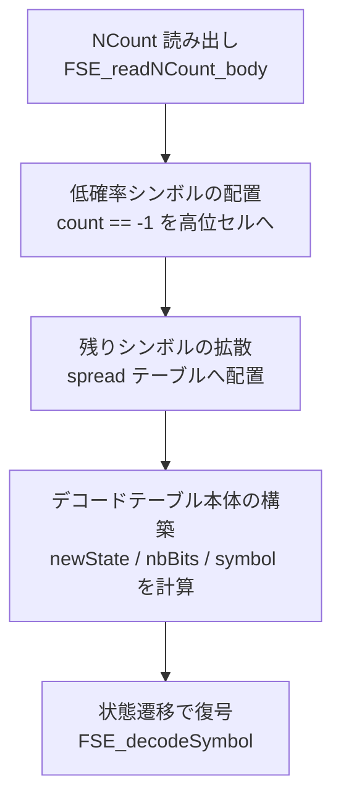

# 第8章 FSE 復号：デコードテーブルの構築と展開

> **本章で読むソース**
>
> - [`lib/common/entropy_common.c`](https://github.com/facebook/zstd/blob/v1.5.7/lib/common/entropy_common.c)
> - [`lib/common/fse_decompress.c`](https://github.com/facebook/zstd/blob/v1.5.7/lib/common/fse_decompress.c)
> - [`lib/common/fse.h`](https://github.com/facebook/zstd/blob/v1.5.7/lib/common/fse.h)

## この章の狙い

第7章では、シンボルの出現確率を **tANS**（tabled Asymmetric Numeral System）の一種である **FSE**（Finite State Entropy）でエンコードし、状態を遷移させながらビットストリームへ詰め込む側を見た。
本章はその逆方向、すなわち圧縮データからシンボル列を復元する側を扱う。

FSE の復号は2段階からなる。
まず、圧縮ストリームの先頭に置かれた正規化カウント（normalized count、各シンボルの相対的な出現頻度をエンコードした整数列）を読み出し、それをもとに**デコードテーブル**（FSE_DTable）を構築する。
次に、そのテーブルを参照しながらビットストリームを読み進め、状態を更新してシンボル列を復元する。
この2段階がそれぞれどう実装されているかを追う。

## 前提：正規化カウントとデコードテーブルの関係

FSE は、シンボル `s` の出現頻度を `2^tableLog` を分母とする正規化カウント `normalizedCounter[s]` として表現する。
第7章で見た通り、エンコード側はこの正規化カウントをもとに `tableSize = 2^tableLog` 個のセルへシンボルを配置したエンコードテーブルを作る。

復号側もまったく同じ正規化カウントとテーブルサイズから出発するが、セルに格納する情報が異なる。
デコードテーブルの各セルは、そのセルに対応する状態にいるときに「今読むべきシンボル」「次の状態を得るために読むビット数」「そのビット列を加算する基準値」を保持する。
この対応関係を作るのが `FSE_buildDTable_internal` であり、正規化カウントをビットストリームから読み出すのが `FSE_readNCount` 系の関数である。

## NCount の読み出し：FSE_readNCount_body

正規化カウントは、ビット単位で可変長にパックされた独自形式でエンコードされている。
`FSE_readNCount_body` はこの形式をパースし、`normalizedCounter` 配列と `tableLog` を復元する。

[`lib/common/entropy_common.c` L41-L52](https://github.com/facebook/zstd/blob/v1.5.7/lib/common/entropy_common.c#L41-L52)

```c
FORCE_INLINE_TEMPLATE
size_t FSE_readNCount_body(short* normalizedCounter, unsigned* maxSVPtr, unsigned* tableLogPtr,
                           const void* headerBuffer, size_t hbSize)
{
    const BYTE* const istart = (const BYTE*) headerBuffer;
    const BYTE* const iend = istart + hbSize;
    const BYTE* ip = istart;
    int nbBits;
    int remaining;
    int threshold;
    U32 bitStream;
    int bitCount;
```

先頭4ビットが `tableLog - FSE_MIN_TABLELOG` を表す。

[`lib/common/entropy_common.c` L69-L79](https://github.com/facebook/zstd/blob/v1.5.7/lib/common/entropy_common.c#L69-L79)

```c
    /* init */
    ZSTD_memset(normalizedCounter, 0, (*maxSVPtr+1) * sizeof(normalizedCounter[0]));   /* all symbols not present in NCount have a frequency of 0 */
    bitStream = MEM_readLE32(ip);
    nbBits = (bitStream & 0xF) + FSE_MIN_TABLELOG;   /* extract tableLog */
    if (nbBits > FSE_TABLELOG_ABSOLUTE_MAX) return ERROR(tableLog_tooLarge);
    bitStream >>= 4;
    bitCount = 4;
    *tableLogPtr = nbBits;
    remaining = (1<<nbBits)+1;
    threshold = 1<<nbBits;
    nbBits++;
```

`remaining`（残りカウント総量）は `2^tableLog + 1` から始まり、各シンボルのカウントを読むたびに減っていく。
1個のカウント値に割り当てるビット数は固定ではない。
`remaining` の残量に応じて `threshold` を境に「短い符号」と「長い符号」を使い分け、境界値の周辺を可変長にすることで平均のビット数を抑える。

[`lib/common/entropy_common.c` L135-L152](https://github.com/facebook/zstd/blob/v1.5.7/lib/common/entropy_common.c#L135-L152)

```c
            if ((bitStream & (threshold-1)) < (U32)max) {
                count = bitStream & (threshold-1);
                bitCount += nbBits-1;
            } else {
                count = bitStream & (2*threshold-1);
                if (count >= threshold) count -= max;
                bitCount += nbBits;
            }

            count--;   /* extra accuracy */
            /* When it matters (small blocks), this is a
             * predictable branch, because we don't use -1.
             */
            if (count >= 0) {
                remaining -= count;
            } else {
                assert(count == -1);
                remaining += count;
            }
            normalizedCounter[charnum++] = (short)count;
            previous0 = !count;
```

読み出した値から1を引いているのは、カウント0（そのシンボルが出現しない）を表現するために「マイナス1」という特殊値を予約しているためである（`count == -1` の場合はコード中で `-1` のまま格納され、`FSE_buildDTable_internal` 側で低確率シンボル専用の扱いを受ける）。
カウントが0のシンボルが連続すると、続く2ビットで「あと何個0が続くか」を表す反復符号（`previous0` 分岐）に切り替わり、ゼロが連続する区間をまとめて1回のビット読み出しで飛ばす。

最後に `remaining` がちょうど1になった時点でループを終え、そこまでに消費したバイト数を返す。

[`lib/common/entropy_common.c` L179-L182](https://github.com/facebook/zstd/blob/v1.5.7/lib/common/entropy_common.c#L179-L182)

```c
    if (remaining != 1) return ERROR(corruption_detected);
    /* Only possible when there are too many zeros. */
    if (charnum > maxSV1) return ERROR(maxSymbolValue_tooSmall);
    if (bitCount > 32) return ERROR(corruption_detected);
```

`remaining` が1に届かない、あるいは超えて負になる状態は正規化カウントの合計が `tableSize` に一致しないことを意味し、破損データとして拒否される。

## DTable の構築：FSE_buildDTable_internal

正規化カウントが揃うと、`FSE_buildDTable_internal` がそれを実際のデコードテーブルへ変換する。
処理は3段階に分かれる。



まず、正規化カウントが `-1`（低確率シンボル、出現頻度が `1/tableSize` に満たないシンボルを指す）のシンボルを、テーブル末尾（`highThreshold` から降順）へ先に割り当てる。

[`lib/common/fse_decompress.c` L74-L89](https://github.com/facebook/zstd/blob/v1.5.7/lib/common/fse_decompress.c#L74-L89)

```c
    /* Init, lay down lowprob symbols */
    {   FSE_DTableHeader DTableH;
        DTableH.tableLog = (U16)tableLog;
        DTableH.fastMode = 1;
        {   S16 const largeLimit= (S16)(1 << (tableLog-1));
            U32 s;
            for (s=0; s<maxSV1; s++) {
                if (normalizedCounter[s]==-1) {
                    tableDecode[highThreshold--].symbol = (FSE_FUNCTION_TYPE)s;
                    symbolNext[s] = 1;
                } else {
                    if (normalizedCounter[s] >= largeLimit) DTableH.fastMode=0;
                    symbolNext[s] = (U16)normalizedCounter[s];
        }   }   }
        ZSTD_memcpy(dt, &DTableH, sizeof(DTableH));
    }
```

`DTableH.fastMode` は、いずれかのシンボルの出現確率が50%を超える（`normalizedCounter[s] >= largeLimit`）かどうかを記録する。
出現確率が高いシンボルがあると1回の状態遷移で読むビット数が0になりうるため、あとで説明する高速パスが安全に使えるかどうかをここで判定している。

残りのシンボルは、正規化カウントの個数ぶんだけ `spread` 配列へシンボルIDを敷き詰めたあと、`step`（`FSE_TABLESTEP`、テーブルサイズに対して互いに素になるよう決められた歩幅）だけ位置をずらしながらテーブル全体へ拡散させる。

[`lib/common/fse_decompress.c` L91-L109](https://github.com/facebook/zstd/blob/v1.5.7/lib/common/fse_decompress.c#L91-L109)

```c
    /* Spread symbols */
    if (highThreshold == tableSize - 1) {
        size_t const tableMask = tableSize-1;
        size_t const step = FSE_TABLESTEP(tableSize);
        /* First lay down the symbols in order.
         * We use a uint64_t to lay down 8 bytes at a time. This reduces branch
         * misses since small blocks generally have small table logs, so nearly
         * all symbols have counts <= 8. We ensure we have 8 bytes at the end of
         * our buffer to handle the over-write.
         */
        {   U64 const add = 0x0101010101010101ull;
            size_t pos = 0;
            U64 sv = 0;
            U32 s;
            for (s=0; s<maxSV1; ++s, sv += add) {
                int i;
                int const n = normalizedCounter[s];
                MEM_write64(spread + pos, sv);
                for (i = 8; i < n; i += 8) {
```

拡散が終わると、テーブルの各セル `u` について「そのセルに置かれたシンボルが次に出現したときの新しい `symbolNext` の値」から `nbBits`（読むビット数）と `newState`（状態の基準値）を一度に計算する。

[`lib/common/fse_decompress.c` L149-L156](https://github.com/facebook/zstd/blob/v1.5.7/lib/common/fse_decompress.c#L149-L156)

```c
    /* Build Decoding table */
    {   U32 u;
        for (u=0; u<tableSize; u++) {
            FSE_FUNCTION_TYPE const symbol = (FSE_FUNCTION_TYPE)(tableDecode[u].symbol);
            U32 const nextState = symbolNext[symbol]++;
            tableDecode[u].nbBits = (BYTE) (tableLog - ZSTD_highbit32(nextState) );
            tableDecode[u].newState = (U16) ( (nextState << tableDecode[u].nbBits) - tableSize);
    }   }
```

`nbBits` は `tableLog` からその時点までに割り当てたシンボル出現数の最上位ビット位置を引いた値になっており、出現頻度が高いシンボルほど短いビット数で済むよう自動的に決まる。
この計算は第7章で見たエンコード側の状態遷移テーブル（symbolTT）の構築と対をなす。
エンコードが「シンボルから状態への写像」を作るのに対し、デコードは「状態のセルから、シンボルと次状態への写像」を作る。

## 復号の主役：DTable 1参照で読むべき情報をすべて得るという最適化

デコードテーブルの1セル `FSE_decode_t` は次の3フィールドだけを持つ。

[`lib/common/fse.h` L510-L515](https://github.com/facebook/zstd/blob/v1.5.7/lib/common/fse.h#L510-L515)

```c
typedef struct
{
    unsigned short newState;
    unsigned char  symbol;
    unsigned char  nbBits;
} FSE_decode_t;   /* size == U32 */
```

現在の状態値をこのテーブルの添字としてそのまま使うだけで、出力すべき `symbol`、次の状態を得るために読むビット数 `nbBits`、そのビット列に加算する基準値 `newState` の3つが1回のメモリアクセスで揃う。
状態遷移の計算式自体は単純だが、シンボルごとに出現頻度が異なるぶん本来ビット数も基準値も可変であり、毎回の復号でその対応関係を計算し直すと分岐やテーブル引きが余分に発生する。
そこを `FSE_buildDTable_internal` があらかじめ状態値ごとに解決しておくことで、復号のホットループを「1回のテーブル引きと1回のビット読み出し」だけに落とし込んでいる。

この参照を実際に行うのが `FSE_decodeSymbol` である。

[`lib/common/fse.h` L540-L549](https://github.com/facebook/zstd/blob/v1.5.7/lib/common/fse.h#L540-L549)

```c
MEM_STATIC BYTE FSE_decodeSymbol(FSE_DState_t* DStatePtr, BIT_DStream_t* bitD)
{
    FSE_decode_t const DInfo = ((const FSE_decode_t*)(DStatePtr->table))[DStatePtr->state];
    U32 const nbBits = DInfo.nbBits;
    BYTE const symbol = DInfo.symbol;
    size_t const lowBits = BIT_readBits(bitD, nbBits);

    DStatePtr->state = DInfo.newState + lowBits;
    return symbol;
}
```

現在の `state` をそのままテーブルの添字として引き、そのセルが持つ `symbol` を出力しつつ、`nbBits` ビットをビットストリームから読み出して `newState` に加算するだけで次の状態が決まる。
第5章で扱ったビットストリームの読み出し方向に対応して、FSE の符号化は末尾から先頭へ向かってビットを詰めており、復号はその逆順、すなわちビットストリームの末尾側から先頭へ向かって読み進める。

`FSE_decodeSymbolFast` は同じ処理を `BIT_readBitsFast` で行う版であり、`nbBits` が常に1以上であることを前提に境界チェックを省く。

[`lib/common/fse.h` L553-L562](https://github.com/facebook/zstd/blob/v1.5.7/lib/common/fse.h#L553-L562)

```c
MEM_STATIC BYTE FSE_decodeSymbolFast(FSE_DState_t* DStatePtr, BIT_DStream_t* bitD)
{
    FSE_decode_t const DInfo = ((const FSE_decode_t*)(DStatePtr->table))[DStatePtr->state];
    U32 const nbBits = DInfo.nbBits;
    BYTE const symbol = DInfo.symbol;
    size_t const lowBits = BIT_readBitsFast(bitD, nbBits);

    DStatePtr->state = DInfo.newState + lowBits;
    return symbol;
}
```

先述の `DTableH.fastMode` が0（出現確率50%超のシンボルがある）の場合、`nbBits` が0になりうるため、境界チェックを省く `FSE_decodeSymbolFast` は使わず `FSE_decodeSymbol` にフォールバックする。
`fastMode` の判定はこの安全性の切り替えのために `FSE_buildDTable_internal` の時点で決めておく値である。

## 状態の初期化とストリーム全体の復号

状態遷移を始める前に、ビットストリームの先頭 `tableLog` ビットを読み出して初期状態とする。

[`lib/common/fse.h` L517-L524](https://github.com/facebook/zstd/blob/v1.5.7/lib/common/fse.h#L517-L524)

```c
MEM_STATIC void FSE_initDState(FSE_DState_t* DStatePtr, BIT_DStream_t* bitD, const FSE_DTable* dt)
{
    const void* ptr = dt;
    const FSE_DTableHeader* const DTableH = (const FSE_DTableHeader*)ptr;
    DStatePtr->state = BIT_readBits(bitD, DTableH->tableLog);
    BIT_reloadDStream(bitD);
    DStatePtr->table = dt + 1;
}
```

`FSE_decompress_usingDTable_generic` は、この初期化を2つの状態（`state1`、`state2`）ぶん行ってから、両者を交互に進めながらシンボルを出力する。

[`lib/common/fse_decompress.c` L173-L197](https://github.com/facebook/zstd/blob/v1.5.7/lib/common/fse_decompress.c#L173-L197)

```c
FORCE_INLINE_TEMPLATE size_t FSE_decompress_usingDTable_generic(
          void* dst, size_t maxDstSize,
    const void* cSrc, size_t cSrcSize,
    const FSE_DTable* dt, const unsigned fast)
{
    BYTE* const ostart = (BYTE*) dst;
    BYTE* op = ostart;
    BYTE* const omax = op + maxDstSize;
    BYTE* const olimit = omax-3;

    BIT_DStream_t bitD;
    FSE_DState_t state1;
    FSE_DState_t state2;

    /* Init */
    CHECK_F(BIT_initDStream(&bitD, cSrc, cSrcSize));

    FSE_initDState(&state1, &bitD, dt);
    FSE_initDState(&state2, &bitD, dt);

    RETURN_ERROR_IF(BIT_reloadDStream(&bitD)==BIT_DStream_overflow, corruption_detected, "");

#define FSE_GETSYMBOL(statePtr) fast ? FSE_decodeSymbolFast(statePtr, &bitD) : FSE_decodeSymbol(statePtr, &bitD)

    /* 4 symbols per loop */
```

2状態を交互に進めるのは、エンコード側が2つの状態をインターリーブしてビットストリームに書き出したことに対応する逆操作であり、単一の依存鎖をたどるより1ループあたりの実効スループットを上げやすい構成になっている。
ストリームを最後まで読み切ったかどうかは `BIT_DStream_overflow` で判定し、ちょうど読み切った時点で残りの2シンボルを個別に処理して終了する。

[`lib/common/fse_decompress.c` L218-L232](https://github.com/facebook/zstd/blob/v1.5.7/lib/common/fse_decompress.c#L218-L232)

```c
    /* note : BIT_reloadDStream(&bitD) >= FSE_DStream_partiallyFilled; Ends at exactly BIT_DStream_completed */
    while (1) {
        if (op>(omax-2)) return ERROR(dstSize_tooSmall);
        *op++ = FSE_GETSYMBOL(&state1);
        if (BIT_reloadDStream(&bitD)==BIT_DStream_overflow) {
            *op++ = FSE_GETSYMBOL(&state2);
            break;
        }

        if (op>(omax-2)) return ERROR(dstSize_tooSmall);
        *op++ = FSE_GETSYMBOL(&state2);
        if (BIT_reloadDStream(&bitD)==BIT_DStream_overflow) {
            *op++ = FSE_GETSYMBOL(&state1);
            break;
    }   }
```

エンコード側が最後に書き込んだシンボルが、復号側では最初に出てくる。
これは tANS が状態を末尾から先頭へ向けて畳み込みながらエンコードし、復号がその逆順にたどるという構造そのものの帰結である。

## まとめ

FSE の復号は、正規化カウントの読み出し（`FSE_readNCount_body`）、デコードテーブルの構築（`FSE_buildDTable_internal`）、状態遷移によるシンボル復元（`FSE_decodeSymbol` / `FSE_decodeSymbolFast`）という3段階からなる。

正規化カウントは可変長のビットパック形式で読み出され、ゼロが連続する区間は反復符号でまとめて処理される。
デコードテーブルは、低確率シンボルの先行配置、`step` による拡散、状態ごとの `nbBits` / `newState` 計算という3段階で構築され、以後の復号では状態値をそのままテーブルの添字として使う。

この構築によって、復号のホットループは「1回のテーブル引きで symbol と nbBits と newState をまとめて得て、1回のビット読み出しで次状態を計算する」だけになる。
出現頻度に応じて可変になるはずのビット数と基準値の対応関係を、復号のたびに計算し直すのではなくテーブル構築時に前計算しておくことで、ホットループから分岐と再計算を追い出しているのが本章で見た最適化である。

## 関連する章

- 第5章 [ビットストリーム：BIT_CStream と BIT_DStream](../part01-common/05-bitstream.md)
- 第7章 [FSE 圧縮：正規化カウントと状態遷移テーブルの構築](07-fse-compress.md)
- 第23章 [ブロック復号：リテラルとシーケンスの合流](../part06-decompress/23-decompress-block.md)
