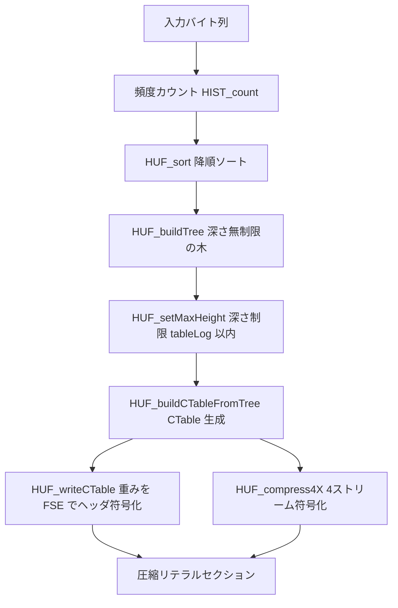

# 第9章 Huffman 符号化：木の構築とビット詰め

> **本章で読むソース**
>
> - [`lib/common/huf.h`](https://github.com/facebook/zstd/blob/v1.5.7/lib/common/huf.h)
> - [`lib/compress/huf_compress.c`](https://github.com/facebook/zstd/blob/v1.5.7/lib/compress/huf_compress.c)

## この章の狙い

zstd はブロックの中身を2つの符号化器で圧縮する。
リテラル（マッチとして参照されなかった生バイト列）には Huffman を、シーケンス（リテラル長、マッチ長、オフセットの3つ組）には FSE を使う二本立てである。
本章では前者、Huffman 符号化器の内部を読む。
頻度カウントから深さ制限つきの Huffman 木を構築し、その木を圧縮テーブル（CTable）に変換し、木そのものではなく重みだけをヘッダに書き、最後に入力を4本のビットストリームに分けて詰めるまでを、実装に沿って追う。
リテラルセクションが Huffman をどう呼び出すか、ブロック内での使われ方の詳細は第13章に譲り、本章は Huffman 符号化器そのものの機構に絞る。

## 前提

Huffman 符号化は、頻度の高い記号ほど短いビット列を割り当てる可変長符号である。
zstd の実装では記号はバイト値（0-255）であり、木の深さ（1記号あたりの最大ビット長）には上限がある。
この上限は `HUF_TABLELOG_MAX` として12に固定されている。

[`lib/common/huf.h` L37-L39](https://github.com/facebook/zstd/blob/v1.5.7/lib/common/huf.h#L37-L39)

```c
#define HUF_TABLELOG_MAX      12      /* max runtime value of tableLog (due to static allocation); can be modified up to HUF_TABLELOG_ABSOLUTEMAX */
#define HUF_TABLELOG_DEFAULT  11      /* default tableLog value when none specified */
#define HUF_SYMBOLVALUE_MAX  255
```

深さに上限を設ける理由は、展開側の速度にある。
最大深さが `tableLog` ビットに収まると保証されていれば、展開器は `1 << tableLog` エントリのテーブルを1枚引くだけで記号を復号でき、1記号の復号に要するビット読み出し回数の上限も `tableLog` に固定される。
この保証を作るのが後述の `HUF_setMaxHeight` である。

全体の流れを図示すると次のようになる。



## 頻度カウントから木を作る

Huffman 符号化器の入口は `HUF_compress_internal` である。
ここでまず入力を走査して記号ごとの出現数（ヒストグラム）を作り、そのうえで木を構築する。

[`lib/compress/huf_compress.c` L1381-L1385](https://github.com/facebook/zstd/blob/v1.5.7/lib/compress/huf_compress.c#L1381-L1385)

```c
    /* Scan input and build symbol stats */
    {   CHECK_V_F(largest, HIST_count_wksp (table->count, &maxSymbolValue, (const BYTE*)src, srcSize, table->wksps.hist_wksp, sizeof(table->wksps.hist_wksp)) );
        if (largest == srcSize) { *ostart = ((const BYTE*)src)[0]; return 1; }   /* single symbol, rle */
        if (largest <= (srcSize >> 7)+4) return 0;   /* heuristic : probably not compressible enough */
    }
```

`largest == srcSize` すなわち1種類の記号しかない入力は RLE ブロックに、ほとんど圧縮できない入力は生ブロックに早期に落とす。
圧縮を試みる価値がある入力に対してだけ、木を組み立てる中心である `HUF_buildCTable_wksp` に進む。
この関数は、ソート、木構築、深さ制限、テーブル生成の4段を順に呼び出す構成になっている。

[`lib/compress/huf_compress.c` L755-L791](https://github.com/facebook/zstd/blob/v1.5.7/lib/compress/huf_compress.c#L755-L791)

```c
size_t
HUF_buildCTable_wksp(HUF_CElt* CTable, const unsigned* count, U32 maxSymbolValue, U32 maxNbBits,
                     void* workSpace, size_t wkspSize)
{
    // ... (中略) ...
    /* sort, decreasing order */
    HUF_sort(huffNode, count, maxSymbolValue, wksp_tables->rankPosition);

    /* build tree */
    nonNullRank = HUF_buildTree(huffNode, maxSymbolValue);

    /* determine and enforce maxTableLog */
    maxNbBits = HUF_setMaxHeight(huffNode, (U32)nonNullRank, maxNbBits);
    if (maxNbBits > HUF_TABLELOG_MAX) return ERROR(GENERIC);   /* check fit into table */

    HUF_buildCTableFromTree(CTable, huffNode, nonNullRank, maxSymbolValue, maxNbBits);

    return maxNbBits;
}
```

木のノードは `nodeElt` という小さな構造体で表される。
記号1つと内部ノードを同じ配列上に並べ、`parent` で親を指す。

[`lib/compress/huf_compress.c` L47-L52](https://github.com/facebook/zstd/blob/v1.5.7/lib/compress/huf_compress.c#L47-L52)

```c
typedef struct nodeElt_s {
    U32 count;
    U16 parent;
    BYTE byte;
    BYTE nbBits;
} nodeElt;
```

`HUF_sort` は記号を出現数の降順に並べる。
一般的な比較ソートではなく、出現数をキーにしたバケットソートを使う。
バケット数は192個で、小さいカウント値はそのままバケット番号にし、大きいカウント値は対数（`ZSTD_highbit32`）でバケットに割り振る。

[`lib/compress/huf_compress.c` L530-L534](https://github.com/facebook/zstd/blob/v1.5.7/lib/compress/huf_compress.c#L530-L534)

```c
static U32 HUF_getIndex(U32 const count) {
    return (count < RANK_POSITION_DISTINCT_COUNT_CUTOFF)
        ? count
        : ZSTD_highbit32(count) + RANK_POSITION_LOG_BUCKETS_BEGIN;
}
```

小さいカウントは記号数が多く分布が細かいので1カウント1バケットで正確に分け、大きいカウントはまばらなので対数で粗くまとめる。
こうして同一バケット内だけを局所的にクイックソートすれば済むため、全体を比較ソートするより速い。

ソート済み配列を受け取り、`HUF_buildTree` が深さ無制限の Huffman 木を組む。
最も出現数の小さい2ノードを繰り返し結合し、その和を親の出現数とする古典的な手順である。

[`lib/compress/huf_compress.c` L681-L718](https://github.com/facebook/zstd/blob/v1.5.7/lib/compress/huf_compress.c#L681-L718)

```c
static int HUF_buildTree(nodeElt* huffNode, U32 maxSymbolValue)
{
    // ... (中略) ...
    /* create parents */
    while (nodeNb <= nodeRoot) {
        int const n1 = (huffNode[lowS].count < huffNode[lowN].count) ? lowS-- : lowN++;
        int const n2 = (huffNode[lowS].count < huffNode[lowN].count) ? lowS-- : lowN++;
        huffNode[nodeNb].count = huffNode[n1].count + huffNode[n2].count;
        huffNode[n1].parent = huffNode[n2].parent = (U16)nodeNb;
        nodeNb++;
    }

    /* distribute weights (unlimited tree height) */
    huffNode[nodeRoot].nbBits = 0;
    for (n=nodeRoot-1; n>=STARTNODE; n--)
        huffNode[n].nbBits = huffNode[ huffNode[n].parent ].nbBits + 1;
    for (n=0; n<=nonNullRank; n++)
        huffNode[n].nbBits = huffNode[ huffNode[n].parent ].nbBits + 1;

    DEBUGLOG(6, "Initial distribution of bits completed (%zu sorted symbols)", showHNodeBits(huffNode, maxSymbolValue+1));

    return nonNullRank;
}
```

木を根から葉へたどって深さを配り、各記号の `nbBits`（符号長）を決める。
この段階では深さに上限がないため、極端に偏った分布では `nbBits` が12を超えることがある。

## 深さ制限：HUF_setMaxHeight

`HUF_setMaxHeight` は、上限を超えたノードの符号長を強制的に `targetNbBits` まで切り下げ、それでも木が有効な正準 Huffman 木であり続けるよう調整する。
まず、上限を超えている記号がなければ何もせずに返す。

[`lib/compress/huf_compress.c` L376-L397](https://github.com/facebook/zstd/blob/v1.5.7/lib/compress/huf_compress.c#L376-L397)

```c
static U32 HUF_setMaxHeight(nodeElt* huffNode, U32 lastNonNull, U32 targetNbBits)
{
    const U32 largestBits = huffNode[lastNonNull].nbBits;
    /* early exit : no elt > targetNbBits, so the tree is already valid. */
    if (largestBits <= targetNbBits) return largestBits;

    DEBUGLOG(5, "HUF_setMaxHeight (targetNbBits = %u)", targetNbBits);

    /* there are several too large elements (at least >= 2) */
    {   int totalCost = 0;
        const U32 baseCost = 1 << (largestBits - targetNbBits);
        int n = (int)lastNonNull;

        /* Adjust any ranks > targetNbBits to targetNbBits.
         * Compute totalCost, which is how far the sum of the ranks is
         * we are over 2^largestBits after adjust the offending ranks.
         */
        while (huffNode[n].nbBits > targetNbBits) {
            totalCost += baseCost - (1 << (largestBits - huffNode[n].nbBits));
            huffNode[n].nbBits = (BYTE)targetNbBits;
            n--;
        }
```

深さ制限は無償ではない。
符号長を切り下げると、その記号が使う符号空間が広がり、Kraft の不等式（各記号の `2^-nbBits` の総和が1以下）を破ってしまう。
そこでコードは、切り下げで発生した超過分を `totalCost` として積算し、代わりに出現数の少ない記号の符号長を1ビットずつ延ばすことで帳尻を合わせる。
この「借りを返す」処理が関数後半の `repay normalized cost` である。
結果として、最大深さは `targetNbBits` 以内に収まりつつ、全体としては有効な Huffman 木が保たれる。

この深さ制限が効くのは展開時である。
最大深さが `tableLog` に収まると保証されるため、展開器は `1 << tableLog` エントリの単一テーブルを1回引くだけで記号を復号でき、1記号あたりのビット読み出し回数の上限も一定になる。
つまり最大深さの制限は、圧縮率をわずかに犠牲にして展開の分岐のない高速なテーブル参照を成立させるための仕掛けである。

## CTable への変換

深さが確定したら、`HUF_buildCTableFromTree` が各記号に実際のビットパターン（符号値）を割り当てる。
正準 Huffman 符号では、符号長さえ決まれば符号値は機械的に決まる。
同じ符号長の記号を並べ、短い符号長のグループから順に値を振っていく。

[`lib/compress/huf_compress.c` L730-L753](https://github.com/facebook/zstd/blob/v1.5.7/lib/compress/huf_compress.c#L730-L753)

```c
static void HUF_buildCTableFromTree(HUF_CElt* CTable, nodeElt const* huffNode, int nonNullRank, U32 maxSymbolValue, U32 maxNbBits)
{
    HUF_CElt* const ct = CTable + 1;
    /* fill result into ctable (val, nbBits) */
    int n;
    U16 nbPerRank[HUF_TABLELOG_MAX+1] = {0};
    U16 valPerRank[HUF_TABLELOG_MAX+1] = {0};
    int const alphabetSize = (int)(maxSymbolValue + 1);
    for (n=0; n<=nonNullRank; n++)
        nbPerRank[huffNode[n].nbBits]++;
    /* determine starting value per rank */
    {   U16 min = 0;
        for (n=(int)maxNbBits; n>0; n--) {
            valPerRank[n] = min;      /* get starting value within each rank */
            min += nbPerRank[n];
            min >>= 1;
    }   }
    for (n=0; n<alphabetSize; n++)
        HUF_setNbBits(ct + huffNode[n].byte, huffNode[n].nbBits);   /* push nbBits per symbol, symbol order */
    for (n=0; n<alphabetSize; n++)
        HUF_setValue(ct + n, valPerRank[HUF_getNbBits(ct[n])]++);   /* assign value within rank, symbol order */

    HUF_writeCTableHeader(CTable, maxNbBits, maxSymbolValue);
}
```

`nbPerRank` は符号長ごとの記号数、`valPerRank` はその符号長で最初に使う符号値である。
符号長が同じ記号には連番の符号値を割り当て、符号長が1つ短いグループの開始値はその半分になる（`min >>= 1`）。
これが正準符号の規則そのものであり、記号ごとに `(符号値, 符号長)` の対を CTable に書き込めば圧縮テーブルが完成する。

## テーブルの出力：木ではなく重みを書く

展開器が同じ CTable を再構築できるように、圧縮器はテーブル記述をブロックヘッダに書く。
ここで木の形やビットパターンをそのまま送るのではなく、記号ごとの**重み**（weight）だけを送る。
重みは符号長から導かれる値で、`HUF_writeCTable_wksp` が符号長を重みへ変換する。

[`lib/compress/huf_compress.c` L266-L279](https://github.com/facebook/zstd/blob/v1.5.7/lib/compress/huf_compress.c#L266-L279)

```c
    /* convert to weight */
    wksp->bitsToWeight[0] = 0;
    for (n=1; n<huffLog+1; n++)
        wksp->bitsToWeight[n] = (BYTE)(huffLog + 1 - n);
    for (n=0; n<maxSymbolValue; n++)
        wksp->huffWeight[n] = wksp->bitsToWeight[HUF_getNbBits(ct[n])];

    /* attempt weights compression by FSE */
    if (maxDstSize < 1) return ERROR(dstSize_tooSmall);
    {   CHECK_V_F(hSize, HUF_compressWeights(op+1, maxDstSize-1, wksp->huffWeight, maxSymbolValue, &wksp->wksp, sizeof(wksp->wksp)) );
        if ((hSize>1) & (hSize < maxSymbolValue/2)) {   /* FSE compressed */
            op[0] = (BYTE)hSize;
            return hSize+1;
    }   }
```

符号長から重みへの変換は `weight = huffLog + 1 - nbBits` である。
符号長さえ分かれば正準符号のビットパターンは復元できるので、送るべき情報は符号長（と等価な重み）だけで足りる。
さらにこの重みの列を FSE でもう一段圧縮しようと試みる。
FSE で縮まないほど記号数が少ないときは、重みを4ビットずつ生値で書くフォールバックに切り替える。

[`lib/compress/huf_compress.c` L281-L288](https://github.com/facebook/zstd/blob/v1.5.7/lib/compress/huf_compress.c#L281-L288)

```c
    /* write raw values as 4-bits (max : 15) */
    if (maxSymbolValue > (256-128)) return ERROR(GENERIC);   /* should not happen : likely means source cannot be compressed */
    if (((maxSymbolValue+1)/2) + 1 > maxDstSize) return ERROR(dstSize_tooSmall);   /* not enough space within dst buffer */
    op[0] = (BYTE)(128 /*special case*/ + (maxSymbolValue-1));
    wksp->huffWeight[maxSymbolValue] = 0;   /* to be sure it doesn't cause msan issue in final combination */
    for (n=0; n<maxSymbolValue; n+=2)
        op[(n/2)+1] = (BYTE)((wksp->huffWeight[n] << 4) + wksp->huffWeight[n+1]);
    return ((maxSymbolValue+1)/2) + 1;
```

重みは最大でも `huffLog`（12以下）なので4ビットに収まり、1バイトに2記号ぶんを詰められる。
テーブル記述のヘッダバイトの最上位で、FSE 圧縮したか生値かを区別する。

## テーブルサイズの決定：HUF_optimalTableLog

木を作る前に、テーブルの深さ上限 `huffLog` を決める必要がある。
`HUF_optimalTableLog` がこれを担う。
既定では FSE 由来の安価な見積り式で1発で決めるが、圧縮レベルが高く `HUF_flags_optimalDepth` が立っているときは、複数の深さを実際に試して最小の出力になるものを選ぶ。

[`lib/compress/huf_compress.c` L1284-L1309](https://github.com/facebook/zstd/blob/v1.5.7/lib/compress/huf_compress.c#L1284-L1309)

```c
    if (!(flags & HUF_flags_optimalDepth)) {
        /* cheap evaluation, based on FSE */
        return FSE_optimalTableLog_internal(maxTableLog, srcSize, maxSymbolValue, 1);
    }

    {   BYTE* dst = (BYTE*)workSpace + sizeof(HUF_WriteCTableWksp);
        size_t dstSize = wkspSize - sizeof(HUF_WriteCTableWksp);
        size_t hSize, newSize;
        const unsigned symbolCardinality = HUF_cardinality(count, maxSymbolValue);
        const unsigned minTableLog = HUF_minTableLog(symbolCardinality);
        size_t optSize = ((size_t) ~0) - 1;
        unsigned optLog = maxTableLog, optLogGuess;

        DEBUGLOG(6, "HUF_optimalTableLog: probing huf depth (srcSize=%zu)", srcSize);

        /* Search until size increases */
        for (optLogGuess = minTableLog; optLogGuess <= maxTableLog; optLogGuess++) {
            DEBUGLOG(7, "checking for huffLog=%u", optLogGuess);

            {   size_t maxBits = HUF_buildCTable_wksp(table, count, maxSymbolValue, optLogGuess, workSpace, wkspSize);
                if (ERR_isError(maxBits)) continue;

                if (maxBits < optLogGuess && optLogGuess > minTableLog) break;

                hSize = HUF_writeCTable_wksp(dst, dstSize, table, maxSymbolValue, (U32)maxBits, workSpace, wkspSize);
            }
```

深さを深くすると符号化の総ビット数（本体）は縮むが、テーブル記述のヘッダは大きくなりやすい。
この探索は「本体サイズ ＋ ヘッダサイズ」の合計が最小になる深さを、下限から順に試して見つける。
合計サイズが増加に転じた時点で打ち切るため、全候補を試し尽くさずに済む。

## 4ストリーム符号化：HUF_compress4X

CTable が決まると、いよいよ入力を符号化する。
zstd は入力を4分割し、それぞれを独立したビットストリームに符号化する `HUF_compress4X` を既定で使う。

[`lib/compress/huf_compress.c` L1168-L1188](https://github.com/facebook/zstd/blob/v1.5.7/lib/compress/huf_compress.c#L1168-L1188)

```c
HUF_compress4X_usingCTable_internal(void* dst, size_t dstSize,
                              const void* src, size_t srcSize,
                              const HUF_CElt* CTable, int flags)
{
    size_t const segmentSize = (srcSize+3)/4;   /* first 3 segments */
    const BYTE* ip = (const BYTE*) src;
    const BYTE* const iend = ip + srcSize;
    BYTE* const ostart = (BYTE*) dst;
    BYTE* const oend = ostart + dstSize;
    BYTE* op = ostart;

    if (dstSize < 6 + 1 + 1 + 1 + 8) return 0;   /* minimum space to compress successfully */
    if (srcSize < 12) return 0;   /* no saving possible : too small input */
    op += 6;   /* jumpTable */

    assert(op <= oend);
    {   CHECK_V_F(cSize, HUF_compress1X_usingCTable_internal(op, (size_t)(oend-op), ip, segmentSize, CTable, flags) );
        if (cSize == 0 || cSize > 65535) return 0;
        MEM_writeLE16(ostart, (U16)cSize);
        op += cSize;
    }
```

入力を4等分し、各セグメントを `HUF_compress1X_usingCTable_internal` で個別に符号化する。
先頭に6バイトのジャンプテーブルを置き、そこに前3ストリームの圧縮後サイズ（各2バイト）を書く。
展開器はこのジャンプテーブルを読めば、4本のストリームの開始位置を一度に知り、4本を同時にデコードし始められる。

これが Huffman 符号化器の速度を支える主要な工夫である。
4本のビットストリームは互いにデータ依存を持たないため、展開側は4つのデコードを並行して進められ、独立した4つの命令列が CPU の命令レベル並列性（ILP）を引き出す。
1本の直列なストリームでは、次の記号の復号が前の記号のビット位置に依存して待たされるが、4本に分けることでその依存の鎖を4つに切り分けられる。

## 符号化ループのビット詰め

各ストリーム内部の符号化にも、依存の鎖を切る工夫が入っている。
`HUF_compress1X_usingCTable_internal_body_loop` は、2つのビットコンテナ（インデックス0と1）を使い分けながら記号を詰める。

[`lib/compress/huf_compress.c` L1019-L1039](https://github.com/facebook/zstd/blob/v1.5.7/lib/compress/huf_compress.c#L1019-L1039)

```c
    for (; n>0; n-= 2 * kUnroll) {
        /* Encode kUnroll symbols into the bitstream @ index 0. */
        int u;
        for (u = 1; u < kUnroll; ++u) {
            HUF_encodeSymbol(bitC, ip[n - u], ct, /* idx */ 0, /* fast */ 1);
        }
        HUF_encodeSymbol(bitC, ip[n - kUnroll], ct, /* idx */ 0, /* fast */ kLastFast);
        HUF_flushBits(bitC, kFastFlush);
        /* Encode kUnroll symbols into the bitstream @ index 1.
         * This allows us to start filling the bit container
         * without any data dependencies.
         */
        HUF_zeroIndex1(bitC);
        for (u = 1; u < kUnroll; ++u) {
            HUF_encodeSymbol(bitC, ip[n - kUnroll - u], ct, /* idx */ 1, /* fast */ 1);
        }
        HUF_encodeSymbol(bitC, ip[n - kUnroll - kUnroll], ct, /* idx */ 1, /* fast */ kLastFast);
        /* Merge bitstream @ index 1 into the bitstream @ index 0 */
        HUF_mergeIndex1(bitC);
        HUF_flushBits(bitC, kFastFlush);
    }
```

コメントが述べるとおり、インデックス1のコンテナへの詰め込みはインデックス0の詰め込みが終わるのを待たずに始められる。
片方のビット詰めが確定する前にもう片方を進められるので、同一ストリーム内でも2系統の依存の鎖ができ、命令レベル並列性を稼ぐ。
最後に `HUF_mergeIndex1` で2系統を1つのビットストリームに合流させる。

ループの内側では境界チェックを省く高速版（`fast` 引数）を使えるように、出力バッファに十分な余裕があるかを事前に判定している。

[`lib/compress/huf_compress.c` L1073-L1075](https://github.com/facebook/zstd/blob/v1.5.7/lib/compress/huf_compress.c#L1073-L1075)

```c
    if (dstSize < HUF_tightCompressBound(srcSize, (size_t)tableLog) || tableLog > 11)
        HUF_compress1X_usingCTable_internal_body_loop(&bitC, ip, srcSize, ct, /* kUnroll */ MEM_32bits() ? 2 : 4, /* kFast */ 0, /* kLastFast */ 0);
    else {
```

## 圧縮後サイズの上限：HUF_compressBound

呼び出し側が出力バッファを確保できるように、`HUF_compressBound` が最悪ケースの圧縮後サイズを返す。

[`lib/compress/huf_compress.c` L821](https://github.com/facebook/zstd/blob/v1.5.7/lib/compress/huf_compress.c#L821)

```c
size_t HUF_compressBound(size_t size) { return HUF_COMPRESSBOUND(size); }
```

中身はマクロで、テーブル記述の上限とブロック本体の上限の和になっている。

[`lib/common/huf.h` L51-L53](https://github.com/facebook/zstd/blob/v1.5.7/lib/common/huf.h#L51-L53)

```c
#define HUF_CTABLEBOUND 129
#define HUF_BLOCKBOUND(size) (size + (size>>8) + 8)   /* only true when incompressible is pre-filtered with fast heuristic */
#define HUF_COMPRESSBOUND(size) (HUF_CTABLEBOUND + HUF_BLOCKBOUND(size))   /* Macro version, useful for static allocation */
```

`HUF_CTABLEBOUND` の129はテーブル記述の最大バイト数、`HUF_BLOCKBOUND` は圧縮後でも入力とほぼ同サイズ（`size + size/256 + 8`）に収まるという見積りである。
`HUF_compress_internal` は圧縮しても縮まないと分かった入力を早期に弾く（生ブロックや RLE に落とす）ので、この上限は圧縮を試みる価値のある入力に対してだけ成立する。

## まとめ

zstd の Huffman 符号化器は、頻度カウントをバケットソートで降順に並べ、深さ無制限の木を組んでから `HUF_setMaxHeight` で最大深さを `tableLog`（12以下）に切り下げる。
深さ制限は圧縮率をわずかに犠牲にする代わりに、展開側が単一テーブルの1回参照で記号を復号できることを保証し、復号を高速にする。
テーブル記述は木そのものではなく記号ごとの重みだけを、さらに FSE で一段圧縮して書く。
符号化は入力を4分割した独立ビットストリームで行い、依存のない4本のデコードが展開側の命令レベル並列性を引き出す。
リテラルを Huffman、シーケンスを FSE で符号化するという二本立てのうち、本章は Huffman 符号化器の内部を追った。

## 関連する章

- [第10章 Huffman 展開](10-huffman-decompress.md)
- [第13章 リテラルの符号化](../part03-compress-core/13-literals-encoding.md)
- [第5章 ビットストリーム](../part01-common/05-bitstream.md)
