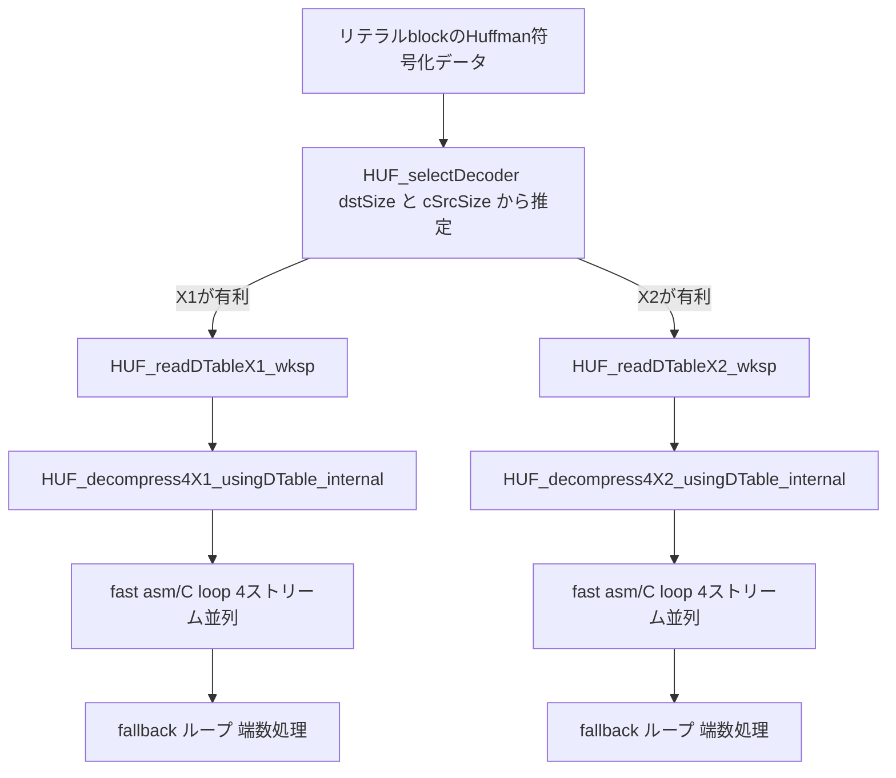

# 第10章 Huffman 復号：テーブル駆動と x64 アセンブラ

> **本章で読むソース**
>
> - [`lib/decompress/huf_decompress.c`](https://github.com/facebook/zstd/blob/v1.5.7/lib/decompress/huf_decompress.c)
> - [`lib/decompress/huf_decompress_amd64.S`](https://github.com/facebook/zstd/blob/v1.5.7/lib/decompress/huf_decompress_amd64.S)
> - [`lib/common/huf.h`](https://github.com/facebook/zstd/blob/v1.5.7/lib/common/huf.h)

## この章の狙い

第9章では、Huffman木をノード単位で構築し、符号語をビットストリームに書き込む圧縮側の処理を追った。
本章はその対になる復号側を扱う。
Huffman復号は木をたどる代わりに、ビット列を直接テーブル引きしてシンボルを取り出す**DTable**（decoding table）を使う。
DTableには1回のテーブル引きで1シンボルを引く**X1**と、2シンボルをまとめて引く**X2**の2種類があり、どちらのテーブルを構築するかは入力サイズから推定した速度予測で選ばれる。
さらに復号本体には、Cで書かれた汎用ループのほかに、x86-64かつBMI2命令セットを前提にしたアセンブラループが用意されている。
本章では、DTableの構築、4ストリームを束ねて復号する仕組み、そしてアセンブラループへ処理を渡す条件分岐を順に追う。

## 前提

zstdの圧縮blockは、Huffman符号化されたリテラル列を4本のビットストリームに分けて格納する場合がある。
この分割は第9章で見た`HUF_compress4X_usingCTable`が担い、復号側はこの4本を`HUF_decompress4X_usingDTable`で受け取る。
4本のストリームはそれぞれ独立にデコードできるため、CPUの命令レベル並列性を引き出す余地がある。
この余地をどう使うかが、本章で説明する最適化の核心になる。

DTableは`HUF_DTable`という不透明な型で表され、実体は`DTableDescriptor`と、それに続くテーブルエントリの配列である。

[`lib/decompress/huf_decompress.c` L141-L148](https://github.com/facebook/zstd/blob/v1.5.7/lib/decompress/huf_decompress.c#L141-L148)

```c
typedef struct { BYTE maxTableLog; BYTE tableType; BYTE tableLog; BYTE reserved; } DTableDesc;

static DTableDesc HUF_getDTableDesc(const HUF_DTable* table)
{
    DTableDesc dtd;
    ZSTD_memcpy(&dtd, table, sizeof(dtd));
    return dtd;
}
```

`tableType`が0ならX1、1ならX2であることを示す。
`tableLog`は、テーブルを引くのに必要なビット数であり、これがそのままDTableのエントリ数（`1 << tableLog`）を決める。

## X1：1回のテーブル引きで1シンボル

X1のDTableエントリは、シンボルそのものと消費ビット数の組だけを持つ、もっとも単純な形をしている。

[`lib/decompress/huf_decompress.c` L329](https://github.com/facebook/zstd/blob/v1.5.7/lib/decompress/huf_decompress.c#L329)

```c
typedef struct { BYTE nbBits; BYTE byte; } HUF_DEltX1;   /* single-symbol decoding */
```

`HUF_readDTableX1_wksp`がこのテーブルを構築する。
Huffman木の重み（ビット長の情報）を読み終えたあと、同じ重みを持つシンボルをまとめてDTableの該当区間に敷き詰める。

[`lib/decompress/huf_decompress.c` L455-L517](https://github.com/facebook/zstd/blob/v1.5.7/lib/decompress/huf_decompress.c#L455-L517)

```c
    {   U32 w;
        int symbol = wksp->rankVal[0];
        int rankStart = 0;
        for (w=1; w<tableLog+1; ++w) {
            int const symbolCount = wksp->rankVal[w];
            int const length = (1 << w) >> 1;
            int uStart = rankStart;
            BYTE const nbBits = (BYTE)(tableLog + 1 - w);
            int s;
            int u;
            switch (length) {
            case 1:
                for (s=0; s<symbolCount; ++s) {
                    HUF_DEltX1 D;
                    D.byte = wksp->symbols[symbol + s];
                    D.nbBits = nbBits;
                    dt[uStart] = D;
                    uStart += 1;
                }
                break;
// ... (中略) ...
            default:
                for (s=0; s<symbolCount; ++s) {
                    U64 const D4 = HUF_DEltX1_set4(wksp->symbols[symbol + s], nbBits);
                    for (u=0; u < length; u += 16) {
                        MEM_write64(dt + uStart + u + 0, D4);
                        MEM_write64(dt + uStart + u + 4, D4);
                        MEM_write64(dt + uStart + u + 8, D4);
                        MEM_write64(dt + uStart + u + 12, D4);
                    }
                    assert(u == length);
                    uStart += length;
                }
                break;
            }
            symbol += symbolCount;
            rankStart += symbolCount * length;
        }
    }
```

符号長`nbBits`のシンボルは、テーブルの`length = 1 << (tableLog + 1 - nbBits - 1)`個ぶんの連続したスロットに、同じ`(symbol, nbBits)`を繰り返し書き込まれる。
これは、`tableLog`ビットのテーブル引きで、実際には`nbBits`ビットしか消費しないシンボルを引くための埋め合わせである。
テーブル引きに使うビット列の下位`(tableLog - nbBits)`ビットが何であっても、上位`nbBits`ビットが一致すれば同じシンボルにたどり着くようにする必要があり、そのために同じエントリを`length`個分だけ複製している。
`length`が4や8のときは`HUF_DEltX1_set4`で4エントリ分を1つの`U64`にパックし、`MEM_write64`でまとめて書き込むことで、1エントリずつのストア命令を減らしている。

テーブルが完成すれば、復号は1回のテーブル引きで完結する。

[`lib/decompress/huf_decompress.c` L521-L528](https://github.com/facebook/zstd/blob/v1.5.7/lib/decompress/huf_decompress.c#L521-L528)

```c
FORCE_INLINE_TEMPLATE BYTE
HUF_decodeSymbolX1(BIT_DStream_t* Dstream, const HUF_DEltX1* dt, const U32 dtLog)
{
    size_t const val = BIT_lookBitsFast(Dstream, dtLog); /* note : dtLog >= 1 */
    BYTE const c = dt[val].byte;
    BIT_skipBits(Dstream, dt[val].nbBits);
    return c;
}
```

`BIT_lookBitsFast`でビットストリームの先頭`dtLog`ビットを覗き見て、それをそのままインデックスとしてDTableを引く。
木をノードからノードへたどる代わりに、符号語の全パターンをあらかじめテーブルに展開しておくことで、1シンボルの復号を「配列参照1回＋ビット消費1回」まで縮めている。

## X2：2シンボルを1回のテーブル引きで

X2はテーブルを1段深く構築し、1回のテーブル引きで2シンボルまで取り出せるようにする。
DTableエントリは、2シンボル分のバイト列・消費ビット数・実際に得られたシンボル数を持つ。

[`lib/decompress/huf_decompress.c` L953](https://github.com/facebook/zstd/blob/v1.5.7/lib/decompress/huf_decompress.c#L953)

```c
typedef struct { U16 sequence; BYTE nbBits; BYTE length; } HUF_DEltX2;  /* double-symbols decoding */
```

`length`が1なら1シンボルしか埋め込めなかったことを示し、2ならシンボル2つ分が`sequence`に収まっている。
1シンボル目の符号長がすでにテーブルの`targetLog`に近い場合、2シンボル目を追加する余地がないため、`length`は1のままになる。
`HUF_fillDTableX2`は、まず1シンボル目の重みごとにDTableの区間を割り当て、2シンボル目を追加できる区間だけ`HUF_fillDTableX2Level2`で埋めていく。

[`lib/decompress/huf_decompress.c` L1136-L1167](https://github.com/facebook/zstd/blob/v1.5.7/lib/decompress/huf_decompress.c#L1136-L1167)

```c
    for (w = 1; w < wEnd; ++w) {
        int const begin = (int)rankStart[w];
        int const end = (int)rankStart[w+1];
        U32 const nbBits = nbBitsBaseline - w;

        if (targetLog-nbBits >= minBits) {
            /* Enough room for a second symbol. */
            int start = rankVal[w];
            U32 const length = 1U << ((targetLog - nbBits) & 0x1F /* quiet static-analyzer */);
            int minWeight = nbBits + scaleLog;
            int s;
            if (minWeight < 1) minWeight = 1;
            /* Fill the DTable for every symbol of weight w.
             * These symbols get at least 1 second symbol.
             */
            for (s = begin; s != end; ++s) {
                HUF_fillDTableX2Level2(
                    DTable + start, targetLog, nbBits,
                    rankValOrigin[nbBits], minWeight, wEnd,
                    sortedList, rankStart,
                    nbBitsBaseline, sortedList[s].symbol);
                start += length;
            }
        } else {
            /* Only a single symbol. */
            HUF_fillDTableX2ForWeight(
                DTable + rankVal[w],
                sortedList + begin, sortedList + end,
                nbBits, targetLog,
                /* baseSeq */ 0, /* level */ 1);
        }
    }
```

復号側は、テーブル引きで得た`sequence`を2バイトまとめて出力先へコピーし、`length`ぶんだけポインタを進める。

[`lib/decompress/huf_decompress.c` L1265-L1272](https://github.com/facebook/zstd/blob/v1.5.7/lib/decompress/huf_decompress.c#L1265-L1272)

```c
FORCE_INLINE_TEMPLATE U32
HUF_decodeSymbolX2(void* op, BIT_DStream_t* DStream, const HUF_DEltX2* dt, const U32 dtLog)
{
    size_t const val = BIT_lookBitsFast(DStream, dtLog);   /* note : dtLog >= 1 */
    ZSTD_memcpy(op, &dt[val].sequence, 2);
    BIT_skipBits(DStream, dt[val].nbBits);
    return dt[val].length;
}
```

X1が「シンボル数と同じ回数のテーブル引き」を必要とするのに対し、X2は運がよければ半分の回数で済む。
一方でX2はテーブルサイズが大きくなりやすく、CPUキャッシュに収まりにくい。
どちらが速いかは入力の統計的な偏り具合とサイズに依存するため、zstdはこの選択自体を実行時に行う。



## どちらのDTableを使うか：統計から推定する選択

X1とX2のどちらでテーブルを構築するかは、`HUF_selectDecoder`が事前に計測した速度モデルから決める。

[`lib/decompress/huf_decompress.c` L1793-L1843](https://github.com/facebook/zstd/blob/v1.5.7/lib/decompress/huf_decompress.c#L1793-L1843)

```c
typedef struct { U32 tableTime; U32 decode256Time; } algo_time_t;
static const algo_time_t algoTime[16 /* Quantization */][2 /* single, double */] =
{
    /* single, double, quad */
    {{0,0}, {1,1}},  /* Q==0 : impossible */
// ... (中略) ...
    {{1412,185}, {1695,202}},   /* Q ==15 : 93-99% */
};
#endif

/** HUF_selectDecoder() :
 *  Tells which decoder is likely to decode faster,
 *  based on a set of pre-computed metrics.
 * @return : 0==HUF_decompress4X1, 1==HUF_decompress4X2 .
 *  Assumption : 0 < dstSize <= 128 KB */
U32 HUF_selectDecoder (size_t dstSize, size_t cSrcSize)
{
    assert(dstSize > 0);
    assert(dstSize <= 128*1024);
#if defined(HUF_FORCE_DECOMPRESS_X1)
    (void)dstSize;
    (void)cSrcSize;
    return 0;
#elif defined(HUF_FORCE_DECOMPRESS_X2)
    (void)dstSize;
    (void)cSrcSize;
    return 1;
#else
    /* decoder timing evaluation */
    {   U32 const Q = (cSrcSize >= dstSize) ? 15 : (U32)(cSrcSize * 16 / dstSize);   /* Q < 16 */
        U32 const D256 = (U32)(dstSize >> 8);
        U32 const DTime0 = algoTime[Q][0].tableTime + (algoTime[Q][0].decode256Time * D256);
        U32 DTime1 = algoTime[Q][1].tableTime + (algoTime[Q][1].decode256Time * D256);
        DTime1 += DTime1 >> 5;  /* small advantage to algorithm using less memory, to reduce cache eviction */
        return DTime1 < DTime0;
    }
#endif
}
```

`Q`は圧縮率（圧縮後サイズ/展開後サイズ）を16段階に量子化した値であり、圧縮率が低い（よく縮む）ほどヒストグラムが偏っており、X2のテーブル構築コストに対して復号本体の高速化効果が見合いやすい。
`algoTime`テーブルは、テーブル構築コストと256バイトあたりの復号コストを`Q`ごとに実測しておいた定数であり、`tableTime + decode256Time * D256`という一次式で、その入力サイズにおける推定所要時間を求める。
`DTime1 += DTime1 >> 5`は、X2のほうがDTableを大きく使う分キャッシュ退去を招きやすいことへの補正であり、X2の推定時間に約3%を上乗せしてX1をわずかに優遇する。
この選択はコンパイル時に`HUF_FORCE_DECOMPRESS_X1`または`X2`を指定すれば固定でき、通常ビルドでは実行時に両方の可能性を残したまま、入力ごとに1回だけ判定する。

## 4ストリーム同時復号：インターリーブによる命令レベル並列

`HUF_decompress4X1_usingDTable_internal_body`は、4本に分かれたストリームをそれぞれ独立にデコードする。
各ストリームの境界は、先頭6バイトのジャンプテーブルから決まる。

[`lib/decompress/huf_decompress.c` L607-L638](https://github.com/facebook/zstd/blob/v1.5.7/lib/decompress/huf_decompress.c#L607-L638)

```c
    /* Check */
    if (cSrcSize < 10) return ERROR(corruption_detected);  /* strict minimum : jump table + 1 byte per stream */
    if (dstSize < 6) return ERROR(corruption_detected);         /* stream 4-split doesn't work */

    {   const BYTE* const istart = (const BYTE*) cSrc;
        BYTE* const ostart = (BYTE*) dst;
        BYTE* const oend = ostart + dstSize;
        BYTE* const olimit = oend - 3;
        const void* const dtPtr = DTable + 1;
        const HUF_DEltX1* const dt = (const HUF_DEltX1*)dtPtr;

        /* Init */
        BIT_DStream_t bitD1;
        BIT_DStream_t bitD2;
        BIT_DStream_t bitD3;
        BIT_DStream_t bitD4;
        size_t const length1 = MEM_readLE16(istart);
        size_t const length2 = MEM_readLE16(istart+2);
        size_t const length3 = MEM_readLE16(istart+4);
        size_t const length4 = cSrcSize - (length1 + length2 + length3 + 6);
        const BYTE* const istart1 = istart + 6;  /* jumpTable */
        const BYTE* const istart2 = istart1 + length1;
        const BYTE* const istart3 = istart2 + length2;
        const BYTE* const istart4 = istart3 + length3;
        const size_t segmentSize = (dstSize+3) / 4;
        BYTE* const opStart2 = ostart + segmentSize;
        BYTE* const opStart3 = opStart2 + segmentSize;
        BYTE* const opStart4 = opStart3 + segmentSize;
```

主要な復号ループは、4本のストリームから1シンボルずつを交互に取り出す構成になっている。

[`lib/decompress/huf_decompress.c` L651-L675](https://github.com/facebook/zstd/blob/v1.5.7/lib/decompress/huf_decompress.c#L651-L675)

```c
        /* up to 16 symbols per loop (4 symbols per stream) in 64-bit mode */
        if ((size_t)(oend - op4) >= sizeof(size_t)) {
            for ( ; (endSignal) & (op4 < olimit) ; ) {
                HUF_DECODE_SYMBOLX1_2(op1, &bitD1);
                HUF_DECODE_SYMBOLX1_2(op2, &bitD2);
                HUF_DECODE_SYMBOLX1_2(op3, &bitD3);
                HUF_DECODE_SYMBOLX1_2(op4, &bitD4);
                HUF_DECODE_SYMBOLX1_1(op1, &bitD1);
                HUF_DECODE_SYMBOLX1_1(op2, &bitD2);
                HUF_DECODE_SYMBOLX1_1(op3, &bitD3);
                HUF_DECODE_SYMBOLX1_1(op4, &bitD4);
                HUF_DECODE_SYMBOLX1_2(op1, &bitD1);
                HUF_DECODE_SYMBOLX1_2(op2, &bitD2);
                HUF_DECODE_SYMBOLX1_2(op3, &bitD3);
                HUF_DECODE_SYMBOLX1_2(op4, &bitD4);
                HUF_DECODE_SYMBOLX1_0(op1, &bitD1);
                HUF_DECODE_SYMBOLX1_0(op2, &bitD2);
                HUF_DECODE_SYMBOLX1_0(op3, &bitD3);
                HUF_DECODE_SYMBOLX1_0(op4, &bitD4);
                endSignal &= BIT_reloadDStreamFast(&bitD1) == BIT_DStream_unfinished;
                endSignal &= BIT_reloadDStreamFast(&bitD2) == BIT_DStream_unfinished;
                endSignal &= BIT_reloadDStreamFast(&bitD3) == BIT_DStream_unfinished;
                endSignal &= BIT_reloadDStreamFast(&bitD4) == BIT_DStream_unfinished;
            }
        }
```

`HUF_decodeSymbolX1`の呼び出しはストリームごとに完全に独立しており、あるストリームのテーブル引きの結果が別のストリームの入力になることはない。
これがここでの最適化の核心である。
1ストリームだけを順に復号すると、`BIT_lookBitsFast`によるテーブル引きの結果（メモリロード）が確定するまで、次の`BIT_skipBits`や後続の分岐を進められず、CPUのロード待ちがそのままパイプラインの空きになる。
4本のストリームを1シンボルずつ交互に発行すると、あるストリームのロードを待っている間に、別のストリームの計算をCPUが並行して進められる。
コード上は4本を順に呼び出す単純な形をしているが、各呼び出しの間にデータ依存がないため、コンパイラとCPUの両方がこれをアウトオブオーダーに実行できる。
これは、1本のストリームをより速く復号する工夫ではなく、依存のない仕事を並べることでCPU内部の並列実行資源を使い切る工夫であり、圧縮側でリテラルを4分割した時点でこの並列性の余地が生まれている。

ループを抜けたあとは、ストリームごとに端数を1シンボルずつ処理する`HUF_decodeStreamX1`で締めくくり、4本すべてが`BIT_endOfDStream`で境界ちょうどに終わっていることを確認する。

[`lib/decompress/huf_decompress.c` L685-L693](https://github.com/facebook/zstd/blob/v1.5.7/lib/decompress/huf_decompress.c#L685-L693)

```c
        /* finish bitStreams one by one */
        HUF_decodeStreamX1(op1, &bitD1, opStart2, dt, dtLog);
        HUF_decodeStreamX1(op2, &bitD2, opStart3, dt, dtLog);
        HUF_decodeStreamX1(op3, &bitD3, opStart4, dt, dtLog);
        HUF_decodeStreamX1(op4, &bitD4, oend,     dt, dtLog);

        /* check */
        { U32 const endCheck = BIT_endOfDStream(&bitD1) & BIT_endOfDStream(&bitD2) & BIT_endOfDStream(&bitD3) & BIT_endOfDStream(&bitD4);
          if (!endCheck) return ERROR(corruption_detected); }
```

X2側の`HUF_decompress4X2_usingDTable_internal_body`も同じ構造を持つ。
違いは、Clangとx86系アーキテクチャの組み合わせでは命令のスケジューリング順を変え、ストリーム1・2の復号とリロードを先に済ませてからストリーム3・4に進める点にある。

[`lib/decompress/huf_decompress.c` L1435-L1478](https://github.com/facebook/zstd/blob/v1.5.7/lib/decompress/huf_decompress.c#L1435-L1478)

```c
#if defined(__clang__) && (defined(__x86_64__) || defined(__i386__))
                HUF_DECODE_SYMBOLX2_2(op1, &bitD1);
                HUF_DECODE_SYMBOLX2_1(op1, &bitD1);
                HUF_DECODE_SYMBOLX2_2(op1, &bitD1);
                HUF_DECODE_SYMBOLX2_0(op1, &bitD1);
                HUF_DECODE_SYMBOLX2_2(op2, &bitD2);
                HUF_DECODE_SYMBOLX2_1(op2, &bitD2);
                HUF_DECODE_SYMBOLX2_2(op2, &bitD2);
                HUF_DECODE_SYMBOLX2_0(op2, &bitD2);
                endSignal &= BIT_reloadDStreamFast(&bitD1) == BIT_DStream_unfinished;
                endSignal &= BIT_reloadDStreamFast(&bitD2) == BIT_DStream_unfinished;
// ... (中略) ...
#else
                HUF_DECODE_SYMBOLX2_2(op1, &bitD1);
                HUF_DECODE_SYMBOLX2_2(op2, &bitD2);
                HUF_DECODE_SYMBOLX2_2(op3, &bitD3);
                HUF_DECODE_SYMBOLX2_2(op4, &bitD4);
// ... (中略) ...
#endif
```

どちらの並べ方も、4本のストリームを独立に進められるという性質そのものは変えていない。
コンパイラごとにレジスタ割り付けと命令スケジューリングの癖が異なるため、ソース上の命令順を変えることで、実際に生成される機械語でストリーム間の依存が薄まるよう調整している。

## fastループとfallbackループ：さらに削られたテーブル引き

DTableの`tableLog`が`HUF_DECODER_FAST_TABLELOG`（11）ちょうどのとき、上記の4ストリームループとは別に、さらに専用の高速ループが使われる。

[`lib/decompress/huf_decompress.c` L31](https://github.com/facebook/zstd/blob/v1.5.7/lib/decompress/huf_decompress.c#L31)

```c
#define HUF_DECODER_FAST_TABLELOG 11
```

このfastループは、`HUF_DecompressFastArgs_init`で4ストリームぶんの入力・出力ポインタとビットコンテナを組み立て、`HUF_decompress4X1_usingDTable_internal_fast`から呼び出される。

[`lib/decompress/huf_decompress.c` L787-L818](https://github.com/facebook/zstd/blob/v1.5.7/lib/decompress/huf_decompress.c#L787-L818)

```c
#define HUF_4X1_DECODE_SYMBOL(_stream, _symbol)                 \
    do {                                                        \
        int const index = (int)(bits[(_stream)] >> 53);         \
        int const entry = (int)dtable[index];                   \
        bits[(_stream)] <<= (entry & 0x3F);                     \
        op[(_stream)][(_symbol)] = (BYTE)((entry >> 8) & 0xFF); \
    } while (0)

#define HUF_4X1_RELOAD_STREAM(_stream)                              \
    do {                                                            \
        int const ctz = ZSTD_countTrailingZeros64(bits[(_stream)]); \
        int const nbBits = ctz & 7;                                 \
        int const nbBytes = ctz >> 3;                               \
        op[(_stream)] += 5;                                         \
        ip[(_stream)] -= nbBytes;                                   \
        bits[(_stream)] = MEM_read64(ip[(_stream)]) | 1;            \
        bits[(_stream)] <<= nbBits;                                 \
    } while (0)

        do {
            /* Decode 5 symbols in each of the 4 streams */
            HUF_4X_FOR_EACH_STREAM_WITH_VAR(HUF_4X1_DECODE_SYMBOL, 0);
            HUF_4X_FOR_EACH_STREAM_WITH_VAR(HUF_4X1_DECODE_SYMBOL, 1);
            HUF_4X_FOR_EACH_STREAM_WITH_VAR(HUF_4X1_DECODE_SYMBOL, 2);
            HUF_4X_FOR_EACH_STREAM_WITH_VAR(HUF_4X1_DECODE_SYMBOL, 3);
            HUF_4X_FOR_EACH_STREAM_WITH_VAR(HUF_4X1_DECODE_SYMBOL, 4);

            /* Reload each of the 4 the bitstreams */
            HUF_4X_FOR_EACH_STREAM(HUF_4X1_RELOAD_STREAM);
        } while (op[3] < olimit);
```

ここでは`BIT_DStream_t`構造体を経由せず、64ビットの`bits[stream]`を直接シフトしてテーブルインデックスを取り出している。
`bits[stream] >> 53`が上位11ビット（`tableLog`が11固定であることが前提）を取り出し、`dtable[index]`から得たエントリの下位ビットでさらにシフト量を決める。
リロード時は`ZSTD_countTrailingZeros64`で、末尾に埋め込んだ番兵ビット（1ビット）からの距離を数え、消費したバイト数を求めて入力ポインタを巻き戻す。
`BIT_DStream_t`のフィールドアクセスや境界チェックを経由しない分、`HUF_decodeStreamX1`よりも1シンボルあたりの命令数が少ない。
`tableLog`が11以外の値になりうる`HUF_decompress4X1_usingDTable_internal_body`側の汎用ループとは別に、`tableLog`を11に固定できると分かっている場合だけ、この専用ループへ処理を委ねている。

fastループは、各ストリームの残りバイト数が実行前に計算した反復回数ぶん確保できている間だけ回り、境界に近づくと抜けて`HUF_initRemainingDStream`経由で通常の`BIT_DStream_t`に切り替え、`HUF_decodeStreamX1`で端数を仕上げる。

[`lib/decompress/huf_decompress.c` L873-L888](https://github.com/facebook/zstd/blob/v1.5.7/lib/decompress/huf_decompress.c#L873-L888)

```c
    /* finish bit streams one by one. */
    {   size_t const segmentSize = (dstSize+3) / 4;
        BYTE* segmentEnd = (BYTE*)dst;
        int i;
        for (i = 0; i < 4; ++i) {
            BIT_DStream_t bit;
            if (segmentSize <= (size_t)(oend - segmentEnd))
                segmentEnd += segmentSize;
            else
                segmentEnd = oend;
            FORWARD_IF_ERROR(HUF_initRemainingDStream(&bit, &args, i, segmentEnd), "corruption");
            /* Decompress and validate that we've produced exactly the expected length. */
            args.op[i] += HUF_decodeStreamX1(args.op[i], &bit, segmentEnd, (HUF_DEltX1 const*)dt, HUF_DECODER_FAST_TABLELOG);
            if (args.op[i] != segmentEnd) return ERROR(corruption_detected);
        }
    }
```

## ディスパッチ：BMI2とアセンブラの選択

`HUF_decompress4X1_usingDTable_internal`は、実行時フラグとビルド設定の組み合わせから、実際にどのループ関数を使うかを決める。

[`lib/decompress/huf_decompress.c` L897-L928](https://github.com/facebook/zstd/blob/v1.5.7/lib/decompress/huf_decompress.c#L897-L928)

```c
static size_t HUF_decompress4X1_usingDTable_internal(void* dst, size_t dstSize, void const* cSrc,
                    size_t cSrcSize, HUF_DTable const* DTable, int flags)
{
    HUF_DecompressUsingDTableFn fallbackFn = HUF_decompress4X1_usingDTable_internal_default;
    HUF_DecompressFastLoopFn loopFn = HUF_decompress4X1_usingDTable_internal_fast_c_loop;

#if DYNAMIC_BMI2
    if (flags & HUF_flags_bmi2) {
        fallbackFn = HUF_decompress4X1_usingDTable_internal_bmi2;
# if ZSTD_ENABLE_ASM_X86_64_BMI2
        if (!(flags & HUF_flags_disableAsm)) {
            loopFn = HUF_decompress4X1_usingDTable_internal_fast_asm_loop;
        }
# endif
    } else {
        return fallbackFn(dst, dstSize, cSrc, cSrcSize, DTable);
    }
#endif

#if ZSTD_ENABLE_ASM_X86_64_BMI2 && defined(__BMI2__)
    if (!(flags & HUF_flags_disableAsm)) {
        loopFn = HUF_decompress4X1_usingDTable_internal_fast_asm_loop;
    }
#endif

    if (HUF_ENABLE_FAST_DECODE && !(flags & HUF_flags_disableFast)) {
        size_t const ret = HUF_decompress4X1_usingDTable_internal_fast(dst, dstSize, cSrc, cSrcSize, DTable, loopFn);
        if (ret != 0)
            return ret;
    }
    return fallbackFn(dst, dstSize, cSrc, cSrcSize, DTable);
}
```

`flags`に含まれる`HUF_flags_bmi2`は、`lib/common/huf.h`が定義する`HUF_flags_e`の1つであり、CPUがBMI2命令セット（`shrx`・`bzhi`などの拡張シフト・ビット抽出命令）に対応していることを実行時に確認できたときだけ立つ。

[`lib/common/huf.h` L79-L110](https://github.com/facebook/zstd/blob/v1.5.7/lib/common/huf.h#L79-L110)

```c
typedef enum {
    /**
     * If compiled with DYNAMIC_BMI2: Set flag only if the CPU supports BMI2 at runtime.
     * Otherwise: Ignored.
     */
    HUF_flags_bmi2 = (1 << 0),
// ... (中略) ...
    /**
     * If set: Don't use assembly implementations
     * If unset: Allow using assembly implementations
     */
    HUF_flags_disableAsm = (1 << 4),
    /**
     * If set: Don't use the fast decoding loop, always use the fallback decoding loop.
     * If unset: Use the fast decoding loop when possible.
     */
    HUF_flags_disableFast = (1 << 5)
} HUF_flags_e;
```

`ZSTD_ENABLE_ASM_X86_64_BMI2`はビルド時に決まるマクロで、対象アーキテクチャがx86-64であり、かつアセンブラ実装を含めるビルド設定になっているときに1になる。
BMI2が実行時に使えるとわかり、かつアセンブラが利用可能なビルドであれば、`loopFn`は`HUF_decompress4X1_usingDTable_internal_fast_asm_loop`という、`huf_decompress_amd64.S`に実装されたアセンブラ関数に切り替わる。
`HUF_flags_disableAsm`はこの切り替えを利用者側から止めるための逃げ道であり、`HUF_flags_disableFast`はfastループそのもの（Cループ・アセンブラループの両方）を無効化してfallbackだけを使わせるための逃げ道である。

アセンブラループは`GET_NEXT_DELT`マクロで`shrxq`命令を使い、テーブルインデックスの抽出を行う。

[`lib/decompress/huf_decompress_amd64.S` L224-L231](https://github.com/facebook/zstd/blob/v1.5.7/lib/decompress/huf_decompress_amd64.S#L224-L231)

```text
/* Reads top 11 bits from bits[n]
 * Loads dt[bits[n]] into var[n]
 */
#define GET_NEXT_DELT(n)                \
    movq $53, %var##n;                  \
    shrxq %var##n, %bits##n, %var##n;   \
    movzwl (%dtable,%var##n,2),%vard##n
```

`shrxq`はBMI2で追加された可変シフト命令であり、シフト量をイミディエートではなくレジスタで指定できる。
通常の`shr`命令はシフト量を`%cl`レジスタに固定しなければならず、シフト対象のレジスタとフラグレジスタを両方書き換えるが、`shrxq`は3オペランド形式（シフト量・シフト対象・結果を別々のレジスタに）を取り、フラグレジスタを変更しない。
Cで書いた`HUF_4X1_DECODE_SYMBOL`マクロの`bits[(_stream)] >> 53`もコンパイラが同じ`shrx`へ最適化しうるが、アセンブラで直接書くことでレジスタ割り付けを手動で制御し、4ストリームぶんの`bits`・`op`・`ip`をすべてレジスタに載せたまま1回のループを回せるようにしている。
スタックへのスピルが起きるとメモリアクセスが増えて4ストリーム並列の効果が薄れるため、レジスタ資源をアセンブラで直接管理する意味がここにある。

## まとめ

Huffman復号は、符号語をビットごとにたどる代わりに、`tableLog`ビット分の全パターンをDTableへ事前に展開し、1回のテーブル引きでシンボルを取り出す。
DTableにはシンボル1つを引くX1と、2つまで引けるX2があり、`HUF_selectDecoder`が入力サイズと圧縮率から実行時間を見積もって選ぶ。
復号本体は4本のストリームを1シンボルずつ交互に処理することで、あるストリームのテーブル引きの結果待ちの間に他のストリームの計算を進めさせ、CPUの命令レベル並列性を引き出す。
`tableLog`が11に固定できる条件下ではさらに専用のfastループが使われ、`BIT_DStream_t`を経由しない直接のビット操作で1シンボルあたりの命令数を削る。
x86-64かつBMI2が実行時に使えると分かればアセンブラループへ切り替わり、`shrxq`のような可変シフト命令とレジスタの手動管理で、Cコンパイラの生成コードよりもさらにレジスタスピルを避ける。

## 関連する章

- [第9章 Huffman符号化：木の構築とビット詰め](09-huffman-compress.md)
- [第8章 FSE復号：デコードテーブルの構築と展開](08-fse-decompress.md)
- [第23章 ブロック復号とシーケンス実行](../part06-decompress/23-decompress-block.md)
