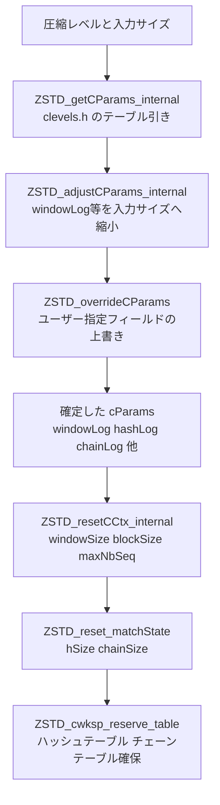

# 第11章 圧縮コンテキストとパラメータ：CCtx と cparams

> **本章で読むソース**
>
> - [`lib/compress/zstd_compress_internal.h`](https://github.com/facebook/zstd/blob/v1.5.7/lib/compress/zstd_compress_internal.h)
> - [`lib/compress/zstd_compress.c`](https://github.com/facebook/zstd/blob/v1.5.7/lib/compress/zstd_compress.c)
> - [`lib/compress/clevels.h`](https://github.com/facebook/zstd/blob/v1.5.7/lib/compress/clevels.h)

## この章の狙い

第3章では、`ZSTD_CCtx_setParameter` で積み立てた `requestedParams` が、圧縮開始の直前に `appliedParams` へ変換される流れを扱った。
本章はその変換の中身、すなわち圧縮レベルと入力サイズから `windowLog` や `hashLog` といった具体的な数値がどう決まるかを追う。
第4章で見たワークスペースの確保サイズは、この数値の決定結果を受け取るところから始まる。

## 前提：cParams が表す7個の数値

`ZSTD_compressionParameters` は、マッチファインダーの挙動を決める7個のフィールドを持つ構造体である。

[`lib/zstd.h` L1351-L1360](https://github.com/facebook/zstd/blob/v1.5.7/lib/zstd.h#L1351-L1360)

```c
typedef struct {
    unsigned windowLog;       /**< largest match distance : larger == more compression, more memory needed during decompression */
    unsigned chainLog;        /**< fully searched segment : larger == more compression, slower, more memory (useless for fast) */
    unsigned hashLog;         /**< dispatch table : larger == faster, more memory */
    unsigned searchLog;       /**< nb of searches : larger == more compression, slower */
    unsigned minMatch;        /**< match length searched : larger == faster decompression, sometimes less compression */
    unsigned targetLength;    /**< acceptable match size for optimal parser (only) : larger == more compression, slower */
    ZSTD_strategy strategy;   /**< see ZSTD_strategy definition above */
} ZSTD_compressionParameters;
```

**windowLog**はマッチを探しにいける最大距離を、**hashLog**はハッシュテーブルのエントリ数を、**chainLog**はチェーンテーブルのエントリ数をそれぞれ2の指数で表す。
**searchLog**は1回のマッチ探索で辿る候補数の目安、**minMatch**は最短マッチ長、**targetLength**は主に optimal parser が探索を打ち切る目安の長さである。
**strategy**は次章以降で扱うマッチファインダーの種別を選ぶ。

[`lib/zstd.h` L336-L347](https://github.com/facebook/zstd/blob/v1.5.7/lib/zstd.h#L336-L347)

```c
typedef enum { ZSTD_fast=1,
               ZSTD_dfast=2,
               ZSTD_greedy=3,
               ZSTD_lazy=4,
               ZSTD_lazy2=5,
               ZSTD_btlazy2=6,
               ZSTD_btopt=7,
               ZSTD_btultra=8,
               ZSTD_btultra2=9
               /* note : new strategies _might_ be added in the future.
                         Only the order (from fast to strong) is guaranteed */
} ZSTD_strategy;
```

数値が1の`ZSTD_fast`が最速、9の`ZSTD_btultra2`が最も圧縮率を追求する戦略であり、値の大小がそのまま速度と圧縮率のトレードオフの向きに対応する。

`ZSTD_CCtx_params_s` は、この `cParams` をユーザー設定の集合の中に埋め込む形で保持する。

[`lib/compress/zstd_compress_internal.h` L362-L365](https://github.com/facebook/zstd/blob/v1.5.7/lib/compress/zstd_compress_internal.h#L362-L365)

```c
struct ZSTD_CCtx_params_s {
    ZSTD_format_e format;
    ZSTD_compressionParameters cParams;
    ZSTD_frameParameters fParams;
```

`ZSTD_CCtx` はこの `ZSTD_CCtx_params` を2つ持つ。

[`lib/compress/zstd_compress_internal.h` L472-L477](https://github.com/facebook/zstd/blob/v1.5.7/lib/compress/zstd_compress_internal.h#L472-L477)

```c
struct ZSTD_CCtx_s {
    ZSTD_compressionStage_e stage;
    int cParamsChanged;                  /* == 1 if cParams(except wlog) or compression level are changed in requestedParams. Triggers transmission of new params to ZSTDMT (if available) then reset to 0. */
    int bmi2;                            /* == 1 if the CPU supports BMI2 and 0 otherwise. CPU support is determined dynamically once per context lifetime. */
    ZSTD_CCtx_params requestedParams;
    ZSTD_CCtx_params appliedParams;
```

第3章で述べた通り、`requestedParams` はユーザーが `ZSTD_c_compressionLevel` や `ZSTD_c_windowLog` で積み立てた値をそのまま保持するだけであり、`cParams` フィールドの中身がゼロのままのことも多い。
実際に7個のフィールドを埋めるのは、これから見る `ZSTD_getCParamsFromCCtxParams` である。

## レベルからテーブル引き：clevels.h

圧縮レベルだけを指定して `cParams` を決めるとき、zstd は圧縮レベルを添字とする定数テーブルを引く。
このテーブルは `clevels.h` に4本用意されている。

[`lib/compress/clevels.h` L25-L35](https://github.com/facebook/zstd/blob/v1.5.7/lib/compress/clevels.h#L25-L35)

```c
static const ZSTD_compressionParameters ZSTD_defaultCParameters[4][ZSTD_MAX_CLEVEL+1] = {
{   /* "default" - for any srcSize > 256 KB */
    /* W,  C,  H,  S,  L, TL, strat */
    { 19, 12, 13,  1,  6,  1, ZSTD_fast    },  /* base for negative levels */
    { 19, 13, 14,  1,  7,  0, ZSTD_fast    },  /* level  1 */
    { 20, 15, 16,  1,  6,  0, ZSTD_fast    },  /* level  2 */
    { 21, 16, 17,  1,  5,  0, ZSTD_dfast   },  /* level  3 */
    { 21, 18, 18,  1,  5,  0, ZSTD_dfast   },  /* level  4 */
    { 21, 18, 19,  3,  5,  2, ZSTD_greedy  },  /* level  5 */
    { 21, 18, 19,  3,  5,  4, ZSTD_lazy    },  /* level  6 */
    { 21, 19, 20,  4,  5,  8, ZSTD_lazy    },  /* level  7 */
```

4本のテーブルは、コメントの通り入力サイズの区分ごとに用意されている。
1本目が256 KB超、以下は128 KB以下、16 KB以下、それより小さい区分向けであり、区分が小さくなるほど各行の`windowLog`や`hashLog`は控えめな値になる。
列は7個の`ZSTD_compressionParameters`フィールドの並びそのままであり、行が圧縮レベル（0から22）に対応する。
どのテーブルのどの行を引くかを決めるのが `ZSTD_getCParams_internal` である。

[`lib/compress/zstd_compress.c` L7759-L7781](https://github.com/facebook/zstd/blob/v1.5.7/lib/compress/zstd_compress.c#L7759-L7781)

```c
static ZSTD_compressionParameters ZSTD_getCParams_internal(int compressionLevel, unsigned long long srcSizeHint, size_t dictSize, ZSTD_CParamMode_e mode)
{
    U64 const rSize = ZSTD_getCParamRowSize(srcSizeHint, dictSize, mode);
    U32 const tableID = (rSize <= 256 KB) + (rSize <= 128 KB) + (rSize <= 16 KB);
    int row;
    DEBUGLOG(5, "ZSTD_getCParams_internal (cLevel=%i)", compressionLevel);

    /* row */
    if (compressionLevel == 0) row = ZSTD_CLEVEL_DEFAULT;   /* 0 == default */
    else if (compressionLevel < 0) row = 0;   /* entry 0 is baseline for fast mode */
    else if (compressionLevel > ZSTD_MAX_CLEVEL) row = ZSTD_MAX_CLEVEL;
    else row = compressionLevel;

    {   ZSTD_compressionParameters cp = ZSTD_defaultCParameters[tableID][row];
        DEBUGLOG(5, "ZSTD_getCParams_internal selected tableID: %u row: %u strat: %u", tableID, row, (U32)cp.strategy);
        /* acceleration factor */
        if (compressionLevel < 0) {
            int const clampedCompressionLevel = MAX(ZSTD_minCLevel(), compressionLevel);
            cp.targetLength = (unsigned)(-clampedCompressionLevel);
        }
        /* refine parameters based on srcSize & dictSize */
        return ZSTD_adjustCParams_internal(cp, srcSizeHint, dictSize, mode, ZSTD_ps_auto);
    }
}
```

`tableID` は入力サイズと辞書サイズの合計（`ZSTD_getCParamRowSize` が計算する）を256 KB、128 KB、16 KBの3つの閾値と比較し、条件を満たすたびに1ずつ加算した値になる。
つまり入力が小さいほど`tableID`は大きくなり、より控えめな行を持つテーブルが選ばれる。
負の圧縮レベル（`ZSTD_fast`戦略を使う高速モード）では、レベルの絶対値がそのまま`targetLength`（ここでは「何バイトごとにハッシュを引くか」を左右する加速係数）に転用される点も特徴的である。
テーブル引きの結果はそのまま返らず、必ず `ZSTD_adjustCParams_internal` を通してから返る。

## 入力サイズによる調整：ZSTD_adjustCParams_internal

`ZSTD_adjustCParams_internal` は、テーブル引きで得た`cParams`を実際の`srcSize`と`dictSize`に合わせて縮小する。
関数のコメントが明言する通り、この調整は「メモリ消費量と初期化の遅延を減らすための、主に縮小方向の最適化」である。

[`lib/compress/zstd_compress.c` L1465-L1469](https://github.com/facebook/zstd/blob/v1.5.7/lib/compress/zstd_compress.c#L1465-L1469)

```c
/** ZSTD_adjustCParams_internal() :
 *  optimize `cPar` for a specified input (`srcSize` and `dictSize`).
 *  mostly downsize to reduce memory consumption and initialization latency.
 * `srcSize` can be ZSTD_CONTENTSIZE_UNKNOWN when not known.
```

調整の中心は`windowLog`の切り下げである。

[`lib/compress/zstd_compress.c` L1553-L1560](https://github.com/facebook/zstd/blob/v1.5.7/lib/compress/zstd_compress.c#L1553-L1560)

```c
    if ( (srcSize <= maxWindowResize)
      && (dictSize <= maxWindowResize) )  {
        U32 const tSize = (U32)(srcSize + dictSize);
        static U32 const hashSizeMin = 1 << ZSTD_HASHLOG_MIN;
        U32 const srcLog = (tSize < hashSizeMin) ? ZSTD_HASHLOG_MIN :
                            ZSTD_highbit32(tSize-1) + 1;
        if (cPar.windowLog > srcLog) cPar.windowLog = srcLog;
    }
```

入力と辞書の合計サイズを2の冪に切り上げた対数値を`srcLog`として求め、テーブルから引いた`windowLog`がそれより大きければ`srcLog`まで切り下げる。
たとえば圧縮レベル19（`windowLog`=22相当）で1 KB程度の入力を圧縮しようとしても、ウィンドウは実際の入力サイズに収まる大きさまで縮む。
`windowLog`が縮んだ後は、`hashLog`と`chainLog`も追随して縮められる。

[`lib/compress/zstd_compress.c` L1562-L1567](https://github.com/facebook/zstd/blob/v1.5.7/lib/compress/zstd_compress.c#L1562-L1567)

```c
    if (srcSize != ZSTD_CONTENTSIZE_UNKNOWN) {
        U32 const dictAndWindowLog = ZSTD_dictAndWindowLog(cPar.windowLog, (U64)srcSize, (U64)dictSize);
        U32 const cycleLog = ZSTD_cycleLog(cPar.chainLog, cPar.strategy);
        if (cPar.hashLog > dictAndWindowLog+1) cPar.hashLog = dictAndWindowLog+1;
        if (cycleLog > dictAndWindowLog)
            cPar.chainLog -= (cycleLog - dictAndWindowLog);
    }
```

これが本章で扱う最適化の要点である。
`hashLog`が大きいほどハッシュテーブルの衝突は減るが、テーブル自体のメモリと初期化コストも比例して増える。
入力サイズより大きい`hashLog`を確保しても、実際に格納されるエントリ数は入力サイズで頭打ちになるため、テーブルの後半は使われないまま無駄になる。
`ZSTD_adjustCParams_internal`は`windowLog`（ひいては`dictAndWindowLog`）を上限として`hashLog`を切り下げることで、この無駄なメモリ確保と、確保直後に発生するテーブルのゼロクリア（第4章で見た`ZSTD_cwksp_clean_tables`）の範囲そのものを削減する。

`ZSTD_getCParamsFromCCtxParams` は、この`ZSTD_getCParams_internal`によるテーブル引きと`ZSTD_adjustCParams_internal`による調整を、ユーザーが個別に上書きした値と合成する入口である。

[`lib/compress/zstd_compress.c` L1637-L1650](https://github.com/facebook/zstd/blob/v1.5.7/lib/compress/zstd_compress.c#L1637-L1650)

```c
ZSTD_compressionParameters ZSTD_getCParamsFromCCtxParams(
        const ZSTD_CCtx_params* CCtxParams, U64 srcSizeHint, size_t dictSize, ZSTD_CParamMode_e mode)
{
    ZSTD_compressionParameters cParams;
    if (srcSizeHint == ZSTD_CONTENTSIZE_UNKNOWN && CCtxParams->srcSizeHint > 0) {
        assert(CCtxParams->srcSizeHint>=0);
        srcSizeHint = (U64)CCtxParams->srcSizeHint;
    }
    cParams = ZSTD_getCParams_internal(CCtxParams->compressionLevel, srcSizeHint, dictSize, mode);
    if (CCtxParams->ldmParams.enableLdm == ZSTD_ps_enable) cParams.windowLog = ZSTD_LDM_DEFAULT_WINDOW_LOG;
    ZSTD_overrideCParams(&cParams, &CCtxParams->cParams);
    assert(!ZSTD_checkCParams(cParams));
    /* srcSizeHint == 0 means 0 */
    return ZSTD_adjustCParams_internal(cParams, srcSizeHint, dictSize, mode, CCtxParams->useRowMatchFinder);
}
```

`ZSTD_overrideCParams`は、`ZSTD_c_windowLog`のように個別に`ZSTD_CCtx_setParameter`で指定されたフィールドだけを、テーブル引きの結果に上書きする。
ユーザーが明示的に指定していないフィールドは0のままなので上書きされず、テーブル引きの値が生きる。
最後にもう一度`ZSTD_adjustCParams_internal`を通すのは、ユーザーが上書きした`windowLog`であっても、実際の入力サイズより過大であれば同じ縮小規則を適用するためである。

## ワークスペース確保へのつながり

`ZSTD_getCParamsFromCCtxParams` が確定させた`cParams`は、`ZSTD_resetCCtx_internal`に渡り、ここでテーブルサイズが具体的なバイト数へ変換される。

[`lib/compress/zstd_compress.c` L2131-L2133](https://github.com/facebook/zstd/blob/v1.5.7/lib/compress/zstd_compress.c#L2131-L2133)

```c
    {   size_t const windowSize = MAX(1, (size_t)MIN(((U64)1 << params->cParams.windowLog), pledgedSrcSize));
        size_t const blockSize = MIN(params->maxBlockSize, windowSize);
        size_t const maxNbSeq = ZSTD_maxNbSeq(blockSize, params->cParams.minMatch, ZSTD_hasExtSeqProd(params));
```

`windowLog`から求めた`windowSize`は、そのままブロックサイズの上限（`blockSize`）や、1ブロックに詰め込めるシーケンス数の上限（`maxNbSeq`）の計算に使われる。
`hashLog`と`chainLog`は、`ZSTD_reset_matchState`の中でハッシュテーブルとチェーンテーブルの実サイズに変換される。

[`lib/compress/zstd_compress.c` L1994-L1998](https://github.com/facebook/zstd/blob/v1.5.7/lib/compress/zstd_compress.c#L1994-L1998)

```c
    size_t const chainSize = ZSTD_allocateChainTable(cParams->strategy, useRowMatchFinder,
                                                     ms->dedicatedDictSearch && (forWho == ZSTD_resetTarget_CDict))
                                ? ((size_t)1 << cParams->chainLog)
                                : 0;
    size_t const hSize = ((size_t)1) << cParams->hashLog;
```

`chainSize`の計算に`ZSTD_allocateChainTable`という判定が挟まる点に注意したい。
`ZSTD_fast`や行ベースマッチファインダーの戦略ではチェーンテーブルそのものを使わないため、`chainLog`の値によらず`chainSize`は0になり、確保も行われない。
`hSize`と`chainSize`は、`ZSTD_cwksp_reserve_table`（第4章）へそのまま渡される実サイズになる。

[`lib/compress/zstd_compress.c` L2020-L2022](https://github.com/facebook/zstd/blob/v1.5.7/lib/compress/zstd_compress.c#L2020-L2022)

```c
    ms->hashTable = (U32*)ZSTD_cwksp_reserve_table(ws, hSize * sizeof(U32));
    ms->chainTable = (U32*)ZSTD_cwksp_reserve_table(ws, chainSize * sizeof(U32));
    ms->hashTable3 = (U32*)ZSTD_cwksp_reserve_table(ws, h3Size * sizeof(U32));
```

以上の依存関係を図にすると次のようになる。



## まとめ

`ZSTD_compressionParameters`の7個のフィールドは、`clevels.h`の圧縮レベル別テーブルからまず引かれ、`ZSTD_adjustCParams_internal`によって実際の入力サイズと辞書サイズに合わせて縮小され、最後にユーザーが個別に指定した値で上書きされる。
この3段階を経て確定した`cParams`が、`ZSTD_resetCCtx_internal`と`ZSTD_reset_matchState`を通じてハッシュテーブルやチェーンテーブルの実サイズに変換される。
`windowLog`を入力サイズに合わせて切り下げる調整は、後続の`hashLog`の上限も連動して下げることで、小さな入力に大きなテーブルを確保してしまう無駄を、第4章のワークスペース確保が始まる前の段階で断つ役割を持つ。

## 関連する章

- 第3章 [公開 API とストリーミングの流れ](../part00-overview/03-public-api-flow.md)
- 第4章 [ワークスペース管理：ZSTD_cwksp による単一アロケーション](../part01-common/04-cwksp-memory.md)
- 第12章 [seqStore とブロック圧縮の流れ](12-seqstore-blockflow.md)
- 第16章 [fast/dfast のマッチファインダー](../part04-matchfinder/16-fast-doublefast.md)
