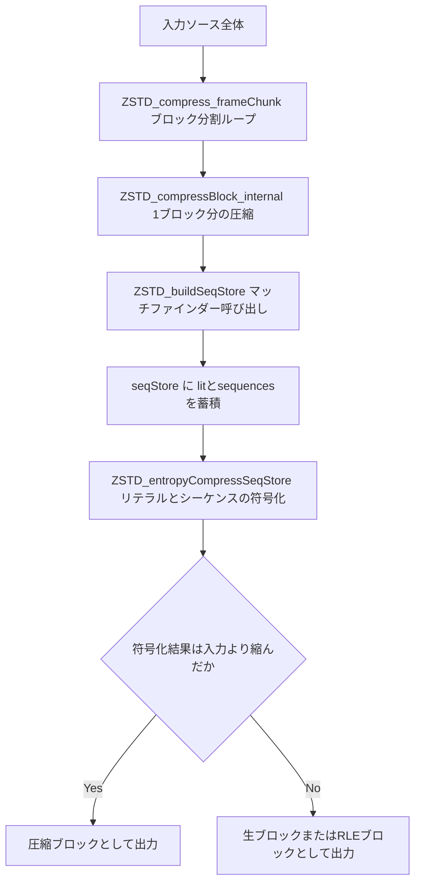

# 第12章 seqStore とブロック圧縮の流れ

> **本章で読むソース**
>
> - [`lib/compress/zstd_compress_internal.h`](https://github.com/facebook/zstd/blob/v1.5.7/lib/compress/zstd_compress_internal.h)
> - [`lib/compress/zstd_compress.c`](https://github.com/facebook/zstd/blob/v1.5.7/lib/compress/zstd_compress.c)
> - [`lib/zstd.h`](https://github.com/facebook/zstd/blob/v1.5.7/lib/zstd.h)

## この章の狙い

前章まではCCtxの設定とパラメータの決定を扱った。
本章からは実際の圧縮処理に入る。
zstdの圧縮は、入力をブロックに分割し、各ブロックについてマッチファインダーがリテラルとマッチ列を見つけ、それを中間表現である**seqStore**に一旦ため、最後にエントロピー符号化器へ渡すという流れで進む。
本章ではこの一連の流れを追い、なぜマッチ探索と符号化のあいだにseqStoreという中間層を挟むのかを、機構レベルで説明する。
マッチファインダー自体の探索アルゴリズムは第16章以降に譲り、本章はseqStoreの構造と、それを起点とするブロック圧縮のパイプラインに絞る。

## 前提

zstdは1フレームの入力をそのまま1回で圧縮するのではなく、上限サイズを持つ**ブロック**に分割してから圧縮する。
ブロックサイズの上限は`ZSTD_BLOCKSIZE_MAX`で、128KBに固定されている。

[`lib/zstd.h` L147-L148](https://github.com/facebook/zstd/blob/v1.5.7/lib/zstd.h#L147-L148)

```c
#define ZSTD_BLOCKSIZELOG_MAX  17
#define ZSTD_BLOCKSIZE_MAX     (1<<ZSTD_BLOCKSIZELOG_MAX)
```

1ブロックの圧縮は、マッチファインダーが**リテラル**（マッチとして参照されなかった生バイト列）と**シーケンス**（リテラル長、マッチ長、オフセットの3つ組）を見つける段階と、それらをエントロピー符号化してビット列に詰める段階の2段に分かれる。
この2段のあいだをつなぐデータ構造がseqStoreである。

全体のパイプラインを図示すると次のようになる。



## seqStoreの構造

seqStoreの実体は`SeqStore_t`である。
リテラルを詰めるバッファと、シーケンスを詰めるバッファを別々に持つ。

[`lib/compress/zstd_compress_internal.h` L98-L115](https://github.com/facebook/zstd/blob/v1.5.7/lib/compress/zstd_compress_internal.h#L98-L115)

```c
typedef struct {
    SeqDef* sequencesStart;
    SeqDef* sequences;      /* ptr to end of sequences */
    BYTE*  litStart;
    BYTE*  lit;             /* ptr to end of literals */
    BYTE*  llCode;
    BYTE*  mlCode;
    BYTE*  ofCode;
    size_t maxNbSeq;
    size_t maxNbLit;

    /* longLengthPos and longLengthType to allow us to represent either a single litLength or matchLength
     * in the seqStore that has a value larger than U16 (if it exists). To do so, we increment
     * the existing value of the litLength or matchLength by 0x10000.
     */
    ZSTD_longLengthType_e longLengthType;
    U32                   longLengthPos;  /* Index of the sequence to apply long length modification to */
} SeqStore_t;
```

`litStart`から`lit`までがリテラルの生バイト列で、マッチとして参照されずに残ったバイトがそのまま並ぶ。
`sequencesStart`から`sequences`までが`SeqDef`の配列で、1エントリが1つのマッチに対応する。

[`lib/compress/zstd_compress_internal.h` L85-L89](https://github.com/facebook/zstd/blob/v1.5.7/lib/compress/zstd_compress_internal.h#L85-L89)

```c
typedef struct SeqDef_s {
    U32 offBase;   /* offBase == Offset + ZSTD_REP_NUM, or repcode 1,2,3 */
    U16 litLength;
    U16 mlBase;    /* mlBase == matchLength - MINMATCH */
} SeqDef;
```

`litLength`と`mlBase`が`U16`である点に注意がいる。
リテラル長やマッチ長が65535を超える極端なケースを表すため、seqStoreは`longLengthType`と`longLengthPos`という別枠を持つ。
超過した長さを持つシーケンスの位置だけを`longLengthPos`に記録し、実際の長さは`U16`の値に`0x10000`を足して復元する。
1ブロックあたり1つしか長大なシーケンスが起こらないという前提のもとで、通常時は2バイトで済む長さフィールドを、まれなケースのためだけに4バイトへ拡張しない設計になっている。

`offBase`は生のオフセットではなく、直近3つの**repcode**（繰り返しオフセット）との重ね合わせで表現される。
値が1から3ならrepcode、それより大きければ`repcode数 + 実オフセット`という和で通常のオフセットを表す。

[`lib/compress/zstd_compress_internal.h` L721-L726](https://github.com/facebook/zstd/blob/v1.5.7/lib/compress/zstd_compress_internal.h#L721-L726)

```c
#define REPCODE_TO_OFFBASE(r) (assert((r)>=1), assert((r)<=ZSTD_REP_NUM), (r)) /* accepts IDs 1,2,3 */
#define OFFSET_TO_OFFBASE(o)  (assert((o)>0), o + ZSTD_REP_NUM)
#define OFFBASE_IS_OFFSET(o)  ((o) > ZSTD_REP_NUM)
#define OFFBASE_IS_REPCODE(o) ( 1 <= (o) && (o) <= ZSTD_REP_NUM)
#define OFFBASE_TO_OFFSET(o)  (assert(OFFBASE_IS_OFFSET(o)), (o) - ZSTD_REP_NUM)
#define OFFBASE_TO_REPCODE(o) (assert(OFFBASE_IS_REPCODE(o)), (o))  /* returns ID 1,2,3 */
```

同じオフセットへ繰り返しマッチすることは実データで頻繁に起こる。
直近3つのオフセットを短いIDで表現しておけば、シーケンスのエントロピー符号化時にオフセットコードとして小さい値が出やすくなり、圧縮率に効いてくる。
この仕組みの符号化側の詳細は第14章で扱う。

## マッチを記録するZSTD_storeSeq

マッチファインダーが1つのマッチを見つけるたびに呼ぶのが`ZSTD_storeSeq`である。
リテラルを`seqStore->lit`へコピーし、続けて`ZSTD_storeSeqOnly`でシーケンス情報を書き込む。

[`lib/compress/zstd_compress_internal.h` L775-L811](https://github.com/facebook/zstd/blob/v1.5.7/lib/compress/zstd_compress_internal.h#L775-L811)

```c
HINT_INLINE UNUSED_ATTR void
ZSTD_storeSeq(SeqStore_t* seqStorePtr,
              size_t litLength, const BYTE* literals, const BYTE* litLimit,
              U32 offBase,
              size_t matchLength)
{
    BYTE const* const litLimit_w = litLimit - WILDCOPY_OVERLENGTH;
    BYTE const* const litEnd = literals + litLength;
    // ... (中略) ...
    assert((size_t)(seqStorePtr->sequences - seqStorePtr->sequencesStart) < seqStorePtr->maxNbSeq);
    /* copy Literals */
    assert(seqStorePtr->maxNbLit <= 128 KB);
    assert(seqStorePtr->lit + litLength <= seqStorePtr->litStart + seqStorePtr->maxNbLit);
    assert(literals + litLength <= litLimit);
    if (litEnd <= litLimit_w) {
        /* Common case we can use wildcopy.
         * First copy 16 bytes, because literals are likely short.
         */
        ZSTD_STATIC_ASSERT(WILDCOPY_OVERLENGTH >= 16);
        ZSTD_copy16(seqStorePtr->lit, literals);
        if (litLength > 16) {
            ZSTD_wildcopy(seqStorePtr->lit+16, literals+16, (ptrdiff_t)litLength-16, ZSTD_no_overlap);
        }
    } else {
        ZSTD_safecopyLiterals(seqStorePtr->lit, literals, litEnd, litLimit_w);
    }
    seqStorePtr->lit += litLength;

    ZSTD_storeSeqOnly(seqStorePtr, litLength, offBase, matchLength);
}
```

リテラルのコピーは`ZSTD_wildcopy`による16バイト単位のオーバーコピーが主経路であり、バッファ末尾に近い場合だけ境界チェックつきの`ZSTD_safecopyLiterals`に切り替える。
リテラルは短いことが多いという想定のもとで、まず16バイトを無条件にコピーし、それ以上長い場合だけ追加のwildcopyを回す構成になっている。

`ZSTD_storeSeqOnly`はseqStoreの本体であり、リテラル長、オフセット、マッチ長の3値を`SeqDef`に書き込む。

[`lib/compress/zstd_compress_internal.h` L734-L767](https://github.com/facebook/zstd/blob/v1.5.7/lib/compress/zstd_compress_internal.h#L734-L767)

```c
HINT_INLINE UNUSED_ATTR void
ZSTD_storeSeqOnly(SeqStore_t* seqStorePtr,
              size_t litLength,
              U32 offBase,
              size_t matchLength)
{
    assert((size_t)(seqStorePtr->sequences - seqStorePtr->sequencesStart) < seqStorePtr->maxNbSeq);

    /* literal Length */
    assert(litLength <= ZSTD_BLOCKSIZE_MAX);
    if (UNLIKELY(litLength>0xFFFF)) {
        assert(seqStorePtr->longLengthType == ZSTD_llt_none); /* there can only be a single long length */
        seqStorePtr->longLengthType = ZSTD_llt_literalLength;
        seqStorePtr->longLengthPos = (U32)(seqStorePtr->sequences - seqStorePtr->sequencesStart);
    }
    seqStorePtr->sequences[0].litLength = (U16)litLength;

    /* match offset */
    seqStorePtr->sequences[0].offBase = offBase;

    /* match Length */
    assert(matchLength <= ZSTD_BLOCKSIZE_MAX);
    assert(matchLength >= MINMATCH);
    {   size_t const mlBase = matchLength - MINMATCH;
        if (UNLIKELY(mlBase>0xFFFF)) {
            assert(seqStorePtr->longLengthType == ZSTD_llt_none); /* there can only be a single long length */
            seqStorePtr->longLengthType = ZSTD_llt_matchLength;
            seqStorePtr->longLengthPos = (U32)(seqStorePtr->sequences - seqStorePtr->sequencesStart);
        }
        seqStorePtr->sequences[0].mlBase = (U16)mlBase;
    }

    seqStorePtr->sequences++;
}
```

リテラル長かマッチ長のどちらかが`0xFFFF`を超えたときに限り、`longLengthType`と`longLengthPos`へその事実を記録する処理が、前節で述べた長大シーケンスの表現である。
最後に`seqStorePtr->sequences++`でカーソルを進め、次のマッチが次のエントリへ書き込まれるようにする。

## ブロック分割：ZSTD_compress_frameChunk

入力全体をブロックへ分割するループが`ZSTD_compress_frameChunk`である。
残りサイズがある限り、1ブロック分を切り出しては圧縮する処理を繰り返す。

[`lib/compress/zstd_compress.c` L4610-L4619](https://github.com/facebook/zstd/blob/v1.5.7/lib/compress/zstd_compress.c#L4610-L4619)

```c
    while (remaining) {
        ZSTD_MatchState_t* const ms = &cctx->blockState.matchState;
        size_t const blockSize = ZSTD_optimalBlockSize(cctx,
                                ip, remaining,
                                blockSizeMax,
                                cctx->appliedParams.preBlockSplitter_level,
                                cctx->appliedParams.cParams.strategy,
                                savings);
        U32 const lastBlock = lastFrameChunk & (blockSize == remaining);
        assert(blockSize <= remaining);
```

`blockSize`は`ZSTD_optimalBlockSize`が決める。
`blockSizeMax`（`ZSTD_BLOCKSIZE_MAX`とウィンドウサイズの小さいほう）を上限としつつ、ブロック分割の設定次第ではこれより小さいブロックを選ぶこともある。
分割の詳細は第20章に譲り、本章では1ブロックの上限が固定されているという事実だけを押さえておけば足りる。

1ブロック分の圧縮結果を得たあと、ループは圧縮ブロックとして書けたか、非圧縮扱いにするかで分岐する。

[`lib/compress/zstd_compress.c` L4646-L4660](https://github.com/facebook/zstd/blob/v1.5.7/lib/compress/zstd_compress.c#L4646-L4660)

```c
                cSize = ZSTD_compressBlock_internal(cctx,
                                        op+ZSTD_blockHeaderSize, dstCapacity-ZSTD_blockHeaderSize,
                                        ip, blockSize, 1 /* frame */);
                FORWARD_IF_ERROR(cSize, "ZSTD_compressBlock_internal failed");

                if (cSize == 0) {  /* block is not compressible */
                    cSize = ZSTD_noCompressBlock(op, dstCapacity, ip, blockSize, lastBlock);
                    FORWARD_IF_ERROR(cSize, "ZSTD_noCompressBlock failed");
                } else {
                    U32 const cBlockHeader = cSize == 1 ?
                        lastBlock + (((U32)bt_rle)<<1) + (U32)(blockSize << 3) :
                        lastBlock + (((U32)bt_compressed)<<1) + (U32)(cSize << 3);
                    MEM_writeLE24(op, cBlockHeader);
                    cSize += ZSTD_blockHeaderSize;
                }
```

`ZSTD_compressBlock_internal`が`cSize == 0`を返すのは、圧縮を試みた結果が入力サイズより縮まなかった場合である。
このとき`ZSTD_noCompressBlock`で生ブロック（raw block）を書き、そのブロックは圧縮せずに生データをそのままコピーする。
逆に`cSize == 1`のときはブロック全体が同一バイトの繰り返しであるRLEブロックとして書く。
どちらも、圧縮によって出力が入力より膨らんでしまう最悪ケースを避けるためのフォールバックである。

## 1ブロックの圧縮：ZSTD_compressBlock_internal

`ZSTD_compressBlock_internal`が1ブロックぶんの処理をまとめる。
まず`ZSTD_buildSeqStore`でマッチファインダーを起動し、seqStoreを埋める。

[`lib/compress/zstd_compress.c` L4399-L4406](https://github.com/facebook/zstd/blob/v1.5.7/lib/compress/zstd_compress.c#L4399-L4406)

```c
    {   const size_t bss = ZSTD_buildSeqStore(zc, src, srcSize);
        FORWARD_IF_ERROR(bss, "ZSTD_buildSeqStore failed");
        if (bss == ZSTDbss_noCompress) {
            RETURN_ERROR_IF(zc->seqCollector.collectSequences, sequenceProducer_failed, "Uncompressible block");
            cSize = 0;
            goto out;
        }
    }
```

`ZSTD_buildSeqStore`はまずseqStoreをリセットし、選択されたマッチファインダー（グリーディ、lazy、optimal parserなど、いずれも第16章以降で扱う）を呼び出して、`ZSTD_storeSeq`の呼び出しでseqStoreを埋めていく。

[`lib/compress/zstd_compress.c` L3264-L3283](https://github.com/facebook/zstd/blob/v1.5.7/lib/compress/zstd_compress.c#L3264-L3283)

```c
static size_t ZSTD_buildSeqStore(ZSTD_CCtx* zc, const void* src, size_t srcSize)
{
    ZSTD_MatchState_t* const ms = &zc->blockState.matchState;
    DEBUGLOG(5, "ZSTD_buildSeqStore (srcSize=%zu)", srcSize);
    assert(srcSize <= ZSTD_BLOCKSIZE_MAX);
    /* Assert that we have correctly flushed the ctx params into the ms's copy */
    ZSTD_assertEqualCParams(zc->appliedParams.cParams, ms->cParams);
    /* TODO: See 3090. We reduced MIN_CBLOCK_SIZE from 3 to 2 so to compensate we are adding
     * additional 1. We need to revisit and change this logic to be more consistent */
    if (srcSize < MIN_CBLOCK_SIZE+ZSTD_blockHeaderSize+1+1) {
        if (zc->appliedParams.cParams.strategy >= ZSTD_btopt) {
            ZSTD_ldm_skipRawSeqStoreBytes(&zc->externSeqStore, srcSize);
        } else {
            ZSTD_ldm_skipSequences(&zc->externSeqStore, srcSize, zc->appliedParams.cParams.minMatch);
        }
        return ZSTDbss_noCompress; /* don't even attempt compression below a certain srcSize */
    }
    ZSTD_resetSeqStore(&(zc->seqStore));
```

入力が極端に小さいときは、マッチ探索そのものを試みずに`ZSTDbss_noCompress`を返して打ち切る。
小さすぎるブロックは、マッチが見つかったとしてもヘッダ分のオーバーヘッドで相殺されてしまい、探索コストに見合わないという判断である。

マッチファインダーを呼び終えたあと、末尾に残った未参照のバイト列は`ZSTD_storeLastLiterals`でまとめてseqStoreへ流し込む。

[`lib/compress/zstd_compress.c` L3414-L3418](https://github.com/facebook/zstd/blob/v1.5.7/lib/compress/zstd_compress.c#L3414-L3418)

```c
        } else {   /* not long range mode and no external matchfinder */
            ZSTD_BlockCompressor_f const blockCompressor = ZSTD_selectBlockCompressor(
                    zc->appliedParams.cParams.strategy,
                    zc->appliedParams.useRowMatchFinder,
                    dictMode);
            ms->ldmSeqStore = NULL;
```

seqStoreが埋まったら、`ZSTD_compressBlock_internal`は`ZSTD_entropyCompressSeqStore`を呼んでリテラルとシーケンスをまとめて符号化する。

[`lib/compress/zstd_compress.c` L4414-L4421](https://github.com/facebook/zstd/blob/v1.5.7/lib/compress/zstd_compress.c#L4414-L4421)

```c
    /* encode sequences and literals */
    cSize = ZSTD_entropyCompressSeqStore(&zc->seqStore,
            &zc->blockState.prevCBlock->entropy, &zc->blockState.nextCBlock->entropy,
            &zc->appliedParams,
            dst, dstCapacity,
            srcSize,
            zc->tmpWorkspace, zc->tmpWkspSize /* statically allocated in resetCCtx */,
            zc->bmi2);
```

## エントロピー符号化とサイズ判定：ZSTD_entropyCompressSeqStore

`ZSTD_entropyCompressSeqStore`自体は薄いラッパーで、実処理を`ZSTD_entropyCompressSeqStore_wExtLitBuffer`に委譲する。
この関数が、符号化結果のサイズをもとに圧縮ブロックとして採用するかどうかを判定する。

[`lib/compress/zstd_compress.c` L3016-L3041](https://github.com/facebook/zstd/blob/v1.5.7/lib/compress/zstd_compress.c#L3016-L3041)

```c
{
    size_t const cSize = ZSTD_entropyCompressSeqStore_internal(
                            dst, dstCapacity,
                            literals, litSize,
                            seqStorePtr, prevEntropy, nextEntropy, cctxParams,
                            entropyWorkspace, entropyWkspSize, bmi2);
    if (cSize == 0) return 0;
    /* When srcSize <= dstCapacity, there is enough space to write a raw uncompressed block.
     * Since we ran out of space, block must be not compressible, so fall back to raw uncompressed block.
     */
    if ((cSize == ERROR(dstSize_tooSmall)) & (blockSize <= dstCapacity)) {
        DEBUGLOG(4, "not enough dstCapacity (%zu) for ZSTD_entropyCompressSeqStore_internal()=> do not compress block", dstCapacity);
        return 0;  /* block not compressed */
    }
    FORWARD_IF_ERROR(cSize, "ZSTD_entropyCompressSeqStore_internal failed");

    /* Check compressibility */
    {   size_t const maxCSize = blockSize - ZSTD_minGain(blockSize, cctxParams->cParams.strategy);
        if (cSize >= maxCSize) return 0;  /* block not compressed */
    }
    DEBUGLOG(5, "ZSTD_entropyCompressSeqStore() cSize: %zu", cSize);
    /* libzstd decoder before  > v1.5.4 is not compatible with compressed blocks of size ZSTD_BLOCKSIZE_MAX exactly.
     * This restriction is indirectly already fulfilled by respecting ZSTD_minGain() condition above.
     */
    assert(cSize < ZSTD_BLOCKSIZE_MAX);
    return cSize;
}
```

符号化後のサイズが出力バッファに収まらないなら、その場でエラーを`0`（非圧縮扱い）に読み替えて呼び出し元へ返す。
さらに、バッファには収まっても`ZSTD_minGain`が要求する最低限の縮小幅に届かなければ、やはり`0`を返して非圧縮ブロックへ回す。
この2段のチェックが、前節で見た`ZSTD_compress_frameChunk`側の生ブロックと RLE ブロックへのフォールバックにつながっている。

## seqStoreという中間表現の利点

ここまでの流れが示すとおり、マッチファインダーは1マッチずつ`ZSTD_storeSeq`を呼ぶだけで、エントロピー符号化のことを一切考えない。
符号化はブロック全体のseqStoreが埋まったあとに、`ZSTD_entropyCompressSeqStore`が一括で担う。

この分離が効くのは、エントロピー符号化がブロック単位の統計を必要とする点にある。
Huffman符号化は記号の出現頻度から木を組み、FSE符号化も正規化されたカウントテーブルを必要とする（第7章、第9章）。
どちらも、対象となる記号列の全体を見てからでなければ効率のよい符号長を決められない。
仮にマッチファインダーがマッチを見つけるたびに1つずつ符号化していたら、まだ出現していない記号の頻度を予測できず、固定長の符号や場当たり的な見積もりに頼ることになる。
seqStoreにリテラルとシーケンスを一旦ため、ブロック境界で頻度統計を取ってから符号化することで、そのブロックに実際に出現した記号の分布に合わせた符号を割り当てられる。
マッチ探索の記録とエントロピー符号化という性質の異なる2つの処理を、seqStoreという単純な配列だけで疎結合に保っている点が、この設計の要である。

## まとめ

zstdはフレーム全体を`ZSTD_compress_frameChunk`で128KB以下のブロックへ分割し、ブロックごとに`ZSTD_compressBlock_internal`を呼ぶ。
その内部では、まず`ZSTD_buildSeqStore`がマッチファインダーを起動し、見つかったリテラルとマッチを`ZSTD_storeSeq`経由でseqStoreへ蓄積する。
seqStoreが埋まったら`ZSTD_entropyCompressSeqStore`がリテラルとシーケンスをまとめてエントロピー符号化し、その結果が入力より十分縮んでいなければ生ブロックやRLEブロックへフォールバックする。
マッチ探索の結果を中間表現であるseqStoreに一旦ため、ブロック全体の統計が揃ってからまとめて符号化する構成が、頻度に応じた効率のよい符号割り当てを可能にしている。

## 関連する章

- [第11章 圧縮コンテキストとパラメータ：CCtxとcparams](11-cctx-params.md)
- [第13章 リテラルの符号化](13-literals-encoding.md)
- [第14章 シーケンスの符号化](14-sequences-encoding.md)
- [第16章 fast/doubleFastマッチファインダー](../part04-matchfinder/16-fast-doublefast.md)
