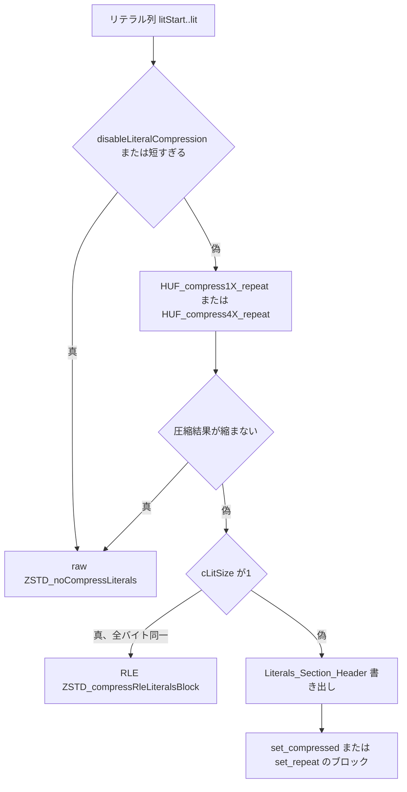

# 第13章 リテラルの符号化

> **本章で読むソース**
>
> - [`lib/compress/zstd_compress_literals.c`](https://github.com/facebook/zstd/blob/v1.5.7/lib/compress/zstd_compress_literals.c)
> - [`lib/compress/zstd_compress_literals.h`](https://github.com/facebook/zstd/blob/v1.5.7/lib/compress/zstd_compress_literals.h)
> - [`lib/common/zstd_internal.h`](https://github.com/facebook/zstd/blob/v1.5.7/lib/common/zstd_internal.h)
> - [`lib/common/huf.h`](https://github.com/facebook/zstd/blob/v1.5.7/lib/common/huf.h)
> - [`lib/compress/huf_compress.c`](https://github.com/facebook/zstd/blob/v1.5.7/lib/compress/huf_compress.c)

## この章の狙い

第12章で見た `SeqStore_t` には、マッチとして参照されなかった生バイト列（リテラル）がひとまとまりに蓄積されている。
このリテラル列をブロックへ書き出す直前に処理するのが `ZSTD_compressLiterals` である。
本章では、この関数が raw、RLE、Huffman の3方式のどれを選び、選んだ方式のヘッダとデータをどう書き出すかを追う。
Huffman 符号化器そのもの（木の構築、ビット詰め、4ストリーム化）は第9章で読んだので、本章はその手前、「符号化を呼ぶかどうか、呼んだ結果をどう採否判定するか」という制御に絞る。

## 前提

リテラルセクションの先頭には、Literals_Section_Header というヘッダが置かれる。
ヘッダの最初の2ビットは `SymbolEncodingType_e` で、4方式を区別する。

[`lib/common/zstd_internal.h` L94](https://github.com/facebook/zstd/blob/v1.5.7/lib/common/zstd_internal.h#L94)

```c
typedef enum { set_basic, set_rle, set_compressed, set_repeat } SymbolEncodingType_e;
```

`set_basic` はヘッダの直後にリテラルをそのまま並べる無圧縮（raw）、`set_rle` は全バイトが同一値のときに1バイトだけ書くラン長圧縮である。
`set_compressed` は新しく構築した Huffman テーブルとともに符号化データを書き、`set_repeat` は前のブロックで使った Huffman テーブルをそのまま再利用してテーブル記述そのものを省略する。
どの方式を選ぶかは一度符号化を試してからでないと決まらないため、`ZSTD_compressLiterals` は「まず Huffman 圧縮を試し、その結果を見て採否を判定する」という順序で書かれている。

全体の流れを図示すると次のようになる。



## raw と RLE：符号化を試すまでもない特殊ケース

Huffman を試す前に、そもそも圧縮を試みる価値があるかを判定する関門がいくつかある。
まず raw 方式を書き出す `ZSTD_noCompressLiterals` を見る。

[`lib/compress/zstd_compress_literals.c` L39-L66](https://github.com/facebook/zstd/blob/v1.5.7/lib/compress/zstd_compress_literals.c#L39-L66)

```c
size_t ZSTD_noCompressLiterals (void* dst, size_t dstCapacity, const void* src, size_t srcSize)
{
    BYTE* const ostart = (BYTE*)dst;
    U32   const flSize = 1 + (srcSize>31) + (srcSize>4095);

    DEBUGLOG(5, "ZSTD_noCompressLiterals: srcSize=%zu, dstCapacity=%zu", srcSize, dstCapacity);

    RETURN_ERROR_IF(srcSize + flSize > dstCapacity, dstSize_tooSmall, "");

    switch(flSize)
    {
        case 1: /* 2 - 1 - 5 */
            ostart[0] = (BYTE)((U32)set_basic + (srcSize<<3));
            break;
        case 2: /* 2 - 2 - 12 */
            MEM_writeLE16(ostart, (U16)((U32)set_basic + (1<<2) + (srcSize<<4)));
            break;
        case 3: /* 2 - 2 - 20 */
            MEM_writeLE32(ostart, (U32)((U32)set_basic + (3<<2) + (srcSize<<4)));
            break;
        default:   /* not necessary : flSize is {1,2,3} */
            assert(0);
    }

    ZSTD_memcpy(ostart + flSize, src, srcSize);
    DEBUGLOG(5, "Raw (uncompressed) literals: %u -> %u", (U32)srcSize, (U32)(srcSize + flSize));
    return srcSize + flSize;
}
```

ヘッダ長 `flSize` はリテラルサイズによって1〜3バイトに伸びる。
コメントの `2 - 1 - 5` は「種別2ビット、単一/複数ストリームフラグ1ビット、サイズ5ビット」という内訳を表し、サイズが大きいほどヘッダも長くなる代わりにより大きなリテラル列を表現できる。
raw 方式ではヘッダの直後に入力をそのまま `ZSTD_memcpy` するだけなので、符号化のコストなしに常に選べる下限として機能する。

RLE 方式もほぼ同じヘッダ構造を使うが、本体は1バイトだけになる。

[`lib/compress/zstd_compress_literals.c` L81-L107](https://github.com/facebook/zstd/blob/v1.5.7/lib/compress/zstd_compress_literals.c#L81-L107)

```c
size_t ZSTD_compressRleLiteralsBlock (void* dst, size_t dstCapacity, const void* src, size_t srcSize)
{
    BYTE* const ostart = (BYTE*)dst;
    U32   const flSize = 1 + (srcSize>31) + (srcSize>4095);

    assert(dstCapacity >= 4); (void)dstCapacity;
    assert(allBytesIdentical(src, srcSize));

    switch(flSize)
    {
        case 1: /* 2 - 1 - 5 */
            ostart[0] = (BYTE)((U32)set_rle + (srcSize<<3));
            break;
        case 2: /* 2 - 2 - 12 */
            MEM_writeLE16(ostart, (U16)((U32)set_rle + (1<<2) + (srcSize<<4)));
            break;
        case 3: /* 2 - 2 - 20 */
            MEM_writeLE32(ostart, (U32)((U32)set_rle + (3<<2) + (srcSize<<4)));
            break;
        default:   /* not necessary : flSize is {1,2,3} */
            assert(0);
    }

    ostart[flSize] = *(const BYTE*)src;
    DEBUGLOG(5, "RLE : Repeated Literal (%02X: %u times) -> %u bytes encoded", ((const BYTE*)src)[0], (U32)srcSize, (U32)flSize + 1);
    return flSize+1;
}
```

`set_rle` はヘッダの種別ビットを変えるだけで、あとは `ZSTD_noCompressLiterals` と同じヘッダ組み立てを踏襲している。
呼び出し側は `allBytesIdentical` で全バイトが同一であることをあらかじめ確認してから呼ぶ。

## Huffman 圧縮の呼び出しと採否判定

方式選択の中心は `ZSTD_compressLiterals` である。
まず、圧縮そのものを試みる価値があるかを、入力サイズと戦略から判定する。

[`lib/compress/zstd_compress_literals.c` L154-L161](https://github.com/facebook/zstd/blob/v1.5.7/lib/compress/zstd_compress_literals.c#L154-L161)

```c
    if (disableLiteralCompression)
        return ZSTD_noCompressLiterals(dst, dstCapacity, src, srcSize);

    /* if too small, don't even attempt compression (speed opt) */
    if (srcSize < ZSTD_minLiteralsToCompress(strategy, prevHuf->repeatMode))
        return ZSTD_noCompressLiterals(dst, dstCapacity, src, srcSize);

    RETURN_ERROR_IF(dstCapacity < lhSize+1, dstSize_tooSmall, "not enough space for compression");
```

`ZSTD_minLiteralsToCompress` が返す閾値は、圧縮戦略が高いほど小さく（積極的に圧縮を試みる）、低いほど大きくなる。
ただし前ブロックの Huffman テーブルが再利用可能（`HUF_repeat_valid`）なときは、新しく木を組む必要がないぶんコストが低いので、閾値を6バイトまで下げて再利用を試しやすくしている。

[`lib/compress/zstd_compress_literals.c` L114-L127](https://github.com/facebook/zstd/blob/v1.5.7/lib/compress/zstd_compress_literals.c#L114-L127)

```c
static size_t
ZSTD_minLiteralsToCompress(ZSTD_strategy strategy, HUF_repeat huf_repeat)
{
    assert((int)strategy >= 0);
    assert((int)strategy <= 9);
    /* btultra2 : min 8 bytes;
     * then 2x larger for each successive compression strategy
     * max threshold 64 bytes */
    {   int const shift = MIN(9-(int)strategy, 3);
        size_t const mintc = (huf_repeat == HUF_repeat_valid) ? 6 : (size_t)8 << shift;
        DEBUGLOG(7, "minLiteralsToCompress = %zu", mintc);
        return mintc;
    }
}
```

閾値を越えたら、単一ストリームか4ストリームかを選んで Huffman 圧縮を呼び出す。

[`lib/compress/zstd_compress_literals.c` L162-L185](https://github.com/facebook/zstd/blob/v1.5.7/lib/compress/zstd_compress_literals.c#L162-L185)

```c
    {   HUF_repeat repeat = prevHuf->repeatMode;
        int const flags = 0
            | (bmi2 ? HUF_flags_bmi2 : 0)
            | (strategy < ZSTD_lazy && srcSize <= 1024 ? HUF_flags_preferRepeat : 0)
            | (strategy >= HUF_OPTIMAL_DEPTH_THRESHOLD ? HUF_flags_optimalDepth : 0)
            | (suspectUncompressible ? HUF_flags_suspectUncompressible : 0);

        typedef size_t (*huf_compress_f)(void*, size_t, const void*, size_t, unsigned, unsigned, void*, size_t, HUF_CElt*, HUF_repeat*, int);
        huf_compress_f huf_compress;
        if (repeat == HUF_repeat_valid && lhSize == 3) singleStream = 1;
        huf_compress = singleStream ? HUF_compress1X_repeat : HUF_compress4X_repeat;
        cLitSize = huf_compress(ostart+lhSize, dstCapacity-lhSize,
                                src, srcSize,
                                HUF_SYMBOLVALUE_MAX, LitHufLog,
                                entropyWorkspace, entropyWorkspaceSize,
                                (HUF_CElt*)nextHuf->CTable,
                                &repeat, flags);
        DEBUGLOG(5, "%zu literals compressed into %zu bytes (before header)", srcSize, cLitSize);
        if (repeat != HUF_repeat_none) {
            /* reused the existing table */
            DEBUGLOG(5, "reusing statistics from previous huffman block");
            hType = set_repeat;
        }
    }
```

`srcSize < 256` なら単一ストリーム、それ以外は4ストリームがデフォルトだが、前テーブルが有効かつヘッダ長が最小（`lhSize == 3`）のときは強制的に単一ストリームへ切り替える。
呼び出し後の `repeat` の値が `HUF_compress1X_repeat` / `HUF_compress4X_repeat` の内部で書き換わり、実際に前のテーブルを再利用できたかどうかが伝わってくる。
`repeat != HUF_repeat_none` であれば `hType` を `set_repeat` にし、後続のヘッダ組み立てに反映する。

Huffman 圧縮の結果は、そのまま採用されるとは限らない。
縮み幅が最低ライン（`minGain`）に届かないか、そもそもエラーであれば raw 方式に差し戻す。

[`lib/compress/zstd_compress_literals.c` L187-L191](https://github.com/facebook/zstd/blob/v1.5.7/lib/compress/zstd_compress_literals.c#L187-L191)

```c
    {   size_t const minGain = ZSTD_minGain(srcSize, strategy);
        if ((cLitSize==0) || (cLitSize >= srcSize - minGain) || ERR_isError(cLitSize)) {
            ZSTD_memcpy(nextHuf, prevHuf, sizeof(*prevHuf));
            return ZSTD_noCompressLiterals(dst, dstCapacity, src, srcSize);
    }   }
```

差し戻すときは `nextHuf` を `prevHuf` へ巻き戻し、次のブロックが今回の圧縮結果に引きずられないようにしている。
逆に `cLitSize` がちょうど1バイトの場合は、アルファベットが1種類しかない特殊な結果である可能性がある。

[`lib/compress/zstd_compress_literals.c` L192-L201](https://github.com/facebook/zstd/blob/v1.5.7/lib/compress/zstd_compress_literals.c#L192-L201)

```c
    if (cLitSize==1) {
        /* A return value of 1 signals that the alphabet consists of a single symbol.
         * However, in some rare circumstances, it could be the compressed size (a single byte).
         * For that outcome to have a chance to happen, it's necessary that `srcSize < 8`.
         * (it's also necessary to not generate statistics).
         * Therefore, in such a case, actively check that all bytes are identical. */
        if ((srcSize >= 8) || allBytesIdentical(src, srcSize)) {
            ZSTD_memcpy(nextHuf, prevHuf, sizeof(*prevHuf));
            return ZSTD_compressRleLiteralsBlock(dst, dstCapacity, src, srcSize);
    }   }
```

コメントが述べるとおり、Huffman 符号化器が「1種類の記号しかない」ことを検出したときの戻り値と、たまたま1バイトに圧縮できた結果は区別がつかない。
`srcSize >= 8` であればまず前者しかありえないので RLE に切り替え、`srcSize < 8` の際だけ `allBytesIdentical` で実際に確認してから判定する。

## ヘッダの書き出し

raw、RLE 以外に落ちなかった入力は、`set_compressed` か `set_repeat` として Literals_Section_Header を書く。

[`lib/compress/zstd_compress_literals.c` L203-L232](https://github.com/facebook/zstd/blob/v1.5.7/lib/compress/zstd_compress_literals.c#L203-L232)

```c
    if (hType == set_compressed) {
        /* using a newly constructed table */
        nextHuf->repeatMode = HUF_repeat_check;
    }

    /* Build header */
    switch(lhSize)
    {
    case 3: /* 2 - 2 - 10 - 10 */
        if (!singleStream) assert(srcSize >= MIN_LITERALS_FOR_4_STREAMS);
        {   U32 const lhc = hType + ((U32)(!singleStream) << 2) + ((U32)srcSize<<4) + ((U32)cLitSize<<14);
            MEM_writeLE24(ostart, lhc);
            break;
        }
    case 4: /* 2 - 2 - 14 - 14 */
        assert(srcSize >= MIN_LITERALS_FOR_4_STREAMS);
        {   U32 const lhc = hType + (2 << 2) + ((U32)srcSize<<4) + ((U32)cLitSize<<18);
            MEM_writeLE32(ostart, lhc);
            break;
        }
    case 5: /* 2 - 2 - 18 - 18 */
        assert(srcSize >= MIN_LITERALS_FOR_4_STREAMS);
        {   U32 const lhc = hType + (3 << 2) + ((U32)srcSize<<4) + ((U32)cLitSize<<22);
            MEM_writeLE32(ostart, lhc);
            ostart[4] = (BYTE)(cLitSize >> 10);
            break;
        }
    default:  /* not possible : lhSize is {3,4,5} */
        assert(0);
    }
    DEBUGLOG(5, "Compressed literals: %u -> %u", (U32)srcSize, (U32)(lhSize+cLitSize));
    return lhSize+cLitSize;
```

`lhSize`（1〜5バイトのヘッダ長）に応じて、種別2ビット、4ストリームフラグ、展開後サイズ（regenerated size）、圧縮後サイズ（compressed size）をビット詰めで書き込む。
新テーブルを構築した（`set_compressed`）ときは `nextHuf->repeatMode` を `HUF_repeat_check` にし、次のブロックで再利用を試みる際に `HUF_validateCTable` による検証を挟むよう指示する。
一方、今回テーブルを再利用した（`set_repeat`）ときはこの代入をせず、`repeatMode` は `HUF_compress4X_repeat` 内部の処理を経てそのまま伝わる。

## 最適化の要点：テーブル再利用でヘッダを省く

Huffman のテーブル記述（重みの列、第9章参照）は数バイトから100バイト超になりうる。
毎ブロックでこれを書き直すのは、入力の記号分布がブロックをまたいでほとんど変わらない場合には無駄が大きい。
zstd はこの無駄を、`HUF_repeat` の状態機械で避けている。

`HUF_repeat` は3値を取る。

[`lib/common/huf.h` L139-L143](https://github.com/facebook/zstd/blob/v1.5.7/lib/common/huf.h#L139-L143)

```c
typedef enum {
   HUF_repeat_none,  /**< Cannot use the previous table */
   HUF_repeat_check, /**< Can use the previous table but it must be checked. Note : The previous table must have been constructed by HUF_compress{1, 4}X_repeat */
   HUF_repeat_valid  /**< Can use the previous table and it is assumed to be valid */
 } HUF_repeat;
```

`HUF_compress_internal`（`HUF_compress1X_repeat` / `HUF_compress4X_repeat` の実体）は、新しい木を組んで得たテーブル記述サイズ `hSize` と、旧テーブルのまま符号化した場合の推定サイズ、新テーブルで符号化した場合の推定サイズを比較する。

[`lib/compress/huf_compress.c` L1414-L1421](https://github.com/facebook/zstd/blob/v1.5.7/lib/compress/huf_compress.c#L1414-L1421)

```c
        /* Check if using previous huffman table is beneficial */
        if (repeat && *repeat != HUF_repeat_none) {
            size_t const oldSize = HUF_estimateCompressedSize(oldHufTable, table->count, maxSymbolValue);
            size_t const newSize = HUF_estimateCompressedSize(table->CTable, table->count, maxSymbolValue);
            if (oldSize <= hSize + newSize || hSize + 12 >= srcSize) {
                return HUF_compressCTable_internal(ostart, op, oend,
                                                   src, srcSize,
                                                   nbStreams, oldHufTable, flags);
        }   }
```

比較の左辺 `oldSize` は「旧テーブルのままヘッダなしで符号化したときのバイト数の見積もり」、右辺 `hSize + newSize` は「新しいテーブル記述を書いたうえで新テーブルで符号化したときのバイト数の見積もり」である（`HUF_estimateCompressedSize` は積算したビット数を `>> 3` してバイト単位で返すため、テーブル記述サイズ `hSize` と同じ単位で直接比較できる）。
旧テーブルのほうが小さいか、あるいは新テーブル記述のヘッダ自体が入力サイズに対して無視できないほど大きい（`hSize + 12 >= srcSize`）なら、`HUF_compressCTable_internal` を旧テーブルで呼び出して終わる。

[`lib/compress/huf_compress.c` L1224-L1236](https://github.com/facebook/zstd/blob/v1.5.7/lib/compress/huf_compress.c#L1224-L1236)

```c
static size_t HUF_compressCTable_internal(
                BYTE* const ostart, BYTE* op, BYTE* const oend,
                const void* src, size_t srcSize,
                HUF_nbStreams_e nbStreams, const HUF_CElt* CTable, const int flags)
{
    size_t const cSize = (nbStreams==HUF_singleStream) ?
                         HUF_compress1X_usingCTable_internal(op, (size_t)(oend - op), src, srcSize, CTable, flags) :
                         HUF_compress4X_usingCTable_internal(op, (size_t)(oend - op), src, srcSize, CTable, flags);
    if (HUF_isError(cSize)) { return cSize; }
    if (cSize==0) { return 0; }   /* uncompressible */
    op += cSize;
    /* check compressibility */
    assert(op >= ostart);
    if ((size_t)(op-ostart) >= srcSize-1) { return 0; }
    return (size_t)(op-ostart);
}
```

この関数はビットストリームの符号化だけを行い、テーブル記述を一切書かない。
つまり `set_repeat` を選んだブロックは、Literals_Section_Header の後ろに符号化データだけが続き、テーブル記述ぶんのバイト数がまるごと省かれる。
記号分布が安定して変化しないストリームでは、ブロックごとに数十バイトのヘッダを繰り返し書く必要がなくなり、その分だけ圧縮率が上がる。
これが本章で扱う最適化の中心であり、「テーブルという固定コストを、有効なあいだ償却し続ける」仕組みである。

## まとめ

`ZSTD_compressLiterals` は、disableLiteralCompression やサイズ閾値による早期の raw 判定、Huffman 圧縮の試行、圧縮後サイズによる raw、RLE への差し戻し、`set_compressed` / `set_repeat` の判定という順で方式を絞り込む。
raw と RLE はヘッダの種別ビットだけを変えた共通の組み立てで書かれ、Huffman を使う2方式はヘッダに展開後サイズと圧縮後サイズをビット詰めで格納する。
`HUF_repeat` の状態機械は、前ブロックのテーブルを再利用できるかどうかを推定コストで比較し、テーブル記述のヘッダをまるごと省く `set_repeat` によって圧縮率を稼ぐ。
リテラルをどう分割し蓄積するかは第12章、この符号化結果とシーケンス符号化を合わせてブロックに詰める処理は第14章、ブロックをさらに細分する処理は第15章で扱う。

## 関連する章

- [第9章 Huffman 符号化](../part02-entropy/09-huffman-compress.md)
- [第2章 フレームフォーマット](../part00-overview/02-frame-format.md)
- [第12章 seqStore とブロックの流れ](12-seqstore-blockflow.md)
- [第14章 シーケンスの符号化](14-sequences-encoding.md)
