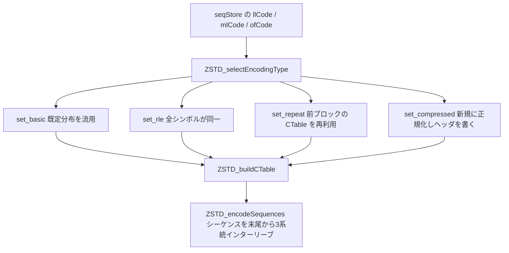

# 第14章 シーケンスの符号化

> **本章で読むソース**
>
> - [`lib/compress/zstd_compress_sequences.c`](https://github.com/facebook/zstd/blob/v1.5.7/lib/compress/zstd_compress_sequences.c)
> - [`lib/compress/zstd_compress_sequences.h`](https://github.com/facebook/zstd/blob/v1.5.7/lib/compress/zstd_compress_sequences.h)
> - [`lib/common/zstd_internal.h`](https://github.com/facebook/zstd/blob/v1.5.7/lib/common/zstd_internal.h)

## この章の狙い

第12章で見たとおり、ブロックの圧縮結果は seqStore にリテラルとシーケンスの列として溜まっている。
シーケンスは、リテラル長、マッチ長、オフセットという3つの数値の組であり、そのままでは1つあたり十数バイトを要する冗長な表現である。
本章では、この3系統の数値列を、それぞれ専用の **FSE** テーブルで圧縮し、1本のビットストリームへ交互に織り込んで出力する `zstd_compress_sequences.c` の実装を追う。

FSE テーブルの構築原理そのものは第7章で扱った。
本章の主題は、3つの独立した符号化テーブルを1ブロックぶんまとめて出力するために zstd が何を選択し、どう配置するかである。

## 前提

シーケンスは、seqStore の中では生の数値ではなく、あらかじめ**コード**（code）に変換された形で保持されている。
コードとは、値の大きさをおおまかな区分にまとめた小さい整数であり、区分の中でのずれは**追加ビット**（extra bits）として後から生のビット列で補う。
リテラル長とマッチ長のコードから追加ビット数を引く表が `LL_bits` と `ML_bits` であり、オフセットは区分の代わりにビット幅そのものをコードとして使う。

[`lib/common/zstd_internal.h` L119-134](https://github.com/facebook/zstd/blob/v1.5.7/lib/common/zstd_internal.h#L119-L134)

```c
static UNUSED_ATTR const U8 LL_bits[MaxLL+1] = {
     0, 0, 0, 0, 0, 0, 0, 0,
     0, 0, 0, 0, 0, 0, 0, 0,
     1, 1, 1, 1, 2, 2, 3, 3,
     4, 6, 7, 8, 9,10,11,12,
    13,14,15,16
};
static UNUSED_ATTR const S16 LL_defaultNorm[MaxLL+1] = {
     4, 3, 2, 2, 2, 2, 2, 2,
     2, 2, 2, 2, 2, 1, 1, 1,
     2, 2, 2, 2, 2, 2, 2, 2,
     2, 3, 2, 1, 1, 1, 1, 1,
    -1,-1,-1,-1
};
#define LL_DEFAULTNORMLOG 6  /* for static allocation */
static UNUSED_ATTR const U32 LL_defaultNormLog = LL_DEFAULTNORMLOG;
```

`LL_defaultNorm` は、リテラル長コードの**既定分布**である。
一般的な入力でリテラル長コードがどのくらいの頻度で出現するかを、あらかじめ実測値から作った正規化カウントとしてハードコードしてある。
同様の既定分布とビット幅表が、マッチ長には `ML_bits` と `ML_defaultNorm`、オフセットには `OF_defaultNorm` として用意されている。

[`lib/common/zstd_internal.h` L103-111](https://github.com/facebook/zstd/blob/v1.5.7/lib/common/zstd_internal.h#L103-L111)

```c
#define MaxML   52
#define MaxLL   35
#define DefaultMaxOff 28
#define MaxOff  31
#define MaxSeq MAX(MaxLL, MaxML)   /* Assumption : MaxOff < MaxLL,MaxML */
#define MLFSELog    9
#define LLFSELog    9
#define OffFSELog   8
#define MaxFSELog  MAX(MAX(MLFSELog, LLFSELog), OffFSELog)
```

リテラル長とマッチ長のテーブルは最大 `2^9` 状態、オフセットは最大 `2^8` 状態に制限される。
オフセットは値そのものが大きくばらつくため、状態数を絞ってテーブル構築とヘッダ出力のコストを抑えている。

3系統のコード化、符号化タイプ選択、テーブル出力、ビットストリーム出力という全体の流れは、次のようになる。



## 符号化タイプの選択：ZSTD_selectEncodingType

3つの数値列は、それぞれ独立に「どう符号化するか」を選ぶ。
選択肢は4種類あり、`SymbolEncodingType_e` という列挙型で表される。

[`lib/common/zstd_internal.h` L94](https://github.com/facebook/zstd/blob/v1.5.7/lib/common/zstd_internal.h#L94)

```c
typedef enum { set_basic, set_rle, set_compressed, set_repeat } SymbolEncodingType_e;
```

`set_basic` はコード内蔵の既定分布をそのまま使う方式、`set_rle` は全シンボルが同一値で1バイトだけ書けば済む方式、`set_repeat` は直前のブロックで使った CTable をそのまま使い回す方式、`set_compressed` はこのブロック専用に正規化カウントを計算してヘッダごと書き出す方式である。
`set_compressed` はこのブロックの分布から新しい CTable を構築するのに対し、`set_repeat` は直前のブロックの CTable をそのままコピーして使う（`ZSTD_buildCTable` は `set_repeat` のとき `ZSTD_memcpy(nextCTable, prevCTable, prevCTableSize)` して返す）。
このブロックの分布は `set_repeat` を採るかどうかのコスト見積もりには使われるが、repeat が使うテーブルそのものの生成元ではない。

まず全シンボルが1種類しかない特殊ケースを弾く。

[`lib/compress/zstd_compress_sequences.c` L166-178](https://github.com/facebook/zstd/blob/v1.5.7/lib/compress/zstd_compress_sequences.c#L166-L178)

```c
    if (mostFrequent == nbSeq) {
        *repeatMode = FSE_repeat_none;
        if (isDefaultAllowed && nbSeq <= 2) {
            /* Prefer set_basic over set_rle when there are 2 or fewer symbols,
             * since RLE uses 1 byte, but set_basic uses 5-6 bits per symbol.
             * If basic encoding isn't possible, always choose RLE.
             */
            DEBUGLOG(5, "Selected set_basic");
            return set_basic;
        }
        DEBUGLOG(5, "Selected set_rle");
        return set_rle;
    }
```

`mostFrequent == nbSeq` は、最頻出シンボルの出現回数がシーケンス総数と一致する、つまり全シーケンスが同じコード値を持つ場合である。
このときシンボルが2個以下のシーケンス数しかなければ、1バイトの `set_rle` よりも既定分布を1シンボルあたり5〜6ビットで使う `set_basic` の方が小さくなるため、あえて `set_basic` を選ぶ。

高速な圧縮レベル（`strategy < ZSTD_lazy`）では、コストを実測せずヒューリスティックで選ぶ。

[`lib/compress/zstd_compress_sequences.c` L179-204](https://github.com/facebook/zstd/blob/v1.5.7/lib/compress/zstd_compress_sequences.c#L179-L204)

```c
    if (strategy < ZSTD_lazy) {
        if (isDefaultAllowed) {
            size_t const staticFse_nbSeq_max = 1000;
            size_t const mult = 10 - strategy;
            size_t const baseLog = 3;
            size_t const dynamicFse_nbSeq_min = (((size_t)1 << defaultNormLog) * mult) >> baseLog;  /* 28-36 for offset, 56-72 for lengths */
            assert(defaultNormLog >= 5 && defaultNormLog <= 6);  /* xx_DEFAULTNORMLOG */
            assert(mult <= 9 && mult >= 7);
            if ( (*repeatMode == FSE_repeat_valid)
              && (nbSeq < staticFse_nbSeq_max) ) {
                DEBUGLOG(5, "Selected set_repeat");
                return set_repeat;
            }
            if ( (nbSeq < dynamicFse_nbSeq_min)
              || (mostFrequent < (nbSeq >> (defaultNormLog-1))) ) {
                DEBUGLOG(5, "Selected set_basic");
                /* The format allows default tables to be repeated, but it isn't useful.
                 * When using simple heuristics to select encoding type, we don't want
                 * to confuse these tables with dictionaries. When running more careful
                 * analysis, we don't need to waste time checking both repeating tables
                 * and default tables.
                 */
                *repeatMode = FSE_repeat_none;
                return set_basic;
            }
        }
    } else {
```

直前のブロックで有効な CTable があり（`FSE_repeat_valid`）シーケンス数が閾値未満なら、コストを測らずそのまま `set_repeat` を選ぶ。
それ以外でシーケンス数が少なすぎるか分布が偏りすぎている場合は `set_basic` に倒す。
どちらの条件にも合わなければ、後段で `set_compressed` を選ぶ。
高速ストラテジでは実測コストの計算そのものを避けることで、圧縮レベルが要求する速度を維持している。

一方、`ZSTD_lazy` 以上の高圧縮ストラテジでは、3方式それぞれのビット数を実際に見積もり、最小のものを選ぶ。

[`lib/compress/zstd_compress_sequences.c` L205-234](https://github.com/facebook/zstd/blob/v1.5.7/lib/compress/zstd_compress_sequences.c#L205-L234)

```c
    } else {
        size_t const basicCost = isDefaultAllowed ? ZSTD_crossEntropyCost(defaultNorm, defaultNormLog, count, max) : ERROR(GENERIC);
        size_t const repeatCost = *repeatMode != FSE_repeat_none ? ZSTD_fseBitCost(prevCTable, count, max) : ERROR(GENERIC);
        size_t const NCountCost = ZSTD_NCountCost(count, max, nbSeq, FSELog);
        size_t const compressedCost = (NCountCost << 3) + ZSTD_entropyCost(count, max, nbSeq);

        if (isDefaultAllowed) {
            assert(!ZSTD_isError(basicCost));
            assert(!(*repeatMode == FSE_repeat_valid && ZSTD_isError(repeatCost)));
        }
        assert(!ZSTD_isError(NCountCost));
        assert(compressedCost < ERROR(maxCode));
        DEBUGLOG(5, "Estimated bit costs: basic=%u\trepeat=%u\tcompressed=%u",
                    (unsigned)basicCost, (unsigned)repeatCost, (unsigned)compressedCost);
        if (basicCost <= repeatCost && basicCost <= compressedCost) {
            DEBUGLOG(5, "Selected set_basic");
            assert(isDefaultAllowed);
            *repeatMode = FSE_repeat_none;
            return set_basic;
        }
        if (repeatCost <= compressedCost) {
            DEBUGLOG(5, "Selected set_repeat");
            assert(!ZSTD_isError(repeatCost));
            return set_repeat;
        }
        assert(compressedCost < basicCost && compressedCost < repeatCost);
    }
```

`basicCost` は既定分布とこのブロックの実際の分布との**交差エントロピー**（cross entropy）、`repeatCost` は前ブロックの CTable をそのまま使ったときの実測ビット数、`compressedCost` は新規にヘッダを書いたときのヘッダサイズとエントロピーの合計である。
この3つを比較し、最小のものに対応する符号化タイプを選ぶ。
`set_repeat` を選べばヘッダを一切書かずに済むため、ブロック間で分布が変わらない区間ではヘッダ送出のコストをまるごと省くことができる。
これが、シーケンス符号化における最適化の核になる仕組みである。

コスト見積もりの中身は、`kInverseProbabilityLog256` という256エントリの固定小数点対数表を引くだけで済むように作られている。

[`lib/compress/zstd_compress_sequences.c` L84-98](https://github.com/facebook/zstd/blob/v1.5.7/lib/compress/zstd_compress_sequences.c#L84-L98)

```c
static size_t ZSTD_entropyCost(unsigned const* count, unsigned const max, size_t const total)
{
    unsigned cost = 0;
    unsigned s;

    assert(total > 0);
    for (s = 0; s <= max; ++s) {
        unsigned norm = (unsigned)((256 * count[s]) / total);
        if (count[s] != 0 && norm == 0)
            norm = 1;
        assert(count[s] < total);
        cost += count[s] * kInverseProbabilityLog256[norm];
    }
    return cost >> 8;
}
```

`kInverseProbabilityLog256[x]` は `-log2(x/256)` を256倍し整数に丸めた値であり、`-log2(p)` という対数計算そのものを実行時に呼ばずに、頻度から確率を求めて表引きするだけでシンボルあたりのビット数を近似する。
`ZSTD_fseBitCost` と `ZSTD_crossEntropyCost` も、それぞれ既存の CTable や既定分布から同じ考え方でコストを積算する。
高圧縮ストラテジでもコスト見積もり自体は表引きと乗算だけで完結させ、除算や対数関数の呼び出しをこの経路に持ち込まないことが、実測比較を採用しても速度低下を抑える理由である。

## ヘッダ出力：ZSTD_buildCTable と ZSTD_NCountCost

符号化タイプが決まれば、実際のヘッダとテーブルを出力する。
`ZSTD_buildCTable` は4種類のタイプそれぞれに応じた分岐を持つ。

[`lib/compress/zstd_compress_sequences.c` L254-288](https://github.com/facebook/zstd/blob/v1.5.7/lib/compress/zstd_compress_sequences.c#L254-L288)

```c
    switch (type) {
    case set_rle:
        FORWARD_IF_ERROR(FSE_buildCTable_rle(nextCTable, (BYTE)max), "");
        RETURN_ERROR_IF(dstCapacity==0, dstSize_tooSmall, "not enough space");
        *op = codeTable[0];
        return 1;
    case set_repeat:
        ZSTD_memcpy(nextCTable, prevCTable, prevCTableSize);
        return 0;
    case set_basic:
        FORWARD_IF_ERROR(FSE_buildCTable_wksp(nextCTable, defaultNorm, defaultMax, defaultNormLog, entropyWorkspace, entropyWorkspaceSize), "");  /* note : could be pre-calculated */
        return 0;
    case set_compressed: {
        ZSTD_BuildCTableWksp* wksp = (ZSTD_BuildCTableWksp*)entropyWorkspace;
        size_t nbSeq_1 = nbSeq;
        const U32 tableLog = FSE_optimalTableLog(FSELog, nbSeq, max);
        if (count[codeTable[nbSeq-1]] > 1) {
            count[codeTable[nbSeq-1]]--;
            nbSeq_1--;
        }
        assert(nbSeq_1 > 1);
        assert(entropyWorkspaceSize >= sizeof(ZSTD_BuildCTableWksp));
        (void)entropyWorkspaceSize;
        FORWARD_IF_ERROR(FSE_normalizeCount(wksp->norm, tableLog, count, nbSeq_1, max, ZSTD_useLowProbCount(nbSeq_1)), "FSE_normalizeCount failed");
        assert(oend >= op);
        {   size_t const NCountSize = FSE_writeNCount(op, (size_t)(oend - op), wksp->norm, max, tableLog);   /* overflow protected */
            FORWARD_IF_ERROR(NCountSize, "FSE_writeNCount failed");
            FORWARD_IF_ERROR(FSE_buildCTable_wksp(nextCTable, wksp->norm, max, tableLog, wksp->wksp, sizeof(wksp->wksp)), "FSE_buildCTable_wksp failed");
            return NCountSize;
        }
    }
    default: assert(0); RETURN_ERROR(GENERIC, "impossible to reach");
    }
```

`set_repeat` は CTable を丸ごと `memcpy` するだけで、出力バイト数は0である。
`set_basic` も既定分布から CTable を構築するだけで、こちらもヘッダを出力しない。
ヘッダを書くのは `set_compressed` だけであり、`FSE_normalizeCount` で正規化してから `FSE_writeNCount` でヘッダに書き出し、`FSE_buildCTable_wksp` で符号化用のテーブルに変換する（この2関数は第7章で扱った）。
`count[codeTable[nbSeq-1]]` を1減らしてから正規化する行は、最後のシーケンスの初期状態設定に使う分を頻度計上から除くための調整であり、`ZSTD_encodeSequences_body` が最終シンボルを別扱いすることに対応している。

`ZSTD_selectEncodingType` がコスト比較に使う `ZSTD_NCountCost` も、実際に `FSE_normalizeCount` と `FSE_writeNCount` を1回実行してヘッダサイズを測るだけの単純な関数である。

[`lib/compress/zstd_compress_sequences.c` L70-78](https://github.com/facebook/zstd/blob/v1.5.7/lib/compress/zstd_compress_sequences.c#L70-L78)

```c
static size_t ZSTD_NCountCost(unsigned const* count, unsigned const max,
                              size_t const nbSeq, unsigned const FSELog)
{
    BYTE wksp[FSE_NCOUNTBOUND];
    S16 norm[MaxSeq + 1];
    const U32 tableLog = FSE_optimalTableLog(FSELog, nbSeq, max);
    FORWARD_IF_ERROR(FSE_normalizeCount(norm, tableLog, count, nbSeq, max, ZSTD_useLowProbCount(nbSeq)), "FSE_normalizeCount failed");
    return FSE_writeNCount(wksp, sizeof(wksp), norm, max, tableLog);
}
```

3系統ぶんの `ZSTD_buildCTable` 呼び出しは `ZSTD_buildSequencesStatistics`（`zstd_compress.c`）が順に行い、リテラル長、オフセット、マッチ長の3つのタイプ値を1バイトの**シーケンスヘッダ**にまとめる。
`(LLtype<<6) + (Offtype<<4) + (MLtype<<2)` という配置により、復号側はこの1バイトを見るだけで3系統それぞれの符号化タイプを判定できる。

## ビットストリーム出力：ZSTD_encodeSequences_body

CTable が3本そろえば、`ZSTD_encodeSequences_body` が実際のビットストリームを生成する。
FSE の符号化は第7章で見たとおり末尾から先頭へ向かって進むため、シーケンス列も末尾側から処理する。

[`lib/compress/zstd_compress_sequences.c` L310-330](https://github.com/facebook/zstd/blob/v1.5.7/lib/compress/zstd_compress_sequences.c#L310-L330)

```c
    /* first symbols */
    FSE_initCState2(&stateMatchLength, CTable_MatchLength, mlCodeTable[nbSeq-1]);
    FSE_initCState2(&stateOffsetBits,  CTable_OffsetBits,  ofCodeTable[nbSeq-1]);
    FSE_initCState2(&stateLitLength,   CTable_LitLength,   llCodeTable[nbSeq-1]);
    BIT_addBits(&blockStream, sequences[nbSeq-1].litLength, LL_bits[llCodeTable[nbSeq-1]]);
    if (MEM_32bits()) BIT_flushBits(&blockStream);
    BIT_addBits(&blockStream, sequences[nbSeq-1].mlBase, ML_bits[mlCodeTable[nbSeq-1]]);
    if (MEM_32bits()) BIT_flushBits(&blockStream);
    if (longOffsets) {
        U32 const ofBits = ofCodeTable[nbSeq-1];
        unsigned const extraBits = ofBits - MIN(ofBits, STREAM_ACCUMULATOR_MIN-1);
        if (extraBits) {
            BIT_addBits(&blockStream, sequences[nbSeq-1].offBase, extraBits);
            BIT_flushBits(&blockStream);
        }
        BIT_addBits(&blockStream, sequences[nbSeq-1].offBase >> extraBits,
                    ofBits - extraBits);
    } else {
        BIT_addBits(&blockStream, sequences[nbSeq-1].offBase, ofCodeTable[nbSeq-1]);
    }
    BIT_flushBits(&blockStream);
```

最後のシーケンス（配列末尾）だけを特別扱いし、3系統の FSE 状態 `stateMatchLength`、`stateOffsetBits`、`stateLitLength` をそのシーケンスのコード値で初期化してから、追加ビット分の生データをそのまま出力する。
オフセットのコードは「ビット幅そのもの」であるため、`ofBits` が大きい場合は一度に `BIT_addBits` で出し切れないことがあり、`longOffsets` が真のときは追加ビットを2回に分けて出力する。

残りのシーケンスは、末尾から先頭に向かうループで3系統をインターリーブしながら処理する。

[`lib/compress/zstd_compress_sequences.c` L332-369](https://github.com/facebook/zstd/blob/v1.5.7/lib/compress/zstd_compress_sequences.c#L332-L369)

```c
    {   size_t n;
        for (n=nbSeq-2 ; n<nbSeq ; n--) {      /* intentional underflow */
            BYTE const llCode = llCodeTable[n];
            BYTE const ofCode = ofCodeTable[n];
            BYTE const mlCode = mlCodeTable[n];
            U32  const llBits = LL_bits[llCode];
            U32  const ofBits = ofCode;
            U32  const mlBits = ML_bits[mlCode];
            DEBUGLOG(6, "encoding: litlen:%2u - matchlen:%2u - offCode:%7u",
                        (unsigned)sequences[n].litLength,
                        (unsigned)sequences[n].mlBase + MINMATCH,
                        (unsigned)sequences[n].offBase);
                                                                            /* 32b*/  /* 64b*/
                                                                            /* (7)*/  /* (7)*/
            FSE_encodeSymbol(&blockStream, &stateOffsetBits, ofCode);       /* 15 */  /* 15 */
            FSE_encodeSymbol(&blockStream, &stateMatchLength, mlCode);      /* 24 */  /* 24 */
            if (MEM_32bits()) BIT_flushBits(&blockStream);                  /* (7)*/
            FSE_encodeSymbol(&blockStream, &stateLitLength, llCode);        /* 16 */  /* 33 */
            if (MEM_32bits() || (ofBits+mlBits+llBits >= 64-7-(LLFSELog+MLFSELog+OffFSELog)))
                BIT_flushBits(&blockStream);                                /* (7)*/
            BIT_addBits(&blockStream, sequences[n].litLength, llBits);
            if (MEM_32bits() && ((llBits+mlBits)>24)) BIT_flushBits(&blockStream);
            BIT_addBits(&blockStream, sequences[n].mlBase, mlBits);
            if (MEM_32bits() || (ofBits+mlBits+llBits > 56)) BIT_flushBits(&blockStream);
            if (longOffsets) {
                unsigned const extraBits = ofBits - MIN(ofBits, STREAM_ACCUMULATOR_MIN-1);
                if (extraBits) {
                    BIT_addBits(&blockStream, sequences[n].offBase, extraBits);
                    BIT_flushBits(&blockStream);                            /* (7)*/
                }
                BIT_addBits(&blockStream, sequences[n].offBase >> extraBits,
                            ofBits - extraBits);                            /* 31 */
            } else {
                BIT_addBits(&blockStream, sequences[n].offBase, ofBits);     /* 31 */
            }
            BIT_flushBits(&blockStream);                                    /* (7)*/
            DEBUGLOG(7, "remaining space : %i", (int)(blockStream.endPtr - blockStream.ptr));
    }   }
```

`for (n=nbSeq-2 ; n<nbSeq ; n--)` は、`n` が符号なし整数であることを利用して `n==0` の次の減算でオーバーフローさせ、ループを終了させている（コード中の "intentional underflow" というコメントが示すとおりである）。
ループ本体は、オフセット、マッチ長、リテラル長の順で `FSE_encodeSymbol` を呼び、各シンボルの状態遷移で決まったビット数だけコード自体を出力したあと、`LL_bits`、`ML_bits`、オフセットのビット幅ぶんの追加ビットを生データとしてそのまま出力する。
コメントに書かれた `/* 15 */` `/* 24 */` 等の数値は、64ビットアキュムレータを使う環境でその時点までに溜まる最大ビット数の見積もりであり、`BIT_flushBits` を呼ぶタイミングをアキュムレータの溢れる直前まで遅らせるための根拠になっている。
32ビット環境ではアキュムレータが小さいぶん `MEM_32bits()` の条件が真になり、`FSE_encodeSymbol` を1回呼ぶたびにフラッシュする。

すべてのシーケンスを処理し終えたら、3本の状態を `FSE_flushCState` で書き出して締めくくる。

[`lib/compress/zstd_compress_sequences.c` L371-381](https://github.com/facebook/zstd/blob/v1.5.7/lib/compress/zstd_compress_sequences.c#L371-L381)

```c
    DEBUGLOG(6, "ZSTD_encodeSequences: flushing ML state with %u bits", stateMatchLength.stateLog);
    FSE_flushCState(&blockStream, &stateMatchLength);
    DEBUGLOG(6, "ZSTD_encodeSequences: flushing Off state with %u bits", stateOffsetBits.stateLog);
    FSE_flushCState(&blockStream, &stateOffsetBits);
    DEBUGLOG(6, "ZSTD_encodeSequences: flushing LL state with %u bits", stateLitLength.stateLog);
    FSE_flushCState(&blockStream, &stateLitLength);

    {   size_t const streamSize = BIT_closeCStream(&blockStream);
        RETURN_ERROR_IF(streamSize==0, dstSize_tooSmall, "not enough space");
        return streamSize;
    }
```

3本の状態値をこの順で書き出すのは、復号側が先頭から読むときに `LL` → `Off` → `ML` の順で初期状態を復元する必要があるためであり、第7章で見た「符号化は末尾から、復号は先頭から」という LIFO の関係を、3系統ぶん束ねて再現している（復号側の詳細は第23章で扱う）。

## まとめ

シーケンスの符号化は、リテラル長、オフセット、マッチ長という3系統それぞれについて、`ZSTD_selectEncodingType` が既定分布、RLE、前ブロック再利用、新規構築の4方式からコストの低いものを選ぶところから始まる。
高圧縮ストラテジでは `ZSTD_fseBitCost` と `ZSTD_crossEntropyCost` による実測見積もりで最小コストの方式を選び、`set_repeat` を選べた区間ではヘッダ送出そのものを省く。
`ZSTD_buildCTable` が選ばれた方式に応じて CTable を用意し、`set_compressed` のときだけ正規化カウントをヘッダに書く。
最後に `ZSTD_encodeSequences_body` が、3本の FSE 状態をデータの末尾から先頭へ向けて交互に更新しながら、コードの状態遷移と追加ビットの生データをインターリーブしてビットストリームに書き出す。

## 関連する章

- [第7章 FSE 符号化：正規化カウントと状態遷移テーブル](../part02-entropy/07-fse-compress.md)
- [第12章 seqStore とブロック分割の流れ](12-seqstore-blockflow.md)
- [第13章 リテラルの符号化](13-literals-encoding.md)
- [第23章 ブロックの復号](../part06-decompress/23-decompress-block.md)
