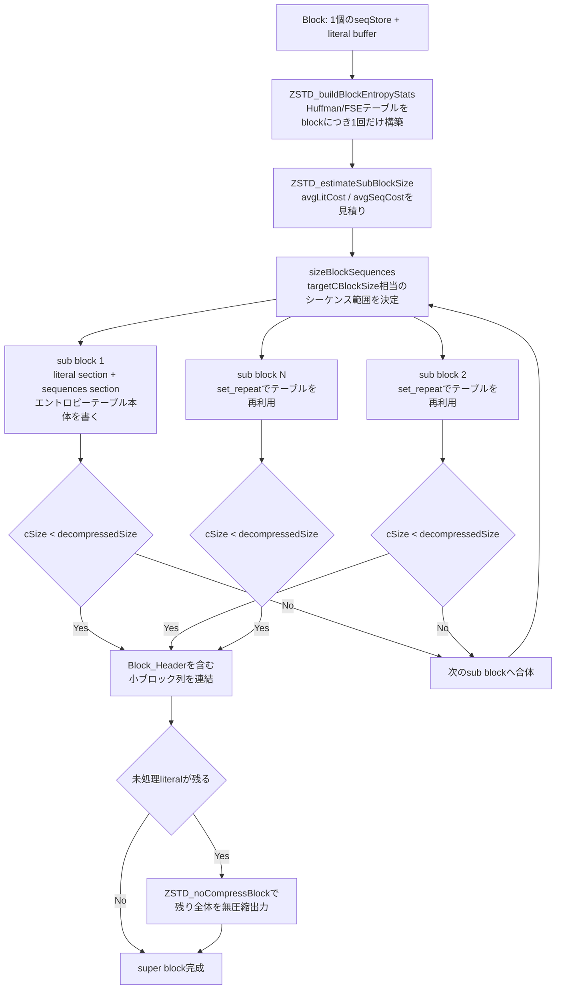

# 第15章 Super Block：小ブロック分割と最小サイズ保証

> **本章で読むソース**
>
> - [`lib/compress/zstd_compress_superblock.c`](https://github.com/facebook/zstd/blob/v1.5.7/lib/compress/zstd_compress_superblock.c)
> - [`lib/compress/zstd_compress_superblock.h`](https://github.com/facebook/zstd/blob/v1.5.7/lib/compress/zstd_compress_superblock.h)

## この章の狙い

第12章で見た `ZSTD_compressBlock` は、1個の block を丸ごと1個の圧縮ブロックとして出力する。
しかし `ZSTD_c_targetCBlockSize` パラメータを使うと、圧縮側は1個の block を複数の小さなブロックに分割して出力できる。

この分割単位を**super block**と呼ぶ。
super block は入力側では通常の block と同じ1個のまとまりだが、出力側では複数の `Block_Header` を持つ小ブロック列になる。
本章では、この分割がどのような見積りで行われ、どうやって圧縮率を落とさずに済ませているかを読む。

## 前提

`ZSTD_c_targetCBlockSize` は圧縮ブロックのおおよその目標サイズをバイト数で指定するパラメータであり、下限は `ZSTD_TARGETCBLOCKSIZE_MIN`（1340バイト）である。

[`lib/zstd.h` L1305](https://github.com/facebook/zstd/blob/v1.5.7/lib/zstd.h#L1305-L1305)

```c
#define ZSTD_TARGETCBLOCKSIZE_MIN   1340 /* suitable to fit into an ethernet / wifi / 4G transport frame */
```

コメントにある通り、1340バイトはイーサネットや Wi-Fi、4G のパケットに収まるサイズである。
ストリームを小さなパケット単位の出力にそろえておくと、送信側は1パケット分のデータがそろい次第すぐに送り出せる。
block 全体の圧縮完了を待ってから送信するより、ネットワーク越しの配信で低レイテンシを狙える。

呼び出し元は `ZSTD_compressBlock_targetCBlockSize_body` である。

[`lib/compress/zstd_compress.c` L4449-L4468](https://github.com/facebook/zstd/blob/v1.5.7/lib/compress/zstd_compress.c#L4449-L4468)

```c
static size_t ZSTD_compressBlock_targetCBlockSize_body(ZSTD_CCtx* zc,
                               void* dst, size_t dstCapacity,
                               const void* src, size_t srcSize,
                               const size_t bss, U32 lastBlock)
{
    DEBUGLOG(6, "Attempting ZSTD_compressSuperBlock()");
    if (bss == ZSTDbss_compress) {
        if (/* We don't want to emit our first block as a RLE even if it qualifies because
            * doing so will cause the decoder (cli only) to throw a "should consume all input error."
            * This is only an issue for zstd <= v1.4.3
            */
            !zc->isFirstBlock &&
            ZSTD_maybeRLE(&zc->seqStore) &&
            ZSTD_isRLE((BYTE const*)src, srcSize))
        {
            return ZSTD_rleCompressBlock(dst, dstCapacity, *(BYTE const*)src, srcSize, lastBlock);
        }
```

`ZSTD_c_targetCBlockSize` が設定されている場合、block 圧縮は通常経路 `ZSTD_compressBlock_internal` ではなくこちらの経路を通る。
入力全体が RLE で表現できる特殊ケースを除けば、`ZSTD_compressSuperBlock` に処理を委ねる。

## `ZSTD_compressSuperBlock`：seqStore からエントロピーテーブルを1度だけ作る

`ZSTD_compressSuperBlock` 自体はごく短い。

[`lib/compress/zstd_compress_superblock.c` L665-L688](https://github.com/facebook/zstd/blob/v1.5.7/lib/compress/zstd_compress_superblock.c#L665-L688)

```c
size_t ZSTD_compressSuperBlock(ZSTD_CCtx* zc,
                               void* dst, size_t dstCapacity,
                               const void* src, size_t srcSize,
                               unsigned lastBlock)
{
    ZSTD_entropyCTablesMetadata_t entropyMetadata;

    FORWARD_IF_ERROR(ZSTD_buildBlockEntropyStats(&zc->seqStore,
          &zc->blockState.prevCBlock->entropy,
          &zc->blockState.nextCBlock->entropy,
          &zc->appliedParams,
          &entropyMetadata,
          zc->tmpWorkspace, zc->tmpWkspSize /* statically allocated in resetCCtx */), "");

    return ZSTD_compressSubBlock_multi(&zc->seqStore,
            zc->blockState.prevCBlock,
            zc->blockState.nextCBlock,
            &entropyMetadata,
            &zc->appliedParams,
            dst, dstCapacity,
            src, srcSize,
            zc->bmi2, lastBlock,
            zc->tmpWorkspace, zc->tmpWkspSize /* statically allocated in resetCCtx */);
}
```

`ZSTD_buildBlockEntropyStats` は第13章、第14章で見た Huffman テーブルと FSE テーブルを、block 全体の literal と sequence から1回だけ構築する。
つまり super block を何個の小ブロックに割っても、Huffman テーブルと FSE テーブルは block あたり1組しか作らない。
分割の主体は後段の `ZSTD_compressSubBlock_multi` であり、この関数は「どこで区切るか」と「テーブルをどう使い回すか」だけを決める。

## sub block の内部構造：literal section と sequences section

1個の sub block は、通常の block と同じく literal section と sequences section を持ち、先頭に3バイトの `Block_Header` を持つ。
組み立てるのは `ZSTD_compressSubBlock` である。

[`lib/compress/zstd_compress_superblock.c` L263-L305](https://github.com/facebook/zstd/blob/v1.5.7/lib/compress/zstd_compress_superblock.c#L263-L305)

```c
static size_t ZSTD_compressSubBlock(const ZSTD_entropyCTables_t* entropy,
                                    const ZSTD_entropyCTablesMetadata_t* entropyMetadata,
                                    const SeqDef* sequences, size_t nbSeq,
                                    const BYTE* literals, size_t litSize,
                                    const BYTE* llCode, const BYTE* mlCode, const BYTE* ofCode,
                                    const ZSTD_CCtx_params* cctxParams,
                                    void* dst, size_t dstCapacity,
                                    const int bmi2,
                                    int writeLitEntropy, int writeSeqEntropy,
                                    int* litEntropyWritten, int* seqEntropyWritten,
                                    U32 lastBlock)
{
    BYTE* const ostart = (BYTE*)dst;
    BYTE* const oend = ostart + dstCapacity;
    BYTE* op = ostart + ZSTD_blockHeaderSize;
    DEBUGLOG(5, "ZSTD_compressSubBlock (litSize=%zu, nbSeq=%zu, writeLitEntropy=%d, writeSeqEntropy=%d, lastBlock=%d)",
                litSize, nbSeq, writeLitEntropy, writeSeqEntropy, lastBlock);
    {   size_t cLitSize = ZSTD_compressSubBlock_literal((const HUF_CElt*)entropy->huf.CTable,
                                                        &entropyMetadata->hufMetadata, literals, litSize,
                                                        op, (size_t)(oend-op),
                                                        bmi2, writeLitEntropy, litEntropyWritten);
        FORWARD_IF_ERROR(cLitSize, "ZSTD_compressSubBlock_literal failed");
        if (cLitSize == 0) return 0;
        op += cLitSize;
    }
    {   size_t cSeqSize = ZSTD_compressSubBlock_sequences(&entropy->fse,
                                                  &entropyMetadata->fseMetadata,
                                                  sequences, nbSeq,
                                                  llCode, mlCode, ofCode,
                                                  cctxParams,
                                                  op, (size_t)(oend-op),
                                                  bmi2, writeSeqEntropy, seqEntropyWritten);
        FORWARD_IF_ERROR(cSeqSize, "ZSTD_compressSubBlock_sequences failed");
        if (cSeqSize == 0) return 0;
        op += cSeqSize;
    }
    /* Write block header */
    {   size_t cSize = (size_t)(op-ostart) - ZSTD_blockHeaderSize;
        U32 const cBlockHeader24 = lastBlock + (((U32)bt_compressed)<<1) + (U32)(cSize << 3);
        MEM_writeLE24(ostart, cBlockHeader24);
    }
    return (size_t)(op-ostart);
}
```

`writeLitEntropy` / `writeSeqEntropy` が、この sub block でエントロピーテーブルを書くかどうかを決める引数である。
`ZSTD_compressSubBlock_literal` と `ZSTD_compressSubBlock_sequences` は、この引数が真の場合だけテーブル本体（Huffman 記述子や FSE テーブル記述）を出力に含め、偽の場合は `set_repeat`（前の sub block のテーブルを再利用する指定）で符号化する。

[`lib/compress/zstd_compress_superblock.c` L198-L209](https://github.com/facebook/zstd/blob/v1.5.7/lib/compress/zstd_compress_superblock.c#L198-L209)

```c
    if (writeEntropy) {
        const U32 LLtype = fseMetadata->llType;
        const U32 Offtype = fseMetadata->ofType;
        const U32 MLtype = fseMetadata->mlType;
        DEBUGLOG(5, "ZSTD_compressSubBlock_sequences (fseTablesSize=%zu)", fseMetadata->fseTablesSize);
        *seqHead = (BYTE)((LLtype<<6) + (Offtype<<4) + (MLtype<<2));
        ZSTD_memcpy(op, fseMetadata->fseTablesBuffer, fseMetadata->fseTablesSize);
        op += fseMetadata->fseTablesSize;
    } else {
        const U32 repeat = set_repeat;
        *seqHead = (BYTE)((repeat<<6) + (repeat<<4) + (repeat<<2));
    }
```

literal 側も同じ発想である。
`ZSTD_compressSubBlock_literal` は `writeEntropy` が偽のとき `hType` を `set_repeat` に固定し、Huffman テーブル記述子（`hufMetadata->hufDesBuffer`）を出力せずに、直前の sub block で確定した木をそのまま使い続ける。

[`lib/compress/zstd_compress_superblock.c` L41-L54](https://github.com/facebook/zstd/blob/v1.5.7/lib/compress/zstd_compress_superblock.c#L41-L54)

```c
static size_t
ZSTD_compressSubBlock_literal(const HUF_CElt* hufTable,
                              const ZSTD_hufCTablesMetadata_t* hufMetadata,
                              const BYTE* literals, size_t litSize,
                              void* dst, size_t dstSize,
                              const int bmi2, int writeEntropy, int* entropyWritten)
{
    size_t const header = writeEntropy ? 200 : 0;
    size_t const lhSize = 3 + (litSize >= (1 KB - header)) + (litSize >= (16 KB - header));
    BYTE* const ostart = (BYTE*)dst;
    BYTE* const oend = ostart + dstSize;
    BYTE* op = ostart + lhSize;
    U32 const singleStream = lhSize == 3;
    SymbolEncodingType_e hType = writeEntropy ? hufMetadata->hType : set_repeat;
    size_t cLitSize = 0;
```

`ZSTD_compressSubBlock_multi` は、`writeLitEntropy` と `writeSeqEntropy` を true で開始し、実際にテーブルを書き込めた sub block（`*entropyWritten` が真になった sub block）が現れた時点でそれぞれを false に落とす。
これ以降の sub block はすべて `set_repeat` で符号化される。

[`lib/compress/zstd_compress_superblock.c` L572-L578](https://github.com/facebook/zstd/blob/v1.5.7/lib/compress/zstd_compress_superblock.c#L572-L578)

```c
                    /* Entropy only needs to be written once */
                    if (litEntropyWritten) {
                        writeLitEntropy = 0;
                    }
                    if (seqEntropyWritten) {
                        writeSeqEntropy = 0;
                    }
```

1個の block を N 個の sub block に分けても、Huffman テーブルと FSE テーブルの記述は先頭の sub block にしか現れない。
分割数を増やしても、テーブル分のオーバーヘッドは重複しない。

## 分割点の見積り：`ZSTD_estimateSubBlockSize` と `sizeBlockSequences`

分割数と分割点を決めるには、圧縮前に「literal と sequence がどれくらいのサイズに収まるか」を見積もる必要がある。
これを担うのが `ZSTD_estimateSubBlockSize` である。

[`lib/compress/zstd_compress_superblock.c` L397-L416](https://github.com/facebook/zstd/blob/v1.5.7/lib/compress/zstd_compress_superblock.c#L397-L416)

```c
static EstimatedBlockSize ZSTD_estimateSubBlockSize(const BYTE* literals, size_t litSize,
                                        const BYTE* ofCodeTable,
                                        const BYTE* llCodeTable,
                                        const BYTE* mlCodeTable,
                                        size_t nbSeq,
                                        const ZSTD_entropyCTables_t* entropy,
                                        const ZSTD_entropyCTablesMetadata_t* entropyMetadata,
                                        void* workspace, size_t wkspSize,
                                        int writeLitEntropy, int writeSeqEntropy)
{
    EstimatedBlockSize ebs;
    ebs.estLitSize = ZSTD_estimateSubBlockSize_literal(literals, litSize,
                                                        &entropy->huf, &entropyMetadata->hufMetadata,
                                                        workspace, wkspSize, writeLitEntropy);
    ebs.estBlockSize = ZSTD_estimateSubBlockSize_sequences(ofCodeTable, llCodeTable, mlCodeTable,
                                                         nbSeq, &entropy->fse, &entropyMetadata->fseMetadata,
                                                         workspace, wkspSize, writeSeqEntropy);
    ebs.estBlockSize += ebs.estLitSize + ZSTD_blockHeaderSize;
    return ebs;
}
```

literal 側の見積りは、確定済みの Huffman テーブルに対するシンボル出現頻度から `HUF_estimateCompressedSize` で符号長を積算する。
sequence 側は各シンボル列のヒストグラムを取り、FSE テーブルのビットコスト（`ZSTD_fseBitCost`）とシンボルごとの追加ビット（`LL_bits` などのテーブル）を足し合わせる。
どちらも実際にビットストリームへ符号化するわけではなく、確率テーブルから期待符号長を計算するだけなので高速である。

この見積り結果から、`ZSTD_compressSubBlock_multi` は block 全体の推定サイズ `ebs.estBlockSize` を `targetCBlockSize` で割って sub block 数の目安を決める。

[`lib/compress/zstd_compress_superblock.c` L513-L532](https://github.com/facebook/zstd/blob/v1.5.7/lib/compress/zstd_compress_superblock.c#L513-L532)

```c
        /* let's start by a general estimation for the full block */
    if (nbSeqs > 0) {
        EstimatedBlockSize const ebs =
                ZSTD_estimateSubBlockSize(lp, nbLiterals,
                                        ofCodePtr, llCodePtr, mlCodePtr, nbSeqs,
                                        &nextCBlock->entropy, entropyMetadata,
                                        workspace, wkspSize,
                                        writeLitEntropy, writeSeqEntropy);
        /* quick estimation */
        size_t const avgLitCost = nbLiterals ? (ebs.estLitSize * BYTESCALE) / nbLiterals : BYTESCALE;
        size_t const avgSeqCost = ((ebs.estBlockSize - ebs.estLitSize) * BYTESCALE) / nbSeqs;
        const size_t nbSubBlocks = MAX((ebs.estBlockSize + (targetCBlockSize/2)) / targetCBlockSize, 1);
        size_t n, avgBlockBudget, blockBudgetSupp=0;
        avgBlockBudget = (ebs.estBlockSize * BYTESCALE) / nbSubBlocks;
        DEBUGLOG(5, "estimated fullblock size=%u bytes ; avgLitCost=%.2f ; avgSeqCost=%.2f ; targetCBlockSize=%u, nbSubBlocks=%u ; avgBlockBudget=%.0f bytes",
                    (unsigned)ebs.estBlockSize, (double)avgLitCost/BYTESCALE, (double)avgSeqCost/BYTESCALE,
                    (unsigned)targetCBlockSize, (unsigned)nbSubBlocks, (double)avgBlockBudget/BYTESCALE);
        /* simplification: if estimates states that the full superblock doesn't compress, just bail out immediately
         * this will result in the production of a single uncompressed block covering @srcSize.*/
        if (ebs.estBlockSize > srcSize) return 0;
```

1シーケンスあたりの平均コスト `avgSeqCost` と、1バイトの literal あたりの平均コスト `avgLitCost` を `BYTESCALE`（256）倍の固定小数点で持ち、sub block ごとの予算 `avgBlockBudget` をシーケンス単位で消費していく。
この予算消費を行うのが `sizeBlockSequences` である。

[`lib/compress/zstd_compress_superblock.c` L442-L470](https://github.com/facebook/zstd/blob/v1.5.7/lib/compress/zstd_compress_superblock.c#L442-L470)

```c
static size_t sizeBlockSequences(const SeqDef* sp, size_t nbSeqs,
                size_t targetBudget, size_t avgLitCost, size_t avgSeqCost,
                int firstSubBlock)
{
    size_t n, budget = 0, inSize=0;
    /* entropy headers */
    size_t const headerSize = (size_t)firstSubBlock * 120 * BYTESCALE; /* generous estimate */
    assert(firstSubBlock==0 || firstSubBlock==1);
    budget += headerSize;

    /* first sequence => at least one sequence*/
    budget += sp[0].litLength * avgLitCost + avgSeqCost;
    if (budget > targetBudget) return 1;
    inSize = sp[0].litLength + (sp[0].mlBase+MINMATCH);

    /* loop over sequences */
    for (n=1; n<nbSeqs; n++) {
        size_t currentCost = sp[n].litLength * avgLitCost + avgSeqCost;
        budget += currentCost;
        inSize += sp[n].litLength + (sp[n].mlBase+MINMATCH);
        /* stop when sub-block budget is reached */
        if ( (budget > targetBudget)
            /* though continue to expand until the sub-block is deemed compressible */
          && (budget < inSize * BYTESCALE) )
            break;
        }

    return n;
}
```

先頭の sub block だけ `headerSize` として120バイト相当を予算に上乗せする。
エントロピーテーブルを書く sub block はヘッダ分だけ余計にサイズを消費するため、その分だけ後続シーケンスを詰め込む余地を減らして帳尻を合わせる。

ループの終了条件は単純な予算超過ではない。
`budget > targetBudget` かつ `budget < inSize * BYTESCALE`、つまり「予算は超えたが、まだ見積り上は入力サイズより小さく収まっている」場合に打ち切る。
逆に見積りが入力サイズに追いつかれてしまった場合は、圧縮効果が出ない疑いがあるとみなし、予算を超えていてもシーケンスを取り込み続ける。
これによって、圧縮できない見込みの小さな sub block を無理に切り出すことを避けている。

## 実際の圧縮とフォールバック：見積りと現実のずれをどう吸収するか

見積りはあくまで期待値であり、実際に Huffman と FSE で符号化した結果とは一致しない。
`ZSTD_compressSubBlock_multi` は、見積りに基づいて区切ったシーケンス範囲を実際に `ZSTD_compressSubBlock` で圧縮し、結果が入力サイズより小さくなった場合だけその sub block を確定する。

[`lib/compress/zstd_compress_superblock.c` L544-L582](https://github.com/facebook/zstd/blob/v1.5.7/lib/compress/zstd_compress_superblock.c#L544-L582)

```c
            {   int litEntropyWritten = 0;
                int seqEntropyWritten = 0;
                size_t litSize = countLiterals(seqStorePtr, sp, seqCount);
                const size_t decompressedSize =
                        ZSTD_seqDecompressedSize(seqStorePtr, sp, seqCount, litSize, 0);
                size_t const cSize = ZSTD_compressSubBlock(&nextCBlock->entropy, entropyMetadata,
                                                sp, seqCount,
                                                lp, litSize,
                                                llCodePtr, mlCodePtr, ofCodePtr,
                                                cctxParams,
                                                op, (size_t)(oend-op),
                                                bmi2, writeLitEntropy, writeSeqEntropy,
                                                &litEntropyWritten, &seqEntropyWritten,
                                                0);
                FORWARD_IF_ERROR(cSize, "ZSTD_compressSubBlock failed");

                /* check compressibility, update state components */
                if (cSize > 0 && cSize < decompressedSize) {
                    DEBUGLOG(5, "Committed sub-block compressing %u bytes => %u bytes",
                                (unsigned)decompressedSize, (unsigned)cSize);
                    assert(ip + decompressedSize <= iend);
                    ip += decompressedSize;
                    lp += litSize;
                    op += cSize;
                    llCodePtr += seqCount;
                    mlCodePtr += seqCount;
                    ofCodePtr += seqCount;
                    /* Entropy only needs to be written once */
                    if (litEntropyWritten) {
                        writeLitEntropy = 0;
                    }
                    if (seqEntropyWritten) {
                        writeSeqEntropy = 0;
                    }
                    sp += seqCount;
                    blockBudgetSupp = 0;
            }   }
            /* otherwise : do not compress yet, coalesce current sub-block with following one */
```

`cSize < decompressedSize` を満たせなかった場合、ポインタ（`sp`、`lp`、`llCodePtr` など）はいずれも進めない。
コメント通り、このシーケンス範囲は次の sub block と合体（coalesce）され、次のループでもう一度まとめて圧縮が試される。
分割見積りが外れても、そのシーケンス範囲を捨てるのではなく次の候補に繰り込むことで、圧縮できない小さな断片を無理に単独ブロックとして出力しない。

最後に残ったシーケンスは、ループとは別に「最後の sub block」として処理される。
最後の一塊も同様に、圧縮結果が入力サイズを下回った場合だけ採用される。

[`lib/compress/zstd_compress_superblock.c` L586-L625](https://github.com/facebook/zstd/blob/v1.5.7/lib/compress/zstd_compress_superblock.c#L586-L602)

```c
    /* write last block */
    DEBUGLOG(5, "Generate last sub-block: %u sequences remaining", (unsigned)(send - sp));
    {   int litEntropyWritten = 0;
        int seqEntropyWritten = 0;
        size_t litSize = (size_t)(lend - lp);
        size_t seqCount = (size_t)(send - sp);
        const size_t decompressedSize =
                ZSTD_seqDecompressedSize(seqStorePtr, sp, seqCount, litSize, 1);
        size_t const cSize = ZSTD_compressSubBlock(&nextCBlock->entropy, entropyMetadata,
                                            sp, seqCount,
                                            lp, litSize,
                                            llCodePtr, mlCodePtr, ofCodePtr,
                                            cctxParams,
                                            op, (size_t)(oend-op),
                                            bmi2, writeLitEntropy, writeSeqEntropy,
                                            &litEntropyWritten, &seqEntropyWritten,
                                            lastBlock);
        FORWARD_IF_ERROR(cSize, "ZSTD_compressSubBlock failed");
```

すべての sub block を出力し終えても、まだシーケンスに取り込まれていない literal が残ることがある（`ip < iend`）。
その場合は残り全体を無圧縮 block として出力し、代わりに未反映のシーケンスから repeat code（直近オフセットの繰り返し表）を再計算しておく。

[`lib/compress/zstd_compress_superblock.c` L640-L658](https://github.com/facebook/zstd/blob/v1.5.7/lib/compress/zstd_compress_superblock.c#L640-L658)

```c
    if (ip < iend) {
        /* some data left : last part of the block sent uncompressed */
        size_t const rSize = (size_t)((iend - ip));
        size_t const cSize = ZSTD_noCompressBlock(op, (size_t)(oend - op), ip, rSize, lastBlock);
        DEBUGLOG(5, "Generate last uncompressed sub-block of %u bytes", (unsigned)(rSize));
        FORWARD_IF_ERROR(cSize, "ZSTD_noCompressBlock failed");
        assert(cSize != 0);
        op += cSize;
        /* We have to regenerate the repcodes because we've skipped some sequences */
        if (sp < send) {
            const SeqDef* seq;
            Repcodes_t rep;
            ZSTD_memcpy(&rep, prevCBlock->rep, sizeof(rep));
            for (seq = sstart; seq < sp; ++seq) {
                ZSTD_updateRep(rep.rep, seq->offBase, ZSTD_getSequenceLength(seqStorePtr, seq).litLength == 0);
            }
            ZSTD_memcpy(nextCBlock->rep, &rep, sizeof(rep));
        }
    }
```

さらに、sequences section の符号化には zstd 1.4.0 以前の decoder が誤って壊れたストリームと判定してしまう既知の不具合が2件あり、`ZSTD_compressSubBlock_sequences` はそれぞれを避けるための特別扱いを持つ。
sequences section 本体が4バイト未満になる場合と、直前の NCount サイズと bitstream サイズの合計が4バイト未満になる場合は、圧縮を諦めて `0` を返す（呼び出し元はその sub block を無圧縮側に倒す）。

[`lib/compress/zstd_compress_superblock.c` L240-L253](https://github.com/facebook/zstd/blob/v1.5.7/lib/compress/zstd_compress_superblock.c#L240-L253)

```c
    /* zstd versions <= 1.4.0 mistakenly report error when
     * sequences section body size is less than 3 bytes.
     * Fixed by https://github.com/facebook/zstd/pull/1664.
     * This can happen when the previous sequences section block is compressed
     * with rle mode and the current block's sequences section is compressed
     * with repeat mode where sequences section body size can be 1 byte.
     */
#ifndef FUZZING_BUILD_MODE_UNSAFE_FOR_PRODUCTION
    if (op-seqHead < 4) {
        DEBUGLOG(5, "Avoiding bug in zstd decoder in versions <= 1.4.0 by emitting "
                    "an uncompressed block when sequences are < 4 bytes");
        return 0;
    }
#endif
```

古い decoder との互換性を保つために、圧縮率よりも「壊れていないと解釈させる」ことを優先している箇所である。

## 全体の流れ

block から super block への分割、およびその中でのテーブル共有を図にする。



## まとめ

`ZSTD_compressSuperBlock` は、1個の block を複数の小ブロックに分割して出力する経路である。
`ZSTD_c_targetCBlockSize` によって出力ブロックのサイズをネットワークパケットサイズ程度に抑えられるので、ストリーミング用途で低レイテンシな出力が可能になる。

分割の核心は、Huffman テーブルと FSE テーブルを block あたり1回だけ `ZSTD_buildBlockEntropyStats` で構築し、以後の sub block は `set_repeat` でテーブルを再利用する点にある。
テーブルの記述コストを重複させずに、区切り数を増やせる仕組みである。

分割点は `ZSTD_estimateSubBlockSize` による期待符号長の見積りと `sizeBlockSequences` による予算消費で決めるが、見積りはあくまで概算であり実際の圧縮結果とは一致しない。
実測した `cSize` が入力サイズを下回らない sub block は確定させず次の範囲に合体させることで、見積り誤差を圧縮率の劣化に直結させない。

## 関連する章

- [第12章 seqStore とブロック圧縮の流れ](12-seqstore-blockflow.md)
- [第13章 リテラルの符号化](13-literals-encoding.md)
- [第14章 シーケンスの符号化](14-sequences-encoding.md)
