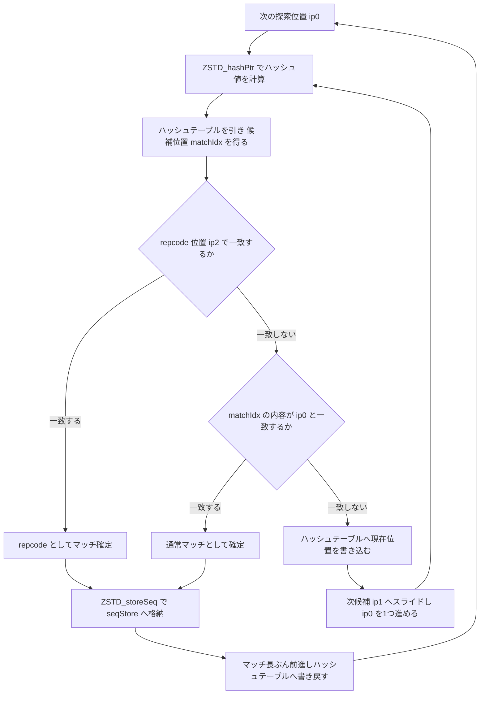
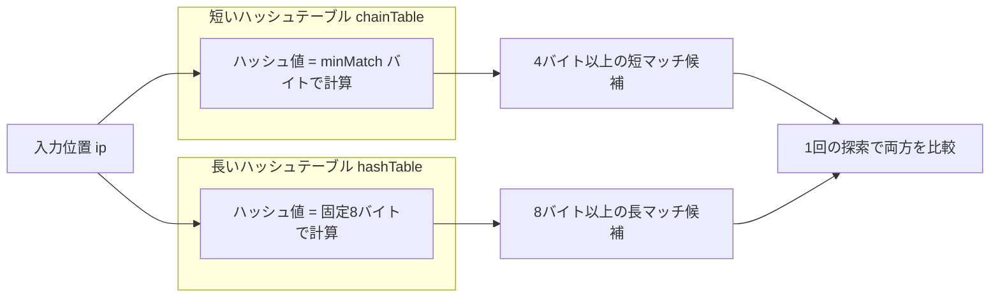

# 第16章 fast と double_fast：ハッシュテーブル探索

> **本章で読むソース**
>
> - [`lib/compress/zstd_fast.c`](https://github.com/facebook/zstd/blob/v1.5.7/lib/compress/zstd_fast.c)
> - [`lib/compress/zstd_double_fast.c`](https://github.com/facebook/zstd/blob/v1.5.7/lib/compress/zstd_double_fast.c)
> - [`lib/compress/zstd_compress_internal.h`](https://github.com/facebook/zstd/blob/v1.5.7/lib/compress/zstd_compress_internal.h)

## この章の狙い

zstd は圧縮レベルに応じて、性質の異なる複数のマッチファインダーを使い分ける。
第11章で見たとおり、レベルが低いほど探索を単純にして速度を稼ぎ、レベルが高いほど探索を広げて圧縮率を稼ぐ。
本章はその中でもっとも単純な2つ、**fast**（レベル1〜3相当）と**double_fast**（レベル5〜6相当）を読む。
どちらもマッチ探索の結果を第12章の seqStore にどう積むかは共通しており、探索の広げ方だけが異なる。
fast は1本のハッシュテーブルで直近の出現位置だけを引く貪欲な探索であり、double_fast は短いハッシュと長いハッシュの2本のテーブルを持ち、短マッチと長マッチを1回の探索で同時に狙う。
以降の章（第17章 lazy と行ベースマッチファインダー、第18章 optimal parser）は、この2つよりさらに広い候補集合を探索することで圧縮率を上げていく系列であり、本章はその出発点にあたる。

## 前提：ハッシュ関数とハッシュテーブルの役割

fast も double_fast も、直近に出現した位置をハッシュテーブルへ書き込み、次に同じハッシュ値が現れたときにそのテーブルを引いてマッチ候補を得るという点は共通する。
ハッシュ値は `ZSTD_hashPtr` が計算する。

[`lib/compress/zstd_compress_internal.h` L929-L944](https://github.com/facebook/zstd/blob/v1.5.7/lib/compress/zstd_compress_internal.h#L929-L944)

```c
MEM_STATIC FORCE_INLINE_ATTR
size_t ZSTD_hashPtr(const void* p, U32 hBits, U32 mls)
{
    /* Although some of these hashes do support hBits up to 64, some do not.
     * To be on the safe side, always avoid hBits > 32. */
    assert(hBits <= 32);

    switch(mls)
    {
    default:
    case 4: return ZSTD_hash4Ptr(p, hBits);
    case 5: return ZSTD_hash5Ptr(p, hBits);
    case 6: return ZSTD_hash6Ptr(p, hBits);
    case 7: return ZSTD_hash7Ptr(p, hBits);
    case 8: return ZSTD_hash8Ptr(p, hBits);
    }
}
```

第3引数 `mls`（minMatch length）が読み取るバイト数を選ぶ。
4バイト読めば `ZSTD_hash4Ptr`、8バイト読めば `ZSTD_hash8Ptr` が呼ばれ、いずれも読み取った整数に固定の素数を掛けて上位ビットを `hBits` 幅に落とすだけの軽い計算である。
テーブルへの書き込みも読み出しもこのハッシュ値をインデックスとする配列アクセス1回で済み、連結リストのようなポインタ辿りが要らない。
この単純さが fast 系の名の由来であり、探索1回あたりのコストを低く保つ土台になっている。

ハッシュテーブルは圧縮の開始前に一度埋めておく必要がある。
辞書やこれまでに処理した入力の末尾から、ハッシュテーブルへ位置を書き込んでおくのが `ZSTD_fillHashTable` である。

[`lib/compress/zstd_fast.c` L87-L97](https://github.com/facebook/zstd/blob/v1.5.7/lib/compress/zstd_fast.c#L87-L97)

```c
void ZSTD_fillHashTable(ZSTD_MatchState_t* ms,
                        const void* const end,
                        ZSTD_dictTableLoadMethod_e dtlm,
                        ZSTD_tableFillPurpose_e tfp)
{
    if (tfp == ZSTD_tfp_forCDict) {
        ZSTD_fillHashTableForCDict(ms, end, dtlm);
    } else {
        ZSTD_fillHashTableForCCtx(ms, end, dtlm);
    }
}
```

内部の `ZSTD_fillHashTableForCCtx` は、`fastHashFillStep`（3）ごとに1位置だけを必ず書き込み、残り2位置はそのハッシュ値がまだ空（0）のときだけ埋める間引き充填を行う。
すべての位置を律儀に書き込むと充填自体のコストが増えるため、後段の探索で参照される頻度が高い位置を優先し、残りは「空いていれば埋める」程度に緩めている。

## fast：1本のハッシュテーブルによる貪欲探索

### 探索ループの全体構造

`ZSTD_compressBlock_fast_noDict_generic` が fast の中心である。
関数冒頭のコメントが、探索を4段階（ハッシュ、テーブル参照、読み出し、比較）に分けたうえで、複数の候補位置についてこれらの段階をずらして並行させるパイプライン構造を説明している。
本文ではその工夫を後段でまとめ、まず1回の探索がたどる基本の流れを追う。



探索本体のループは次のように始まる。

[`lib/compress/zstd_fast.c` L246-L265](https://github.com/facebook/zstd/blob/v1.5.7/lib/compress/zstd_fast.c#L246-L265)

```c
    /* start each op */
_start: /* Requires: ip0 */

    step = stepSize;
    nextStep = ip0 + kStepIncr;

    /* calculate positions, ip0 - anchor == 0, so we skip step calc */
    ip1 = ip0 + 1;
    ip2 = ip0 + step;
    ip3 = ip2 + 1;

    if (ip3 >= ilimit) {
        goto _cleanup;
    }

    hash0 = ZSTD_hashPtr(ip0, hlog, mls);
    hash1 = ZSTD_hashPtr(ip1, hlog, mls);

    matchIdx = hashTable[hash0];

    do {
```

`ip0` が現在の探索位置、`ip1` はその隣、`ip2` と `ip3` は `step` 個先の候補である。
`step` は圧縮パラメータの `targetLength` から決まる初期値を持ち、マッチが見つからないまま探索が続くほど後述のとおり増えていく。

### repcode チェックと通常マッチの判定

ループ本体では、まず直近のオフセット（**repcode**、`rep_offset1`）でのマッチを、通常のハッシュテーブル探索より先にチェックする。

[`lib/compress/zstd_fast.c` L266-L299](https://github.com/facebook/zstd/blob/v1.5.7/lib/compress/zstd_fast.c#L266-L299)

```c
    do {
        /* load repcode match for ip[2]*/
        const U32 rval = MEM_read32(ip2 - rep_offset1);

        /* write back hash table entry */
        current0 = (U32)(ip0 - base);
        hashTable[hash0] = current0;

        /* check repcode at ip[2] */
        if ((MEM_read32(ip2) == rval) & (rep_offset1 > 0)) {
            ip0 = ip2;
            match0 = ip0 - rep_offset1;
            mLength = ip0[-1] == match0[-1];
            ip0 -= mLength;
            match0 -= mLength;
            offcode = REPCODE1_TO_OFFBASE;
            mLength += 4;

            /* Write next hash table entry: it's already calculated.
             * This write is known to be safe because ip1 is before the
             * repcode (ip2). */
            hashTable[hash1] = (U32)(ip1 - base);

            goto _match;
        }

         if (matchFound(ip0, base + matchIdx, matchIdx, prefixStartIndex)) {
            /* Write next hash table entry (it's already calculated).
            * This write is known to be safe because the ip1 == ip0 + 1,
            * so searching will resume after ip1 */
            hashTable[hash1] = (U32)(ip1 - base);

            goto _offset;
        }
```

`rep_offset1` はブロック間・ブロック内で持ち越す直近のマッチオフセットであり、直前と同じオフセットでの繰り返しは、シーケンス符号化においてオフセット自体を送らずに済む安価な表現（第14章）で書ける。
そのため fast はまず `ip2` の位置で `rep_offset1` 分だけ手前を読み、4バイト一致すれば即座に repcode マッチとして確定させ、通常のハッシュテーブル参照より優先する。
repcode で一致しなければ、`ip0` について引いておいたハッシュテーブルの候補 `matchIdx` を `matchFound` で確認する。
一致すれば `_offset` へ、しなければ `hash1`・`ip1` を新しい `hash0`・`ip0` として扱いながら次の候補へ進む。

`matchFound` は実体が2種類あり、呼び出し側は `useCmov` によって切り替える。

[`lib/compress/zstd_fast.c` L102-L141](https://github.com/facebook/zstd/blob/v1.5.7/lib/compress/zstd_fast.c#L102-L141)

```c
static int
ZSTD_match4Found_cmov(const BYTE* currentPtr, const BYTE* matchAddress, U32 matchIdx, U32 idxLowLimit)
{
    /* Array of ~random data, should have low probability of matching data.
     * Load from here if the index is invalid.
     * Used to avoid unpredictable branches. */
    static const BYTE dummy[] = {0x12,0x34,0x56,0x78};

    /* currentIdx >= lowLimit is a (somewhat) unpredictable branch.
     * However expression below compiles into conditional move.
     */
    const BYTE* mvalAddr = ZSTD_selectAddr(matchIdx, idxLowLimit, matchAddress, dummy);
    /* Note: this used to be written as : return test1 && test2;
     * Unfortunately, once inlined, these tests become branches,
     * in which case it becomes critical that they are executed in the right order (test1 then test2).
     * So we have to write these tests in a specific manner to ensure their ordering.
     */
    if (MEM_read32(currentPtr) != MEM_read32(mvalAddr)) return 0;
    /* force ordering of these tests, which matters once the function is inlined, as they become branches */
#if defined(__GNUC__)
    __asm__("");
#endif
    return matchIdx >= idxLowLimit;
}

static int
ZSTD_match4Found_branch(const BYTE* currentPtr, const BYTE* matchAddress, U32 matchIdx, U32 idxLowLimit)
{
    /* using a branch instead of a cmov,
     * because it's faster in scenarios where matchIdx >= idxLowLimit is generally true,
     * aka almost all candidates are within range */
    U32 mval;
    if (matchIdx >= idxLowLimit) {
        mval = MEM_read32(matchAddress);
    } else {
        mval = MEM_read32(currentPtr) ^ 1; /* guaranteed to not match. */
    }

    return (MEM_read32(currentPtr) == mval);
}
```

候補インデックス `matchIdx` がウィンドウの下限（`idxLowLimit`）より小さい場合、そのハッシュテーブルのエントリは初期化されただけの無効な値であり、参照してはいけない。
`_cmov` 版は無効な候補に対してダミー配列 `dummy` を読ませることで分岐を消し、`matchIdx >= idxLowLimit` かどうかで実行経路が変わらないようにする。
一方 `_branch` 版は同じ判定を素直な分岐で書く。
どちらを使うかは、ウィンドウが小さく候補の大半が有効域に収まる場合は分岐の方が予測しやすいという経験則に基づいて `ZSTD_compressBlock_fast` が `windowLog` から選ぶ。
分岐予測が効きやすい状況と効きにくい状況を作り分けで両方カバーする、CPU のパイプライン特性を踏まえた最適化である。

### マッチが見つかったあとの処理とオーバーラップ検出

マッチが確定すると `_offset` または `_match` ラベルに合流し、seqStore への格納へ進む。

[`lib/compress/zstd_fast.c` L377-L422](https://github.com/facebook/zstd/blob/v1.5.7/lib/compress/zstd_fast.c#L377-L422)

```c
_offset: /* Requires: ip0, idx */

    /* Compute the offset code. */
    match0 = base + matchIdx;
    rep_offset2 = rep_offset1;
    rep_offset1 = (U32)(ip0-match0);
    offcode = OFFSET_TO_OFFBASE(rep_offset1);
    mLength = 4;

    /* Count the backwards match length. */
    while (((ip0>anchor) & (match0>prefixStart)) && (ip0[-1] == match0[-1])) {
        ip0--;
        match0--;
        mLength++;
    }

_match: /* Requires: ip0, match0, offcode */

    /* Count the forward length. */
    mLength += ZSTD_count(ip0 + mLength, match0 + mLength, iend);

    ZSTD_storeSeq(seqStore, (size_t)(ip0 - anchor), anchor, iend, offcode, mLength);

    ip0 += mLength;
    anchor = ip0;

    /* Fill table and check for immediate repcode. */
    if (ip0 <= ilimit) {
        /* Fill Table */
        assert(base+current0+2 > istart);  /* check base overflow */
        hashTable[ZSTD_hashPtr(base+current0+2, hlog, mls)] = current0+2;  /* here because current+2 could be > iend-8 */
        hashTable[ZSTD_hashPtr(ip0-2, hlog, mls)] = (U32)(ip0-2-base);

        if (rep_offset2 > 0) { /* rep_offset2==0 means rep_offset2 is invalidated */
            while ( (ip0 <= ilimit) && (MEM_read32(ip0) == MEM_read32(ip0 - rep_offset2)) ) {
                /* store sequence */
                size_t const rLength = ZSTD_count(ip0+4, ip0+4-rep_offset2, iend) + 4;
                { U32 const tmpOff = rep_offset2; rep_offset2 = rep_offset1; rep_offset1 = tmpOff; } /* swap rep_offset2 <=> rep_offset1 */
                hashTable[ZSTD_hashPtr(ip0, hlog, mls)] = (U32)(ip0-base);
                ip0 += rLength;
                ZSTD_storeSeq(seqStore, 0 /*litLen*/, anchor, iend, REPCODE1_TO_OFFBASE, rLength);
                anchor = ip0;
                continue;   /* faster when present (confirmed on gcc-8) ... (?) */
    }   }   }

    goto _start;
```

`_offset` は通常マッチの後方一致（バックワードマッチ、先頭方向に一致長を伸ばす処理）を行い、`_match` はオフセットが確定したマッチと repcode マッチの両方が合流して前方一致を数える。
`ZSTD_count` が実際の一致長を数え、`ZSTD_storeSeq`（第12章）へリテラル長・オフセット・マッチ長を渡してシーケンスとして格納する。
マッチ長ぶん `ip0` を進めて `anchor`（次のシーケンスのリテラル開始位置）を更新したあと、直後の2位置をハッシュテーブルへ書き戻す。
そのうえで、直前のマッチ末尾から `rep_offset2` 分だけ手前を見て、連続する repcode マッチがないかを while ループで貪欲に食い尽くす。
このループはマッチが途切れるまで `ZSTD_storeSeq` を呼び続けるため、同じオフセットの短い繰り返しが連続する入力（バイナリの0埋めなど）では、通常の探索へ戻らずに安価な repcode シーケンスだけを連発して素早く処理できる。

### 高速化の工夫：4段パイプラインの前倒し実行

fast の探索ループには関数冒頭のコメントで説明される、探索そのものの待ち時間を隠す工夫がある。

[`lib/compress/zstd_fast.c` L144-L189](https://github.com/facebook/zstd/blob/v1.5.7/lib/compress/zstd_fast.c#L144-L189)

```c
/**
 * If you squint hard enough (and ignore repcodes), the search operation at any
 * given position is broken into 4 stages:
 *
 * 1. Hash   (map position to hash value via input read)
 * 2. Lookup (map hash val to index via hashtable read)
 * 3. Load   (map index to value at that position via input read)
 * 4. Compare
 *
 * Each of these steps involves a memory read at an address which is computed
 * from the previous step. This means these steps must be sequenced and their
 * latencies are cumulative.
 *
 * Rather than do 1->2->3->4 sequentially for a single position before moving
 * onto the next, this implementation interleaves these operations across the
 * next few positions:
 *
 * R = Repcode Read & Compare
 * H = Hash
 * T = Table Lookup
 * M = Match Read & Compare
 *
 * Pos | Time -->
 * ----+-------------------
 * N   | ... M
 * N+1 | ...   TM
 * N+2 |    R H   T M
 * N+3 |         H    TM
 * N+4 |           R H   T M
 * N+5 |                H   ...
 * N+6 |                  R ...
 *
 * This is very much analogous to the pipelining of execution in a CPU. And just
 * like a CPU, we have to dump the pipeline when we find a match (i.e., take a
 * branch).
 */
```

1位置ぶんの探索は「ハッシュ計算」「テーブル参照」「候補位置の読み出し」「比較」の4段からなり、各段は前段の結果を使うメモリ読み出しであるため、1位置だけを見ればレイテンシは足し合わせになる。
実装のループは、この4段を1位置ずつ順に処理する代わりに、隣接する複数位置の段をずらして重ねる。
ある位置の比較（M）を実行している間に、次の位置のテーブル参照（T）を、さらに次の位置のハッシュ計算（H）を並行して進めておくことで、各段のメモリ読み出しのレイテンシを隠す。
これは CPU 命令のパイプライン化と同じ発想であり、コード中の変数 `hash1`・`ip1`・`ip2`・`ip3` が、現在位置より先の段まで計算し終えた値を保持する役割を担っている。
マッチが見つかるとこの重なりは崩れる（パイプラインをフラッシュする）ため、`_start` から再び1段ずつ立ち上げ直す。

## double_fast：短いハッシュテーブルと長いハッシュテーブルの併用

### 2つのテーブルの構成

double_fast は fast と異なり、ハッシュテーブルを2本持つ。
`ms->hashTable` を長いマッチ（**長マッチ**）用、`ms->chainTable` を短いマッチ（**短マッチ**）用に使う。

[`lib/compress/zstd_double_fast.c` L56-L88](https://github.com/facebook/zstd/blob/v1.5.7/lib/compress/zstd_double_fast.c#L56-L88)

```c
void ZSTD_fillDoubleHashTableForCCtx(ZSTD_MatchState_t* ms,
                              void const* end, ZSTD_dictTableLoadMethod_e dtlm)
{
    const ZSTD_compressionParameters* const cParams = &ms->cParams;
    U32* const hashLarge = ms->hashTable;
    U32  const hBitsL = cParams->hashLog;
    U32  const mls = cParams->minMatch;
    U32* const hashSmall = ms->chainTable;
    U32  const hBitsS = cParams->chainLog;
    const BYTE* const base = ms->window.base;
    const BYTE* ip = base + ms->nextToUpdate;
    const BYTE* const iend = ((const BYTE*)end) - HASH_READ_SIZE;
    const U32 fastHashFillStep = 3;

    /* Always insert every fastHashFillStep position into the hash tables.
     * Insert the other positions into the large hash table if their entry
     * is empty.
     */
    for (; ip + fastHashFillStep - 1 <= iend; ip += fastHashFillStep) {
        U32 const curr = (U32)(ip - base);
        U32 i;
        for (i = 0; i < fastHashFillStep; ++i) {
            size_t const smHash = ZSTD_hashPtr(ip + i, hBitsS, mls);
            size_t const lgHash = ZSTD_hashPtr(ip + i, hBitsL, 8);
            if (i == 0)
                hashSmall[smHash] = curr + i;
            if (i == 0 || hashLarge[lgHash] == 0)
                hashLarge[lgHash] = curr + i;
            /* Only load extra positions for ZSTD_dtlm_full */
            if (dtlm == ZSTD_dtlm_fast)
                break;
        }   }
}

void ZSTD_fillDoubleHashTable(ZSTD_MatchState_t* ms,
                        const void* const end,
                        ZSTD_dictTableLoadMethod_e dtlm,
                        ZSTD_tableFillPurpose_e tfp)
{
    if (tfp == ZSTD_tfp_forCDict) {
        ZSTD_fillDoubleHashTableForCDict(ms, end, dtlm);
    } else {
        ZSTD_fillDoubleHashTableForCCtx(ms, end, dtlm);
    }
}
```

短マッチ用テーブルのハッシュ関数は圧縮パラメータの `minMatch`（`mls`、4〜7バイト）で読み、長マッチ用テーブルのハッシュ関数は常に8バイト固定で読む。
読み取りバイト数が違えば同じ位置でも異なるハッシュ値になり、2本のテーブルはそれぞれ独立に「短い共通接頭辞を持つ位置」と「長い共通接頭辞を持つ位置」を蓄積する。



### 1回の探索での短マッチと長マッチの同時判定

主ループ `ZSTD_compressBlock_doubleFast_noDict_generic` は、内側のループで1位置ごとに repcode・長マッチ・短マッチを順に確認する。

[`lib/compress/zstd_double_fast.c` L176-L222](https://github.com/facebook/zstd/blob/v1.5.7/lib/compress/zstd_double_fast.c#L176-L222)

```c
        hl0 = ZSTD_hashPtr(ip, hBitsL, 8);
        idxl0 = hashLong[hl0];
        matchl0 = base + idxl0;

        /* Inner Loop: one iteration per search / position */
        do {
            const size_t hs0 = ZSTD_hashPtr(ip, hBitsS, mls);
            const U32 idxs0 = hashSmall[hs0];
            curr = (U32)(ip-base);
            matchs0 = base + idxs0;

            hashLong[hl0] = hashSmall[hs0] = curr;   /* update hash tables */

            /* check noDict repcode */
            if ((offset_1 > 0) & (MEM_read32(ip+1-offset_1) == MEM_read32(ip+1))) {
                mLength = ZSTD_count(ip+1+4, ip+1+4-offset_1, iend) + 4;
                ip++;
                ZSTD_storeSeq(seqStore, (size_t)(ip-anchor), anchor, iend, REPCODE1_TO_OFFBASE, mLength);
                goto _match_stored;
            }

            hl1 = ZSTD_hashPtr(ip1, hBitsL, 8);

            /* idxl0 > prefixLowestIndex is a (somewhat) unpredictable branch.
             * However expression below complies into conditional move. Since
             * match is unlikely and we only *branch* on idxl0 > prefixLowestIndex
             * if there is a match, all branches become predictable. */
            {   const BYTE*  const matchl0_safe = ZSTD_selectAddr(idxl0, prefixLowestIndex, matchl0, &dummy[0]);

                /* check prefix long match */
                if (MEM_read64(matchl0_safe) == MEM_read64(ip) && matchl0_safe == matchl0) {
                    mLength = ZSTD_count(ip+8, matchl0+8, iend) + 8;
                    offset = (U32)(ip-matchl0);
                    while (((ip>anchor) & (matchl0>prefixLowest)) && (ip[-1] == matchl0[-1])) { ip--; matchl0--; mLength++; } /* catch up */
                    goto _match_found;
            }   }

            idxl1 = hashLong[hl1];
            matchl1 = base + idxl1;

            /* Same optimization as matchl0 above */
            matchs0_safe = ZSTD_selectAddr(idxs0, prefixLowestIndex, matchs0, &dummy[0]);

            /* check prefix short match */
            if(MEM_read32(matchs0_safe) == MEM_read32(ip) && matchs0_safe == matchs0) {
                  goto _search_next_long;
            }
```

比較の順序が double_fast の設計そのものを表している。
まず repcode を確認し、次に長いハッシュテーブルで8バイト一致（長マッチ）を確認し、それでも見つからなければ短いハッシュテーブルで4バイト一致（短マッチ）を確認する。
長マッチが見つかった時点で `_match_found` へ抜けるため、短マッチのチェックまで到達するのは、その位置に8バイト一致するデータがなかった場合に限られる。
2本のテーブルを同じ探索ループの中で参照するので、長い共通接頭辞を持つ入力に対しては1回のハッシュ・参照・比較で決着がつき、短い共通接頭辞しか持たない入力に対しては同じループがそのまま短マッチ探索に転用される。
テーブルを1本しか持たない fast では、この使い分けができず短マッチと長マッチを区別できない。

短マッチが見つかったときは、そこで確定させず「もっと長いマッチがないか」を1位置先の長いハッシュテーブルの結果で確認してから確定する。

[`lib/compress/zstd_double_fast.c` L253-L271](https://github.com/facebook/zstd/blob/v1.5.7/lib/compress/zstd_double_fast.c#L253-L271)

```c
_search_next_long:

        /* short match found: let's check for a longer one */
        mLength = ZSTD_count(ip+4, matchs0+4, iend) + 4;
        offset = (U32)(ip - matchs0);

        /* check long match at +1 position */
        if ((idxl1 > prefixLowestIndex) && (MEM_read64(matchl1) == MEM_read64(ip1))) {
            size_t const l1len = ZSTD_count(ip1+8, matchl1+8, iend) + 8;
            if (l1len > mLength) {
                /* use the long match instead */
                ip = ip1;
                mLength = l1len;
                offset = (U32)(ip-matchl1);
                matchs0 = matchl1;
            }
        }

        while (((ip>anchor) & (matchs0>prefixLowest)) && (ip[-1] == matchs0[-1])) { ip--; matchs0--; mLength++; } /* complete backward */
```

`idxl1`・`matchl1` は、内側ループの1つ前の反復ですでに計算済みの、1位置先（`ip1`）についての長マッチ候補である。
新たにハッシュ計算や参照をやり直すことなく、その場で「短マッチの長さ」と「1つ先から始まる長マッチの長さ」を比べ、長い方を採用する。
これにより、短マッチとして確定させたあとに実は隣接位置からもっと長いマッチが取れた、という機会損失を避けられる。

長マッチと短マッチのどちらの経路から来た場合も `_match_found` に合流し、以降の処理は fast とほぼ同じ形をとる。

[`lib/compress/zstd_double_fast.c` L275-L296](https://github.com/facebook/zstd/blob/v1.5.7/lib/compress/zstd_double_fast.c#L275-L296)

```c
_match_found: /* requires ip, offset, mLength */
        offset_2 = offset_1;
        offset_1 = offset;

        if (step < 4) {
            /* It is unsafe to write this value back to the hashtable when ip1 is
             * greater than or equal to the new ip we will have after we're done
             * processing this match. Rather than perform that test directly
             * (ip1 >= ip + mLength), which costs speed in practice, we do a simpler
             * more predictable test. The minmatch even if we take a short match is
             * 4 bytes, so as long as step, the distance between ip and ip1
             * (initially) is less than 4, we know ip1 < new ip. */
            hashLong[hl1] = (U32)(ip1 - base);
        }

        ZSTD_storeSeq(seqStore, (size_t)(ip-anchor), anchor, iend, OFFSET_TO_OFFBASE(offset), mLength);

_match_stored:
        /* match found */
        ip += mLength;
        anchor = ip;
```

`offset_1`・`offset_2` を更新し、`ZSTD_storeSeq` でシーケンスを格納したあと、`ip` をマッチ長ぶん前進させる。
`step < 4` の条件は、まだ使っていない `ip1` 位置のハッシュ値をテーブルへ書き戻しても安全かどうかの判定であり、次の探索がその位置を追い越してしまわないことを保証する。

### 高速化の工夫：2表・2ハッシュによる短マッチ長マッチの同時探索

double_fast の最適化の核は、短い読み取り幅と長い読み取り幅という2種類のハッシュ関数を、2本の独立したテーブルに対応させたことにある。
1本のテーブルしか持たない fast では、ハッシュの読み取り幅を `minMatch` に固定せざるを得ず、その幅より長い一致が実際にあっても、テーブルの1エントリが上書きされてしまえば長い一致の情報は失われる。
double_fast は短マッチ用の `chainTable` と長マッチ用の `hashTable` を別々に更新するため、同じ入力位置について「短い接頭辞が一致する直近位置」と「長い接頭辞が一致する直近位置」を両方とも保持できる。
探索側もこの2本を同じループの中で、長マッチ優先の順序で問い合わせるだけであり、追加のハッシュ計算やテーブル参照をループの外に出す必要がない。
1回の探索コストをほぼ据え置いたまま、fast より広い候補（短マッチと長マッチの両方）を拾えることが、double_fast がより高い圧縮レベルで使われる理由である。

## まとめ

fast は1本のハッシュテーブルで直近の一致位置だけを引く、もっとも単純なマッチファインダーである。
探索の4段階（ハッシュ・テーブル参照・読み出し・比較）を隣接する複数位置にまたがってずらし、CPU のパイプラインのように重ねて実行することでメモリ読み出しのレイテンシを隠す。
double_fast は短いハッシュと長いハッシュという読み取り幅の異なる2つのハッシュ関数を、それぞれ独立したハッシュテーブルに対応させることで、1回の探索で短マッチと長マッチの両方を拾えるようにした。
どちらも、探索して確定したマッチは同じ `ZSTD_storeSeq` の呼び出しで第12章の seqStore へ格納され、直近オフセットの repcode チェックとその貪欲な連続消費という共通の仕組みを持つ。
次の第17章では、この2つよりも広い候補集合を、行ベースのハッシュテーブルと lazy な先読みで探索するマッチファインダーを読む。

## 関連する章

- [第11章 CCtxパラメータと圧縮レベル](../part03-compress-core/11-cctx-params.md)
- [第12章 seqStoreとブロックの流れ](../part03-compress-core/12-seqstore-blockflow.md)
- [第17章 lazy と行ベースマッチファインダー](17-lazy-row.md)
