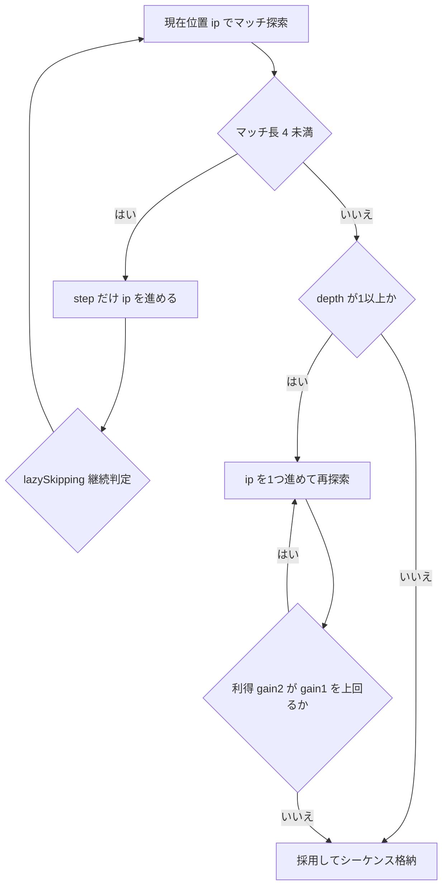
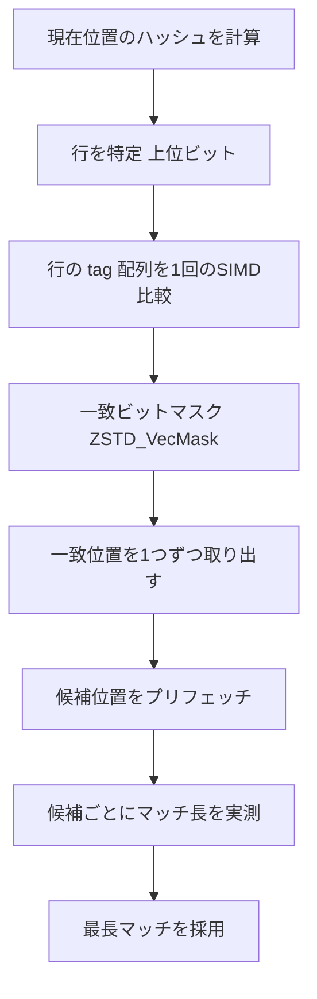

# 第17章 lazy と row-based マッチファインダー

> **本章で読むソース**
>
> - [`lib/compress/zstd_lazy.c`](https://github.com/facebook/zstd/blob/v1.5.7/lib/compress/zstd_lazy.c)
> - [`lib/compress/zstd_lazy.h`](https://github.com/facebook/zstd/blob/v1.5.7/lib/compress/zstd_lazy.h)

## この章の狙い

第16章で読んだ fast と double_fast は、現在位置で最初に見つかったマッチをそのまま採用する。
圧縮レベルを上げると、zstd はこの単純さを捨て、もう一歩先を読んでからマッチを決める `lazy` 系のブロック圧縮関数に切り替わる。
本章では `ZSTD_compressBlock_lazy_generic` を中心に、ハッシュチェーンを辿るマッチファインダー `ZSTD_HcFindBestMatch` と、SIMDで候補を絞り込む row-based マッチファインダー `ZSTD_RowFindBestMatch` を読む。
どちらも「現在位置のマッチをすぐ確定せず、複数の候補から最長のものを選ぶ」という探索の骨格は共通であり、違いはハッシュテーブルの構造と候補の絞り込み方にある。

## 前提

fast 系は1エントリのハッシュテーブルに直近の1候補しか保持しなかった。
`lazy` 系のマッチファインダーは、同じハッシュ値を持つ過去の位置を複数保持し、そのなかから最長マッチを選ぶ。
保持の方式は2通りある。

- **ハッシュチェーン**：各ハッシュバケットが1つの連結リストを持ち、新しい位置を挿入するたびに直前の内容を`chainTable`で次ポインタとして繋ぐ。
- **行ベースマッチファインダー**（row-based match finder）：ハッシュテーブルを固定長の「行」に分割し、1行あたり16〜64エントリを平置きで保持する。
  行内の一致候補は1バイトの `tag` をSIMD比較で一括判定する。

`ZSTD_compressBlock_lazy_generic` はこの2方式を `searchMethod_e` で切り替える。

[`lib/compress/zstd_lazy.c` L1424](https://github.com/facebook/zstd/blob/v1.5.7/lib/compress/zstd_lazy.c#L1424)

```c
typedef enum { search_hashChain=0, search_binaryTree=1, search_rowHash=2 } searchMethod_e;
```

`search_binaryTree` は btlazy2（第18章の optimal parser が使う二分探索木）用であり、本章では扱わない。

## ハッシュチェーンによる探索：ZSTD_HcFindBestMatch

ハッシュチェーンへの挿入は `ZSTD_insertAndFindFirstIndex_internal` が担う。
現在位置までの未挿入区間を順に埋めながら、各位置のハッシュ値をキーに `chainTable` へ「直前にそのハッシュへ挿入された位置」を書き込む。

[`lib/compress/zstd_lazy.c` L632-L654](https://github.com/facebook/zstd/blob/v1.5.7/lib/compress/zstd_lazy.c#L632-L654)

```c
U32 ZSTD_insertAndFindFirstIndex_internal(
                        ZSTD_MatchState_t* ms,
                        const ZSTD_compressionParameters* const cParams,
                        const BYTE* ip, U32 const mls, U32 const lazySkipping)
{
    U32* const hashTable  = ms->hashTable;
    const U32 hashLog = cParams->hashLog;
    U32* const chainTable = ms->chainTable;
    const U32 chainMask = (1 << cParams->chainLog) - 1;
    const BYTE* const base = ms->window.base;
    const U32 target = (U32)(ip - base);
    U32 idx = ms->nextToUpdate;

    while(idx < target) { /* catch up */
        size_t const h = ZSTD_hashPtr(base+idx, hashLog, mls);
        NEXT_IN_CHAIN(idx, chainMask) = hashTable[h];
        hashTable[h] = idx;
        idx++;
        /* Stop inserting every position when in the lazy skipping mode. */
        if (lazySkipping)
            break;
    }

    ms->nextToUpdate = target;
    return hashTable[ZSTD_hashPtr(ip, hashLog, mls)];
}
```

`hashTable[h]` は常に「そのハッシュ値を持つ最新の位置」を指し、`chainTable[idx & chainMask]` はその1つ前の位置を指す。
辿るたびに1つ古い位置へ移動できるので、`hashTable[h]` から出発して `chainTable` を辿れば、そのハッシュ値を持つ位置を新しい順に列挙できる。
この列を実際にたどってマッチ長を比較するのが `ZSTD_HcFindBestMatch` である。

[`lib/compress/zstd_lazy.c` L706-L732](https://github.com/facebook/zstd/blob/v1.5.7/lib/compress/zstd_lazy.c#L706-L732)

```c
    /* HC4 match finder */
    matchIndex = ZSTD_insertAndFindFirstIndex_internal(ms, cParams, ip, mls, ms->lazySkipping);

    for ( ; (matchIndex>=lowLimit) & (nbAttempts>0) ; nbAttempts--) {
        size_t currentMl=0;
        if ((dictMode != ZSTD_extDict) || matchIndex >= dictLimit) {
            const BYTE* const match = base + matchIndex;
            assert(matchIndex >= dictLimit);   /* ensures this is true if dictMode != ZSTD_extDict */
            /* read 4B starting from (match + ml + 1 - sizeof(U32)) */
            if (MEM_read32(match + ml - 3) == MEM_read32(ip + ml - 3))   /* potentially better */
                currentMl = ZSTD_count(ip, match, iLimit);
        } else {
            const BYTE* const match = dictBase + matchIndex;
            assert(match+4 <= dictEnd);
            if (MEM_read32(match) == MEM_read32(ip))   /* assumption : matchIndex <= dictLimit-4 (by table construction) */
                currentMl = ZSTD_count_2segments(ip+4, match+4, iLimit, dictEnd, prefixStart) + 4;
        }

        /* save best solution */
        if (currentMl > ml) {
            ml = currentMl;
            *offsetPtr = OFFSET_TO_OFFBASE(curr - matchIndex);
            if (ip+currentMl == iLimit) break; /* best possible, avoids read overflow on next attempt */
        }

        if (matchIndex <= minChain) break;
        matchIndex = NEXT_IN_CHAIN(matchIndex, chainMask);
    }
```

チェーンを辿る回数は `nbAttempts`（`1U << cParams->searchLog`）で上限を切る。
無条件に末端まで辿ると、同じハッシュ値を持つ位置が大量にある入力（繰り返しの多いデータ）で探索が線形コストのまま伸び続けるためである。
比較の前段にある `MEM_read32(match + ml - 3) == MEM_read32(ip + ml - 3)` は、現在の最良マッチ長`ml`の末尾4バイトだけを先に見て一致しなければ即座に棄却する早期打ち切りであり、実際にマッチ長を数える `ZSTD_count` の呼び出し回数を減らす。

## lazy の一歩先読み：ZSTD_compressBlock_lazy_generic

ハッシュチェーンであれ行ベースであれ、マッチファインダーが返すのは「現在位置での最長マッチ」1つである。
`ZSTD_compressBlock_lazy_generic` はこれを即座に採用せず、`depth` パラメータの回数だけ次の位置へずらして探索をやり直し、そちらの方が得かどうかを比較する。
`depth` は圧縮レベルごとに0（greedy）、1（lazy）、2（lazy2）のいずれかが渡される。

現在位置でのマッチが見つかった直後、`depth>=1` なら1つ先の位置で再探索する。

[`lib/compress/zstd_lazy.c` L1632-L1663](https://github.com/facebook/zstd/blob/v1.5.7/lib/compress/zstd_lazy.c#L1632-L1663)

```c
        /* let's try to find a better solution */
        if (depth>=1)
        while (ip<ilimit) {
            DEBUGLOG(7, "search depth 1");
            ip ++;
            if ( (dictMode == ZSTD_noDict)
              && (offBase) && ((offset_1>0) & (MEM_read32(ip) == MEM_read32(ip - offset_1)))) {
                size_t const mlRep = ZSTD_count(ip+4, ip+4-offset_1, iend) + 4;
                int const gain2 = (int)(mlRep * 3);
                int const gain1 = (int)(matchLength*3 - ZSTD_highbit32((U32)offBase) + 1);
                if ((mlRep >= 4) && (gain2 > gain1))
                    matchLength = mlRep, offBase = REPCODE1_TO_OFFBASE, start = ip;
            }
            // ... (中略) ...
            {   size_t ofbCandidate=999999999;
                size_t const ml2 = ZSTD_searchMax(ms, ip, iend, &ofbCandidate, mls, rowLog, searchMethod, dictMode);
                int const gain2 = (int)(ml2*4 - ZSTD_highbit32((U32)ofbCandidate));   /* raw approx */
                int const gain1 = (int)(matchLength*4 - ZSTD_highbit32((U32)offBase) + 4);
                if ((ml2 >= 4) && (gain2 > gain1)) {
                    matchLength = ml2, offBase = ofbCandidate, start = ip;
                    continue;   /* search a better one */
            }   }
```

比較の基準は単純な長さではなく、`長さ*係数 - オフセットのビット長` という利得（gain）である。
マッチ長が同じでもオフセットが小さいほうがシーケンス符号化のコストが小さいため、次の位置で見つかった候補が現在の候補より長くても、そのぶんオフセットが遠くて符号化コストが高いなら採用しない。
1つ先で有利な候補が見つかれば、現在保持している `matchLength` と `offBase` をその候補で置き換えて `continue` し、さらに次の位置でも同じ判定を繰り返す。
depth 2（lazy2）はこの探索をもう1段深く行い、係数も4に統一してより慎重に判定する。
一歩先を見て「今のマッチを捨てて良いか」を判定するこの構造こそが lazy という名前の由来であり、貪欲に確定せず判断を1手遅らせることで、直後により良いマッチが取れる場合に乗り換えられる。

先読みで有利な候補が1つも見つからなければ、ループは `break` で抜けて直前の候補をそのまま採用する。
マッチが4バイト未満で見つからない区間は、`step` を使って入力位置を素早く飛ばし、8バイトを超える速度で飛ばし続けると `lazySkipping` モードに入ってテーブル挿入を間引く。
非圧縮性の高い区間（乱数データなど）でハッシュテーブルの更新コストを浮かせるための工夫である。



## 行ベースマッチファインダー：ZSTD_RowFindBestMatch

ハッシュチェーンは辿るたびにポインタ参照が発生し、メモリアクセスが分散しやすい。
`ZSTD_RowFindBestMatch` はハッシュテーブルを固定長の行に分割し、1行分のエントリを連続領域にまとめることでこの分散を抑える。
行の大きさは `rowLog` で決まり、`ZSTD_compressBlock_lazy_generic` はこれを `searchLog` から導く。

[`lib/compress/zstd_lazy.c` L1532](https://github.com/facebook/zstd/blob/v1.5.7/lib/compress/zstd_lazy.c#L1532)

```c
    const U32 rowLog = BOUNDED(4, ms->cParams.searchLog, 6);
```

`rowLog` は4から6の範囲、つまり1行あたり16、32、64エントリのいずれかになる。
ハッシュ値の上位ビットが「どの行か」を、下位8ビットが「タグ」を決める。

[`lib/compress/zstd_lazy.c` L779](https://github.com/facebook/zstd/blob/v1.5.7/lib/compress/zstd_lazy.c#L779)

```c
#define ZSTD_ROW_HASH_TAG_MASK ((1u << ZSTD_ROW_HASH_TAG_BITS) - 1)
```

`ZSTD_ROW_HASH_TAG_BITS` は8であり、`tagTable` には行ごとに位置と対になる1バイトのタグを平置きする。
新規挿入時は、ハッシュチェーンのように次ポインタを繋ぐのではなく、行の中の空き位置（後述の循環バッファ「head」）にタグと実位置を書き込むだけで済む。

### hashCache による先読みプリフェッチ

行ベースマッチファインダーはハッシュ計算と行の取得を1手先に済ませる `hashCache` を持つ。
ブロックの探索開始前に `ZSTD_row_fillHashCache` で `ZSTD_ROW_HASH_CACHE_SIZE`（8）個先までのハッシュを計算し、対応する行を `PREFETCH_L1` でプリフェッチしておく。

[`lib/compress/zstd_lazy.c` L837-L854](https://github.com/facebook/zstd/blob/v1.5.7/lib/compress/zstd_lazy.c#L837-L854)

```c
void ZSTD_row_fillHashCache(ZSTD_MatchState_t* ms, const BYTE* base,
                                   U32 const rowLog, U32 const mls,
                                   U32 idx, const BYTE* const iLimit)
{
    U32 const* const hashTable = ms->hashTable;
    BYTE const* const tagTable = ms->tagTable;
    U32 const hashLog = ms->rowHashLog;
    U32 const maxElemsToPrefetch = (base + idx) > iLimit ? 0 : (U32)(iLimit - (base + idx) + 1);
    U32 const lim = idx + MIN(ZSTD_ROW_HASH_CACHE_SIZE, maxElemsToPrefetch);

    for (; idx < lim; ++idx) {
        U32 const hash = (U32)ZSTD_hashPtrSalted(base + idx, hashLog + ZSTD_ROW_HASH_TAG_BITS, mls, ms->hashSalt);
        U32 const row = (hash >> ZSTD_ROW_HASH_TAG_BITS) << rowLog;
        ZSTD_row_prefetch(hashTable, tagTable, row, rowLog);
        ms->hashCache[idx & ZSTD_ROW_HASH_CACHE_MASK] = hash;
    }
}
```

探索が1歩進むたびに `ZSTD_row_nextCachedHash` がキャッシュ済みのハッシュを1つ返しつつ、新たに8個先のハッシュを計算してキャッシュを更新する。
探索本体が現在位置の行を処理している間に、次に必要になる行のプリフェッチがすでに要求済みになっている状態を常に保つ仕組みである。

### tag によるSIMD絞り込み：ZSTD_row_getMatchMask

行を取得したあと、その行の中でどのエントリが現在位置と同じタグを持つかを1回のSIMD比較でまとめて判定する。

[`lib/compress/zstd_lazy.c` L1060-L1071](https://github.com/facebook/zstd/blob/v1.5.7/lib/compress/zstd_lazy.c#L1060-L1071)

```c
FORCE_INLINE_TEMPLATE ZSTD_VecMask
ZSTD_row_getMatchMask(const BYTE* const tagRow, const BYTE tag, const U32 headGrouped, const U32 rowEntries)
{
    const BYTE* const src = tagRow;
    assert((rowEntries == 16) || (rowEntries == 32) || rowEntries == 64);
    assert(rowEntries <= ZSTD_ROW_HASH_MAX_ENTRIES);
    assert(ZSTD_row_matchMaskGroupWidth(rowEntries) * rowEntries <= sizeof(ZSTD_VecMask) * 8);

#if defined(ZSTD_ARCH_X86_SSE2)

    return ZSTD_row_getSSEMask(rowEntries / 16, src, tag, headGrouped);

#else /* SW or NEON-LE */
```

x86ではSSE2の`_mm_cmpeq_epi8`で行全体16バイトを1命令で `tag` と比較し、`_mm_movemask_epi8`で一致ビットを1つの整数（`ZSTD_VecMask`）へ集約する。
BMI2やNEONが使えない環境向けのSWARフォールバックも、`size_t`単位で複数バイトをまとめて比較する同種のビット演算になっている。
戻り値の`ZSTD_VecMask`は「一致した位置」のビットが立った64ビット整数であり、呼び出し側は`ZSTD_VecMask_next`（末尾からの0ビット数を数える`ZSTD_countTrailingZeros64`）で1つずつ一致位置を取り出す。



この構造が本章の最適化の勘所である。
ハッシュチェーンは候補を1つずつポインタで辿るため、候補数だけ分岐とメモリ参照が直列に発生する。
行ベースマッチファインダーは、1行分のタグをあらかじめ連続領域に敷き詰めておき、SIMD幅（16バイトなど）ぶんの候補を1回の比較命令で判定できる形にしている。
一致した候補だけを`matchBuffer`へ集めてから実際のマッチ長比較に回すので、タグが一致しない大半の候補は1バイト比較のみで棄却され、実データの読み出し（`ZSTD_count`）は本当に有望な候補だけに絞られる。
さらに一致候補の実位置を確認する前に`PREFETCH_L1`でプリフェッチしておくため、比較用の分岐と実データ参照のレイテンシが重なり合う。

[`lib/compress/zstd_lazy.c` L1226-L1242](https://github.com/facebook/zstd/blob/v1.5.7/lib/compress/zstd_lazy.c#L1226-L1242)

```c
        for (; (matches > 0) && (nbAttempts > 0); matches &= (matches - 1)) {
            U32 const matchPos = ((headGrouped + ZSTD_VecMask_next(matches)) / groupWidth) & rowMask;
            U32 const matchIndex = row[matchPos];
            if(matchPos == 0) continue;
            assert(numMatches < rowEntries);
            if (matchIndex < lowLimit)
                break;
            if ((dictMode != ZSTD_extDict) || matchIndex >= dictLimit) {
                PREFETCH_L1(base + matchIndex);
            } else {
                PREFETCH_L1(dictBase + matchIndex);
            }
            matchBuffer[numMatches++] = matchIndex;
            --nbAttempts;
        }
```

`nbAttempts`はここでも`cappedSearchLog`（`searchLog`と`rowLog`の小さいほう）で上限を切っており、1行のエントリ数を超える探索は行わない。

## rowLog と1行あたりエントリ数

`rowLog` が4、5、6のとき、1行のエントリ数はそれぞれ16、32、64になる。
`rowEntries`が大きいほど1回のハッシュ衝突で保持できる候補数が増え、マッチを取りこぼしにくくなる一方、SIMD比較1回あたりの幅も広げる必要がある。
`ZSTD_row_matchMaskGroupWidth`は、NEON環境でエントリ数が16や32のときに1エントリを複数ビットのグループとして扱う調整を行っており、アーキテクチャごとのSIMDレジスタ幅の違いを吸収している。

[`lib/compress/zstd_lazy.c` L1141-L1152](https://github.com/facebook/zstd/blob/v1.5.7/lib/compress/zstd_lazy.c#L1141-L1152)

```c
size_t ZSTD_RowFindBestMatch(
                        ZSTD_MatchState_t* ms,
                        const BYTE* const ip, const BYTE* const iLimit,
                        size_t* offsetPtr,
                        const U32 mls, const ZSTD_dictMode_e dictMode,
                        const U32 rowLog)
{
    U32* const hashTable = ms->hashTable;
    BYTE* const tagTable = ms->tagTable;
    U32* const hashCache = ms->hashCache;
    const U32 hashLog = ms->rowHashLog;
```

`rowLog`はマッチファインダー全体を通じて一定であり、`ZSTD_compressBlock_lazy_generic`が算出した値を`ZSTD_searchMax`経由でそのまま`ZSTD_RowFindBestMatch`まで渡している。

## まとめ

`ZSTD_compressBlock_lazy_generic`は、現在位置のマッチを即座に確定させず、`depth`回だけ次の位置で再探索し、マッチ長とオフセットの利得を比較してから採用するかどうかを決める。
この一歩先読みの判断が lazy という名前の由来であり、貪欲法よりも計算コストを払うぶん、より短いオフセットやより長いマッチへ乗り換えられる。
マッチ候補の保持方式にはハッシュチェーンと行ベースマッチファインダーの2通りがあり、後者はハッシュテーブルを固定長の行に分割し、1バイトのタグをSIMD比較で一括判定することで、候補の絞り込みとメモリ参照をまとめて行える。
`rowLog`が行あたりのエントリ数を決め、`hashCache`による先読みプリフェッチと合わせて、行ベースマッチファインダーはハッシュチェーンより高い圧縮レベルでも実行速度を保っている。

## 関連する章

- [第16章 fast と double_fast：ハッシュテーブル探索](16-fast-doublefast.md)
- [第18章 optimal parser：コストモデルに基づく最適解探索](18-optimal-parser.md)
- [第11章 圧縮コンテキストとパラメータ：CCtx と cparams](../part03-compress-core/11-cctx-params.md)
