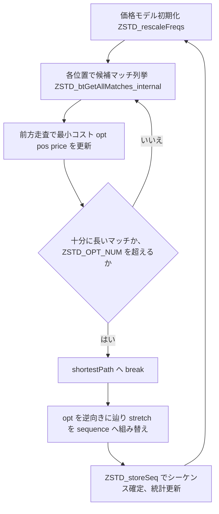

# 第18章 optimal parser：コストモデルに基づく最適解探索

> **本章で読むソース**
>
> - [`lib/compress/zstd_opt.c`](https://github.com/facebook/zstd/blob/v1.5.7/lib/compress/zstd_opt.c)
> - [`lib/compress/zstd_compress_internal.h`](https://github.com/facebook/zstd/blob/v1.5.7/lib/compress/zstd_compress_internal.h)

## この章の狙い

第16章と第17章で見た fast/double-fast、lazy、行ベースマッチファインダーは、いずれも各位置で見つけたマッチをその場で採用するかどうかを判断する。
判断基準は「今すぐ使えるマッチが十分長いか」という局所的な条件であり、その先の数バイトを見て損得を比較することはしない。

**optimal parser**（btopt/btultra 系のブロック圧縮関数が呼び出す `ZSTD_compressBlock_opt_generic`）は、この判断を動的計画法に置き換える。
ブロック中のある範囲について、各位置に到達するまでの最小コストを表に埋めていき、表が確定してから最小コストの経路を逆算してシーケンス列を確定する。
コストは実際のエントロピー符号化で消費されるビット数の見積もりであり、頻度統計から作った**価格モデル**にもとづく。
本章では、この価格モデルの構築から、動的計画法の表の埋め方、そして最短経路の復元までを順に追う。

## 前提

optimal parser が扱うマッチ候補は、binary tree によるマッチファインダー（`ZSTD_insertBt1` と `ZSTD_btGetAllMatches_internal`）が列挙する。
ハッシュチェーンを辿って最初に見つかった長いマッチだけを使う lazy 系のマッチファインダーと異なり、binary tree は各位置で得られる長さの異なる複数のマッチをまとめて返す。
動的計画法は、この複数候補のどれを採用するかを含めて最適解を探すため、マッチ候補が1個しかなければ最適化の余地もない。
binary tree による全マッチ列挙が、動的計画法の入力を用意する役目を担っている。

## 価格モデル：頻度をビットコストに変換する

動的計画法で経路を比較するには、リテラルとシーケンスの構成要素（リテラル長、マッチ長、オフセット）それぞれに、ビット単位のコストを割り当てる必要がある。
`optState_t` は、この価格モデルの元になる頻度統計（`litFreq` などのシンボル出現頻度テーブル）を保持する。

[`lib/compress/zstd_compress_internal.h` L226-236](https://github.com/facebook/zstd/blob/v1.5.7/lib/compress/zstd_compress_internal.h#L226-L236)

```c
#define ZSTD_OPT_SIZE (ZSTD_OPT_NUM+3)
typedef struct {
    /* All tables are allocated inside cctx->workspace by ZSTD_resetCCtx_internal() */
    unsigned* litFreq;           /* table of literals statistics, of size 256 */
    unsigned* litLengthFreq;     /* table of litLength statistics, of size (MaxLL+1) */
    unsigned* matchLengthFreq;   /* table of matchLength statistics, of size (MaxML+1) */
    unsigned* offCodeFreq;       /* table of offCode statistics, of size (MaxOff+1) */
    ZSTD_match_t* matchTable;    /* list of found matches, of size ZSTD_OPT_SIZE */
    ZSTD_optimal_t* priceTable;  /* All positions tracked by optimal parser, of size ZSTD_OPT_SIZE */

    U32  litSum;                 /* nb of literals */
```

頻度からビットコストへの変換は `ZSTD_fracWeight`（`ZSTD_bitWeight` の小数ビット版）が行う。

[`lib/compress/zstd_opt.c` L53-64](https://github.com/facebook/zstd/blob/v1.5.7/lib/compress/zstd_opt.c#L53-L64)

```c
/* ZSTD_fracWeight() :
 * provide fractional-bit "cost" of a stat,
 * using linear interpolation approximation */
MEM_STATIC U32 ZSTD_fracWeight(U32 rawStat)
{
    U32 const stat = rawStat + 1;
    U32 const hb = ZSTD_highbit32(stat);
    U32 const BWeight = hb * BITCOST_MULTIPLIER;
    /* Fweight was meant for "Fractional weight"
     * but it's effectively a value between 1 and 2
     * using fixed point arithmetic */
    U32 const FWeight = (stat << BITCOST_ACCURACY) >> hb;
    U32 const weight = BWeight + FWeight;
    assert(hb + BITCOST_ACCURACY < 31);
    return weight;
}
```

`-log2(p)` に相当する値を、シンボル頻度 `stat` の最上位ビット位置 `hb`（整数部）と、そこからの線形補間（小数部 `FWeight`）で近似している。
FSE の tANS がテーブル引きだけで分数ビット長の符号化を実現していたのと同じ発想であり、ここでは符号化そのものではなく「符号化にかかるコストの見積もり」に使っている。
`BITCOST_MULTIPLIER`（`1 << BITCOST_ACCURACY`、既定で256倍）を掛けて固定小数点の整数として扱うことで、以降のコスト比較を整数演算だけで行える。

頻度テーブルの初期化と更新は `ZSTD_rescaleFreqs` が担う。

[`lib/compress/zstd_opt.c` L133-144](https://github.com/facebook/zstd/blob/v1.5.7/lib/compress/zstd_opt.c#L133-L144)

```c
/* ZSTD_rescaleFreqs() :
 * if first block (detected by optPtr->litLengthSum == 0) : init statistics
 *    take hints from dictionary if there is one
 *    and init from zero if there is none,
 *    using src for literals stats, and baseline stats for sequence symbols
 * otherwise downscale existing stats, to be used as seed for next block.
 */
static void
ZSTD_rescaleFreqs(optState_t* const optPtr,
            const BYTE* const src, size_t const srcSize,
                  int const optLevel)
{
```

ブロックの最初の呼び出しでは、辞書があれば辞書の Huffman/FSE テーブルから頻度を逆算し、なければリテラルは入力の実測頻度、シーケンス側は決め打ちの初期分布（`baseLLfreqs` など）を使う。
2ブロック目以降は、前ブロックで `ZSTD_updateStats` によって蓄積した頻度をそのまま使わず、`ZSTD_scaleStats` で縮小してから引き継ぐ。

[`lib/compress/zstd_opt.c` L123-136](https://github.com/facebook/zstd/blob/v1.5.7/lib/compress/zstd_opt.c#L123-L136)

```c
/* ZSTD_scaleStats() :
 * reduce all elt frequencies in table if sum too large
 * return the resulting sum of elements */
static U32 ZSTD_scaleStats(unsigned* table, U32 lastEltIndex, U32 logTarget)
{
    U32 const prevsum = sum_u32(table, lastEltIndex+1);
    U32 const factor = prevsum >> logTarget;
    DEBUGLOG(5, "ZSTD_scaleStats (nbElts=%u, target=%u)", (unsigned)lastEltIndex+1, (unsigned)logTarget);
    assert(logTarget < 30);
    if (factor <= 1) return prevsum;
    return ZSTD_downscaleStats(table, lastEltIndex, ZSTD_highbit32(factor), base_1guaranteed);
}
```

頻度の合計が大きくなるほど、1回の出現増分（`ZSTD_updateStats` の `+1` や `+ZSTD_LITFREQ_ADD`）が全体比で小さくなり、新しいブロックの統計変化を反映しにくくなる。
`ZSTD_scaleStats` は合計が目標値（`1 << logTarget`）を超えたぶんだけ全シンボルを同じ比率で縮小し、直近の傾向に追従しやすい状態を保ったまま前ブロックの統計を引き継ぐ。

## リテラルとシーケンスのビット価格

シンボルごとの頻度テーブルが揃うと、リテラル列のコストは `ZSTD_rawLiteralsCost` で求める。

[`lib/compress/zstd_opt.c` L280-289](https://github.com/facebook/zstd/blob/v1.5.7/lib/compress/zstd_opt.c#L280-L289)

```c
    /* dynamic statistics */
    {   U32 price = optPtr->litSumBasePrice * litLength;
        U32 const litPriceMax = optPtr->litSumBasePrice - BITCOST_MULTIPLIER;
        U32 u;
        assert(optPtr->litSumBasePrice >= BITCOST_MULTIPLIER);
        for (u=0; u < litLength; u++) {
            U32 litPrice = WEIGHT(optPtr->litFreq[literals[u]], optLevel);
            if (UNLIKELY(litPrice > litPriceMax)) litPrice = litPriceMax;
            price -= litPrice;
        }
        return price;
    }
```

`litSumBasePrice`（頻度合計 `litSum` 自体のビット価格）からシンボルごとの `WEIGHT` を差し引く形になっているのは、`-log2(freq/sum)` を `-log2(freq) + log2(sum)` に分解しているためである。
`log2(sum)` の部分をあらかじめ `ZSTD_setBasePrices` で計算しておき、シンボルごとには `WEIGHT(freq)` の引き算だけで済ませることで、リテラル1バイトごとの計算をテーブル引きと減算に抑えている。

マッチのコストは `ZSTD_getMatchPrice` が、オフセットとマッチ長のそれぞれについて同じ考え方でビット価格を積み上げる。

[`lib/compress/zstd_opt.c` L323-351](https://github.com/facebook/zstd/blob/v1.5.7/lib/compress/zstd_opt.c#L323-L351)

```c
FORCE_INLINE_TEMPLATE U32
ZSTD_getMatchPrice(U32 const offBase,
                   U32 const matchLength,
             const optState_t* const optPtr,
                   int const optLevel)
{
    U32 price;
    U32 const offCode = ZSTD_highbit32(offBase);
    U32 const mlBase = matchLength - MINMATCH;
    assert(matchLength >= MINMATCH);

    if (optPtr->priceType == zop_predef)  /* fixed scheme, does not use statistics */
        return WEIGHT(mlBase, optLevel)
             + ((16 + offCode) * BITCOST_MULTIPLIER); /* emulated offset cost */

    /* dynamic statistics */
    price = (offCode * BITCOST_MULTIPLIER) + (optPtr->offCodeSumBasePrice - WEIGHT(optPtr->offCodeFreq[offCode], optLevel));
    if ((optLevel<2) /*static*/ && offCode >= 20)
        price += (offCode-19)*2 * BITCOST_MULTIPLIER; /* handicap for long distance offsets, favor decompression speed */

    /* match Length */
    {   U32 const mlCode = ZSTD_MLcode(mlBase);
        price += (ML_bits[mlCode] * BITCOST_MULTIPLIER) + (optPtr->matchLengthSumBasePrice - WEIGHT(optPtr->matchLengthFreq[mlCode], optLevel));
    }

    price += BITCOST_MULTIPLIER / 5;   /* heuristic : make matches a bit more costly to favor less sequences -> faster decompression speed */

    DEBUGLOG(8, "ZSTD_getMatchPrice(ml:%u) = %u", matchLength, price);
    return price;
}
```

コードの値そのもの（`offCode` ビット数分、`ML_bits[mlCode]` ビット分）を extra bits の実コストとして加え、そのコードが選ばれる確率にあたる FSE シンボルの価格を別枠で加算する。
これは FSE がシンボルの価格を「コード」と「コードに付随する追加ビット」に分けて符号化する構造（第14章）をそのままコストモデルに反映したものである。
`optLevel<2` かつオフセットが大きいときに追加コストを課す分岐は、圧縮率だけを見れば不要な調整だが、大きなオフセットの復号は参照先がキャッシュに乗りにくく遅くなりがちなため、圧縮側であえて長距離オフセットを避けるように仕向けている。

## binary tree による全マッチ列挙

各位置で比較すべき候補を用意するのが `ZSTD_btGetAllMatches_internal` である。

[`lib/compress/zstd_opt.c` L832-849](https://github.com/facebook/zstd/blob/v1.5.7/lib/compress/zstd_opt.c#L832-L849)

```c
FORCE_INLINE_TEMPLATE
ZSTD_ALLOW_POINTER_OVERFLOW_ATTR
U32 ZSTD_btGetAllMatches_internal(
        ZSTD_match_t* matches,
        ZSTD_MatchState_t* ms,
        U32* nextToUpdate3,
        const BYTE* ip,
        const BYTE* const iHighLimit,
        const U32 rep[ZSTD_REP_NUM],
        U32 const ll0,
        U32 const lengthToBeat,
        const ZSTD_dictMode_e dictMode,
        const U32 mls)
{
    assert(BOUNDED(3, ms->cParams.minMatch, 6) == mls);
    DEBUGLOG(8, "ZSTD_BtGetAllMatches(dictMode=%d, mls=%u)", (int)dictMode, mls);
    if (ip < ms->window.base + ms->nextToUpdate)
        return 0;   /* skipped area */
    ZSTD_updateTree_internal(ms, ip, iHighLimit, mls, dictMode);
    return ZSTD_insertBtAndGetAllMatches(matches, ms, nextToUpdate3, ip, iHighLimit, dictMode, rep, ll0, lengthToBeat, mls);
}
```

木の更新自体は `ZSTD_insertBt1` が担う。
各ハッシュバケットの衝突列を二分木として管理し、挿入位置を new node として木に通しながら、既存ノードとの共通接頭辞長でその都度左右どちらの部分木に属するかを振り分ける。

[`lib/compress/zstd_opt.c` L482-486](https://github.com/facebook/zstd/blob/v1.5.7/lib/compress/zstd_opt.c#L482-L486)

```c
    DEBUGLOG(8, "ZSTD_insertBt1 (%u)", curr);

    assert(curr <= target);
    assert(ip <= iend-8);   /* required for h calculation */
    hashTable[h] = curr;   /* Update Hash Table */
```

ハッシュチェーンは新しい挿入のたびに列全体を走査する必要があるのに対し、二分探索木は挿入と探索を `O(log n)` に近い比較回数で行える。
`nbCompares`（`1 << searchLog`）で比較回数の上限を切ってはいるが、木構造そのものが同じ探索深さでより多くの候補と共通接頭辞長を比較できる点が、lazy 系のハッシュチェーンに対する binary tree の優位点である。
`ZSTD_insertBt1` は挿入と同時に、現在位置からの最長共通接頭辞長 `bestLength` も更新しており、`ZSTD_insertBtAndGetAllMatches` はこの過程で見つかったマッチのうち、それまでの最長マッチより長いものだけを `matches[]` に残す。
結果として `matches[]` には、マッチ長が短い順に並び、かつオフセットも長さが伸びるほど大きくなる候補列が得られる。

## 動的計画法：各位置への最小コスト経路

`ZSTD_compressBlock_opt_generic` は、この候補列を使って各相対位置 `opt[pos]` に「その位置まで到達する最小コスト」を埋めていく。
まず先頭位置の初期化と、最初のマッチ候補による価格の書き込みを行う。

[`lib/compress/zstd_opt.c` L1166-1191](https://github.com/facebook/zstd/blob/v1.5.7/lib/compress/zstd_opt.c#L1166-L1191)

```c
            {   U32 pos;
                U32 matchNb;
                for (pos = 1; pos < minMatch; pos++) {
                    opt[pos].price = ZSTD_MAX_PRICE;
                    opt[pos].mlen = 0;
                    opt[pos].litlen = litlen + pos;
                }
                for (matchNb = 0; matchNb < nbMatches; matchNb++) {
                    U32 const offBase = matches[matchNb].off;
                    U32 const end = matches[matchNb].len;
                    for ( ; pos <= end ; pos++ ) {
                        int const matchPrice = (int)ZSTD_getMatchPrice(offBase, pos, optStatePtr, optLevel);
                        int const sequencePrice = opt[0].price + matchPrice;
                        DEBUGLOG(7, "rPos:%u => set initial price : %.2f",
                                    pos, ZSTD_fCost(sequencePrice));
                        opt[pos].mlen = pos;
                        opt[pos].off = offBase;
                        opt[pos].litlen = 0; /* end of match */
                        opt[pos].price = sequencePrice + LL_PRICE(0);
                    }
                }
                last_pos = pos-1;
                opt[pos].price = ZSTD_MAX_PRICE;
            }
```

続く `for (cur = 1; cur <= last_pos; cur++)` のループが動的計画法の本体である。
各 `cur` について、まず「1つ前の位置にリテラルを1バイト足す」経路と比較する。

[`lib/compress/zstd_opt.c` L1207-1216](https://github.com/facebook/zstd/blob/v1.5.7/lib/compress/zstd_opt.c#L1207-L1216)

```c
            {   U32 const litlen = opt[cur-1].litlen + 1;
                int const price = opt[cur-1].price
                                + LIT_PRICE(ip+cur-1)
                                + LL_INCPRICE(litlen);
                assert(price < 1000000000); /* overflow check */
                if (price <= opt[cur].price) {
                    ZSTD_optimal_t const prevMatch = opt[cur];
                    DEBUGLOG(7, "cPos:%i==rPos:%u : better price (%.2f<=%.2f) using literal (ll==%u) (hist:%u,%u,%u)",
                                (int)(inr-istart), cur, ZSTD_fCost(price), ZSTD_fCost(opt[cur].price), litlen,
                                opt[cur-1].rep[0], opt[cur-1].rep[1], opt[cur-1].rep[2]);
```

そのうえで、`cur` の位置から新たに得られるマッチ候補それぞれについて、マッチ長を伸ばしながら到達位置ごとのコストを計算し、既存の `opt[pos].price` より安ければ上書きする。

[`lib/compress/zstd_opt.c` L1300-1327](https://github.com/facebook/zstd/blob/v1.5.7/lib/compress/zstd_opt.c#L1300-L1327)

```c
                for (matchNb = 0; matchNb < nbMatches; matchNb++) {
                    U32 const offset = matches[matchNb].off;
                    U32 const lastML = matches[matchNb].len;
                    U32 const startML = (matchNb>0) ? matches[matchNb-1].len+1 : minMatch;
                    U32 mlen;

                    DEBUGLOG(7, "testing match %u => offBase=%4u, mlen=%2u, llen=%2u",
                                matchNb, matches[matchNb].off, lastML, opt[cur].litlen);

                    for (mlen = lastML; mlen >= startML; mlen--) {  /* scan downward */
                        U32 const pos = cur + mlen;
                        int const price = basePrice + (int)ZSTD_getMatchPrice(offset, mlen, optStatePtr, optLevel);

                        if ((pos > last_pos) || (price < opt[pos].price)) {
                            DEBUGLOG(7, "rPos:%u (ml=%2u) => new better price (%.2f<%.2f)",
                                        pos, mlen, ZSTD_fCost(price), ZSTD_fCost(opt[pos].price));
                            while (last_pos < pos) {
                                /* fill empty positions, for future comparisons */
                                last_pos++;
                                opt[last_pos].price = ZSTD_MAX_PRICE;
                                opt[last_pos].litlen = !0;  /* just needs to be != 0, to mean "not an end of match" */
                            }
                            opt[pos].mlen = mlen;
                            opt[pos].off = offset;
                            opt[pos].litlen = 0;
                            opt[pos].price = price;
                        } else {
                            DEBUGLOG(7, "rPos:%u (ml=%2u) => new price is worse (%.2f>=%.2f)",
                                        pos, mlen, ZSTD_fCost(price), ZSTD_fCost(opt[pos].price));
                            if (optLevel==0) break;  /* early update abort; gets ~+10% speed for about -0.01 ratio loss */
                        }
            }   }   }
```

`opt[pos]` はマッチの終端位置ごとに1つだけ保持される最良解であり、「1バイトのリテラルを足す経路」と「マッチで飛ぶ経路」のうち、実測頻度から見積もったビットコストがより小さいほうがそのつど採用される。
`ZSTD_OPT_NUM`（`1<<12`、4096バイト）を超える範囲は1回の前方走査で扱いきれないため、`sufficient_len` を超える十分に長いマッチが見つかった時点で `goto _shortestPath` によって打ち切り、その先は別の走査で扱う。
貪欲な手法がその場でマッチを確定するのに対し、この表は「あるバイトを短いマッチと1バイトのリテラルの組み合わせで飛ばす」か「長いマッチでまとめて飛ばす」かを、その後の数千バイト分の候補を見てから選べる点で局所最適に陥りにくい。

## 最短経路の復元とシーケンス確定

`for` ループを抜けると、`opt[last_pos]` から逆向きに辿ることで最小コスト経路を復元する。

[`lib/compress/zstd_opt.c` L1340-1342](https://github.com/facebook/zstd/blob/v1.5.7/lib/compress/zstd_opt.c#L1340-L1342)

```c
        lastStretch = opt[last_pos];
        assert(cur >= lastStretch.mlen);
        cur = last_pos - lastStretch.mlen;
```

前方走査の間、`opt[pos]` は「マッチとその直後に続くリテラルの並び」（コード中のコメントでいう **stretch**）を記録している。
逆向きに辿るときは、これを「リテラルとその後のマッチ」という通常の**シーケンス**の並びに組み替える必要がある。

[`lib/compress/zstd_opt.c` L1395-1409](https://github.com/facebook/zstd/blob/v1.5.7/lib/compress/zstd_opt.c#L1395-L1409)

```c
            while (1) {
                ZSTD_optimal_t nextStretch = opt[stretchPos];
                opt[storeStart].litlen = nextStretch.litlen;
                DEBUGLOG(6, "selected sequence (llen=%u,mlen=%u,ofc=%u)",
                            opt[storeStart].litlen, opt[storeStart].mlen, opt[storeStart].off);
                if (nextStretch.mlen == 0) {
                    /* reaching beginning of segment */
                    break;
                }
                storeStart--;
                opt[storeStart] = nextStretch; /* note: litlen will be fixed */
                assert(nextStretch.litlen + nextStretch.mlen <= stretchPos);
                stretchPos -= nextStretch.litlen + nextStretch.mlen;
            }
```

組み替えが終わった範囲を先頭から辿り、`ZSTD_updateStats` で頻度統計を更新しながら `ZSTD_storeSeq` で `seqStore` にシーケンスとして書き出す。

[`lib/compress/zstd_opt.c` L1427-1431](https://github.com/facebook/zstd/blob/v1.5.7/lib/compress/zstd_opt.c#L1427-L1431)

```c
                    assert(anchor + llen <= iend);
                    ZSTD_updateStats(optStatePtr, llen, anchor, offBase, mlen);
                    ZSTD_storeSeq(seqStore, llen, anchor, iend, offBase, mlen);
                    anchor += advance;
                    ip = anchor;
```

書き出したシーケンスの分だけ頻度が変わるため、この直後に `ZSTD_setBasePrices` を呼び直して価格モデルを更新し、次の前方走査に備える。
1回のブロック圧縮の中で、このコスト再計算つきの前方走査と最短経路の復元を、ブロックの終わりまで繰り返す。



## まとめ

optimal parser は、リテラルとシーケンス構成要素それぞれの実測頻度からビット単位の価格を見積もり、binary tree が列挙する複数のマッチ候補を使って、ブロック中の各位置への最小コスト経路を動的計画法で埋めていく。
埋め終えた表を終端から逆向きに辿ることで、局所的な貪欲選択では届かない大域的な最小コストのシーケンス列を得る。
FSE の符号化と同じ「頻度分布からあらかじめ計算を尽くしておき、本体はテーブル参照で済ませる」という発想を、符号化そのものではなくコストモデルの構築に転用している点が、この章の最適化の核である。

## 関連する章

- [第14章 シーケンスの符号化](../part03-compress-core/14-sequences-encoding.md)
- [第16章 fast/double-fast マッチファインダー](16-fast-doublefast.md)
- [第17章 lazy と行ベースマッチファインダー](17-lazy-row.md)
