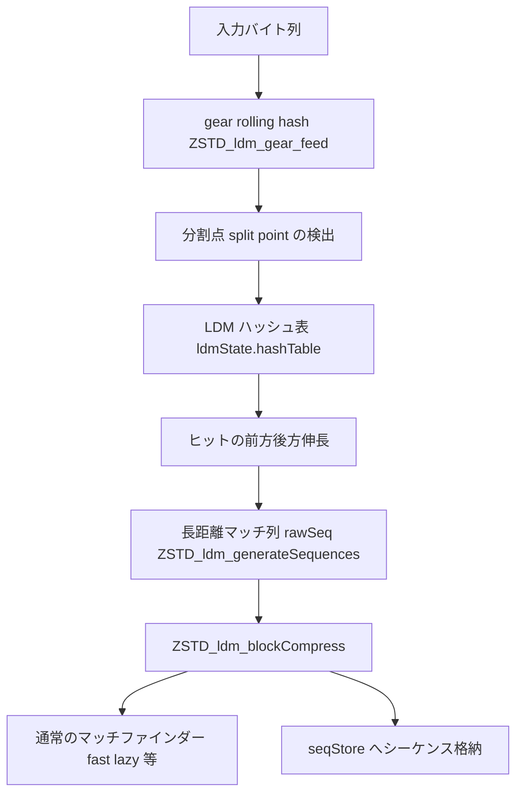

# 第19章 LDM：長距離マッチの事前検出

> **本章で読むソース**
>
> - [`lib/compress/zstd_ldm.c`](https://github.com/facebook/zstd/blob/v1.5.7/lib/compress/zstd_ldm.c)
> - [`lib/compress/zstd_ldm.h`](https://github.com/facebook/zstd/blob/v1.5.7/lib/compress/zstd_ldm.h)
> - [`lib/compress/zstd_ldm_geartab.h`](https://github.com/facebook/zstd/blob/v1.5.7/lib/compress/zstd_ldm_geartab.h)

## この章の狙い

第16〜18章で見た fast、double fast、lazy、行ベース、optimal parser はいずれも、マッチファインダーが辞書として保持できる範囲、すなわちウィンドウ内の近い位置のマッチを探す仕組みだった。
ウィンドウを大きく取れば理屈のうえでは遠いマッチも拾えるが、それらのマッチファインダーが使うハッシュテーブルはウィンドウの全バイト位置を密に登録するため、ウィンドウを広げるほどメモリと探索コストが線形に増える。
**LDM**（Long Distance Matching）は、この密な登録をやめ、粗い間隔でしか登録しない別のハッシュテーブルを使うことで、数百MB単位のウィンドウでも安価に長距離のマッチを見つける仕組みである。

本章では、LDM が入力をどう間引いてハッシュ化するか、見つけたマッチをどう「シーケンス」として先に確定させるか、そして確定させたシーケンスを通常のマッチファインダーにどう橋渡しするかを、実装に沿って読む。

## 前提

LDM は圧縮パイプラインの中で独立した前段として動く。
`ZSTD_buildSeqStore`（`zstd_compress.c`）は、LDM が有効なとき、ブロックを通常のマッチファインダーに渡す前に `ZSTD_ldm_generateSequences` を呼び、入力全体を先に粗く走査させる。

[`lib/compress/zstd_compress.c` L3326-L3350](https://github.com/facebook/zstd/blob/v1.5.7/lib/compress/zstd_compress.c#L3326-L3350)

```c
        } else if (zc->appliedParams.ldmParams.enableLdm == ZSTD_ps_enable) {
            RawSeqStore_t ldmSeqStore = kNullRawSeqStore;
            // ... (中略) ...
            ldmSeqStore.seq = zc->ldmSequences;
            ldmSeqStore.capacity = zc->maxNbLdmSequences;
            /* Updates ldmSeqStore.size */
            FORWARD_IF_ERROR(ZSTD_ldm_generateSequences(&zc->ldmState, &ldmSeqStore,
                                               &zc->appliedParams.ldmParams,
                                               src, srcSize), "");
            /* Updates ldmSeqStore.pos */
            lastLLSize =
                ZSTD_ldm_blockCompress(&ldmSeqStore,
                                       ms, &zc->seqStore,
                                       zc->blockState.nextCBlock->rep,
                                       zc->appliedParams.useRowMatchFinder,
                                       src, srcSize);
            assert(ldmSeqStore.pos == ldmSeqStore.size);
```

`ZSTD_ldm_generateSequences` が長距離マッチを見つけて `rawSeq`（オフセット、マッチ長、リテラル長の3つ組）の列に変換し、`ZSTD_ldm_blockCompress` がそのシーケンス列とシーケンスの間のリテラル区間を、fast や lazy などの通常のマッチファインダー（`blockCompressor`）に渡す。
LDM は独自にブロックを圧縮するのではなく、通常のマッチファインダーが見逃す長距離のマッチだけを事前に確定させ、残りの区間を通常の処理に委ねる二段構成になっている。

全体の流れを図示すると次のようになる。



## gear rolling hash：粗い間隔でしか登録しない

LDM のハッシュ表に全バイト位置を登録すると、ウィンドウが大きいほどテーブルも巨大になり、ウィンドウ内のあらゆる位置でハッシュ計算が発生する。
LDM はこれを避けるため、コンテンツ依存の**ローリングハッシュ**（gear hash）で分割点を選び、平均して `2^hashRateLog` バイトに1回だけハッシュ表への登録を行う。

ローリングハッシュの状態は64ビットの `rolling` と、分割条件を表す `stopMask` の2つだけである。

[`lib/compress/zstd_ldm.c` L23-L26](https://github.com/facebook/zstd/blob/v1.5.7/lib/compress/zstd_ldm.c#L23-L26)

```c
typedef struct {
    U64 rolling;
    U64 stopMask;
} ldmRollingHashState_t;
```

1バイト進めるたびの更新は次の1行に集約されている。

[`lib/compress/zstd_ldm.c` L107-L109](https://github.com/facebook/zstd/blob/v1.5.7/lib/compress/zstd_ldm.c#L107-L109)

```c
#define GEAR_ITER_ONCE() do { \
        hash = (hash << 1) + ZSTD_ldm_gearTab[data[n] & 0xff]; \
        n += 1; \
```

`hash` を1ビット左シフトしたあと、次の入力バイトを添字にして `ZSTD_ldm_gearTab` という256エントリの64ビット乱数テーブル（`zstd_ldm_geartab.h`）を1つ加算する。
シフトと加算だけなので更新コストは1バイトあたり数命令で済み、しかも `hash` は直近64バイト分の入力に依存する値になる。
ビット `n` は直近 `n` バイト分の入力の影響しか受けないため、上位ビットほど長い履歴を反映する。
`ZSTD_ldm_gear_init` は、この性質を踏まえて `stopMask` をできるだけ上位ビット側に集めて作る。

[`lib/compress/zstd_ldm.c` L39-L57](https://github.com/facebook/zstd/blob/v1.5.7/lib/compress/zstd_ldm.c#L39-L57)

```c
    /* The choice of the splitting criterion is subject to two conditions:
     *   1. it has to trigger on average every 2^(hashRateLog) bytes;
     *   2. ideally, it has to depend on a window of minMatchLength bytes.
     *
     * In the gear hash algorithm, bit n depends on the last n bytes;
     * so in order to obtain a good quality splitting criterion it is
     * preferable to use bits with high weight.
     *
     * To match condition 1 we use a mask with hashRateLog bits set
     * and, because of the previous remark, we make sure these bits
     * have the highest possible weight while still respecting
     * condition 2.
     */
    if (hashRateLog > 0 && hashRateLog <= maxBitsInMask) {
        state->stopMask = (((U64)1 << hashRateLog) - 1) << (maxBitsInMask - hashRateLog);
    } else {
        /* In this degenerate case we simply honor the hash rate. */
        state->stopMask = ((U64)1 << hashRateLog) - 1;
    }
```

`ZSTD_ldm_gear_feed` は入力を1バイトずつ進めながら `hash & mask == 0` を判定し、成立した位置を分割点として `splits` 配列に記録する。

[`lib/compress/zstd_ldm.c` L107-L116](https://github.com/facebook/zstd/blob/v1.5.7/lib/compress/zstd_ldm.c#L107-L116)

```c
#define GEAR_ITER_ONCE() do { \
        hash = (hash << 1) + ZSTD_ldm_gearTab[data[n] & 0xff]; \
        n += 1; \
        if (UNLIKELY((hash & mask) == 0)) { \
            splits[*numSplits] = n; \
            *numSplits += 1; \
            if (*numSplits == LDM_BATCH_SIZE) \
                goto done; \
        } \
    } while (0)
```

マスクの立っているビット数が `hashRateLog` なので、この条件は入力バイト列がランダムに近い限り平均で `2^hashRateLog` バイトに1回成立する。
分割点は入力の内容だけで決まり、直前の分割点からの距離には依存しない。
そのため、ファイルの途中にバイトが挿入・削除されても、その周辺を除けば同じ分割点の並びが再現される。
コンテンツ依存の分割は、固定間隔でサンプリングする方式に比べて、挿入や削除を含む差分を持つファイル同士でも同じマッチを見つけやすいという利点がある。

## LDM ハッシュ表への登録と衝突解決

分割点が見つかると、その直前 `minMatchLength` バイトを別のハッシュ関数（`XXH64`）でハッシュ化し、LDM 専用のハッシュ表 `ldmState.hashTable` に登録する。

[`lib/compress/zstd_ldm.c` L389-L399](https://github.com/facebook/zstd/blob/v1.5.7/lib/compress/zstd_ldm.c#L389-L399)

```c
        for (n = 0; n < numSplits; n++) {
            BYTE const* const split = ip + splits[n] - minMatchLength;
            U64 const xxhash = XXH64(split, minMatchLength, 0);
            U32 const hash = (U32)(xxhash & (((U32)1 << hBits) - 1));

            candidates[n].split = split;
            candidates[n].hash = hash;
            candidates[n].checksum = (U32)(xxhash >> 32);
            candidates[n].bucket = ZSTD_ldm_getBucket(ldmState, hash, params->bucketSizeLog);
            PREFETCH_L1(candidates[n].bucket);
        }
```

gear hash は分割点を選ぶためだけに使い、実際にハッシュ表へ登録するキーは `XXH64` を使い分ける2段構成である。
`xxhash` の下位ビットをテーブルのインデックスに、上位32ビットを衝突検出用の `checksum` に流用する。
テーブルの1エントリは32ビットの `offset` と32ビットの `checksum` だけで、`ldmEntry_t` は8バイトに収まる。

[`lib/compress/zstd_compress_internal.h` L323-L326](https://github.com/facebook/zstd/blob/v1.5.7/lib/compress/zstd_compress_internal.h#L323-L326)

```c
typedef struct {
    U32 offset;
    U32 checksum;
} ldmEntry_t;
```

同じハッシュ値を持つ複数の候補位置を保持できるように、ハッシュ表はバケット単位で管理する。
1バケットには `2^bucketSizeLog` 個のエントリが並び、挿入は次のエントリを上書きするリングバッファ式である。

[`lib/compress/zstd_ldm.c` L192-L204](https://github.com/facebook/zstd/blob/v1.5.7/lib/compress/zstd_ldm.c#L192-L204)

```c
static void ZSTD_ldm_insertEntry(ldmState_t* ldmState,
                                 size_t const hash, const ldmEntry_t entry,
                                 U32 const bucketSizeLog)
{
    BYTE* const pOffset = ldmState->bucketOffsets + hash;
    unsigned const offset = *pOffset;

    *(ZSTD_ldm_getBucket(ldmState, hash, bucketSizeLog) + offset) = entry;
    *pOffset = (BYTE)((offset + 1) & ((1u << bucketSizeLog) - 1));

}
```

ハッシュ表のインデックスに使うビット数 `hBits` はハッシュ表全体の対数サイズ `hashLog` からバケットの対数サイズ `bucketSizeLog` を引いた値であり、ハッシュ表1つあたりのサイズは `2^hashLog` エントリに固定される。
バイト位置を平均 `2^hashRateLog` 回に1回しか登録しないため、ウィンドウが大きくなってもハッシュ表のサイズを増やす必要はなく、ハッシュ表1つでウィンドウ全体をカバーできる。
つまりウィンドウサイズが増えても、密な登録を行う通常のマッチファインダーとは違い、LDM のメモリ使用量は `hashRateLog` を大きくする方向に調整するだけで一定に保てる。

## マッチの伸長とシーケンス化

`ZSTD_ldm_generateSequences_internal` は、分割点ごとにバケット内の候補エントリと `checksum` を比較し、一致した候補についてだけ実際のバイト比較でマッチ長を確認する。

[`lib/compress/zstd_ldm.c` L424-L462](https://github.com/facebook/zstd/blob/v1.5.7/lib/compress/zstd_ldm.c#L424-L462)

```c
            for (cur = bucket; cur < bucket + entsPerBucket; cur++) {
                size_t curForwardMatchLength, curBackwardMatchLength,
                       curTotalMatchLength;
                if (cur->checksum != checksum || cur->offset <= lowestIndex) {
                    continue;
                }
                // ... (中略) ...
                } else { /* !extDict */
                    BYTE const* const pMatch = base + cur->offset;
                    curForwardMatchLength = ZSTD_count(split, pMatch, iend);
                    if (curForwardMatchLength < minMatchLength) {
                        continue;
                    }
                    curBackwardMatchLength =
                        ZSTD_ldm_countBackwardsMatch(split, anchor, pMatch, lowPrefixPtr);
                }
                curTotalMatchLength = curForwardMatchLength + curBackwardMatchLength;

                if (curTotalMatchLength > bestMatchLength) {
                    bestMatchLength = curTotalMatchLength;
                    forwardMatchLength = curForwardMatchLength;
                    backwardMatchLength = curBackwardMatchLength;
                    bestEntry = cur;
                }
            }
```

`checksum` の一致で明らかなミスマッチを弾いてからバイト比較に入るため、ハッシュ表を粗くサンプリングしていても衝突によるバイト比較の無駄はバケット内に限られる。
一致が見つかった位置からは、分割点より後ろ（forward）だけでなく前（backward）にもマッチを伸ばし、分割点そのものより手前から始まるマッチも取りこぼさない。
バケット内の候補すべてを試して最長のマッチを選んだうえで、そのマッチを `rawSeq`（リテラル長、マッチ長、オフセットの3つ組）として `rawSeqStore` に積む。

[`lib/compress/zstd_ldm.c` L471-L484](https://github.com/facebook/zstd/blob/v1.5.7/lib/compress/zstd_ldm.c#L471-L484)

```c
            /* Match found */
            offset = (U32)(split - base) - bestEntry->offset;
            mLength = forwardMatchLength + backwardMatchLength;
            {
                rawSeq* const seq = rawSeqStore->seq + rawSeqStore->size;

                /* Out of sequence storage */
                if (rawSeqStore->size == rawSeqStore->capacity)
                    return ERROR(dstSize_tooSmall);
                seq->litLength = (U32)(split - backwardMatchLength - anchor);
                seq->matchLength = (U32)mLength;
                seq->offset = offset;
                rawSeqStore->size++;
            }
```

この時点で LDM は通常のマッチファインダーとは独立に、入力全体を1回走査してシーケンス列を作り終える。
オフセットに上限がないため、ウィンドウの一番古い位置と一番新しい位置の間のマッチでも、通常のマッチファインダーの探索範囲に関係なく見つけられる。

## 通常のマッチファインダーへの受け渡し：ZSTD_ldm_blockCompress

LDM が確定させたシーケンス列は、ブロック単位の圧縮ループの中で `ZSTD_ldm_blockCompress` によって通常のマッチファインダーへ受け渡される。
optimal parser（`ZSTD_btopt` 以上の `strategy`）のときは、LDM のシーケンスを確定情報としてそのまま採用するのではなく、あくまで候補として渡す。

[`lib/compress/zstd_ldm.c` L696-L704](https://github.com/facebook/zstd/blob/v1.5.7/lib/compress/zstd_ldm.c#L696-L704)

```c
    DEBUGLOG(5, "ZSTD_ldm_blockCompress: srcSize=%zu", srcSize);
    /* If using opt parser, use LDMs only as candidates rather than always accepting them */
    if (cParams->strategy >= ZSTD_btopt) {
        size_t lastLLSize;
        ms->ldmSeqStore = rawSeqStore;
        lastLLSize = blockCompressor(ms, seqStore, rep, src, srcSize);
        ZSTD_ldm_skipRawSeqStoreBytes(rawSeqStore, srcSize);
        return lastLLSize;
    }
```

optimal parser はコストモデルに基づいて短いマッチを併合するかどうかを判断できるため、LDM のシーケンスを強制せず自らの探索に統合する。
一方 fast や lazy などそれ以外の `strategy` では、LDM のシーケンスをそのまま確定として採用し、シーケンスとシーケンスの間のリテラル区間だけを通常のマッチファインダーに渡す。

[`lib/compress/zstd_ldm.c` L708-L738](https://github.com/facebook/zstd/blob/v1.5.7/lib/compress/zstd_ldm.c#L708-L738)

```c
    while (rawSeqStore->pos < rawSeqStore->size && ip < iend) {
        /* maybeSplitSequence updates rawSeqStore->pos */
        rawSeq const sequence = maybeSplitSequence(rawSeqStore,
                                                   (U32)(iend - ip), minMatch);
        /* End signal */
        if (sequence.offset == 0)
            break;

        assert(ip + sequence.litLength + sequence.matchLength <= iend);

        /* Fill tables for block compressor */
        ZSTD_ldm_limitTableUpdate(ms, ip);
        ZSTD_ldm_fillFastTables(ms, ip);
        /* Run the block compressor */
        DEBUGLOG(5, "pos %u : calling block compressor on segment of size %u", (unsigned)(ip-istart), sequence.litLength);
        {
            int i;
            size_t const newLitLength =
                blockCompressor(ms, seqStore, rep, ip, sequence.litLength);
            ip += sequence.litLength;
            /* Update the repcodes */
            for (i = ZSTD_REP_NUM - 1; i > 0; i--)
                rep[i] = rep[i-1];
            rep[0] = sequence.offset;
            /* Store the sequence */
            ZSTD_storeSeq(seqStore, newLitLength, ip - newLitLength, iend,
                          OFFSET_TO_OFFBASE(sequence.offset),
                          sequence.matchLength);
            ip += sequence.matchLength;
        }
    }
```

`blockCompressor` には第16〜17章で読んだ `ZSTD_compressBlock_fast` や lazy 系の関数がそのまま入り、LDM のシーケンスに挟まれたリテラル区間だけを通常の近距離探索で圧縮する。
`ZSTD_ldm_fillFastTables` は、この区間を fast や double fast のハッシュ表へも登録し直す。

[`lib/compress/zstd_ldm.c` L251-L283](https://github.com/facebook/zstd/blob/v1.5.7/lib/compress/zstd_ldm.c#L251-L283)

```c
static size_t ZSTD_ldm_fillFastTables(ZSTD_MatchState_t* ms,
                                      void const* end)
{
    const BYTE* const iend = (const BYTE*)end;

    switch(ms->cParams.strategy)
    {
    case ZSTD_fast:
        ZSTD_fillHashTable(ms, iend, ZSTD_dtlm_fast, ZSTD_tfp_forCCtx);
        break;

    case ZSTD_dfast:
#ifndef ZSTD_EXCLUDE_DFAST_BLOCK_COMPRESSOR
        ZSTD_fillDoubleHashTable(ms, iend, ZSTD_dtlm_fast, ZSTD_tfp_forCCtx);
#else
        assert(0); /* shouldn't be called: cparams should've been adjusted. */
#endif
        break;

    case ZSTD_greedy:
    case ZSTD_lazy:
    case ZSTD_lazy2:
    case ZSTD_btlazy2:
    case ZSTD_btopt:
    case ZSTD_btultra:
    case ZSTD_btultra2:
        break;
    default:
        assert(0);  /* not possible : not a valid strategy id */
    }

    return 0;
}
```

LDM がシーケンスとして確定させた区間はマッチファインダーの探索対象から外れるため、fast・double fast はこの関数でその区間のハッシュ登録だけを行い、実際の探索はしない。
lazy 系と bt 系はブロック圧縮関数自身がテーブル更新を行うので、ここでは何もしない。
こうして LDM は、遠距離の大きなマッチだけを事前に切り出し、残りの近距離の細かいマッチ探索は既存のマッチファインダーにそのまま委ねる分業になっている。

## 繰り返しパターンの早期打ち切り

同じバイトが大量に連続する入力（例えば0で埋めたファイル）では、1つのマッチが後続の分割点をまとめて飲み込むことがある。
`ZSTD_ldm_generateSequences_internal` は、見つけたマッチの終端がすでにハッシュ化し終えた範囲より先に進んでいる場合、ローリングハッシュの状態を作り直して、その終端から再開する。

[`lib/compress/zstd_ldm.c` L490-L505](https://github.com/facebook/zstd/blob/v1.5.7/lib/compress/zstd_ldm.c#L490-L505)

```c
            anchor = split + forwardMatchLength;

            /* If we find a match that ends after the data that we've hashed
             * then we have a repeating, overlapping, pattern. E.g. all zeros.
             * If one repetition of the pattern matches our `stopMask` then all
             * repetitions will. We don't need to insert them all into out table,
             * only the first one. So skip over overlapping matches.
             * This is a major speed boost (20x) for compressing a single byte
             * repeated, when that byte ends up in the table.
             */
            if (anchor > ip + hashed) {
                ZSTD_ldm_gear_reset(&hashState, anchor - minMatchLength, minMatchLength);
                /* Continue the outer loop at anchor (ip + hashed == anchor). */
                ip = anchor - hashed;
                break;
            }
```

コメントが述べるとおり、繰り返しパターンの1回分が `stopMask` に合致すれば、その繰り返し全部が同じ分割点を生成してしまう。
マッチが伸びた先まで一気に読み飛ばすことで、同じ内容の分割点を何度も登録する無駄を避け、単一バイトの繰り返しのような極端な入力での速度を大きく改善する。

## まとめ

LDM は、通常のマッチファインダーが密に登録するハッシュテーブルとは別に、gear rolling hash で選んだ分割点だけを粗く登録する専用のハッシュ表を持つ。
この間引きサンプリングにより、ハッシュ表のサイズをウィンドウサイズに比例させずに一定へ抑えられ、数百MB単位の大きなウィンドウでも長距離のマッチを低メモリ・低コストで検出できる。
見つけたマッチは `rawSeq` の列として先に確定させ、optimal parser には候補として渡し、fast や lazy などそれ以外のマッチファインダーには確定シーケンスとして渡す。
シーケンスの間に残ったリテラル区間は、通常のマッチファインダーが近距離のマッチ探索を続けて処理する。

## 関連する章

- [第16章 fast と double fast](16-fast-doublefast.md)
- [第17章 lazy と行ベースマッチファインダー](17-lazy-row.md)
- [第18章 optimal parser](18-optimal-parser.md)
- [第11章 CCtx パラメーター](../part03-compress-core/11-cctx-params.md)
- [第21章 ZSTDMT](../part05-mt/21-zstdmt.md)
</content>
