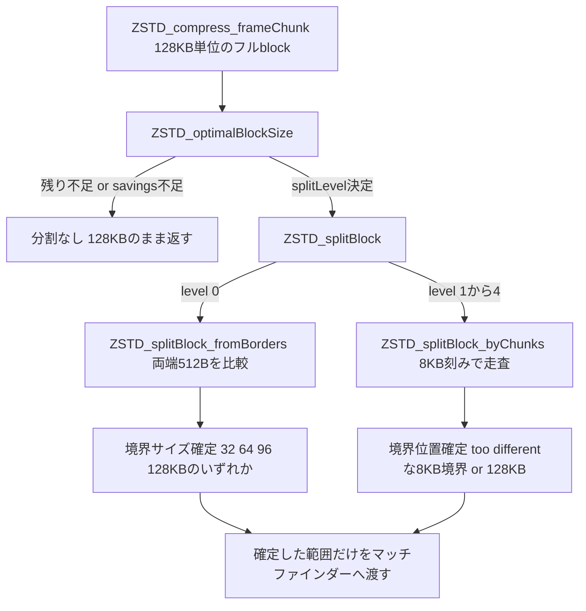

# 第20章 ブロック分割：preSplitter

> **本章で読むソース**
>
> - [`lib/compress/zstd_preSplit.c`](https://github.com/facebook/zstd/blob/v1.5.7/lib/compress/zstd_preSplit.c)
> - [`lib/compress/zstd_preSplit.h`](https://github.com/facebook/zstd/blob/v1.5.7/lib/compress/zstd_preSplit.h)
> - [`lib/compress/zstd_compress.c`](https://github.com/facebook/zstd/blob/v1.5.7/lib/compress/zstd_compress.c)（`ZSTD_optimalBlockSize`、`ZSTD_compress_frameChunk`）
> - [`lib/compress/zstd_compress_internal.h`](https://github.com/facebook/zstd/blob/v1.5.7/lib/compress/zstd_compress_internal.h)
> - [`lib/zstd.h`](https://github.com/facebook/zstd/blob/v1.5.7/lib/zstd.h)（`ZSTD_c_blockSplitterLevel`、`ZSTD_c_splitAfterSequences`）

## この章の狙い

第12章で見たとおり、zstdの圧縮blockは最大でも128KBまでしか扱えない。
入力がこれより大きければ、必ず複数のblockに切り分けて順に圧縮する。

この章では、blockの境界をどこに置くかを決める`ZSTD_splitBlock`とその実装（`zstd_preSplit.c`）を読む。
128KBちょうどで機械的に区切るのではなく、入力データの統計的な性質が変わる位置を探して、そこをblock境界にする仕組みである。
マッチファインダーが動く前の段階で境界を決めることから、zstdの内部ではこれを**preBlockSplitter**（前段の分割器）と呼ぶ。

## 前提：blockを分ける動機

1個のblockは、リテラルとシーケンスをそれぞれ1組のエントロピーテーブル（Huffman・FSEの正規化カウント）で符号化する。
入力の前半と後半で出現バイトの分布が大きく異なる場合、1組のテーブルは両方に対して中途半端にしか適合しない。
境界をデータの性質が変わる位置に置けば、各blockが持つテーブルをその区間の分布へ寄せて作れるため、テーブル自体の符号化コストと、そこから生成される符号語の長さの両方を短くできる。
これが本章で説明する最適化の核心であり、`zstd_preSplit.c`のコメントが「too different」と呼ぶ判定はこの分布の変わり目を検出するための処理である。

zstdには境界を決める仕組みが2段階ある。

[`lib/compress/zstd_compress_internal.h` L400-L411](https://github.com/facebook/zstd/blob/v1.5.7/lib/compress/zstd_compress_internal.h#L400-L411)

```c
    /* Block splitting
     * @postBlockSplitter executes split analysis after sequences are produced,
     * it's more accurate but consumes more resources.
     * @preBlockSplitter_level splits before knowing sequences,
     * it's more approximative but also cheaper.
     * Valid @preBlockSplitter_level values range from 0 to 6 (included).
     * 0 means auto, 1 means do not split,
     * then levels are sorted in increasing cpu budget, from 2 (fastest) to 6 (slowest).
     * Highest @preBlockSplitter_level combines well with @postBlockSplitter.
     */
    ZSTD_ParamSwitch_e postBlockSplitter;
    int preBlockSplitter_level;
```

**postBlockSplitter**は、マッチファインダーがシーケンスを生成し終えたあとに、そのシーケンス列を見て分割位置を決める（`ZSTD_compressBlock_splitBlock`）。
実際の符号化コストに基づく分、精度は高いがコストも重い。
一方、本章で扱う**preBlockSplitter**は、マッチファインダーを動かす前の生バイト列だけを見て分割位置を決める。
シーケンスを知らない分だけ近似的だが、計算コストは軽い。
両者は排他ではなく、`preBlockSplitter_level`を高くしたうえで`postBlockSplitter`も有効にすると、粗く割った各断片をさらに細かく割り直せる。

## 二種類の探索戦略：byChunksとfromBorders

`ZSTD_splitBlock`は、`level`引数によって2つの実装のどちらかへ処理を振り分ける。

[`lib/compress/zstd_preSplit.c` L228-L238](https://github.com/facebook/zstd/blob/v1.5.7/lib/compress/zstd_preSplit.c#L228-L238)

```c
size_t ZSTD_splitBlock(const void* blockStart, size_t blockSize,
                    int level,
                    void* workspace, size_t wkspSize)
{
    DEBUGLOG(6, "ZSTD_splitBlock (level=%i)", level);
    assert(0<=level && level<=4);
    if (level == 0)
        return ZSTD_splitBlock_fromBorders(blockStart, blockSize, workspace, wkspSize);
    /* level >= 1*/
    return ZSTD_splitBlock_byChunks(blockStart, blockSize, level-1, workspace, wkspSize);
}
```

`level`が0のときは`ZSTD_splitBlock_fromBorders`という、blockの両端だけを比較する軽量な戦略を使う。
1以上のときは`ZSTD_splitBlock_byChunks`が、blockの先頭から8KB単位で統計を積み上げながら境界を探す、より精度の高い戦略を使う。
どちらも、統計の比較には同じ**Fingerprint**（指紋）という仕組みを共有する。

## 統計の指紋：Fingerprintとハッシュヒストグラム

`Fingerprint`は、入力の一部区間から2バイトの部分列をサンプリングし、そのハッシュ値ごとの出現回数を数えたヒストグラムである。

[`lib/compress/zstd_preSplit.c` L42-L49](https://github.com/facebook/zstd/blob/v1.5.7/lib/compress/zstd_preSplit.c#L42-L49)

```c
typedef struct {
  unsigned events[HASHTABLESIZE];
  size_t nbEvents;
} Fingerprint;
typedef struct {
    Fingerprint pastEvents;
    Fingerprint newEvents;
} FPStats;
```

`events[]`は各ハッシュ値の出現回数、`nbEvents`はサンプリングした総数である。
`FPStats`はこのFingerprintを2つ持ち、直前までの区間の統計（`pastEvents`）と、いま調べている区間の統計（`newEvents`）を並べて比較できるようにしている。

ハッシュ値の計算は`hash2`が担う。

[`lib/compress/zstd_preSplit.c` L33-L39](https://github.com/facebook/zstd/blob/v1.5.7/lib/compress/zstd_preSplit.c#L33-L39)

```c
FORCE_INLINE_TEMPLATE unsigned hash2(const void *p, unsigned hashLog)
{
    assert(hashLog >= 8);
    if (hashLog == 8) return (U32)((const BYTE*)p)[0];
    assert(hashLog <= HASHLOG_MAX);
    return (U32)(MEM_read16(p)) * KNUTH >> (32 - hashLog);
}
```

2バイトを`KNUTH`（`0x9e3779b9`、フィボナッチハッシュの乗数）倍して上位ビットを取り出す、乗算ハッシュである。
`hashLog`が8のときは、ハッシュ計算そのものを省いて1バイト目をそのままインデックスに使う。
この分岐は、後述する`ZSTD_splitBlock_byChunks`が精度の低いレベルほど1バイトヒストグラムに切り替えて計算量を落とすために使われる。

ヒストグラムの集計は、区間全体を舐めるのではなく`samplingRate`ぶんおきに間引いてサンプリングする。

[`lib/compress/zstd_preSplit.c` L56-L67](https://github.com/facebook/zstd/blob/v1.5.7/lib/compress/zstd_preSplit.c#L56-L67)

```c
FORCE_INLINE_TEMPLATE void
addEvents_generic(Fingerprint* fp, const void* src, size_t srcSize, size_t samplingRate, unsigned hashLog)
{
    const char* p = (const char*)src;
    size_t limit = srcSize - HASHLENGTH + 1;
    size_t n;
    assert(srcSize >= HASHLENGTH);
    for (n = 0; n < limit; n+=samplingRate) {
        fp->events[hash2(p+n, hashLog)]++;
    }
    fp->nbEvents += limit/samplingRate;
}
```

`samplingRate`が大きいほど間引きが粗くなり、集計にかかる時間はサンプリングレートに反比例して減る。
`ZSTD_splitBlock_byChunks`は、`level`ごとに用意した`ZSTD_GEN_RECORD_FINGERPRINT`マクロ展開の関数（サンプリングレート1・5・11・43、ハッシュビット数10・10・9・8の4通り）を使い分け、`level`が低いほど粗いサンプリングで速く済ませる。

[`lib/compress/zstd_preSplit.c` L87-L90](https://github.com/facebook/zstd/blob/v1.5.7/lib/compress/zstd_preSplit.c#L87-L90)

```c
ZSTD_GEN_RECORD_FINGERPRINT(1, 10)
ZSTD_GEN_RECORD_FINGERPRINT(5, 10)
ZSTD_GEN_RECORD_FINGERPRINT(11, 9)
ZSTD_GEN_RECORD_FINGERPRINT(43, 8)
```

## エントロピー差分の見積り：fpDistanceとしきい値の減衰

2つのFingerprintがどれだけ違うかは`fpDistance`が数値化する。

[`lib/compress/zstd_preSplit.c` L95-L105](https://github.com/facebook/zstd/blob/v1.5.7/lib/compress/zstd_preSplit.c#L95-L105)

```c
static U64 fpDistance(const Fingerprint* fp1, const Fingerprint* fp2, unsigned hashLog)
{
    U64 distance = 0;
    size_t n;
    assert(hashLog <= HASHLOG_MAX);
    for (n = 0; n < ((size_t)1 << hashLog); n++) {
        distance +=
            abs64((S64)fp1->events[n] * (S64)fp2->nbEvents - (S64)fp2->events[n] * (S64)fp1->nbEvents);
    }
    return distance;
}
```

各ハッシュ値について`fp1->events[n] / fp1->nbEvents`と`fp2->events[n] / fp2->nbEvents`（それぞれの区間内での出現比率）を比べ、その差の絶対値を全ハッシュ値ぶん足し合わせる。
割り算を避けるため、両辺に`nbEvents`同士を掛けて比較しており、これは2つの区間のサンプル数が異なっていても正しく比率を比較するための変形である。
この`distance`は、2つの区間のバイト分布がどれだけ異なるかを表す量であり、分布が同じであるほど0に近づく。
分布の違いは、その区間をエントロピー符号化したときに必要になるテーブルの違いに対応するため、`distance`が大きいことは「1組のテーブルでは両区間にうまく適合しない」ことを意味する。

`compareFingerprints`は、この`distance`をしきい値と比較して「分布が変わった」かどうかを判定する。

[`lib/compress/zstd_preSplit.c` L110-L122](https://github.com/facebook/zstd/blob/v1.5.7/lib/compress/zstd_preSplit.c#L110-L122)

```c
static int compareFingerprints(const Fingerprint* ref,
                            const Fingerprint* newfp,
                            int penalty,
                            unsigned hashLog)
{
    assert(ref->nbEvents > 0);
    assert(newfp->nbEvents > 0);
    {   U64 p50 = (U64)ref->nbEvents * (U64)newfp->nbEvents;
        U64 deviation = fpDistance(ref, newfp, hashLog);
        U64 threshold = p50 * (U64)(THRESHOLD_BASE + penalty) / THRESHOLD_PENALTY_RATE;
        return deviation >= threshold;
    }
}
```

しきい値は固定値ではなく、`penalty`という引数によって可変である。
`THRESHOLD_BASE`は`THRESHOLD_PENALTY_RATE - 2`（`14`）であり、`penalty`が0ならしきい値は`p50 * 14/16`とかなり緩く、`penalty`が`THRESHOLD_PENALTY`（`3`）のときは`p50 * 17/16`と厳しくなる。
この`penalty`を後述の探索ループが徐々に減らしていくことで、しきい値は探索が進むほど緩んでいく。

## byChunks戦略：8KB単位の走査としきい値の減衰

`ZSTD_splitBlock_byChunks`は、blockの先頭から8KBずつ統計を積み上げ、直前までの累積統計（`pastEvents`）と次の8KB（`newEvents`）を比較しながら進む。

[`lib/compress/zstd_preSplit.c` L153-L187](https://github.com/facebook/zstd/blob/v1.5.7/lib/compress/zstd_preSplit.c#L153-L187)

```c
#define CHUNKSIZE (8 << 10)
static size_t ZSTD_splitBlock_byChunks(const void* blockStart, size_t blockSize,
                        int level,
                        void* workspace, size_t wkspSize)
{
    static const RecordEvents_f records_fs[] = {
        FP_RECORD(43), FP_RECORD(11), FP_RECORD(5), FP_RECORD(1)
    };
    static const unsigned hashParams[] = { 8, 9, 10, 10 };
    const RecordEvents_f record_f = (assert(0<=level && level<=3), records_fs[level]);
    FPStats* const fpstats = (FPStats*)workspace;
    const char* p = (const char*)blockStart;
    int penalty = THRESHOLD_PENALTY;
    size_t pos = 0;
    assert(blockSize == (128 << 10));
    assert(workspace != NULL);
    assert((size_t)workspace % ZSTD_ALIGNOF(FPStats) == 0);
    ZSTD_STATIC_ASSERT(ZSTD_SLIPBLOCK_WORKSPACESIZE >= sizeof(FPStats));
    assert(wkspSize >= sizeof(FPStats)); (void)wkspSize;

    initStats(fpstats);
    record_f(&fpstats->pastEvents, p, CHUNKSIZE);
    for (pos = CHUNKSIZE; pos <= blockSize - CHUNKSIZE; pos += CHUNKSIZE) {
        record_f(&fpstats->newEvents, p + pos, CHUNKSIZE);
        if (compareFingerprints(&fpstats->pastEvents, &fpstats->newEvents, penalty, hashParams[level])) {
            return pos;
        } else {
            mergeEvents(&fpstats->pastEvents, &fpstats->newEvents);
            if (penalty > 0) penalty--;
        }
    }
    assert(pos == blockSize);
    return blockSize;
    (void)flushEvents; (void)removeEvents;
}
```

最初の8KBを`pastEvents`として記録したあと、次の8KBチャンクごとに`newEvents`を計測し、`pastEvents`と「too different」であればその位置`pos`をblock境界として返す。
そうでなければ`newEvents`を`pastEvents`に併合（`mergeEvents`）し、`penalty`を1減らして次のチャンクへ進む。
`penalty`が減るということは、`compareFingerprints`のしきい値が徐々に緩くなることを意味し、境界がなかなか見つからないまま累積統計が育つほど、次の判定は「まだ違う」と判定されにくくなる。
これは、累積区間が大きくなるほど、それより小さい新しいチャンク1つぶんの揺らぎでは全体の分布を動かしにくくなることを補正する調整であり、統計的なノイズを分布の変化と誤認しないための減衰である。
どのチャンクとも「too different」にならなければ、ループは`blockSize`（128KB）に達して終わり、分割なしの1blockとして返す。

`level`は0から3の4段階あり、値が小さいほど粗いサンプリングレート（`records_fs`の`FP_RECORD(43)`など）と小さい`hashLog`（`hashParams`の8）を使うため、計算量と精度がレベルに応じて変わる。
`flushEvents`と`removeEvents`はこの関数の中では呼ばれておらず、`(void)`キャストで未使用警告を抑えているだけである。

## fromBorders戦略：両端比較による軽量な二択

`ZSTD_splitBlock_fromBorders`は、8KBごとの走査を行わず、blockの先頭と末尾それぞれ512バイトだけを比較する、より軽量な戦略である。

[`lib/compress/zstd_preSplit.c` L189-L226](https://github.com/facebook/zstd/blob/v1.5.7/lib/compress/zstd_preSplit.c#L189-L226)

```c
/* ZSTD_splitBlock_fromBorders(): very fast strategy :
 * compare fingerprint from beginning and end of the block,
 * derive from their difference if it's preferable to split in the middle,
 * repeat the process a second time, for finer grained decision.
 * 3 times did not brought improvements, so I stopped at 2.
 * Benefits are good enough for a cheap heuristic.
 * More accurate splitting saves more, but speed impact is also more perceptible.
 * For better accuracy, use more elaborate variant *_byChunks.
 */
static size_t ZSTD_splitBlock_fromBorders(const void* blockStart, size_t blockSize,
                        void* workspace, size_t wkspSize)
{
#define SEGMENT_SIZE 512
    FPStats* const fpstats = (FPStats*)workspace;
    Fingerprint* middleEvents = (Fingerprint*)(void*)((char*)workspace + 512 * sizeof(unsigned));
    assert(blockSize == (128 << 10));
    assert(workspace != NULL);
    assert((size_t)workspace % ZSTD_ALIGNOF(FPStats) == 0);
    ZSTD_STATIC_ASSERT(ZSTD_SLIPBLOCK_WORKSPACESIZE >= sizeof(FPStats));
    assert(wkspSize >= sizeof(FPStats)); (void)wkspSize;

    initStats(fpstats);
    HIST_add(fpstats->pastEvents.events, blockStart, SEGMENT_SIZE);
    HIST_add(fpstats->newEvents.events, (const char*)blockStart + blockSize - SEGMENT_SIZE, SEGMENT_SIZE);
    fpstats->pastEvents.nbEvents = fpstats->newEvents.nbEvents = SEGMENT_SIZE;
    if (!compareFingerprints(&fpstats->pastEvents, &fpstats->newEvents, 0, 8))
        return blockSize;

    HIST_add(middleEvents->events, (const char*)blockStart + blockSize/2 - SEGMENT_SIZE/2, SEGMENT_SIZE);
    middleEvents->nbEvents = SEGMENT_SIZE;
    {   U64 const distFromBegin = fpDistance(&fpstats->pastEvents, middleEvents, 8);
        U64 const distFromEnd = fpDistance(&fpstats->newEvents, middleEvents, 8);
        U64 const minDistance = SEGMENT_SIZE * SEGMENT_SIZE / 3;
        if (abs64((S64)distFromBegin - (S64)distFromEnd) < minDistance)
            return 64 KB;
        return (distFromBegin > distFromEnd) ? 32 KB : 96 KB;
    }
}
```

まず先頭と末尾の512バイトを比較し、「too different」でなければ分割せずに終わる。
両端が十分違っていれば、次に中央の512バイトを測り、中央が先頭側・末尾側のどちらに近いかで分割位置を決める。
中央が両端から同程度の距離にあれば境界は64KBちょうど（中央）に、先頭側に近ければ32KB、末尾側に近ければ96KBに置く。
コメントが述べるとおり、この比較をさらにもう一段繰り返しても効果が見合わなかったため、2段階（両端の比較と中央の比較）で打ち切っている。
`byChunks`が8KB刻みで境界そのものを走査するのに対し、`fromBorders`はあらかじめ用意した4通りの候補（分割なし・32KB・64KB・96KB）から選ぶだけであり、計測するバイト数も合計1.5KB程度と少ない。

## レベルとstrategyの対応、圧縮率が確認できるまで分割しない安全策

呼び出し側の`ZSTD_optimalBlockSize`は、`ZSTD_splitBlock`をいつどのレベルで呼ぶかを決める。

[`lib/compress/zstd_compress.c` L4552-L4581](https://github.com/facebook/zstd/blob/v1.5.7/lib/compress/zstd_compress.c#L4552-L4581)

```c
static size_t ZSTD_optimalBlockSize(ZSTD_CCtx* cctx, const void* src, size_t srcSize, size_t blockSizeMax, int splitLevel, ZSTD_strategy strat, S64 savings)
{
    /* split level based on compression strategy, from `fast` to `btultra2` */
    static const int splitLevels[] = { 0, 0, 1, 2, 2, 3, 3, 4, 4, 4 };
    /* note: conservatively only split full blocks (128 KB) currently.
     * While it's possible to go lower, let's keep it simple for a first implementation.
     * Besides, benefits of splitting are reduced when blocks are already small.
     */
    if (srcSize < 128 KB || blockSizeMax < 128 KB)
        return MIN(srcSize, blockSizeMax);
    /* do not split incompressible data though:
     * require verified savings to allow pre-splitting.
     * Note: as a consequence, the first full block is not split.
     */
    if (savings < 3) {
        DEBUGLOG(6, "don't attempt splitting: savings (%i) too low", (int)savings);
        return 128 KB;
    }
    /* apply @splitLevel, or use default value (which depends on @strat).
     * note that splitting heuristic is still conditioned by @savings >= 3,
     * so the first block will not reach this code path */
    if (splitLevel == 1) return 128 KB;
    if (splitLevel == 0) {
        assert(ZSTD_fast <= strat && strat <= ZSTD_btultra2);
        splitLevel = splitLevels[strat];
    } else {
        assert(2 <= splitLevel && splitLevel <= 6);
        splitLevel -= 2;
    }
    return ZSTD_splitBlock(src, blockSizeMax, splitLevel, cctx->tmpWorkspace, cctx->tmpWkspSize);
}
```

分割の対象はまず128KBちょうどのフルサイズblockに限られる。
入力の残りやユーザー設定の`blockSizeMax`が128KB未満なら、`ZSTD_splitBlock`を呼ばずにそのまま返す。
また、`savings`（ここまでに消費した入力バイト数から生成済み圧縮後バイト数を引いた差分）が3未満のときも分割を試みない。
`savings`が小さいということは、ここまでの入力がほとんど縮んでいない、つまりランダムに近い非圧縮性データである可能性が高いことを意味し、そのような入力を分割してもエントロピーテーブルの適合度は改善しない。
この条件によって、フレームの最初のフルサイズblockは`savings`がまだ計測できていないため、常に分割されない。

`splitLevel`が1なら常に分割なし、0（自動）なら圧縮strategy（`ZSTD_fast`から`ZSTD_btultra2`まで）に応じた既定値を`splitLevels`配列から引く。
strategyが低速で高圧縮率になるほど（`btopt`・`btultra`・`btultra2`など）、既定の`splitLevel`も高くなり、より精度の高い`byChunks`探索へ割り当てられる。
呼び出し元の`ZSTD_compress_frameChunk`は、blockごとにこの関数で境界を決めてから、実際の圧縮関数（`ZSTD_compressBlock_splitBlock`や`ZSTD_compressBlock_internal`）へ渡す。

[`lib/compress/zstd_compress.c` L4610-L4618](https://github.com/facebook/zstd/blob/v1.5.7/lib/compress/zstd_compress.c#L4610-L4618)

```c
    while (remaining) {
        ZSTD_MatchState_t* const ms = &cctx->blockState.matchState;
        size_t const blockSize = ZSTD_optimalBlockSize(cctx,
                                ip, remaining,
                                blockSizeMax,
                                cctx->appliedParams.preBlockSplitter_level,
                                cctx->appliedParams.cParams.strategy,
                                savings);
        U32 const lastBlock = lastFrameChunk & (blockSize == remaining);
        assert(blockSize <= remaining);
```

`ZSTD_optimalBlockSize`が返す`blockSize`がそのまま次の1blockぶんの入力量になり、以降のマッチファインダーはこの短くなった範囲だけを対象に走る。
preBlockSplitterが決めるのはあくまで「マッチファインダーに渡す前のバイト範囲」であり、その範囲の中でどうシーケンスへ変換するかは、第16〜18章で扱ったマッチファインダー自体の役割である。

利用者から見た制御点は、`ZSTD_c_blockSplitterLevel`と`ZSTD_c_splitAfterSequences`という2つのパラメータに対応する。

[`lib/zstd.h` L2218-2233](https://github.com/facebook/zstd/blob/v1.5.7/lib/zstd.h#L2218-L2233)

```c
/* ZSTD_c_blockSplitterLevel
 * note: this parameter only influences the first splitter stage,
 *       which is active before producing the sequences.
 *       ZSTD_c_splitAfterSequences controls the next splitter stage,
 *       which is active after sequence production.
 *       Note that both can be combined.
 * Allowed values are between 0 and ZSTD_BLOCKSPLITTER_LEVEL_MAX included.
 * 0 means "auto", which will select a value depending on current ZSTD_c_strategy.
 * 1 means no splitting.
 * Then, values from 2 to 6 are sorted in increasing cpu load order.
 *
 * Note that currently the first block is never split,
 * to ensure expansion guarantees in presence of incompressible data.
 */
#define ZSTD_BLOCKSPLITTER_LEVEL_MAX 6
#define ZSTD_c_blockSplitterLevel ZSTD_c_experimentalParam20
```

`ZSTD_c_blockSplitterLevel`が`cctx->appliedParams.preBlockSplitter_level`に対応し、本章で見た`ZSTD_optimalBlockSize`の`splitLevel`引数として渡る。
値2から6は、`ZSTD_optimalBlockSize`内で2を引いた0から4に変換され、`ZSTD_splitBlock`の`level`引数（0がfromBorders、1から4がbyChunksの0から3）に一致する。

## 処理の流れ



## まとめ

`zstd_preSplit.c`は、マッチファインダーを動かす前の生バイト列だけを見て、blockの区切り位置をデータの性質が変わる地点へ寄せる仕組みである。
入力の一部区間から2バイト部分列のハッシュヒストグラム（`Fingerprint`）を取り、区間同士の分布の差（`fpDistance`）がしきい値を超えたら「too different」とみなして境界にする。
`ZSTD_splitBlock_byChunks`は8KB刻みで累積統計と新しいチャンクを比較し、判定が続くほどしきい値を緩めながら精度重視で走査する。
`ZSTD_splitBlock_fromBorders`は両端と中央だけを比較する軽量な二択で、32KB・64KB・96KB・128KBの4候補から選ぶ。
どちらの戦略も、境界をデータの分布が変わる位置へ置くことで、各blockのエントロピーテーブルをその区間の統計へ適合させ、圧縮率を上げることを狙っている。
呼び出し元の`ZSTD_optimalBlockSize`は、圧縮strategyに応じて探索の精度を切り替え、かつ`savings`が確認できるまで（非圧縮性データやフレーム先頭のblockでは）分割そのものを行わない安全策を組み込んでいる。

## 関連する章

- [第12章 seqStoreとblockフロー](../part03-compress-core/12-seqstore-blockflow.md)
- [第14章 シーケンスの符号化](../part03-compress-core/14-sequences-encoding.md)
- [第18章 optimal parser](18-optimal-parser.md)
