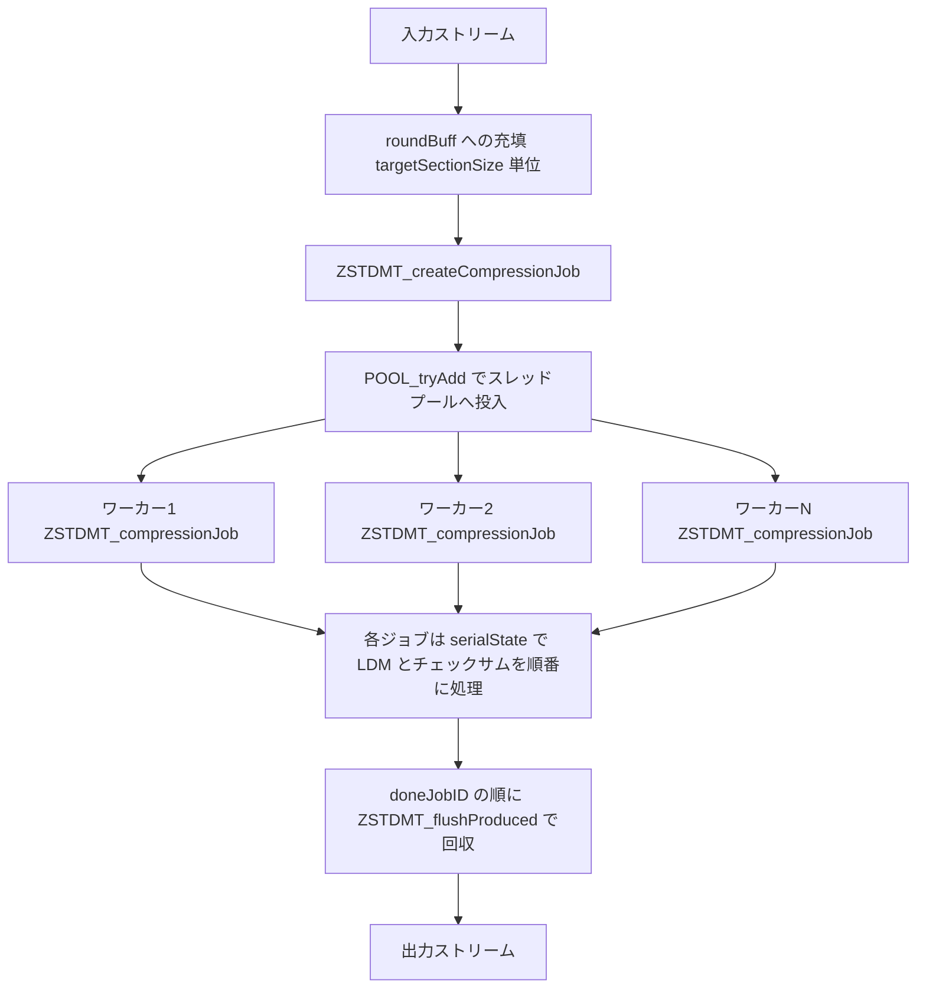

# 第21章 ZSTDMT：ジョブ分割・スレッドプール・LDM連携

> **本章で読むソース**
>
> - [`lib/compress/zstdmt_compress.c`](https://github.com/facebook/zstd/blob/v1.5.7/lib/compress/zstdmt_compress.c)
> - [`lib/common/pool.c`](https://github.com/facebook/zstd/blob/v1.5.7/lib/common/pool.c)
> - [`lib/common/pool.h`](https://github.com/facebook/zstd/blob/v1.5.7/lib/common/pool.h)
> - [`lib/common/threading.c`](https://github.com/facebook/zstd/blob/v1.5.7/lib/common/threading.c)
> - [`lib/common/threading.h`](https://github.com/facebook/zstd/blob/v1.5.7/lib/common/threading.h)

## この章の狙い

これまでの章で読んだマッチファインダーや seqStore への格納は、いずれも1本のスレッドが入力を先頭から順に処理する前提だった。
ZSTDMT は、この単一スレッドの圧縮器を並べて動かし、入力を複数のジョブに切り分けて別々のスレッドで同時に圧縮する層である。
並列化の難しさは圧縮そのものではなく、切り分けたジョブの境界処理と、結果を入力順どおりに1本の出力ストリームへ戻す回収処理にある。

本章では、ZSTDMT が入力をどうジョブへ切り出すか、スレッドプールがどのようにジョブを受け取って空き時間をスリープで待つか、そしてジョブ間で辞書を引き継ぐ overlap と、圧縮フレーム全体で1つしか持てない LDM の状態をどう直列化するかを、実装に沿って読む。

## 前提

ZSTDMT はストリーミング圧縮 API の内部で動く。
`ZSTD_compressStream2`（`zstd_compress.c`）は、ワーカースレッド数が1以上のとき圧縮処理を `ZSTDMT_compressStream_generic` に委譲する。
ここに渡ってくる時点で、圧縮パラメーターの検証と、strategy やウィンドウサイズの決定は済んでいる。

ジョブ1つは、独立した `ZSTD_CCtx` が入力の一区画を1つの zstd フレームの一部として圧縮する単位である。
LDM を有効にした場合の各ジョブ内の近距離マッチ探索は第16章から第18章のマッチファインダーが、長距離マッチの事前検出は第19章の LDM がそのまま担う。
ZSTDMT はそれらを呼び出す側の並列制御だけを受け持つ。

## ZSTDMT_CCtx：並列圧縮の全状態

並列圧縮の状態はすべて `ZSTDMT_CCtx` に集約されている。

[`lib/compress/zstdmt_compress.c` L866-L892](https://github.com/facebook/zstd/blob/v1.5.7/lib/compress/zstdmt_compress.c#L866-L892)

```c
struct ZSTDMT_CCtx_s {
    POOL_ctx* factory;
    ZSTDMT_jobDescription* jobs;
    ZSTDMT_bufferPool* bufPool;
    ZSTDMT_CCtxPool* cctxPool;
    ZSTDMT_seqPool* seqPool;
    ZSTD_CCtx_params params;
    size_t targetSectionSize;
    size_t targetPrefixSize;
    int jobReady;        /* 1 => one job is already prepared, but pool has shortage of workers. Don't create a new job. */
    InBuff_t inBuff;
    RoundBuff_t roundBuff;
    SerialState serial;
    RSyncState_t rsync;
    unsigned jobIDMask;
    unsigned doneJobID;
    unsigned nextJobID;
    // ... (中略) ...
};
```

`factory` がワーカースレッドを抱えるスレッドプールである。
`jobs` はジョブ記述子のリングバッファで、`nextJobID` が次に発行するジョブ番号、`doneJobID` が次に回収すべきジョブ番号を指す。
`jobIDMask` は `jobs` の要素数から1を引いた値であり、ジョブ番号を単調増加させたまま `jobID & jobIDMask` でリングバッファの添字へ折り返す。
入力側では `roundBuff` という大きな環状の入力バッファがあり、各ジョブへ渡す区画はこのバッファの一部を指す参照として切り出される。
`bufPool` は圧縮結果を書き出す出力バッファの、`seqPool` は LDM のシーケンス列を受け取るバッファの、それぞれ再利用プールである。
`serial` は圧縮フレーム全体で1つだけ持つ直列処理の状態で、LDM の状態とチェックサムをここに置く。

`targetSectionSize` が1ジョブに詰める入力の目標バイト数、`targetPrefixSize` がジョブ間で辞書として引き継ぐ overlap のバイト数である。

## スレッドプール：条件変数で待つワーカー

スレッドプール `POOL_ctx` は、ワーカースレッドの配列とジョブの環状キューを1つのミューテックスで保護する構造体である。
ワーカースレッドは `POOL_thread` を実行し続け、キューが空いている間は条件変数でスリープする。

[`lib/common/pool.c` L67-L101](https://github.com/facebook/zstd/blob/v1.5.7/lib/common/pool.c#L67-L101)

```c
static void* POOL_thread(void* opaque) {
    POOL_ctx* const ctx = (POOL_ctx*)opaque;
    if (!ctx) { return NULL; }
    for (;;) {
        /* Lock the mutex and wait for a non-empty queue or until shutdown */
        ZSTD_pthread_mutex_lock(&ctx->queueMutex);

        while ( ctx->queueEmpty
            || (ctx->numThreadsBusy >= ctx->threadLimit) ) {
            if (ctx->shutdown) {
                // ... (中略) ...
                ZSTD_pthread_mutex_unlock(&ctx->queueMutex);
                return opaque;
            }
            ZSTD_pthread_cond_wait(&ctx->queuePopCond, &ctx->queueMutex);
        }
        /* Pop a job off the queue */
        {   POOL_job const job = ctx->queue[ctx->queueHead];
            ctx->queueHead = (ctx->queueHead + 1) % ctx->queueSize;
            ctx->numThreadsBusy++;
            ctx->queueEmpty = (ctx->queueHead == ctx->queueTail);
            /* Unlock the mutex, signal a pusher, and run the job */
            ZSTD_pthread_cond_signal(&ctx->queuePushCond);
            ZSTD_pthread_mutex_unlock(&ctx->queueMutex);

            job.function(job.opaque);
            // ... (中略) ...
        }
    }  /* for (;;) */
```

`while` の条件は、キューが空であるか、あるいは同時稼働数の上限 `threadLimit` に達している間は待ち続けることを意味する。
待機は `ZSTD_pthread_cond_wait` で行うため、ジョブが投入されるまでワーカーは CPU を手放してスリープし、投入側のシグナルで起こされる。
ジョブを取り出したスレッドは、キューのミューテックスを解放してから `job.function` を呼ぶ。
ミューテックスを握ったまま圧縮を実行すると他のワーカーがキューを操作できなくなるため、実際の圧縮はロックの外で走らせる。

ジョブの投入側は `POOL_add` と `POOL_tryAdd` の2つを使い分ける。
`POOL_add` はキューが満杯なら空くまでスリープして待つが、`POOL_tryAdd` は満杯なら即座に0を返して呼び出し側に制御を戻す。

[`lib/common/pool.c` L298-L311](https://github.com/facebook/zstd/blob/v1.5.7/lib/common/pool.c#L298-L311)

```c
int POOL_tryAdd(POOL_ctx* ctx, POOL_function function, void* opaque)
{
    assert(ctx != NULL);
    ZSTD_pthread_mutex_lock(&ctx->queueMutex);
    if (isQueueFull(ctx)) {
        ZSTD_pthread_mutex_unlock(&ctx->queueMutex);
        return 0;
    }
    POOL_add_internal(ctx, function, opaque);
    ZSTD_pthread_mutex_unlock(&ctx->queueMutex);
    return 1;
}
```

ZSTDMT がジョブ投入に `POOL_tryAdd` を選ぶのは、投入で長くブロックすると、その間に完了したジョブの出力回収が止まるからである。
ワーカーが埋まっていて投入できなければ、ジョブを準備済みの状態で保留し、`jobReady` を立てて呼び出し側の流れに戻る。

ミューテックスと条件変数の操作は、環境ごとの API 差を吸収するために `threading.h` のラッパーを経由する。
POSIX では pthread の関数へ、Windows では `CRITICAL_SECTION` と `CONDITION_VARIABLE` へ、同じ名前のマクロが展開される。

[`lib/common/threading.h` L51-L57](https://github.com/facebook/zstd/blob/v1.5.7/lib/common/threading.h#L51-L57)

```c
/* condition variable */
#define ZSTD_pthread_cond_t             CONDITION_VARIABLE
#define ZSTD_pthread_cond_init(a, b)    ((void)(b), InitializeConditionVariable((a)), 0)
#define ZSTD_pthread_cond_destroy(a)    ((void)(a))
#define ZSTD_pthread_cond_wait(a, b)    SleepConditionVariableCS((a), (b), INFINITE)
#define ZSTD_pthread_cond_signal(a)     WakeConditionVariable((a))
#define ZSTD_pthread_cond_broadcast(a)  WakeAllConditionVariable((a))
```

zstdmt_compress.c と pool.c は、このラッパー越しに条件変数を扱うだけで、プラットフォームの違いを意識せずに済む。

## 全体の流れ

入力からジョブ分割、並列圧縮、順序回収、出力までの流れを図示すると次のようになる。



## 入力のジョブ分割

`ZSTDMT_compressStream_generic` が並列圧縮のメインループである。
1回の呼び出しで、入力を内部バッファへ詰め、必要ならジョブを発行し、完了した出力を回収する。

[`lib/compress/zstdmt_compress.c` L1868-L1916](https://github.com/facebook/zstd/blob/v1.5.7/lib/compress/zstdmt_compress.c#L1868-L1916)

```c
    /* fill input buffer */
    if ( (!mtctx->jobReady)
      && (input->size > input->pos) ) {   /* support NULL input */
        if (mtctx->inBuff.buffer.start == NULL) {
            assert(mtctx->inBuff.filled == 0); /* Can't fill an empty buffer */
            if (!ZSTDMT_tryGetInputRange(mtctx)) {
                // ... (中略) ...
                assert(mtctx->doneJobID != mtctx->nextJobID);
            } else
                DEBUGLOG(5, "ZSTDMT_tryGetInputRange completed successfully : mtctx->inBuff.buffer.start = %p", mtctx->inBuff.buffer.start);
        }
        if (mtctx->inBuff.buffer.start != NULL) {
            SyncPoint const syncPoint = findSynchronizationPoint(mtctx, *input);
            // ... (中略) ...
            ZSTD_memcpy((char*)mtctx->inBuff.buffer.start + mtctx->inBuff.filled, (const char*)input->src + input->pos, syncPoint.toLoad);
            input->pos += syncPoint.toLoad;
            mtctx->inBuff.filled += syncPoint.toLoad;
            forwardInputProgress = syncPoint.toLoad>0;
        }
    }
    // ... (中略) ...
    if ( (mtctx->jobReady)
      || (mtctx->inBuff.filled >= mtctx->targetSectionSize)  /* filled enough : let's compress */
      || ((endOp != ZSTD_e_continue) && (mtctx->inBuff.filled > 0))  /* something to flush : let's go */
      || ((endOp == ZSTD_e_end) && (!mtctx->frameEnded)) ) {   /* must finish the frame with a zero-size block */
        size_t const jobSize = mtctx->inBuff.filled;
        assert(mtctx->inBuff.filled <= mtctx->targetSectionSize);
        FORWARD_IF_ERROR( ZSTDMT_createCompressionJob(mtctx, jobSize, endOp) , "");
    }
```

入力バッファ `inBuff` が `targetSectionSize` まで埋まったとき、あるいはフラッシュや終了が要求されたときにジョブを1つ発行する。
`inBuff` は `ZSTDMT_tryGetInputRange` が `roundBuff` から切り出した区画を指しており、そこへ入力をコピーして満たしていく。

`ZSTDMT_tryGetInputRange` は、次のジョブに使う区画がまだ稼働中のジョブと重ならないことを確認してから区画を確保する。

[`lib/compress/zstdmt_compress.c` L1681-L1731](https://github.com/facebook/zstd/blob/v1.5.7/lib/compress/zstdmt_compress.c#L1681-L1731)

```c
static int ZSTDMT_tryGetInputRange(ZSTDMT_CCtx* mtctx)
{
    Range const inUse = ZSTDMT_getInputDataInUse(mtctx);
    size_t const spaceLeft = mtctx->roundBuff.capacity - mtctx->roundBuff.pos;
    size_t const spaceNeeded = mtctx->targetSectionSize;
    Buffer buffer;
    // ... (中略) ...
    buffer.start = mtctx->roundBuff.buffer + mtctx->roundBuff.pos;
    buffer.capacity = spaceNeeded;

    if (ZSTDMT_isOverlapped(buffer, inUse)) {
        DEBUGLOG(5, "Waiting for buffer...");
        return 0;
    }
    // ... (中略) ...
    mtctx->inBuff.buffer = buffer;
    mtctx->inBuff.filled = 0;
    assert(mtctx->roundBuff.pos + buffer.capacity <= mtctx->roundBuff.capacity);
    return 1;
}
```

環状の `roundBuff` の中を `pos` が前進していき、末尾に達すると先頭へ折り返す。
折り返す前に、そこがまだ圧縮中のジョブに参照されていないかを `ZSTDMT_isOverlapped` で調べ、重なるなら区画の確保を諦めて0を返す。
確保できなければメインループはジョブを発行せず、まず完了済みジョブの回収を進めて空きを作る。
これにより、ジョブへ渡した入力区画をジョブが読み終える前に上書きしてしまう事態を防ぐ。

## overlap：ジョブ境界をまたぐ辞書の引き継ぎ

入力を単純に区切って並列圧縮すると、各ジョブの先頭付近は手前のジョブの内容を辞書として使えないため、境界ごとに圧縮率が落ちる。
ZSTDMT はこれを避けるため、あるジョブの入力末尾の一部を、次のジョブの辞書 prefix として引き継がせる。
引き継ぐ量は `ZSTDMT_computeOverlapSize` が strategy に応じて決める。

[`lib/compress/zstdmt_compress.c` L1226-L1243](https://github.com/facebook/zstd/blob/v1.5.7/lib/compress/zstdmt_compress.c#L1226-L1243)

```c
static size_t ZSTDMT_computeOverlapSize(const ZSTD_CCtx_params* params)
{
    int const overlapRLog = 9 - ZSTDMT_overlapLog(params->overlapLog, params->cParams.strategy);
    int ovLog = (overlapRLog >= 8) ? 0 : (params->cParams.windowLog - overlapRLog);
    assert(0 <= overlapRLog && overlapRLog <= 8);
    if (params->ldmParams.enableLdm == ZSTD_ps_enable) {
        // ... (中略) ...
        ovLog = MIN(params->cParams.windowLog, ZSTDMT_computeTargetJobLog(params) - 2)
                - overlapRLog;
    }
    assert(0 <= ovLog && ovLog <= ZSTD_WINDOWLOG_MAX);
    // ... (中略) ...
    return (ovLog==0) ? 0 : (size_t)1 << ovLog;
}
```

`overlapLog` が大きい strategy ほど overlap のバイト数は増える。
高圧縮の探索を行う strategy ほど境界のマッチ品質が結果に効くため、引き継ぐ辞書を厚くする設計である。

overlap の値は `targetPrefixSize` に入り、ジョブ発行時に次ジョブの prefix として設定される。

[`lib/compress/zstdmt_compress.c` L1442-L1446](https://github.com/facebook/zstd/blob/v1.5.7/lib/compress/zstdmt_compress.c#L1442-L1446)

```c
        /* Set the prefix for next job */
        if (!endFrame) {
            size_t const newPrefixSize = MIN(srcSize, mtctx->targetPrefixSize);
            mtctx->inBuff.prefix.start = src + srcSize - newPrefixSize;
            mtctx->inBuff.prefix.size = newPrefixSize;
```

いま発行するジョブの入力末尾 `newPrefixSize` バイトを、次ジョブの prefix の開始位置として記録する。
この prefix は環状バッファ上でいま発行したジョブの入力区画と地続きに残るため、次ジョブはコピーなしで直前の内容を辞書に持てる。
ワーカー側は、この prefix を辞書として `ZSTD_compressBegin_advanced_internal` に渡してから本体の圧縮に入る。
各ジョブが独立したフレーム区間でありながら、境界のマッチ品質を単一スレッド圧縮に近づけられるのは、この overlap による辞書の引き継ぎがあるからである。

## ワーカーの圧縮：ZSTDMT_compressionJob

スレッドプールが呼ぶジョブ本体が `ZSTDMT_compressionJob` である。
ワーカーはまず出力バッファと LDM シーケンス用バッファをプールから借り、直列処理の順番待ちを経てから圧縮に入る。

[`lib/compress/zstdmt_compress.c` L716-L726](https://github.com/facebook/zstd/blob/v1.5.7/lib/compress/zstdmt_compress.c#L716-L726)

```c
    if (job->jobID != 0) jobParams.fParams.checksumFlag = 0;
    /* Don't run LDM for the chunks, since we handle it externally */
    jobParams.ldmParams.enableLdm = ZSTD_ps_disable;
    /* Correct nbWorkers to 0. */
    jobParams.nbWorkers = 0;


    /* init */

    /* Perform serial step as early as possible */
    ZSTDMT_serialState_genSequences(job->serial, &rawSeqStore, job->src, job->jobID);
```

各ジョブは自分の `CCtx` の LDM を無効化する。
LDM の状態は圧縮フレーム全体で1つしか持てないため、ジョブ単位ではなく直列処理側でまとめて生成し、後述の手順でジョブへ渡すからである。
チェックサムも先頭ジョブ以外では無効化し、フレーム全体のチェックサムは直列処理側で計算する。

圧縮本体は、ジョブの入力をさらに小さいチャンクへ区切りながら進める。

[`lib/compress/zstdmt_compress.c` L771-L784](https://github.com/facebook/zstd/blob/v1.5.7/lib/compress/zstdmt_compress.c#L771-L784)

```c
        for (chunkNb = 1; chunkNb < nbChunks; chunkNb++) {
            size_t const cSize = ZSTD_compressContinue_public(cctx, op, oend-op, ip, chunkSize);
            if (ZSTD_isError(cSize)) JOB_ERROR(cSize);
            ip += chunkSize;
            op += cSize; assert(op < oend);
            /* stats */
            ZSTD_PTHREAD_MUTEX_LOCK(&job->job_mutex);
            job->cSize += cSize;
            job->consumed = chunkSize * chunkNb;
            DEBUGLOG(5, "ZSTDMT_compressionJob: compress new block : cSize==%u bytes (total: %u)",
                        (U32)cSize, (U32)job->cSize);
            ZSTD_pthread_cond_signal(&job->job_cond);   /* warns some more data is ready to be flushed */
            ZSTD_pthread_mutex_unlock(&job->job_mutex);
        }
```

チャンクを1つ圧縮するたびに `job->cSize` と `job->consumed` を更新し、条件変数で回収側へ進捗を知らせる。
細かく区切って進捗を公開するのは、ジョブ全体が終わる前でも、先頭から圧縮済みの分を回収側が流し始められるようにするためである。
`job_mutex` で保護されたこの2つの値だけが、ワーカーと回収側が共有する連絡窓口になる。

## LDM の直列化：serialState

LDM は入力全体を1つの長距離辞書として走査する仕組みであり、その状態を複数ジョブで勝手に更新すると、辞書の内容がジョブの実行順に依存して壊れる。
ZSTDMT は LDM の状態を `SerialState` に1つだけ持ち、ジョブ番号の順に1つずつ処理させる。

[`lib/compress/zstdmt_compress.c` L471-L485](https://github.com/facebook/zstd/blob/v1.5.7/lib/compress/zstdmt_compress.c#L471-L485)

```c
typedef struct {
    /* All variables in the struct are protected by mutex. */
    ZSTD_pthread_mutex_t mutex;
    ZSTD_pthread_cond_t cond;
    ZSTD_CCtx_params params;
    ldmState_t ldmState;
    XXH64_state_t xxhState;
    unsigned nextJobID;
    /* Protects ldmWindow.
     * Must be acquired after the main mutex when acquiring both.
     */
    ZSTD_pthread_mutex_t ldmWindowMutex;
    ZSTD_pthread_cond_t ldmWindowCond;  /* Signaled when ldmWindow is updated */
    ZSTD_window_t ldmWindow;  /* A thread-safe copy of ldmState.window */
} SerialState;
```

ワーカーは圧縮に先立ち `ZSTDMT_serialState_genSequences` を呼ぶ。
ここで各ジョブは自分の番が来るまで条件変数でスリープし、順番が来たら LDM のシーケンス生成とチェックサム更新を行う。

[`lib/compress/zstdmt_compress.c` L584-L620](https://github.com/facebook/zstd/blob/v1.5.7/lib/compress/zstdmt_compress.c#L584-L620)

```c
{
    /* Wait for our turn */
    ZSTD_PTHREAD_MUTEX_LOCK(&serialState->mutex);
    while (serialState->nextJobID < jobID) {
        DEBUGLOG(5, "wait for serialState->cond");
        ZSTD_pthread_cond_wait(&serialState->cond, &serialState->mutex);
    }
    /* A future job may error and skip our job */
    if (serialState->nextJobID == jobID) {
        /* It is now our turn, do any processing necessary */
        if (serialState->params.ldmParams.enableLdm == ZSTD_ps_enable) {
            size_t error;
            // ... (中略) ...
            ZSTD_window_update(&serialState->ldmState.window, src.start, src.size, /* forceNonContiguous */ 0);
            error = ZSTD_ldm_generateSequences(
                &serialState->ldmState, seqStore,
                &serialState->params.ldmParams, src.start, src.size);
            /* We provide a large enough buffer to never fail. */
            assert(!ZSTD_isError(error)); (void)error;
            /* Update ldmWindow to match the ldmState.window and signal the main
             * thread if it is waiting for a buffer.
             */
            ZSTD_PTHREAD_MUTEX_LOCK(&serialState->ldmWindowMutex);
            serialState->ldmWindow = serialState->ldmState.window;
            ZSTD_pthread_cond_signal(&serialState->ldmWindowCond);
            ZSTD_pthread_mutex_unlock(&serialState->ldmWindowMutex);
        }
        // ... (中略) ...
    }
    /* Now it is the next jobs turn */
    serialState->nextJobID++;
    ZSTD_pthread_cond_broadcast(&serialState->cond);
    ZSTD_pthread_mutex_unlock(&serialState->mutex);
```

`nextJobID` がいま処理を許すジョブ番号であり、自分より前のジョブが LDM 走査を終えるまでは待つ。
順番が来たジョブは、共有の `ldmState` に自分の入力区画を通して `ZSTD_ldm_generateSequences` を呼び、長距離マッチの列を生成する。
処理を終えると `nextJobID` を進め、待っている後続ジョブを起こす。
LDM の走査だけを直列化する一方で、走査で得たシーケンスを使った実際の圧縮は各ワーカーが並列に行うため、直列区間は入力全体を1回なめる LDM の走査に限られる。

生成した LDM シーケンスは、ジョブ番号順の走査が終わった直後にそのジョブの `CCtx` へ外部シーケンスとして引き渡す。

[`lib/compress/zstdmt_compress.c` L628-L633](https://github.com/facebook/zstd/blob/v1.5.7/lib/compress/zstdmt_compress.c#L628-L633)

```c
    if (seqStore->size > 0) {
        DEBUGLOG(5, "ZSTDMT_serialState_applySequences: uploading %u external sequences", (unsigned)seqStore->size);
        assert(serialState->params.ldmParams.enableLdm == ZSTD_ps_enable); (void)serialState;
        assert(jobCCtx);
        ZSTD_referenceExternalSequences(jobCCtx, seqStore->seq, seqStore->size);
    }
```

ワーカーは `ZSTD_referenceExternalSequences` で受け取った長距離マッチを確定情報として使い、その間のリテラル区間だけを自分のマッチファインダーで圧縮する。
この橋渡しにより、LDM が持つ圧縮フレーム全体規模の辞書と、各ジョブが独立に走らせる近距離探索とが両立する。

直列処理側が LDM の走査で更新した `ldmState.window` は、`ldmWindow` というスレッドセーフな複製に写して回収側へ知らせる。
入力側で `roundBuff` の区画を再利用しようとするとき、その区画が LDM のウィンドウに参照されている間は上書きできない。
`ZSTDMT_waitForLdmComplete` は、区画が `ldmWindow` と重なる間、条件変数でスリープして LDM の走査が追いつくのを待つ。

[`lib/compress/zstdmt_compress.c` L1659-L1675](https://github.com/facebook/zstd/blob/v1.5.7/lib/compress/zstdmt_compress.c#L1659-L1675)

```c
    if (mtctx->params.ldmParams.enableLdm == ZSTD_ps_enable) {
        ZSTD_pthread_mutex_t* mutex = &mtctx->serial.ldmWindowMutex;
        // ... (中略) ...
        ZSTD_PTHREAD_MUTEX_LOCK(mutex);
        while (ZSTDMT_doesOverlapWindow(buffer, mtctx->serial.ldmWindow)) {
            DEBUGLOG(5, "Waiting for LDM to finish...");
            ZSTD_pthread_cond_wait(&mtctx->serial.ldmWindowCond, mutex);
        }
        DEBUGLOG(6, "Done waiting for LDM to finish");
        ZSTD_pthread_mutex_unlock(mutex);
    }
```

LDM を有効にしたときに `roundBuff` をウィンドウサイズ分だけ大きく確保するのは、この重なり待ちで並列度が落ちないよう、走査中のウィンドウと次に埋める区画を別々に置ける余裕を持たせるためである。

## 順序どおりの回収：flushProduced

ワーカーはジョブを並列に、しかも終わる順序はばらばらに圧縮する。
一方で出力ストリームは入力順どおりでなければならない。
この順序づけは `ZSTDMT_flushProduced` が `doneJobID` を単調に進めることで実現する。

[`lib/compress/zstdmt_compress.c` L1534-L1560](https://github.com/facebook/zstd/blob/v1.5.7/lib/compress/zstdmt_compress.c#L1534-L1560)

```c
        if (cSize > 0) {   /* compression is ongoing or completed */
            size_t const toFlush = MIN(cSize - mtctx->jobs[wJobID].dstFlushed, output->size - output->pos);
            // ... (中略) ...
            if (toFlush > 0) {
                ZSTD_memcpy((char*)output->dst + output->pos,
                    (const char*)mtctx->jobs[wJobID].dstBuff.start + mtctx->jobs[wJobID].dstFlushed,
                    toFlush);
            }
            output->pos += toFlush;
            mtctx->jobs[wJobID].dstFlushed += toFlush;  /* can write : this value is only used by mtctx */

            if ( (srcConsumed == srcSize)    /* job is completed */
              && (mtctx->jobs[wJobID].dstFlushed == cSize) ) {   /* output buffer fully flushed => free this job position */
                // ... (中略) ...
                ZSTDMT_releaseBuffer(mtctx->bufPool, mtctx->jobs[wJobID].dstBuff);
                // ... (中略) ...
                mtctx->jobs[wJobID].dstBuff = g_nullBuffer;
                mtctx->jobs[wJobID].cSize = 0;   /* ensure this job slot is considered "not started" in future check */
                mtctx->consumed += srcSize;
                mtctx->produced += cSize;
                mtctx->doneJobID++;
        }   }
```

回収は常に `doneJobID` が指すジョブ1つだけを対象にする。
そのジョブが圧縮したぶんを `dstFlushed` の分だけ出力へ写し、入力を消化しきり出力も流しきったときに限って、出力バッファをプールへ返して `doneJobID` を1つ進める。
後続のジョブが先に圧縮を終えていても、`doneJobID` が回ってくるまでそのジョブの出力は回収されない。
これにより、ワーカーの完了順に関係なく、出力は必ず入力順で並ぶ。

## 最適化：バッファプールとシーケンスプールの再利用

並列圧縮では、ジョブごとに出力バッファと LDM シーケンス用バッファが要る。
これらを毎回確保して解放すると、ジョブ数だけメモリ確保が走り、断片化も進む。
ZSTDMT は `bufferPool` と `seqPool` で使い終えたバッファを貯め、次のジョブへ貸し出す。

`ZSTDMT_getBuffer` は、プールに空きがあればまずそれを再利用する。

[`lib/compress/zstdmt_compress.c` L197-L207](https://github.com/facebook/zstd/blob/v1.5.7/lib/compress/zstdmt_compress.c#L197-L207)

```c
    if (bufPool->nbBuffers) {   /* try to use an existing buffer */
        Buffer const buf = bufPool->buffers[--(bufPool->nbBuffers)];
        size_t const availBufferSize = buf.capacity;
        bufPool->buffers[bufPool->nbBuffers] = g_nullBuffer;
        if ((availBufferSize >= bSize) & ((availBufferSize>>3) <= bSize)) {
            /* large enough, but not too much */
            // ... (中略) ...
            ZSTD_pthread_mutex_unlock(&bufPool->poolMutex);
            return buf;
        }
```

貯めてあるバッファは、必要なサイズ以上でありながら大きすぎないときにだけ再利用する。
`availBufferSize >> 3` の比較は、要求サイズの8倍を超えるほど大きなバッファは無駄なので手放す、という上限の判定である。
サイズの合わないバッファは解放して確保し直すため、プールに残るバッファはおおむね同じ大きさに揃い、貸し借りで使い回しやすくなる。

プールの上限は、ワーカー数から必要数を見積もって決める。

[`lib/compress/zstdmt_compress.c` L273-L282](https://github.com/facebook/zstd/blob/v1.5.7/lib/compress/zstdmt_compress.c#L273-L282)

```c
/* We need 2 output buffers per worker since each dstBuff must be flushed after it is released.
 * The 3 additional buffers are as follows:
 *   1 buffer for input loading
 *   1 buffer for "next input" when submitting current one
 *   1 buffer stuck in queue */
#define BUF_POOL_MAX_NB_BUFFERS(nbWorkers) (2*(nbWorkers) + 3)

/* After a worker releases its rawSeqStore, it is immediately ready for reuse.
 * So we only need one seq buffer per worker. */
#define SEQ_POOL_MAX_NB_BUFFERS(nbWorkers) (nbWorkers)
```

出力バッファはワーカー1つあたり2枚に加えて予備が3枚要るのに対し、シーケンス用バッファはワーカーが走査を終えた時点で即座に返せるため、ワーカー数と同じ枚数で足りる。
必要数を見積もったうえで再利用に徹することで、ジョブが何千個に及んでもメモリ確保はプールを暖める初期のぶんに抑えられ、ジョブごとの確保コストと断片化を避けられる。

## まとめ

ZSTDMT は、単一スレッドの圧縮器をスレッドプールの上で並べ、入力を `targetSectionSize` 単位のジョブへ切り出して並列に圧縮する層である。
ワーカーは条件変数でジョブ投入を待ってスリープし、投入側は回収を止めないよう `POOL_tryAdd` で非ブロックにジョブを積む。
ジョブ境界のマッチ品質は、直前ジョブの末尾を次ジョブの辞書 prefix として引き継ぐ overlap で保つ。
圧縮フレーム全体で1つしか持てない LDM の状態は `SerialState` に集約し、ジョブ番号順に走査だけを直列化して、走査で得たシーケンスを各ワーカーへ外部シーケンスとして渡す。
ばらばらに完了するジョブの出力は、`doneJobID` を単調に進める回収によって入力順へ並べ直す。
出力バッファと LDM シーケンス用バッファはプールで再利用し、ジョブごとのメモリ確保と断片化を抑える。

## 関連する章

- [第19章 LDM：長距離マッチの事前検出](../part04-matchfinder/19-ldm.md)
- [第12章 seqStore とブロック圧縮の流れ](../part03-compress-core/12-seqstore-blockflow.md)
- [第3章 公開 API の流れ](../part00-overview/03-public-api-flow.md)
