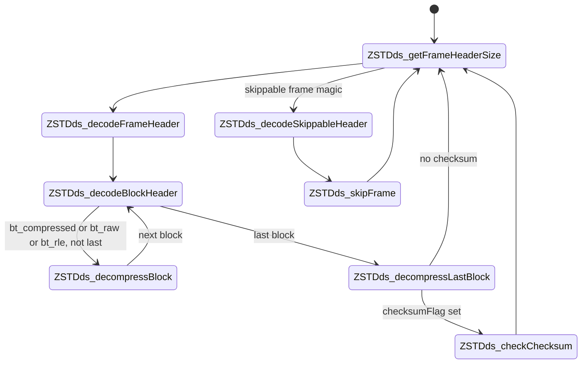
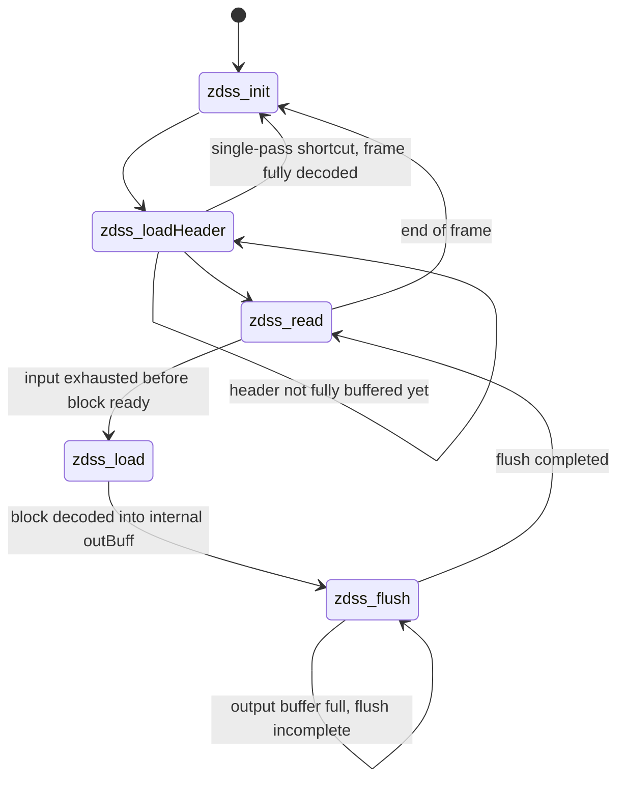

# 第22章 復号コンテキストとフレーム復号

> **本章で読むソース**
>
> - [`lib/decompress/zstd_decompress_internal.h`](https://github.com/facebook/zstd/blob/v1.5.7/lib/decompress/zstd_decompress_internal.h)
> - [`lib/decompress/zstd_decompress.c`](https://github.com/facebook/zstd/blob/v1.5.7/lib/decompress/zstd_decompress.c)

## この章の狙い

第2章では frame のバイト列の構造を仕様書とデコーダの断片から確認した。
本章では、その frame を実際にたどるデコーダ本体を読む。

zstd の復号は、ワンショットの `ZSTD_decompress` と、入出力バッファを少しずつ渡す `ZSTD_decompressStream` の2系統を持つ。
どちらも内部では同じ **ZSTD_dStage**（フレーム内の読み取り位置を示す状態）を1歩ずつ進める `ZSTD_decompressContinue` を呼ぶ。
ストリーミング側はさらに、入出力バッファの管理を担う **ZSTD_dStreamStage** という別の状態機械を上に重ねている。
本章はこの二重の状態機械と、frame header の読み取り、ブロックループ、`Content_Checksum` 検証までを、`ZSTD_DCtx` の構造に沿って追う。
ブロック本体のリテラルとシーケンスの復号は第23章に譲り、本章は frame という単位を通す制御に絞る。

## 前提

第2章で見た通り、frame は `Magic_Number`、`Frame_Header`、1個以上の `Data_Block`、そして任意の `Content_Checksum` から成る。
復号器はこの並びを先頭から順に読み進めるしかなく、ある時点で読める範囲は「今読んでいるフィールドの残りバイト数」に限られる。
ストリーミング API はこの制約に加えて、呼び出し側が任意の大きさで入出力バッファを切ってくるという制約も引き受ける。
frame header を読み終えるまで、ウィンドウサイズも `Content_Checksum` の有無もわからない。
つまり復号器は、必要なバッファサイズを決める前に、まず frame header だけを読み切らなければならない。

## ZSTD_DCtx：復号に必要な状態をまとめて保持する構造体

復号コンテキスト **DCtx**（`ZSTD_DCtx`）は、圧縮コンテキスト CCtx と対になる構造体である。
エントロピーテーブル、ウィンドウの参照範囲、ストリーミング用の内部バッファをまとめて持つ。

[`lib/decompress/zstd_decompress_internal.h` L127-L150](https://github.com/facebook/zstd/blob/v1.5.7/lib/decompress/zstd_decompress_internal.h#L127-L150)

```c
struct ZSTD_DCtx_s
{
    const ZSTD_seqSymbol* LLTptr;
    const ZSTD_seqSymbol* MLTptr;
    const ZSTD_seqSymbol* OFTptr;
    const HUF_DTable* HUFptr;
    ZSTD_entropyDTables_t entropy;
    U32 workspace[HUF_DECOMPRESS_WORKSPACE_SIZE_U32];   /* space needed when building huffman tables */
    const void* previousDstEnd;   /* detect continuity */
    const void* prefixStart;      /* start of current segment */
    const void* virtualStart;     /* virtual start of previous segment if it was just before current one */
    const void* dictEnd;          /* end of previous segment */
    size_t expected;
    ZSTD_FrameHeader fParams;
    U64 processedCSize;
    U64 decodedSize;
    blockType_e bType;            /* used in ZSTD_decompressContinue(), store blockType between block header decoding and block decompression stages */
    ZSTD_dStage stage;
    U32 litEntropy;
    U32 fseEntropy;
    XXH64_state_t xxhState;
```

`LLTptr` / `MLTptr` / `OFTptr` / `HUFptr` は、シーケンスとリテラルのエントロピー復号に使うテーブルへのポインタである。
これらは frame 自身が持つエントロピーテーブル（`entropy` フィールド）を指す場合と、辞書由来のテーブルを指す場合があり、frame header を読んだ段階で切り替わる。
`fParams` は frame header を解析した結果（`ZSTD_FrameHeader`）をそのまま保持し、`stage` が「フレーム内のどこを読んでいるか」を示す。
`previousDstEnd` / `prefixStart` / `virtualStart` / `dictEnd` は、マッチのオフセットが指す過去のバイト列がどこまで連続しているかを追跡するための参照点であり、`ZSTD_checkContinuity` が出力アドレスの連続性からこれらを更新する。

ストリーミング用のフィールドは同じ構造体の後半にまとまっている。

[`lib/decompress/zstd_decompress_internal.h` L173-L188](https://github.com/facebook/zstd/blob/v1.5.7/lib/decompress/zstd_decompress_internal.h#L173-L188)

```c
    /* streaming */
    ZSTD_dStreamStage streamStage;
    char*  inBuff;
    size_t inBuffSize;
    size_t inPos;
    size_t maxWindowSize;
    char*  outBuff;
    size_t outBuffSize;
    size_t outStart;
    size_t outEnd;
    size_t lhSize;
#if defined(ZSTD_LEGACY_SUPPORT) && (ZSTD_LEGACY_SUPPORT>=1)
    void* legacyContext;
    U32 previousLegacyVersion;
    U32 legacyVersion;
#endif
    U32 hostageByte;
    int noForwardProgress;
```

`inBuff` と `outBuff` は同じ確保領域を前半と後半で分け合う内部バッファであり、呼び出し側の入出力バッファと frame の境界がずれたときの一時置き場になる。
`streamStage` がこの内部バッファの状態を管理し、`stage`（`ZSTD_dStage`）が frame 内の読み取り位置を管理する。
両者は役割が異なる別々の状態機械であり、次節以降で順に見ていく。

## ZSTD_dStage：frame 内の読み取り位置を追う状態機械

`ZSTD_dStage` は、`ZSTD_decompressContinue` が1回呼ばれるたびにどのフィールドを読むかを表す。

[`lib/decompress/zstd_decompress_internal.h` L89-L92](https://github.com/facebook/zstd/blob/v1.5.7/lib/decompress/zstd_decompress_internal.h#L89-L92)

```c
typedef enum { ZSTDds_getFrameHeaderSize, ZSTDds_decodeFrameHeader,
               ZSTDds_decodeBlockHeader, ZSTDds_decompressBlock,
               ZSTDds_decompressLastBlock, ZSTDds_checkChecksum,
               ZSTDds_decodeSkippableHeader, ZSTDds_skipFrame } ZSTD_dStage;
```

`ZSTD_nextSrcSizeToDecompress`（`dctx->expected` を返すだけの関数）と `ZSTD_decompressContinue` の組が、この enum を1歩ずつ進める。
呼び出し側は「次に何バイト必要か」を前者で聞き、そのバイト数だけを後者に渡す、という手順を繰り返す。

[`lib/decompress/zstd_decompress.c` L1275-L1301](https://github.com/facebook/zstd/blob/v1.5.7/lib/decompress/zstd_decompress.c#L1275-L1301)

```c
size_t ZSTD_decompressContinue(ZSTD_DCtx* dctx, void* dst, size_t dstCapacity, const void* src, size_t srcSize)
{
    DEBUGLOG(5, "ZSTD_decompressContinue (srcSize:%u)", (unsigned)srcSize);
    /* Sanity check */
    RETURN_ERROR_IF(srcSize != ZSTD_nextSrcSizeToDecompressWithInputSize(dctx, srcSize), srcSize_wrong, "not allowed");
    ZSTD_checkContinuity(dctx, dst, dstCapacity);

    dctx->processedCSize += srcSize;

    switch (dctx->stage)
    {
    case ZSTDds_getFrameHeaderSize :
        assert(src != NULL);
        if (dctx->format == ZSTD_f_zstd1) {  /* allows header */
            assert(srcSize >= ZSTD_FRAMEIDSIZE);  /* to read skippable magic number */
            if ((MEM_readLE32(src) & ZSTD_MAGIC_SKIPPABLE_MASK) == ZSTD_MAGIC_SKIPPABLE_START) {        /* skippable frame */
                ZSTD_memcpy(dctx->headerBuffer, src, srcSize);
                dctx->expected = ZSTD_SKIPPABLEHEADERSIZE - srcSize;  /* remaining to load to get full skippable frame header */
                dctx->stage = ZSTDds_decodeSkippableHeader;
                return 0;
        }   }
        dctx->headerSize = ZSTD_frameHeaderSize_internal(src, srcSize, dctx->format);
        if (ZSTD_isError(dctx->headerSize)) return dctx->headerSize;
        ZSTD_memcpy(dctx->headerBuffer, src, srcSize);
        dctx->expected = dctx->headerSize - srcSize;
        dctx->stage = ZSTDds_decodeFrameHeader;
        return 0;
```

`ZSTDds_getFrameHeaderSize` は最初の呼び出し専用の段階であり、`Frame_Header_Descriptor` を含む先頭数バイトから frame header 全体の長さを確定する。
確定したら残りバイト数を `expected` に入れ、`ZSTDds_decodeFrameHeader` へ進む。
このように `ZSTD_dStage` は「あと何バイト読めば次の意味のある単位が確定するか」を都度計算し直しながら遷移する状態機械である。

`ZSTDds_decodeBlockHeader` で block header（3バイト）を読むと、block type（`bt_raw` / `bt_rle` / `bt_compressed`）と block サイズが確定し、`ZSTDds_decompressBlock` または `ZSTDds_decompressLastBlock` へ進む。
block を最後まで読み終えたら、`ZSTDds_decodeBlockHeader` に戻るか（次の block がある場合）、`ZSTDds_checkChecksum`（`Content_Checksum` がある場合）または `ZSTDds_getFrameHeaderSize`（frame の終わりで次の frame を探す場合）に進む。



skippable frame（第2章で見た、ユーザー定義メタデータを運ぶための frame）は `ZSTDds_decodeSkippableHeader` と `ZSTDds_skipFrame` で読み飛ばされ、通常の block ループには入らない。

## ZSTD_getFrameHeader：可変長ヘッダの解析

frame header の中身を実際に解析するのは `ZSTD_getFrameHeader_advanced` であり、`ZSTD_getFrameHeader` はその `format` 引数を通常の zstd 形式に固定した薄いラッパーである。

[`lib/decompress/zstd_decompress.c` L559-L562](https://github.com/facebook/zstd/blob/v1.5.7/lib/decompress/zstd_decompress.c#L559-L562)

```c
size_t ZSTD_getFrameHeader(ZSTD_FrameHeader* zfhPtr, const void* src, size_t srcSize)
{
    return ZSTD_getFrameHeader_advanced(zfhPtr, src, srcSize, ZSTD_f_zstd1);
}
```

この関数はデコーダの状態を変更せず、与えられたバイト列を読むだけである。
戻り値は3通りに分かれ、0なら `zfhPtr` に正しく書き込めたこと、正の値ならその値だけ `srcSize` を増やして再度呼ぶ必要があること、エラーコードなら frame として不正であることを示す。

[`lib/decompress/zstd_decompress.c` L541-L548](https://github.com/facebook/zstd/blob/v1.5.7/lib/decompress/zstd_decompress.c#L541-L548)

```c
        if (singleSegment) windowSize = frameContentSize;

        zfhPtr->frameType = ZSTD_frame;
        zfhPtr->frameContentSize = frameContentSize;
        zfhPtr->windowSize = windowSize;
        zfhPtr->blockSizeMax = (unsigned) MIN(windowSize, ZSTD_BLOCKSIZE_MAX);
        zfhPtr->dictID = dictID;
        zfhPtr->checksumFlag = checksumFlag;
    }
```

`windowSize` は `Window_Descriptor` から復元される値（`Single_Segment_flag` が立っていれば `frameContentSize` そのもの）であり、`blockSizeMax` はそのウィンドウサイズと `ZSTD_BLOCKSIZE_MAX`（128 KiB）の小さい方に決まる。
この2つの値が、次節で見るバッファサイズ決定の入力になる。

## ZSTD_decompressFrame：ワンショット復号のブロックループ

`ZSTD_decompress` から `ZSTD_decompressDCtx` を経由してたどり着く `ZSTD_decompressFrame` は、frame header を読んだあと、1個の frame の中身を1回のループで最後まで読み切る。

[`lib/decompress/zstd_decompress.c` L971-L987](https://github.com/facebook/zstd/blob/v1.5.7/lib/decompress/zstd_decompress.c#L971-L987)

```c
    /* Frame Header */
    {   size_t const frameHeaderSize = ZSTD_frameHeaderSize_internal(
                ip, ZSTD_FRAMEHEADERSIZE_PREFIX(dctx->format), dctx->format);
        if (ZSTD_isError(frameHeaderSize)) return frameHeaderSize;
        RETURN_ERROR_IF(remainingSrcSize < frameHeaderSize+ZSTD_blockHeaderSize,
                        srcSize_wrong, "");
        FORWARD_IF_ERROR( ZSTD_decodeFrameHeader(dctx, ip, frameHeaderSize) , "");
        ip += frameHeaderSize; remainingSrcSize -= frameHeaderSize;
    }

    /* Shrink the blockSizeMax if enabled */
    if (dctx->maxBlockSizeParam != 0)
        dctx->fParams.blockSizeMax = MIN(dctx->fParams.blockSizeMax, (unsigned)dctx->maxBlockSizeParam);

    /* Loop on each block */
    while (1) {
        BYTE* oBlockEnd = oend;
        size_t decodedSize;
        blockProperties_t blockProperties;
```

ワンショット API は入力全体と出力先のバッファ全体が最初から手元にあるため、`ZSTD_dStage` を経由するバイト単位の状態機械を使わず、block header と block 本体を1個ずつ直接読み進めるループで済ませている。
block type ごとの分岐（`bt_compressed` / `bt_raw` / `bt_rle`）は次の1文にまとまっている。

[`lib/decompress/zstd_decompress.c` L1014-L1030](https://github.com/facebook/zstd/blob/v1.5.7/lib/decompress/zstd_decompress.c#L1014-L1030)

```c
        switch(blockProperties.blockType)
        {
        case bt_compressed:
            assert(dctx->isFrameDecompression == 1);
            decodedSize = ZSTD_decompressBlock_internal(dctx, op, (size_t)(oBlockEnd-op), ip, cBlockSize, not_streaming);
            break;
        case bt_raw :
            /* Use oend instead of oBlockEnd because this function is safe to overlap. It uses memmove. */
            decodedSize = ZSTD_copyRawBlock(op, (size_t)(oend-op), ip, cBlockSize);
            break;
        case bt_rle :
            decodedSize = ZSTD_setRleBlock(op, (size_t)(oBlockEnd-op), *ip, blockProperties.origSize);
            break;
        case bt_reserved :
        default:
            RETURN_ERROR(corruption_detected, "invalid block type");
        }
```

`bt_raw` は圧縮しても縮まなかった生データをそのままコピーする block、`bt_rle` は同じバイトの連続を1バイトと繰り返し回数だけで表す block である。
`bt_compressed` だけがリテラルとシーケンスのエントロピー復号を要求し、その中身は第23章で扱う。

ループを抜けたあと、`Content_Checksum` があれば **XXH64** で検証する。

[`lib/decompress/zstd_decompress.c` L1044-L1054](https://github.com/facebook/zstd/blob/v1.5.7/lib/decompress/zstd_decompress.c#L1044-L1054)

```c
    if (dctx->fParams.checksumFlag) { /* Frame content checksum verification */
        RETURN_ERROR_IF(remainingSrcSize<4, checksum_wrong, "");
        if (!dctx->forceIgnoreChecksum) {
            U32 const checkCalc = (U32)XXH64_digest(&dctx->xxhState);
            U32 checkRead;
            checkRead = MEM_readLE32(ip);
            RETURN_ERROR_IF(checkRead != checkCalc, checksum_wrong, "");
        }
        ip += 4;
        remainingSrcSize -= 4;
    }
```

`Content_Checksum` は XXH64 の64ビットダイジェストの下位32ビットである。
デコーダは block を1個復号するたびに `XXH64_update` へその出力を渡しており（`ZSTD_decompressFrame` のブロックループ内、`XXH64_update(&dctx->xxhState, op, decodedSize)`）、frame の終わりでまとめて計算するのではなく、復号した端から逐次更新する。
第6章で見た通り、XXH64 はストリームの途中経過を状態（`XXH64_state_t`）として保持できる設計であり、この逐次更新はその性質をそのまま使ったものである。

## ZSTD_decompressBegin：DCtx を1個の frame の先頭状態に戻す

`ZSTD_decompressFrame` を呼ぶ前、あるいはストリーミング API が新しい frame を検出したとき、`ZSTD_decompressBegin` が `ZSTD_DCtx` を frame 先頭の状態にリセットする。

[`lib/decompress/zstd_decompress.c` L1560-L1585](https://github.com/facebook/zstd/blob/v1.5.7/lib/decompress/zstd_decompress.c#L1560-L1585)

```c
size_t ZSTD_decompressBegin(ZSTD_DCtx* dctx)
{
    assert(dctx != NULL);
#if ZSTD_TRACE
    dctx->traceCtx = (ZSTD_trace_decompress_begin != NULL) ? ZSTD_trace_decompress_begin(dctx) : 0;
#endif
    dctx->expected = ZSTD_startingInputLength(dctx->format);  /* dctx->format must be properly set */
    dctx->stage = ZSTDds_getFrameHeaderSize;
    dctx->processedCSize = 0;
    dctx->decodedSize = 0;
    dctx->previousDstEnd = NULL;
    dctx->prefixStart = NULL;
    dctx->virtualStart = NULL;
    dctx->dictEnd = NULL;
    dctx->entropy.hufTable[0] = (HUF_DTable)((ZSTD_HUFFDTABLE_CAPACITY_LOG)*0x1000001);  /* cover both little and big endian */
    dctx->litEntropy = dctx->fseEntropy = 0;
    dctx->dictID = 0;
    dctx->bType = bt_reserved;
    dctx->isFrameDecompression = 1;
    ZSTD_STATIC_ASSERT(sizeof(dctx->entropy.rep) == sizeof(repStartValue));
    ZSTD_memcpy(dctx->entropy.rep, repStartValue, sizeof(repStartValue));  /* initial repcodes */
```

`dctx->stage` を `ZSTDds_getFrameHeaderSize` に戻し、繰り返しオフセット（`entropy.rep`）を初期値に戻し、ウィンドウの参照点（`previousDstEnd` など）をすべて `NULL` に戻している。
これにより、1個の `ZSTD_DCtx` を使い回して複数の frame を連続して復号しても、前の frame の状態が次の frame に漏れない。
`ZSTD_decompressBegin_usingDDict` は同じ初期化のあとで辞書（DDict）由来のエントロピーテーブルを差し込むが、辞書の詳細は第24章で扱う。

## ZSTD_decompressStream：入出力バッファをまたぐもう一段の状態機械

ワンショット API と異なり、`ZSTD_decompressStream` は呼び出し側が任意のサイズで区切ってくる `ZSTD_inBuffer` / `ZSTD_outBuffer` を相手にする。
frame header を読み切るまでにバッファが尽きることもあれば、1個の block を復号した出力が呼び出し側の出力バッファに収まらないこともある。
この入出力のずれを吸収するのが **ZSTD_dStreamStage** である。

[`lib/decompress/zstd_decompress_internal.h` L94-L95](https://github.com/facebook/zstd/blob/v1.5.7/lib/decompress/zstd_decompress_internal.h#L94-L95)

```c
typedef enum { zdss_init=0, zdss_loadHeader,
               zdss_read, zdss_load, zdss_flush } ZSTD_dStreamStage;
```

`ZSTD_decompressStream` はこの5値を `while (someMoreWork)` ループの `switch` で回す。
実際に到達する遷移は次の通りである。



`zdss_init` は1回だけ通過する初期化段階であり、`inPos` や `outStart` / `outEnd` をゼロに戻したあと、そのまま `zdss_loadHeader` に fallthrough する。

[`lib/decompress/zstd_decompress.c` L2116-L2125](https://github.com/facebook/zstd/blob/v1.5.7/lib/decompress/zstd_decompress.c#L2116-L2125)

```c
        case zdss_init :
            DEBUGLOG(5, "stage zdss_init => transparent reset ");
            zds->streamStage = zdss_loadHeader;
            zds->lhSize = zds->inPos = zds->outStart = zds->outEnd = 0;
#if defined(ZSTD_LEGACY_SUPPORT) && (ZSTD_LEGACY_SUPPORT>=1)
            zds->legacyVersion = 0;
#endif
            zds->hostageByte = 0;
            zds->expectedOutBuffer = *output;
            ZSTD_FALLTHROUGH;

        case zdss_loadHeader :
```

`zdss_loadHeader` は frame header を `zds->headerBuffer` に貯め切るまで自分自身に留まり、貯め終えたら次の段階に必要なバッファを決める。
このバッファ決定こそが本章で説明する最適化の要である。

## 最適化：frame header を読んでから必要な分だけバッファを確保する

`zdss_loadHeader` の終盤で、デコーダはようやく frame header から得た `windowSize` と `blockSizeMax` を使って、内部バッファ `inBuff` / `outBuff` の必要サイズを計算する。

[`lib/decompress/zstd_decompress.c` L2234-L2240](https://github.com/facebook/zstd/blob/v1.5.7/lib/decompress/zstd_decompress.c#L2234-L2240)

```c
            /* Adapt buffer sizes to frame header instructions */
            {   size_t const neededInBuffSize = MAX(zds->fParams.blockSizeMax, 4 /* frame checksum */);
                size_t const neededOutBuffSize = zds->outBufferMode == ZSTD_bm_buffered
                        ? ZSTD_decodingBufferSize_internal(zds->fParams.windowSize, zds->fParams.frameContentSize, zds->fParams.blockSizeMax)
                        : 0;

                ZSTD_DCtx_updateOversizedDuration(zds, neededInBuffSize, neededOutBuffSize);
```

`ZSTD_decodingBufferSize_internal` が計算する `outBuff` のサイズは、規格上許される最大ウィンドウサイズ（`ZSTD_WINDOWLOG_MAX` から決まる上限）ではなく、この frame が実際に申告した `windowSize` から決まる。

[`lib/decompress/zstd_decompress.c` L1970-L1986](https://github.com/facebook/zstd/blob/v1.5.7/lib/decompress/zstd_decompress.c#L1970-L1986)

```c
static size_t ZSTD_decodingBufferSize_internal(unsigned long long windowSize, unsigned long long frameContentSize, size_t blockSizeMax)
{
    size_t const blockSize = MIN((size_t)MIN(windowSize, ZSTD_BLOCKSIZE_MAX), blockSizeMax);
    /* We need blockSize + WILDCOPY_OVERLENGTH worth of buffer so that if a block
     * ends at windowSize + WILDCOPY_OVERLENGTH + 1 bytes, we can start writing
     * the block at the beginning of the output buffer, and maintain a full window.
     *
     * We need another blockSize worth of buffer so that we can store split
     * literals at the end of the block without overwriting the extDict window.
     */
    unsigned long long const neededRBSize = windowSize + (blockSize * 2) + (WILDCOPY_OVERLENGTH * 2);
    unsigned long long const neededSize = MIN(frameContentSize, neededRBSize);
    size_t const minRBSize = (size_t) neededSize;
    RETURN_ERROR_IF((unsigned long long)minRBSize != neededSize,
                    frameParameter_windowTooLarge, "");
    return minRBSize;
}
```

この `outBuff` は、ウィンドウ全体を保持しながらマッチのバックリファレンスを解決するためのリングバッファである。
必要な大きさは「ウィンドウ1個分＋block 2個分の余白」であり、`windowSize` に依存する。
ウィンドウが小さい frame（たとえば数十 KB のログ片を圧縮したもの）を、上限いっぱいの数百 MB 用に確保したバッファで復号するのは無駄が大きい。
frame header を読んでから確保することで、この無駄を frame ごとの実際の必要量まで絞り込める。

もう一つの最適化が、同じ `zdss_loadHeader` の中にある「単一パスの近道」である。

[`lib/decompress/zstd_decompress.c` L2182-L2199](https://github.com/facebook/zstd/blob/v1.5.7/lib/decompress/zstd_decompress.c#L2182-L2199)

```c
            /* check for single-pass mode opportunity */
            if (zds->fParams.frameContentSize != ZSTD_CONTENTSIZE_UNKNOWN
                && zds->fParams.frameType != ZSTD_skippableFrame
                && (U64)(size_t)(oend-op) >= zds->fParams.frameContentSize) {
                size_t const cSize = ZSTD_findFrameCompressedSize_advanced(istart, (size_t)(iend-istart), zds->format);
                if (cSize <= (size_t)(iend-istart)) {
                    /* shortcut : using single-pass mode */
                    size_t const decompressedSize = ZSTD_decompress_usingDDict(zds, op, (size_t)(oend-op), istart, cSize, ZSTD_getDDict(zds));
                    if (ZSTD_isError(decompressedSize)) return decompressedSize;
                    DEBUGLOG(4, "shortcut to single-pass ZSTD_decompress_usingDDict()");
                    assert(istart != NULL);
                    ip = istart + cSize;
                    op = op ? op + decompressedSize : op; /* can occur if frameContentSize = 0 (empty frame) */
                    zds->expected = 0;
                    zds->streamStage = zdss_init;
                    someMoreWork = 0;
                    break;
            }   }
```

呼び出し側が渡した入力バッファに frame 全体が収まっており、かつ出力バッファに `frameContentSize` 全体を書き切れるとわかった時点で、デコーダは `zdss_read` / `zdss_load` / `zdss_flush` の段階を経由せず、ワンショット用の `ZSTD_decompress_usingDDict` を直接呼ぶ。
これにより、本来なら「入力を `inBuff` にコピーしてから読む」「復号結果を `outBuff` に書いてから呼び出し側にコピーする」という2回の余分なコピーを、frame 全体が1回で収まる場合に限って丸ごと省略できる。
呼び出し側のバッファへ直接読み書きするという意味で、内部バッファを介さないほぼゼロコピーの経路である。

## zdss_read／zdss_load／zdss_flush：内部バッファを介した経路

単一パスの近道が使えない場合、デコーダは `zdss_read` に進む。

[`lib/decompress/zstd_decompress.c` L2273-L2287](https://github.com/facebook/zstd/blob/v1.5.7/lib/decompress/zstd_decompress.c#L2273-L2287)

```c
        case zdss_read:
            DEBUGLOG(5, "stage zdss_read");
            {   size_t const neededInSize = ZSTD_nextSrcSizeToDecompressWithInputSize(zds, (size_t)(iend - ip));
                DEBUGLOG(5, "neededInSize = %u", (U32)neededInSize);
                if (neededInSize==0) {  /* end of frame */
                    zds->streamStage = zdss_init;
                    someMoreWork = 0;
                    break;
                }
                if ((size_t)(iend-ip) >= neededInSize) {  /* decode directly from src */
                    FORWARD_IF_ERROR(ZSTD_decompressContinueStream(zds, &op, oend, ip, neededInSize), "");
                    assert(ip != NULL);
                    ip += neededInSize;
                    /* Function modifies the stage so we must break */
                    break;
            }   }
```

呼び出し側の入力バッファに次の1歩分（`ZSTD_nextSrcSizeToDecompressWithInputSize` が返す量）が既に揃っているなら、`inBuff` へのコピーを経由せず `ip` から直接 `ZSTD_decompressContinue` を呼ぶ。
揃っていなければ `zdss_load` に落ち、`inBuff` へ入力を貯め切ってから同じ経路で復号する。

復号結果の置き場所は出力側の状態にも左右される。
`zdss_flush` は `outBuff` に貯まった復号結果を呼び出し側の出力バッファへコピーする段階であり、コピーし切れなければそのまま `zdss_flush` に留まる。

[`lib/decompress/zstd_decompress.c` L2321-L2338](https://github.com/facebook/zstd/blob/v1.5.7/lib/decompress/zstd_decompress.c#L2321-L2338)

```c
        case zdss_flush:
            {
                size_t const toFlushSize = zds->outEnd - zds->outStart;
                size_t const flushedSize = ZSTD_limitCopy(op, (size_t)(oend-op), zds->outBuff + zds->outStart, toFlushSize);

                op = op ? op + flushedSize : op;

                zds->outStart += flushedSize;
                if (flushedSize == toFlushSize) {  /* flush completed */
                    zds->streamStage = zdss_read;
```

`flushedSize == toFlushSize` で貯まった分をすべて渡し切れたときだけ `zdss_read` に戻り、次の block の読み取りへ進む。
渡し切れなければ `someMoreWork = 0` でループを抜け、呼び出し側が次に大きい出力バッファを渡してくるのを待つ。

## まとめ

`ZSTD_DCtx` は、エントロピーテーブルやウィンドウの参照点をまとめて保持する構造体であり、`ZSTD_decompressBegin` がそれを1個の frame の先頭状態にリセットする。
frame 内部の読み取り位置は `ZSTD_dStage` が管理し、`ZSTD_decompressContinue` が「次に必要なバイト数」を都度計算しながら frame header、block header、block 本体、`Content_Checksum` の順に読み進める。
ストリーミング API はこの上に `ZSTD_dStreamStage` をもう一段重ね、呼び出し側が渡す入出力バッファの過不足を `inBuff` / `outBuff` という内部バッファで吸収する。
frame header を読んでから初めて `windowSize` に応じたバッファサイズを決める設計と、frame 全体が1回で収まるときに内部バッファを経由せず直接復号する単一パスの近道が、この章で見た2つの最適化である。

## 関連する章

- [第2章 フレームフォーマット](../part00-overview/02-frame-format.md)
- [第6章 メモリアクセス、エラー表現、XXH64 チェックサム](../part01-common/06-mem-error-xxhash.md)
- [第23章 ブロック復号](23-decompress-block.md)
- [第24章 DDictと辞書復号](24-ddict.md)
