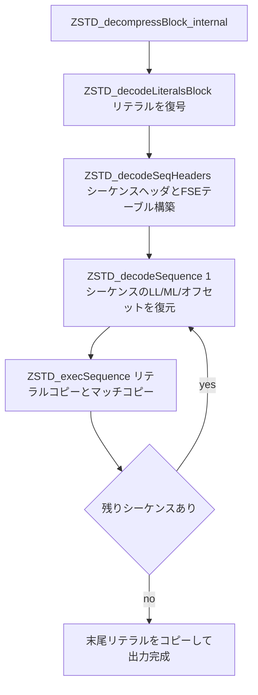

# 第23章 ブロック復号とシーケンス実行

> **本章で読むソース**
>
> - [`lib/decompress/zstd_decompress_block.c`](https://github.com/facebook/zstd/blob/v1.5.7/lib/decompress/zstd_decompress_block.c)

## この章の狙い

第22章まででフレームのヘッダを読み、ブロックの境界を切り出すところまで進んだ。
本章は1つの圧縮ブロックを実際に原文へ戻す処理を扱う。

zstd の圧縮ブロックは、リテラルセクションとシーケンスセクションの2部構成である。
リテラルは第10章で見た Huffman 復号でバイト列に戻し、シーケンスはリテラル長、マッチ長、オフセットの3つ組であり、第8章の FSE 復号でコードを取り出してから追加ビットで実際の値を復元する。
復号器は、まずリテラル列をすべて用意し、次にシーケンスを1つずつ取り出しながら「リテラルを何バイトかコピーし、続けてオフセットが指す既出位置からマッチをコピーする」という操作を繰り返して出力を組み立てる。
本章では、この一連の流れを担う `ZSTD_decompressBlock_internal` を入り口に、リテラル復号、シーケンスヘッダ解析、シーケンスのデコードと実行までを順に追う。

## 前提

ブロックには3つのタイプがある。
生データをそのまま格納する `bt_raw`、1バイトの繰り返しである `bt_rle`、そして本章の主題である圧縮ブロック `bt_compressed` である。
本章が扱うのは圧縮ブロックの中身であり、リテラルとシーケンスの符号化方式はどちらも第13章と第14章で圧縮側を見たものと同じ形式である。

シーケンスとは、直前までに出力したリテラルの長さ、既出のバイト列を指すオフセット、そこからコピーするマッチの長さの3つをまとめた単位である。
第14章で見たとおり、圧縮側はこの3系統をそれぞれ専用の FSE テーブルで符号化し、1本のビットストリームへ織り込んで出力した。
復号側はその逆をたどり、3つの FSE 状態を並行して進めながら1シーケンスずつ値を復元する。

復号の中間状態は復号コンテキスト `ZSTD_DCtx` に置かれる。
リテラルの格納先を指す `litPtr`、そのバッファ末尾を指す `litBufferEnd`、リテラルの配置方式を表す `litBufferLocation`、3系統の FSE デコードテーブルへのポインタ `LLTptr`、`OFTptr`、`MLTptr` などがこれにあたる。
ブロック全体の復号は、これらのフィールドを埋めながら次の順に進む。



## ブロック復号の入り口：ZSTD_decompressBlock_internal

圧縮ブロックの復号は `ZSTD_decompressBlock_internal` が統括する。
処理は、リテラルセクションの復号、シーケンスヘッダの解析、シーケンス実行という3段に分かれる。
まずリテラルセクションを復号し、消費したバイト数だけ入力ポインタを進める。

[`lib/decompress/zstd_decompress_block.c` L2083-L2089](https://github.com/facebook/zstd/blob/v1.5.7/lib/decompress/zstd_decompress_block.c#L2083-L2089)

```c
    /* Decode literals section */
    {   size_t const litCSize = ZSTD_decodeLiteralsBlock(dctx, src, srcSize, dst, dstCapacity, streaming);
        DEBUGLOG(5, "ZSTD_decodeLiteralsBlock : cSize=%u, nbLiterals=%zu", (U32)litCSize, dctx->litSize);
        if (ZSTD_isError(litCSize)) return litCSize;
        ip += litCSize;
        srcSize -= litCSize;
    }
```

リテラルを用意したあと、`ZSTD_decodeSeqHeaders` でシーケンスヘッダを読み、3系統の FSE デコードテーブルを構築する。
最後に、実際のシーケンス実行をどの実装で行うかを選んで委譲する。

[`lib/decompress/zstd_decompress_block.c` L2159-L2172](https://github.com/facebook/zstd/blob/v1.5.7/lib/decompress/zstd_decompress_block.c#L2159-L2172)

```c
        {
#endif
#ifndef ZSTD_FORCE_DECOMPRESS_SEQUENCES_SHORT
            return ZSTD_decompressSequencesLong(dctx, dst, dstCapacity, ip, srcSize, nbSeq, isLongOffset);
#endif
        }

#ifndef ZSTD_FORCE_DECOMPRESS_SEQUENCES_LONG
        /* else */
        if (dctx->litBufferLocation == ZSTD_split)
            return ZSTD_decompressSequencesSplitLitBuffer(dctx, dst, dstCapacity, ip, srcSize, nbSeq, isLongOffset);
        else
            return ZSTD_decompressSequences(dctx, dst, dstCapacity, ip, srcSize, nbSeq, isLongOffset);
#endif
```

実装は3つある。
オフセットが遠くを指す割合が高いか、辞書がキャッシュに載っていない「cold」な状態のときは、プリフェッチを併用する `ZSTD_decompressSequencesLong` を使う。
そうでないときは、リテラルバッファが分割配置（後述の split）になっているかどうかで `ZSTD_decompressSequencesSplitLitBuffer` と `ZSTD_decompressSequences` を選び分ける。
どの経路を選ぶかは、この直前で調べたオフセットの分布と、リテラルバッファの配置方式によって決まる。

## リテラルセクションの復号：ZSTD_decodeLiteralsBlock

リテラルセクションの先頭バイトの下位2ビットが符号化タイプを表す。

[`lib/decompress/zstd_decompress_block.c` L145-L150](https://github.com/facebook/zstd/blob/v1.5.7/lib/decompress/zstd_decompress_block.c#L145-L150)

```c
        switch(litEncType)
        {
        case set_repeat:
            DEBUGLOG(5, "set_repeat flag : re-using stats from previous compressed literals block");
            RETURN_ERROR_IF(dctx->litEntropy==0, dictionary_corrupted, "");
            ZSTD_FALLTHROUGH;
```

タイプは4種類ある。
`set_basic` は生のリテラルをそのまま並べた形式、`set_rle` は1バイトの繰り返し、`set_compressed` はこのブロック専用の Huffman テーブルで符号化した形式、`set_repeat` は直前のブロックの Huffman テーブルを使い回す形式である。
`set_compressed` と `set_repeat` はどちらも Huffman 復号に進み、違いはテーブルを新しく読むか前ブロックのものを流用するかだけである。
Huffman 復号は、リテラルが1本のストリームなら `HUF_decompress1X` 系、4本に分かれていれば `HUF_decompress4X` 系を呼ぶ。
これは第10章で見た復号器そのものであり、本章はその呼び出し側にあたる。

### split literal buffer という配置

Huffman 復号の前に、`ZSTD_allocateLiteralsBuffer` が復号したリテラルの置き場所を決める。
この置き場所の選び方が、復号の速度と安全性の両方に効く工夫である。

[`lib/decompress/zstd_decompress_block.c` L87-L123](https://github.com/facebook/zstd/blob/v1.5.7/lib/decompress/zstd_decompress_block.c#L87-L123)

```c
    if (streaming == not_streaming && dstCapacity > blockSizeMax + WILDCOPY_OVERLENGTH + litSize + WILDCOPY_OVERLENGTH) {
        /* If we aren't streaming, we can just put the literals after the output
         * of the current block. We don't need to worry about overwriting the
         * extDict of our window, because it doesn't exist.
         * So if we have space after the end of the block, just put it there.
         */
        dctx->litBuffer = (BYTE*)dst + blockSizeMax + WILDCOPY_OVERLENGTH;
        dctx->litBufferEnd = dctx->litBuffer + litSize;
        dctx->litBufferLocation = ZSTD_in_dst;
    } else if (litSize <= ZSTD_LITBUFFEREXTRASIZE) {
        /* Literals fit entirely within the extra buffer, put them there to avoid
         * having to split the literals.
         */
        dctx->litBuffer = dctx->litExtraBuffer;
        dctx->litBufferEnd = dctx->litBuffer + litSize;
        dctx->litBufferLocation = ZSTD_not_in_dst;
    } else {
        assert(blockSizeMax > ZSTD_LITBUFFEREXTRASIZE);
        /* Literals must be split between the output block and the extra lit
         * buffer. We fill the extra lit buffer with the tail of the literals,
         * and put the rest of the literals at the end of the block, with
         * WILDCOPY_OVERLENGTH of buffer room to allow for overreads.
         * This MUST not write more than our maxBlockSize beyond dst, because in
         * streaming mode, that could overwrite part of our extDict window.
         */
        if (splitImmediately) {
            /* won't fit in litExtraBuffer, so it will be split between end of dst and extra buffer */
            dctx->litBuffer = (BYTE*)dst + expectedWriteSize - litSize + ZSTD_LITBUFFEREXTRASIZE - WILDCOPY_OVERLENGTH;
            dctx->litBufferEnd = dctx->litBuffer + litSize - ZSTD_LITBUFFEREXTRASIZE;
        } else {
            /* initially this will be stored entirely in dst during huffman decoding, it will partially be shifted to litExtraBuffer after */
            dctx->litBuffer = (BYTE*)dst + expectedWriteSize - litSize;
            dctx->litBufferEnd = (BYTE*)dst + expectedWriteSize;
        }
        dctx->litBufferLocation = ZSTD_split;
        assert(dctx->litBufferEnd <= (BYTE*)dst + expectedWriteSize);
    }
```

置き場所は3通りある。
ストリーミングでなく出力バッファに余裕があれば、リテラルはブロックの出力領域の後ろ側にまるごと置ける（`ZSTD_in_dst`）。
リテラルが小さければ、専用の小さな予備バッファ `litExtraBuffer` に収める（`ZSTD_not_in_dst`）。
どちらにも収まらない場合、リテラルを2つに分ける（`ZSTD_split`）。
このとき、末尾の一定量（`ZSTD_LITBUFFEREXTRASIZE`）を `litExtraBuffer` に置き、残りを出力バッファの末尾寄りに置く。

分割配置が必要になるのは、リテラルを出力バッファの中に置きたい一方で、その領域はこれから原文の書き込みで上書きされていくためである。
復号はリテラルを先頭から消費し、出力は先頭から書き進む。
リテラルの置き場所を出力の書き込み位置より常に前方に保てば、まだ読んでいないリテラルを出力が踏み潰すことがない。
しかし出力の最後の一区間では、リテラルの残りと出力の書き込みが同じ領域で衝突しうる。
そこで末尾の一定量だけを別バッファ `litExtraBuffer` へ退避し、衝突する区間に入る手前でリテラルの読み出し元をそちらへ切り替える。
この配置により、リテラルを最初から別バッファへ丸ごとコピーする余分な `memmove` を避けつつ、境界をまたぐ読み出しでもバッファをはみ出さない。
これが split literal buffer が速度と安全性を両立させる仕組みである。

## シーケンスヘッダとFSEテーブルの構築：ZSTD_decodeSeqHeaders

リテラルの次はシーケンスセクションである。
`ZSTD_decodeSeqHeaders` は、まずシーケンス数を可変長で読み、続く1バイトから3系統の符号化タイプを取り出す。
このヘッダ1バイトは、第14章の圧縮側が `(LLtype<<6) + (Offtype<<4) + (MLtype<<2)` の並びで書いたものであり、復号側はその配置どおりにビットを切り出す。

[`lib/decompress/zstd_decompress_block.c` L731-L747](https://github.com/facebook/zstd/blob/v1.5.7/lib/decompress/zstd_decompress_block.c#L731-L747)

```c
    {   SymbolEncodingType_e const LLtype = (SymbolEncodingType_e)(*ip >> 6);
        SymbolEncodingType_e const OFtype = (SymbolEncodingType_e)((*ip >> 4) & 3);
        SymbolEncodingType_e const MLtype = (SymbolEncodingType_e)((*ip >> 2) & 3);
        ip++;

        /* Build DTables */
        {   size_t const llhSize = ZSTD_buildSeqTable(dctx->entropy.LLTable, &dctx->LLTptr,
                                                      LLtype, MaxLL, LLFSELog,
                                                      ip, iend-ip,
                                                      LL_base, LL_bits,
                                                      LL_defaultDTable, dctx->fseEntropy,
                                                      dctx->ddictIsCold, nbSeq,
                                                      dctx->workspace, sizeof(dctx->workspace),
                                                      ZSTD_DCtx_get_bmi2(dctx));
            RETURN_ERROR_IF(ZSTD_isError(llhSize), corruption_detected, "ZSTD_buildSeqTable failed");
            ip += llhSize;
        }
```

3系統それぞれに `ZSTD_buildSeqTable` を呼び、リテラル長、オフセット、マッチ長の順に FSE デコードテーブルを組み立てる。
`ZSTD_buildSeqTable` は符号化タイプごとに分岐する。

[`lib/decompress/zstd_decompress_block.c` L655-L692](https://github.com/facebook/zstd/blob/v1.5.7/lib/decompress/zstd_decompress_block.c#L655-L692)

```c
    switch(type)
    {
    case set_rle :
        RETURN_ERROR_IF(!srcSize, srcSize_wrong, "");
        RETURN_ERROR_IF((*(const BYTE*)src) > max, corruption_detected, "");
        {   U32 const symbol = *(const BYTE*)src;
            U32 const baseline = baseValue[symbol];
            U8 const nbBits = nbAdditionalBits[symbol];
            ZSTD_buildSeqTable_rle(DTableSpace, baseline, nbBits);
        }
        *DTablePtr = DTableSpace;
        return 1;
    case set_basic :
        *DTablePtr = defaultTable;
        return 0;
    case set_repeat:
        RETURN_ERROR_IF(!flagRepeatTable, corruption_detected, "");
        /* prefetch FSE table if used */
        if (ddictIsCold && (nbSeq > 24 /* heuristic */)) {
            const void* const pStart = *DTablePtr;
            size_t const pSize = sizeof(ZSTD_seqSymbol) * (SEQSYMBOL_TABLE_SIZE(maxLog));
            PREFETCH_AREA(pStart, pSize);
        }
        return 0;
    case set_compressed :
        {   unsigned tableLog;
            S16 norm[MaxSeq+1];
            size_t const headerSize = FSE_readNCount(norm, &max, &tableLog, src, srcSize);
            RETURN_ERROR_IF(FSE_isError(headerSize), corruption_detected, "");
            RETURN_ERROR_IF(tableLog > maxLog, corruption_detected, "");
            ZSTD_buildFSETable(DTableSpace, norm, max, baseValue, nbAdditionalBits, tableLog, wksp, wkspSize, bmi2);
            *DTablePtr = DTableSpace;
            return headerSize;
        }
    default :
        assert(0);
        RETURN_ERROR(GENERIC, "impossible");
    }
```

4つの分岐は、第14章の圧縮側が選んだ符号化タイプと1対1で対応する。
`set_basic` は、テーブルを構築せずコード内蔵の既定デコードテーブル `defaultTable` を指すだけで済ませる。
これは圧縮側の `set_basic`（既定分布の流用）に対応する。
`set_rle` は、シーケンスが全て同じコード値である場合であり、1バイトのシンボルから固定のデコードテーブルを作る。
`set_repeat` は、直前のブロックのデコードテーブルをそのまま使い回すため、ヘッダを一切読まずバイト消費は0である。
`set_compressed` だけが、このブロック専用の正規化カウントを `FSE_readNCount` で読み、`ZSTD_buildFSETable` でデコードテーブルを構築する。
`FSE_readNCount` と正規化カウントからのテーブル構築は第8章で見た処理であり、ここではリテラル長、オフセット、マッチ長という3系統ぶんを順に適用している。

## シーケンスのデコード：ZSTD_decodeSequence

デコードテーブルがそろえば、`ZSTD_decodeSequence` が1シーケンスぶんの値を復元する。
第14章で見たとおり、圧縮側は最後のシーケンスから逆向きに符号化し、3系統の状態を書き出す順はリテラル長、オフセット、マッチ長だった。
復号側はビットストリームを先頭から読むため、状態の初期化もこの順で行う。

[`lib/decompress/zstd_decompress_block.c` L1640-L1642](https://github.com/facebook/zstd/blob/v1.5.7/lib/decompress/zstd_decompress_block.c#L1640-L1642)

```c
        ZSTD_initFseState(&seqState.stateLL, &seqState.DStream, dctx->LLTptr);
        ZSTD_initFseState(&seqState.stateOffb, &seqState.DStream, dctx->OFTptr);
        ZSTD_initFseState(&seqState.stateML, &seqState.DStream, dctx->MLTptr);
```

リテラル長、オフセット、マッチ長の順に初期状態を読むこの並びは、圧縮側が状態を書き出した順そのものである。
初期化を終えると、各シーケンスでは3つの FSE 状態が指すデコードテーブルのセルから、コードに対応する基準値（`baseValue`）と追加ビット数（`nbAdditionalBits`）を取り出す。

[`lib/decompress/zstd_decompress_block.c` L1253-L1256](https://github.com/facebook/zstd/blob/v1.5.7/lib/decompress/zstd_decompress_block.c#L1253-L1256)

```c
    seq.matchLength = mlDInfo->baseValue;
    seq.litLength = llDInfo->baseValue;
    {   U32 const ofBase = ofDInfo->baseValue;
        BYTE const llBits = llDInfo->nbAdditionalBits;
```

マッチ長とリテラル長の実際の値は、基準値に追加ビットを足して復元する。
オフセットは扱いが少し複雑であり、コードの値によって場合分けする。

[`lib/decompress/zstd_decompress_block.c` L1278-L1306](https://github.com/facebook/zstd/blob/v1.5.7/lib/decompress/zstd_decompress_block.c#L1278-L1306)

```c
        {   size_t offset;
            if (ofBits > 1) {
                ZSTD_STATIC_ASSERT(ZSTD_lo_isLongOffset == 1);
                ZSTD_STATIC_ASSERT(LONG_OFFSETS_MAX_EXTRA_BITS_32 == 5);
                ZSTD_STATIC_ASSERT(STREAM_ACCUMULATOR_MIN_32 > LONG_OFFSETS_MAX_EXTRA_BITS_32);
                ZSTD_STATIC_ASSERT(STREAM_ACCUMULATOR_MIN_32 - LONG_OFFSETS_MAX_EXTRA_BITS_32 >= MaxMLBits);
                if (MEM_32bits() && longOffsets && (ofBits >= STREAM_ACCUMULATOR_MIN_32)) {
                    /* Always read extra bits, this keeps the logic simple,
                     * avoids branches, and avoids accidentally reading 0 bits.
                     */
                    U32 const extraBits = LONG_OFFSETS_MAX_EXTRA_BITS_32;
                    offset = ofBase + (BIT_readBitsFast(&seqState->DStream, ofBits - extraBits) << extraBits);
                    BIT_reloadDStream(&seqState->DStream);
                    offset += BIT_readBitsFast(&seqState->DStream, extraBits);
                } else {
                    offset = ofBase + BIT_readBitsFast(&seqState->DStream, ofBits/*>0*/);   /* <=  (ZSTD_WINDOWLOG_MAX-1) bits */
                    if (MEM_32bits()) BIT_reloadDStream(&seqState->DStream);
                }
                seqState->prevOffset[2] = seqState->prevOffset[1];
                seqState->prevOffset[1] = seqState->prevOffset[0];
                seqState->prevOffset[0] = offset;
            } else {
                U32 const ll0 = (llDInfo->baseValue == 0);
                if (LIKELY((ofBits == 0))) {
                    offset = seqState->prevOffset[ll0];
                    seqState->prevOffset[1] = seqState->prevOffset[!ll0];
                    seqState->prevOffset[0] = offset;
                } else {
                    offset = ofBase + ll0 + BIT_readBitsFast(&seqState->DStream, 1);
```

オフセットのコードが2以上のときは、そのコードをビット幅として追加ビットを読み、実際のオフセット値を得る。
このとき、直近3回のオフセットを覚えておく `prevOffset` 配列を更新する。
コードが小さいときは、生の値ではなく「直前のオフセットの繰り返し」を表す。
第14章で圧縮側がオフセットを繰り返しとして符号化した区間を、ここで `prevOffset` を引き当てて復元している。
32ビット環境でオフセットが大きい場合は、追加ビットが1回のビット読み出しに収まらないため、`longOffsets` が真のときに2回に分けて読む。
これは圧縮側が同じ条件で追加ビットを2回に分けて書いたことに対応する。

値を取り出したあと、最後のシーケンスでなければ3つの FSE 状態を次の状態へ更新する。
最後のシーケンスでは、以降で状態を使わないため更新を省く。

## シーケンスの実行：ZSTD_execSequence

復元した1シーケンスを実際の出力に反映するのが `ZSTD_execSequence` である。
まずリテラルを出力位置へコピーする。

[`lib/decompress/zstd_decompress_block.c` L1039-L1049](https://github.com/facebook/zstd/blob/v1.5.7/lib/decompress/zstd_decompress_block.c#L1039-L1049)

```c
    /* Copy Literals:
     * Split out litLength <= 16 since it is nearly always true. +1.6% on gcc-9.
     * We likely don't need the full 32-byte wildcopy.
     */
    assert(WILDCOPY_OVERLENGTH >= 16);
    ZSTD_copy16(op, (*litPtr));
    if (UNLIKELY(sequence.litLength > 16)) {
        ZSTD_wildcopy(op + 16, (*litPtr) + 16, sequence.litLength - 16, ZSTD_no_overlap);
    }
    op = oLitEnd;
    *litPtr = iLitEnd;   /* update for next sequence */
```

リテラル長は16バイト以下であることがほとんどのため、まず無条件に16バイトをコピーし、超える分だけ `ZSTD_wildcopy` で追加する。
リテラルをコピーし終えたら、続けてオフセットが指す既出位置からマッチをコピーする。

[`lib/decompress/zstd_decompress_block.c` L1051-L1084](https://github.com/facebook/zstd/blob/v1.5.7/lib/decompress/zstd_decompress_block.c#L1051-L1084)

```c
    /* Copy Match */
    if (sequence.offset > (size_t)(oLitEnd - prefixStart)) {
        /* offset beyond prefix -> go into extDict */
        RETURN_ERROR_IF(UNLIKELY(sequence.offset > (size_t)(oLitEnd - virtualStart)), corruption_detected, "");
        match = dictEnd + (match - prefixStart);
        if (match + sequence.matchLength <= dictEnd) {
            ZSTD_memmove(oLitEnd, match, sequence.matchLength);
            return sequenceLength;
        }
        /* span extDict & currentPrefixSegment */
        {   size_t const length1 = dictEnd - match;
        ZSTD_memmove(oLitEnd, match, length1);
        op = oLitEnd + length1;
        sequence.matchLength -= length1;
        match = prefixStart;
        }
    }
    /* Match within prefix of 1 or more bytes */
    assert(op <= oMatchEnd);
    assert(oMatchEnd <= oend_w);
    assert(match >= prefixStart);
    assert(sequence.matchLength >= 1);

    /* Nearly all offsets are >= WILDCOPY_VECLEN bytes, which means we can use wildcopy
     * without overlap checking.
     */
    if (LIKELY(sequence.offset >= WILDCOPY_VECLEN)) {
        /* We bet on a full wildcopy for matches, since we expect matches to be
         * longer than literals (in general). In silesia, ~10% of matches are longer
         * than 16 bytes.
         */
        ZSTD_wildcopy(op, match, (ptrdiff_t)sequence.matchLength, ZSTD_no_overlap);
        return sequenceLength;
    }
```

マッチのコピー元は、オフセットが現在のブロックの先頭（`prefixStart`）より前を指すかどうかで分かれる。
オフセットが `prefixStart` からの距離を超える場合、コピー元は前ブロックや辞書の領域（extDict）にあり、`dictEnd` からの相対位置に読み替える。
マッチが辞書領域とブロック内の両方にまたがるときは、辞書側とブロック側を2回に分けてコピーする。
オフセットがブロック内に収まるときは、オフセットが `WILDCOPY_VECLEN` 以上なら重なりを気にせず `ZSTD_wildcopy` で一気にコピーする。
オフセットがそれより小さくコピー元とコピー先が重なるときだけ、後述の重なり対応コピーに入る。

先頭でリテラル読み出しやマッチコピーが出力バッファの末尾に近づく特殊ケースを検出したときは、より慎重な `ZSTD_execSequenceEnd` に処理を移す。
ホットループを担う `ZSTD_execSequence` 本体は境界チェックを最小限にし、末尾の危険な区間だけを別関数に切り出すことで、大多数のシーケンスを速い経路で処理する。

## wildcopy とオーバーラップ対応の safecopy

`ZSTD_execSequence` が多用する `ZSTD_wildcopy` は、コピー長ちょうどではなく8バイトや16バイトといった広い単位でまとめてコピーする。
コピー先の末尾を少しはみ出して書いてもよい前提を置くことで、1バイトずつのループや端数処理の分岐を省き、コピーを速くする。
このはみ出しが許されるのは、出力バッファの末尾に `WILDCOPY_OVERLENGTH` ぶんの余白を確保してあるためである。

しかしブロックの最後のシーケンスでは、この余白をはみ出す危険があるため、広い単位のコピーをそのまま使えない。
この末尾の区間を安全に処理するのが `ZSTD_safecopy` である。

[`lib/decompress/zstd_decompress_block.c` L837-L872](https://github.com/facebook/zstd/blob/v1.5.7/lib/decompress/zstd_decompress_block.c#L837-L872)

```c
static void ZSTD_safecopy(BYTE* op, const BYTE* const oend_w, BYTE const* ip, ptrdiff_t length, ZSTD_overlap_e ovtype) {
    ptrdiff_t const diff = op - ip;
    BYTE* const oend = op + length;

    assert((ovtype == ZSTD_no_overlap && (diff <= -8 || diff >= 8 || op >= oend_w)) ||
           (ovtype == ZSTD_overlap_src_before_dst && diff >= 0));

    if (length < 8) {
        /* Handle short lengths. */
        while (op < oend) *op++ = *ip++;
        return;
    }
    if (ovtype == ZSTD_overlap_src_before_dst) {
        /* Copy 8 bytes and ensure the offset >= 8 when there can be overlap. */
        assert(length >= 8);
        ZSTD_overlapCopy8(&op, &ip, diff);
        length -= 8;
        assert(op - ip >= 8);
        assert(op <= oend);
    }

    if (oend <= oend_w) {
        /* No risk of overwrite. */
        ZSTD_wildcopy(op, ip, length, ovtype);
        return;
    }
    if (op <= oend_w) {
        /* Wildcopy until we get close to the end. */
        assert(oend > oend_w);
        ZSTD_wildcopy(op, ip, oend_w - op, ovtype);
        ip += oend_w - op;
        op += oend_w - op;
    }
    /* Handle the leftovers. */
    while (op < oend) *op++ = *ip++;
}
```

`ZSTD_safecopy` は状況に応じてコピー方式を切り替える。
コピー長が8バイト未満のごく短い場合は、はみ出しの余地がないため素直な1バイトずつのループで済ませる。
コピー先とコピー元が重なりうる場合（`ZSTD_overlap_src_before_dst`）は、まず `ZSTD_overlapCopy8` で8バイトをコピーして両者の間隔を8バイト以上に広げてから、以降を安全に進める。
コピー全体が余白 `oend_w` の内側に収まるなら、そこは広い単位の `ZSTD_wildcopy` を使える。
末尾に近づき、はみ出しが危険になる区間に入ったところで、1バイトずつの安全なコピーに切り替える。
このように、大部分は速い wildcopy で処理し、はみ出しが問題になる末尾の数バイトと、重なりや短い長さといった例外的な場合だけをバイト単位に落とす。
コピーの大半を占める中央部で分岐と端数処理を消し、危険な境界だけを丁寧に扱うのが、ここでの速度と安全性の両立である。

## split版と非split版、そして long offset 経路

シーケンス実行のメインループは3つの実装に分かれるが、1シーケンスをデコードして実行する骨格は共通である。
`ZSTD_decompressSequences` は、リテラルが分割配置されていない場合に使い、`litPtr` から末尾までを一続きのバッファとして扱う。
`ZSTD_decompressSequencesSplitLitBuffer` は split 配置のときに使い、リテラルの読み出しが分割点に達したところで読み出し元を `litExtraBuffer` へ切り替える処理を挟む。
両者の違いはこの切り替えの有無だけであり、シーケンスのデコードと実行そのものは変わらない。

3つ目の `ZSTD_decompressSequencesLong` は、オフセットが遠くを指す割合が高いブロックや cold な辞書に対して使う経路である。
この経路は、数シーケンス先までデコードを先読みし、マッチのコピー元アドレスを `ZSTD_prefetchMatch` であらかじめプリフェッチする。

[`lib/decompress/zstd_decompress_block.c` L1715-L1726](https://github.com/facebook/zstd/blob/v1.5.7/lib/decompress/zstd_decompress_block.c#L1715-L1726)

```c
size_t ZSTD_prefetchMatch(size_t prefetchPos, seq_t const sequence,
                   const BYTE* const prefixStart, const BYTE* const dictEnd)
{
    prefetchPos += sequence.litLength;
    {   const BYTE* const matchBase = (sequence.offset > prefetchPos) ? dictEnd : prefixStart;
        /* note : this operation can overflow when seq.offset is really too large, which can only happen when input is corrupted.
         * No consequence though : memory address is only used for prefetching, not for dereferencing */
        const BYTE* const match = ZSTD_wrappedPtrSub(ZSTD_wrappedPtrAdd(matchBase, prefetchPos), sequence.offset);
        PREFETCH_L1(match); PREFETCH_L1(match+CACHELINE_SIZE);   /* note : it's safe to invoke PREFETCH() on any memory address, including invalid ones */
    }
    return prefetchPos + sequence.matchLength;
}
```

オフセットがウィンドウよりはるか手前を指すと、コピー元は最近アクセスしたどのキャッシュラインにも載っておらず、コピー時にメモリ待ちが生じやすい。
`ZSTD_decompressSequencesLong` は、実際にコピーする数シーケンス前の時点でそのアドレスを算出し、`PREFETCH_L1` でキャッシュへ先読みしておく。
デコードと実行の合間にメモリのロードを重ねることで、遠いオフセットが招くキャッシュミスのレイテンシを他の計算の裏に隠す。
プリフェッチ先のアドレスは参照するだけで逆参照はしないため、入力が壊れていて計算が異常な値になっても安全である。

## まとめ

ブロックの復号は、リテラルセクションの復号とシーケンスセクションの実行という2段からなる。
リテラルは4種類の符号化タイプに応じて Huffman 復号や複製で復元し、その置き場所を `ZSTD_allocateLiteralsBuffer` が決める。
出力バッファの末尾寄りと予備バッファへ分けて置く split literal buffer は、余分な `memmove` を避けつつ境界をまたぐ読み出しの安全を保つ。

シーケンスは、`ZSTD_decodeSeqHeaders` が3系統の符号化タイプを読んで FSE デコードテーブルを構築し、`ZSTD_decodeSequence` が3つの状態を並行に進めてリテラル長、マッチ長、オフセットを復元する。
状態の初期化順と繰り返しオフセットの扱いは、第14章の符号化側と対をなす。
復元した各シーケンスは `ZSTD_execSequence` がリテラルコピーとマッチコピーで出力へ反映し、大半を wildcopy で速く処理しつつ、末尾や重なりの危険な区間だけを `ZSTD_safecopy` でバイト単位に落とす。
遠いオフセットを多く含むブロックでは、`ZSTD_decompressSequencesLong` が数シーケンス先のコピー元をプリフェッチし、キャッシュミスのレイテンシを隠す。

## 関連する章

- [第8章 FSE 復号：デコードテーブルの構築と展開](../part02-entropy/08-fse-decompress.md)
- [第10章 Huffman 復号：テーブル駆動と x64 アセンブラ](../part02-entropy/10-huffman-decompress.md)
- [第14章 シーケンスの符号化](../part03-compress-core/14-sequences-encoding.md)
- [第22章 フレームの復号](22-decompress-frame.md)
