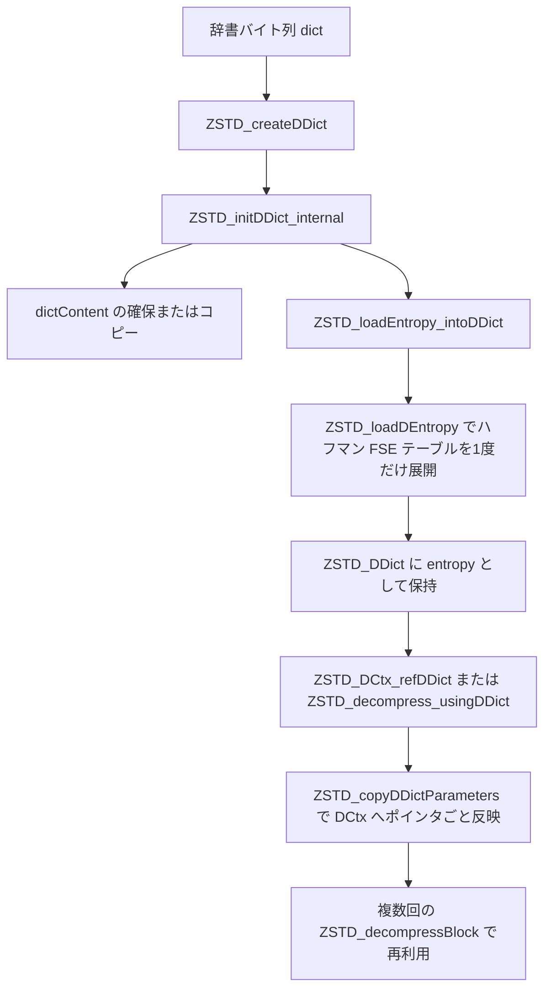

# 第24章 辞書復号：ZSTD_DDict

> **本章で読むソース**
>
> - [`lib/decompress/zstd_ddict.c`](https://github.com/facebook/zstd/blob/v1.5.7/lib/decompress/zstd_ddict.c)
> - [`lib/decompress/zstd_decompress.c`](https://github.com/facebook/zstd/blob/v1.5.7/lib/decompress/zstd_decompress.c)

## この章の狙い

第22章と第23章で見た復号処理は、フレームとブロックの中身だけを読んで完結していた。
しかし zstd の圧縮と復号は、フレームに含まれない共有データとして**辞書**（dictionary）を使える。
送信側と受信側が同じ辞書をあらかじめ持っていれば、フレームには辞書と重なる部分を書かずに済み、特に小さい入力の圧縮率を大きく引き上げられる。

辞書を使うたびに辞書の中身を解析し直すのは無駄が大きい。
**ZSTD_DDict**（Digested Dictionary、消化済み辞書）は、辞書の解析結果を1度だけ計算して保持しておく構造体であり、同じ辞書で何度も復号する用途を安く済ませる。
本章では、`ZSTD_DDict` が辞書から何を事前に取り出しておくか、その結果を復号コンテキスト（DCtx）へどう渡すか、そして辞書の内容そのものをコピーせず参照する経路をどう選べるかを、実装に沿って読む。

## 前提

zstd の辞書はただのバイト列でもよいし、専用の形式を持つ辞書でもよい。
専用形式の辞書は先頭にマジックナンバーを持ち、続けてエントロピー符号化のテーブル、さらに続けて実際の辞書内容（過去に伸長対象として使われた生バイト列）を格納する。
この使い分けを表す列挙体が `ZSTD_dictContentType_e` である。

[`lib/zstd.h` L1374-L1377](https://github.com/facebook/zstd/blob/v1.5.7/lib/zstd.h#L1374-L1377)

```c
    ZSTD_dct_auto = 0,       /* dictionary is "full" when starting with ZSTD_MAGIC_DICTIONARY, otherwise it is "rawContent" */
    ZSTD_dct_rawContent = 1, /* ensures dictionary is always loaded as rawContent, even if it starts with ZSTD_MAGIC_DICTIONARY */
    ZSTD_dct_fullDict = 2    /* refuses to load a dictionary if it does not respect Zstandard's specification, starting with ZSTD_MAGIC_DICTIONARY */
```

`ZSTD_dct_auto` はマジックナンバーの有無で自動判定し、`ZSTD_dct_rawContent` は中身をエントロピーテーブルとして解釈せず生の辞書内容として扱う。
`ZSTD_dct_fullDict` は専用形式でなければエラーにする、最も厳格なモードである。
`ZSTD_DDict` は、この判定結果に応じてエントロピーテーブルを事前展開するかどうかを切り替える。

## ZSTD_DDict の構造

`ZSTD_DDict` は不透明型として公開され、実体は `zstd_ddict.c` にだけ知られている。

[`lib/decompress/zstd_ddict.c` L35-L43](https://github.com/facebook/zstd/blob/v1.5.7/lib/decompress/zstd_ddict.c#L35-L43)

```c
struct ZSTD_DDict_s {
    void* dictBuffer;
    const void* dictContent;
    size_t dictSize;
    ZSTD_entropyDTables_t entropy;
    U32 dictID;
    U32 entropyPresent;
    ZSTD_customMem cMem;
};  /* typedef'd to ZSTD_DDict within "zstd.h" */
```

`dictContent` と `dictSize` は辞書の生バイト列を指す。
`dictBuffer` は辞書内容をコピーして保持する場合にだけ使われ、参照だけの場合は `NULL` のままになる。
`entropy` はハフマン復号表と3種類の FSE 復号表をまとめた `ZSTD_entropyDTables_t` であり、`entropyPresent` はこのテーブルが有効かどうかを示す。
`dictID` は辞書に埋め込まれた識別子で、フレームが要求する `dictID` との照合に使う。



## エントロピーテーブルの事前展開：ZSTD_loadEntropy_intoDDict

辞書を初期化する `ZSTD_initDDict_internal` は、辞書内容を確保してコピーしたあと、`ZSTD_loadEntropy_intoDDict` を呼んで辞書の中身を解析する。

[`lib/decompress/zstd_ddict.c` L91-L114](https://github.com/facebook/zstd/blob/v1.5.7/lib/decompress/zstd_ddict.c#L91-L114)

```c
static size_t
ZSTD_loadEntropy_intoDDict(ZSTD_DDict* ddict,
                           ZSTD_dictContentType_e dictContentType)
{
    ddict->dictID = 0;
    ddict->entropyPresent = 0;
    if (dictContentType == ZSTD_dct_rawContent) return 0;

    if (ddict->dictSize < 8) {
        if (dictContentType == ZSTD_dct_fullDict)
            return ERROR(dictionary_corrupted);   /* only accept specified dictionaries */
        return 0;   /* pure content mode */
    }
    {   U32 const magic = MEM_readLE32(ddict->dictContent);
        if (magic != ZSTD_MAGIC_DICTIONARY) {
            if (dictContentType == ZSTD_dct_fullDict)
                return ERROR(dictionary_corrupted);   /* only accept specified dictionaries */
            return 0;   /* pure content mode */
        }
    }
    ddict->dictID = MEM_readLE32((const char*)ddict->dictContent + ZSTD_FRAMEIDSIZE);

    /* load entropy tables */
    RETURN_ERROR_IF(ZSTD_isError(ZSTD_loadDEntropy(
            &ddict->entropy, ddict->dictContent, ddict->dictSize)),
        dictionary_corrupted, "");
    ddict->entropyPresent = 1;
    return 0;
}
```

`ZSTD_dct_rawContent` なら即座にテーブルなしで抜け、辞書サイズが8バイト未満、あるいはマジックナンバーが一致しない場合も「内容のみの辞書」として扱う。
専用形式が確認できた場合だけ `ZSTD_loadDEntropy` を呼び、ハフマン復号表と3つの FSE 復号表を組み立てる。

`ZSTD_loadDEntropy` 自体は第10章、第8章で読んだ `HUF_readDTableX2_wksp` と `ZSTD_buildFSETable` をそのまま使い、辞書の先頭に埋め込まれた正規化頻度（normalized count）からテーブルを構築する。

[`lib/decompress/zstd_decompress.c` L1448-L1476](https://github.com/facebook/zstd/blob/v1.5.7/lib/decompress/zstd_decompress.c#L1448-L1476)

```c
size_t
ZSTD_loadDEntropy(ZSTD_entropyDTables_t* entropy,
                  const void* const dict, size_t const dictSize)
{
    const BYTE* dictPtr = (const BYTE*)dict;
    const BYTE* const dictEnd = dictPtr + dictSize;

    RETURN_ERROR_IF(dictSize <= 8, dictionary_corrupted, "dict is too small");
    assert(MEM_readLE32(dict) == ZSTD_MAGIC_DICTIONARY);   /* dict must be valid */
    dictPtr += 8;   /* skip header = magic + dictID */

    ZSTD_STATIC_ASSERT(offsetof(ZSTD_entropyDTables_t, OFTable) == offsetof(ZSTD_entropyDTables_t, LLTable) + sizeof(entropy->LLTable));
    ZSTD_STATIC_ASSERT(offsetof(ZSTD_entropyDTables_t, MLTable) == offsetof(ZSTD_entropyDTables_t, OFTable) + sizeof(entropy->OFTable));
    ZSTD_STATIC_ASSERT(sizeof(entropy->LLTable) + sizeof(entropy->OFTable) + sizeof(entropy->MLTable) >= HUF_DECOMPRESS_WORKSPACE_SIZE);
    {   void* const workspace = &entropy->LLTable;   /* use fse tables as temporary workspace; implies fse tables are grouped together */
        size_t const workspaceSize = sizeof(entropy->LLTable) + sizeof(entropy->OFTable) + sizeof(entropy->MLTable);
```

`entropy->LLTable` 以降の FSE テーブル領域をハフマン復号表構築時の一時ワークスペースとして流用している点は、第4章で読んだ `ZSTD_cwksp` と同じ考え方であり、専用の作業バッファを別途持たずにメモリを節約する。
このあと offset、match length、literal length の3つの FSE テーブルと、辞書末尾に埋め込まれた3つの初期リピートコード（`entropy->rep`）を読み取って `ZSTD_DDict` に格納する。

**ここが本章の最適化の要点である。**
これらのテーブル構築は辞書サイズと辞書内のシンボル分布にしか依存せず、復号するフレームの中身には依存しない。
`ZSTD_DDict` を作る時点で1度だけ計算しておけば、同じ辞書を使う何百回も何千回もの復号呼び出しで、そのたびにテーブルを組み立て直す必要がなくなる。
辞書のテーブル構築コストを最初の1回だけに償却し、以降は展開済みのテーブルへのポインタを渡すだけで済むという設計である。

## DCtx への反映：ZSTD_copyDDictParameters

`ZSTD_DDict` を実際の復号に使うには、その内容を復号コンテキスト（DCtx）へ渡す必要がある。
この橋渡しをするのが `ZSTD_copyDDictParameters` である。

[`lib/decompress/zstd_ddict.c` L58-L81](https://github.com/facebook/zstd/blob/v1.5.7/lib/decompress/zstd_ddict.c#L58-L81)

```c
void ZSTD_copyDDictParameters(ZSTD_DCtx* dctx, const ZSTD_DDict* ddict)
{
    DEBUGLOG(4, "ZSTD_copyDDictParameters");
    assert(dctx != NULL);
    assert(ddict != NULL);
    dctx->dictID = ddict->dictID;
    dctx->prefixStart = ddict->dictContent;
    dctx->virtualStart = ddict->dictContent;
    dctx->dictEnd = (const BYTE*)ddict->dictContent + ddict->dictSize;
    dctx->previousDstEnd = dctx->dictEnd;
#ifdef FUZZING_BUILD_MODE_UNSAFE_FOR_PRODUCTION
    dctx->dictContentBeginForFuzzing = dctx->prefixStart;
    dctx->dictContentEndForFuzzing = dctx->previousDstEnd;
#endif
    if (ddict->entropyPresent) {
        dctx->litEntropy = 1;
        dctx->fseEntropy = 1;
        dctx->LLTptr = ddict->entropy.LLTable;
        dctx->MLTptr = ddict->entropy.MLTable;
        dctx->OFTptr = ddict->entropy.OFTable;
        dctx->HUFptr = ddict->entropy.hufTable;
        dctx->entropy.rep[0] = ddict->entropy.rep[0];
        dctx->entropy.rep[1] = ddict->entropy.rep[1];
        dctx->entropy.rep[2] = ddict->entropy.rep[2];
    } else {
        dctx->litEntropy = 0;
        dctx->fseEntropy = 0;
    }
}
```

`prefixStart` と `dictEnd` は、第23章で読んだシーケンス復号のオフセット参照先を、フレームの直前に置かれた仮想的なバイト列として辞書内容へ広げる役割を持つ。
辞書がオフセット参照可能な過去データとして働くのは、この2つのポインタ設定によるものであり、`ZSTD_decompressSequences` はフレーム内のデータと辞書内のデータを地続きのバッファとして扱える。

エントロピーテーブルの反映は `LLTptr` などのポインタを `ddict->entropy` の該当テーブルへ向け直すだけで済んでいる。
`ZSTD_loadEntropy_intoDDict` が事前に計算したテーブルの実体をコピーせず、DCtx 側は参照するだけになっている点が、この関数のもう一つの節約である。
初期リピートコード `rep[0..2]` だけは値そのものをコピーする。
リピートコードはブロックごとの復号中に更新される可変状態であり、`ZSTD_DDict` 側に持つ不変のテーブルとは扱いが異なるため、参照ではなく複製が必要になる。

`ZSTD_copyDDictParameters` は `ZSTD_decompressBegin_usingDDict` から呼ばれる。

[`lib/decompress/zstd_decompress.c` L1601-L1617](https://github.com/facebook/zstd/blob/v1.5.7/lib/decompress/zstd_decompress.c#L1601-L1617)

```c
size_t ZSTD_decompressBegin_usingDDict(ZSTD_DCtx* dctx, const ZSTD_DDict* ddict)
{
    DEBUGLOG(4, "ZSTD_decompressBegin_usingDDict");
    assert(dctx != NULL);
    if (ddict) {
        const char* const dictStart = (const char*)ZSTD_DDict_dictContent(ddict);
        size_t const dictSize = ZSTD_DDict_dictSize(ddict);
        const void* const dictEnd = dictStart + dictSize;
        dctx->ddictIsCold = (dctx->dictEnd != dictEnd);
        DEBUGLOG(4, "DDict is %s",
                    dctx->ddictIsCold ? "~cold~" : "hot!");
    }
    FORWARD_IF_ERROR( ZSTD_decompressBegin(dctx) , "");
    if (ddict) {   /* NULL ddict is equivalent to no dictionary */
        ZSTD_copyDDictParameters(dctx, ddict);
    }
    return 0;
}
```

`ddictIsCold` は、直前の復号で使った辞書と今回参照する辞書が同一かどうかを、`dictEnd` ポインタの一致だけで判定するフラグである。
同じ `ZSTD_DDict` を連続して使っている場合はポインタが変わらないため「hot」と判定され、辞書の内容が CPU キャッシュに残っている前提でプリフェッチの要否などを調整できる。
`ZSTD_decompressBegin` を呼んで DCtx の状態を初期化したあとに `ZSTD_copyDDictParameters` を呼ぶため、辞書のパラメーターはフレームごとの初期化の外側から一括して差し込まれる形になる。

## 1回限りの復号呼び出し：ZSTD_decompress_usingDDict

単発の呼び出しで辞書付き復号を完結させたい場合は `ZSTD_decompress_usingDDict` を使う。

[`lib/decompress/zstd_decompress.c` L1653-L1664](https://github.com/facebook/zstd/blob/v1.5.7/lib/decompress/zstd_decompress.c#L1653-L1664)

```c
/*! ZSTD_decompress_usingDDict() :
*   Decompression using a pre-digested Dictionary
*   Use dictionary without significant overhead. */
size_t ZSTD_decompress_usingDDict(ZSTD_DCtx* dctx,
                                  void* dst, size_t dstCapacity,
                            const void* src, size_t srcSize,
                            const ZSTD_DDict* ddict)
{
    /* pass content and size in case legacy frames are encountered */
    return ZSTD_decompressMultiFrame(dctx, dst, dstCapacity, src, srcSize,
                                     NULL, 0,
                                     ddict);
}
```

`ZSTD_decompressMultiFrame` は複数フレーム連結にも対応する第22章の入口関数であり、フレームごとに `ZSTD_decompressBegin_usingDDict` を呼んで同じ `ddict` を渡す。
1つの `ZSTD_DDict` を作っておけば、この関数を何度呼んでもエントロピーテーブルの再構築は起きない。

ストリーミング復号では、辞書を1度だけ結びつけて以後のセッションに固定する `ZSTD_DCtx_refDDict` を使う。

[`lib/decompress/zstd_decompress.c` L1780-L1798](https://github.com/facebook/zstd/blob/v1.5.7/lib/decompress/zstd_decompress.c#L1780-L1798)

```c
size_t ZSTD_DCtx_refDDict(ZSTD_DCtx* dctx, const ZSTD_DDict* ddict)
{
    RETURN_ERROR_IF(dctx->streamStage != zdss_init, stage_wrong, "");
    ZSTD_clearDict(dctx);
    if (ddict) {
        dctx->ddict = ddict;
        dctx->dictUses = ZSTD_use_indefinitely;
        if (dctx->refMultipleDDicts == ZSTD_rmd_refMultipleDDicts) {
            if (dctx->ddictSet == NULL) {
                dctx->ddictSet = ZSTD_createDDictHashSet(dctx->customMem);
                if (!dctx->ddictSet) {
                    RETURN_ERROR(memory_allocation, "Failed to allocate memory for hash set!");
                }
            }
            assert(!dctx->staticSize);  /* Impossible: ddictSet cannot have been allocated if static dctx */
            FORWARD_IF_ERROR(ZSTD_DDictHashSet_addDDict(dctx->ddictSet, ddict, dctx->customMem), "");
        }
    }
    return 0;
}
```

`dctx->ddict` にポインタを保持するだけで、この時点ではまだ `ZSTD_copyDDictParameters` を呼ばない。
実際の反映は、`ZSTD_decompressContinue` の内部で最初のフレームヘッダーを処理するときに `ZSTD_decompressBegin_usingDDict` 経由で行われる。
`dictUses` を `ZSTD_use_indefinitely` にしておくことで、セッションをまたいで同じ辞書を保持し続けられる。
1回限りの利用を意図する `ZSTD_DCtx_refPrefix` は同じ経路を通りつつ `dictUses` を `ZSTD_use_once` に設定し、次の復号が終わると辞書参照を自動的に解除する。

## コピーと参照：dictLoadMethod の選択

`ZSTD_DDict` の生成には、辞書内容をコピーする `ZSTD_createDDict` と、コピーせず参照だけを持つ `ZSTD_createDDict_byReference` の2つの入り口がある。
どちらも内部の `ZSTD_createDDict_advanced` に集約され、違いは `ZSTD_dictLoadMethod_e` の値だけである。

[`lib/decompress/zstd_ddict.c` L124-L142](https://github.com/facebook/zstd/blob/v1.5.7/lib/decompress/zstd_ddict.c#L124-L142)

```c
static size_t ZSTD_initDDict_internal(ZSTD_DDict* ddict,
                                      const void* dict, size_t dictSize,
                                      ZSTD_dictLoadMethod_e dictLoadMethod,
                                      ZSTD_dictContentType_e dictContentType)
{
    if ((dictLoadMethod == ZSTD_dlm_byRef) || (!dict) || (!dictSize)) {
        ddict->dictBuffer = NULL;
        ddict->dictContent = dict;
        if (!dict) dictSize = 0;
    } else {
        void* const internalBuffer = ZSTD_customMalloc(dictSize, ddict->cMem);
        ddict->dictBuffer = internalBuffer;
        ddict->dictContent = internalBuffer;
        if (!internalBuffer) return ERROR(memory_allocation);
        ZSTD_memcpy(internalBuffer, dict, dictSize);
    }
    ddict->dictSize = dictSize;
    ddict->entropy.hufTable[0] = (HUF_DTable)((ZSTD_HUFFDTABLE_CAPACITY_LOG)*0x1000001);  /* cover both little and big endian */

    /* parse dictionary content */
    FORWARD_IF_ERROR( ZSTD_loadEntropy_intoDDict(ddict, dictContentType) , "");

    return 0;
}
```

`ZSTD_dlm_byRef` では `dictContent` が呼び出し側のバッファをそのまま指し、`ZSTD_dlm_byCopy` では `ZSTD_customMalloc` で確保した内部バッファへコピーしてから指す。
by-reference を選べば辞書サイズぶんのメモリコピーと追加確保をまるごと省けるが、その代わり呼び出し側は `ZSTD_freeDDict` を呼ぶまで元の辞書バッファを解放してはならない。
複数の `ZSTD_DCtx` で同じ辞書を使い回す場合、by-reference で1つの `ZSTD_DDict` を共有すれば辞書内容の複製は1つも作らずに済み、エントロピーテーブルの事前展開と合わせて2重にメモリと時間を節約できる。

`ZSTD_DDict_dictContent` と `ZSTD_DDict_dictSize` は、こうして決まった `dictContent` と `dictSize` を外部へ公開する読み出し専用のアクセサである。

[`lib/decompress/zstd_ddict.c` L45-L53](https://github.com/facebook/zstd/blob/v1.5.7/lib/decompress/zstd_ddict.c#L45-L53)

```c
const void* ZSTD_DDict_dictContent(const ZSTD_DDict* ddict)
{
    assert(ddict != NULL);
    return ddict->dictContent;
}

size_t ZSTD_DDict_dictSize(const ZSTD_DDict* ddict)
{
    assert(ddict != NULL);
    return ddict->dictSize;
}
```

`ZSTD_decompressBegin_usingDDict` はこの2つを使って `dictEnd` を計算し、前述の `ddictIsCold` 判定に使っている。

最後に、辞書に埋め込まれた識別子を取り出す `ZSTD_getDictID_fromDDict` を見ておく。

[`lib/decompress/zstd_ddict.c` L237-L244](https://github.com/facebook/zstd/blob/v1.5.7/lib/decompress/zstd_ddict.c#L237-L244)

```c
unsigned ZSTD_getDictID_fromDDict(const ZSTD_DDict* ddict)
{
    if (ddict==NULL) return 0;
    return ddict->dictID;
}
```

`dictID` はフレームヘッダーに含まれる `dictID`（第22章参照）と突き合わせて、複数の辞書を使い分けるアプリケーションが正しい辞書を選べているかを確認するために使う。
値が0の場合は、辞書が専用形式に従っていないか、辞書自体が空であることを意味する。

## まとめ

`ZSTD_DDict` は、辞書のエントロピーテーブルと初期リピートコードを1度だけ解析して保持する消化済み辞書である。
`ZSTD_loadEntropy_intoDDict` が `ZSTD_dct_auto` などの判定に従ってハフマン復号表と3つの FSE 復号表を事前に構築しておくことで、同じ辞書を使う多数回の復号呼び出しからテーブル構築コストを取り除ける。
`ZSTD_copyDDictParameters` は、その結果を DCtx へポインタで参照させ、初期リピートコードだけを値としてコピーすることで、辞書内容そのものは複製せずに済ませる。
by-reference のロード方式と組み合わせれば、辞書内容のメモリコピーとエントロピーテーブルの再計算という2つのコストを、複数の DCtx、複数回の復号にわたって1度だけに抑えられる。

## 関連する章

- [第22章 フレーム復号](22-decompress-frame.md)
- [第23章 ブロック復号](23-decompress-block.md)
- [第8章 FSE 復号](../part02-entropy/08-fse-decompress.md)
- [第10章 Huffman 復号](../part02-entropy/10-huffman-decompress.md)
- [第25章 辞書ビルダー](../part07-dict/25-dictionary-builder.md)
