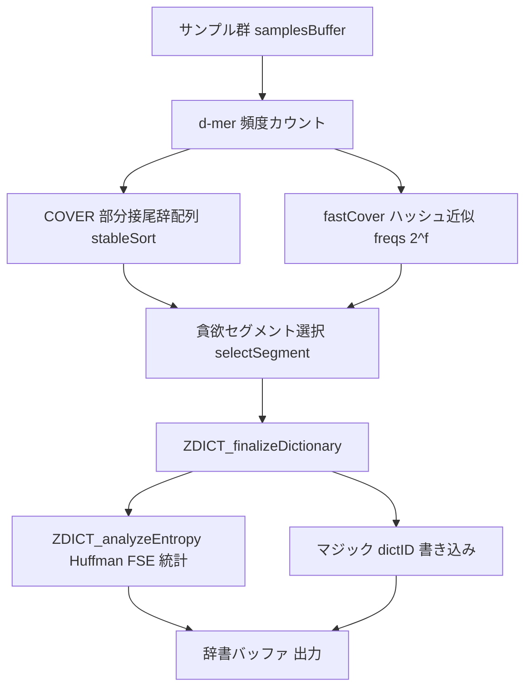

# 第25章 辞書ビルダー：COVER と fastCover

> **本章で読むソース**
>
> - [`lib/dictBuilder/zdict.c`](https://github.com/facebook/zstd/blob/v1.5.7/lib/dictBuilder/zdict.c)
> - [`lib/dictBuilder/cover.c`](https://github.com/facebook/zstd/blob/v1.5.7/lib/dictBuilder/cover.c)
> - [`lib/dictBuilder/fastcover.c`](https://github.com/facebook/zstd/blob/v1.5.7/lib/dictBuilder/fastcover.c)
> - [`lib/dictBuilder/divsufsort.c`](https://github.com/facebook/zstd/blob/v1.5.7/lib/dictBuilder/divsufsort.c)

## この章の狙い

第24章で見た辞書は、あらかじめ用意された「圧縮に効くバイト列」を圧縮コンテキストと復号コンテキストの双方に読み込ませることで、短い入力でも過去参照を効かせる仕組みだった。
その辞書の中身は誰が決めるのか。
本章では、大量のサンプルデータから辞書コンテンツを自動生成する `ZDICT_trainFromBuffer` の実装を追う。

辞書の効果は、サンプル群に繰り返し現れる部分文字列をどれだけ的確に拾えるかで決まる。
zstd はこの部分文字列選択に **COVER** アルゴリズムを実装し、その高速近似版として **fastCover** を追加した。
本章では、COVER が何を数えて何を選ぶか、fastCover がその計算量をどう削るか、そして選ばれたコンテンツにエントロピー統計を付与して辞書として出力するまでの流れを見る。

## 前提

辞書の材料選びは、次のように定式化できる。
サンプル群を1本の巨大なバイト列とみなし、そこから長さ `d` バイトの部分文字列（**d-mer**）を全位置について取り出す。
ある d-mer がサンプル群全体で頻繁に出現するなら、その d-mer を含む区間を辞書に入れておけば、将来の入力でも過去参照としてヒットしやすい。

COVER はこの発想を、"Effective Construction of Relative Lempel-Ziv Dictionaries" という論文にもとづいて実装したものである[^cover-paper]。
考え方は次の2段階に分かれる。

1. 全 d-mer の出現頻度を数える。
2. 長さ `k` バイトのセグメントを、含まれる d-mer の頻度の合計（**スコア**）が最大になるように貪欲に選び、辞書が埋まるまで繰り返す。

`d` と `k` はどちらもユーザーが調整できるパラメータであり、`ZDICT_optimizeTrainFromBuffer_cover` がこの2値の組を格子探索して最良の辞書を選ぶ。

[^cover-paper]:論文名は `cover.c` 冒頭のコメントに記載されている。



## 公開エントリ：既定は fastCover

`ZDICT_trainFromBuffer` はライブラリが公開する唯一の学習エントリだが、内部で選ぶアルゴリズムは COVER ではなく fastCover である。

[`lib/dictBuilder/zdict.c` L1107-1123](https://github.com/facebook/zstd/blob/v1.5.7/lib/dictBuilder/zdict.c#L1107-L1123)

```c
size_t ZDICT_trainFromBuffer(void* dictBuffer, size_t dictBufferCapacity,
                             const void* samplesBuffer,
                             const size_t* samplesSizes, unsigned nbSamples)
{
    ZDICT_fastCover_params_t params;
    DEBUGLOG(3, "ZDICT_trainFromBuffer");
    memset(&params, 0, sizeof(params));
    params.d = 8;
    params.steps = 4;
    /* Use default level since no compression level information is available */
    params.zParams.compressionLevel = ZSTD_CLEVEL_DEFAULT;
#if defined(DEBUGLEVEL) && (DEBUGLEVEL>=1)
    params.zParams.notificationLevel = DEBUGLEVEL;
#endif
    return ZDICT_optimizeTrainFromBuffer_fastCover(dictBuffer, dictBufferCapacity,
                                               samplesBuffer, samplesSizes, nbSamples,
                                               &params);
}
```

`d=8` に固定し `steps=4` という粗い探索幅を渡すだけで、`k` はゼロのまま `ZDICT_optimizeTrainFromBuffer_fastCover` に委ねている。
COVER 版の学習関数（`ZDICT_trainFromBuffer_cover` や `ZDICT_optimizeTrainFromBuffer_cover`）も静的ライブラリとしては公開されているが、`ZDICT_STATIC_LINKING_ONLY` を定義しないと使えない実験用 API という位置づけである。
既定経路が高速近似の fastCover である理由は、次節以降で見るとおり COVER の頻度カウントが接尾辞配列のソートを要し、サンプルが大きいと学習自体が実用的な時間で終わらないためである。

## COVER：部分接尾辞配列による厳密な頻度カウント

COVER は、全 d-mer の出現頻度を**部分接尾辞配列**で数える。
接尾辞配列そのもの（`divsufsort`）は後述する legacy 経路が使うだけで、COVER 本体は使わない。
COVER が使うのは、全サンプルを連結したバイト列の各位置を、先頭 `d` バイトだけで安定ソートした配列である。

`COVER_ctx_init` で、位置配列 `suffix[i]=i` を初期化してからこのソートを呼ぶ。

[`lib/dictBuilder/cover.c` L664-674](https://github.com/facebook/zstd/blob/v1.5.7/lib/dictBuilder/cover.c#L664-L674)

```c
  DISPLAYLEVEL(2, "Constructing partial suffix array\n");
  {
    /* suffix is a partial suffix array.
     * It only sorts suffixes by their first parameters.d bytes.
     * The sort is stable, so each dmer group is sorted by position in input.
     */
    U32 i;
    for (i = 0; i < ctx->suffixSize; ++i) {
      ctx->suffix[i] = i;
    }
    stableSort(ctx);
  }
```

比較は先頭 `d` バイトだけを見て行われ、安定ソートであるため同じ d-mer を持つ位置どうしはサンプル中の出現順を保ったまま隣接する。
この並びさえあれば、同じ d-mer を持つ連続区間の長さを数えるだけで頻度がわかり、実際の並べ替えに `O(n log n)` かかる代わりに、フルの接尾辞配列より軽い比較で済む。
`stableSort` は環境ごとに `qsort_r`（GNU 拡張）や自前のマージソートへ分岐する（[`lib/dictBuilder/cover.c` L326-348](https://github.com/facebook/zstd/blob/v1.5.7/lib/dictBuilder/cover.c#L326-L348)）。

隣接区間から頻度を数える処理は `COVER_group` が担う。

[`lib/dictBuilder/cover.c` L405-449](https://github.com/facebook/zstd/blob/v1.5.7/lib/dictBuilder/cover.c#L405-L449)

```c
static void COVER_group(COVER_ctx_t *ctx, const void *group,
                        const void *groupEnd) {
  /* The group consists of all the positions with the same first d bytes. */
  const U32 *grpPtr = (const U32 *)group;
  const U32 *grpEnd = (const U32 *)groupEnd;
  /* The dmerId is how we will reference this dmer.
   * This allows us to map the whole dmer space to a much smaller space, the
   * size of the suffix array.
   */
  const U32 dmerId = (U32)(grpPtr - ctx->suffix);
  /* Count the number of samples this dmer shows up in */
  U32 freq = 0;
  /* Details */
  const size_t *curOffsetPtr = ctx->offsets;
  const size_t *offsetsEnd = ctx->offsets + ctx->nbSamples;
  /* Once *grpPtr >= curSampleEnd this occurrence of the dmer is in a
   * different sample than the last.
   */
  size_t curSampleEnd = ctx->offsets[0];
  for (; grpPtr != grpEnd; ++grpPtr) {
    /* Save the dmerId for this position so we can get back to it. */
    ctx->dmerAt[*grpPtr] = dmerId;
    /* Dictionaries only help for the first reference to the dmer.
     * After that zstd can reference the match from the previous reference.
     * So only count each dmer once for each sample it is in.
     */
    if (*grpPtr < curSampleEnd) {
      continue;
    }
    freq += 1;
    /* Binary search to find the end of the sample *grpPtr is in.
     * In the common case that grpPtr + 1 == grpEnd we can skip the binary
     * search because the loop is over.
     */
    if (grpPtr + 1 != grpEnd) {
      const size_t *sampleEndPtr =
          COVER_lower_bound(curOffsetPtr, offsetsEnd, *grpPtr);
      curSampleEnd = *sampleEndPtr;
      curOffsetPtr = sampleEndPtr + 1;
    }
  }
```

同じ d-mer が同一サンプル内で何度出現しても、頻度としては1回しか数えない。
1つのサンプルの中でだけ大量に繰り返す部分文字列に辞書の枠を独占されないようにするための調整であり、COVER がねらう「多くの異なるサンプルに共通する部分文字列」という基準を反映している。
`dmerId` は、この d-mer グループが接尾辞配列中で占める先頭位置そのものであり、頻度の保存先にも再利用される。

[`lib/dictBuilder/cover.c` L446-452](https://github.com/facebook/zstd/blob/v1.5.7/lib/dictBuilder/cover.c#L446-L452)

```c
  /* At this point we are never going to look at this segment of the suffix
   * array again.  We take advantage of this fact to save memory.
   * We store the frequency of the dmer in the first position of the group,
   * which is dmerId.
   */
  ctx->suffix[dmerId] = freq;
}
```

d-mer とその出現位置の対応は `ctx->dmerAt[position]=dmerId` に、頻度はもう使われなくなった `ctx->suffix[dmerId]` の枠に上書き保存する。
別の配列を新たに確保せず既存のバッファを再利用する点も、大きなサンプル集合をメモリに収めるための工夫である。

## 貪欲セグメント選択：COVER_selectSegment と COVER_buildDictionary

頻度表ができれば、そこから長さ `k` バイトのセグメントを貪欲に選ぶ。
`COVER_selectSegment` は、エポック（データを分割した区間）の中で長さ `k` のスライディングウィンドウを動かし、含まれる d-mer 頻度の合計が最大になる位置を探す。

[`lib/dictBuilder/cover.c` L484-511](https://github.com/facebook/zstd/blob/v1.5.7/lib/dictBuilder/cover.c#L484-L511)

```c
  while (activeSegment.end < end) {
    /* The dmerId for the dmer at the next position */
    U32 newDmer = ctx->dmerAt[activeSegment.end];
    /* The entry in activeDmers for this dmerId */
    U32 *newDmerOcc = COVER_map_at(activeDmers, newDmer);
    /* If the dmer isn't already present in the segment add its score. */
    if (*newDmerOcc == 0) {
      /* The paper suggest using the L-0.5 norm, but experiments show that it
       * doesn't help.
       */
      activeSegment.score += freqs[newDmer];
    }
    /* Add the dmer to the segment */
    activeSegment.end += 1;
    *newDmerOcc += 1;

    /* If the window is now too large, drop the first position */
    if (activeSegment.end - activeSegment.begin == dmersInK + 1) {
      U32 delDmer = ctx->dmerAt[activeSegment.begin];
      U32 *delDmerOcc = COVER_map_at(activeDmers, delDmer);
      activeSegment.begin += 1;
      *delDmerOcc -= 1;
      /* If this is the last occurrence of the dmer, subtract its score */
      if (*delDmerOcc == 0) {
        COVER_map_remove(activeDmers, delDmer);
        activeSegment.score -= freqs[delDmer];
      }
    }
```

ウィンドウを1バイトずつ右にずらしながら、新しく入った d-mer が初登場ならスコアに加算し、押し出された d-mer がウィンドウ内から消えたならスコアから引く。
この差分更新により、ウィンドウ全体のスコアを毎回数え直さずに1回のシフトを定数時間で処理できる。
最良のセグメントが決まれば、その区間に含まれる d-mer の頻度をすべてゼロに落とす（[`lib/dictBuilder/cover.c` L536-540](https://github.com/facebook/zstd/blob/v1.5.7/lib/dictBuilder/cover.c#L536-L540)）。
一度採用した部分文字列を二重にカウントしないための処理であり、次のセグメント選択では別の部分文字列を選ばせる圧力になる。

セグメント選択をエポックごとに繰り返し、辞書バッファを埋めていくのが `COVER_buildDictionary` である。

[`lib/dictBuilder/cover.c` L749-769](https://github.com/facebook/zstd/blob/v1.5.7/lib/dictBuilder/cover.c#L749-L769)

```c
  for (epoch = 0; tail > 0; epoch = (epoch + 1) % epochs.num) {
    const U32 epochBegin = (U32)(epoch * epochs.size);
    const U32 epochEnd = epochBegin + epochs.size;
    size_t segmentSize;
    /* Select a segment */
    COVER_segment_t segment = COVER_selectSegment(
        ctx, freqs, activeDmers, epochBegin, epochEnd, parameters);
    /* If the segment covers no dmers, then we are out of content. */
    if (segment.score == 0) {
      if (++zeroScoreRun >= maxZeroScoreRun) {
          break;
      }
      continue;
    }
    zeroScoreRun = 0;
    segmentSize = MIN(segment.end - segment.begin + parameters.d - 1, tail);
    if (segmentSize < parameters.d) {
      break;
    }
    /* We fill the dictionary from the back to allow the best segments to be
     * referenced with the smallest offsets.
     */
    tail -= segmentSize;
    memcpy(dict + tail, ctx->samples + segment.begin, segmentSize);
```

辞書バッファは**末尾から先頭に向かって**埋める。
第24章で見たとおり辞書の内容は復号側のウィンドウの直前に置かれ、参照時のオフセットは辞書末尾に近いほど小さくて済む。
最初に選ばれる、つまりスコアが最も高い区間ほど末尾寄りの小さいオフセットで参照できるよう、意図的に後方から詰めている。
エポックを一巡してもスコア0のセグメントが `maxZeroScoreRun` 回続くと、データが尽きたとみなして打ち切る（[`lib/dictBuilder/cover.c` L749-761](https://github.com/facebook/zstd/blob/v1.5.7/lib/dictBuilder/cover.c#L749-L761)）。

`d` と `k` の最適な組み合わせは事前にはわからないため、`ZDICT_optimizeTrainFromBuffer_cover` が格子探索でこれを決める。

[`lib/dictBuilder/cover.c` L1176-1180](https://github.com/facebook/zstd/blob/v1.5.7/lib/dictBuilder/cover.c#L1176-L1180)

```c
  const unsigned kMinD = parameters->d == 0 ? 6 : parameters->d;
  const unsigned kMaxD = parameters->d == 0 ? 8 : parameters->d;
  const unsigned kMinK = parameters->k == 0 ? 50 : parameters->k;
  const unsigned kMaxK = parameters->k == 0 ? 2000 : parameters->k;
  const unsigned kSteps = parameters->steps == 0 ? 40 : parameters->steps;
```

既定では `d` を6と8の2値、`k` を50から2000まで40段階に振り、組み合わせごとに辞書を作って実測サイズを比較する。
`parameters->nbThreads` が1より大きければ `POOL` によるスレッドプールでこの探索を並列実行する。

## fastCover：ハッシュによる頻度の近似

COVER の頻度カウントは接尾辞配列相当のソートを要し、計算量はサンプル総サイズに対して `O(n log n)` になる。
fastCover は、このソートを1本のハッシュテーブルへの書き込みに置き換えることで頻度カウントを線形時間に近づける。

[`lib/dictBuilder/fastcover.c` L92-97](https://github.com/facebook/zstd/blob/v1.5.7/lib/dictBuilder/fastcover.c#L92-L97)

```c
static size_t FASTCOVER_hashPtrToIndex(const void* p, U32 f, unsigned d) {
  if (d == 6) {
    return ZSTD_hash6Ptr(p, f);
  }
  return ZSTD_hash8Ptr(p, f);
}
```

`d` バイトの d-mer を、`f` ビットのハッシュ値に写像する。
頻度テーブルは `2^f` エントリの配列 `freqs` であり、d-mer そのものを保持せず、ハッシュ値をインデックスとしてカウンタをインクリメントするだけで済む。

[`lib/dictBuilder/fastcover.c` L284-301](https://github.com/facebook/zstd/blob/v1.5.7/lib/dictBuilder/fastcover.c#L284-L301)

```c
static void
FASTCOVER_computeFrequency(U32* freqs, const FASTCOVER_ctx_t* ctx)
{
    const unsigned f = ctx->f;
    const unsigned d = ctx->d;
    const unsigned skip = ctx->accelParams.skip;
    const unsigned readLength = MAX(d, 8);
    size_t i;
    assert(ctx->nbTrainSamples >= 5);
    assert(ctx->nbTrainSamples <= ctx->nbSamples);
    for (i = 0; i < ctx->nbTrainSamples; i++) {
        size_t start = ctx->offsets[i];  /* start of current dmer */
        size_t const currSampleEnd = ctx->offsets[i+1];
        while (start + readLength <= currSampleEnd) {
            const size_t dmerIndex = FASTCOVER_hashPtrToIndex(ctx->samples + start, f, d);
            freqs[dmerIndex]++;
            start = start + skip + 1;
        }
    }
}
```

ハッシュ値が衝突すれば、本来別々の d-mer の頻度が合算されてしまう。
`f` を大きくすればテーブルが広がり衝突は減るが、その分メモリと構築コストが増える。
`f` は既定で20ビット（`2^20` エントリ、[`lib/dictBuilder/fastcover.c` L46](https://github.com/facebook/zstd/blob/v1.5.7/lib/dictBuilder/fastcover.c#L46)）であり、衝突の可能性と引き換えに、COVER のソートより大幅に軽い1パスの走査でサンプル全体を処理する。
これが fastCover における最適化の核であり、`skip`（`accel` パラメータから決まる間引き幅）を使えばサンプルを間引いて走査量そのものも削れる。

また、同一サンプル内での重複除去は行わない。
COVER が「異なるサンプルに共通する部分文字列」を重視するのに対し、fastCover は近似頻度をそのまま使うぶん、この区別を犠牲にして速度を優先している。

セグメント選択自体は COVER と同じ貪欲スライディングウィンドウであり、`FASTCOVER_selectSegment`（[`lib/dictBuilder/fastcover.c` L156-227](https://github.com/facebook/zstd/blob/v1.5.7/lib/dictBuilder/fastcover.c#L156-L227)）が `ctx->dmerAt` の代わりにその場でハッシュ値を計算しながら同じスコア更新を行う。
`d` と `k` の探索範囲も COVER と同一であり、fastCover 固有の `f` と `accel` が既定値20と1として加わる（[`lib/dictBuilder/fastcover.c` L629-641](https://github.com/facebook/zstd/blob/v1.5.7/lib/dictBuilder/fastcover.c#L629-L641)）。

## 辞書の組み立て：ZDICT_finalizeDictionary

COVER と fastCover のどちらでコンテンツが選ばれても、最終的な辞書バッファの組み立ては共通の `ZDICT_finalizeDictionary` が行う。

[`lib/dictBuilder/zdict.c` L877-891](https://github.com/facebook/zstd/blob/v1.5.7/lib/dictBuilder/zdict.c#L877-L891)

```c
    /* dictionary header */
    MEM_writeLE32(header, ZSTD_MAGIC_DICTIONARY);
    {   U64 const randomID = XXH64(customDictContent, dictContentSize, 0);
        U32 const compliantID = (randomID % ((1U<<31)-32768)) + 32768;
        U32 const dictID = params.dictID ? params.dictID : compliantID;
        MEM_writeLE32(header+4, dictID);
    }
    hSize = 8;

    /* entropy tables */
    DISPLAYLEVEL(2, "\r%70s\r", "");   /* clean display line */
    DISPLAYLEVEL(2, "statistics ... \n");
    {   size_t const eSize = ZDICT_analyzeEntropy(header+hSize, HBUFFSIZE-hSize,
                                  compressionLevel,
                                  samplesBuffer, samplesSizes, nbSamples,
                                  customDictContent, dictContentSize,
                                  notificationLevel);
        if (ZDICT_isError(eSize)) return eSize;
        hSize += eSize;
    }
```

辞書は先頭4バイトのマジックナンバー `ZSTD_MAGIC_DICTIONARY`（`0xEC30A437`、[`lib/zstd.h` L143](https://github.com/facebook/zstd/blob/v1.5.7/lib/zstd.h#L143)）と、続く4バイトの `dictID` から始まる。
`dictID` が明示されなければ、コンテンツの XXH64 ハッシュから予約域を避けて生成する。
続けて `ZDICT_analyzeEntropy` がリテラルおよびリテラル長、マッチ長、オフセットのエントロピー統計を書き込み、最後にコンテンツ本体が続く。

コンテンツをそのままヘッダの直後には置かず、必要ならパディングを挟む。

[`lib/dictBuilder/zdict.c` L915-917](https://github.com/facebook/zstd/blob/v1.5.7/lib/dictBuilder/zdict.c#L915-L917)

```c
        /* The dictionary consists of the header, optional padding, and the content.
         * The padding comes before the content because the "best" position in the
         * dictionary is the last byte.
         */
```

「辞書の最良位置は末尾バイト」という原則は、COVER の後方充填と同じ理由による。
辞書コンテンツを常に辞書バッファの末尾に置き、その手前にパディングを挟むことで、最も参照されやすい部分文字列を復号ウィンドウに一番近い、最小オフセットの位置に固定している。

## エントロピー統計の埋め込み：ZDICT_analyzeEntropy

辞書には部分文字列のコンテンツだけでなく、Huffman テーブルと FSE テーブルもあらかじめ埋め込まれる。
`ZDICT_analyzeEntropy` は、選ばれたコンテンツを実際に辞書として使い、サンプルを1ブロックずつ圧縮してその統計を集める。

[`lib/dictBuilder/zdict.c` L566-609](https://github.com/facebook/zstd/blob/v1.5.7/lib/dictBuilder/zdict.c#L566-L609)

```c
static void ZDICT_countEStats(EStats_ress_t esr, const ZSTD_parameters* params,
                              unsigned* countLit, unsigned* offsetcodeCount, unsigned* matchlengthCount, unsigned* litlengthCount, U32* repOffsets,
                              const void* src, size_t srcSize,
                              U32 notificationLevel)
{
    ...
    cSize = ZSTD_compressBlock_deprecated(esr.zc, esr.workPlace, ZSTD_BLOCKSIZE_MAX, src, srcSize);
    if (ZSTD_isError(cSize)) { DISPLAYLEVEL(3, "warning : could not compress sample size %u \n", (unsigned)srcSize); return; }

    if (cSize) {  /* if == 0; block is not compressible */
        const SeqStore_t* const seqStorePtr = ZSTD_getSeqStore(esr.zc);

        /* literals stats */
        {   const BYTE* bytePtr;
            for(bytePtr = seqStorePtr->litStart; bytePtr < seqStorePtr->lit; bytePtr++)
                countLit[*bytePtr]++;
        }

        /* seqStats */
        {   U32 const nbSeq = (U32)(seqStorePtr->sequences - seqStorePtr->sequencesStart);
            ZSTD_seqToCodes(seqStorePtr);
            ...
```

各サンプルを実際に `ZSTD_compressBlock_deprecated` で圧縮し、第12章で見た seqStore からリテラルとリテラル長、マッチ長、オフセットのコードをそのまま数え上げる。
辞書生成の段階で本物の圧縮パイプラインを走らせることで、実際の圧縮時と同じ分布のリテラルコードから統計を得ている。
この頻度をもとに、第9章で扱った `HUF_buildCTable_wksp` でリテラルの Huffman テーブルを、第7章で扱った `FSE_normalizeCount` で3系統の正規化カウントを作り、`HUF_writeCTable_wksp` と `FSE_writeNCount` で辞書ヘッダへ直列に書き出す（[`lib/dictBuilder/zdict.c` L725-812](https://github.com/facebook/zstd/blob/v1.5.7/lib/dictBuilder/zdict.c#L725-L812)）。

こうして埋め込まれたテーブルは、辞書を読み込んだ圧縮コンテキストが最初のブロックから使う初期テーブルになる。
入力が小さく分布を学習する余地がない場合でも、辞書由来のテーブルによって既定分布よりましな符号化から圧縮を始められる。

## legacy 経路と divsufsort

`ZDICT_trainFromBuffer_legacy`（[`lib/dictBuilder/zdict.c` L978](https://github.com/facebook/zstd/blob/v1.5.7/lib/dictBuilder/zdict.c#L978)）という、COVER 以前から存在する古い学習経路も残っている。
こちらは接尾辞配列そのものを構築する。

[`lib/dictBuilder/zdict.c` L506](https://github.com/facebook/zstd/blob/v1.5.7/lib/dictBuilder/zdict.c#L506)

```c
    {   int const divSuftSortResult = divsufsort((const unsigned char*)buffer, suffix, (int)bufferSize, 0);
```

`divsufsort` は Yuta Mori による DivSufSort アルゴリズムの実装であり、全サンプルを連結したバイト列から完全な接尾辞配列を線形時間に近い計算量で構築する。
COVER と fastCover はこの完全な接尾辞配列を使わず、それぞれ部分ソートとハッシュ近似で代替している。
legacy 経路は COVER 登場以前の実装であり、現在の既定経路である `ZDICT_trainFromBuffer` からは呼ばれない。

## まとめ

`ZDICT_trainFromBuffer` は既定で fastCover を呼び出し、サンプル群から辞書コンテンツを自動生成する。
COVER は全 d-mer の頻度を部分接尾辞配列で厳密に数え、貪欲なスライディングウィンドウで最もスコアの高いセグメントをエポックごとに選び、辞書バッファの末尾から詰めていく。
fastCover は、この頻度カウントを `2^f` エントリのハッシュテーブルへの近似カウントに置き換えることで、接尾辞配列のソートを避けて計算量を大きく下げる。
どちらの経路で選ばれたコンテンツも `ZDICT_finalizeDictionary` がマジックナンバーと `dictID` を付与し、`ZDICT_analyzeEntropy` が実際の圧縮パイプラインを走らせて得た Huffman と FSE の統計を辞書ヘッダに埋め込む。

## 関連する章

- [第24章 DDict とプリフィックス辞書](../part06-decompress/24-ddict.md)
- [第14章 シーケンスの符号化](../part03-compress-core/14-sequences-encoding.md)
- [第9章 Huffman 符号化：圧縮](../part02-entropy/09-huffman-compress.md)
- [第7章 FSE 符号化：正規化カウントと状態遷移テーブル](../part02-entropy/07-fse-compress.md)
